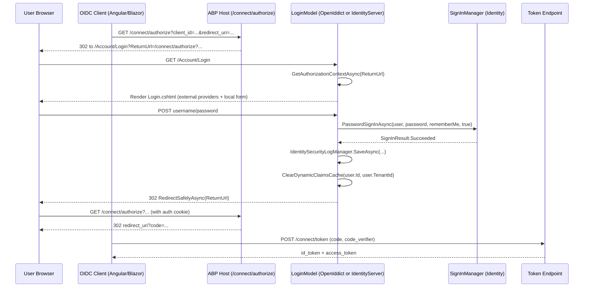
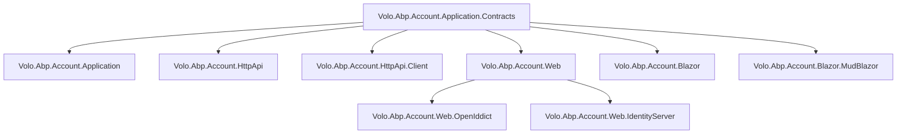

The ABP Framework **Account module** lives under `modules/account/src/` and ships the self-service authentication surface: registration, password reset, profile management, and the Razor Pages that drive interactive login for the two supported OAuth/OIDC hosts (OpenIddict and the legacy IdentityServer4-based stack). Unlike the `Volo.Abp.Identity` module — which is about *who* the user is, the persisted entities, and the management UI for administrators — the Account module is everything an *end user* touches when they sign in to an ABP application.

## Package layout

Every Account package lives under a sibling folder of `modules/account/src/`:

<CardGroup cols={2}>
  <Card title="Volo.Abp.Account.Application.Contracts" icon="file-signature">
    DTOs (`RegisterDto`, `ResetPasswordDto`, `ProfileDto`, `ChangePasswordInput`), service interfaces (`IAccountAppService`, `IProfileAppService`, `IDynamicClaimsAppService`), `AccountResource`, `AccountSettingNames`, `AccountRemoteServiceConsts`.
  </Card>
  <Card title="Volo.Abp.Account.Application" icon="gear">
    Implementations: `AccountAppService`, `ProfileAppService`, `DynamicClaimsAppService`, `AccountEmailer`, `AccountEmailTemplateDefinitionProvider`, `AccountSettingDefinitionProvider`, Mapperly mappers.
  </Card>
  <Card title="Volo.Abp.Account.HttpApi" icon="plug">
    `AccountController`, `ProfileController`, `DynamicClaimsController` — the auto-API surface for the application services.
  </Card>
  <Card title="Volo.Abp.Account.HttpApi.Client" icon="globe">
    Static client proxies (`AccountClientProxy.Generated.cs`, `ProfileClientProxy.Generated.cs`, `DynamicClaimsClientProxy.Generated.cs`) registered through `AddStaticHttpClientProxies`.
  </Card>
  <Card title="Volo.Abp.Account.Web" icon="window">
    Shared Razor Pages used by both hosts: `Login.cshtml`, `Register.cshtml`, `ForgotPassword.cshtml`, `ResetPassword.cshtml`, `Manage.cshtml`, plus the MVC-style `Areas/Account/Controllers/AccountController`.
  </Card>
  <Card title="Volo.Abp.Account.Web.OpenIddict" icon="key">
    `OpenIddictSupportedLoginModel` — derives from the shared `LoginModel` and integrates with `AbpOpenIddictRequestHelper` and the OpenIddict server transaction pipeline.
  </Card>
  <Card title="Volo.Abp.Account.Web.IdentityServer" icon="lock">
    `IdentityServerSupportedLoginModel`, `IdentityServerSupportedLogoutModel`, the `Consent.cshtml` page, `ErrorController`, and IdentityServer-specific configuration for `IdentityServerOptions.UserInteraction`.
  </Card>
  <Card title="Volo.Abp.Account.Blazor / .MudBlazor" icon="palette">
    `AccountManage.razor` + `.razor.cs`, `AbpAccountBlazorUserMenuContributor`, the Mapperly profile, plus the MudBlazor twin that ships an identical surface for the MudBlazor theme.
  </Card>
</CardGroup>

`Volo.Abp.Account.Installer` is an empty marker module used by ABP Suite/CLI tooling to detect that the module is installed; it has a single file, `Volo/Abp/Account/AbpAccountInstallerModule.cs`.

## Two hosts, one shared web layer

The most important thing to understand about Account is the **two-tier composition** between `Volo.Abp.Account.Web` and the two host packages. The shared `Volo.Abp.Account.Web` package owns every Razor Page — `Pages/Account/Login.cshtml`, `Pages/Account/Register.cshtml`, `Pages/Account/Logout.cshtml`, and so on — but the page models (`LoginModel`, `LogoutModel`) deliberately know nothing about the underlying OAuth/OIDC server. Each host package then *replaces* the relevant page model with a derived class via `[ExposeServices(typeof(LoginModel))]`:

- `Volo.Abp.Account.Web.OpenIddict/Pages/Account/OpenIddictSupportedLoginModel.cs` exposes itself as `LoginModel`, so the same `Login.cshtml` renders but its handlers integrate with `AbpOpenIddictRequestHelper` and the OpenIddict server transaction.
- `Volo.Abp.Account.Web.IdentityServer/Pages/Account/IdentityServerSupportedLoginModel.cs` does the same for IdentityServer4: it injects `IIdentityServerInteractionService`, `IClientStore`, and `IEventService` and overrides the OnGet/OnPost handlers.

This pattern means hosts pick a single host package to depend on (never both) and inherit the entire UI without forking the views.

## Login flow across hosts

The OAuth `authorization_code` flow is identical from the client perspective whether the host is OpenIddict or IdentityServer; the only difference is the page-model class that gets resolved by ABP's DI when the user hits `/Account/Login`.



The `PasswordSignInAsync` call comes from ASP.NET Core Identity's `SignInManager<IdentityUser>`; it is not overridden by ABP. What ABP adds is everything around it: tenant scoping (the input string is matched against `FindByNameAsync` then `FindByEmailAsync`, see `ReplaceEmailToUsernameOfInputIfNeeds` in `Volo.Abp.Account.Web/Pages/Account/Login.cshtml.cs`), security logging via `IdentitySecurityLogManager.SaveAsync`, dynamic claims cache invalidation via `IdentityDynamicClaimsPrincipalContributorCache.ClearAsync`, and the safe return URL handling implemented by `AccountPageModel.RedirectSafelyAsync`.

## What the user-facing surface includes

`Volo.Abp.Account.Web/Pages/Account/` contains all of:

| Page | Page model | Purpose |
| --- | --- | --- |
| `Login.cshtml` | `LoginModel` | Local + external login, Windows auth handoff. |
| `Register.cshtml` | `RegisterModel` | Self-registration; also completes external-login provisioning. |
| `ForgotPassword.cshtml` | `ForgotPasswordModel` | Triggers `IAccountAppService.SendPasswordResetCodeAsync`. |
| `PasswordResetLinkSent.cshtml` | `PasswordResetLinkSentModel` | Confirmation screen. |
| `ResetPassword.cshtml` | `ResetPasswordModel` | Validates the reset token and posts a new password. |
| `ResetPasswordConfirmation.cshtml` | `ResetPasswordConfirmationModel` | "Your password was reset" page. |
| `Logout.cshtml` | `LogoutModel` | Signs out via `SignInManager.SignOutAsync()`. |
| `LoggedOut.cshtml` | `LoggedOutModel` | Post-logout landing page (used by IdentityServer for client signout iframe). |
| `Manage.cshtml` | `ManageModel` | Profile management hub driven by `ProfileManagementPageOptions.Contributors`. |
| `AccessDenied.cshtml` | `AccessDeniedModel` | Default 403 page. |

The Razor Pages all inherit from `Volo.Abp.Account.Web/Pages/Account/AccountPageModel.cs`, which exposes `AccountAppService`, `SignInManager<IdentityUser>`, `IdentityUserManager`, `IdentitySecurityLogManager`, `IOptions<IdentityOptions>`, and `IExceptionToErrorInfoConverter` as injectable property setters.

## Settings and permissions

The module registers exactly two settings in `Volo.Abp.Account.Application/Volo/Abp/Account/Settings/AccountSettingDefinitionProvider.cs`:

- `Abp.Account.IsSelfRegistrationEnabled` (default `"true"`) — checked by `LoginModel`, `RegisterModel`, and the public `AccountAppService.CheckSelfRegistrationAsync`.
- `Abp.Account.EnableLocalLogin` (default `"true"`) — checked by `CheckLocalLoginAsync` in both `LoginModel` and the API-style `AccountController` under `Areas/Account/Controllers/`.

Both are marked `isVisibleToClients: true` so the Angular/Blazor SPA can pre-flight the login screen. The constant names live in `Volo.Abp.Account.Application.Contracts/Volo/Abp/Account/Settings/AccountSettingNames.cs`.

The Account module deliberately ships **no `PermissionDefinitionProvider`** — there is no `AbpAccountPermissions` static class. The administrative side of user management belongs to `Volo.Abp.Identity`, and `ProfileAppService` only needs `[Authorize]` because every signed-in user can manage their own profile.

## Module dependency graph

`Volo.Abp.Account.Application.Contracts/Volo/Abp/Account/AbpAccountApplicationContractsModule.cs` depends on `AbpIdentityApplicationContractsModule`. The application module (`AbpAccountApplicationModule`) adds `AbpIdentityApplicationModule`, `AbpUiNavigationModule`, `AbpEmailingModule`, and `AbpMapperlyModule`. The HTTP API module (`AbpAccountHttpApiModule`) brings in `AbpIdentityHttpApiModule` and `AbpAspNetCoreMvcModule`; the HTTP API client (`AbpAccountHttpApiClientModule`) depends only on contracts and `AbpHttpClientModule`. On the web side, `AbpAccountWebModule` depends on contracts plus `AbpIdentityAspNetCoreModule`, `AbpAspNetCoreMvcUiThemeSharedModule`, and `AbpExceptionHandlingModule`. The host packages add OpenIddict or IdentityServer modules on top.



A typical ABP Suite application picks one path: an MVC tiered solution will depend on `Volo.Abp.Account.Web.OpenIddict` (or `.IdentityServer` for legacy templates) on the auth-server host, plus `Volo.Abp.Account.HttpApi` and `Volo.Abp.Account.HttpApi.Client` on the API and SPA hosts. A Blazor Server solution adds `Volo.Abp.Account.Blazor` to the UI host.

## What the application services do (in one paragraph each)

Although the application layer has its own dedicated page, it is worth seeing the surface area at a glance because every other package in this list depends on it.

`Volo.Abp.Account.Application/Volo/Abp/Account/AccountAppService.cs` implements `IAccountAppService` and exposes four methods: `RegisterAsync(RegisterDto)`, `SendPasswordResetCodeAsync(SendPasswordResetCodeDto)`, `VerifyPasswordResetTokenAsync(VerifyPasswordResetTokenInput)`, and `ResetPasswordAsync(ResetPasswordDto)`. The first method gates on `AccountSettingNames.IsSelfRegistrationEnabled` before creating a new `IdentityUser` via `IdentityUserManager.CreateAsync`. The other three drive the email-based password-reset flow through `IAccountEmailer.SendPasswordResetLinkAsync` and `IdentityUserManager.GeneratePasswordResetTokenAsync` / `VerifyUserTokenAsync` / `ResetPasswordAsync`.

`Volo.Abp.Account.Application/Volo/Abp/Account/ProfileAppService.cs` implements `IProfileAppService` and is decorated `[Authorize]`. It exposes `GetAsync()`, `UpdateAsync(UpdateProfileDto)`, and `ChangePasswordAsync(ChangePasswordInput)`. `UpdateAsync` honors per-tenant settings — `IdentitySettingNames.User.IsUserNameUpdateEnabled` and `IdentitySettingNames.User.IsEmailUpdateEnabled` — before it touches the identity store; the implementation calls `IOptions<IdentityOptions>.SetAsync()` first so per-tenant Identity options apply.

`Volo.Abp.Account.Application/Volo/Abp/Account/DynamicClaimsAppService.cs` implements `IDynamicClaimsAppService` with a single `RefreshAsync()` method that clears the user's slot in `IdentityDynamicClaimsPrincipalContributorCache`. The cache is consulted by every authenticated request to enrich the user's `ClaimsPrincipal` with ABP-specific dynamic claims (current tenant, dynamic permissions, dynamic features), so refreshing it after a profile edit is the canonical way to make the new state visible without forcing a re-login.

## What the HTTP API exposes

The controllers in `Volo.Abp.Account.HttpApi/Volo/Abp/Account/` translate the application services into a small REST surface:

| Verb | Route | Controller method | Auth |
| --- | --- | --- | --- |
| POST | `/api/account/register` | `AccountController.RegisterAsync` | anonymous |
| POST | `/api/account/send-password-reset-code` | `AccountController.SendPasswordResetCodeAsync` | anonymous |
| POST | `/api/account/verify-password-reset-token` | `AccountController.VerifyPasswordResetTokenAsync` | anonymous |
| POST | `/api/account/reset-password` | `AccountController.ResetPasswordAsync` | anonymous |
| GET | `/api/account/my-profile` | `ProfileController.GetAsync` | authenticated |
| PUT | `/api/account/my-profile` | `ProfileController.UpdateAsync` | authenticated |
| POST | `/api/account/my-profile/change-password` | `ProfileController.ChangePasswordAsync` | authenticated |
| POST | `/api/account/dynamic-claims/refresh` | `DynamicClaimsController.RefreshAsync` | authenticated |

A separate cookie-login controller lives in `Volo.Abp.Account.Web/Areas/Account/Controllers/AccountController.cs` and exposes `POST /api/account/login`, `GET /api/account/logout`, and `POST /api/account/check-password`. That one is used by the JavaScript on the shared Razor Pages, not by SPA clients.

## What the Razor Pages cover end-to-end

The full self-service journey is staged across the pages in `Volo.Abp.Account.Web/Pages/Account/`:

<Steps>
  <Step title="Unauthenticated request">
    The client app (Angular/Blazor/MAUI) starts an OAuth code flow against `/connect/authorize`. The OAuth server (OpenIddict or IdentityServer4) sees no auth cookie and 302-redirects to `/Account/Login?ReturnUrl=<authorize-request>`.
  </Step>
  <Step title="Login screen">
    `LoginModel` renders `Login.cshtml` — local username/password form plus external providers (Google, Microsoft, Windows, custom OIDC) gathered from `IAuthenticationSchemeProvider`. If `AccountSettingNames.IsSelfRegistrationEnabled` is on, a "Register" link is included.
  </Step>
  <Step title="Local sign-in">
    `LoginModel.OnPostAsync` calls `SignInManager.PasswordSignInAsync`, writes an `IdentitySecurityLogContext`, clears the dynamic-claims cache, and calls `RedirectSafelyAsync(ReturnUrl)`.
  </Step>
  <Step title="External callback">
    Or `OnGetExternalLoginCallbackAsync` runs after the provider returns. If no matching `IdentityUser` exists for the `LoginProvider + ProviderKey`, the page either reconciles by email or redirects to `Register.cshtml` with `IsExternalLogin = true`.
  </Step>
  <Step title="Self-registration">
    `RegisterModel` posts to `AccountAppService.RegisterAsync` for local users, or calls `RegisterExternalUserAsync` to bind the external login to a new `IdentityUser` with no password.
  </Step>
  <Step title="Password reset">
    `ForgotPassword.cshtml` → `AccountAppService.SendPasswordResetCodeAsync` → email link → `ResetPassword.cshtml` (which preflights the token with `VerifyPasswordResetTokenAsync`) → `ResetPasswordAsync` → `ResetPasswordConfirmation.cshtml`.
  </Step>
  <Step title="Authorize completion">
    `RedirectSafelyAsync(ReturnUrl)` sends the browser back into `/connect/authorize`, which now finds the auth cookie, mints an `authorization_code`, and redirects to the client's `redirect_uri`. The client exchanges the code at `/connect/token`.
  </Step>
  <Step title="Profile management">
    Once signed in, the user clicks "My Account" (added by `AbpAccountUserMenuContributor`) and lands on `Manage.cshtml`, which composes its tabs through `ProfileManagementPageOptions.Contributors`. Blazor hosts route to `/account/manage-profile` and render `AccountManage.razor`.
  </Step>
</Steps>

## Localization

A single `AccountResource` (declared in `Volo.Abp.Account.Application.Contracts/Volo/Abp/Account/Localization/AccountResource.cs`) is used everywhere. Resources are loaded from the embedded `/Volo/Abp/Account/Localization/Resources` folder via `AbpVirtualFileSystemOptions`. The contracts module also wires it into the exception-localization pipeline:

```csharp
Configure<AbpExceptionLocalizationOptions>(options =>
{
    options.MapCodeNamespace("Volo.Account", typeof(AccountResource));
});
```

That call (in `AbpAccountApplicationContractsModule.ConfigureServices`) is why exceptions thrown with codes like `"Volo.Account:InvalidEmailAddress"` — e.g. inside `AccountAppService.GetUserByEmailAsync` — get translated automatically. The same module also calls `AbpVirtualFileSystemOptions.FileSets.AddEmbedded<AbpAccountApplicationContractsModule>()` so the JSON resource files travel with the contracts assembly and are visible to any module that depends on it.

## Cross-cutting integration with the Identity module

The Account module never persists its own state. Every change it makes — new users from `RegisterAsync`, updates from `ProfileAppService.UpdateAsync`, password resets from `AccountAppService.ResetPasswordAsync` — flows through the `Volo.Abp.Identity` module's `IdentityUserManager`. This means three things are inherited from Identity for free:

- **Per-tenant Identity options.** `IOptions<IdentityOptions>.SetAsync()` overlays tenant-specific password/lockout policy on top of the global config for the duration of the request. Every page model and application service uses it before touching the user manager.
- **Security logging.** `IdentitySecurityLogManager.SaveAsync(new IdentitySecurityLogContext { ... })` is called on every login (success or failure), every logout, and every password change. The data lands in the `IdentitySecurityLogs` table managed by `Volo.Abp.Identity`.
- **Dynamic claims principal.** `IdentityDynamicClaimsPrincipalContributorCache.ClearAsync(userId, tenantId)` is the single hook the Account module uses to tell ABP "the user's claims may be stale" — without it, a profile name change would only become visible after the auth cookie expires.

## File-system map at a glance

```
modules/account/src/
├── Volo.Abp.Account.Application.Contracts/
│   └── Volo/Abp/Account/{IAccountAppService, IProfileAppService, IDynamicClaimsAppService}.cs
│       Volo/Abp/Account/{RegisterDto, ResetPasswordDto, ProfileDto, ChangePasswordInput, ...}.cs
│       Volo/Abp/Account/Settings/AccountSettingNames.cs
│       Volo/Abp/Account/Localization/AccountResource.cs
├── Volo.Abp.Account.Application/
│   └── Volo/Abp/Account/{AccountAppService, ProfileAppService, DynamicClaimsAppService}.cs
│       Volo/Abp/Account/Emailing/{AccountEmailer, AccountEmailTemplateDefinitionProvider}.cs
│       Volo/Abp/Account/Settings/AccountSettingDefinitionProvider.cs
├── Volo.Abp.Account.HttpApi/
│   └── Volo/Abp/Account/{AccountController, ProfileController, DynamicClaimsController}.cs
├── Volo.Abp.Account.HttpApi.Client/
│   └── ClientProxies/Volo/Abp/Account/{Account, Profile, DynamicClaims}ClientProxy.Generated.cs
├── Volo.Abp.Account.Web/
│   ├── Pages/Account/{Login, Register, ForgotPassword, ResetPassword, Manage, Logout, ...}.cshtml(.cs)
│   ├── Areas/Account/Controllers/AccountController.cs
│   └── ProfileManagement/{ProfileManagementPageOptions, IProfileManagementPageContributor, ...}.cs
├── Volo.Abp.Account.Web.OpenIddict/
│   └── Pages/Account/OpenIddictSupportedLoginModel.cs
├── Volo.Abp.Account.Web.IdentityServer/
│   ├── Pages/Account/{IdentityServerSupportedLoginModel, IdentityServerSupportedLogoutModel}.cs
│   ├── Pages/Consent.cshtml(.cs)
│   └── Areas/Account/Controllers/ErrorController.cs
├── Volo.Abp.Account.Blazor/
│   └── Pages/Account/AccountManage.razor(.cs)
└── Volo.Abp.Account.Blazor.MudBlazor/
    └── Pages/Account/AccountManage.razor(.cs)
```

That tree is the single source of truth for the module — none of the rest of this section invents files that are not on disk.

## Choosing the right combination for a host

A few canonical recipes show how the packages combine in real templates:

<AccordionGroup>
  <Accordion title="Tiered MVC with OpenIddict (default ABP template)">
  The **auth-server host** references `Volo.Abp.Account.Web.OpenIddict`, `Volo.Abp.Account.Application`, and `Volo.Abp.Account.HttpApi`. It serves `/Account/Login`, `/Account/Register`, the `/connect/*` endpoints, and the REST surface under `/api/account/*`. The **API host** references `Volo.Abp.Account.HttpApi` to expose the same controllers behind its `/api` segment (so server-to-server callers can use them without bouncing through the auth-server). The **MVC public host** references `Volo.Abp.Account.HttpApi.Client` to call the auth-server's API for profile management.
  </Accordion>
  <Accordion title="Tiered Blazor Server with OpenIddict">
  The auth-server is identical. The **Blazor Server host** references `Volo.Abp.Account.HttpApi.Client` (for the proxies) and `Volo.Abp.Account.Blazor` *or* `Volo.Abp.Account.Blazor.MudBlazor` (for the `AccountManage` component). The router automatically picks up `/account/manage-profile` because `AbpAccountBlazorModule` adds its assembly to `AbpRouterOptions.AdditionalAssemblies`.
  </Accordion>
  <Accordion title="Single-project Tiered Blazor WebAssembly">
  The **server host** references both `Volo.Abp.Account.Web.OpenIddict` (for the login UI) and `Volo.Abp.Account.HttpApi` (for the REST API). The **WebAssembly client** references `Volo.Abp.Account.HttpApi.Client` and `Volo.Abp.Account.Blazor.MudBlazor`.
  </Accordion>
  <Accordion title="Legacy IdentityServer4 template">
  Swap `Volo.Abp.Account.Web.OpenIddict` for `Volo.Abp.Account.Web.IdentityServer` on the auth-server host. Everything else stays the same. The login URL, the `/api/account/*` routes, and the `AccountManage` Blazor component do not change.
  </Accordion>
</AccordionGroup>

The composition flexibility is deliberate: the Account module never assumes which host runs where, and the only piece that is host-specific is the `LoginModel`/`LogoutModel` override in the corresponding `*.Web.OpenIddict` or `*.Web.IdentityServer` package.

## A note on `Volo.Abp.Account.Installer`

`Volo.Abp.Account.Installer/Volo/Abp/Account/AbpAccountInstallerModule.cs` is a near-empty module class. It exists for the same reason every ABP first-party module has an `*.Installer` package: ABP Suite uses the package metadata to drive the "Add Module" flow, and the ABP CLI uses it to discover the right NuGet package versions when scaffolding. The installer module does not register any services, does not depend on any other Account package, and is never referenced by application code at runtime.

## Where to go next

<CardGroup cols={2}>
  <Card title="Application & Contracts" href="/module-account/application">
    `AccountAppService`, `ProfileAppService`, the DTOs, the emailer, and the setting definitions.
  </Card>
  <Card title="HTTP API & Client" href="/module-account/http-api">
    The controllers, the dynamic API surface, and how the static client proxies are generated.
  </Card>
  <Card title="Shared Web UI" href="/module-account/web-ui">
    The Razor Pages, `AccountPageModel`, the menu contributor, the profile management hub.
  </Card>
  <Card title="OpenIddict Host" href="/module-account/web-openiddict">
    `OpenIddictSupportedLoginModel` and the OpenIddict server-transaction integration.
  </Card>
  <Card title="IdentityServer Host" href="/module-account/web-identityserver">
    `IdentityServerSupportedLoginModel`, `IdentityServerSupportedLogoutModel`, `Consent.cshtml`.
  </Card>
  <Card title="Blazor UI" href="/module-account/blazor-ui">
    `AccountManage.razor` for Blazorise and MudBlazor, the Blazor user-menu contributor.
  </Card>
</CardGroup>
