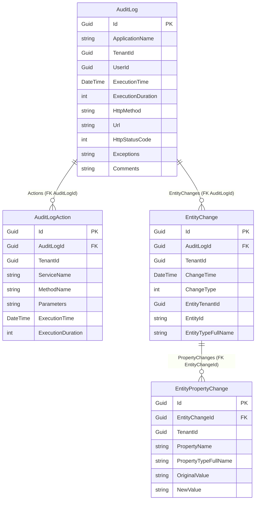

The **ABP Framework** Audit Logging *Domain* package, found under `modules/audit-logging/src/Volo.Abp.AuditLogging.Domain/`, defines every type that a host can talk to without taking a hard dependency on Entity Framework Core or MongoDB. It owns the `AuditLog` aggregate root, the sub-entities that capture entity-level diffs (`EntityChange`, `EntityPropertyChange`), the `AuditLogAction` records that mirror each application-service call, the `IAuditLogRepository` contract that the persistence packages implement, and the `AuditingStore` adapter that plugs the whole graph back into the framework's `IAuditingStore` extensibility point declared in `framework/src/Volo.Abp.Auditing/Volo/Abp/Auditing/IAuditingStore.cs`. Everything below is concrete C# you can open and read line-by-line.

## Module wiring

The module class is `AbpAuditLoggingDomainModule` (file `modules/audit-logging/src/Volo.Abp.AuditLogging.Domain/Volo/Abp/AuditLogging/AbpAuditLoggingDomainModule.cs`). Its `[DependsOn]` attributes pull in `AbpAuditingModule` (so the framework runtime is present), `AbpDddDomainModule` (so `AggregateRoot<TKey>` works), `AbpAuditLoggingDomainSharedModule` (constants and localization), `AbpExceptionHandlingModule` (for `IExceptionToErrorInfoConverter`, used while serializing thrown exceptions), and `AbpJsonModule` (for `IJsonSerializer`, used to write the exception payload into the `Exceptions` column).

```csharp
[DependsOn(typeof(AbpAuditingModule))]
[DependsOn(typeof(AbpDddDomainModule))]
[DependsOn(typeof(AbpAuditLoggingDomainSharedModule))]
[DependsOn(typeof(AbpExceptionHandlingModule))]
[DependsOn(typeof(AbpJsonModule))]
public class AbpAuditLoggingDomainModule : AbpModule
```

`PostConfigureServices` runs a `OneTimeRunner` that calls `ModuleExtensionConfigurationHelper.ApplyEntityConfigurationToEntity` for `AuditLog`, `AuditLogAction`, and `EntityChange`. That is what allows the *object extending* system (described in `concerns/object-extending.mdx`) to attach extra columns to audit tables without subclassing. The string keys come from `modules/audit-logging/src/Volo.Abp.AuditLogging.Domain.Shared/Volo/Abp/ObjectExtending/AuditLoggingModuleExtensionConsts.cs`.

<Note>
There is no `Configure<AbpAuditingOptions>` call in this module — it deliberately inherits whatever the framework's `AbpAuditingModule` set up. If a host wants to change `IsEnabled`, `HideErrors`, `EntityHistorySelectors`, or `Contributors`, they do it inside their own `AbpModule.ConfigureServices` as documented in [`concerns/auditing.mdx`](/concerns/auditing).
</Note>

## The `AuditLog` aggregate root

The aggregate is declared in `modules/audit-logging/src/Volo.Abp.AuditLogging.Domain/Volo/Abp/AuditLogging/AuditLog.cs`:

```csharp
[DisableAuditing]
public class AuditLog : AggregateRoot<Guid>, IMultiTenant
{
    public virtual string ApplicationName { get; set; }
    public virtual Guid?  UserId          { get; protected set; }
    public virtual string UserName        { get; protected set; }
    public virtual Guid?  TenantId        { get; protected set; }
    public virtual string TenantName      { get; protected set; }
    public virtual Guid?  ImpersonatorUserId   { get; protected set; }
    public virtual string ImpersonatorUserName { get; protected set; }
    public virtual Guid?  ImpersonatorTenantId   { get; protected set; }
    public virtual string ImpersonatorTenantName { get; protected set; }
    public virtual DateTime ExecutionTime  { get; protected set; }
    public virtual int      ExecutionDuration { get; protected set; }
    public virtual string ClientIpAddress  { get; protected set; }
    public virtual string ClientName       { get; protected set; }
    public virtual string ClientId         { get; set; }
    public virtual string CorrelationId    { get; set; }
    public virtual string BrowserInfo      { get; protected set; }
    public virtual string HttpMethod       { get; protected set; }
    public virtual string Url              { get; protected set; }
    public virtual string Exceptions       { get; protected set; }
    public virtual string Comments         { get; protected set; }
    public virtual int?   HttpStatusCode   { get; set; }

    public virtual ICollection<EntityChange>    EntityChanges { get; protected set; }
    public virtual ICollection<AuditLogAction>  Actions       { get; protected set; }
    // ...
}
```

A few things deserve attention:

- The class is itself decorated with `[DisableAuditing]` (the attribute from `framework/src/Volo.Abp.Auditing.Contracts/Volo/Abp/Auditing/DisableAuditingAttribute.cs`). Without that, ABP's `AuditingInterceptor` would log every write to an `AuditLog` instance — an infinite recursion when the *audit store* itself is being persisted.
- It implements `IMultiTenant`: every row is automatically filtered by the current tenant when the data-filter `ICurrentTenant.Id` is set. This is enforced by EF Core's global query filter applied via `ConfigureByConvention()` in `AbpAuditLoggingDbContextModelBuilderExtensions`.
- Every string property is *truncated* by the constructor against the limits in `AuditLogConsts` (file `modules/audit-logging/src/Volo.Abp.AuditLogging.Domain.Shared/Volo/Abp/AuditLogging/AuditLogConsts.cs`). For example `ApplicationName` is clipped to `MaxApplicationNameLength = 96`, `Url` to `MaxUrlLength = 256`, `BrowserInfo` to `MaxBrowserInfoLength = 512`. The same constants are re-used by EF Core column mapping so the in-memory truncation and the column `varchar(n)` length always agree.
- Two collections — `EntityChanges` and `Actions` — capture per-entity diffs and per-method invocations respectively. They are populated by the converter described later, not by the public ctor caller.

### Field-level summary

| Property                                                | Source                              | Max length / constant                                              |
| ------------------------------------------------------- | ----------------------------------- | ------------------------------------------------------------------ |
| `ApplicationName`                                       | `AuditLogInfo.ApplicationName`      | `AuditLogConsts.MaxApplicationNameLength = 96`                     |
| `ClientIpAddress`                                       | `AuditLogInfo.ClientIpAddress`      | `MaxClientIpAddressLength = 64`                                    |
| `ClientName` / `ClientId`                               | `AuditLogInfo`                      | `MaxClientNameLength = 128`, `MaxClientIdLength = 64`              |
| `CorrelationId`                                         | `AuditLogInfo.CorrelationId`        | `MaxCorrelationIdLength = 64`                                      |
| `BrowserInfo`                                           | `AuditLogInfo.BrowserInfo`          | `MaxBrowserInfoLength = 512`                                       |
| `HttpMethod` / `Url` / `HttpStatusCode`                 | populated by `AspNetCoreAuditLogContributor` upstream | `MaxHttpMethodLength = 16`, `MaxUrlLength = 256`     |
| `UserId` / `UserName` / `TenantId` / `TenantName`       | `ICurrentUser` + `ICurrentTenant` upstream | `MaxUserNameLength = 256`, `MaxTenantNameLength = 64`        |
| `ImpersonatorUserId/Name/TenantId/TenantName`           | impersonation context               | same as user/tenant limits                                         |
| `Exceptions`                                            | JSON of `RemoteServiceErrorInfo[]`  | unbounded (`nvarchar(max)`)                                        |
| `Comments`                                              | `AuditLogInfo.Comments` joined by `\n` | `MaxCommentsLength = 256`                                       |
| `ExecutionTime` / `ExecutionDuration`                   | scope start time + stopwatch        | -                                                                  |

## The entity-graph diagram

The aggregate has two collection navigations, and `EntityChange` itself has a child collection. The full graph mapped to tables is:



### `EntityChange`

The sub-entity that describes a single tracked entity's lifecycle event lives in `modules/audit-logging/src/Volo.Abp.AuditLogging.Domain/Volo/Abp/AuditLogging/EntityChange.cs`:

```csharp
[DisableAuditing]
public class EntityChange : Entity<Guid>, IMultiTenant, IHasExtraProperties
{
    public virtual Guid    AuditLogId         { get; protected set; }
    public virtual Guid?   TenantId           { get; protected set; }
    public virtual DateTime ChangeTime        { get; protected set; }
    public virtual EntityChangeType ChangeType { get; protected set; }
    public virtual Guid?   EntityTenantId     { get; protected set; }
    public virtual string  EntityId           { get; protected set; }
    public virtual string  EntityTypeFullName { get; protected set; }
    public virtual ICollection<EntityPropertyChange> PropertyChanges { get; protected set; }
    public virtual ExtraPropertyDictionary ExtraProperties { get; protected set; }
    // ...
}
```

The constructor takes the framework's `EntityChangeInfo` (from `framework/src/Volo.Abp.Auditing/Volo/Abp/Auditing/EntityChangeInfo.cs`) and copies each property change into the `PropertyChanges` collection. The enum `EntityChangeType` (`Created = 0`, `Updated = 1`, `Deleted = 2`) lives in `framework/src/Volo.Abp.Auditing.Contracts/Volo/Abp/Auditing/EntityChangeType.cs` and is reused across both the in-memory and persisted shapes — so a host can pivot tables by change type without a translation step.

### `EntityPropertyChange`

The leaf in the graph, defined in `modules/audit-logging/src/Volo.Abp.AuditLogging.Domain/Volo/Abp/AuditLogging/EntityPropertyChange.cs`, holds the *before* and *after* values of one property. The class is also marked `[DisableAuditing]` and implements `IMultiTenant`. Truncation again uses `EntityPropertyChangeConsts` from `Domain.Shared`: `MaxNewValueLength = 512`, `MaxOriginalValueLength = 512`, `MaxPropertyNameLength = 96`, `MaxPropertyTypeFullNameLength = 64`. Values exceeding the cap are silently truncated by `Truncate` / `TruncateFromBeginning` extension methods, which means an extremely long JSON-stringified entity value will be cut from the *right*, while a generic type name will be cut from the *left* — matching how a human reader scans them.

### `AuditLogAction`

Each method that the `AuditingInterceptor` saw inside the scope becomes one row in `AbpAuditLogActions`. File: `modules/audit-logging/src/Volo.Abp.AuditLogging.Domain/Volo/Abp/AuditLogging/AuditLogAction.cs`. Truncation constants are in `AuditLogActionConsts`:

```csharp
public class AuditLogActionConsts
{
    public static int MaxServiceNameLength { get; set; } = 256;
    public static int MaxMethodNameLength  { get; set; } = 128;
    public static int MaxParametersLength  { get; set; } = 2000;
}
```

There is a subtle policy in the constructor: if the serialized `Parameters` JSON exceeds `MaxParametersLength`, the field is replaced by `""` rather than truncated. That avoids producing invalid JSON in the column — downstream consumers can safely call `JsonDocument.Parse` on whatever is stored.

## The `AuditLogActionInfo` source-side DTO

The in-memory form that the framework builds is `AuditLogActionInfo` in `framework/src/Volo.Abp.Auditing/Volo/Abp/Auditing/AuditLogActionInfo.cs`. It carries the same fields as `AuditLogAction` but is `[Serializable]` and `IHasExtraProperties` and is what the `AuditingInterceptor` mutates while the request is running. The conversion into the persistent shape happens in one place only — `AuditLogInfoToAuditLogConverter` — described next.

## `IAuditLogInfoToAuditLogConverter`

The contract is one method:

```csharp
public interface IAuditLogInfoToAuditLogConverter
{
    Task<AuditLog> ConvertAsync(AuditLogInfo auditLogInfo);
}
```

(file `modules/audit-logging/src/Volo.Abp.AuditLogging.Domain/Volo/Abp/AuditLogging/IAuditLogInfoToAuditLogConverter.cs`). The default `AuditLogInfoToAuditLogConverter` is registered with `ITransientDependency` and lives next door in `AuditLogInfoToAuditLogConverter.cs`. It does five distinct jobs in `ConvertAsync`:

<Steps>
  <Step title="Generate the parent Guid">
    `var auditLogId = GuidGenerator.Create();` — `IGuidGenerator` is injected from `framework/src/Volo.Abp.Guids/`. This Guid is reused as `AuditLogId` foreign key in every child row created below.
  </Step>
  <Step title="Copy ExtraProperties">
    Each key in `auditLogInfo.ExtraProperties` is copied into a fresh `ExtraPropertyDictionary` so that downstream object-extension columns are populated.
  </Step>
  <Step title="Rewrite generic type names">
    For every `EntityChangeInfo` and `EntityPropertyChangeInfo`, `EntityTypeFullName` and `PropertyTypeFullName` are passed through `AuditLogEntityTypeFullNameConverter.Convert` (next section). This turns ugly `` Foo`1[[Bar, Asm, ...]] `` into `` Foo<Bar> `` so the value is human-readable in the database.
  </Step>
  <Step title="Build child entities">
    `entityChanges` is materialized as `new EntityChange(GuidGenerator, auditLogId, entityChangeInfo, tenantId: auditLogInfo.TenantId)` for each item; `actions` similarly through `new AuditLogAction(GuidGenerator.Create(), auditLogId, actionInfo, tenantId: auditLogInfo.TenantId)`. Both collections are guaranteed non-null even when the source DTO had none.
  </Step>
  <Step title="Serialize exceptions">
    `IExceptionToErrorInfoConverter` is used to map each thrown `Exception` to a `RemoteServiceErrorInfo`, respecting `AbpExceptionHandlingOptions.SendExceptionsDetailsToClients`, `SendStackTraceToClients`, and `SendExceptionDataToClientTypes`. The list is then JSON-serialized with `IJsonSerializer.Serialize(remoteServiceErrorInfos, indented: true)` and stored in `AuditLog.Exceptions`. If there were no exceptions, the column is `null`.
  </Step>
</Steps>

The implementation lives entirely in memory; it does *not* touch the database. Calling `ConvertAsync` is therefore safe in any unit-of-work state and idempotent — the same input produces the same `AuditLog` graph (modulo the freshly generated Guids).

## `AuditLogEntityTypeFullNameConverter`

A small but useful helper in `modules/audit-logging/src/Volo.Abp.AuditLogging.Domain/Volo/Abp/AuditLogging/AuditLogEntityTypeFullNameConverter.cs`. It owns two regex passes that translate the CLR's serialized generic-type form into something a user might type:

```csharp
public virtual string Convert(string typeFullName)
{
    var genericType = Regex.Match(typeFullName, @"(.+?)`1\[\[");
    if (!genericType.Success) return ReplaceGenericSymbol(typeFullName);

    var type = Regex.Match(typeFullName, @"`1\[\[(.+?), ");
    if (!type.Success) return typeFullName;

    if (type.Groups[1].Value.Contains("System.Nullable`1[["))
        return genericType.Groups[1].Value + "<" + type.Groups[1].Value.Replace("System.Nullable`1[[", "") + "?>";

    return genericType.Groups[1].Value.Contains("System.Nullable")
        ? type.Groups[1].Value + "?"
        : genericType.Groups[1].Value + "<" + ReplaceGenericSymbol(type.Groups[1].Value) + ">";
}
```

The class is registered as `ITransientDependency`; tests in `modules/audit-logging/test/Volo.Abp.AuditLogging.TestBase/Volo/Abp/AuditLogging/AuditLogEntityTypeFullNameConverter_Tests.cs` lock down the matrix of nullable, nested-generic, and plain inputs.

## `IAuditLogRepository`

The contract that every persistence layer implements is declared in `modules/audit-logging/src/Volo.Abp.AuditLogging.Domain/Volo/Abp/AuditLogging/IAuditLogRepository.cs`. It extends `IRepository<AuditLog, Guid>` with seven extra read-side methods:

```csharp
public interface IAuditLogRepository : IRepository<AuditLog, Guid>
{
    Task<List<AuditLog>> GetListAsync(
        string sorting = null, int maxResultCount = 50, int skipCount = 0,
        DateTime? startTime = null, DateTime? endTime = null,
        string httpMethod = null, string url = null, string clientId = null,
        Guid? userId = null, string userName = null, string applicationName = null,
        string clientIpAddress = null, string correlationId = null,
        int? maxExecutionDuration = null, int? minExecutionDuration = null,
        bool? hasException = null, HttpStatusCode? httpStatusCode = null,
        bool includeDetails = false,
        CancellationToken cancellationToken = default);

    Task<long> GetCountAsync(/* same filters minus paging */);

    Task<Dictionary<DateTime, double>> GetAverageExecutionDurationPerDayAsync(
        DateTime startDate, DateTime endDate, CancellationToken cancellationToken = default);

    Task<EntityChange> GetEntityChange(Guid entityChangeId, CancellationToken cancellationToken = default);

    Task<List<EntityChange>> GetEntityChangeListAsync(/* paging + filters */);

    Task<long> GetEntityChangeCountAsync(/* filters */);

    Task<EntityChangeWithUsername> GetEntityChangeWithUsernameAsync(Guid entityChangeId, CancellationToken cancellationToken = default);

    Task<List<EntityChangeWithUsername>> GetEntityChangesWithUsernameAsync(
        string entityId, string entityTypeFullName, CancellationToken cancellationToken = default);
}
```

The shape `EntityChangeWithUsername` (a tiny POCO in `EntityChangeWithUsername.cs`) is intentionally provider-agnostic: it pairs an `EntityChange` with a `UserName` string so list pages can show *who* changed an entity without needing a join into the Identity user table — both providers compute the join client-side or via lookup against the same `AbpAuditLogs.UserName` column.

## `AuditingStore` — bridging back to the framework

The class that closes the loop with `framework/src/Volo.Abp.Auditing/Volo/Abp/Auditing/IAuditingStore.cs` is `modules/audit-logging/src/Volo.Abp.AuditLogging.Domain/Volo/Abp/AuditLogging/AuditingStore.cs`. It is the *only* `IAuditingStore` you should find in a host that has referenced this module:

```csharp
public class AuditingStore : IAuditingStore, ITransientDependency
{
    protected IAuditLogRepository AuditLogRepository { get; }
    protected IUnitOfWorkManager  UnitOfWorkManager  { get; }
    protected AbpAuditingOptions  Options            { get; }
    protected IAuditLogInfoToAuditLogConverter Converter { get; }

    public virtual async Task SaveAsync(AuditLogInfo auditInfo)
    {
        if (!Options.HideErrors) { await SaveLogAsync(auditInfo); return; }
        try   { await SaveLogAsync(auditInfo); }
        catch (Exception ex)
        {
            Logger.LogWarning("Could not save the audit log object: " + Environment.NewLine + auditInfo.ToString());
            Logger.LogException(ex, LogLevel.Error);
        }
    }

    protected virtual async Task SaveLogAsync(AuditLogInfo auditInfo)
    {
        using (var uow = UnitOfWorkManager.Begin(true))
        {
            await AuditLogRepository.InsertAsync(await Converter.ConvertAsync(auditInfo));
            await uow.CompleteAsync();
        }
    }
}
```

<Warning>
`UnitOfWorkManager.Begin(requiresNew: true)` is essential: it isolates the audit insert from the surrounding business unit of work so that exceptions in the request *still* leave a log row behind. If you replace `AuditingStore` with a custom implementation, preserve this behaviour or you will silently lose all error-path audit data.
</Warning>

## Excel-file artefacts and miscellaneous

For completeness, the module also defines `AuditLogExcelFile` (`AuditLogExcelFile.cs`) plus `IAuditLogExcelFileRepository`. These are used by the *commercial* Audit Logging UI to store generated XLSX exports temporarily; the open-source repository still maps the table (`AbpAuditLogExcelFiles`) so a host that later subscribes to the commercial module does not have to migrate the schema. The constants for that entity live in `modules/audit-logging/src/Volo.Abp.AuditLogging.Domain.Shared/Volo/Abp/AuditLogging/AuditLogExcelFileConsts.cs`.

The `EntityChangeWithUsername` POCO mentioned above and the small DTO `AuditLogActionInfo` (framework-side) close the picture: the *Domain* package owns persistent shapes; the *Auditing* framework package owns the in-memory shapes; the converter is the one-way bridge.

## Where it goes from here

<CardGroup cols={2}>
  <Card title="Persistence layer" icon="database" href="/module-auditing/persistence">
    The EF Core `AbpAuditLoggingDbContext` and Mongo `AuditLoggingMongoDbContext`, plus the two `IAuditLogRepository` implementations that materialize the contract above.
  </Card>
  <Card title="Framework runtime" icon="play" href="/concerns/auditing">
    Where `AuditLogInfo` and `AuditLogActionInfo` come from — `IAuditingManager`, `AuditingInterceptor`, `AuditingHelper`, and the entity-history selector.
  </Card>
</CardGroup>
