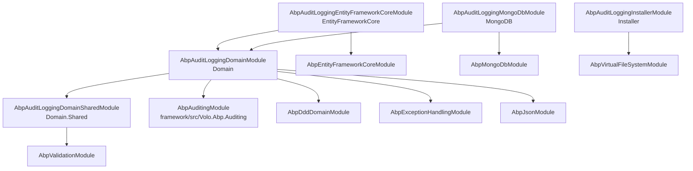
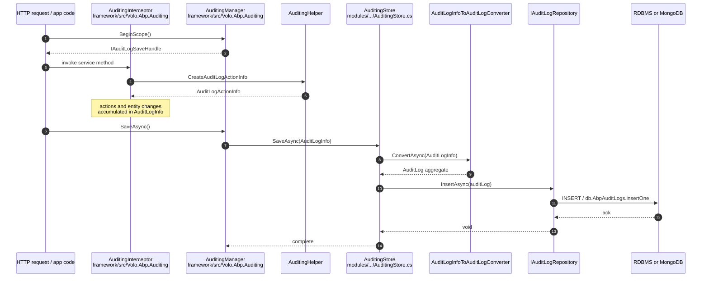

The **ABP Framework** ships a dedicated *Audit Logging* module that turns the in-memory `AuditLogInfo` records produced by `framework/src/Volo.Abp.Auditing/Volo/Abp/Auditing/AuditingHelper.cs` into durable rows in a SQL or MongoDB database. The framework-side runtime — interceptor, scope manager, `IAuditingStore` contract — is documented in [`concerns/auditing.mdx`](/concerns/auditing); this module is the *other end of the cable*. It owns the relational/document schema, the `AuditLog` aggregate root, the per-DB repositories, and the `AuditingStore` adapter that bridges the two worlds. All of its source code lives under `modules/audit-logging/src/` and is consumed by the application modules, the Identity module, and any ABP-based host that wants persistent audit history.

## What this module owns

The framework auditing pipeline collects every method call, entity change, and exception inside an `IAuditLogScope` and, when the scope completes, hands the resulting `AuditLogInfo` to whichever `IAuditingStore` is registered. The default implementation in `framework/src/Volo.Abp.Auditing/Volo/Abp/Auditing/SimpleLogAuditingStore.cs` only writes to `ILogger`. The Audit Logging module *replaces* that default with `Volo.Abp.AuditLogging.AuditingStore` (file `modules/audit-logging/src/Volo.Abp.AuditLogging.Domain/Volo/Abp/AuditLogging/AuditingStore.cs`), which converts the DTO into the `AuditLog` aggregate from `modules/audit-logging/src/Volo.Abp.AuditLogging.Domain/Volo/Abp/AuditLogging/AuditLog.cs` and inserts it through `IAuditLogRepository`. From the host's point of view the only thing you have to do is depend on `AbpAuditLoggingEntityFrameworkCoreModule` (or `AbpAuditLoggingMongoDbModule`) and the durable side is wired automatically — the framework's `AbpAuditingOptions` and `AuditingInterceptor` keep working unchanged.

<Info>
This module never *decides* what to audit. The decision belongs to `IAuditingHelper.ShouldSaveAudit` and the `[Audited]` / `[DisableAuditing]` attributes from `framework/src/Volo.Abp.Auditing.Contracts/`. The module simply provides the storage destination.
</Info>

## Package layout

The folder `modules/audit-logging/src/` contains five sibling projects that together form the module. Each package targets a separate concern: contracts that other layers can reference safely, the domain model and store adapter, the EF Core and MongoDB persistence implementations, and an installer used by the ABP CLI's `abp add-package` tooling.

| Package directory                                                                                                                                                       | Assembly                                          | Purpose                                                                                                                                                                                                                                       |
| ----------------------------------------------------------------------------------------------------------------------------------------------------------------------- | ------------------------------------------------- | --------------------------------------------------------------------------------------------------------------------------------------------------------------------------------------------------------------------------------------------- |
| `modules/audit-logging/src/Volo.Abp.AuditLogging.Domain.Shared/`                                                                                                         | `Volo.Abp.AuditLogging.Domain.Shared`             | Constants (`AuditLogConsts`, `EntityChangeConsts`, `AuditLogActionConsts`, `EntityPropertyChangeConsts`, `AuditLogExcelFileConsts`), localization resource, and the `AuditLoggingModuleExtensionConsts` keys for object extending.            |
| `modules/audit-logging/src/Volo.Abp.AuditLogging.Domain/`                                                                                                                | `Volo.Abp.AuditLogging.Domain`                    | Aggregate root `AuditLog`, sub-entities `EntityChange`, `EntityPropertyChange`, `AuditLogAction`, repository contract `IAuditLogRepository`, the `IAuditingStore` adapter `AuditingStore`, the `IAuditLogInfoToAuditLogConverter` and helpers. |
| `modules/audit-logging/src/Volo.Abp.AuditLogging.EntityFrameworkCore/`                                                                                                   | `Volo.Abp.AuditLogging.EntityFrameworkCore`       | `IAuditLoggingDbContext`, the concrete `AbpAuditLoggingDbContext`, `EfCoreAuditLogRepository`, and `AbpAuditLoggingDbContextModelBuilderExtensions` that maps every entity to a table.                                                        |
| `modules/audit-logging/src/Volo.Abp.AuditLogging.MongoDB/`                                                                                                               | `Volo.Abp.AuditLogging.MongoDB`                   | `IAuditLoggingMongoDbContext`, `AuditLoggingMongoDbContext`, `MongoAuditLogRepository`, and `AbpAuditLoggingMongoDbContextExtensions` that names the collections.                                                                              |
| `modules/audit-logging/src/Volo.Abp.AuditLogging.Installer/`                                                                                                             | `Volo.Abp.AuditLogging.Installer`                 | A thin `AbpAuditLoggingInstallerModule` whose only job is to embed installer assets via `AbpVirtualFileSystemModule` for the ABP CLI add-package flow.                                                                                         |

Notice that this module deliberately stops at the `Domain` layer. Unlike the Identity or Tenant Management modules, it does *not* ship an `Application`, `HttpApi`, or UI package — audit data is presented by the commercial *ABP Commercial Audit Logging* module (or by any custom application service the host writes), so the open-source repository only needs the model and the storage adapters.

## Module dependency chain

The module's lowest dependency is `AbpAuditLoggingDomainSharedModule`, declared in `modules/audit-logging/src/Volo.Abp.AuditLogging.Domain.Shared/Volo/Abp/AuditLogging/AbpAuditLoggingDomainSharedModule.cs`. It pulls in `AbpValidationModule` and registers the `AuditLoggingResource` localization keys. Above it sits `AbpAuditLoggingDomainModule` (file `modules/audit-logging/src/Volo.Abp.AuditLogging.Domain/Volo/Abp/AuditLogging/AbpAuditLoggingDomainModule.cs`), which depends on `AbpAuditingModule` (the framework runtime), `AbpDddDomainModule`, `AbpExceptionHandlingModule`, and `AbpJsonModule`. The two persistence packages sit on top: `AbpAuditLoggingEntityFrameworkCoreModule` (file `modules/audit-logging/src/Volo.Abp.AuditLogging.EntityFrameworkCore/Volo/Abp/AuditLogging/EntityFrameworkCore/AbpAuditLoggingEntityFrameworkCoreModule.cs`) and `AbpAuditLoggingMongoDbModule` (file `modules/audit-logging/src/Volo.Abp.AuditLogging.MongoDB/Volo/Abp/AuditLogging/MongoDB/AbpAuditLoggingMongoDbModule.cs`). A host picks exactly one of the two.



The fact that `AbpAuditLoggingDomainModule` depends on `AbpAuditingModule` is the key wiring step. When ABP scans modules, `AuditingStore : IAuditingStore, ITransientDependency` (declared in `AuditingStore.cs`) is registered for `IAuditingStore`. Because conventional registration runs *after* the framework registered the default `SimpleLogAuditingStore`, the last-wins behaviour of `ITransientDependency` ensures the database-backed implementation is what `AuditingManager.SaveAsync` actually invokes when the unit of work commits. There is no explicit `context.Services.Replace(...)` call — the dependency order alone is enough.

## How the framework pipeline meets this module

The full path of a single audited request crosses both halves of the system. The runtime side has been described in [`concerns/auditing.mdx`](/concerns/auditing); the diagram below stitches the two together so you can see exactly where this module takes over.



Two implementation details about that sequence matter when you debug a missing log row:

- `AuditingStore.SaveLogAsync` (file `modules/audit-logging/src/Volo.Abp.AuditLogging.Domain/Volo/Abp/AuditLogging/AuditingStore.cs`) opens its own unit of work with `UnitOfWorkManager.Begin(true)` and calls `await uow.CompleteAsync()`. The audit insert therefore commits even when the *outer* business unit of work rolled back — which is what you usually want, because exception logs would otherwise vanish along with the failed transaction.
- The same method honours `AbpAuditingOptions.HideErrors`: if `HideErrors` is `true`, any exception thrown during the persistence call is swallowed and logged via `ILogger<AuditingStore>` instead of propagating. The framework defaults that flag to `false`, so failed audit inserts surface during development.

## Connection string and table naming

All persistence packages share a single connection-string name defined once in `modules/audit-logging/src/Volo.Abp.AuditLogging.Domain/Volo/Abp/AuditLogging/AbpAuditLoggingDbProperties.cs`:

```csharp
public static class AbpAuditLoggingDbProperties
{
    public static string DbTablePrefix { get; set; } = AbpCommonDbProperties.DbTablePrefix;   // "Abp" by default
    public static string DbSchema      { get; set; } = AbpCommonDbProperties.DbSchema;
    public const  string ConnectionStringName = "AbpAuditLogging";
}
```

Both `IAuditLoggingDbContext` (EF Core) and `IAuditLoggingMongoDbContext` (MongoDB) are decorated with `[ConnectionStringName(AbpAuditLoggingDbProperties.ConnectionStringName)]`. A host that wants audit data to live in its own database simply adds an `"AbpAuditLogging"` entry to `ConnectionStrings` in `appsettings.json`; if the key is absent ABP falls back to the `"Default"` connection. Tables become `AbpAuditLogs`, `AbpAuditLogActions`, `AbpEntityChanges`, `AbpEntityPropertyChanges`, and `AbpAuditLogExcelFiles`, all generated by `AbpAuditLoggingDbContextModelBuilderExtensions.ConfigureAuditLogging` in `modules/audit-logging/src/Volo.Abp.AuditLogging.EntityFrameworkCore/Volo/Abp/AuditLogging/EntityFrameworkCore/AbpAuditLoggingDbContextModelBuilderExtensions.cs`.

## Where to go next

<CardGroup cols={2}>
  <Card title="Domain layer" icon="cube" href="/module-auditing/domain">
    Aggregate root `AuditLog`, sub-entities, the converter that turns `AuditLogInfo` into a persisted graph, repository contract, and module options. Source: `modules/audit-logging/src/Volo.Abp.AuditLogging.Domain/`.
  </Card>
  <Card title="Persistence: EF Core & MongoDB" icon="database" href="/module-auditing/persistence">
    `AbpAuditLoggingDbContext`, `EfCoreAuditLogRepository`, `AuditLoggingMongoDbContext`, `MongoAuditLogRepository`, model-creating extensions, and the installer package.
  </Card>
  <Card title="Framework runtime" icon="play" href="/concerns/auditing">
    The other side of the wire: `IAuditingManager`, `AuditingInterceptor`, `AuditLogInfo`, `EntityChangeInfo`, `AuditLogContributor`, and the `[Audited]` / `[DisableAuditing]` attributes.
  </Card>
  <Card title="Data Access" icon="layer-group" href="/data/overview">
    How `IRepository<TEntity, TKey>`, `IDbContextProvider<TDbContext>`, and the connection-string resolver behave for module-owned DbContexts like `AbpAuditLoggingDbContext`.
  </Card>
</CardGroup>

## Module options and extensibility

`AbpAuditLoggingDomainModule.PostConfigureServices` (file `modules/audit-logging/src/Volo.Abp.AuditLogging.Domain/Volo/Abp/AuditLogging/AbpAuditLoggingDomainModule.cs`) calls `ModuleExtensionConfigurationHelper.ApplyEntityConfigurationToEntity` three times — once for `AuditLog`, once for `AuditLogAction`, once for `EntityChange`. That makes the audit entities first-class participants of ABP's *object extending* infrastructure: a host can `ObjectExtensionManager.Instance.Modules().ConfigureAuditLogging(...)` and append extra columns to `AbpAuditLogs` without subclassing. The extension constants used to look those configurations up live in `modules/audit-logging/src/Volo.Abp.AuditLogging.Domain.Shared/Volo/Abp/ObjectExtending/AuditLoggingModuleExtensionConsts.cs`, and the convenience extension methods are in the same folder under `AuditLoggingModuleExtensionConfiguration.cs` and `AuditLoggingModuleExtensionConfigurationDictionaryExtensions.cs`.

For deep-dive on individual classes — including the truncation rules in `AuditLogConsts`, the generic-type pretty-printer `AuditLogEntityTypeFullNameConverter`, and the long `GetListAsync` query in `EfCoreAuditLogRepository` — head to the per-layer pages above.

<Tip>
If you only need to verify audit rows in tests, the project `modules/audit-logging/test/Volo.Abp.AuditLogging.TestBase/` ships `AuditingTestDataBuilder` and `AuditStore_Basic_Tests` which exercise the full path end-to-end against both EF Core and MongoDB providers.
</Tip>

## What a host actually wires up

To get from a fresh ABP application to a working audit-log store, three things need to be in place. First, the host's main `AbpModule` (typically `MyAppHttpApiHostModule` or `MyAppWebModule`) declares one of `[DependsOn(typeof(AbpAuditLoggingEntityFrameworkCoreModule))]` or `[DependsOn(typeof(AbpAuditLoggingMongoDbModule))]`. The transitive `[DependsOn(typeof(AbpAuditLoggingDomainModule))]` then brings in `AuditingStore` as the `IAuditingStore` implementation. Second, the host's `appsettings.json` provides either an explicit `"AbpAuditLogging"` connection string or falls back to `"Default"` (see `framework/src/Volo.Abp.Data/Volo/Abp/Data/IConnectionStringResolver.cs` for the resolver rules). Third, if EF Core is being used, the host's solution either generates migrations against `AbpAuditLoggingDbContext` directly or — more commonly in templated solutions — references a *MigrationsDbContext* that inherits from `AbpDbContext` and calls `builder.ConfigureAuditLogging()` inside `OnModelCreating` so that the audit tables share migrations with the rest of the schema.

The startup-template solutions under `templates/app/aspnet-core/` follow that pattern: open `templates/app/aspnet-core/src/MyCompanyName.MyProjectName.EntityFrameworkCore/EntityFrameworkCore/MyProjectNameDbContext.cs` in any generated solution and you will see the call `modelBuilder.ConfigureAuditLogging()` next to similar calls for the Identity and Tenant Management modules. The same convention is mirrored on the Mongo side in `templates/app/aspnet-core/src/MyCompanyName.MyProjectName.MongoDB/MongoDb/MyProjectNameMongoDbContext.cs` where `modelBuilder.ConfigureAuditLogging()` from `AbpAuditLoggingMongoDbContextExtensions` is invoked.

## Schema sketch

The relational schema produced by `AbpAuditLoggingDbContextModelBuilderExtensions.ConfigureAuditLogging` (file `modules/audit-logging/src/Volo.Abp.AuditLogging.EntityFrameworkCore/Volo/Abp/AuditLogging/EntityFrameworkCore/AbpAuditLoggingDbContextModelBuilderExtensions.cs`) maps the aggregate to four tables plus the auxiliary `AbpAuditLogExcelFiles`. The exact column-length contract is shared with the in-memory truncation logic defined in `AuditLogConsts`, `EntityChangeConsts`, `EntityPropertyChangeConsts`, and `AuditLogActionConsts` so the runtime never produces strings longer than the column allows. Indexes are tuned for the queries declared in `IAuditLogRepository`:

| Table                      | Notable indexes                                                                 |
| -------------------------- | ------------------------------------------------------------------------------- |
| `AbpAuditLogs`             | `(TenantId, ExecutionTime)`, `(TenantId, UserId, ExecutionTime)`                |
| `AbpAuditLogActions`       | `(AuditLogId)`, `(TenantId, ServiceName, MethodName, ExecutionTime)`            |
| `AbpEntityChanges`         | `(AuditLogId)`, `(TenantId, EntityTypeFullName, EntityId)`                      |
| `AbpEntityPropertyChanges` | `(EntityChangeId)`                                                              |

On MongoDB there is a single root collection `AbpAuditLogs` with embedded `EntityChanges`, each containing embedded `PropertyChanges`, plus `Actions` — defined in `modules/audit-logging/src/Volo.Abp.AuditLogging.MongoDB/Volo/Abp/AuditLogging/MongoDB/AbpAuditLoggingMongoDbContextExtensions.cs`. Both schemas are reachable through the same `IAuditLogRepository` contract.

## Cross-references

- The framework runtime that *produces* the data described here is documented at [`concerns/auditing.mdx`](/concerns/auditing) — start there if you want to learn how `AuditingInterceptor` and `IAuditingManager` build an `AuditLogInfo`.
- The relational stack underneath `AbpAuditLoggingDbContext` is covered in [`data/entity-framework-core.mdx`](/data/entity-framework-core) and the provider variants under `data/efcore-sqlserver.mdx`, `data/efcore-postgresql.mdx`, etc.
- The MongoDB stack is documented in [`data/mongodb.mdx`](/data/mongodb).
- The *object extending* infrastructure used by `ApplyObjectExtensionMappings` in this module is described in `concerns/object-extending.mdx`.

## Module boundary — what *is not* here

The Audit Logging module deliberately stops short of three things you might expect:

1. **No HTTP API or admin UI in the open-source repo.** Browse `modules/audit-logging/src/` and you will find no `Application`, `Application.Contracts`, `HttpApi`, `Web`, or `Blazor` projects. The presentation layer (search filters, drill-downs into entity changes, XLSX export) lives in the commercial *ABP Commercial Audit Logging* module. The open-source module still stores the `AbpAuditLogExcelFiles` table so the eventual upgrade does not require a migration; the EF Core mapping for it lives at the bottom of `AbpAuditLoggingDbContextModelBuilderExtensions.ConfigureAuditLogging` and the Mongo collection-name registration is in `AbpAuditLoggingMongoDbContextExtensions.ConfigureAuditLogging`.
2. **No data seeder.** The framework auditing pipeline is the only data source — the module never creates rows by itself. There is no `IDataSeedContributor` implementation anywhere in `modules/audit-logging/src/`.
3. **No background cleanup job.** Audit tables grow without bound; deleting old data is the host's responsibility. A typical solution registers a background worker (see [`jobs/background-workers.mdx`](/jobs/background-workers)) that calls `_auditLogRepository.DeleteAsync(x => x.ExecutionTime < cutoff)` on a schedule. Because `AbpAuditingOptions.HideErrors` defaults to `false`, you will want to wrap that worker in defensive logging.

## The `AuditingStore` adapter in context

Re-reading the framework's `IAuditingStore` (`framework/src/Volo.Abp.Auditing/Volo/Abp/Auditing/IAuditingStore.cs`) alongside this module's `AuditingStore` (`modules/audit-logging/src/Volo.Abp.AuditLogging.Domain/Volo/Abp/AuditLogging/AuditingStore.cs`) shows the smallest possible glue layer between the two halves of the auditing system. The interface has a single method `Task SaveAsync(AuditLogInfo auditInfo)`; the implementation:

1. Checks `Options.HideErrors`. If errors are visible (the default) it calls `SaveLogAsync` directly and lets exceptions propagate to whoever called `AuditingManager.SaveAsync()`.
2. Otherwise it wraps the call in `try / catch`, logs the warning and the exception with `Logger.LogException`, and swallows the error so the response code is unaffected.
3. In `SaveLogAsync`, it opens a `requiresNew: true` unit of work, calls `Converter.ConvertAsync(auditInfo)` to materialize the aggregate, and inserts via `IAuditLogRepository.InsertAsync`. The fresh UoW commits independently of the surrounding request UoW — vital because most audit rows describe *failed* requests that have already rolled back their business changes.

That is the entire bridge. Everything below it — the converter, the aggregate, the repositories — is described in detail on the [Domain](/module-auditing/domain) and [Persistence](/module-auditing/persistence) pages.

## Quick reference: file → responsibility

| Concern                                  | File                                                                                                                                              |
| ---------------------------------------- | ------------------------------------------------------------------------------------------------------------------------------------------------- |
| Aggregate root                           | `modules/audit-logging/src/Volo.Abp.AuditLogging.Domain/Volo/Abp/AuditLogging/AuditLog.cs`                                                         |
| Per-method action sub-entity             | `modules/audit-logging/src/Volo.Abp.AuditLogging.Domain/Volo/Abp/AuditLogging/AuditLogAction.cs`                                                   |
| Per-entity diff                          | `modules/audit-logging/src/Volo.Abp.AuditLogging.Domain/Volo/Abp/AuditLogging/EntityChange.cs`                                                     |
| Property-level diff                      | `modules/audit-logging/src/Volo.Abp.AuditLogging.Domain/Volo/Abp/AuditLogging/EntityPropertyChange.cs`                                             |
| `IAuditingStore` adapter                 | `modules/audit-logging/src/Volo.Abp.AuditLogging.Domain/Volo/Abp/AuditLogging/AuditingStore.cs`                                                    |
| DTO → aggregate converter                | `modules/audit-logging/src/Volo.Abp.AuditLogging.Domain/Volo/Abp/AuditLogging/AuditLogInfoToAuditLogConverter.cs`                                  |
| Generic-type pretty-printer              | `modules/audit-logging/src/Volo.Abp.AuditLogging.Domain/Volo/Abp/AuditLogging/AuditLogEntityTypeFullNameConverter.cs`                              |
| Repository contract                      | `modules/audit-logging/src/Volo.Abp.AuditLogging.Domain/Volo/Abp/AuditLogging/IAuditLogRepository.cs`                                              |
| EF Core repository                       | `modules/audit-logging/src/Volo.Abp.AuditLogging.EntityFrameworkCore/Volo/Abp/AuditLogging/EntityFrameworkCore/EfCoreAuditLogRepository.cs`        |
| EF Core DbContext                        | `modules/audit-logging/src/Volo.Abp.AuditLogging.EntityFrameworkCore/Volo/Abp/AuditLogging/EntityFrameworkCore/AbpAuditLoggingDbContext.cs`        |
| EF Core schema                           | `modules/audit-logging/src/Volo.Abp.AuditLogging.EntityFrameworkCore/Volo/Abp/AuditLogging/EntityFrameworkCore/AbpAuditLoggingDbContextModelBuilderExtensions.cs` |
| Mongo repository                         | `modules/audit-logging/src/Volo.Abp.AuditLogging.MongoDB/Volo/Abp/AuditLogging/MongoDB/MongoAuditLogRepository.cs`                                 |
| Mongo DbContext                          | `modules/audit-logging/src/Volo.Abp.AuditLogging.MongoDB/Volo/Abp/AuditLogging/MongoDB/AuditLoggingMongoDbContext.cs`                              |
| Mongo collection names                   | `modules/audit-logging/src/Volo.Abp.AuditLogging.MongoDB/Volo/Abp/AuditLogging/MongoDB/AbpAuditLoggingMongoDbContextExtensions.cs`                 |
| Installer                                | `modules/audit-logging/src/Volo.Abp.AuditLogging.Installer/Volo/Abp/AuditLogging/AbpAuditLoggingInstallerModule.cs`                                |
| Length constants (truncation + schema)   | `modules/audit-logging/src/Volo.Abp.AuditLogging.Domain.Shared/Volo/Abp/AuditLogging/AuditLogConsts.cs` and siblings                               |

This table is the fastest way to find the file you need when something looks wrong. From here the [Domain](/module-auditing/domain) and [Persistence](/module-auditing/persistence) pages walk through each of those files in execution order.

## End-to-end checklist

Before you assume an audit row is missing, walk down the chain with the source files in front of you:

<Steps>
  <Step title="Is the scope opening?">
    Check `framework/src/Volo.Abp.Auditing/Volo/Abp/Auditing/AuditingMiddleware.cs` (for HTTP) or `AbpUnitOfWorkInterceptor` (for non-HTTP) — both call `IAuditingManager.BeginScope()`. If the request never enters the middleware, no scope, no log.
  </Step>
  <Step title="Does ShouldSaveAudit return true?">
    `framework/src/Volo.Abp.Auditing/Volo/Abp/Auditing/AuditingHelper.cs` checks `AbpAuditingOptions.IsEnabled`, `[Audited]` / `[DisableAuditing]` attributes, and the entity-history selectors. A `false` here means nothing reaches the store.
  </Step>
  <Step title="Is AuditingStore the registered IAuditingStore?">
    Add a debug-time `IServiceCollection` dump or set a breakpoint on the constructor of `modules/audit-logging/src/Volo.Abp.AuditLogging.Domain/Volo/Abp/AuditLogging/AuditingStore.cs`. If `SimpleLogAuditingStore` still wins, the host forgot to depend on `AbpAuditLoggingDomainModule` (directly or via the EF Core / Mongo module).
  </Step>
  <Step title="Does the inner UoW commit?">
    `AuditingStore.SaveLogAsync` opens `UnitOfWorkManager.Begin(true)` and calls `uow.CompleteAsync()`. If you see the converter return a populated `AuditLog` but no row appears, an exception is being swallowed by `HideErrors = true`. Set `HideErrors = false` in `Configure<AbpAuditingOptions>` and re-run.
  </Step>
  <Step title="Is the connection string right?">
    `AbpAuditLoggingDbProperties.ConnectionStringName = "AbpAuditLogging"`. The resolver in `framework/src/Volo.Abp.Data/Volo/Abp/Data/ConnectionStringResolver.cs` will fall back to `"Default"` only if `"AbpAuditLogging"` is absent. A misspelled key silently writes to the application database.
  </Step>
</Steps>

The same checklist serves as a mental model for *extending* the module. To replace the converter, register your own `IAuditLogInfoToAuditLogConverter` with `ITransientDependency` after the domain module loads. To replace the store, register an `IAuditingStore` of your own; ABP's last-wins registration order means your implementation wins over the module's `AuditingStore`. To change the schema, hook `ObjectExtensionManager` or override `OnModelCreating` in your own DbContext that calls `builder.ConfigureAuditLogging()` first. Each of these extension points has an associated test in `modules/audit-logging/test/Volo.Abp.AuditLogging.TestBase/` that you can read for an executable specification.

## Versioning and breaking-change posture

Because the persisted schema is defined in plain C# attributes (`[ConnectionStringName]`, the length constants in `Domain.Shared`) and EF Core's fluent API, schema changes between ABP minor versions are rare. When they do happen, the `modules/audit-logging/src/Volo.Abp.AuditLogging.EntityFrameworkCore/` project is the source of truth — the migrations folder in the test project under `modules/audit-logging/test/Volo.Abp.AuditLogging.EntityFrameworkCore.Tests/` (and the parallel migrations under `templates/app/aspnet-core/`) reflect every schema change. The MongoDB side is forgiving by nature: new fields appear as bson properties without a migration, while removed fields linger as untouched bytes until a host rewrites the document.

When the *Domain.Shared* constants change — for example raising `MaxUrlLength` from 256 to 512 — the in-memory truncation immediately reflects the new cap but EF Core column lengths only update after a migration. A host that bumps ABP minor versions should always look at the diff of `AbpAuditLoggingDbContextModelBuilderExtensions.ConfigureAuditLogging` before generating its next migration, because the matching column types will need an `ALTER COLUMN`.

## Why the module looks the way it does

A common question is *why is the audit logger split between a framework runtime and a separate persistence module at all?* The answer is layered:

- **Smaller core.** The framework runtime in `framework/src/Volo.Abp.Auditing/` does not depend on EF Core or MongoDB, so projects that only need in-process logging — for example a console host using `SimpleLogAuditingStore` — pay zero database cost.
- **Per-provider isolation.** If audit logging always lived inside the EF Core assembly, a host that uses MongoDB would still drag in the EF Core abstractions. The split keeps each provider package self-contained.
- **Schema reuse.** The same `AuditLog` aggregate maps to both providers because the Domain layer owns it. There is no double bookkeeping; both `EfCoreAuditLogRepository` and `MongoAuditLogRepository` insert the *same* C# object graph.
- **CLI ergonomics.** `Volo.Abp.AuditLogging.Installer` exists as a thin module so that `abp add-module Volo.Abp.AuditLogging` can wire either provider into the host's solution with one command — the installer just contains assets, no runtime behaviour, and depends on `AbpVirtualFileSystemModule` only.

If you are designing a new module along ABP's modularity guidelines (see `core/modularity.mdx`), this split is the canonical reference: contracts in `Domain.Shared`, the model and store adapter in `Domain`, one assembly per persistence technology, and a tiny installer for the CLI.

## Multi-tenancy semantics

Every persistent entity in the module implements `IMultiTenant` — `AuditLog` (file `modules/audit-logging/src/Volo.Abp.AuditLogging.Domain/Volo/Abp/AuditLogging/AuditLog.cs`), `EntityChange`, `EntityPropertyChange`, and `AuditLogAction` all expose a `TenantId` column. The framework's runtime fills the value from `ICurrentTenant.Id` when the scope opens; the converter then propagates `auditLogInfo.TenantId` into every child entity. On the EF Core side, ABP's `AbpDbContext` adds a global query filter so a tenant user only ever sees their own rows. On the MongoDB side the same `IMultiTenant` data filter is applied through `framework/src/Volo.Abp.Domain/Volo/Abp/Domain/Repositories/MongoDB/MongoDbRepository.cs`.

There is one subtlety worth knowing: `EntityChange.EntityTenantId` is *separate* from `EntityChange.TenantId`. The first is the tenant that owns the *changed* entity; the second is the tenant under which the audit row was *recorded*. They are usually the same, but in cross-tenant scenarios (a host admin editing a tenant resource, for example) they diverge and the difference is preserved in the database — the multi-tenancy regression test `modules/audit-logging/test/Volo.Abp.AuditLogging.Tests/Volo/Abp/AuditLogging/MultiTenantAuditLog_Tests.cs` locks down that behaviour.

## Behavioural contracts the test suite locks in

The test base under `modules/audit-logging/test/Volo.Abp.AuditLogging.TestBase/` defines a set of provider-agnostic tests that both the EF Core and MongoDB suites inherit. Skim those files to understand the *behavioural* contract that any future provider would have to satisfy:

| Test file                                                                                                       | What it asserts                                                                                                                            |
| --------------------------------------------------------------------------------------------------------------- | ------------------------------------------------------------------------------------------------------------------------------------------ |
| `modules/audit-logging/test/Volo.Abp.AuditLogging.TestBase/Volo/Abp/AuditLogging/AuditStore_Basic_Tests.cs`      | Saving an `AuditLogInfo` through `IAuditingStore` lands as a single `AuditLog` row, with `Actions` and `EntityChanges` populated correctly.|
| `modules/audit-logging/test/Volo.Abp.AuditLogging.TestBase/Volo/Abp/AuditLogging/AuditLogRepository_Tests.cs`    | Each filter on `GetListAsync`, `GetCountAsync`, `GetEntityChangeListAsync`, and `GetAverageExecutionDurationPerDayAsync` works in isolation.|
| `modules/audit-logging/test/Volo.Abp.AuditLogging.TestBase/Volo/Abp/AuditLogging/AuditingTestDataBuilder.cs`     | A fluent helper that seeds reproducible audit data — useful as a worked example of how to construct `AuditLogInfo` graphs by hand.          |
| `modules/audit-logging/test/Volo.Abp.AuditLogging.TestBase/Volo/Abp/AuditLogging/AuditLogging_Repository_Resolve_Tests.cs` | The DI container resolves `IAuditLogRepository` to the provider-specific implementation, not the generic `IRepository<AuditLog, Guid>`.|
| `modules/audit-logging/test/Volo.Abp.AuditLogging.TestBase/Volo/Abp/AuditLogging/AuditLogEntityTypeFullNameConverter_Tests.cs` | The regex-based type-name normalization in `AuditLogEntityTypeFullNameConverter` produces stable, human-readable names.            |
| `modules/audit-logging/test/Volo.Abp.AuditLogging.Tests/Volo/Abp/AuditLogging/MultiTenantAuditLog_Tests.cs`      | Audit rows are filtered by `ICurrentTenant.Id` and `EntityChange.EntityTenantId` is set to the affected entity's tenant.                    |

Because the test base is reused across providers, fixing a bug typically means changing a single repository implementation and seeing one provider's tests turn green — without introducing a behaviour gap in the other.

## Common pitfalls

A small set of issues recurs in production hosts that have just adopted the module:

- **Audit rows missing on rollback.** The framework's *business* unit of work might roll back without throwing if a domain rule says "abort silently." Because `AuditingStore.SaveLogAsync` uses `Begin(true)` on its own UoW, audit rows still appear — but only if the outer code calls `IAuditLogSaveHandle.SaveAsync()`. If the host disposes the handle without calling `SaveAsync` (the pattern used in the `IAuditingManager.BeginScope` helpers), nothing is persisted. Cross-check by searching for `await saveHandle.SaveAsync()` in your middleware.
- **Connection string typo.** `"AbpAuditLogging"` versus `"AbpAuditing"`. The latter looks plausible but is wrong — `IConnectionStringResolver` will fall through to `"Default"` and the rows end up in the *application* database. Constant: `AbpAuditLoggingDbProperties.ConnectionStringName` in `modules/audit-logging/src/Volo.Abp.AuditLogging.Domain/Volo/Abp/AuditLogging/AbpAuditLoggingDbProperties.cs`.
- **Forgetting `builder.ConfigureAuditLogging()` in a shared MigrationsDbContext.** When a host folds audit tables into the main migrations context, the call to the model-builder extension is the only thing that wires the four entities. Forget it and EF Core silently produces a context that *resolves* the DbSets but contains no tables.
- **Indexing the wrong column on MongoDB.** As discussed on the [Persistence page](/module-auditing/persistence), `EntityChange.Id` lookup is *not* an index point-read in Mongo because `EntityChange` is embedded. Plan accordingly.

Most of these are caught by the test suite under `modules/audit-logging/test/`; running it locally after any module-related change is the fastest insurance.

## Glossary of types you will encounter

A small dictionary so you do not have to keep paging back to the framework documentation:

- **`AuditLogInfo`** — `framework/src/Volo.Abp.Auditing/Volo/Abp/Auditing/AuditLogInfo.cs`. The in-memory DTO accumulated during a scope.
- **`AuditLogActionInfo`** — `framework/src/Volo.Abp.Auditing/Volo/Abp/Auditing/AuditLogActionInfo.cs`. One method call captured during a scope.
- **`EntityChangeInfo`** / **`EntityPropertyChangeInfo`** — same folder. The DTO shapes of entity diffs.
- **`AuditLog`** / **`AuditLogAction`** / **`EntityChange`** / **`EntityPropertyChange`** — the persisted DDD shapes in `modules/audit-logging/src/Volo.Abp.AuditLogging.Domain/Volo/Abp/AuditLogging/`.
- **`IAuditingStore`** — framework contract; **`AuditingStore`** — module implementation that bridges the two halves.
- **`IAuditLogRepository`** — read-side contract with seven query methods; two implementations: `EfCoreAuditLogRepository`, `MongoAuditLogRepository`.
- **`IAuditLogInfoToAuditLogConverter`** — the *only* place where the DTO becomes a persisted graph.
- **`AbpAuditLoggingDbProperties.ConnectionStringName = "AbpAuditLogging"`** — the string a host puts in `appsettings.json`.

## Final note before the deep-dive pages

The next two pages assume you have skimmed this overview. Bookmark this file as a navigation aid — it lists every file in the module and the role it plays. The [Domain page](/module-auditing/domain) walks the in-memory model and the converter top-to-bottom; the [Persistence page](/module-auditing/persistence) walks the EF Core and MongoDB providers side-by-side and ends with the installer. If you only ever read one section, read `AuditingStore.cs` — three dozen lines that explain how the framework's auditing runtime hands off to durable storage.
