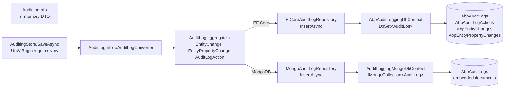

The *Domain* package of the **ABP Framework** Audit Logging module describes *what* an audit record looks like; the *persistence* packages describe *where* the bytes go. Two providers ship in the open-source repository — EF Core under `modules/audit-logging/src/Volo.Abp.AuditLogging.EntityFrameworkCore/` and MongoDB under `modules/audit-logging/src/Volo.Abp.AuditLogging.MongoDB/` — and a tiny *installer* assembly sits next to them at `modules/audit-logging/src/Volo.Abp.AuditLogging.Installer/` to let the ABP CLI add either provider to a host with `abp add-module`. Both providers fulfil the exact same `IAuditLogRepository` contract from `modules/audit-logging/src/Volo.Abp.AuditLogging.Domain/Volo/Abp/AuditLogging/IAuditLogRepository.cs`, so the `AuditingStore` adapter you read about on the [Domain page](/module-auditing/domain) does not care which one is loaded.

## Storage flow at a glance

The arrow from `AuditingStore` to the database differs slightly between providers — EF Core wraps everything in a transactional unit of work while MongoDB performs a single document insert that includes child collections — but the *signature* the caller sees is identical:



The biggest practical consequence of that fork is that on the MongoDB side, `EntityChanges`, `Actions`, and each `EntityChange.PropertyChanges` are *embedded* inside the single `AbpAuditLogs` document. The EF Core side, by contrast, materializes four separate tables joined by `AuditLogId` / `EntityChangeId` foreign keys. List queries therefore look very different between the two providers, and the Mongo repository often performs in-process filtering after a `SelectMany`.

## EF Core package: `Volo.Abp.AuditLogging.EntityFrameworkCore`

### Module

The module class is `AbpAuditLoggingEntityFrameworkCoreModule` in `modules/audit-logging/src/Volo.Abp.AuditLogging.EntityFrameworkCore/Volo/Abp/AuditLogging/EntityFrameworkCore/AbpAuditLoggingEntityFrameworkCoreModule.cs`. It is short and intention-revealing:

```csharp
[DependsOn(typeof(AbpAuditLoggingDomainModule))]
[DependsOn(typeof(AbpEntityFrameworkCoreModule))]
public class AbpAuditLoggingEntityFrameworkCoreModule : AbpModule
{
    public override void ConfigureServices(ServiceConfigurationContext context)
    {
        context.Services.AddAbpDbContext<AbpAuditLoggingDbContext>(options =>
        {
            options.AddRepository<AuditLog, EfCoreAuditLogRepository>();
            options.AddRepository<AuditLogExcelFile, EfCoreAuditLogExcelFileRepository>();
        });
    }
}
```

Two things happen here. First, `AddAbpDbContext<AbpAuditLoggingDbContext>` registers the DbContext through the ABP-flavoured EF Core helper from `framework/src/Volo.Abp.EntityFrameworkCore/`. That helper resolves connection strings via `IConnectionStringResolver` keyed on `AbpAuditLoggingDbProperties.ConnectionStringName = "AbpAuditLogging"`. Second, `options.AddRepository<AuditLog, EfCoreAuditLogRepository>()` overrides the generic default `EfCoreRepository<TDbContext, TEntity, TKey>` with the audit-specific implementation that adds the seven extra query methods of `IAuditLogRepository`.

### `IAuditLoggingDbContext`

The DbContext contract lives in `modules/audit-logging/src/Volo.Abp.AuditLogging.EntityFrameworkCore/Volo/Abp/AuditLogging/EntityFrameworkCore/IAuditLoggingDbContext.cs`:

```csharp
[ConnectionStringName(AbpAuditLoggingDbProperties.ConnectionStringName)]
public interface IAuditLoggingDbContext : IEfCoreDbContext
{
    DbSet<AuditLog>           AuditLogs           { get; }
    DbSet<AuditLogExcelFile>  AuditLogExcelFiles  { get; }
}
```

It is intentionally minimal — only the *aggregate-root* DbSets are exposed. `EntityChange`, `AuditLogAction`, and `EntityPropertyChange` are reached through navigation properties on `AuditLog`, never directly. That keeps the public surface small and forces queries through the aggregate boundary, in line with ABP's DDD guidance from `ddd/repositories.mdx`.

### `AbpAuditLoggingDbContext`

The implementation in `modules/audit-logging/src/Volo.Abp.AuditLogging.EntityFrameworkCore/Volo/Abp/AuditLogging/EntityFrameworkCore/AbpAuditLoggingDbContext.cs` inherits ABP's `AbpDbContext<AbpAuditLoggingDbContext>` (from `framework/src/Volo.Abp.EntityFrameworkCore/Volo/Abp/EntityFrameworkCore/AbpDbContext.cs`), which gives it transactional behaviour, soft-delete filters, multi-tenancy filters, and `IDataFilter` wiring out of the box:

```csharp
[ConnectionStringName(AbpAuditLoggingDbProperties.ConnectionStringName)]
public class AbpAuditLoggingDbContext : AbpDbContext<AbpAuditLoggingDbContext>, IAuditLoggingDbContext
{
    public DbSet<AuditLog>          AuditLogs          { get; set; }
    public DbSet<AuditLogExcelFile> AuditLogExcelFiles { get; set; }

    public AbpAuditLoggingDbContext(DbContextOptions<AbpAuditLoggingDbContext> options) : base(options) { }

    protected override void OnModelCreating(ModelBuilder builder)
    {
        base.OnModelCreating(builder);
        builder.ConfigureAuditLogging();
    }
}
```

The single line `builder.ConfigureAuditLogging()` is what wires every entity into the relational schema. The extension method is the next section.

### `AbpAuditLoggingDbContextModelBuilderExtensions`

The full mapping lives in `modules/audit-logging/src/Volo.Abp.AuditLogging.EntityFrameworkCore/Volo/Abp/AuditLogging/EntityFrameworkCore/AbpAuditLoggingDbContextModelBuilderExtensions.cs`. The method `ConfigureAuditLogging(this ModelBuilder builder)` configures five entities:

<AccordionGroup>
  <Accordion title="AuditLog → AbpAuditLogs">
    Maps every property to a column with the matching length from `AuditLogConsts`. Defines two composite indexes — `(TenantId, ExecutionTime)` and `(TenantId, UserId, ExecutionTime)` — which are the columns the *Audit Log* admin UI filters on most often. Declares the two child collections with `b.HasMany(a => a.Actions).WithOne().HasForeignKey(x => x.AuditLogId).IsRequired()` and the same for `EntityChanges`, so cascading deletes happen at the database level. Calls `b.ApplyObjectExtensionMappings()` so extra columns added through `ObjectExtensionManager` get reflected too.
  </Accordion>
  <Accordion title="AuditLogAction → AbpAuditLogActions">
    Maps `ServiceName` (256), `MethodName` (128), `Parameters` (2000) per `AuditLogActionConsts`. Indexes on `(AuditLogId)` for the parent-row drill-down and on `(TenantId, ServiceName, MethodName, ExecutionTime)` for "top-N slowest calls" dashboards. Also calls `b.ApplyObjectExtensionMappings()`.
  </Accordion>
  <Accordion title="EntityChange → AbpEntityChanges">
    Maps `EntityTypeFullName` (required, 512) and `EntityId` (128) per `EntityChangeConsts`. Index on `(AuditLogId)` for the parent drill-down and on `(TenantId, EntityTypeFullName, EntityId)` so the *history of a specific row* lookup used by `IAuditLogRepository.GetEntityChangesWithUsernameAsync` is index-covered. Declares `b.HasMany(a => a.PropertyChanges).WithOne().HasForeignKey(x => x.EntityChangeId)`.
  </Accordion>
  <Accordion title="EntityPropertyChange → AbpEntityPropertyChanges">
    Maps the four value-strings with the limits from `EntityPropertyChangeConsts`. Single index on `(EntityChangeId)` because the only access pattern is via the parent navigation.
  </Accordion>
  <Accordion title="AuditLogExcelFile → AbpAuditLogExcelFiles">
    Stores generated XLSX-export artefacts produced by the commercial *Audit Logging* UI. The open-source repository keeps the table for compatibility.
  </Accordion>
</AccordionGroup>

The last line `builder.TryConfigureObjectExtensions<AbpAuditLoggingDbContext>()` lets a host extend the entire DbContext using `ConfigureObjectExtensions` from the *Object Extending* infrastructure — combined with the entity-level `ApplyObjectExtensionMappings`, you can append columns without subclassing the DbContext.

### `EfCoreAuditLogRepository`

The provider-specific repository is in `modules/audit-logging/src/Volo.Abp.AuditLogging.EntityFrameworkCore/Volo/Abp/AuditLogging/EntityFrameworkCore/EfCoreAuditLogRepository.cs`. It extends `EfCoreRepository<IAuditLoggingDbContext, AuditLog, Guid>` and implements `IAuditLogRepository` directly. The two interesting query methods are `GetListAsync` and `GetListQueryAsync`. The latter is built almost entirely out of `WhereIf` extension methods from `framework/src/Volo.Abp.Linq/`:

```csharp
return (await GetQueryableAsync(cancellationToken))
    .WhereIf(startTime.HasValue,       a => a.ExecutionTime >= startTime)
    .WhereIf(endTime.HasValue,         a => a.ExecutionTime <= endTime)
    .WhereIf(hasException == true,     a => a.Exceptions != null && a.Exceptions != "")
    .WhereIf(hasException == false,    a => a.Exceptions == null || a.Exceptions == "")
    .WhereIf(!httpMethod.IsNullOrEmpty(),     a => a.HttpMethod == httpMethod)
    .WhereIf(!url.IsNullOrEmpty(),            a => a.Url != null && a.Url.Contains(url))
    .WhereIf(!clientId.IsNullOrEmpty(),       a => a.ClientId == clientId)
    .WhereIf(userId != null,                  a => a.UserId == userId)
    .WhereIf(!userName.IsNullOrEmpty(),       a => a.UserName == userName)
    .WhereIf(!applicationName.IsNullOrEmpty(),a => a.ApplicationName == applicationName)
    .WhereIf(!clientIpAddress.IsNullOrEmpty(),a => a.ClientIpAddress == clientIpAddress)
    .WhereIf(!correlationId.IsNullOrEmpty(),  a => a.CorrelationId == correlationId)
    .WhereIf(httpStatusCode != null && httpStatusCode > 0,
                                              a => a.HttpStatusCode == (int?)httpStatusCode)
    .WhereIf(maxDuration != null && maxDuration > 0, a => a.ExecutionDuration <= maxDuration)
    .WhereIf(minDuration != null && minDuration > 0, a => a.ExecutionDuration >= minDuration);
```

`GetListAsync` then composes that with `OrderBy(sorting ?? "ExecutionTime DESC")` (using `System.Linq.Dynamic.Core`) and `PageBy(skipCount, maxResultCount)` — the same dynamic-LINQ stack ABP uses everywhere. The `includeDetails` flag goes through `WithDetails()` so callers can ask for the `Actions` and `EntityChanges` navigations to be eagerly loaded in one trip.

`GetAverageExecutionDurationPerDayAsync` groups by `(Year, Month, Day)` in SQL and rebuilds a `Dictionary<DateTime, double>` keyed by the day. `GetEntityChangeListAsync` uses `(await GetDbContextAsync()).Set<EntityChange>()` to bypass the aggregate root and query the child table directly — the one place in the module where the DDD boundary is intentionally crossed for read efficiency. There is a parallel `EfCoreAuditLogExcelFileRepository` in the same folder for the excel-export entity.

<Info>
Because `AuditLog` inherits `AggregateRoot<Guid>` and ABP's auto-event-publishing layer would normally emit an `EntityCreatedEventData<AuditLog>` when a row is inserted, the aggregate is decorated with `[DisableAuditing]` *and* the entity does not emit local events by default. Combined with the `Begin(requiresNew: true)` UoW in `AuditingStore`, that means an inserted audit row will not trigger downstream handlers — which is the desired behaviour for a write-only sink.
</Info>

## MongoDB package: `Volo.Abp.AuditLogging.MongoDB`

### Module

`AbpAuditLoggingMongoDbModule` in `modules/audit-logging/src/Volo.Abp.AuditLogging.MongoDB/Volo/Abp/AuditLogging/MongoDB/AbpAuditLoggingMongoDbModule.cs` mirrors its EF Core sibling:

```csharp
[DependsOn(typeof(AbpAuditLoggingDomainModule))]
[DependsOn(typeof(AbpMongoDbModule))]
public class AbpAuditLoggingMongoDbModule : AbpModule
{
    public override void ConfigureServices(ServiceConfigurationContext context)
    {
        context.Services.AddMongoDbContext<AuditLoggingMongoDbContext>(options =>
        {
            options.AddRepository<AuditLog,         MongoAuditLogRepository>();
            options.AddRepository<AuditLogExcelFile, MongoAuditLogExcelFileRepository>();
        });
    }
}
```

A host loads *either* this module or the EF Core one — never both. If both were loaded, the last one registered would win the `IAuditLogRepository` binding and the other DbContext would still be active but unused.

### `IAuditLoggingMongoDbContext` and `AuditLoggingMongoDbContext`

The contract in `modules/audit-logging/src/Volo.Abp.AuditLogging.MongoDB/Volo/Abp/AuditLogging/MongoDB/IAuditLoggingMongoDbContext.cs`:

```csharp
[ConnectionStringName(AbpAuditLoggingDbProperties.ConnectionStringName)]
public interface IAuditLoggingMongoDbContext : IAbpMongoDbContext
{
    IMongoCollection<AuditLog>          AuditLogs          { get; }
    IMongoCollection<AuditLogExcelFile> AuditLogExcelFiles { get; }
}
```

The concrete class in `AuditLoggingMongoDbContext.cs` extends `AbpMongoDbContext` (from `framework/src/Volo.Abp.MongoDB/`) and exposes the collections through `Collection<TEntity>()`. Its `CreateModel` override calls `modelBuilder.ConfigureAuditLogging()` — the model-builder extension in the next subsection. Notice that `EntityChange`, `AuditLogAction`, and `EntityPropertyChange` are *not* exposed as top-level collections: in MongoDB they are nested arrays inside each `AuditLog` document.

### `AbpAuditLoggingMongoDbContextExtensions`

The model-builder extensions live in `modules/audit-logging/src/Volo.Abp.AuditLogging.MongoDB/Volo/Abp/AuditLogging/MongoDB/AbpAuditLoggingMongoDbContextExtensions.cs` and are dramatically simpler than the EF Core counterpart because MongoDB has no schema:

```csharp
public static void ConfigureAuditLogging(this IMongoModelBuilder builder)
{
    Check.NotNull(builder, nameof(builder));

    builder.Entity<AuditLog>(b =>
    {
        b.CollectionName = AbpAuditLoggingDbProperties.DbTablePrefix + "AuditLogs";
    });

    builder.Entity<AuditLogExcelFile>(b =>
    {
        b.CollectionName = AbpAuditLoggingDbProperties.DbTablePrefix + "AuditLogExcelFiles";
    });
}
```

Only the collection names are set; everything else — including bson serialization of `Guid`, `DateTime`, and the `EntityChangeType` enum — is handled by ABP's defaults registered in `AbpMongoDbModule`.

### `MongoAuditLogRepository`

The Mongo implementation in `modules/audit-logging/src/Volo.Abp.AuditLogging.MongoDB/Volo/Abp/AuditLogging/MongoDB/MongoAuditLogRepository.cs` extends `MongoDbRepository<IAuditLoggingMongoDbContext, AuditLog, Guid>` and re-implements the same query surface as the EF Core repository. Two adaptations stand out:

- **Entity-change queries**. Because `EntityChange` is embedded, the Mongo repository writes things like `(await GetQueryableAsync(cancellationToken)).SelectMany(x => x.EntityChanges)` to flatten the array, then applies the same `WhereIf` filters. Look at `GetEntityChangeListQueryAsync`:

  ```csharp
  return (await GetQueryableAsync(cancellationToken))
          .SelectMany(x => x.EntityChanges)
          .WhereIf(auditLogId.HasValue,                e => e.Id == auditLogId)
          .WhereIf(startTime.HasValue,                 e => e.ChangeTime >= startTime)
          .WhereIf(endTime.HasValue,                   e => e.ChangeTime <= endTime)
          .WhereIf(changeType.HasValue,                e => e.ChangeType == changeType.Value)
          .WhereIf(!string.IsNullOrWhiteSpace(entityId), e => e.EntityId == entityId)
          .WhereIf(!string.IsNullOrWhiteSpace(entityTypeFullName),
              e => e.EntityTypeFullName.Contains(entityTypeFullName));
  ```

- **`GetEntityChangeWithUsernameAsync`** and `GetEntityChangesWithUsernameAsync` resolve the username by re-using the parent `AuditLog.UserName` field — no separate `AbpUsers` lookup is needed because the document already embeds the user's snapshot. The implementation:

  ```csharp
  var auditLog = await (await GetQueryableAsync(cancellationToken))
                  .Where(x => x.EntityChanges.Any(y => y.Id == entityChangeId))
                  .FirstAsync(GetCancellationToken(cancellationToken));

  return new EntityChangeWithUsername()
  {
      EntityChange = auditLog.EntityChanges.First(x => x.Id == entityChangeId),
      UserName     = auditLog.UserName
  };
  ```

`GetAverageExecutionDurationPerDayAsync` performs the same date-bucket grouping as the EF Core implementation; sorting and paging still flow through `System.Linq.Dynamic.Core` via the `.OrderBy(sorting)` and `.PageBy(skipCount, maxResultCount)` extension calls.

<Warning>
Because every `EntityChange` and `AuditLogAction` lives inside the parent `AuditLog` document, MongoDB-side `EntityChange` IDs are only guaranteed unique *within the corpus of stored audit logs*, not in a top-level collection. The repository's lookup-by-id path therefore scans `AuditLogs.Where(x => x.EntityChanges.Any(y => y.Id == id))` rather than performing an index point-read. If you query entity changes by id heavily, consider adding a Mongo index on `EntityChanges.Id` from the host's startup configuration.
</Warning>

## Installer package: `Volo.Abp.AuditLogging.Installer`

The installer is a stub module used by ABP's CLI when a host runs `abp add-module Volo.Abp.AuditLogging` to scaffold the necessary references and seed data. Its source is one file: `modules/audit-logging/src/Volo.Abp.AuditLogging.Installer/Volo/Abp/AuditLogging/AbpAuditLoggingInstallerModule.cs`:

```csharp
[DependsOn(typeof(AbpVirtualFileSystemModule))]
public class AbpAuditLoggingInstallerModule : AbpModule
{
    public override void ConfigureServices(ServiceConfigurationContext context)
    {
        Configure<AbpVirtualFileSystemOptions>(options =>
        {
            options.FileSets.AddEmbedded<AbpAuditLoggingInstallerModule>();
        });
    }
}
```

The package embeds installer assets (NuGet templates, script snippets) into the virtual file system declared in `framework/src/Volo.Abp.VirtualFileSystem/`. The CLI then reads those embedded files when generating module wiring inside an application solution. There is no runtime audit-related code here; you will not see the installer module loaded in production hosts.

## Trying it locally

The repository ships ready-to-run test projects under `modules/audit-logging/test/`:

| Project                                                                                  | What it does                                                                                                            |
| ---------------------------------------------------------------------------------------- | ----------------------------------------------------------------------------------------------------------------------- |
| `modules/audit-logging/test/Volo.Abp.AuditLogging.TestBase/`                              | `AuditingTestDataBuilder` and the abstract `AuditLogRepository_Tests`, `AuditStore_Basic_Tests`, type-converter tests.    |
| `modules/audit-logging/test/Volo.Abp.AuditLogging.EntityFrameworkCore.Tests/`             | EF Core variants of the above, running against the SQLite in-memory provider configured by `AbpAuditLoggingEntityFrameworkCoreTestModule`. |
| `modules/audit-logging/test/Volo.Abp.AuditLogging.MongoDB.Tests/`                         | MongoDB variants, using the `Mongo2Go` fixture in `MongoDbFixture.cs` and `MongoTestCollection.cs`.                       |
| `modules/audit-logging/test/Volo.Abp.AuditLogging.Tests/`                                 | End-to-end tests against the *framework* runtime, including the multi-tenancy regression test `MultiTenantAuditLog_Tests`.|

`AuditLogRepository_Tests` (in the `TestBase` project) exercises every filter on `GetListAsync` and `GetEntityChangeListAsync` — both providers re-use the same test class because the contract is provider-agnostic. If you change a query path in `EfCoreAuditLogRepository` or `MongoAuditLogRepository`, run both downstream test projects to make sure you have not introduced a behaviour gap.

## Connection string reminders

Both providers honour the `[ConnectionStringName(AbpAuditLoggingDbProperties.ConnectionStringName)]` attribute and so resolve `"AbpAuditLogging"` from `IConfiguration`. A typical `appsettings.json` slice looks like:

```json
{
  "ConnectionStrings": {
    "Default":         "Server=(localdb)\\mssqllocaldb;Database=MyApp;Trusted_Connection=True;",
    "AbpAuditLogging": "mongodb://localhost:27017/MyAppAuditLogs"
  }
}
```

If `"AbpAuditLogging"` is missing the framework falls back to `"Default"` — useful in early prototypes where audit data lives in the same store as the rest of the application.

## Where this fits in the wider docs

<CardGroup cols={2}>
  <Card title="Module overview" icon="folder-tree" href="/module-auditing/overview">
    Package layout, dependency graph, the bridge between this storage adapter and the framework `AuditingStore` extension point.
  </Card>
  <Card title="Domain layer deep dive" icon="cube" href="/module-auditing/domain">
    The `AuditLog` aggregate, sub-entities, the converter, `IAuditLogRepository` contract, and the `AuditingStore` adapter.
  </Card>
  <Card title="Framework auditing pipeline" icon="play" href="/concerns/auditing">
    `IAuditingManager`, `AuditingInterceptor`, `AuditLogContributor`, and the `[Audited]` / `[DisableAuditing]` attributes that decide *what* is sent here.
  </Card>
  <Card title="EF Core access layer" icon="database" href="/data/entity-framework-core">
    `AbpDbContext`, `IDbContextProvider<TDbContext>`, `IConnectionStringResolver`, and how the audit DbContext slots into them.
  </Card>
</CardGroup>
