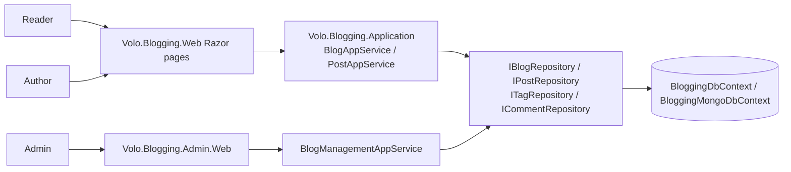
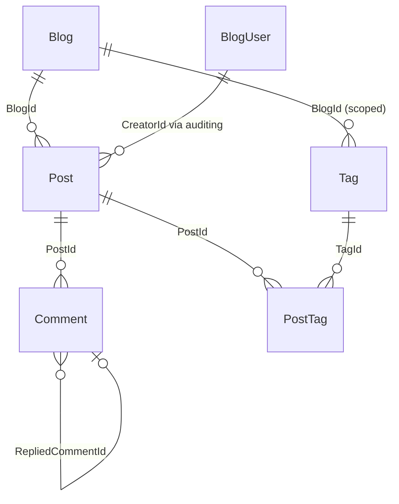
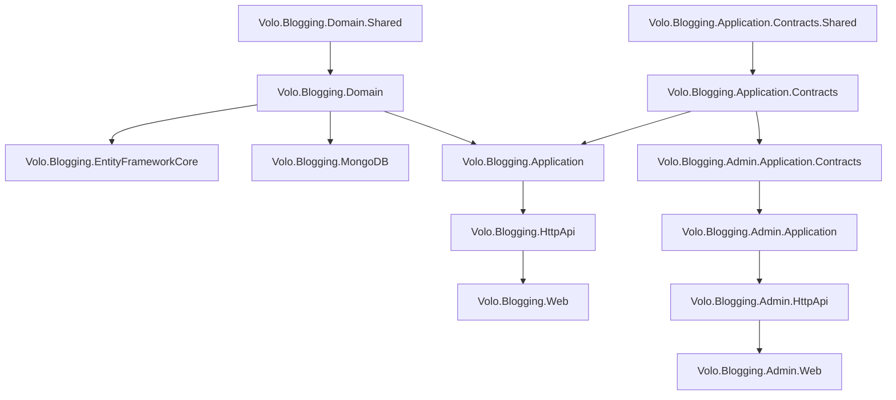

# Blogging Module

The ABP Framework Blogging module is a self-contained blog engine originally shipped before CMS Kit existed. It is now classified as **legacy**: new applications should reach for the `BlogsFeature` inside [CMS Kit](/module-cms-kit/overview) instead, which offers multi-tenancy, tags-by-entity-type, reactions, rating, and a richer admin surface on top of the same domain concepts. Blogging is still maintained for backward compatibility with applications built against earlier ABP versions.

<Warning>
**Legacy notice** — `Volo.Blogging.*` packages are kept for compatibility. New code should use `Volo.CmsKit.Blogs` (covered in [CMS Kit → Domain](/module-cms-kit/domain) and [CMS Kit → Public](/module-cms-kit/public)).
</Warning>

Source lives under `modules/blogging/src/`. The Blogging module pre-dates the CMS Kit "Admin / Common / Public" three-way split and instead uses a simpler Admin / single-Application layout, with the public reading experience and the admin pages all hosted inside `Volo.Blogging.Web`.

## Package layout

<Card title="Blogging module projects" icon="folder-tree">
- `Volo.Blogging.Domain.Shared` — consts and shared types (`modules/blogging/src/Volo.Blogging.Domain.Shared/`)
- `Volo.Blogging.Domain` — `Blog`, `Post`, `PostTag`, `Comment`, `Tag` aggregates + repositories + `BloggingDomainModule`
- `Volo.Blogging.Application.Contracts.Shared` — DTOs shared with HttpApi clients
- `Volo.Blogging.Application.Contracts` / `.Application` — reader/author app services (`BlogAppService`, `PostAppService`, `CommentAppService`, `TagAppService`, `MemberAppService`, `FileAppService`)
- `Volo.Blogging.Admin.Application.Contracts` / `.Admin.Application` / `.Admin.HttpApi` / `.Admin.HttpApi.Client` / `.Admin.Web` — admin tier (`BlogManagementAppService`)
- `Volo.Blogging.HttpApi` / `.HttpApi.Client` — auto-controllers and proxies for the reader API
- `Volo.Blogging.EntityFrameworkCore` — `BloggingDbContext` + `EfCore*Repository`
- `Volo.Blogging.MongoDB` — `BloggingMongoDbContext` + `Mongo*Repository`
- `Volo.Blogging.Web` — Razor Pages reader + author + member pages
- `Volo.Blogging.Installer` — NuGet installer for the ABP CLI
</Card>

## Mental model

The reader-side `Volo.Blogging.Application` deliberately lets authenticated users author and edit their own posts directly, without going through the admin tier — the admin tier only manages *blogs* (containers), not the posts inside them.

## Entity overview

- `Blog` — top-level container with `Name`, `ShortName`, `Description`
- `Post` — `Title`, `Url` (slug), `CoverImage`, `Content`, `Description`, `ReadCount`, `Tags` collection
- `PostTag` — many-to-many join row keyed by `(PostId, TagId)`
- `Tag` — scoped to a `BlogId`, carries `Name`, `Description`, `UsageCount`
- `Comment` — `PostId`, optional `RepliedCommentId` for threading, `Text`
- `BlogUser` — projection of the identity user into the blogging context

## Reader experience

The public Razor pages live under `modules/blogging/src/Volo.Blogging.Web/Pages/Blogs/`:

<Card title="Reader / author Razor pages" icon="window">
- `Index.cshtml(.cs)` — list of blogs
- `Posts/Index.cshtml(.cs)` — post list for a blog (URL: `/blog/{blogShortName}`)
- `Posts/Detail.cshtml(.cs)` — post body + comments (URL: `/blog/{blogShortName}/{postUrl}`)
- `Posts/New.cshtml(.cs)` — authenticated authoring
- `Posts/Edit.cshtml(.cs)` — authenticated editing of own post
- `Members/Index.cshtml(.cs)` — author profile + their posts
- `BloggingPageHelper.cs` + `BloggingPageModel.cs` — shared model base used by all pages
</Card>

The "members" page is what makes Blogging distinct: anyone with an account can write posts to existing blogs as long as the necessary permission is granted, and the public site treats them as first-class authors. CMS Kit Blogs takes the opposite stance — administrators are the only authors by default.

## Admin tier

The admin tier (`Volo.Blogging.Admin.*`) only manages *blog containers*. `BlogManagementAppService` (`Volo.Blogging.Admin.Application/Volo/Blogging/Admin/Blogs/BlogManagementAppService.cs`) implements `IBlogManagementAppService` with `GetListAsync`, `GetAsync`, `CreateAsync`, `UpdateAsync`, `DeleteAsync`, and `ClearCacheAsync`. There is no admin app service for posts — those are authored by their owners through `IPostAppService` in the non-admin tier.

## Caching

`PostCacheInvalidator` and `PostCacheItem` (`Volo.Blogging.Domain/Volo/Blogging/Posts/`) implement a list-of-posts cache invalidated through `PostChangedEvent`. `BlogManagementAppService.ClearCacheAsync` and the post create/update path also kick the cache. Keys are derived from `BlogId`.

## Distributed events

`BloggingDomainModule.ConfigureServices` registers ETO mappings for `Blog → BlogEto`, `Comment → CommentEto`, `Post → PostEto`, `Tag → TagEto` so host applications using the ABP distributed event bus can subscribe to standard `EntityCreatedEto<PostEto>` style events.

## When to choose Blogging vs CMS Kit Blogs

<CardGroup cols={2}>
<Card title="Use Blogging when" icon="rotate-left">
- You're maintaining an application already built on the Blogging module
- You need community authoring out of the box (any registered user can post)
- You need the standalone `/blog/{shortName}/{postUrl}` URL shape
</Card>
<Card title="Use CMS Kit Blogs when" icon="forward">
- You're starting fresh
- You need multi-tenancy
- You want reactions, ratings, marked-items, polymorphic tagging across many entity types
- You want one admin surface for blogs + pages + menus + tags + media
</Card>
</CardGroup>

## Where to next

<CardGroup cols={2}>
<Card title="Domain" icon="cube" href="/module-blogging/domain">
`Blog`, `Post`, `PostTag`, `Comment`, `Tag`, `BlogUser` aggregates and repositories.
</Card>
<Card title="Admin" icon="screwdriver-wrench" href="/module-blogging/admin">
The blog-container management API.
</Card>
<Card title="Web UI" icon="window" href="/module-blogging/web">
The reader, author, and admin Razor pages.
</Card>
</CardGroup>

## Application contracts inventory

`modules/blogging/src/Volo.Blogging.Application.Contracts/Volo/Blogging/` exposes the non-admin app service contracts:

<Card title="Public app service contracts" icon="puzzle-piece">
- `Blogs/IBlogAppService` — `GetListAsync`, `GetAsync(Guid id)`, `GetByShortNameAsync(string)`
- `Posts/IPostAppService` — read + create + update + delete; per-author scoping
- `Comments/ICommentAppService` — list / create / delete + reply support
- `Tagging/ITagAppService` — tag CRUD scoped to a blog
- `Members/IMemberAppService` — per-user profile + post listing
- `Files/IFileAppService` — image upload for inline content (`FileUploadInputDto`)
</Card>

The matching DTOs sit in sibling `Dtos/` folders. `Volo.Blogging.HttpApi` exposes them via ABP conventional controllers under the `/api/blogging/...` prefix; `Volo.Blogging.HttpApi.Client` provides typed proxies.

## Routing convention

`BloggingWebModule.ConfigureServices` adds the page routes that turn `BloggingUrlOptions.RoutePrefix` into the final URLs:

- Multi-blog mode: `/{prefix}{blogShortName}`, `/{prefix}{blogShortName}/{postUrl}`, `/{prefix}{blogShortName}/posts/new`, `/{prefix}{blogShortName}/posts/{postId}/edit`
- Single-blog mode (when `BloggingUrlOptions.SingleBlogMode.Enabled = true`): `/{prefix}`, `/{prefix}{postUrl}`, `/{prefix}posts/new`, `/{prefix}posts/{postId}/edit`
- Always: `/{prefix}members/{userName}`

`BloggingRouteConstraint` (registered as `blogNameConstraint`) prevents the catch-all `{blogShortName}` segment from swallowing framework routes (`error`, `ApplicationConfigurationScript`, `ServiceProxyScript`, `Languages/Switch`, `members`, plus the active bundle folder).

## Single-blog mode

`BloggingUrlOptions.SingleBlogMode.Enabled` collapses the blog picker for deployments that only ever ship one blog. Both the page-route conventions and `IndexModel.OnGetAsync` honor it: the blogs landing page short-circuits to `/{prefix}` and the URL shape drops the `{blogShortName}` segment entirely. The setting is read from configuration via the ABP options pattern.

## Author-as-owner authorization

`PostAuthorizationHandler` (`Volo.Blogging.Application/Volo/Blogging/Posts/PostAuthorizationHandler.cs`) implements an `IAuthorizationHandler` that grants edit/delete on a post when the current user matches the post's `CreatorId`. It complements the standard `BloggingPermissions.Posts.Update` / `Delete` permissions, which are intended for administrators who can edit anyone's post. The two checks are OR'd: the author can always edit their own post; an admin with the permission can edit anybody's.

## Connection string

`AbpBloggingDbProperties.ConnectionStringName = "AbpBlogging"`. As with CMS Kit, if the host configuration lacks an `AbpBlogging` entry, ABP falls back to `Default`. The EF Core context is marked `[IgnoreMultiTenancy]`, so deploying Blogging into a multi-tenant ABP application places its tables outside the tenant filter.

## Migration to CMS Kit Blogs (high level)

A move from Blogging → CMS Kit Blogs is mostly a data shape exercise:

| Blogging concept | CMS Kit Blogs concept | Mapping notes |
|---|---|---|
| `Blog.ShortName` | `Blog.Slug` | normalize via `SlugNormalizer` on insert |
| `Blog.Description` | not present | move to a `ContentFragment` or a `GlobalResource` |
| `Post.Url` | `BlogPost.Slug` | normalize via `SlugNormalizer` |
| `Post.Title` / `Description` / `Content` | `BlogPost.Title` / `ShortDescription` / `Content` | direct |
| `Post.CoverImage` | `BlogPost.CoverImageMediaId` | upload to `MediaDescriptor` first |
| `Post.ReadCount` | not present in CMS Kit | move to a host-side counter or drop |
| `PostTag` + `Tag(BlogId, Name)` | `EntityTag` + `Tag(EntityType="BlogPost", Name)` | tags become global per entity type, not per blog |
| `Comment(PostId, Text, RepliedCommentId)` | `Comment(EntityType="BlogPost", EntityId=postId, Text, RepliedCommentId)` | polymorphic |
| `BlogUser` | `CmsUser` | both mirror the identity user |

A reasonable migration plan: deploy CMS Kit Blogs alongside, copy the data with a one-off background job (Blogging → CMS Kit aggregates), redirect old URL shapes to the new ones with permanent 301s, then retire the Blogging tables.

## Module dependency chart

Notice the `Volo.Blogging.Application.Contracts.Shared` separation — it carries the small subset of DTO types referenced by both client proxies and the contracts assembly, avoiding accidental client-side dependencies on the larger contracts surface.
