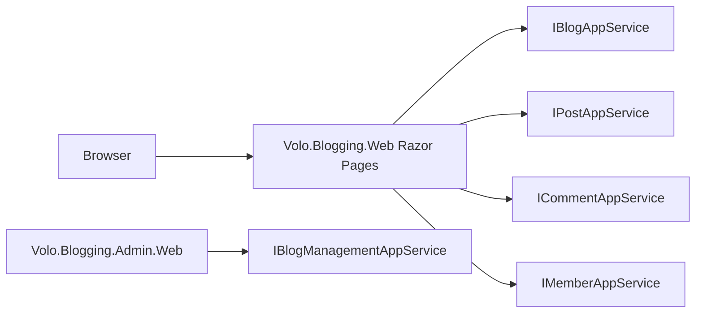

# Blogging Web UI

The Blogging module's web tier is the only place where the legacy ABP Framework blog engine surfaces to humans: there is no separate "public.web" project — the reader, author, and member pages all live inside `Volo.Blogging.Web` (`modules/blogging/src/Volo.Blogging.Web/`). Admin pages for blog containers sit in a sibling `Volo.Blogging.Admin.Web`.

<Note>Use the [CMS Kit Web UI](/module-cms-kit/web) for new applications. This page is the reference for projects still on the original Blogging module.</Note>



## Public Razor pages

`modules/blogging/src/Volo.Blogging.Web/Pages/Blogs/`:

<Card title="Reader / author Razor inventory" icon="window">
- `Index.cshtml(.cs)` — list of blogs (auto-redirects to single-blog mode)
- `Posts/Index.cshtml(.cs)` — post list for a blog
- `Posts/Detail.cshtml(.cs)` — post body + comments + reply form
- `Posts/New.cshtml(.cs)` — authoring (`[Authorize]`)
- `Posts/Edit.cshtml(.cs)` — owner-only editing
- `Members/Index.cshtml(.cs)` — author profile + their posts + edit-self form
- `Shared/Helpers/` + `Shared/Components/` — view helpers shared across the pages
- `BloggingPageHelper.cs` + `BloggingPageModel.cs` — shared model base
</Card>

### IndexModel: blog picker

```csharp
public class IndexModel : AbpPageModel
{
    private readonly IBlogAppService _blogAppService;
    private readonly BloggingUrlOptions _blogOptions;

    public IReadOnlyList<BlogDto> Blogs { get; private set; }

    public virtual async Task<IActionResult> OnGetAsync()
    {
        if (_blogOptions.SingleBlogMode.Enabled)
            return RedirectToPage("./Posts/Index");
        var result = await _blogAppService.GetListAsync();
        if (result.Items.Count == 1)
        {
            var blog = result.Items[0];
            return RedirectToPage("./Posts/Index", new { blogShortName = blog.ShortName });
        }
        Blogs = result.Items;
        return Page();
    }
}
```

`BloggingUrlOptions.SingleBlogMode.Enabled` lets a deployment with exactly one blog collapse the picker entirely; otherwise the page shows the cards. If the database has just one blog at runtime, the picker still redirects automatically. The implementation lives in `Pages/Blogs/Index.cshtml.cs`.

### DetailModel: post + comments

```csharp
public class DetailModel : BloggingPageModel
{
    [BindProperty(SupportsGet = true)] public string BlogShortName { get; set; }
    [BindProperty(SupportsGet = true)] public string PostUrl { get; set; }
    [BindProperty] public PostDetailsViewModel NewComment { get; set; }
    public int CommentCount { get; set; }
    [HiddenInput] public Guid FocusCommentId { get; set; }
    public PostWithDetailsDto Post { get; set; }
    public IReadOnlyList<CommentWithRepliesDto> CommentsWithReplies { get; set; }
}
```

`Pages/Blogs/Posts/Detail.cshtml.cs` resolves the post by `(BlogShortName, PostUrl)` via `IPostAppService.GetForReadingAsync(GetPostInput)`, fetches the thread via `ICommentAppService`, and renders replies recursively. Posting a new comment goes through the standard `OnPostAsync` and respects `BloggingPermissions.Comments` checks.

### New / Edit: authoring

`Pages/Blogs/Posts/New.cshtml(.cs)` and `Pages/Blogs/Posts/Edit.cshtml(.cs)` host the authoring experience. They depend on `IPostAppService`, `IBlogAppService`, and `IAuthorizationService` — write access is checked via `PostAuthorizationHandler` (`Volo.Blogging.Application/Volo/Blogging/Posts/PostAuthorizationHandler.cs`), which permits the post's `CreatorId` (the author) or any user with `BloggingPermissions.Posts.Update` / `Delete` to operate on it.

### Members page

`Pages/Blogs/Members/Index.cshtml(.cs)` is a per-user profile page reachable at `{routePrefix}members/{userName}`:

```csharp
public class IndexModel : AbpPageModel
{
    public BlogUserDto User { get; set; }
    public List<PostWithDetailsDto> Posts { get; set; }
    public Dictionary<Guid, string> BlogShortNameMap { get; set; }
    [BindProperty] public CustomIdentityBlogUserUpdateDto CustomUserUpdate { get; set; }
}
```

It calls `IMemberAppService` to fetch the `BlogUserDto`, then `IPostAppService.GetListByUserIdAsync(userId)` to enumerate that author's posts across every blog. The owner can edit their own profile through the bound `CustomIdentityBlogUserUpdateDto`.

## Routing & URL conventions

`BloggingWebModule.ConfigureServices` registers a custom route constraint and the page-route conventions that turn `BloggingUrlOptions.RoutePrefix` into URLs:

```csharp
Configure<RouteOptions>(options =>
    options.ConstraintMap.Add("blogNameConstraint", typeof(BloggingRouteConstraint)));

Configure<RazorPagesOptions>(options =>
{
    var urlOptions = /* … */;
    var routePrefix = urlOptions.RoutePrefix;
    if (urlOptions.SingleBlogMode.Enabled)
    {
        options.Conventions.AddPageRoute("/Blogs/Posts/Index", routePrefix);
        options.Conventions.AddPageRoute("/Blogs/Posts/Detail", routePrefix + "{postUrl}");
        options.Conventions.AddPageRoute("/Blogs/Posts/Edit", routePrefix + "posts/{postId}/edit");
        options.Conventions.AddPageRoute("/Blogs/Posts/New", routePrefix + "posts/new");
    }
    else
    {
        if (!routePrefix.IsNullOrWhiteSpace())
            options.Conventions.AddPageRoute("/Blogs/Index", routePrefix);
        options.Conventions.AddPageRoute("/Blogs/Posts/Index", routePrefix + "{blogShortName:blogNameConstraint}");
        options.Conventions.AddPageRoute("/Blogs/Posts/Detail", routePrefix + "{blogShortName:blogNameConstraint}/{postUrl}");
        options.Conventions.AddPageRoute("/Blogs/Posts/Edit", routePrefix + "{blogShortName}/posts/{postId}/edit");
        options.Conventions.AddPageRoute("/Blogs/Posts/New", routePrefix + "{blogShortName}/posts/new");
    }
    options.Conventions.AddPageRoute("/Blogs/Members/Index", routePrefix + "members/{userName}");
});
```

`BloggingRouteConstraint` (in `Volo.Blogging.Web/`) rejects route values that match reserved paths (`error`, `ApplicationConfigurationScript`, `ServiceProxyScript`, `Languages/Switch`, `members`, plus the bundle folder name when bundling is enabled) so the catch-all `{blogShortName}` segment doesn't shadow framework routes. These are seeded in `BloggingUrlOptions.IgnoredPaths`.

## Bundles & PrismJS

`BloggingWebModule.ConfigureServices` extends ABP's PrismJS bundles with Blogging-specific contributors:

```csharp
Configure<AbpBundleContributorOptions>(options =>
{
    options.Extensions<PrismjsStyleBundleContributor>().Add<PrismjsStyleBundleContributorBloggingExtension>();
    options.Extensions<PrismjsScriptBundleContributor>().Add<PrismjsScriptBundleContributorBloggingExtension>();
});
```

These contributors add the markup highlighting CSS and JS to every page that includes the PrismJS bundles, so code blocks inside posts render with syntax highlighting without per-page wiring. Implementations are in `Volo.Blogging.Web/Bundling/`.

## Admin pages (cross-link)

`Volo.Blogging.Admin.Web/Pages/Blogging/Admin/Blogs/Index.cshtml(.cs)` + `Create.cshtml(.cs)` + `Edit.cshtml(.cs)` provide the small back-office surface. The menu is contributed by `BloggingAdminMenuContributor` (see [Admin → menu contributor](/module-blogging/admin)) and is gated by `BloggingPermissions.Blogs.Management`.

## File uploads

`IFileAppService` (`Volo.Blogging.Application.Contracts/Volo/Blogging/Files/IFileAppService.cs`) is the upload endpoint used by the inline image picker in the post editor. `BloggingWebModule.ConfigureServices` explicitly excludes the `FileUploadInputDto` from form-body binding so the streaming upload works:

```csharp
Configure<AbpAspNetCoreMvcOptions>(options =>
    options.ConventionalControllers.FormBodyBindingIgnoredTypes.Add(typeof(FileUploadInputDto)));
```

## Localization

`Volo.Blogging.Domain.Shared/Volo/Blogging/Localization/` carries the localization JSON; `BloggingResource` is the resource type. `BloggingWebModule.PreConfigureServices` registers it for data annotation localization across both the Web assembly and the Application.Contracts assembly so client-side validation messages match server-side ones.

## Where to next

<CardGroup cols={2}>
<Card title="Overview" icon="map" href="/module-blogging/overview">
The module layout, legacy notice, and migration guidance.
</Card>
<Card title="Migrate to CMS Kit" icon="forward" href="/module-cms-kit/overview">
The actively developed replacement.
</Card>
</CardGroup>

## BloggingPageModel base

`modules/blogging/src/Volo.Blogging.Web/Pages/Blogs/BloggingPageModel.cs` is the shared base derived from `AbpPageModel`. It pre-sets `LocalizationResource = typeof(BloggingResource)` and `ObjectMapperContext = typeof(BloggingWebModule)`, so derived pages get localized errors and consistent DTO mapping for free. It also exposes helper methods used by `Detail.cshtml.cs` and `New.cshtml.cs` to build view models from the application contracts DTOs without repeating the projection code on every page.

## PostsModel: list of posts

`Pages/Blogs/Posts/Index.cshtml.cs` resolves `BlogShortName` from the route, calls `IBlogAppService.GetByShortNameAsync` to obtain the blog id, then `IPostAppService.GetTimeOrderedListAsync(blogId)` for the recent-first list of `PostWithDetailsDto`. Each list entry shows the cover image, title, short description, and tag chips. Clicking a tag opens `?tagName=X` query string which the model uses to call `IPostAppService.GetListByBlogIdAndTagNameAsync(blogId, tagName)` instead.

## Detail page comment thread

```csharp
public class DetailModel : BloggingPageModel
{
    [BindProperty(SupportsGet = true)] public string BlogShortName { get; set; }
    [BindProperty(SupportsGet = true)] public string PostUrl { get; set; }
    [BindProperty] public PostDetailsViewModel NewComment { get; set; }
    public int CommentCount { get; set; }
    [HiddenInput] public Guid FocusCommentId { get; set; }
    public PostWithDetailsDto Post { get; set; }
    public IReadOnlyList<CommentWithRepliesDto> CommentsWithReplies { get; set; }
}
```

The comments tree is built by `ICommentAppService.GetHierarchicalListOfPostAsync(postId)` which converts the flat `Comment` rows into a recursive `CommentWithRepliesDto` tree using `RepliedCommentId`. The Razor view renders replies recursively via a partial. `FocusCommentId` is set after a successful `OnPostAsync` so the page can scroll to the newly created reply via an anchor.

## New/Edit page authoring

`Pages/Blogs/Posts/New.cshtml.cs`:

```csharp
public class NewModel : BloggingPageModel
{
    [BindProperty(SupportsGet = true)] public string BlogShortName { get; set; }
    [BindProperty] public CreatePostViewModel Post { get; set; }
    public BlogDto Blog { get; set; }
}
```

`CreatePostViewModel` mirrors `CreatePostDto` (`Volo.Blogging.Application.Contracts/Volo/Blogging/Posts/CreatePostDto.cs`) — `Title`, `Url`, `Description`, `CoverImage`, `Content`, `Tags`. The editor uses ABP's TUI editor and the host's PrismJS bundle for code highlight previews.

`OnGetAsync` performs the authorization probe against `BloggingPermissions.Posts.Default` to short-circuit anonymous readers, then loads the blog. `OnPostAsync` calls `IPostAppService.CreateAsync(Post.ToDto())` and redirects to the detail page on success.

## Members page

`Pages/Blogs/Members/Index.cshtml.cs` is the per-author profile page. Route: `/{prefix}members/{userName}`. The page:

1. Calls `IMemberAppService.GetByUsernameAsync(userName)` to fetch `BlogUserDto`.
2. Calls `IPostAppService.GetListByUserIdAsync(user.Id)` for the author's posts.
3. Looks up `IBlogAppService.GetAsync` for each distinct `BlogId` to build `BlogShortNameMap` so the post links work across blogs.
4. When the viewer is the same user as the profile, exposes the bound `CustomIdentityBlogUserUpdateDto` so they can edit their own bio. `OnPostUpdateAsync` writes through `IMemberAppService.UpdateAsync`.

## BloggingPageHelper

`Pages/Blogs/BloggingPageHelper.cs` is a static helper used by Razor views for things like rendering Markdown to HTML inline (via `IMarkdownToHtmlConverter`), generating the URL for a tag inside a blog (`GetUrlForTag(blog, tagName)`), and stripping HTML for previews. It exists so view code can stay terse without referencing the application contracts assembly directly.

## File upload integration

`IFileAppService` (`Volo.Blogging.Application.Contracts/Volo/Blogging/Files/IFileAppService.cs`) is the endpoint the inline image picker calls. `BloggingWebModule.ConfigureServices` excludes `FileUploadInputDto` from the auto-controller form-body binding so the underlying `IRemoteStreamContent` is streamed without buffering:

```csharp
Configure<AbpAspNetCoreMvcOptions>(options =>
    options.ConventionalControllers.FormBodyBindingIgnoredTypes.Add(typeof(FileUploadInputDto)));
```

Uploaded bytes go to the configured `Volo.Abp.BlobStoring` container; the returned URL is inserted into the post body as a Markdown image reference.

## Disabling the dynamic JavaScript proxy

```csharp
Configure<DynamicJavaScriptProxyOptions>(options =>
    options.DisableModule(BloggingRemoteServiceConsts.ModuleName));
```

Blogging disables ABP's auto-generated client-side JS proxy because the reader site uses Razor for almost everything and the only client-side write is the inline image upload, which is hand-coded. Skipping the proxy keeps the public site's payload smaller.
