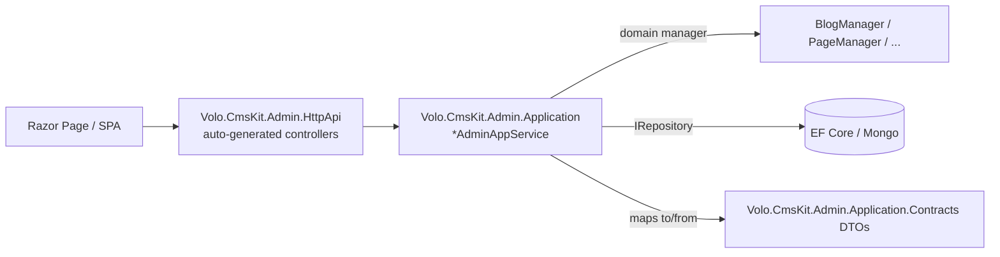

# CMS Kit Admin Application

This page documents the back-office surface of the ABP Framework CMS Kit. The Admin tier is split across five projects under `modules/cms-kit/src/`:

<Card title="Admin tier projects" icon="folder">
- `Volo.CmsKit.Admin.Application.Contracts` — DTOs, app-service interfaces, permission definitions
- `Volo.CmsKit.Admin.Application` — `*AdminAppService` implementations + AutoMapper profiles
- `Volo.CmsKit.Admin.HttpApi` — auto-generated ABP controllers exposing the interfaces
- `Volo.CmsKit.Admin.HttpApi.Client` — typed proxies for blazor / mvc / other clients
- `Volo.CmsKit.Admin.Web` — Razor Pages UI and menu contributors
</Card>

All admin services derive from `CmsKitAdminAppServiceBase` (`modules/cms-kit/src/Volo.CmsKit.Admin.Application/Volo/CmsKit/Admin/CmsKitAdminAppServiceBase.cs`) and are gated by `[RequiresGlobalFeature(typeof(<Feature>))]` plus `[RequiresFeature(CmsKitFeatures.<X>Enable)]` and `[Authorize(CmsKitAdminPermissions.<Area>.Default)]`. The wiring module is `CmsKitAdminApplicationModule`.



## Blog admin services

`BlogAdminAppService` (`modules/cms-kit/src/Volo.CmsKit.Admin.Application/Volo/CmsKit/Admin/Blogs/BlogAdminAppService.cs`) implements `IBlogAdminAppService : ICrudAppService<BlogDto, Guid, BlogGetListInput, CreateBlogDto, UpdateBlogDto>` (`Volo.CmsKit.Admin.Application.Contracts/Volo/CmsKit/Admin/Blogs/IBlogAdminAppService.cs`). It depends on `IBlogRepository`, `BlogManager`, `IBlogPostRepository`, and optionally `BlogFeatureManager`. Extra endpoints beyond CRUD:

- `Task<ListResultDto<BlogDto>> GetAllListAsync()` — used to populate dropdowns
- `Task MoveAllBlogPostsAsync(Guid blogId, Guid? assignToBlogId = null)` — bulk reassign or delete

The DTOs are defined in `modules/cms-kit/src/Volo.CmsKit.Admin.Application.Contracts/Volo/CmsKit/Admin/Blogs/`:

<Card title="Blog DTOs" icon="file-code">
- `BlogDto : ExtensibleEntityDto<Guid>` — `Name`, `Slug`, `ConcurrencyStamp`, `BlogPostCount`
- `CreateBlogDto : ExtensibleObject` — required `Name`/`Slug` with `[DynamicMaxLength]`
- `UpdateBlogDto : ExtensibleObject` — same plus `ConcurrencyStamp`
- `BlogGetListInput : PagedAndSortedResultRequestDto` — `Filter`
- `BlogPostDto` / `BlogPostListDto` — read shapes for posts
- `CreateBlogPostDto` / `UpdateBlogPostDto` — write shapes with `[DynamicMaxLength]` against `BlogPostConsts`
- `BlogPostGetListInput` — `Filter`, `BlogId`, `AuthorId`, `TagId`
- `BlogFeatureInputDto` — toggle per-blog features
</Card>

`BlogPostAdminAppService` implements `IBlogPostAdminAppService : ICrudAppService<BlogPostDto, BlogPostListDto, Guid, BlogPostGetListInput, CreateBlogPostDto, UpdateBlogPostDto>` (`Volo.CmsKit.Admin.Application.Contracts/Volo/CmsKit/Admin/Blogs/IBlogPostAdminAppService.cs`). It adds workflow methods:

- `PublishAsync(Guid id)` / `DraftAsync(Guid id)` / `SendToReviewAsync(Guid id)` — `BlogPostStatus` transitions
- `CreateAndPublishAsync(CreateBlogPostDto input)` and `CreateAndSendToReviewAsync(...)` — combined create + transition
- `HasBlogPostWaitingForReviewAsync()` — surfaces the bell badge on the menu

`BlogFeatureAdminAppService` (`Admin/Blogs/BlogFeatureAdminAppService.cs`) configures per-blog feature toggles via `BlogFeatureManager`.

## Page admin services

`PageAdminAppService` implements `IPageAdminAppService : ICrudAppService<PageDto, PageDto, Guid, GetPagesInputDto, CreatePageInputDto, UpdatePageInputDto>` plus `Task SetAsHomePageAsync(Guid id)` (`Volo.CmsKit.Admin.Application.Contracts/Volo/CmsKit/Admin/Pages/IPageAdminAppService.cs`). `CreatePageInputDto` carries `Title`, `Slug`, `LayoutName`, `Content`, `Script`, `Style`, and a `Status` defaulted to `PageStatus.Draft`. All string properties are bounded by `[DynamicMaxLength(typeof(PageConsts), ...)]`.

The implementation lives at `modules/cms-kit/src/Volo.CmsKit.Admin.Application/Volo/CmsKit/Admin/Pages/PageAdminAppService.cs` and delegates slug uniqueness to `PageManager`. The home-page swap is atomic: `SetAsHomePageAsync` demotes any previous home page within a transaction.

## Tag admin services

`TagAdminAppService` implements `ITagAdminAppService : ICrudAppService<TagDto, Guid, TagGetListInput, TagCreateDto, TagUpdateDto>` (`Volo.CmsKit.Admin.Application.Contracts/Volo/CmsKit/Admin/Tags/ITagAdminAppService.cs`) with an extra `Task<List<TagDefinitionDto>> GetTagDefinitionsAsync()` that surfaces the entity types registered in `CmsKitTagOptions`.

`EntityTagAdminAppService` (`Admin/Tags/EntityTagAdminAppService.cs`) implements `IEntityTagAdminAppService` for applying tags to host entities:

- `Task AddTagToEntityAsync(EntityTagCreateDto input)` — accepts `TagName`, `EntityType`, `EntityId`
- `Task RemoveTagFromEntityAsync(EntityTagRemoveDto input)` — accepts `TagId`, `EntityType`, `EntityId`
- `Task SetEntityTagsAsync(EntityTagSetDto input)` — bulk replace

## Menu admin services

`MenuItemAdminAppService` (`Admin/Menus/MenuItemAdminAppService.cs`) implements `IMenuItemAdminAppService` from `modules/cms-kit/src/Volo.CmsKit.Admin.Application.Contracts/Volo/CmsKit/Admin/Menus/IMenuItemAdminAppService.cs`:

```csharp
public interface IMenuItemAdminAppService : IApplicationService
{
    Task<ListResultDto<MenuItemDto>> GetListAsync();
    Task<MenuItemWithDetailsDto> GetAsync(Guid id);
    Task<MenuItemDto> CreateAsync(MenuItemCreateInput input);
    Task<MenuItemDto> UpdateAsync(Guid id, MenuItemUpdateInput input);
    Task DeleteAsync(Guid id);
    Task MoveMenuItemAsync(Guid id, MenuItemMoveInput input);
    Task<PagedResultDto<PageLookupDto>> GetPageLookupAsync(PageLookupInputDto input);
    Task<ListResultDto<PermissionLookupDto>> GetPermissionLookupAsync(PermissionLookupInputDto inputDto);
    Task<int> GetAvailableMenuOrderAsync(Guid? parentId = null);
}
```

The lookup endpoints feed dropdowns in the menu editor: `GetPageLookupAsync` lists pages that can be linked, `GetPermissionLookupAsync` lists permission names that can guard a menu item, and `GetAvailableMenuOrderAsync` returns the next free `Order` integer for the chosen parent.

## Comment admin services

`CommentAdminAppService` (`Admin/Comments/CommentAdminAppService.cs`) implements `ICommentAdminAppService` (`Volo.CmsKit.Admin.Application.Contracts/Volo/CmsKit/Admin/Comments/ICommentAdminAppService.cs`):

```csharp
public interface ICommentAdminAppService : IApplicationService
{
    Task<PagedResultDto<CommentWithAuthorDto>> GetListAsync(CommentGetListInput input);
    Task<CommentWithAuthorDto> GetAsync(Guid id);
    Task DeleteAsync(Guid id);
    Task UpdateApprovalStatusAsync(Guid id, CommentApprovalDto input);
    Task UpdateSettingsAsync(CommentSettingsDto input);
    Task<int> GetWaitingCountAsync();
}
```

`CommentGetListInput` carries `Filter`, `EntityType`, `RepliedCommentId`, `AuthorUsername`, `CreationStartDate`, `CreationEndDate`, and a `CommentApproveState` filter (`All` / `Waiting` / `Approved` / `Rejected`). `CommentApprovalDto` flips the approval state. `CommentSettingsDto` toggles the global require-moderation switch via the ABP `ISettingManager`.

## Media descriptor admin services

`MediaDescriptorAdminAppService` (`Admin/MediaDescriptors/MediaDescriptorAdminAppService.cs`) implements `IMediaDescriptorAdminAppService`:

```csharp
public interface IMediaDescriptorAdminAppService : IApplicationService
{
    Task<MediaDescriptorDto> CreateAsync(string entityType, CreateMediaInputWithStream inputStream);
    Task DeleteAsync(Guid id);
}
```

`CreateMediaInputWithStream` carries the `IRemoteStreamContent` payload, validated against the `MediaDescriptorDefinition` registered for `entityType`. Returns the persisted `MediaDescriptorDto { Id, EntityType, Name, MimeType, Size }`.

## Global resource admin services

`GlobalResourceAdminAppService` (`Admin/GlobalResources/GlobalResourceAdminAppService.cs`) implements `IGlobalResourceAdminAppService`. It exposes `GetAsync` returning a `GlobalResourcesDto` carrying current `Script` and `Style` text, and `UpdateAsync(GlobalResourcesUpdateDto input)` to persist them via `GlobalResourceManager`.

## Permissions

Defined in `Volo.CmsKit.Admin.Application.Contracts/Volo/CmsKit/Permissions/CmsKitAdminPermissions.cs`. Each area exposes the standard quad:

```csharp
public static class CmsKitAdminPermissions
{
    public const string GroupName = "CmsKit";
    public static class Blogs   { public const string Default = "CmsKit.Blogs";    public const string Create, Update, Delete; }
    public static class Pages   { public const string Default = "CmsKit.Pages";    /* + Create/Update/Delete */ }
    public static class Tags    { public const string Default = "CmsKit.Tags";     /* + Create/Update/Delete */ }
    public static class Comments{ public const string Default = "CmsKit.Comments"; /* + Update/Delete */     }
    public static class Menus   { public const string Default = "CmsKit.MenuItems";/* + Create/Update/Delete */ }
    public static class MediaDescriptors    { public const string Default; /* + Create/Delete */ }
    public static class GlobalResources     { public const string Default; /* + Update */ }
}
```

`CmsKitAdminPermissionDefinitionProvider` registers them as ABP permissions, each requiring the matching `[RequiresGlobalFeature]` on the parent group.

## Auto-generated HTTP API

`Volo.CmsKit.Admin.HttpApi` does not write controllers by hand. Instead it uses ABP's convention-based API exposure — `CmsKitAdminHttpApiModule.ConfigureServices` calls `options.ConventionalControllers.Create(typeof(CmsKitAdminApplicationContractsModule).Assembly)`. That walks every `I*AdminAppService` interface and exposes `/api/cms-kit-admin/<area>/...` routes. `CmsKitAdminRemoteServiceConsts.RemoteServiceName` and `ModuleName` define the discovery keys consumed by the `HttpApi.Client` typed proxies.

## Razor pages

The admin UI under `modules/cms-kit/src/Volo.CmsKit.Admin.Web/Pages/CmsKit/`:

<Card title="Admin Razor pages" icon="window-restore">
- `Blogs/Index.cshtml` + `CreateModal` / `UpdateModal` / `FeaturesModal` / `DeleteBlogModal`
- `BlogPosts/Index.cshtml` + `Create.cshtml` + `Update.cshtml` (full pages — rich editor lives here)
- `Pages/Index.cshtml` + `Create.cshtml` + `Update.cshtml`
- `Tags/Index.cshtml` + `CreateModal` + `EditModal`
- `Menus/MenuItems/Index.cshtml` + `CreateModal` + `UpdateModal`
- `Comments/Index.cshtml` + `Details.cshtml` + `Approve/Index.cshtml`
- `GlobalResources/Index.cshtml`
- `Contents/AddWidgetModal.cshtml`
- `Shared/Components/Comments/CommentSettingViewComponent.cs`
- `Tags/Components/TagEditor/TagEditorViewComponent.cs` — reusable tag picker
</Card>

`CmsKitAdminMenuContributor` (`modules/cms-kit/src/Volo.CmsKit.Admin.Web/Menus/CmsKitAdminMenuContributor.cs`) adds a CMS menu group with one entry per feature, each gated by `RequireFeatures(...)`, `RequireGlobalFeatures(...)`, and `RequirePermissions(...)` so that disabling the feature or revoking the permission hides the entry automatically.

## Where to next

<CardGroup cols={2}>
<Card title="Public surface" icon="globe" href="/module-cms-kit/public">
The matching end-user app services consumed by the front-of-house site.
</Card>
<Card title="Web UI" icon="window" href="/module-cms-kit/web">
Razor pages and view components rendered by the admin + public web modules.
</Card>
</CardGroup>

## Complete permission catalog

`CmsKitAdminPermissions` in `modules/cms-kit/src/Volo.CmsKit.Admin.Application.Contracts/Volo/CmsKit/Permissions/CmsKitAdminPermissions.cs`:

```csharp
public static class CmsKitAdminPermissions
{
    public const string GroupName = "CmsKit";

    public static class Comments
    {
        public const string Default            = GroupName + ".Comments";
        public const string Delete             = Default + ".Delete";
        public const string Update             = Default + ".Update";
        public const string SettingManagement  = Default + ".SettingManagement";
    }
    public static class Tags
    {
        public const string Default = GroupName + ".Tags";
        public const string Create  = Default + ".Create";
        public const string Update  = Default + ".Update";
        public const string Delete  = Default + ".Delete";
    }
    public static class Contents
    {
        public const string Default = GroupName + ".Contents";
        public const string Create  = Default + ".Create";
        public const string Update  = Default + ".Update";
        public const string Delete  = Default + ".Delete";
    }
    public static class Pages
    {
        public const string Default        = GroupName + ".Pages";
        public const string Create         = Default + ".Create";
        public const string Update         = Default + ".Update";
        public const string Delete         = Default + ".Delete";
        public const string SetAsHomePage  = Default + ".SetAsHomePage";
    }
    public static class Blogs
    {
        public const string Default  = GroupName + ".Blogs";
        public const string Create   = Default + ".Create";
        public const string Update   = Default + ".Update";
        public const string Delete   = Default + ".Delete";
        public const string Features = Default + ".Features";
    }
    public static class BlogPosts
    {
        public const string Default = GroupName + ".BlogPosts";
        public const string Create  = Default + ".Create";
        public const string Update  = Default + ".Update";
        public const string Delete  = Default + ".Delete";
        public const string Publish = Default + ".Publish";
    }
    public static class Menus
    {
        public const string Default = GroupName + ".Menus";
        public const string Create  = Default + ".Create";
        public const string Update  = Default + ".Update";
        public const string Delete  = Default + ".Delete";
    }
    public static class GlobalResources
    {
        public const string Default = GroupName + ".GlobalResources";
    }
}
```

Two permissions deserve special attention: `Pages.SetAsHomePage` is independent from `Pages.Update` because promoting a page to the home page has side effects on the menu, and `BlogPosts.Publish` gates `PublishAsync` / `DraftAsync` / `SendToReviewAsync` separately from the basic update so a junior author can edit drafts without being able to push them live.

`CmsKitAdminPermissionDefinitionProvider` registers them in the `CmsKit` permission group. Each permission can be tied to a feature dependency through `.RequireFeatures(...)` / `.RequireGlobalFeatures(...)` on the permission definition, which is what makes the back-office permission tree visually grey-out unrelated entries when a global feature is off.

## CmsKitAdminApplicationModule

The wiring module at `modules/cms-kit/src/Volo.CmsKit.Admin.Application/Volo/CmsKit/Admin/CmsKitAdminApplicationModule.cs`:

```csharp
[DependsOn(
    typeof(CmsKitAdminApplicationContractsModule),
    typeof(CmsKitCommonApplicationModule),
    typeof(CmsKitDomainModule),
    typeof(AbpAutoMapperModule)
)]
public class CmsKitAdminApplicationModule : AbpModule
```

It registers AutoMapper profiles via `Configure<AbpAutoMapperOptions>(o => o.AddMaps<CmsKitAdminApplicationModule>())` and pulls the `Common` application module so admin services can reuse `BlogPostCommonDto`, `CmsUserDto`, and `EntityTagDto`.

## DTO shape conventions

Admin DTOs follow three consistent patterns:

1. **Read shapes** derive from `ExtensibleEntityDto<Guid>` so host extra properties round-trip without modifying CMS Kit. `BlogDto`, `PageDto`, `TagDto`, `MenuItemDto`, `BlogPostDto`/`BlogPostListDto` all fit this.
2. **Write shapes** derive from `ExtensibleObject` and use `[DynamicMaxLength(typeof(<XxxConsts>), nameof(<XxxConsts>.MaxXxxLength))]` so the max-length is read at runtime from the Domain.Shared constants — the host can override the const via `ObjectExtensionManager` configuration and the validation follows.
3. **Update DTOs** that need optimistic concurrency carry `string ConcurrencyStamp` and implement `IHasConcurrencyStamp`.

This means an extension column added by the host application surfaces in the read DTO automatically through `IHasExtraProperties`, and a longer max-length is honored end-to-end by validation, the DbContext model, and the Mongo index.

## Sample request: publish a blog post

```http
POST /api/cms-kit-admin/blog-posts/{id}/publish
Authorization: Bearer ...
```

That route is generated automatically from `IBlogPostAdminAppService.PublishAsync(Guid id)`. ABP's auto-controller pipeline binds `id` from the path, runs `[Authorize(CmsKitAdminPermissions.BlogPosts.Publish)]`, `[RequiresGlobalFeature(typeof(BlogsFeature))]`, and `[RequiresFeature(CmsKitFeatures.BlogEnable)]` before the body executes. The implementation calls `BlogPostManager.PublishAsync(blogPost)`, updates the aggregate's `Status = BlogPostStatus.Published`, and persists the change through `IBlogPostRepository.UpdateAsync`. The pre-write `EntityVersion` enables optimistic concurrency.
