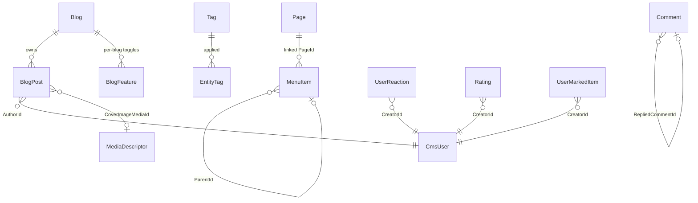

# CMS Kit Domain Layer

This page enumerates every aggregate, domain service, and repository interface in the ABP Framework CMS Kit domain layer. The two packages involved are `Volo.CmsKit.Domain.Shared` (constants, error codes, settings, global feature classes, polymorphic options) at `modules/cms-kit/src/Volo.CmsKit.Domain.Shared/Volo/CmsKit/` and `Volo.CmsKit.Domain` (entities, managers, repository interfaces, exceptions) at `modules/cms-kit/src/Volo.CmsKit.Domain/Volo/CmsKit/`.

## Aggregate diagram



`Blog`, `BlogPost`, `BlogFeature`, `Page`, `Tag`, `EntityTag`, `MediaDescriptor`, `MenuItem`, and `GlobalResource` derive from `FullAuditedAggregateRoot<Guid>` or `AuditedAggregateRoot<Guid>`. `Comment` derives from `AggregateRoot<Guid>`. `UserReaction`, `Rating`, and `UserMarkedItem` derive from `BasicAggregateRoot<Guid>`. All implement `IMultiTenant` so they isolate per tenant.

## Blogs

`modules/cms-kit/src/Volo.CmsKit.Domain/Volo/CmsKit/Blogs/Blog.cs` defines the `Blog` aggregate root with `Name`, `Slug`, and `TenantId`. The internal constructor enforces non-null name and slug, normalizing the slug through `SlugNormalizer.Normalize` (see `modules/cms-kit/src/Volo.CmsKit.Domain/Volo/CmsKit/SlugNormalizer.cs`). Maximum lengths come from `BlogConsts` in the shared package.

`BlogPost` (`modules/cms-kit/src/Volo.CmsKit.Domain/Volo/CmsKit/Blogs/BlogPost.cs`) implements `IHasEntityVersion` for optimistic concurrency. Its fields:

| Field | Type | Notes |
|---|---|---|
| `BlogId` | `Guid` | owning blog |
| `Title` | `string` | `BlogPostConsts.MaxTitleLength` |
| `Slug` | `string` | normalized via `SlugNormalizer` |
| `ShortDescription` | `string` | for listings |
| `Content` | `string` | rich-text body |
| `CoverImageMediaId` | `Guid?` | points at a `MediaDescriptor` |
| `AuthorId` | `Guid` | links to `CmsUser` |
| `Status` | `BlogPostStatus` | `Draft` / `Published` / `WaitingForReview` |
| `EntityVersion` | `int` | concurrency counter |

`BlogFeature` (`modules/cms-kit/src/Volo.CmsKit.Domain/Volo/CmsKit/Blogs/BlogFeature.cs`) stores a per-blog feature toggle (`BlogId`, `FeatureName`, `IsEnabled`); the canonical feature names are defined by `DefaultBlogFeatureProvider`.

Domain managers in the same directory orchestrate the rules: `BlogManager` enforces slug uniqueness on create/update (`BlogSlugAlreadyExistException`), `BlogPostManager` enforces slug uniqueness within a blog (`BlogPostSlugAlreadyExistException`) and sets author/blog ids, and `BlogFeatureManager` plus `BlogFeatureDataSeedContributor` seed the default per-blog toggles.

Repositories:

<Card title="Blog repositories" icon="database">
- `IBlogRepository : IBasicRepository<Blog, Guid>` — `GetListAsync(filter, sorting, maxResultCount, skipCount)`, `GetListWithBlogPostCountAsync`, `GetCountAsync`, `GetBySlugAsync`, `ExistsAsync`, `SlugExistsAsync` (`Blogs/IBlogRepository.cs`)
- `IBlogPostRepository : IBasicRepository<BlogPost, Guid>` — paginated `GetListAsync` filtered by `blogId`, `authorId`, `tagId`, `favoriteUserId`, `statusFilter`; plus `GetBySlugAsync`, `GetAuthorsHasBlogPostsAsync`, `HasBlogPostWaitingForReviewAsync`, `DeleteByBlogIdAsync` (`Blogs/IBlogPostRepository.cs`)
- `IBlogFeatureRepository` — `FindAsync(blogId, featureName)`, `GetListAsync(blogId)` (`Blogs/IBlogFeatureRepository.cs`)
</Card>

## Pages

`Page` (`modules/cms-kit/src/Volo.CmsKit.Domain/Volo/CmsKit/Pages/Page.cs`) carries `Title`, `Slug`, `Content`, `Script`, `Style`, `LayoutName`, `IsHomePage`, `EntityVersion`, and `Status` (`PageStatus.Draft`/`Published`). Setters check length against `PageConsts` constants. Only one page may be a home page; violating this throws `MultipleHomePageException` (`modules/cms-kit/src/Volo.CmsKit.Domain/Volo/CmsKit/Pages/MultipleHomePageException.cs`).

`PageManager` (`Pages/PageManager.cs`) coordinates slug uniqueness (`PageSlugAlreadyExistsException`) and home-page promotion. `IPageRepository` (`Pages/IPageRepository.cs`) exposes `GetListAsync(filter, status, …)`, `GetBySlugAsync`, `FindBySlugAsync`, `ExistsAsync(slug)`, `GetListOfHomePagesAsync`, and `FindTitleAsync(pageId)`.

## Comments

`Comment` (`modules/cms-kit/src/Volo.CmsKit.Domain/Volo/CmsKit/Comments/Comment.cs`) is polymorphic. Fields: `EntityType`, `EntityId`, `Text`, `RepliedCommentId` (self-reference for threads), `CreatorId`, `Url`, `IdempotencyToken`, and a nullable `IsApproved` (`null` = waiting, `true` = approved, `false` = rejected). Approval state transitions are explicit: `Approve()`, `Reject()`, `WaitForApproval()`.

`CommentManager` validates that the `EntityType` is registered with `ICommentEntityTypeDefinitionStore` (default: `DefaultCommentEntityTypeDefinitionStore` at `Comments/DefaultCommentEntityTypeDefinitionStore.cs`); otherwise it throws `EntityNotCommentableException`. `ICommentRepository` (`Comments/ICommentRepository.cs`) exposes:

- `GetWithAuthorAsync(id)` returning `CommentWithAuthorQueryResultItem`
- `GetListAsync(filter, entityType, repliedCommentId, authorUsername, creationStart/End, sorting, paging, CommentApproveState, ct)`
- `GetCountAsync(...)`
- `GetListWithAuthorsAsync(entityType, entityId, …)` for the read-side widget
- `DeleteWithRepliesAsync(comment)` to cascade thread deletion
- `ExistsAsync(idempotencyToken)` for replay protection
- `DeleteByEntityTypeAndIdAsync(entityType, entityId)` when the host entity is removed

## Reactions

`UserReaction` (`modules/cms-kit/src/Volo.CmsKit.Domain/Volo/CmsKit/Reactions/UserReaction.cs`) is `BasicAggregateRoot<Guid>` with `EntityType`, `EntityId`, `ReactionName`, `CreatorId`. The catalog is wired through `CmsKitReactionOptions.EntityTypes` — each `ReactionEntityTypeDefinition` carries the entity-type string and an array of `ReactionDefinition`s referencing icons in `StandardReactions` (`Smile`, `ThumbsUp`, `ThumbsDown`, `Heart`, `Confused`, `Eyes`, `Wink`, `Pray`, `Rocket`, `Victory`, `Rock`, `HeartBroken`).

`ReactionManager` (`Reactions/ReactionManager.cs`) is the domain service that toggles a user's reaction and throws `EntityCantHaveReactionException` for unknown entity types. `IUserReactionRepository` (`Reactions/IUserReactionRepository.cs`) provides `FindAsync(userId, entityType, entityId, reactionName)`, `GetListForUserAsync(userId, entityType, entityId)`, and aggregate `GetSummariesAsync(entityType, entityId)` returning `ReactionSummaryQueryResultItem`.

## Ratings

`Rating` (`modules/cms-kit/src/Volo.CmsKit.Domain/Volo/CmsKit/Ratings/Rating.cs`) stores `EntityType`, `EntityId`, `StarCount` (`short`, validated against `RatingConsts.Min`/`MaxStarCount` — defaults 1..5), and `CreatorId`. `RatingManager` enforces "one rating per user per entity" and uses `IRatingEntityTypeDefinitionStore` to check whether an entity is rateable (`EntityCantHaveRatingException`).

`IRatingRepository` (`Ratings/IRatingRepository.cs`) exposes `GetCurrentUserRatingAsync(entityType, entityId, userId)`, `GetEntityRatesAsync(entityType, entityId)` returning a list of `RatingWithStarCountQueryResultItem`, and `DeleteByEntityTypeAndIdAsync`.

## Tags

`Tag` (`modules/cms-kit/src/Volo.CmsKit.Domain/Volo/CmsKit/Tags/Tag.cs`) carries `EntityType`, `Name`, `TenantId`. `EntityTag` (`Tags/EntityTag.cs`) is the join row binding a tag to an entity instance (`TagId`, `EntityId`). `TagManager` enforces uniqueness via `TagAlreadyExistException`; `EntityTagManager` adds/removes the join rows and checks the registry through `ITagDefinitionStore` (default `DefaultTagDefinitionStore`).

Repositories:

- `ITagRepository : IBasicRepository<Tag, Guid>` — `GetListAsync(entityType, name, sorting, paging)`, `GetCountAsync`, `FindAsync(name, entityType)`, `GetPopularTagsAsync(entityType, top)` → `PopularTag`
- `IEntityTagRepository` — `FindAsync(tagId, entityId)`, `DeleteAllAsync(entityType, entityId)`

## Media descriptors

`MediaDescriptor` (`modules/cms-kit/src/Volo.CmsKit.Domain/Volo/CmsKit/MediaDescriptors/MediaDescriptor.cs`) stores blob metadata (`EntityType`, `Name`, `MimeType`, `Size`); the bytes go to a blob container resolved via `MediaContainer` and ABP's blob storage. `MediaDescriptorManager` validates name length, mime type, and size against the `MediaDescriptorDefinition` registered for the entity type (`InvalidMediaDescriptorNameException`, `EntityCantHaveMediaException`).

`IMediaDescriptorRepository` provides `GetCountAsync`, `GetListAsync`, `GetByNameAsync`, `DeleteByEntityTypeAndIdAsync`.

## Menus

`MenuItem` (`modules/cms-kit/src/Volo.CmsKit.Domain/Volo/CmsKit/Menus/MenuItem.cs`) is a hierarchical aggregate with `ParentId`, `DisplayName`, `IsActive`, `Url`, `Icon`, `Order`, `Target`, `ElementId`, `CssClass`, `PageId` (optional link to a `Page`), and `RequiredPermissionName`. `MenuItemManager` validates parent existence and order; `PageChangedHandler` (`Menus/PageChangedHandler.cs`) subscribes to page deletions to clean up dangling `PageId` references.

`IMenuItemRepository` returns the full ordered tree or filters by `Url` / `PageId`.

## Marked items

`UserMarkedItem` (`modules/cms-kit/src/Volo.CmsKit.Domain/Volo/CmsKit/MarkedItems/UserMarkedItem.cs`) stores a user's bookmark/favorite per entity (`EntityType`, `EntityId`, `CreatorId`). The catalog of marks comes from `CmsKitMarkedItemOptions.EntityTypes`; `StandardMarkedItems.Favorite` is registered by default for `BlogPostConsts.EntityType` when `BlogsFeature` and `MarkedItemsFeature` are both on (see `CmsKitDomainModule`).

`MarkedItemManager` toggles the mark and surfaces `EntityCannotBeMarkedException`, `DuplicateMarkedItemDefinitionException`, and `MarkedItemDefinitionNotFoundException`. `IUserMarkedItemRepository` exposes `IsMarkedAsync`, `GetCountAsync`, and `GetEntitiesByUserAsync`.

## Global resources

`GlobalResource` (`modules/cms-kit/src/Volo.CmsKit.Domain/Volo/CmsKit/GlobalResources/GlobalResource.cs`) is a simple `(Name, Value)` aggregate for site-wide CSS/JS snippets injected by `GlobalScriptViewComponent` and `GlobalStyleViewComponent` in the public web project. `GlobalResourceManager` enforces name uniqueness; `IGlobalResourceRepository.FindByNameAsync(name)` is the read-side hook.

## Content fragments

Content fragments are not a database aggregate — they are runtime snippets rendered by `ContentFragmentViewComponent` (`modules/cms-kit/src/Volo.CmsKit.Common.Web/Pages/CmsKit/Components/Contents/ContentFragmentViewComponent.cs`). The domain shared package defines the `ContentsFeature` global feature and the `BlogPostScrollIndexFeature` flag.

## CmsUser

`CmsUser` (`modules/cms-kit/src/Volo.CmsKit.Domain/Volo/CmsKit/Users/CmsUser.cs`) mirrors a relevant subset of the ABP identity user inside the CMS database so blogs, comments, and reactions can join against authors without crossing the identity bounded context. `CmsUserSynchronizer` listens to identity user changes; `ICmsUserLookupService` (default `CmsUserLookupService`) finds-or-creates the mirror on demand; `ICmsUserRepository` provides the lookups.

## CmsKitDataSeedContributor

The seed contributor that pre-populates standard reactions, marked items, and feature definitions lives in `modules/cms-kit/src/Volo.CmsKit.Domain/Volo/CmsKit/Blogs/BlogFeatureDataSeedContributor.cs` and in feature-specific seeders called from `CmsKitDomainModule`. Test/demo data lives outside `src/` under the module's tests.

## CmsKitDomainModule wiring

```csharp
[DependsOn(
    typeof(CmsKitDomainSharedModule),
    typeof(AbpUsersDomainModule),
    typeof(AbpDddDomainModule),
    typeof(AbpBlobStoringModule),
    typeof(AbpSettingManagementDomainModule)
)]
public class CmsKitDomainModule : AbpModule
```

Inside `ConfigureServices` the module conditionally configures `CmsKitReactionOptions`, `CmsKitRatingOptions`, `CmsKitTagOptions`, and `CmsKitMarkedItemOptions` based on `GlobalFeatureManager.Instance.IsEnabled<TFeature>()`. `PostConfigureServices` runs `ModuleExtensionConfigurationHelper.ApplyEntityConfigurationToEntity(...)` for every aggregate (Blog, BlogPost, BlogFeature, MediaDescriptor, Page, Tag, Comment, MenuItem, CmsUser) so ABP's ObjectExtensionManager picks up extra properties declared by the host.

## Domain.Shared inventory

The shared package at `modules/cms-kit/src/Volo.CmsKit.Domain.Shared/Volo/CmsKit/` carries the contract surface that the Application/Web layers compile against without pulling the full domain:

<Card title="Volo.CmsKit.Domain.Shared contents" icon="box-archive">
- `*Consts.cs` — `BlogConsts`, `BlogPostConsts`, `PageConsts`, `CommentConsts`, `RatingConsts`, `TagConsts`, `MenuItemConsts`, `MediaDescriptorConsts`, `GlobalResourceConsts`
- `BlogPostStatus`, `PageStatus`, `CommentApproveState` enums
- `EntityTypeDefinition`, `ReactionEntityTypeDefinition`, `RatingEntityTypeDefinition`, `TagEntityTypeDefiniton`, `MarkedItemEntityTypeDefinition`, `MediaDescriptorDefinition`
- `StandardReactions`, `StandardMarkedItems` constants
- `GlobalFeatures/*Feature.cs` — every `GlobalFeature` class plus `GlobalCmsKitFeatures`
- `Features/CmsKitFeatures.cs` + `CmsKitFeatureDefinitionProvider`
- `Localization/CmsKitResource.cs` + JSON under `Localization/Resources/`
- `CmsKitDomainSharedModule`, `CmsKitErrorCodes`, `CmsKitSettings`, `CmsKitSettingDefinitionProvider`
</Card>

These types are what the Application and Web layers reference; they intentionally contain no behavior so the Web tier never has to depend on `Volo.CmsKit.Domain`.

## Next

<CardGroup cols={2}>
<Card title="Admin app services" icon="screwdriver-wrench" href="/module-cms-kit/admin">
The `*AdminAppService` classes built on top of these aggregates.
</Card>
<Card title="Persistence" icon="database" href="/module-cms-kit/persistence">
EF Core / Mongo implementations of every `I*Repository` above.
</Card>
</CardGroup>

## Domain managers in depth

Each aggregate that needs cross-entity rules has a paired domain manager in the same folder. Managers are `DomainService` subclasses that the application tier always uses for write operations instead of going to the repository directly:

<Card title="Domain manager inventory" icon="gears">
- `BlogManager` (`Blogs/BlogManager.cs`) — `CreateAsync(name, slug)`, `UpdateAsync(blog, name, slug)`; slug uniqueness against `IBlogRepository.SlugExistsAsync`
- `BlogPostManager` (`Blogs/BlogPostManager.cs`) — `CreateAsync(blog, author, title, slug, …)`, `SetSlugAsync`, `UpdateAsync` — slug uniqueness per blog; publish/draft transitions
- `BlogFeatureManager` (`Blogs/BlogFeatureManager.cs`) — toggle per-blog features
- `PageManager` (`Pages/PageManager.cs`) — `CreateAsync(title, slug, ...)`, `UpdateAsync(page, ...)`, `SetHomePageAsync(page)`; demotes any current home page atomically
- `CommentManager` (`Comments/CommentManager.cs`) — validates entity-type registry, enforces approval state on create depending on `CmsKitSettings.Comments.RequireApprovement`
- `ReactionManager` (`Reactions/ReactionManager.cs`) — toggle reaction; validate against `CmsKitReactionOptions`
- `RatingManager` (`Ratings/RatingManager.cs`) — validate range; enforce one-rating-per-user-per-entity
- `TagManager` (`Tags/TagManager.cs`) — slug uniqueness scoped to `EntityType`
- `EntityTagManager` (`Tags/EntityTagManager.cs`) — add/remove tag bindings, increment `Tag.UsageCount`
- `MediaDescriptorManager` (`MediaDescriptors/MediaDescriptorManager.cs`) — validate name/mime/size against the `MediaDescriptorDefinition`
- `MenuItemManager` (`Menus/MenuItemManager.cs`) — validate parent existence, order calculation
- `MarkedItemManager` (`MarkedItems/MarkedItemManager.cs`) — toggle / validate / dedupe
- `GlobalResourceManager` (`GlobalResources/GlobalResourceManager.cs`) — uniqueness by name
</Card>

These managers are also the points where the app services pass through to maintain invariants — making `IBlogRepository.InsertAsync` directly bypasses slug-uniqueness, which is why no app service does that.

## Slug normalization

`SlugNormalizer` (`modules/cms-kit/src/Volo.CmsKit.Domain/Volo/CmsKit/SlugNormalizer.cs`) is the single source of truth for slug conversion: lowercase, ASCII fold, replace whitespace and most punctuation with hyphens. Every `SetSlug` method on `Blog`, `BlogPost`, `Page`, and `Tag` routes through it, so slugs persisted to the database are always normalized — searches by slug do not need to re-normalize.

## CmsKitGlobalFeatureDefinitions

`CmsKitGlobalFeatureDefinitions` (in `modules/cms-kit/src/Volo.CmsKit.Domain.Shared/Volo/CmsKit/GlobalFeatures/`) registers every global feature class through ABP's `IGlobalFeatureContributor` mechanism. This is also where dependencies between features live — for example `CommentsFeature.Enable()` automatically enables `CmsUserFeature` if it isn't already on, because comments cannot exist without authors mirrored from identity.

## ContentFragment registry

`Volo.CmsKit.Common.Application.Contracts/Volo/CmsKit/Contents/` defines `ContentFragmentDto` and the contributor pattern for the page editor. The host registers `IContentFragmentRenderer` implementations for each fragment name; the public site renders the matching one when it encounters `[ContentFragment:Name=...]` markers in a page body. The admin "Add Widget" modal (`Volo.CmsKit.Admin.Web/Pages/CmsKit/Contents/AddWidgetModal.cshtml`) lets editors pick from the registered fragments.

## Multi-tenancy behavior summary

Every CMS Kit aggregate implements `IMultiTenant`. The implications:

- `Blog`, `BlogPost`, `Page`, `Tag` slugs are unique **within tenant**, so the same slug can exist in different tenants.
- Comments / reactions / ratings / marked items are isolated per tenant by ABP's automatic `IMultiTenant` filter.
- `CmsUser` mirrors a tenant-scoped subset of identity users.
- Polymorphic registrations in `CmsKitReactionOptions`, `CmsKitRatingOptions`, `CmsKitTagOptions`, etc. are deployment-wide — there is no per-tenant "what entity types can be reacted to" customization at the moment.

A deployment that doesn't need multi-tenancy can switch off the multi-tenant filter at the host level via `Configure<AbpDataFilterOptions>(o => o.DefaultStates[typeof(IMultiTenant)] = new DataFilterState(isEnabled: false))` and CMS Kit will simply ignore the `TenantId` column on every row.

## Throwing rules for the application tier

Every exception type lives in the domain layer next to its aggregate. The application services never catch — they let the exceptions bubble through ABP's `IExceptionToErrorInfoConverter` so a `BlogPostSlugAlreadyExistException` becomes a structured HTTP 4xx with code `CmsKit:BlogPost:0001` and a localized message resolved from `CmsKitResource`. Hosts that want to map a domain exception to their own error code can register an `IExceptionFilter` and inspect the `Code` property.
