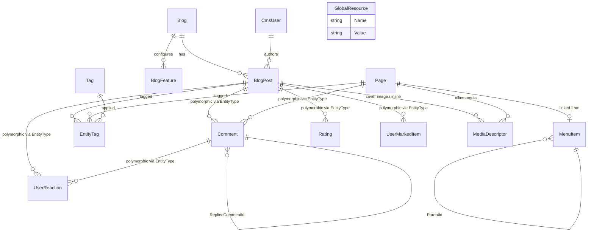
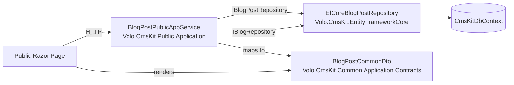

# CMS Kit Module

The ABP Framework CMS Kit is not a monolithic CMS — it is a toolbox of independent content building blocks (blogs, pages, comments, ratings, reactions, tags, polls, media descriptors, menus, marked items, global resources) that any ABP application can opt into through the ABP global-feature system. Source for everything described here lives under `modules/cms-kit/src/`.

## Package layout

CMS Kit follows the standard ABP layered module template, but it is split horizontally into three audiences — administrators, end users (public), and shared — on top of the usual vertical Domain / Application / HttpApi / Web split. The directory tree under `modules/cms-kit/src/` makes the topology explicit:

<Card title="Package layout" icon="folder-tree">
- `Volo.CmsKit.Domain.Shared` — entity consts, error codes, settings, global feature definitions (`modules/cms-kit/src/Volo.CmsKit.Domain.Shared/`)
- `Volo.CmsKit.Domain` — aggregates, managers, repositories (`modules/cms-kit/src/Volo.CmsKit.Domain/`)
- `Volo.CmsKit.Application.Contracts` / `.Application` — top-level wrapper module (`modules/cms-kit/src/Volo.CmsKit.Application/`)
- `Volo.CmsKit.Admin.Application.Contracts` / `.Admin.Application` / `.Admin.HttpApi` / `.Admin.HttpApi.Client` / `.Admin.Web` — back-office surface (`modules/cms-kit/src/Volo.CmsKit.Admin.*/`)
- `Volo.CmsKit.Public.Application.Contracts` / `.Public.Application` / `.Public.HttpApi` / `.Public.HttpApi.Client` / `.Public.Web` — end-user surface (`modules/cms-kit/src/Volo.CmsKit.Public.*/`)
- `Volo.CmsKit.Common.Application.Contracts` / `.Common.Application` / `.Common.HttpApi` / `.Common.HttpApi.Client` / `.Common.Web` — shared widgets (`modules/cms-kit/src/Volo.CmsKit.Common.*/`)
- `Volo.CmsKit.EntityFrameworkCore` — `CmsKitDbContext` + `EfCore*Repository` (`modules/cms-kit/src/Volo.CmsKit.EntityFrameworkCore/`)
- `Volo.CmsKit.MongoDB` — `CmsKitMongoDbContext` + `Mongo*Repository` (`modules/cms-kit/src/Volo.CmsKit.MongoDB/`)
- `Volo.CmsKit.HttpApi` / `.HttpApi.Client` / `.Web` — top-level wrappers that depend on Admin + Public + Common
- `Volo.CmsKit.Installer` — NuGet installer for the ABP CLI
</Card>

The full bundle is composed by `CmsKitDomainModule` at `modules/cms-kit/src/Volo.CmsKit.Domain/Volo/CmsKit/CmsKitDomainModule.cs`, which depends on `CmsKitDomainSharedModule`, `AbpUsersDomainModule`, `AbpDddDomainModule`, `AbpBlobStoringModule`, and `AbpSettingManagementDomainModule`. Each Admin / Public / Common module is wired in its own `Cms*ApplicationModule` class, e.g. `modules/cms-kit/src/Volo.CmsKit.Admin.Application/Volo/CmsKit/Admin/CmsKitAdminApplicationModule.cs`.

## Why split Admin / Public / Common?

Admin and Public packages are deliberately decoupled because hosts often deploy them apart: the marketing site that renders blog posts has no business taking a dependency on the create-blog-post-DTO or the admin permission definitions. By splitting them at the project level the public site can be built without referencing `Volo.CmsKit.Admin.Application.Contracts`, keeping its attack surface small. The `Common` family carries pieces both audiences need — `CmsUser`, `EntityTagDto`, the comments view component, the content fragment widget, etc.

## Global features

Every block is opt-in via the ABP global feature system, defined in `modules/cms-kit/src/Volo.CmsKit.Domain.Shared/Volo/CmsKit/GlobalFeatures/` under the `GlobalCmsKitFeatures` group:

<CardGroup cols={2}>
<Card title="Content blocks" icon="cube">
- `BlogsFeature` (`CmsKit.Blogs`) — `BlogsFeature.cs`
- `PagesFeature` (`CmsKit.Pages`) — `PagesFeature.cs`
- `MenuFeature` (`CmsKit.Menus`) — `MenuFeature.cs`
- `ContentsFeature` (`CmsKit.Contents`) — `ContentsFeature.cs`
- `GlobalResourcesFeature` (`CmsKit.GlobalResources`) — `GlobalResourcesFeature.cs`
- `MediaFeature` (`CmsKit.Media`) — `MediaFeature.cs`
- `BlogPostScrollIndexFeature` (`CmsKit.BlogPost.ScrollIndex`)
</Card>
<Card title="Engagement blocks" icon="thumbs-up">
- `CommentsFeature` (`CmsKit.Comments`) — `CommentsFeature.cs`
- `ReactionsFeature` (`CmsKit.Reactions`) — `ReactionsFeature.cs`
- `RatingsFeature` (`CmsKit.Ratings`) — `RatingsFeature.cs`
- `TagsFeature` (`CmsKit.Tags`) — `TagsFeature.cs`
- `MarkedItemsFeature` (`CmsKit.MarkedItems`) — `MarkedItemsFeature.cs`
- `CmsUserFeature` (`CmsKit.User`) — implicit dependency of the others
</Card>
</CardGroup>

`GlobalCmsKitFeatures` in `modules/cms-kit/src/Volo.CmsKit.Domain.Shared/Volo/CmsKit/GlobalFeatures/GlobalCmsKitFeatures.cs` registers all of them under the module name `CmsKit`. App services, repositories, and view components are decorated with `[RequiresGlobalFeature(typeof(BlogsFeature))]` etc., so a switched-off feature produces a 404 from the HTTP API and is filtered out of the menu by `CmsKitAdminMenuContributor` (`modules/cms-kit/src/Volo.CmsKit.Admin.Web/Menus/CmsKitAdminMenuContributor.cs`).

## Entity map

The aggregates live in `modules/cms-kit/src/Volo.CmsKit.Domain/Volo/CmsKit/<feature>/`. Many of them are "polymorphic" — `Comment`, `UserReaction`, `Rating`, `EntityTag`, `MediaDescriptor`, `UserMarkedItem` all carry an `EntityType` + `EntityId` pair so any host application entity can opt in via a `ReactionEntityTypeDefinition`, `RatingEntityTypeDefinition`, `TagEntityTypeDefiniton`, `MediaDescriptorDefinition`, or `MarkedItemEntityTypeDefinition`.



`Blog`, `BlogPost`, `Page`, `Tag`, `EntityTag`, `MediaDescriptor`, `MenuItem`, `BlogFeature`, and `GlobalResource` are full-blown aggregate roots. `Comment`, `UserReaction`, `Rating`, and `UserMarkedItem` derive from `BasicAggregateRoot<Guid>` because their soft-delete model is intentionally simpler. All aggregates implement `IMultiTenant` so a single deployment can host multiple tenants out of the box (see for example `modules/cms-kit/src/Volo.CmsKit.Domain/Volo/CmsKit/Blogs/Blog.cs`).

## Polymorphic entity registration

Polymorphic blocks need a "what entity types can be tagged / reacted to / rated / marked / commented on / have media" registry. CMS Kit ships a tiny pattern for each:

<AccordionGroup>
<Accordion title="Reactions" icon="face-smile">
`CmsKitReactionOptions.EntityTypes` is a `List<ReactionEntityTypeDefinition>` configured via `Configure<CmsKitReactionOptions>(o => o.EntityTypes.Add(...))`. Inside `CmsKitDomainModule.ConfigureServices`, CMS Kit pre-registers reactions for `BlogPostConsts.EntityType` and `CommentConsts.EntityType` when their features are on. See `modules/cms-kit/src/Volo.CmsKit.Domain/Volo/CmsKit/Reactions/CmsKitReactionOptions.cs` and `StandardReactions` for the built-in icons (Smile, ThumbsUp, ThumbsDown, Heart, Rocket, …).
</Accordion>
<Accordion title="Ratings" icon="star">
`CmsKitRatingOptions.EntityTypes` holds `RatingEntityTypeDefinition` entries. By default, `BlogPostConsts.EntityType` is registered when `BlogsFeature` and `RatingsFeature` are both enabled — see `modules/cms-kit/src/Volo.CmsKit.Domain/Volo/CmsKit/CmsKitDomainModule.cs`.
</Accordion>
<Accordion title="Tags" icon="tag">
`CmsKitTagOptions.EntityTypes` (see `modules/cms-kit/src/Volo.CmsKit.Domain/Volo/CmsKit/Tags/CmsKitTagOptions.cs`) registers `TagEntityTypeDefiniton` (sic — the typo is in the source). The default store is `DefaultTagDefinitionStore`.
</Accordion>
<Accordion title="Media" icon="image">
`CmsKitMediaOptions.EntityTypes` lists `MediaDescriptorDefinition`s, each binding an entity type name to a blob storage container, allowed mime types, and max byte size.
</Accordion>
<Accordion title="Marked items" icon="bookmark">
`CmsKitMarkedItemOptions.EntityTypes` registers `MarkedItemEntityTypeDefinition` per (entity type, mark name) — by default `BlogPostConsts.EntityType` + `StandardMarkedItems.Favorite`.
</Accordion>
<Accordion title="Comments" icon="comment">
`ICommentEntityTypeDefinitionStore` (default implementation `DefaultCommentEntityTypeDefinitionStore`) keeps an `EntityTypeDefinition` list for everything that can be commented on. Look at `modules/cms-kit/src/Volo.CmsKit.Domain/Volo/CmsKit/Comments/DefaultCommentEntityTypeDefinitionStore.cs`.
</Accordion>
</AccordionGroup>

## Cross-package data flow

The high-level request path for a public-side read of a blog post is illustrated below — the public app service consults the public repository implementation registered by the persistence module, falls back to global feature checks, and shapes a `BlogPostCommonDto` from `Volo.CmsKit.Common.Application.Contracts`. The admin path is symmetrical but starts in `Volo.CmsKit.Admin.Application`.



## Settings, permissions, and resources

Settings live in `modules/cms-kit/src/Volo.CmsKit.Domain.Shared/Volo/CmsKit/CmsKitSettings.cs` and are seeded by `CmsKitSettingDefinitionProvider`. Permissions are defined in `Volo.CmsKit.Admin.Application.Contracts` under `Volo/CmsKit/Permissions/` (`CmsKitAdminPermissions.Blogs.Default` / `.Create` / `.Update` / `.Delete` and the same for `Pages`, `Tags`, `Comments`, `Menus`, `MediaDescriptors`, `GlobalResources`). Localization JSON sits under `modules/cms-kit/src/Volo.CmsKit.Domain.Shared/Volo/CmsKit/Localization/Resources/`.

## Where to go next

<CardGroup cols={2}>
<Card title="Domain layer" icon="cube" href="/module-cms-kit/domain">
Aggregates, managers, IRepository contracts, and the `CmsKitDomainModule` wiring.
</Card>
<Card title="Admin surface" icon="screwdriver-wrench" href="/module-cms-kit/admin">
`*AdminAppService` classes, DTOs, controllers, and permission policies.
</Card>
<Card title="Public surface" icon="globe" href="/module-cms-kit/public">
`*PublicAppService` classes for blogs, pages, comments, ratings, reactions.
</Card>
<Card title="Persistence" icon="database" href="/module-cms-kit/persistence">
`CmsKitDbContext`, `CmsKitMongoDbContext`, and the EF Core / Mongo repositories.
</Card>
</CardGroup>

The `Volo.CmsKit.Web` page (`/module-cms-kit/web`) walks through Razor pages, view components, and the navigation contributors.

## Error codes

All exceptions thrown by the domain layer carry an ABP error code defined in `modules/cms-kit/src/Volo.CmsKit.Domain.Shared/Volo/CmsKit/CmsKitErrorCodes.cs`. These end up as the `code` field in the HTTP error response — useful for both diagnostics and localized error mapping:

<Card title="Error code catalog" icon="circle-exclamation">
- `CmsKit:Tag:0001` — `TagAlreadyExistException`
- `CmsKit:Tag:0002` — `EntityNotTaggableException`
- `CmsKit:Page:0001` — `PageSlugAlreadyExistsException`
- `CmsKit:Page:0002` — `MultipleHomePageException`
- `CmsKit:Rating:0001` — `EntityCantHaveRatingException`
- `CmsKit:Reaction:0001` — `EntityCantHaveReactionException`
- `CmsKit:Blog:0001` — `BlogSlugAlreadyExistException`
- `CmsKit:BlogPost:0001` — `BlogPostSlugAlreadyExistException`
- `CmsKit:Comments:0001` — `EntityNotCommentableException`
- `CmsKit:Media:0001` / `0002` — `InvalidMediaDescriptorNameException` / `EntityCantHaveMediaException`
- `CmsKit:MarkedItem:0001` / `0002` / `0003` — entity cannot be marked / definition not found / duplicate marked item
</Card>

## Tenant-level feature gates

CMS Kit ships a second axis of toggles in addition to the global features. `modules/cms-kit/src/Volo.CmsKit.Domain.Shared/Volo/CmsKit/Features/CmsKitFeatures.cs` defines per-tenant feature switches managed by ABP's `IFeatureChecker`:

```csharp
public static class CmsKitFeatures
{
    public const string GroupName = "CmsKit";
    public const string BlogEnable           = GroupName + ".BlogEnable";
    public const string CommentEnable        = GroupName + ".CommentEnable";
    public const string GlobalResourceEnable = GroupName + ".GlobalResourceEnable";
    public const string MenuEnable           = GroupName + ".MenuEnable";
    public const string PageEnable           = GroupName + ".PageEnable";
    public const string RatingEnable         = GroupName + ".RatingEnable";
    public const string ReactionEnable       = GroupName + ".ReactionEnable";
    public const string TagEnable            = GroupName + ".TagEnable";
    public const string MarkedItemEnable     = GroupName + ".MarkedItemEnable";
}
```

`CmsKitFeatureDefinitionProvider` (in the same folder) registers each one with a default of `true`. The distinction matters: a global feature being off means the deployment never compiled / migrated the tables for it, while a tenant feature being off only hides the area for one tenant — they share a database with everything switched on globally. Both checks are wired into the `[RequiresFeature]` + `[RequiresGlobalFeature]` decoration on every app service and the `.RequireFeatures(...)` + `.RequireGlobalFeatures(...)` chain on the menu contributor.

## Settings

`CmsKitSettings` (`modules/cms-kit/src/Volo.CmsKit.Domain.Shared/Volo/CmsKit/CmsKitSettings.cs`) currently exposes one setting: `CmsKit.Comments.RequireApprovement` toggles comment moderation. `CmsKitSettingDefinitionProvider` registers it with a default of `false`. The admin tier surfaces a toggle for it through `ICommentAdminAppService.UpdateSettingsAsync(CommentSettingsDto input)` and the `CommentSettingViewComponent` in `Volo.CmsKit.Admin.Web/Pages/CmsKit/Shared/Components/Comments/`.

## Connection string

The single connection string name is `AbpCmsKitDbProperties.ConnectionStringName = "AbpCmsKit"` (`modules/cms-kit/src/Volo.CmsKit.Domain/Volo/CmsKit/AbpCmsKitDbProperties.cs`). Hosts that want CMS Kit to share the application database can leave this unset — ABP falls back to the `Default` connection string. Hosts that want CMS Kit in a separate database define `"ConnectionStrings:AbpCmsKit"` in configuration. The same convention applies for `DbTablePrefix = "CmsKit"` and an optional `DbSchema` — see [Persistence](/module-cms-kit/persistence) for the resulting table layout.
