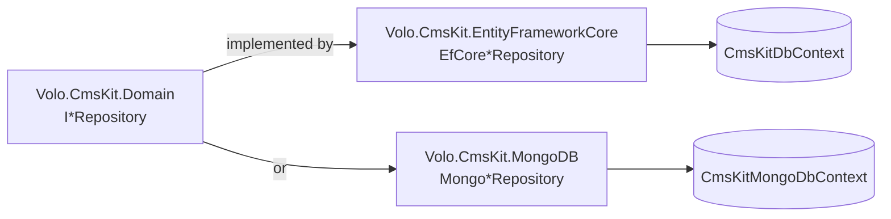
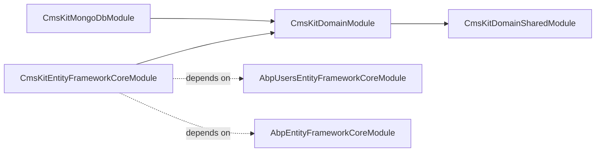

# CMS Kit Persistence

The ABP Framework CMS Kit ships two interchangeable persistence providers — Entity Framework Core (`Volo.CmsKit.EntityFrameworkCore`) and MongoDB (`Volo.CmsKit.MongoDB`) — both implementing the same `I*Repository` contracts declared in `Volo.CmsKit.Domain`. A host application depends on exactly one of them; the rest of the module is provider-agnostic.



## EF Core: CmsKitDbContext

`CmsKitDbContext` (`modules/cms-kit/src/Volo.CmsKit.EntityFrameworkCore/Volo/CmsKit/EntityFrameworkCore/CmsKitDbContext.cs`) implements `ICmsKitDbContext` and extends `AbpDbContext<CmsKitDbContext>`. It is annotated with `[ConnectionStringName(AbpCmsKitDbProperties.ConnectionStringName)]` so hosts can route the CMS schema to a separate database via ABP's connection-string resolver.

The `DbSet`s exposed:

| Property | Entity |
|---|---|
| `Comments` | `Comment` |
| `User` | `CmsUser` |
| `Reactions` | `UserReaction` |
| `Ratings` | `Rating` |
| `Tags` | `Tag` |
| `EntityTags` | `EntityTag` |
| `Pages` | `Page` |
| `Blogs` | `Blog` |
| `BlogPosts` | `BlogPost` |
| `BlogFeatures` | `BlogFeature` |
| `MediaDescriptors` | `MediaDescriptor` |
| `MenuItems` | `MenuItem` |
| `GlobalResources` | `GlobalResource` |
| `UserMarkedItems` | `UserMarkedItem` |

Inside `OnModelCreating`, the context calls `builder.ConfigureCmsKit()`. That extension is defined in `modules/cms-kit/src/Volo.CmsKit.EntityFrameworkCore/Volo/CmsKit/EntityFrameworkCore/CmsKitDbContextModelCreatingExtensions.cs` and is the single source of truth for table names, column lengths, and indexes.

## Feature-aware model creation

`ConfigureCmsKit` checks `GlobalFeatureManager.Instance.IsEnabled<TFeature>()` for every block and either `builder.Entity<T>(...)` or `builder.Ignore<T>()`. When a feature is off, the EF Core model literally does not contain the table, so the migrator never produces or expects it. For example:

```csharp
if (GlobalFeatureManager.Instance.IsEnabled<ReactionsFeature>())
{
    builder.Entity<UserReaction>(b =>
    {
        b.ToTable(AbpCmsKitDbProperties.DbTablePrefix + "UserReactions", AbpCmsKitDbProperties.DbSchema);
        b.ConfigureByConvention();
        b.Property(x => x.EntityType).IsRequired().HasMaxLength(UserReactionConsts.MaxEntityTypeLength);
        b.Property(x => x.EntityId).IsRequired().HasMaxLength(UserReactionConsts.MaxEntityIdLength);
        b.Property(x => x.ReactionName).IsRequired().HasMaxLength(UserReactionConsts.MaxReactionNameLength);
        b.HasIndex(x => new { x.TenantId, x.EntityType, x.EntityId, x.ReactionName });
        b.HasIndex(x => new { x.TenantId, x.CreatorId, x.EntityType, x.EntityId, x.ReactionName });
        b.ApplyObjectExtensionMappings();
    });
}
else
{
    builder.Ignore<UserReaction>();
}
```

All tables use the prefix and schema in `AbpCmsKitDbProperties` (`modules/cms-kit/src/Volo.CmsKit.Domain/Volo/CmsKit/AbpCmsKitDbProperties.cs`) — by default `CmsKit` with no schema. Indexes are tenant-scoped first to make `IMultiTenant` queries cheap, and `ApplyObjectExtensionMappings()` lets host applications add columns to any aggregate via ABP's `ObjectExtensionManager`.

## EF Core repositories

`CmsKitEntityFrameworkCoreModule` (`modules/cms-kit/src/Volo.CmsKit.EntityFrameworkCore/Volo/CmsKit/EntityFrameworkCore/CmsKitEntityFrameworkCoreModule.cs`) registers every repository against its DbContext:

```csharp
context.Services.AddAbpDbContext<CmsKitDbContext>(options =>
{
    options.AddRepository<CmsUser, EfCoreCmsUserRepository>();
    options.AddRepository<UserReaction, EfCoreUserReactionRepository>();
    options.AddRepository<Comment, EfCoreCommentRepository>();
    options.AddRepository<Rating, EfCoreRatingRepository>();
    options.AddRepository<Tag, EfCoreTagRepository>();
    options.AddRepository<EntityTag, EfCoreEntityTagRepository>();
    options.AddRepository<Page, EfCorePageRepository>();
    options.AddRepository<Blog, EfCoreBlogRepository>();
    options.AddRepository<BlogPost, EfCoreBlogPostRepository>();
    options.AddRepository<BlogFeature, EfCoreBlogFeatureRepository>();
    options.AddRepository<MediaDescriptor, EfCoreMediaDescriptorRepository>();
    options.AddRepository<GlobalResource, EfCoreGlobalResourceRepository>();
    options.AddRepository<UserMarkedItem, EfCoreUserMarkedItemRepository>();
});
```

Each repository derives from `EfCoreRepository<CmsKitDbContext, TEntity, Guid>` and lives next to its aggregate under `modules/cms-kit/src/Volo.CmsKit.EntityFrameworkCore/Volo/CmsKit/<Area>/EfCore*Repository.cs`.

<Card title="EF Core repository file map" icon="database">
- `Blogs/EfCoreBlogRepository.cs` — implements `IBlogRepository.GetListAsync(filter, sorting, paging)`, `GetListWithBlogPostCountAsync` (a `JOIN` + group-by), `GetBySlugAsync`, `SlugExistsAsync`
- `Blogs/EfCoreBlogPostRepository.cs` — multi-criterion `GetListAsync(filter, blogId, authorId, tagId, favoriteUserId, statusFilter, paging, sorting)` — composed by chaining `WhereIf` predicates, then joins to `EntityTags` when `tagId` is set and to `UserMarkedItems` when `favoriteUserId` is set
- `Blogs/EfCoreBlogFeatureRepository.cs`
- `Pages/EfCorePageRepository.cs` — paginated filter+status; `GetListOfHomePagesAsync` for sanity checks
- `Comments/EfCoreCommentRepository.cs` — author join via `CmsKitDbContext.User`; threaded delete cascades via `DeleteWithRepliesAsync`
- `Reactions/EfCoreUserReactionRepository.cs` — adds the `GetSummariesAsync` GROUP BY query
- `Ratings/EfCoreRatingRepository.cs` — `GetEntityRatesAsync` produces the per-star histogram via group-by
- `Tags/EfCoreTagRepository.cs` + `EfCoreEntityTagRepository.cs` — `GetPopularTagsAsync` joins entity-tag and orders by COUNT
- `Menus/EfCoreMenuItemRepository.cs`
- `MediaDescriptors/EfCoreMediaDescriptorRepository.cs`
- `MarkedItems/EfCoreUserMarkedItemRepository.cs`
- `GlobalResources/EfCoreGlobalResourceRepository.cs` — `FindByNameAsync`
- `Users/EfCoreCmsUserRepository.cs`
</Card>

The query helpers `WhereIf`, `OrderByIf`, and `PageBy` come from ABP — see `Volo.Abp.EntityFrameworkCore` extension methods used throughout these files.

## MongoDB: CmsKitMongoDbContext

`CmsKitMongoDbContext` (`modules/cms-kit/src/Volo.CmsKit.MongoDB/Volo/CmsKit/MongoDB/CmsKitMongoDbContext.cs`) extends `AbpMongoDbContext` and implements `ICmsKitMongoDbContext`. It exposes one `IMongoCollection<T>` per aggregate (Comments, UserReactions, CmsUsers, Ratings, Tags, EntityTags, Pages, Blogs, BlogPosts, BlogFeatures, MediaDescriptors, MenuItems, GlobalResources, UserMarkedItems). `CreateModel` configures BSON serialization via `modelBuilder.Entity<T>()` calls and tenant-scoped indexes inside `CmsKitMongoDbContextExtensions`.

`CmsKitMongoDbModule` mirrors the EF Core registration:

```csharp
context.Services.AddMongoDbContext<CmsKitMongoDbContext>(options =>
{
    options.AddRepository<CmsUser, MongoCmsUserRepository>();
    options.AddRepository<Comment, MongoCommentRepository>();
    options.AddRepository<UserReaction, MongoUserReactionRepository>();
    options.AddRepository<Rating, MongoRatingRepository>();
    options.AddRepository<Tag, MongoTagRepository>();
    options.AddRepository<EntityTag, MongoEntityTagRepository>();
    options.AddRepository<Page, MongoPageRepository>();
    options.AddRepository<Blog, MongoBlogRepository>();
    options.AddRepository<BlogPost, MongoBlogPostRepository>();
    options.AddRepository<BlogFeature, MongoBlogFeatureRepository>();
    options.AddRepository<MediaDescriptor, MongoMediaDescriptorRepository>();
    options.AddRepository<MenuItem, MongoMenuItemRepository>();
    options.AddRepository<GlobalResource, MongoGlobalResourceRepository>();
    options.AddRepository<UserMarkedItem, MongoUserMarkedItemRepository>();
});
```

## Mongo repositories

Implementations sit under `modules/cms-kit/src/Volo.CmsKit.MongoDB/Volo/CmsKit/MongoDB/<Area>/Mongo*Repository.cs`. They derive from `MongoDbRepository<CmsKitMongoDbContext, TEntity, Guid>` and translate the same filter/paging semantics to `AsQueryable()` LINQ-to-Mongo queries. Notable nuances:

- `MongoBlogPostRepository.GetListAsync` cannot literally JOIN, so it pulls the candidate `BlogPost` set, then does in-memory enrichment via `IUserMarkedItemRepository` and `IEntityTagRepository` when `favoriteUserId` / `tagId` are present.
- `MongoCommentRepository.GetListWithAuthorsAsync` joins comments + users via a manual lookup pipeline.
- `MongoUserReactionRepository.GetSummariesAsync` uses `GroupBy(x => x.ReactionName)` on the queryable.

The repository file map mirrors the EF Core list above; see `modules/cms-kit/src/Volo.CmsKit.MongoDB/Volo/CmsKit/MongoDB/Blogs/`, `Pages/`, `Comments/`, `Reactions/`, `Ratings/`, `Tags/`, `Menus/`, `MediaDescriptors/`, `MarkedItems/`, `GlobalResources/`, `Users/`.

## Connection string & schema

`AbpCmsKitDbProperties.ConnectionStringName = "AbpCmsKit"` — if the host's `ConnectionStrings` section contains an `AbpCmsKit` entry, CMS Kit will use it; otherwise it falls back to the `Default` connection string. `DbTablePrefix = "CmsKit"` and `DbSchema = null` set the EF Core table layout (e.g. `CmsKitBlogs`, `CmsKitBlogPosts`, `CmsKitPages`, `CmsKitComments`, `CmsKitUserReactions`, `CmsKitRatings`, `CmsKitTags`, `CmsKitEntityTags`, `CmsKitMediaDescriptors`, `CmsKitMenuItems`, `CmsKitGlobalResources`, `CmsKitUserMarkedItems`, `CmsKitUsers`, `CmsKitBlogFeatures`).

## Object extensions & multi-tenancy

Every aggregate is `IMultiTenant`, so EF Core inherits the global tenant filter from `AbpDbContext`; MongoDB applies the same filter from `AbpMongoDbContext`. Both providers call `ApplyObjectExtensionMappings()` so that properties registered via `ObjectExtensionManager.Instance.AddOrUpdate(...)` are persisted as columns (EF Core) or BSON fields (Mongo) without changing the aggregate class.

## Where to next

<CardGroup cols={2}>
<Card title="Domain layer" icon="cube" href="/module-cms-kit/domain">
The `I*Repository` contracts and aggregates these classes implement.
</Card>
<Card title="Web UI" icon="window" href="/module-cms-kit/web">
The Razor pages and view components that consume these repositories through the app services.
</Card>
</CardGroup>

## Table layout reference

With default `DbTablePrefix = "CmsKit"` and `DbSchema = null`, the EF Core migrator generates the following tables (one per `DbSet`):

| Table | Aggregate | Primary key | Notable indexes |
|---|---|---|---|
| `CmsKitBlogs` | `Blog` | `Id` | `Slug` unique within tenant |
| `CmsKitBlogPosts` | `BlogPost` | `Id` | `(BlogId, Slug)` unique; `AuthorId` |
| `CmsKitBlogFeatures` | `BlogFeature` | `Id` | `(BlogId, FeatureName)` unique |
| `CmsKitPages` | `Page` | `Id` | `Slug` unique within tenant |
| `CmsKitComments` | `Comment` | `Id` | `(EntityType, EntityId)`; `RepliedCommentId`; `IdempotencyToken` unique |
| `CmsKitUserReactions` | `UserReaction` | `Id` | `(TenantId, EntityType, EntityId, ReactionName)`; `(TenantId, CreatorId, EntityType, EntityId, ReactionName)` |
| `CmsKitRatings` | `Rating` | `Id` | `(EntityType, EntityId)`; `(CreatorId, EntityType, EntityId)` unique |
| `CmsKitTags` | `Tag` | `Id` | `(EntityType, Name)` unique within tenant |
| `CmsKitEntityTags` | `EntityTag` | `Id` | `(TagId, EntityId)` unique |
| `CmsKitMediaDescriptors` | `MediaDescriptor` | `Id` | `EntityType` |
| `CmsKitMenuItems` | `MenuItem` | `Id` | `ParentId`; `PageId` |
| `CmsKitGlobalResources` | `GlobalResource` | `Id` | `Name` unique within tenant |
| `CmsKitUserMarkedItems` | `UserMarkedItem` | `Id` | `(EntityType, EntityId, CreatorId)` unique |
| `CmsKitUsers` | `CmsUser` | `Id` | `(TenantId, UserName)`; `(TenantId, Email)` |

The Mongo equivalent uses collection names that match the `DbSet` property name (`Blogs`, `BlogPosts`, `Comments`, `UserReactions`, `Ratings`, `Tags`, `EntityTags`, `Pages`, `BlogFeatures`, `MediaDescriptors`, `MenuItems`, `GlobalResources`, `UserMarkedItems`, `CmsUsers`).

## Soft delete

Every aggregate that derives from `FullAuditedAggregateRoot<Guid>` (Blog, BlogPost, BlogFeature, Page, Tag, EntityTag, MediaDescriptor, MenuItem, GlobalResource) participates in ABP's soft-delete filter. The `IsDeleted` flag is set instead of physical removal; `DeleterId` and `DeletionTime` are recorded. Repository methods inherit this filter automatically — callers that want to see deleted rows must use `IDataFilter<ISoftDelete>.Disable()`. Aggregates that derive from `BasicAggregateRoot<Guid>` (Comment, UserReaction, Rating, UserMarkedItem) are *not* soft-deleted; their domain semantics make a physical delete acceptable and reduce the cost of pruning churn.

## Concurrency

`Blog`, `BlogPost`, `Page`, `Tag`, and `MediaDescriptor` carry an ABP `ConcurrencyStamp` (inherited from the abstract base) which both providers map to a `xmin`/`__v` column or to a Mongo version field. The matching `UpdateBlogDto`, `UpdateBlogPostDto`, `UpdatePageInputDto`, and `UpdateTagDto` implement `IHasConcurrencyStamp` so admin clients submit the stamp they read and the persistence layer raises `AbpDbConcurrencyException` on a stale write.

## Blob storage for media

`MediaDescriptor` only stores metadata — the actual bytes live in a blob container resolved through `Volo.Abp.BlobStoring`. The container name is per-`MediaDescriptorDefinition` (see `CmsKitMediaOptions`), and the default blob provider is the host's choice (`FileSystem`, `Azure`, `AwsS3`, `Database`, …). `MediaContainer` in `Volo.CmsKit.Domain/Volo/CmsKit/MediaDescriptors/MediaContainer.cs` is the typed blob-container abstraction the app services call into.

## Module wiring chart



Hosts pick exactly one of `CmsKitEntityFrameworkCoreModule` or `CmsKitMongoDbModule` in their `[DependsOn]` chain. The rest of the stack — Domain, Application, HttpApi, Web — works identically against either provider thanks to the `I*Repository` abstractions.
