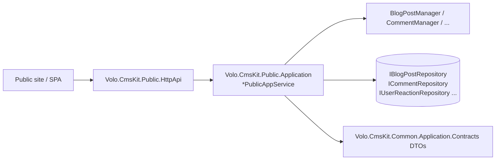

# CMS Kit Public Application

The "public" tier of the ABP Framework CMS Kit is the read-mostly, end-user-facing API. It is intentionally split from the admin tier so a marketing website can compile without pulling administrator DTOs or permission definitions. Source lives in:

<Card title="Public tier projects" icon="folder">
- `Volo.CmsKit.Public.Application.Contracts` — DTOs and `*PublicAppService` interfaces (`modules/cms-kit/src/Volo.CmsKit.Public.Application.Contracts/`)
- `Volo.CmsKit.Public.Application` — implementations (`modules/cms-kit/src/Volo.CmsKit.Public.Application/Volo/CmsKit/Public/`)
- `Volo.CmsKit.Public.HttpApi` / `.HttpApi.Client` — auto-controllers and proxies
- `Volo.CmsKit.Public.Web` — Razor pages, view components, menu contributor
</Card>

All public services derive from `CmsKitPublicAppServiceBase` (`modules/cms-kit/src/Volo.CmsKit.Public.Application/Volo/CmsKit/Public/CmsKitPublicAppServiceBase.cs`). They share `Volo.CmsKit.Common.Application.Contracts` DTOs (`BlogPostCommonDto`, `CmsUserDto`, `EntityTagDto`, etc.) with the admin tier so the two surfaces map to the same wire shape where it makes sense.



## BlogPostPublicAppService

`BlogPostPublicAppService` (`modules/cms-kit/src/Volo.CmsKit.Public.Application/Volo/CmsKit/Public/Blogs/BlogPostPublicAppService.cs`) implements `IBlogPostPublicAppService` (`Volo.CmsKit.Public.Application.Contracts/Volo/CmsKit/Public/Blogs/IBlogPostPublicAppService.cs`). It is decorated with `[RequiresFeature(CmsKitFeatures.BlogEnable)]` and `[RequiresGlobalFeature(typeof(BlogsFeature))]`.

```csharp
public interface IBlogPostPublicAppService : IApplicationService
{
    Task<PagedResultDto<BlogPostCommonDto>> GetListAsync(string blogSlug, BlogPostGetListInput input);
    Task<BlogPostCommonDto> GetAsync(string blogSlug, string blogPostSlug);
    Task<PagedResultDto<CmsUserDto>> GetAuthorsHasBlogPostsAsync(BlogPostFilteredPagedAndSortedResultRequestDto input);
    Task<CmsUserDto> GetAuthorHasBlogPostAsync(Guid id);
    Task DeleteAsync(Guid id);
    Task<string> GetTagNameAsync(Guid tagId);
}
```

Constructor injection takes `IBlogRepository`, `IBlogPostRepository`, `ITagRepository`, and `BlogPostManager`. `BlogPostGetListInput` (in `Volo.CmsKit.Public.Application.Contracts/Volo/CmsKit/Public/Blogs/BlogPostGetListInput.cs`) carries `AuthorId`, `TagId`, and `FilterOnFavorites` — the same shape powers "/blog/by-author/{userName}" and "/blog/by-tag/{tag}" Razor pages.

The output `BlogPostCommonDto` comes from `Volo.CmsKit.Common.Application.Contracts` — it includes `Title`, `Slug`, `ShortDescription`, `Content`, `Author` (`CmsUserDto`), tags, reaction summary, rating average, and the `CoverImage` media descriptor reference.

## PagePublicAppService

`PagePublicAppService` (`Public.Application/Volo/CmsKit/Public/Pages/PagePublicAppService.cs`) implements:

```csharp
public interface IPagePublicAppService : IApplicationService
{
    Task<PageDto> FindBySlugAsync(string slug);
    Task<bool> DoesSlugExistAsync(string slug);
    Task<PageDto> FindDefaultHomePageAsync();
}
```

`FindBySlugAsync` returns the published page or null; `FindDefaultHomePageAsync` returns whichever page has `IsHomePage = true` — the public Razor `Index` page falls back to this when the site root is requested without a slug. `PageDto` includes `Title`, `Slug`, `Content`, `Script`, `Style`, `LayoutName`, and a `ContentFragments` list rendered by the content fragment view component.

## CommentPublicAppService

`CommentPublicAppService` (`Public.Application/Volo/CmsKit/Public/Comments/CommentPublicAppService.cs`) implements `ICommentPublicAppService` (`Public.Application.Contracts/Volo/CmsKit/Public/Comments/ICommentPublicAppService.cs`):

```csharp
public interface ICommentPublicAppService : IApplicationService
{
    Task<ListResultDto<CommentWithDetailsDto>> GetListAsync(string entityType, string entityId);
    Task<CommentDto> CreateAsync(string entityType, string entityId, CreateCommentInput input);
    Task<CommentDto> UpdateAsync(Guid id, UpdateCommentInput input);
    Task DeleteAsync(Guid id);
}
```

`CreateCommentInput` carries the `Text`, an optional `RepliedCommentId` for threaded replies, and an `IdempotencyToken` enforced by `ICommentRepository.ExistsAsync(idempotencyToken)` to prevent double-submits. `CommentWithDetailsDto` adds author info, reaction summary (when `ReactionsFeature` is on for the `CommentConsts.EntityType`), and the recursive replies tree. The service throws `EntityNotCommentableException` when `entityType` is not registered with `ICommentEntityTypeDefinitionStore`.

The implementation also publishes a `CreatedCommentEvent` (`Public.Application.Contracts/Volo/CmsKit/Public/Comments/CreatedCommentEvent.cs`) on the distributed event bus so host applications can hook moderation / notification workflows.

## ReactionPublicAppService

`ReactionPublicAppService` (`Public.Application/Volo/CmsKit/Public/Reactions/ReactionPublicAppService.cs`) implements `IReactionPublicAppService`:

```csharp
public interface IReactionPublicAppService : IApplicationService
{
    Task<ListResultDto<ReactionWithSelectionDto>> GetForSelectionAsync(string entityType, string entityId);
    Task CreateAsync(string entityType, string entityId, string reaction);
    Task DeleteAsync(string entityType, string entityId, string reaction);
}
```

`GetForSelectionAsync` walks `CmsKitReactionOptions.EntityTypes` to find the reactions defined for `entityType`, then joins each one with the current user's selection state and the total count. `ReactionWithSelectionDto` thus shows both "👍 24" and "is the current viewer one of those 24". `CreateAsync` and `DeleteAsync` toggle the row via `ReactionManager`, and `EntityCantHaveReactionException` becomes a 4xx if the entity type isn't registered.

## RatingPublicAppService

`RatingPublicAppService` implements `IRatingPublicAppService` (`Public.Application.Contracts/Volo/CmsKit/Public/Ratings/IRatingPublicAppService.cs`):

```csharp
public interface IRatingPublicAppService : IApplicationService
{
    Task<RatingDto> CreateAsync(string entityType, string entityId, CreateUpdateRatingInput input);
    Task DeleteAsync(string entityType, string entityId);
    Task<List<RatingWithStarCountDto>> GetGroupedStarCountsAsync(string entityType, string entityId);
}
```

`CreateUpdateRatingInput` carries a `short StarCount` validated against `RatingConsts.MinStarCount..MaxStarCount`. `GetGroupedStarCountsAsync` returns a histogram (count per star value) used by the rating view component to render the breakdown bars. One rating per user per entity is enforced inside `RatingManager`.

## MarkedItemPublicAppService

`MarkedItemPublicAppService` implements `IMarkedItemPublicAppService`:

```csharp
public interface IMarkedItemPublicAppService : IApplicationService
{
    Task<MarkedItemWithToggleDto> GetForUserAsync(string entityType, string entityId);
    Task<bool> ToggleAsync(string entityType, string entityId);
}
```

`ToggleAsync` adds the bookmark if the user hasn't marked the entity, removes it otherwise, returning the new state. `MarkedItemWithToggleDto` includes the total mark count for the entity plus a boolean indicating whether the current user is in that set. This is what the heart/star icon next to a blog post hooks into.

## MenuItemPublicAppService

`MenuItemPublicAppService` implements `IMenuItemPublicAppService { Task<List<MenuItemDto>> GetListAsync(); }`. It returns the active menu items the current user is allowed to see — `RequiredPermissionName` is evaluated server-side before the row leaves the service. The Razor view component then renders the hierarchy.

## GlobalResourcePublicAppService

`GlobalResourcePublicAppService` exposes `IGlobalResourcePublicAppService` returning a `GlobalResourceDto { Script, Style }` consumed by `GlobalScriptViewComponent` and `GlobalStyleViewComponent` (`modules/cms-kit/src/Volo.CmsKit.Public.Web/Pages/CmsKit/Shared/Components/GlobalResources/`).

## Feature gates and authorization

Every public app service is decorated as follows (taking blog posts as the example):

```csharp
[RequiresFeature(CmsKitFeatures.BlogEnable)]
[RequiresGlobalFeature(typeof(BlogsFeature))]
public class BlogPostPublicAppService : CmsKitPublicAppServiceBase, IBlogPostPublicAppService
```

Read endpoints (`GetListAsync`, `GetAsync`, `FindBySlugAsync`) are unauthenticated by default — they return public content. Write endpoints (`CreateAsync` on comments, ratings, reactions, marked items) require `[Authorize]` because they need `ICurrentUser.Id` to set the `CreatorId`. The `Public.HttpApi` controllers respect those attributes via ABP's auto-controller pipeline.

## Public Razor pages

`Volo.CmsKit.Public.Web` (`modules/cms-kit/src/Volo.CmsKit.Public.Web/Pages/CmsKit/`) ships a small set of opinionated pages and a much larger set of widgets:

<Card title="Public Razor pages" icon="globe">
- `Public/Blogs/Index.cshtml` — blog landing
- `Public/Blogs/{blogSlug}/Index.cshtml` — post list
- `Public/Blogs/{blogSlug}/{blogPostSlug}/Index.cshtml` — post detail
- `Public/Pages/{slug}/Index.cshtml` — CMS page
- `Shared/Components/Commenting/CommentingViewComponent.cs` — comment block
- `Shared/Components/Blogs/BlogPostComment/DefaultBlogPostCommentViewComponent.cs` — blog-specific override
- `Shared/Components/MarkedItemToggle/MarkedItemToggleViewComponent.cs`
- `Shared/Components/Rating/RatingViewComponent.cs`
- `Shared/Components/ReactionSelection/ReactionSelectionViewComponent.cs`
- `Shared/Components/Tags/TagViewComponent.cs` + `PopularTags/PopularTagsViewComponent.cs`
- `Shared/Components/GlobalResources/Script/GlobalScriptViewComponent.cs` + `Style/GlobalStyleViewComponent.cs`
</Card>

`CmsKitPublicMenuContributor` (`modules/cms-kit/src/Volo.CmsKit.Public.Web/Menus/CmsKitPublicMenuContributor.cs`) reads from `IMenuItemPublicAppService` and merges the CMS-Kit menu into the host's `StandardMenus.Main`. The full Razor / view-component story is on the [Web UI page](/module-cms-kit/web).

## Where next

<CardGroup cols={2}>
<Card title="Persistence" icon="database" href="/module-cms-kit/persistence">
EF Core / Mongo backings for every repository these services consume.
</Card>
<Card title="Web UI" icon="window" href="/module-cms-kit/web">
View components and Razor pages the public site exposes on top of these app services.
</Card>
</CardGroup>

## CmsKitPublicApplicationModule

`modules/cms-kit/src/Volo.CmsKit.Public.Application/Volo/CmsKit/Public/CmsKitPublicApplicationModule.cs` is the wiring module:

```csharp
[DependsOn(
    typeof(CmsKitPublicApplicationContractsModule),
    typeof(CmsKitCommonApplicationModule),
    typeof(CmsKitDomainModule),
    typeof(AbpAutoMapperModule)
)]
public class CmsKitPublicApplicationModule : AbpModule
```

Like the admin module, it adds AutoMapper profiles for the public DTOs via `Configure<AbpAutoMapperOptions>(o => o.AddMaps<CmsKitPublicApplicationModule>())`. The mappers are tucked next to the app services under `Public.Application/Volo/CmsKit/Public/CmsKitPublicApplicationMappers.cs`.

## Common DTOs

`Volo.CmsKit.Common.Application.Contracts/Volo/CmsKit/`:

<Card title="Shared public + admin DTOs" icon="share-nodes">
- `Blogs/BlogPostCommonDto` — used by both admin and public reads of a blog post
- `Users/CmsUserDto` — author shape with username + display name
- `Tags/EntityTagDto` — `(TagId, EntityId, EntityType)` plus the tag name
- `Tags/PopularTagDto` — `TagDto` + usage count
- `Tags/TagDto`
- `Menus/MenuItemDto` — base shape consumed by both admin and public menu services
- `Contents/ContentFragmentDto` — payload for the content fragment widget
- `MediaDescriptors/MediaDescriptorDto`
</Card>

The presence of `Common` is why the public and admin packages don't depend on each other yet still produce identical wire payloads when reading the same entity — both reference `Common.Application.Contracts`.

## Rate-limiting comments via idempotency

`CreateCommentInput.IdempotencyToken` is a client-generated unique string that the comment app service checks against `ICommentRepository.ExistsAsync(idempotencyToken)` before inserting. If the same token has been used recently, the existing comment is returned instead of creating a duplicate — this protects against retry storms (e.g. a flaky network on a mobile client) without per-IP throttling. The token is also stored in the `Comment` row so `CommentRepository` can reuse the unique index.

## Sample: post a comment

```http
POST /api/cms-kit-public/comments/{entityType}/{entityId}
Content-Type: application/json
Authorization: Bearer ...

{
  "text": "Great post!",
  "repliedCommentId": null,
  "idempotencyToken": "client-uuid-here"
}
```

Routed to `ICommentPublicAppService.CreateAsync(string entityType, string entityId, CreateCommentInput input)` via auto-controllers. The implementation:

1. Calls `ICommentEntityTypeDefinitionStore.IsDefinedAsync(entityType)` and throws `EntityNotCommentableException` (HTTP 4xx, error code `CmsKit:Comments:0001`) if not registered.
2. Reads `ICurrentUser.Id` for `CreatorId` — the `[Authorize]` on the method guarantees this is non-null.
3. Checks `ICommentRepository.ExistsAsync(idempotencyToken)` to short-circuit duplicates.
4. Creates the aggregate; sets `IsApproved = null` if the `CmsKitSettings.Comments.RequireApprovement` setting is on, otherwise auto-approves.
5. Inserts via `ICommentRepository.InsertAsync` and publishes `CreatedCommentEvent` on `IDistributedEventBus`.
6. Returns `CommentDto`.

The same idempotency + entity-type registry pattern is used by `IReactionPublicAppService.CreateAsync`, `IRatingPublicAppService.CreateAsync`, and `IMarkedItemPublicAppService.ToggleAsync`.

## CmsKitPublicHttpApiModule

The HTTP API project (`Volo.CmsKit.Public.HttpApi`) exposes every `I*PublicAppService` automatically through ABP's `ConventionalControllers.Create(typeof(CmsKitPublicApplicationContractsModule).Assembly)` call inside `CmsKitPublicHttpApiModule.ConfigureServices`. The remote-service name (`CmsKitPublicRemoteServiceConsts.RemoteServiceName`) and `ModuleName` are exported to `Volo.CmsKit.Public.HttpApi.Client` so typed proxies know which endpoint group to talk to.

The auto-controllers infer HTTP verbs from method name prefixes: `GetAsync` → `GET`, `CreateAsync` → `POST`, `UpdateAsync` → `PUT`, `DeleteAsync` → `DELETE`, `ToggleAsync` → `POST`. Route segments are inferred from method parameters — `(string entityType, string entityId, ...)` becomes `/{entityType}/{entityId}/...`.
