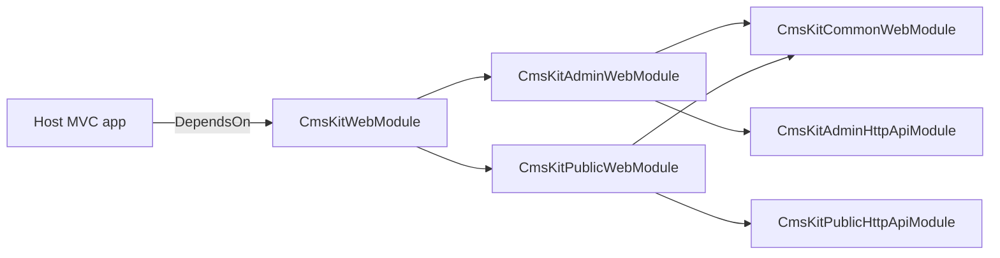
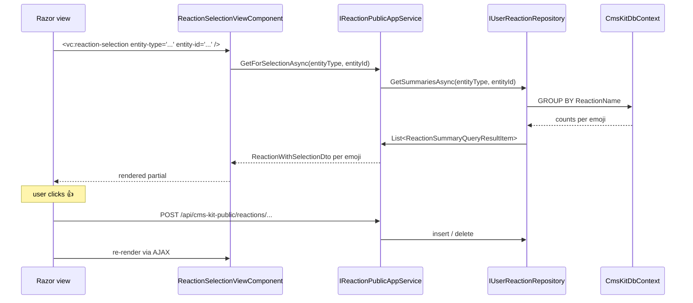

# CMS Kit Web UI

The web tier of the ABP Framework CMS Kit is split across four web projects, each with a distinct role:

<Card title="Web tier projects" icon="folder">
- `Volo.CmsKit.Admin.Web` — back-office Razor pages + `CmsKitAdminMenuContributor`
- `Volo.CmsKit.Public.Web` — end-user Razor pages, widgets, and `CmsKitPublicMenuContributor`
- `Volo.CmsKit.Common.Web` — view components used by both audiences (comment configuration, content preview, content fragment)
- `Volo.CmsKit.Web` — meta-module that simply `[DependsOn]` Admin + Public web (`modules/cms-kit/src/Volo.CmsKit.Web/CmsKitWebModule.cs`)
</Card>

The composite `CmsKitWebModule` is what host applications usually drop in their `[DependsOn]` chain when they want the full experience; the Admin/Public modules can be pulled individually for split deployments.



## Admin Razor pages

All admin pages live under `modules/cms-kit/src/Volo.CmsKit.Admin.Web/Pages/CmsKit/`. The Razor page model classes follow the standard ABP convention (`IndexModel`, `CreateModalModel`, `UpdateModalModel` per area) and call into the corresponding `*AdminAppService` over DI.

<Card title="Admin Razor inventory" icon="window-restore">
- `Blogs/` — `Index.cshtml(.cs)`, `CreateModal.cshtml(.cs)`, `UpdateModal.cshtml(.cs)`, `FeaturesModal.cshtml(.cs)`, `DeleteBlogModal.cshtml(.cs)`
- `BlogPosts/` — `Index.cshtml(.cs)`, `Create.cshtml(.cs)`, `Update.cshtml(.cs)` (full pages — these embed the rich-text editor and tag editor)
- `Pages/` — `Index.cshtml(.cs)`, `Create.cshtml(.cs)`, `Update.cshtml(.cs)`
- `Tags/` — `Index.cshtml(.cs)`, `CreateModal.cshtml(.cs)`, `EditModal.cshtml(.cs)`
- `Menus/MenuItems/` — `Index.cshtml(.cs)`, `CreateModal.cshtml(.cs)`, `UpdateModal.cshtml(.cs)`
- `Comments/` — `Index.cshtml(.cs)`, `Details.cshtml(.cs)`, `Approve/Index.cshtml(.cs)`
- `GlobalResources/Index.cshtml(.cs)`
- `Contents/AddWidgetModal.cshtml(.cs)` — used by the page editor to inject content fragments
- `Shared/Components/Comments/CommentSettingViewComponent.cs` — the global moderation switch
- `Tags/Components/TagEditor/TagEditorViewComponent.cs` + `Default.cshtml` — reusable tag picker hooked into `IEntityTagAdminAppService`
</Card>

Razor cshtml files declare their layout via `_ViewImports.cshtml`. The shared imports file is at `modules/cms-kit/src/Volo.CmsKit.Admin.Web/Pages/CmsKit/_ViewImports.cshtml`.

## CmsKitAdminMenuContributor

`CmsKitAdminMenuContributor` (`modules/cms-kit/src/Volo.CmsKit.Admin.Web/Menus/CmsKitAdminMenuContributor.cs`) implements `IMenuContributor` and wires CMS menu items into ABP's `StandardMenus.Main`. The shape:

```csharp
public class CmsKitAdminMenuContributor : IMenuContributor
{
    public async Task ConfigureMenuAsync(MenuConfigurationContext context)
    {
        if (context.Menu.Name == StandardMenus.Main)
            await ConfigureMainMenuAsync(context);
    }

    private Task AddCmsMenuAsync(MenuConfigurationContext context)
    {
        var l = context.GetLocalizer<CmsKitResource>();
        var cmsMenus = new List<ApplicationMenuItem>();

        cmsMenus.Add(new ApplicationMenuItem(CmsKitAdminMenus.Pages.PagesMenu, l["Pages"], "/Cms/Pages", "fa fa-file-alt", order: 6)
            .RequireFeatures(CmsKitFeatures.PageEnable)
            .RequireGlobalFeatures(typeof(PagesFeature))
            .RequirePermissions(CmsKitAdminPermissions.Pages.Default));

        cmsMenus.Add(new ApplicationMenuItem(CmsKitAdminMenus.Blogs.BlogsMenu, l["Blogs"], "/Cms/Blogs", "fa fa-blog", order: 7)
            .RequireFeatures(CmsKitFeatures.BlogEnable)
            .RequireGlobalFeatures(typeof(BlogsFeature))
            .RequirePermissions(CmsKitAdminPermissions.Blogs.Default));
        // ... Tags, Menus, Comments, GlobalResources, MediaDescriptors
    }
}
```

`.RequireFeatures(...)` ties the menu entry to the runtime `IFeatureChecker` so a tenant with the feature disabled never sees the menu. `.RequireGlobalFeatures(...)` makes the entry vanish when the corresponding global feature is off at the deployment level. `.RequirePermissions(...)` finally hides the entry from users that lack the back-office permission.

## Public Razor pages

`Volo.CmsKit.Public.Web` lays out a small set of high-traffic pages plus the bulk of the view components users actually see:

<Card title="Public Razor inventory" icon="globe">
- `Pages/Public/CmsKit/Blogs/Index.cshtml(.cs)` — landing showing all blogs
- `Pages/Public/CmsKit/Blogs/BlogPost.cshtml(.cs)` — single post view (slug-routed)
- `Pages/Public/CmsKit/Pages/Index.cshtml(.cs)` — CMS page view (slug-routed, falls back to `FindDefaultHomePageAsync` for `/`)
- `Pages/CmsKit/Shared/Components/Blogs/BlogPostComment/DefaultBlogPostCommentViewComponent.cs` — opinionated wrapper around `CommentingViewComponent` configured for `BlogPostConsts.EntityType`
- `Pages/CmsKit/Shared/Components/Commenting/CommentingViewComponent.cs` — generic comments widget for any entity
- `Pages/CmsKit/Shared/Components/GlobalResources/Script/GlobalScriptViewComponent.cs` + `Style/GlobalStyleViewComponent.cs` — injects site-wide JS/CSS into `_Layout`
- `Pages/CmsKit/Shared/Components/MarkedItemToggle/MarkedItemToggleViewComponent.cs` — heart/star toggle for favoriting
- `Pages/CmsKit/Shared/Components/PopularTags/PopularTagsViewComponent.cs` — tag cloud calling `ITagRepository.GetPopularTagsAsync`
- `Pages/CmsKit/Shared/Components/Rating/RatingViewComponent.cs` — star rating + histogram
- `Pages/CmsKit/Shared/Components/ReactionSelection/ReactionSelectionViewComponent.cs` — emoji reaction picker
- `Pages/CmsKit/Shared/Components/Tags/TagViewComponent.cs` — read-only list of tags applied to an entity
- `Pages/CmsKit/Shared/Modals/Login/LoginModal.cshtml(.cs)` — auth prompt used when an anonymous visitor tries to comment/react
</Card>

Each view component takes its `(entityType, entityId)` from the calling Razor view: `<vc:reaction-selection entity-type="@BlogPostConsts.EntityType" entity-id="@Model.BlogPost.Id" />`. The component injects the matching public app service (`IReactionPublicAppService`, `IRatingPublicAppService`, …) and renders a partial under the same folder.

## CmsKitPublicMenuContributor

`CmsKitPublicMenuContributor` (`modules/cms-kit/src/Volo.CmsKit.Public.Web/Menus/CmsKitPublicMenuContributor.cs`) targets a dedicated `CmsKitMenus.Public` menu name. It pulls the current menu definition via `IMenuItemPublicAppService.GetListAsync()` and recursively re-builds the hierarchy as `ApplicationMenuItem`s, respecting `IsActive`, `ParentId`, `Order`, `Icon`, `Url`, `Target`, `ElementId`, `CssClass`. Items with a `RequiredPermissionName` are filtered server-side by the app service before they reach the contributor, so no permission re-check is needed in the UI:

```csharp
if (GlobalFeatureManager.Instance.IsEnabled<MenuFeature>() &&
    await featureChecker.IsEnabledAsync(CmsKitFeatures.MenuEnable))
{
    var menuAppService = context.ServiceProvider.GetRequiredService<IMenuItemPublicAppService>();
    var menuItems = await menuAppService.GetListAsync();
    foreach (var menuItemDto in menuItems.Where(x => x.ParentId == null && x.IsActive))
        AddChildItems(menuItemDto, menuItems, context.Menu);
}
```

## Common view components

`Volo.CmsKit.Common.Web` (`modules/cms-kit/src/Volo.CmsKit.Common.Web/Pages/CmsKit/Components/`) hosts widgets shared between admin and public surfaces:

<Card title="Common.Web view components" icon="puzzle-piece">
- `Comments/CmsKitCommentConfigurationViewComponent.cs` + `CmsKitCommentConfiguration.cshtml` — injects the JS config needed by the comment widget (current user, idempotency, endpoints)
- `ContentPreview/ContentPreviewViewComponent.cs` + `Default.cshtml` — used inside the admin page editor's preview tab to render the body the same way the public layer will
- `Contents/ContentFragmentViewComponent.cs` + `ContentFragment.cshtml` — renders an `IContentFragmentRenderer`-backed widget inside a page or blog post when `ContentsFeature` is on
</Card>

## Wiring the host

A typical MVC host references just `CmsKitWebModule` in its `[DependsOn]` chain. That pulls Admin + Public + Common web, the matching `HttpApi` modules, and the contracts. If a host only ships the public site (no back-office), it can reference `CmsKitPublicWebModule` directly and skip the admin tree to avoid leaking write-side controllers and DTOs into the deployment.

## Where to next

<CardGroup cols={2}>
<Card title="Admin services" icon="screwdriver-wrench" href="/module-cms-kit/admin">
The app services these admin Razor pages call into.
</Card>
<Card title="Public services" icon="globe" href="/module-cms-kit/public">
The end-user app services backing every view component on the public site.
</Card>
</CardGroup>

## Layouts & view imports

Each Razor page area declares its imports through `_ViewImports.cshtml`:

- `modules/cms-kit/src/Volo.CmsKit.Admin.Web/Pages/CmsKit/_ViewImports.cshtml` — pulls the admin layout from the host module and wires up the standard ABP tag helpers for modals, dynamic forms, and the data grid component
- `modules/cms-kit/src/Volo.CmsKit.Public.Web/Pages/CmsKit/_ViewImports.cshtml` — registers tag helpers for the public widgets so view components can be referenced as `<vc:rating />` etc.
- `modules/cms-kit/src/Volo.CmsKit.Common.Web/Pages/_ViewImports.cshtml` + `Pages/CmsKit/_ViewImports.cshtml` — global imports for shared view components

The admin pages always use the host application's main layout — there is no CMS Kit-specific admin shell. The public pages can be wrapped in a custom layout per `Page.LayoutName`: when the `Page` aggregate has a `LayoutName` set, `Public/Pages/{slug}/Index.cshtml.cs` looks up that layout via the standard Razor `Layout = Model.Page.LayoutName` assignment.

## Bundling

CMS Kit registers its CSS/JS through the standard ABP bundling system inside `CmsKitPublicWebModule.ConfigureServices` and `CmsKitAdminWebModule.ConfigureServices`. The page editor, comment widget, reaction picker, rating widget, and tag editor each ship their own scss/js files under the appropriate `wwwroot/` and `Pages/.../Components/` folders. Hosts can override any of them through the standard `Abp.AspNetCore.Mvc.UI.Bundling` extension chain.

## ContentFragmentViewComponent

`ContentFragmentViewComponent` in `Volo.CmsKit.Common.Web` (`modules/cms-kit/src/Volo.CmsKit.Common.Web/Pages/CmsKit/Components/Contents/ContentFragmentViewComponent.cs`) is the rendering hook for the "widget" system. A page or blog post can embed `[ContentFragment:Name=Foo]` markers in its content; the public renderer expands them into a server-side render of `ContentFragment.cshtml`. The set of available fragments is registered via host-side `IContentFragmentRenderer` implementations — host applications drop in their own renderers per fragment name to inject dynamic blocks (e.g. a product catalog teaser inside a blog post).

## Menu integration with the host

When the host's main layout calls `<abp-menu />`, ABP iterates every registered `IMenuContributor`. CMS Kit registers two:

- `CmsKitAdminMenuContributor` targets `StandardMenus.Main` and adds the back-office tree
- `CmsKitPublicMenuContributor` targets `CmsKitMenus.Public` (a distinct menu name) and rebuilds the dynamic menu items from `MenuItem` aggregates

The host's layout decides which menu name to render where: the back-office sidebar typically renders `StandardMenus.Main`, while the public top bar renders `CmsKitMenus.Public`. This split lets one ABP application host both surfaces without their menus colliding.

## CmsKitAdminWebModule and CmsKitPublicWebModule

Both modules follow the same conventional shape: a `[DependsOn]` chain pulling the matching `HttpApi.Client` module, the `Common.Web` shared widgets, and the upstream ABP MVC UI modules; a `ConfigureServices` that registers virtual file paths, bundle contributors, menu contributors, and `Configure<AbpAspNetCoreMvcOptions>` for the Razor pages folder. The `CmsKitWebModule` at the top merely composes them:

```csharp
[DependsOn(
    typeof(CmsKitPublicWebModule),
    typeof(CmsKitAdminWebModule),
    typeof(CmsKitApplicationContractsModule)
)]
public class CmsKitWebModule : AbpModule { }
```

Hosts that want only the public surface skip `CmsKitWebModule` and reference `CmsKitPublicWebModule` directly. Hosts that want only the admin surface do the symmetrical thing with `CmsKitAdminWebModule`.

## Reactions widget data flow



The same pattern repeats for ratings, marked items, and tags: a view component reads the public app service, renders a partial, and lets the client mutate it through an auto-generated controller endpoint. View components are zero-config because the public app services are auto-controllers — there are no hand-written controllers in CMS Kit Web.
