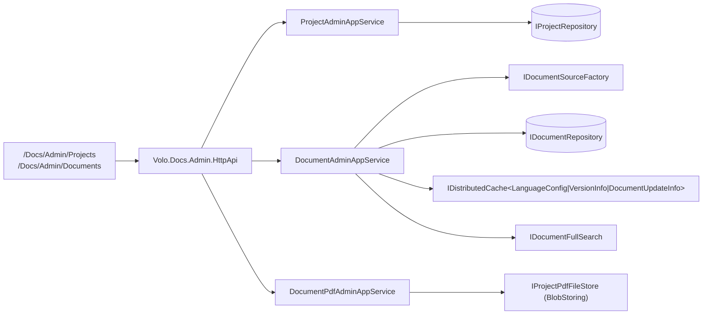
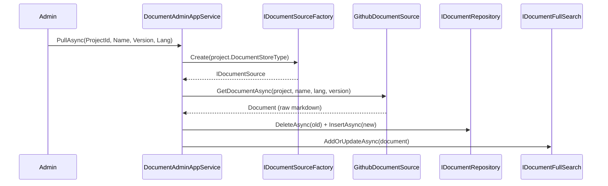

# Docs Admin Application

The Docs admin tier of the ABP Framework manages projects and the cached document store: registering a project, pulling content from its source, clearing caches, reindexing search, and generating PDFs. Source lives across:

<Card title="Docs admin tier projects" icon="folder">
- `Volo.Docs.Admin.Application.Contracts` — DTOs, app-service interfaces, `DocsAdminPermissions` (`modules/docs/src/Volo.Docs.Admin.Application.Contracts/`)
- `Volo.Docs.Admin.Application` — `ProjectAdminAppService`, `DocumentAdminAppService`, `DocumentPdfAdminAppService` + background jobs
- `Volo.Docs.Admin.HttpApi` / `.HttpApi.Client` — auto-controllers + typed proxies
- `Volo.Docs.Admin.Web` — Razor Pages back-office (`modules/docs/src/Volo.Docs.Admin.Web/Pages/Docs/Admin/`)
</Card>



## DocsAdminPermissions

`DocsAdminPermissions` (`Volo.Docs.Admin.Application.Contracts/Volo/Docs/Admin/DocsAdminPermissions.cs`):

```csharp
public class DocsAdminPermissions
{
    public const string GroupName = "Docs.Admin";
    public static class Projects
    {
        public const string Default = GroupName + ".Projects";
        public const string Delete = Default + ".Delete";
        public const string Update = Default + ".Update";
        public const string Create = Default + ".Create";
        public const string ManagePdfFiles = Default + ".ManagePdfFiles";
    }
    public static class Documents
    {
        public const string Default = GroupName + ".Documents";
    }
}
```

`DocsAdminPermissionDefinitionProvider` (in the same folder) registers these with the ABP permission system. Each admin app service carries `[Authorize(DocsAdminPermissions.<Area>.Default)]` so an unauthorized request never reaches the body.

## ProjectAdminAppService

`ProjectAdminAppService` (`Volo.Docs.Admin.Application/Volo/Docs/Admin/Projects/ProjectAdminAppService.cs`) implements `IProjectAdminAppService` (`Volo.Docs.Admin.Application.Contracts/Volo/Docs/Admin/Projects/IProjectAdminAppService.cs`):

```csharp
public interface IProjectAdminAppService : IApplicationService
{
    Task<PagedResultDto<ProjectDto>> GetListAsync(PagedAndSortedResultRequestDto input);
    Task<ProjectDto> GetAsync(Guid id);
    Task<ProjectDto> CreateAsync(CreateProjectDto input);
    Task<ProjectDto> UpdateAsync(Guid id, UpdateProjectDto input);
    Task DeleteAsync(Guid id);
    Task ReindexAsync(ReindexInput input);
    Task ReindexAllAsync();
    Task<List<ProjectWithoutDetailsDto>> GetListWithoutDetailsAsync();
}
```

Constructor dependencies: `IProjectRepository`, `IDocumentRepository`, `IDocumentFullSearch`, `IGuidGenerator`, `IProjectPdfFileStore`. `ReindexAsync` pulls every document belonging to a project and pushes it into the Elasticsearch index via `IDocumentFullSearch`; `ReindexAllAsync` does the same for every project — useful after schema upgrades.

`CreateProjectDto` (`Volo.Docs.Admin.Application.Contracts/Volo/Docs/Admin/Projects/CreateProjectDto.cs`) carries the same shape as the `Project` aggregate: `Name`, `ShortName`, `Format`, `DocumentStoreType`, `DefaultDocumentName`, `NavigationDocumentName`, `ParametersDocumentName`, `MinimumVersion`, `MainWebsiteUrl`, `LatestVersionBranchName`, plus an `ExtraProperties` dictionary that drives source-specific config (e.g. the `GitHubRootUrl` consumed by `ProjectGithubExtensions.GetGitHubUrl`).

`ProjectDto` (`Projects/ProjectDto.cs`) implements `IHasConcurrencyStamp` and `IHasExtraProperties` so the front-end can detect lost updates and round-trip the source-specific bag.

## DocumentAdminAppService

`DocumentAdminAppService` (`Volo.Docs.Admin.Application/Volo/Docs/Admin/Documents/DocumentAdminAppService.cs`) is the workhorse for pulling content from sources and managing the cache:

```csharp
public interface IDocumentAdminAppService : IApplicationService
{
    Task ClearCacheAsync(ClearCacheInput input);
    Task PullAllAsync(PullAllDocumentInput input);
    Task PullAsync(PullDocumentInput input);
    Task<PagedResultDto<DocumentDto>> GetAllAsync(GetAllInput input);
    Task RemoveFromCacheAsync(Guid documentId);
    Task ReindexAsync(Guid documentId);
    Task<List<DocumentInfoDto>> GetFilterItemsAsync();
    Task<List<ProjectWithoutDetailsDto>> GetProjectsAsync();
}
```

Constructor:

```csharp
public DocumentAdminAppService(IProjectRepository projectRepository,
    IDocumentRepository documentRepository,
    IDocumentSourceFactory documentStoreFactory,
    IDistributedCache<DocumentUpdateInfo> documentUpdateCache,
    IDistributedCache<List<VersionInfo>> versionCache,
    IDistributedCache<LanguageConfig> languageCache,
    IDocumentFullSearch elasticSearchService)
```

`ClearCacheAsync` purges three distributed caches keyed by the project: the language config, the available versions, and the document-update info. Cache keys are built via `CacheKeyGenerator.GenerateProjectLanguageCacheKey`, `GenerateProjectVersionsCacheKey`, and `GenerateDocumentUpdateInfoCacheKey` (`modules/docs/src/Volo.Docs.Domain/Volo/Docs/Caching/CacheKeyGenerator.cs`):

```csharp
public virtual async Task ClearCacheAsync(ClearCacheInput input)
{
    var project = await _projectRepository.GetAsync(input.ProjectId);
    var languageCacheKey = CacheKeyGenerator.GenerateProjectLanguageCacheKey(project);
    await _languageCache.RemoveAsync(languageCacheKey, true);
    var versionCacheKey = CacheKeyGenerator.GenerateProjectVersionsCacheKey(project);
    await _versionCache.RemoveAsync(versionCacheKey, true);
    // ...
}
```

`PullAsync(PullDocumentInput input)` (`PullDocumentInput` carries `ProjectId`, `Name`, `LanguageCode`, `Version`) resolves the `IDocumentSource` via `IDocumentSourceFactory`, calls `GetDocumentAsync`, persists the result with `IDocumentRepository`, and pushes the body into Elasticsearch. `PullAllAsync(PullAllDocumentInput input)` enumerates every document in the project's navigation manifest and pulls them in sequence — this is the "rebuild everything" button.

`GetAllAsync(GetAllInput input)` reflects every filter exposed by `IDocumentRepository.GetAllAsync` (project, name, version, language, file name, format, plus min/max for each of the four timestamps: creation, last-updated, last-significant-update, last-cached). `GetFilterItemsAsync` returns the distinct (name, version, language) tuples used to populate the filter dropdowns in the admin page.

## DocumentPdfAdminAppService

`IDocumentPdfAdminAppService` (`Volo.Docs.Admin.Application.Contracts/Volo/Docs/Admin/Documents/IDocumentPdfAdminAppService.cs`):

```csharp
public interface IDocumentPdfAdminAppService : IApplicationService
{
    Task<IRemoteStreamContent> DownloadPdfAsync(DocumentPdfGeneratorInput input);
    Task<bool> ExistsAsync(DocumentPdfGeneratorInput input);
    Task GeneratePdfAsync(DocumentPdfGeneratorInput input);
    Task<PagedResultDto<ProjectPdfFileDto>> GetPdfFilesAsync(GetPdfFilesInput input);
    Task DeletePdfFileAsync(DeletePdfFileInput input);
}
```

PDF generation runs through the `MarkdigPdfDocumentToHtmlConverter` registered in `DocumentToHtmlConverterOptions` (see `Volo.Docs.Domain/Volo/Docs/DocsDomainModule.cs`) and persists generated bytes via `IProjectPdfFileStore` (a thin wrapper over `Volo.Abp.BlobStoring`). `GeneratePdfAsync` is usually invoked as a background job (`Volo.Docs.Admin.Application/Volo/Docs/Admin/BackgroundJobs/`) because it can take minutes for large projects.

## Background jobs

`Volo.Docs.Admin.Application/Volo/Docs/Admin/BackgroundJobs/` contains ABP background-job arguments and handlers used for long-running admin work — typically PDF generation and bulk reindex. They run through the standard `IBackgroundJobManager` so they can be processed in-process or by a separate worker.

## Razor admin pages

`Volo.Docs.Admin.Web/Pages/Docs/Admin/`:

<Card title="Admin Razor pages" icon="window-restore">
- `DocsAdminPageModel.cs` — base page model setting `LocalizationResource = typeof(DocsResource)`
- `Projects/Index.cshtml(.cs)` — list, create-link, navigate to actions
- `Projects/Create.cshtml(.cs)` — full create form (Format, DocumentStoreType picker, ExtraProperties JSON)
- `Projects/Edit.cshtml(.cs)` — same form with the concurrency-stamp check
- `Projects/Pull.cshtml(.cs)` + `Pull.js` — UI to trigger `PullAsync` / `PullAllAsync`, polls completion via `IDocumentAdminAppService.GetAllAsync`
- `Projects/GeneratePdf.cshtml(.cs)` + `Projects/ManagePdfFiles.cshtml(.cs)` — PDF generation and download management
- `Documents/Index.cshtml(.cs)` + `index.js` / `index.css` / `index.scss` — paged document list with the giant filter panel
</Card>

The admin menu contributor lives in `Volo.Docs.Admin.Web/Menus/DocsAdminMenuContributor.cs`. It adds a top-level "Docs" menu with sub-items for Projects (`DocsAdminPermissions.Projects.Default`) and Documents (`DocsAdminPermissions.Documents.Default`).

## Auto-controllers

`DocsAdminHttpApiModule.ConfigureServices` exposes every `I*AdminAppService` from `Volo.Docs.Admin.Application.Contracts` through ABP's `ConventionalControllers.Create(typeof(DocsAdminApplicationContractsModule).Assembly)` — no hand-written controllers. The remote-service group key is defined in `DocsAdminRemoteServiceConsts` (`Volo.Docs.Admin.Application.Contracts/Volo/Docs/Admin/DocsAdminRemoteServiceConsts.cs`) and is what `Volo.Docs.Admin.HttpApi.Client` proxies use to find the typed endpoints.

## Where to next

<CardGroup cols={2}>
<Card title="Domain" icon="cube" href="/module-docs/domain">
The `IProjectRepository`/`IDocumentRepository`/`IDocumentSource` contracts these services consume.
</Card>
<Card title="Web UI" icon="window" href="/module-docs/web">
The reader-facing Razor pages and Markdig → HTML conversion the public site uses.
</Card>
</CardGroup>

## DocumentUpdateInfo cache

The reader side maintains a small `IDistributedCache<DocumentUpdateInfo>` keyed per `(projectId, documentName, languageCode, version)` that holds the last-known significant update time for a document. `DocumentAppService.GetAsync` reads this cache and passes the result as `lastKnownSignificantUpdateTime` into `IDocumentSource.GetDocumentAsync`. The GitHub source uses that hint to avoid re-scanning the entire commit history when looking for "significant" changes — it walks forward from the known timestamp instead.

`DocumentAdminAppService` invalidates `DocumentUpdateInfo`, `List<VersionInfo>`, and `LanguageConfig` caches when the operator clicks "Clear cache". After a `PullAsync` the same caches are refreshed so the reader sees the new content immediately.

## Pull flow in detail



`PullAllAsync` walks the project's navigation manifest (parsed JSON from `Project.NavigationDocumentName`) and runs the same sequence per entry — sequentially, not concurrently, to avoid hammering GitHub.

## DocumentDto vs DocumentWithoutContent

The admin filter list uses `DocumentDto` (a slim projection that doesn't include the full `Content` body), backed by `IDocumentRepository.GetAllAsync` returning `List<DocumentWithoutContent>`. This keeps the admin list page lightweight even when projects contain thousands of documents. The reader side uses `DocumentWithDetailsDto` (which does include the body) via `IDocumentAppService.GetAsync`.

## Reindex semantics

`ReindexAsync(Guid documentId)` on `IDocumentAdminAppService` re-pushes a single document into the search index without re-fetching from the source — useful when the search analyzer has changed but content hasn't. `ReindexAsync(ReindexInput input)` on `IProjectAdminAppService` does the same for every document in a project. `ReindexAllAsync` covers every project. Each operation is a no-op when `DocsElasticSearchOptions.Enable = false`.

## Project DocumentStoreType extra-properties

Each `IDocumentSource` reads source-specific config from `Project.ExtraProperties`. For example:

- `FileSystemDocumentSource` → `ExtraProperties["FileSystemPath"]` (read by `ProjectFileSystemExtensions.GetFileSystemPath`)
- `GithubDocumentSource` → `ExtraProperties["GitHubRootUrl"]`, `ExtraProperties["GitHubAccessToken"]` (read by `ProjectGithubExtensions.GetGitHubUrl` and `GithubRepositoryManager`)

`CreateProjectDto` and `UpdateProjectDto` expose `Dictionary<string, object> ExtraProperties` so the admin Razor page can edit those keys without CMS Kit needing source-specific DTOs.

## DocsAdminApplicationModule wiring

```csharp
[DependsOn(
    typeof(DocsAdminApplicationContractsModule),
    typeof(DocsCommonApplicationModule),
    typeof(DocsDomainModule),
    typeof(AbpAutoMapperModule)
)]
public class DocsAdminApplicationModule : AbpModule
```

It registers AutoMapper profiles via `Configure<AbpAutoMapperOptions>(o => o.AddMaps<DocsAdminApplicationModule>())`. The mappers live next to the services under `Admin/DocsAdminApplicationMappers.cs`. The `Common` module gives the admin tier access to `ProjectDto` / `ProjectWithoutDetailsDto`.

## Why the admin tier owns the source

A reader app should never need to talk to GitHub directly: every document the reader serves should come out of `IDocumentRepository`. The admin tier is what wraps `IDocumentSource` and persists results. This keeps the reader request path fully offline-capable — if the GitHub API is down, the reader still serves the last-cached content. Hosts that want a stronger guarantee can disable the lazy-pull behavior in `IDocumentAppService` and rely entirely on `PullAllAsync` running on a schedule.
