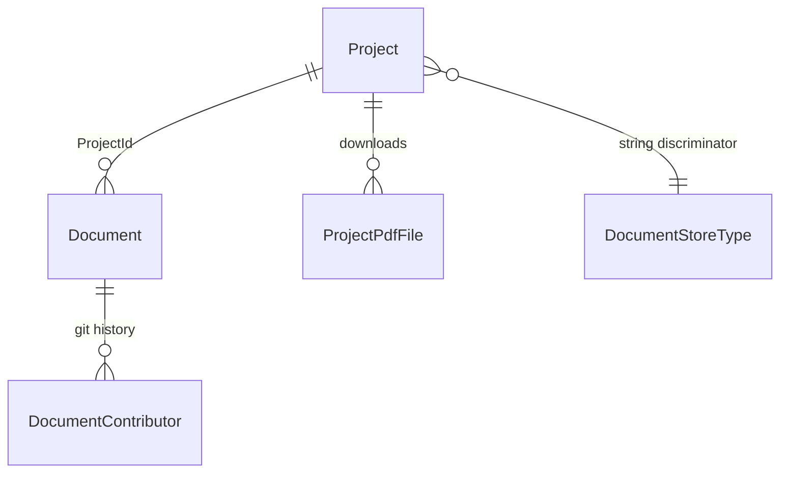

# Docs Domain Layer

The ABP Framework Docs domain layer is responsible for two aggregates (`Project` and `Document`) and the pluggable `IDocumentSource` abstraction that fetches body content from a Git repo or the filesystem. Source lives under `modules/docs/src/Volo.Docs.Domain/Volo/Docs/` with the matching shared contracts under `modules/docs/src/Volo.Docs.Domain.Shared/Volo/Docs/`.

## Aggregate diagram



`Project` and `Document` derive from `AggregateRoot<Guid>`. Neither implements `IMultiTenant` — the docs corpus is global to the deployment.

## Project aggregate

`Project` (`modules/docs/src/Volo.Docs.Domain/Volo/Docs/Projects/Project.cs`) carries the metadata required to fetch and render a documentation set:

| Field | Type | Purpose |
|---|---|---|
| `Name` | `string` | Display name |
| `ShortName` | `string` | Used in URLs, normalized to lowercase |
| `Format` | `string` | `"md"` for Markdown, `"html"` for HTML |
| `DefaultDocumentName` | `string` | Landing page filename (default `"Index"`) |
| `NavigationDocumentName` | `string` | Sidebar JSON (default `"docs-nav.json"`) |
| `ParametersDocumentName` | `string` | UI parameter JSON (default `"docs-params.json"`) |
| `MinimumVersion` | `string` | Hides versions older than this |
| `DocumentStoreType` | `string` | Discriminator for `IDocumentSourceFactory` |
| `MainWebsiteUrl` | `string` | Home link used by the breadcrumb |
| `LatestVersionBranchName` | `string` | Branch shown when the user picks "latest" |
| `PdfFiles` | `List<ProjectPdfFile>` | Pre-generated PDFs |

The `ShortName` is normalized inside the constructor — see `NormalizeShortName()`. Attempting to insert a duplicate triggers `ProjectShortNameAlreadyExistsException` (`Projects/ProjectShortNameAlreadyExistsException.cs`).

`IProjectRepository` (`Projects/IProjectRepository.cs`):

```csharp
public interface IProjectRepository : IBasicRepository<Project, Guid>
{
    Task<List<Project>> GetListAsync(string sorting, int maxResultCount, int skipCount,
        bool includeDetails = false, CancellationToken cancellationToken = default);
    Task<List<ProjectWithoutDetails>> GetListWithoutDetailsAsync(CancellationToken cancellationToken = default);
    Task<Project> GetByShortNameAsync(string shortName, CancellationToken cancellationToken = default);
    Task<bool> ShortNameExistsAsync(string shortName, CancellationToken cancellationToken = default);
}
```

`ProjectWithoutDetails` is a lightweight projection used by lookups and the project picker; `Project.PdfFiles` is not loaded.

## Document aggregate

`Document` (`modules/docs/src/Volo.Docs.Domain/Volo/Docs/Documents/Document.cs`) is the cached content of a single page. Fields:

| Field | Type | Notes |
|---|---|---|
| `ProjectId` | `Guid` | parent project |
| `Name` | `string` | logical path inside the project, e.g. `"Tutorials/Part-1"` |
| `Version` | `string` | semver tag or branch name |
| `LanguageCode` | `string` | ISO code such as `"en"` |
| `FileName` | `string` | physical file name (last segment of `Name`) |
| `Content` | `string` | raw Markdown / HTML body |
| `Format` | `string` | mirrors `Project.Format` |
| `EditLink` | `string` | URL to edit upstream |
| `RootUrl` / `RawRootUrl` | `string` | source root URLs |
| `LocalDirectory` | `string` | parent directory inside the project tree |
| `CreationTime` / `LastUpdatedTime` | `DateTime` | from `IDocumentSource` |
| `LastSignificantUpdateTime` | `DateTime?` | computed by patch analyzer |
| `LastCachedTime` | `DateTime` | when we last pulled the source |
| `Contributors` | `List<DocumentContributor>` | git authors |

`IDocumentRepository` (`Documents/IDocumentRepository.cs`) is the largest interface in the domain layer. The key methods:

- `GetListWithoutDetailsByProjectId(projectId)` — for filter dropdowns
- `GetUniqueListDocumentInfoAsync()` — distinct (name, version, language) tuples for admin filters
- `FindAsync(projectId, name, languageCode, version, includeDetails)` — primary read; also a multi-name overload that probes a list of fallbacks (e.g. when the navigation manifest doesn't exist in the requested language)
- `DeleteAsync(projectId, name, languageCode, version)` — admin invalidation
- `UpdateProjectLastCachedTimeAsync(projectId, cachedTime)` — set by `ProjectAdminAppService.PullAsync`
- `GetAllAsync(...)` — the gigantic filter for the admin list page (every timestamp + name + language has a `Min`/`Max` parameter)

## Document sources

`IDocumentSource` (`Documents/IDocumentSource.cs`) is the contract every source must implement:

```csharp
public interface IDocumentSource : IDomainService
{
    Task<Document> GetDocumentAsync(Project project, string documentName, string languageCode, string version,
        DateTime? lastKnownSignificantUpdateTime = null);
    Task<List<VersionInfo>> GetVersionsAsync(Project project);
    Task<DocumentResource> GetResource(Project project, string resourceName, string languageCode, string version);
    Task<LanguageConfig> GetLanguageListAsync(Project project, string version);
}
```

`IDocumentSourceFactory` (default `DocumentSourceFactory` in `Documents/DocumentSourceFactory.cs`) resolves the right one by `Project.DocumentStoreType` against the dictionary in `DocumentSourceOptions.Sources`. Custom hosts add new types by registering the implementation and `Configure<DocumentSourceOptions>(o => o.Sources["Azure"] = typeof(AzureDevOpsDocumentSource))`.

### FileSystemDocumentSource

`FileSystem/Documents/FileSystemDocumentSource.cs` reads from a local clone of the docs repo:

```csharp
public class FileSystemDocumentSource : DomainService, IDocumentSource
{
    public const string Type = "FileSystem";

    public async Task<Document> GetDocumentAsync(Project project, string documentName,
        string languageCode, string version, DateTime? lastKnownSignificantUpdateTime = null)
    {
        var projectFolder = project.GetFileSystemPath();
        var path = Path.Combine(projectFolder, languageCode, documentName);
        CheckDirectorySecurity(projectFolder, path);
        var content = await FileHelper.ReadAllTextAsync(path);
        // version intentionally fixed to "1.0.0" — disk has no version dimension
        version = "1.0.0";
        return new Document(GuidGenerator.Create(), project.Id, documentName, version,
            languageCode, Path.GetFileName(path), content, project.Format,
            null, "/", $"/document-resources?projectId={project.Id}&version={version}&languageCode={languageCode}&name=",
            localDirectory, File.GetCreationTime(path), File.GetLastWriteTime(path), DateTime.Now);
    }
}
```

`ProjectFileSystemExtensions.GetFileSystemPath()` (`FileSystem/Projects/ProjectFileSystemExtensions.cs`) reads the path from the project's `ExtraProperties`. Every disk read is guarded by `DirectoryHelper.IsSubDirectoryOf` so a crafted `documentName` cannot traverse out of the project root. `GetLanguageListAsync` reads `DocsDomainConsts.LanguageConfigFileName` from disk and surfaces `UserFriendlyException` on a parse failure.

### GithubDocumentSource

`GitHub/Documents/GithubDocumentSource.cs` is the production source:

```csharp
public class GithubDocumentSource : DomainService, IDocumentSource
{
    public const string Type = "GitHub";

    public GithubDocumentSource(
        IGithubRepositoryManager githubRepositoryManager,
        IGithubPatchAnalyzer githubPatchAnalyzer,
        IDocumentRepository documentRepository,
        IOptions<DocsGithubLanguageOptions> docsGithubLanguageOptions)
```

It composes:

- `IGithubRepositoryManager` (default `GithubRepositoryManager`, `GitHub/Documents/GithubRepositoryManager.cs`) — wraps `IHttpClientFactory` + `Octokit` to download raw content and list commits. The HTTP client name is `GithubRepositoryManager.HttpClientName` and is registered with a 15-second timeout inside `DocsDomainModule`.
- `IGithubPatchAnalyzer` (default `GithubPatchAnalyzer`, `GitHub/Documents/GithubPatchAnalyzer.cs`) — inspects commit diffs to decide whether a change is "significant" (content) or noise (whitespace/links), driving `LastSignificantUpdateTime`.
- `DocsGithubLanguageOptions` — overrides the fallback `LanguageConfigElement` when a project lacks one.

`ProjectGithubExtensions.GetGitHubUrl(version)` (`GitHub/Projects/ProjectGithubExtensions.cs`) reads the GitHub root URL pattern from `Project.ExtraProperties["GitHubRootUrl"]`. `GetVersionsAsync` enumerates Git tags and branches via the `GitHub/Documents/Version/` helpers and returns a `List<VersionInfo>` ordered semver-wise.

## Caching helpers

`Caching/CacheKeyGenerator.cs` is a small set of static methods that build the cache keys used by `IDocumentAppService` to memoize source results in `IDistributedCache`. The Domain layer does not own the cache itself — that lives in the Application tier — but the key shape is shared so admin "clear cache" endpoints can target a single document or all documents of a project.

## DocsDomainModule

```csharp
[DependsOn(
    typeof(DocsDomainSharedModule),
    typeof(AbpDddDomainModule),
    typeof(AbpMapperlyModule),
    typeof(AbpBlobStoringModule),
    typeof(AbpCachingModule)
)]
public class DocsDomainModule : AbpModule
{
    public override void ConfigureServices(ServiceConfigurationContext context)
    {
        context.Services.AddMapperlyObjectMapper<DocsDomainModule>();
        Configure<AbpDistributedEntityEventOptions>(options =>
        {
            options.EtoMappings.Add<Document, DocumentEto>(typeof(DocsDomainModule));
            options.EtoMappings.Add<Project, ProjectEto>(typeof(DocsDomainModule));
        });
        Configure<AbpVirtualFileSystemOptions>(options => options.FileSets.AddEmbedded<DocsDomainModule>());
        Configure<AbpLocalizationOptions>(options =>
            options.Resources.Get<DocsResource>().AddVirtualJson("/Volo/Docs/Localization/Domain"));
        Configure<DocumentSourceOptions>(options =>
        {
            options.Sources[GithubDocumentSource.Type] = typeof(GithubDocumentSource);
            options.Sources[FileSystemDocumentSource.Type] = typeof(FileSystemDocumentSource);
        });
        Configure<DocsGithubLanguageOptions>(options =>
        {
            options.DefaultLanguage = new LanguageConfigElement { Code = "en", DisplayName = "English", IsDefault = true };
        });
        context.Services.AddHttpClient(GithubRepositoryManager.HttpClientName, client =>
            client.Timeout = TimeSpan.FromMilliseconds(15000));
        Configure<DocumentToHtmlConverterOptions>(options =>
            options.Converters[DocsDomainConsts.PdfDocumentToHtmlConverterPrefix + MarkdigPdfDocumentToHtmlConverter.Type] = typeof(MarkdigPdfDocumentToHtmlConverter));
    }
}
```

`OnApplicationInitializationAsync` conditionally creates the Elasticsearch index when `DocsElasticSearchOptions.Enable` is true — this is the hook for the optional full-text search. The full-search implementation lives at `Documents/FullSearch/Elastic/` and is gated behind `DocsElasticSearchOptions` so non-search deployments don't pay for an Elasticsearch client.

## Domain.Shared contents

`modules/docs/src/Volo.Docs.Domain.Shared/Volo/Docs/`:

<Card title="Docs Domain.Shared" icon="box-archive">
- `DocsDomainSharedModule.cs`
- `DocsResource.cs` + `Localization/Resources/*.json`
- `Localization/DocsErrorCodes.cs` if present
- Common consts (e.g. document name max length)
</Card>

The `LanguageConfig`, `VersionInfo`, and `DocumentResource` value types are defined in the Domain layer (not the shared one) because they participate in `IDocumentSource` signatures returned to the application tier.

## Distributed events

`DocsDomainModule.ConfigureServices` maps `Document → DocumentEto` and `Project → ProjectEto`. Host applications that consume the ABP distributed event bus can subscribe to the standard `EntityCreatedEto<DocumentEto>` / `EntityUpdatedEto<ProjectEto>` events to invalidate their own caches or trigger a downstream rebuild when content changes.

## Where to next

<CardGroup cols={2}>
<Card title="Admin" icon="screwdriver-wrench" href="/module-docs/admin">
The back-office services that pull, reindex, and PDF-export projects.
</Card>
<Card title="Web UI" icon="window" href="/module-docs/web">
The reader Razor pages and the Markdig → HTML conversion pipeline.
</Card>
</CardGroup>
