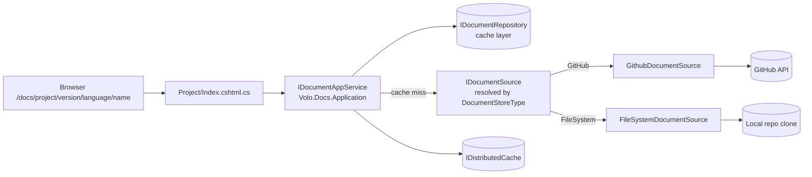
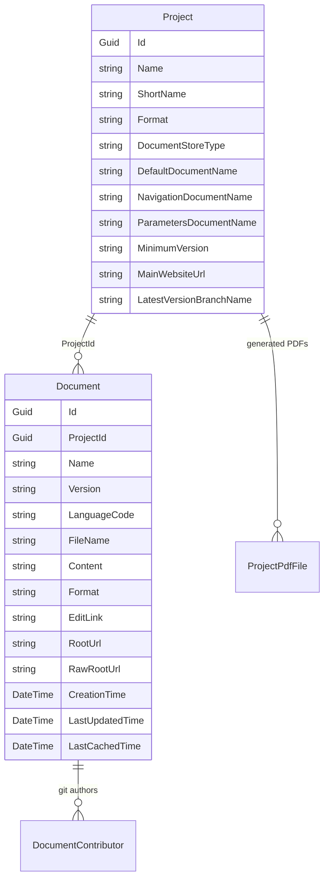
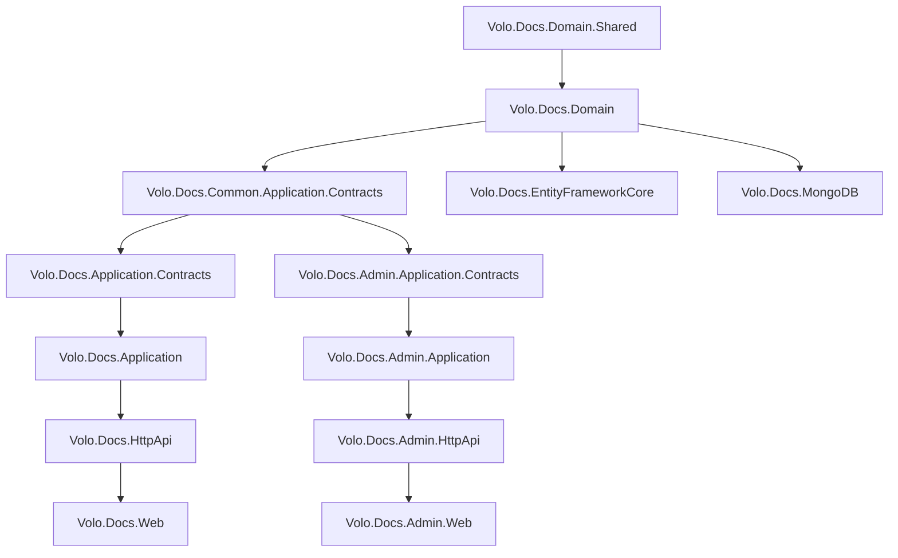

# Docs Module

The ABP Framework Docs module is a multi-project documentation server: it serves Markdown (or HTML) pages organized by project, version, and language, pulling content live from either a Git repository, the local filesystem, or any custom `IDocumentSource`. Source lives under `modules/docs/src/`.

## Package layout

The Docs module follows the standard ABP layered template with a separate Admin / Common / top-level horizontal split, although the public-facing reading experience is implemented directly inside `Volo.Docs.Web` (there is no `Volo.Docs.Public.Web` — the read site is the only "public" surface).

<Card title="Docs module projects" icon="folder-tree">
- `Volo.Docs.Domain.Shared` — consts, error codes, localization, settings (`modules/docs/src/Volo.Docs.Domain.Shared/`)
- `Volo.Docs.Domain` — `Project`, `Document`, `IProjectRepository`, `IDocumentRepository`, `IDocumentSource` and its built-in implementations (`modules/docs/src/Volo.Docs.Domain/Volo/Docs/`)
- `Volo.Docs.Application.Contracts` / `.Application` — reader-facing `IDocumentAppService` and DTOs
- `Volo.Docs.Common.Application.Contracts` / `.Common.HttpApi` / `.Common.HttpApi.Client` — shared `IProjectAppService` for project list/lookup
- `Volo.Docs.Admin.Application.Contracts` / `.Admin.Application` / `.Admin.HttpApi` / `.Admin.HttpApi.Client` / `.Admin.Web` — back-office for project + document management
- `Volo.Docs.HttpApi` / `.HttpApi.Client` / `.Web` — public reader site (`modules/docs/src/Volo.Docs.Web/`)
- `Volo.Docs.EntityFrameworkCore` — `DocsDbContext` + `EfCore*Repository`
- `Volo.Docs.MongoDB` — `DocsMongoDbContext` + `Mongo*Repository`
- `Volo.Docs.Installer` — NuGet installer for the ABP CLI
</Card>

## High-level data flow



When a user requests a page, `DocumentAppService.GetAsync` first asks the configured `IDocumentSource` for the freshest `Document`, then persists it through `IDocumentRepository` so subsequent reads hit the database/cache. Significant updates are dated via `LastSignificantUpdateTime` so the "last updated" banner reflects real content changes rather than merge-commit churn.

## Aggregate diagram



A `Project` (`modules/docs/src/Volo.Docs.Domain/Volo/Docs/Projects/Project.cs`) carries the metadata needed to fetch content: a `Format` (e.g. `"md"`), a `DocumentStoreType` (e.g. `"GitHub"` or `"FileSystem"`), conventional file names for the entry page, the side-navigation manifest, and the parameters document, plus a `MinimumVersion` filter and a `MainWebsiteUrl` for "edit on website" links. The `PdfFiles` collection lists pre-generated downloadable PDFs.

A `Document` (`modules/docs/src/Volo.Docs.Domain/Volo/Docs/Documents/Document.cs`) is the cached body of a single page. Its `Content`, `EditLink`, `RootUrl`, and `RawRootUrl` are populated by the source implementation. `Contributors` (a list of `DocumentContributor`) is populated for Git-backed sources from commit history.

## Pluggable document sources

`IDocumentSource` (`modules/docs/src/Volo.Docs.Domain/Volo/Docs/Documents/IDocumentSource.cs`) is the extensibility hinge:

```csharp
public interface IDocumentSource : IDomainService
{
    Task<Document> GetDocumentAsync(Project project, string documentName, string languageCode, string version, DateTime? lastKnownSignificantUpdateTime = null);
    Task<List<VersionInfo>> GetVersionsAsync(Project project);
    Task<DocumentResource> GetResource(Project project, string resourceName, string languageCode, string version);
    Task<LanguageConfig> GetLanguageListAsync(Project project, string version);
}
```

The module ships two implementations under `modules/docs/src/Volo.Docs.Domain/Volo/Docs/`:

<CardGroup cols={2}>
<Card title="FileSystemDocumentSource" icon="folder">
`FileSystem/Documents/FileSystemDocumentSource.cs` reads from a local clone resolved via `ProjectFileSystemExtensions.GetFileSystemPath()`. Security-checks every path against the project root with `DirectoryHelper.IsSubDirectoryOf` to prevent path traversal. The version is intentionally fixed to `"1.0.0"` because there is no version concept on disk.
</Card>
<Card title="GithubDocumentSource" icon="github">
`GitHub/Documents/GithubDocumentSource.cs` (with `GithubRepositoryManager` + `GithubPatchAnalyzer`) calls the GitHub API to fetch raw markdown, list tag/branch versions, and analyze commit patches to compute `LastSignificantUpdateTime`. HTTP is routed through `IHttpClientFactory` registered with `GithubRepositoryManager.HttpClientName` and a 15-second timeout.
</Card>
</CardGroup>

Both are registered through `DocumentSourceOptions` in `DocsDomainModule`:

```csharp
Configure<DocumentSourceOptions>(options =>
{
    options.Sources[GithubDocumentSource.Type] = typeof(GithubDocumentSource);
    options.Sources[FileSystemDocumentSource.Type] = typeof(FileSystemDocumentSource);
});
```

Custom hosts can add their own (e.g. an Azure DevOps source) by adding another key. `IDocumentSourceFactory` (default `DocumentSourceFactory`) resolves the right one by `Project.DocumentStoreType`.

## Caching, search, PDF

`Volo.Docs.Domain/Volo/Docs/Caching/CacheKeyGenerator.cs` builds the cache key used by `IDistributedCache` to memoize sources. The optional full-text search uses Elasticsearch — see `Documents/FullSearch/` and `DocsElasticSearchOptions`. `Projects/Pdf/` and the `Markdig`-based renderer turn a whole project into a single PDF when the admin invokes `ProjectAdminAppService` PDF endpoints.

## Top-level pages

<CardGroup cols={2}>
<Card title="Domain" icon="cube" href="/module-docs/domain">
The `Project` + `Document` aggregates, repositories, and document sources.
</Card>
<Card title="Admin" icon="screwdriver-wrench" href="/module-docs/admin">
`ProjectAdminAppService`, `DocumentAdminAppService`, cache invalidation, reindex, PDF generation.
</Card>
<Card title="Web UI" icon="window" href="/module-docs/web">
The reader Razor pages, navigation contributor, and Markdig → HTML conversion pipeline.
</Card>
</CardGroup>

## Localization

`DocsResource` (`modules/docs/src/Volo.Docs.Domain.Shared/Volo/Docs/Localization/DocsResource.cs`) hosts the keys; JSON ships under `Volo/Docs/Localization/Resources/`. The host can override individual entries via ABP's standard localization extension. `DocsDomainModule.ConfigureServices` calls `Configure<AbpLocalizationOptions>(options => options.Resources.Get<DocsResource>().AddVirtualJson("/Volo/Docs/Localization/Domain"))` to add the domain layer's own contributions.

## Module dependency chart



The `Common` family carries shared DTOs like `ProjectDto` (`Volo.Docs.Common.Application.Contracts/Volo/Docs/Common/Projects/ProjectDto.cs`) used by both the reader and the admin tier. The `Application` family carries the reader-only `IDocumentAppService`. The `Admin.Application` family carries the back-office services. This three-way split is what lets a reader-only deployment skip referencing the admin contracts (and thereby cut the management permissions and DTOs out of the binary).

## Optional Elasticsearch full search

The full-text search is optional. The interface `IDocumentFullSearch` (`Volo.Docs.Domain/Volo/Docs/Documents/FullSearch/IDocumentFullSearch.cs`) has a no-op default; the Elasticsearch implementation (`Documents/FullSearch/Elastic/`) is registered only when `DocsElasticSearchOptions.Enable = true`. `DocsDomainModule.OnApplicationInitializationAsync` creates the index when this flag is set:

```csharp
public async override Task OnApplicationInitializationAsync(ApplicationInitializationContext context)
{
    using (var scope = context.ServiceProvider.CreateScope())
    {
        if (scope.ServiceProvider.GetRequiredService<IOptions<DocsElasticSearchOptions>>().Value.Enable)
        {
            var documentFullSearch = scope.ServiceProvider.GetRequiredService<IDocumentFullSearch>();
            await documentFullSearch.CreateIndexIfNeededAsync();
        }
    }
}
```

When the search is off, `IDocumentAppService.FullSearchEnabledAsync()` returns `false` and the reader's search page hides itself.

## HTML conversion pipeline

`DocumentToHtmlConverterOptions` (`Volo.Docs.Domain/Volo/Docs/HtmlConverting/`) maps each `Project.Format` to an `IDocumentToHtmlConverter` implementation. The defaults:

- `"md"` → `MarkdigDocumentToHtmlConverter` (the standard reader-side Markdown renderer)
- `"Pdf:md"` → `MarkdigPdfDocumentToHtmlConverter` (a variant used during PDF generation that inlines absolute URLs and adjusts code block formatting)
- `"html"` → pass-through

Host applications can register additional converters by adding entries to `DocumentToHtmlConverterOptions.Converters`. The reader resolves the converter via `IDocumentToHtmlConverterFactory` so the same `IDocumentAppService` returns the same DTO regardless of provider — the body is the converted HTML.

## Background jobs

Long-running admin work — PDF generation and bulk reindex — runs through ABP background jobs. The job argument types live under `modules/docs/src/Volo.Docs.Admin.Application/Volo/Docs/Admin/BackgroundJobs/`. Hosts can run the worker in-process or on a separate worker pod by enabling the `Volo.Abp.BackgroundJobs.Hangfire` (or RabbitMQ) provider — the Docs module does not care which one.
