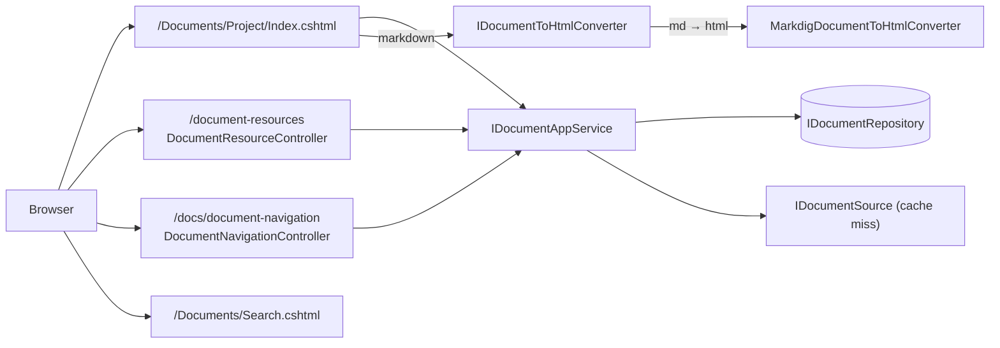

# Docs Web UI

The reader side of the ABP Framework Docs module is implemented as a Razor Pages site inside `Volo.Docs.Web` (`modules/docs/src/Volo.Docs.Web/`) plus a tiny `Volo.Docs.Common.Web` for shared widgets. Unlike CMS Kit, there is no separate "public" web package — the docs reader is the only public surface.



## Top-level pages

`modules/docs/src/Volo.Docs.Web/Pages/Documents/`:

<Card title="Reader pages" icon="window">
- `Index.cshtml(.cs)` — project picker (or redirect to single-project mode)
- `Project/Index.cshtml(.cs)` — the document reader (slug-routed: project / version / language / name)
- `Project/TableOfContents.cshtml` — the sidebar component partial
- `Search.cshtml(.cs)` — full-text search results (only useful with Elasticsearch enabled)
- `Shared/ErrorComponent/Default.cshtml` + `ErrorViewComponent.cs` + `ErrorPageModel.cs` — friendly "document not found" page
- `Shared/Components/Head/Default.cshtml` + `HeadViewComponent.cs` — open-graph / canonical meta tags
</Card>

## IndexModel: project picker

`Pages/Documents/Index.cshtml.cs`:

```csharp
public class IndexModel : PageModel
{
    public string DocumentsUrlPrefix { get; set; }
    public IReadOnlyList<ProjectDto> Projects { get; set; }
    private readonly IProjectAppService _projectAppService;
    private readonly DocsUiOptions _uiOptions;

    public virtual async Task<IActionResult> OnGetAsync()
    {
        if (_uiOptions.SingleProjectMode.Enable) // redirect directly into the only project
        // ...
    }
}
```

When the host configures `DocsUiOptions.SingleProjectMode.Enable = true`, the index page short-circuits to `/Documents/Project/<the project>` so the reader never sees a picker. Otherwise it renders the project grid by calling `IProjectAppService` from `Volo.Docs.Common.Application.Contracts/Volo/Docs/Common/Projects/`.

## Project/IndexModel: the reader

`Pages/Documents/Project/Index.cshtml.cs` is the largest page model in the module — it manages routing, version/language selection, markdown rendering, table of contents extraction, and view-state binding. The bound properties are taken from the URL:

```csharp
[BindProperty(SupportsGet = true)] public string ProjectName { get; set; }
[BindProperty(SupportsGet = true)] public string Version { get; set; } = "";
[BindProperty(SupportsGet = true)] public string DocumentName { get; set; }
[BindProperty(SupportsGet = true)] public string LanguageCode { get; set; }
```

It composes:

- `ProjectDto Project` / `LanguageConfig LanguageConfig` — fetched via `IProjectAppService` / `IDocumentAppService.GetParametersAsync`
- `DocumentWithDetailsDto Document` — fetched via `IDocumentAppService.GetAsync(GetDocumentInput)`
- `NavigationNode Navigation` — fetched via `IDocumentAppService.GetNavigationAsync`
- `List<TocItem> TocItems` — built from the rendered HTML by parsing `<h1>`–`<h6>` headings
- `DocumentRenderParameters UserPreferences` — the user-chosen radio buttons (e.g. UI framework / database provider) restored from the query string

The model also publishes a local event when a document was successfully loaded so view components (head, error, sidebar) can react.

## Rendering pipeline

The raw markdown body returned by `IDocumentAppService.GetAsync` is converted to HTML through `IDocumentToHtmlConverter`. Each `Project.Format` value (`"md"`, `"html"`, …) is associated with a converter through `DocumentToHtmlConverterOptions` in `Volo.Docs.Domain/Volo/Docs/HtmlConverting/`. The default Markdown implementation uses Markdig with custom extensions for ABP-specific shortcodes; the PDF variant is `MarkdigPdfDocumentToHtmlConverter` registered under the `Pdf:` prefix.

`DocumentRenderParameters` and `DocumentRenderingParameterDto` model the "parameters" feature: a project can publish a `docs-params.json` listing UI / database / language picker options, and the reader injects them as `<select>` controls and rewrites tab visibility live in the browser.

## DocumentResourceController

`Volo.Docs.Web/Areas/Documents/DocumentResourceController.cs` is the asset endpoint used by every embedded image or code-resource referenced from a document:

```csharp
[RemoteService(Name = DocsRemoteServiceConsts.RemoteServiceName)]
[Area(DocsRemoteServiceConsts.ModuleName)]
[ControllerName("DocumentResource")]
[Route("document-resources")]
public class DocumentResourceController : AbpController
{
    [HttpGet]
    public virtual async Task<FileResult> GetResource(GetDocumentResourceInput input)
    {
        input.Name = input.Name.RemovePreFix("/");
        var documentResource = await _documentAppService.GetResourceAsync(input);
        var contentType = MimeTypes.GetByExtension(FileHelper.GetExtension(input.Name));
        return File(documentResource.Content, contentType);
    }
}
```

The query string carries `ProjectId`, `Version`, `LanguageCode`, and `Name`; `IDocumentAppService.GetResourceAsync` delegates to the matching `IDocumentSource.GetResource` (which on disk uses `DirectoryHelper.IsSubDirectoryOf` to block path traversal, and on GitHub fetches raw bytes via `GithubRepositoryManager`).

## DocumentNavigationController

`Volo.Docs.Web/Areas/Documents/DocumentNavigationController.cs` ships the routed JSON used by the sidebar's AJAX expand/collapse. It composes:

```csharp
public DocumentNavigationController(IDocumentAppService documentAppService, IDocsLinkGenerator docsLinkGenerator)
```

The link generator rewrites relative URLs inside the navigation manifest to the canonical reader URL (`/{prefix}/{project}/{version}/{language}/{name}`), accounting for `DocsUiOptions.RoutePrefix` and `DocsUiOptions.SingleProjectMode`.

## Tag helpers

`Volo.Docs.Web/Areas/Documents/TagHelpers/` ships tag helpers used inside the Razor view to render version pickers, language pickers, and "edit on GitHub" links without inlining controller-shaped code in the cshtml.

## Common.Web

`Volo.Docs.Common.Web` is a small shared package; its primary contributions are the `IProjectAppService` typed proxy registration and a couple of view components used by both the reader and the admin pages (e.g. the project lookup dropdown). It is referenced by both `Volo.Docs.Web` and `Volo.Docs.Admin.Web`.

## DocsUiOptions

`DocsUiOptions` lives in the web tier and controls runtime behavior:

<Card title="DocsUiOptions" icon="sliders">
- `RoutePrefix` — the prefix mounted under (e.g. `"docs"`)
- `SingleProjectMode.Enable` + `SingleProjectMode.ProjectName` — collapse the picker for solo deployments
- Feature flags for full-search visibility, version picker behavior, the project chooser combobox
</Card>

These options are read by `IndexModel` and `Project/IndexModel` to decide which controls render and how route templates are constructed.

## Search

`Pages/Documents/Search.cshtml(.cs)` calls `IDocumentAppService.SearchAsync(DocumentSearchInput)` (`Volo.Docs.Application.Contracts/Volo/Docs/Documents/IDocumentAppService.cs`). When `IDocumentAppService.FullSearchEnabledAsync()` returns false (no Elasticsearch configured) the page hides itself; otherwise it renders the standard ABP `PagedResultDto<DocumentSearchOutput>` with project / version / language facets.

## Where to next

<CardGroup cols={2}>
<Card title="Domain" icon="cube" href="/module-docs/domain">
The aggregates and `IDocumentSource` that back every reader request.
</Card>
<Card title="Admin" icon="screwdriver-wrench" href="/module-docs/admin">
The back-office app services used to populate the corpus this UI reads from.
</Card>
</CardGroup>

## TableOfContents extraction

The `Project/Index.cshtml.cs` page builds `List<TocItem> TocItems` from the rendered HTML by scanning for `<h1>`–`<h6>` headings. The `TocItem` type and the heading-parser helper live in `Volo.Docs.Application.Contracts/Volo/Docs/TableOfContents/`. Anchor IDs are stable hashes of the heading text so deep links keep working even after a single document is re-rendered. The right-hand "On this page" rail in the reader cshtml binds to this list.

## Version / language pickers

The reader exposes two related controls:

- **Version picker** — bound to `VersionSelectItems` populated by `IDocumentAppService.GetVersionsAsync` (delegated to `IDocumentSource.GetVersionsAsync`). For the GitHub source this is a semver-sorted list of Git tags merged with branch names; for the filesystem source it's a single `"1.0.0"`. The `Project.MinimumVersion` filter trims older versions.
- **Language picker** — bound to `LanguageSelectListItems` populated by `IDocumentAppService.GetParametersAsync → DocumentParametersDto.Languages`. Falls back to `DocsGithubLanguageOptions.DefaultLanguage` (default `{ Code: "en", DisplayName: "English", IsDefault: true }`) when the project lacks a `LanguageConfig`.

Both controls submit form-encoded redirects so changing the version / language preserves the current `DocumentName` route segment when possible.

## "Project not found" / "Document not found"

`Project/IndexModel` distinguishes the two cases via `ProjectFound` and `DocumentFound` flags. `LoadSuccess => DocumentFound && ProjectFound`. The Razor view branches on these flags to render the standard `ErrorViewComponent` (`Pages/Documents/Shared/ErrorComponent/ErrorViewComponent.cs`) with an appropriate message — important because a missing project is a permanent 404 (`HttpStatusCode.NotFound`), while a missing document might just mean the requested page is not translated to the picked language and we should suggest English.

## EntityNotFoundException handling

When the page model encounters `EntityNotFoundException` from `IProjectAppService` it sets `ProjectFound = false`. When `IDocumentAppService.GetAsync` throws (e.g. the markdown file doesn't exist in the chosen version), `DocumentFound = false`. Both branches still render a usable shell with version/language pickers so the user can recover by selecting an existing combination.

## AlternativeOptionLinkQueries

The page populates `List<string> AlternativeOptionLinkQueries` with query-string overrides for the UI parameters (e.g. UI framework, database provider) so a parameter changed in one tab can be deep-linked from another. This is the mechanism behind ABP's own docs site letting you flip between "EF Core" and "Mongo" tabs and have the URL reflect the choice.

## Reading time / last-updated banner

`Document.LastSignificantUpdateTime` (computed by `GithubPatchAnalyzer`) is what the Razor view renders as the "Last updated" banner. The patch analyzer ignores changes that don't affect prose — pure link-rewrites and whitespace-only commits don't bump it, so the banner reflects when content actually changed. `Document.LastCachedTime` is shown separately in the admin tier so operators can tell when the local copy was last refreshed.

## DocsLinkGenerator

`IDocsLinkGenerator` (default implementation in `Volo.Docs.Web/Utils/`) builds the canonical `/{prefix}/{project}/{version}/{language}/{name}` URL for any document. It accounts for `DocsUiOptions.RoutePrefix`, single-project mode, and the host's mount path. `DocumentNavigationController.GetNavigation` uses it to rewrite relative URLs inside the navigation manifest before returning JSON, so the sidebar links work regardless of where docs are mounted.

## Search page

`Pages/Documents/Search.cshtml(.cs)`:

```csharp
public class SearchModel : PageModel
{
    [BindProperty(SupportsGet = true)] public string Keyword { get; set; }
    [BindProperty(SupportsGet = true)] public string ProjectName { get; set; }
    [BindProperty(SupportsGet = true)] public string Version { get; set; }
    [BindProperty(SupportsGet = true)] public string LanguageCode { get; set; }
    public PagedResultDto<DocumentSearchOutput> SearchResults { get; set; }
}
```

The page calls `IDocumentAppService.FullSearchEnabledAsync` first and short-circuits to a friendly message if the flag is off. With Elasticsearch enabled it calls `SearchAsync(DocumentSearchInput input)` which queries the index built by `IDocumentFullSearch` and returns a `DocumentSearchOutput` with `Highlight` snippets.
