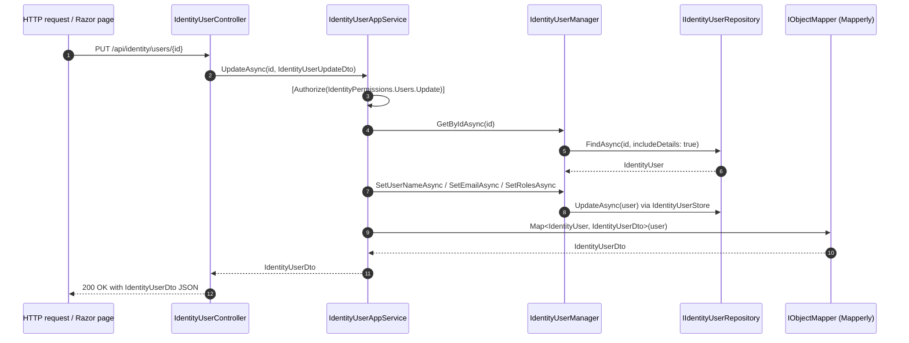

The **ABP Framework** Identity application layer turns the domain managers and repositories into clean, permission-checked, DTO-shaped operations that any HTTP API controller, Razor Page, or Blazor component can consume. The contracts live in `modules/identity/src/Volo.Abp.Identity.Application.Contracts/` and the implementations in `modules/identity/src/Volo.Abp.Identity.Application/`. Together they ship three application services, one integration service, a permission definition, and the DTOs that the HTTP API exchanges with browsers.

<Info>
The open-source identity module deliberately ships a **small** application surface. User and role CRUD are exposed; profile editing belongs to the Account module (`modules/account/src/Volo.Abp.Account.Application/Volo/Abp/Account/ProfileAppService.cs`); claim-type, organization-unit, security-log, session, and delegation administration are provided by the commercial Identity Pro module. The classes documented here are the full open-source set.
</Info>

## Module wire-up

Two modules compose the layer.

`AbpIdentityApplicationContractsModule` from `modules/identity/src/Volo.Abp.Identity.Application.Contracts/Volo/Abp/Identity/AbpIdentityApplicationContractsModule.cs` depends on `AbpIdentityDomainSharedModule`, `AbpUsersAbstractionModule`, `AbpAuthorizationModule`, and `AbpPermissionManagementApplicationContractsModule`. Its `PostConfigureServices` hooks `ModuleExtensionConfigurationHelper.ApplyEntityConfigurationToApi(...)` so the object-extension system knows which DTO surfaces represent `User` and `Role`.

`AbpIdentityApplicationModule` from `modules/identity/src/Volo.Abp.Identity.Application/Volo/Abp/Identity/AbpIdentityApplicationModule.cs`:

```csharp
[DependsOn(
    typeof(AbpIdentityDomainModule),
    typeof(AbpIdentityApplicationContractsModule),
    typeof(AbpMapperlyModule),
    typeof(AbpPermissionManagementApplicationModule)
    )]
public class AbpIdentityApplicationModule : AbpModule
{
    public override void ConfigureServices(ServiceConfigurationContext context)
    {
        context.Services.AddMapperlyObjectMapper<AbpIdentityApplicationModule>();
    }
}
```

The Mapperly object-mapper is registered so the `ObjectMapper.Map<IdentityUser, IdentityUserDto>(...)` calls inside the app services have a backing implementation. The actual mapper classes are partial declarations in `modules/identity/src/Volo.Abp.Identity.Application/Volo/Abp/Identity/AbpIdentityApplicationMappers.cs`.

## Application service contracts

### IIdentityUserAppService

`modules/identity/src/Volo.Abp.Identity.Application.Contracts/Volo/Abp/Identity/IIdentityUserAppService.cs` declares the user management surface:

```csharp
public interface IIdentityUserAppService :
    ICrudAppService<IdentityUserDto, Guid, GetIdentityUsersInput, IdentityUserCreateDto, IdentityUserUpdateDto>
{
    Task<ListResultDto<IdentityRoleDto>> GetRolesAsync(Guid id);
    Task<ListResultDto<IdentityRoleDto>> GetAssignableRolesAsync();
    Task UpdateRolesAsync(Guid id, IdentityUserUpdateRolesDto input);
    Task<IdentityUserDto> FindByUsernameAsync(string userName);
    Task<IdentityUserDto> FindByEmailAsync(string email);
}
```

`ICrudAppService<...>` supplies the canonical `GetAsync(id)`, `GetListAsync(input)`, `CreateAsync(input)`, `UpdateAsync(id, input)`, and `DeleteAsync(id)` operations.

### IIdentityRoleAppService

`IIdentityRoleAppService.cs` exposes:

```csharp
public interface IIdentityRoleAppService :
    ICrudAppService<IdentityRoleDto, Guid, PagedAndSortedResultRequestDto, IdentityRoleCreateDto, IdentityRoleUpdateDto>
{
    Task<ListResultDto<IdentityRoleDto>> GetAllListAsync();
    Task<PagedResultDto<IdentityRoleDto>> GetListAsync(GetIdentityRolesInput input);
}
```

### IIdentityUserLookupAppService

`IIdentityUserLookupAppService.cs` is the legacy user-lookup contract:

```csharp
[Obsolete("Use IdentityUserIntegrationService for module-to-module (or service-to-service) communication.")]
public interface IIdentityUserLookupAppService : IRemoteService
{
    Task<UserData> FindByIdAsync(Guid id);
    Task<UserData> FindByUserNameAsync(string userName);
    Task<ListResultDto<UserData>> SearchAsync(UserLookupSearchInputDto input);
    Task<long> GetCountAsync(UserLookupCountInputDto input);
}
```

Although marked `[Obsolete]`, it remains registered so older microservices still build. New code should use `IIdentityUserIntegrationService` directly.

### IIdentityUserIntegrationService

`modules/identity/src/Volo.Abp.Identity.Application.Contracts/Volo/Abp/Identity/Integration/IIdentityUserIntegrationService.cs` is the modern lookup contract used cross-service:

```csharp
public interface IIdentityUserIntegrationService : IApplicationService
{
    Task<UserData> FindByIdAsync(Guid id);
    Task<UserData> FindByUserNameAsync(string userName);
    Task<ListResultDto<UserData>> SearchAsync(UserLookupSearchInputDto input);
    Task<long> GetCountAsync(UserLookupCountInputDto input);
}
```

The implementation lives in `modules/identity/src/Volo.Abp.Identity.Application/Volo/Abp/Identity/Integration/IdentityUserIntegrationService.cs`.

## Application service implementations

### IdentityUserAppService

`modules/identity/src/Volo.Abp.Identity.Application/Volo/Abp/Identity/IdentityUserAppService.cs` is the workhorse. Excerpt:

```csharp
public class IdentityUserAppService : IdentityAppServiceBase, IIdentityUserAppService
{
    protected IdentityUserManager UserManager { get; }
    protected IIdentityUserRepository UserRepository { get; }
    protected IIdentityRoleRepository RoleRepository { get; }
    protected IOptions<IdentityOptions> IdentityOptions { get; }
    protected IPermissionChecker PermissionChecker { get; }

    [Authorize(IdentityPermissions.Users.Default)]
    public virtual async Task<IdentityUserDto> GetAsync(Guid id)
    {
        return ObjectMapper.Map<IdentityUser, IdentityUserDto>(
            await UserManager.GetByIdAsync(id)
        );
    }

    [Authorize(IdentityPermissions.Users.Default)]
    public virtual async Task<PagedResultDto<IdentityUserDto>> GetListAsync(GetIdentityUsersInput input)
    {
        var count = await UserRepository.GetCountAsync(input.Filter);
        var list  = await UserRepository.GetListAsync(input.Sorting, input.MaxResultCount, input.SkipCount, input.Filter);
        return new PagedResultDto<IdentityUserDto>(
            count,
            ObjectMapper.Map<List<IdentityUser>, List<IdentityUserDto>>(list));
    }

    [Authorize(IdentityPermissions.Users.Create)]
    public virtual async Task<IdentityUserDto> CreateAsync(IdentityUserCreateDto input) { ... }

    [Authorize(IdentityPermissions.Users.Update)]
    public virtual async Task<IdentityUserDto> UpdateAsync(Guid id, IdentityUserUpdateDto input) { ... }
}
```

The class is decorated with `[Authorize(IdentityPermissions.Users.Default)]` per method so the framework's authorization pipeline rejects unauthenticated callers before any work happens. `GetAssignableRolesAsync()` filters the role list down to the public roles when the current user is not an admin, using `await HasAdminRoleAsync()` (a private helper that probes the `admin` role membership). `UpdateRolesAsync(Guid id, IdentityUserUpdateRolesDto input)` calls `UserManager.SetRolesAsync(user, input.RoleNames)` and then dispatches role-change events.

`IdentityAppServiceBase` (file `IdentityAppServiceBase.cs`) is a thin subclass of `ApplicationService` that sets `LocalizationResource = typeof(IdentityResource)` so localised error messages resolve correctly.

### IdentityRoleAppService

`modules/identity/src/Volo.Abp.Identity.Application/Volo/Abp/Identity/IdentityRoleAppService.cs`:

```csharp
[Authorize(IdentityPermissions.Roles.Default)]
public class IdentityRoleAppService : IdentityAppServiceBase, IIdentityRoleAppService
{
    public virtual async Task<IdentityRoleDto> GetAsync(Guid id) { ... }
    public virtual async Task<ListResultDto<IdentityRoleDto>> GetAllListAsync() { ... }
    public virtual async Task<PagedResultDto<IdentityRoleDto>> GetListAsync(GetIdentityRolesInput input) { ... }

    [Authorize(IdentityPermissions.Roles.Create)]
    public virtual async Task<IdentityRoleDto> CreateAsync(IdentityRoleCreateDto input) { ... }

    [Authorize(IdentityPermissions.Roles.Update)]
    public virtual async Task<IdentityRoleDto> UpdateAsync(Guid id, IdentityRoleUpdateDto input) { ... }

    [Authorize(IdentityPermissions.Roles.Delete)]
    public virtual async Task DeleteAsync(Guid id) { ... }
}
```

Creation goes through `new IdentityRole(GuidGenerator.Create(), input.Name, CurrentTenant.Id)` followed by `await RoleManager.CreateAsync(role)` so the underlying `IdentityRoleStore` normalises the name and validates uniqueness. The delete path refuses `IsStatic == true` roles to protect the seeded `admin`.

### IdentityUserLookupAppService

`modules/identity/src/Volo.Abp.Identity.Application/Volo/Abp/Identity/IdentityUserLookupAppService.cs` is a thin forward to the integration service:

```csharp
[Obsolete("Use IdentityUserIntegrationService for module-to-module communication.")]
[Authorize(IdentityPermissions.UserLookup.Default)]
public class IdentityUserLookupAppService : IdentityAppServiceBase, IIdentityUserLookupAppService
{
    protected IIdentityUserIntegrationService IdentityUserIntegrationService { get; }

    public virtual async Task<UserData> FindByIdAsync(Guid id)
        => await IdentityUserIntegrationService.FindByIdAsync(id);

    public virtual async Task<UserData> FindByUserNameAsync(string userName)
        => await IdentityUserIntegrationService.FindByUserNameAsync(userName);

    public virtual async Task<ListResultDto<UserData>> SearchAsync(UserLookupSearchInputDto input)
        => await IdentityUserIntegrationService.SearchAsync(input);

    public virtual async Task<long> GetCountAsync(UserLookupCountInputDto input)
        => await IdentityUserIntegrationService.GetCountAsync(input);
}
```

The `IdentityPermissions.UserLookup.Default` permission is registered with `ClientPermissionValueProvider` only (see `IdentityPermissionDefinitionProvider.Define`), so calls succeed when the **client** has the permission — useful when one ABP microservice fans out to another.

### IdentityUserIntegrationService

`modules/identity/src/Volo.Abp.Identity.Application/Volo/Abp/Identity/Integration/IdentityUserIntegrationService.cs` is the canonical lookup implementation. It queries `IIdentityUserRepository` directly, maps results into `UserData` (from `modules/users/src/Volo.Abp.Users.Abstractions/Volo/Abp/Users/UserData.cs`), and is the class consumed by `HttpClientExternalUserLookupServiceProvider` (file `modules/identity/src/Volo.Abp.Identity.HttpApi.Client/Volo/Abp/Identity/HttpClientExternalUserLookupServiceProvider.cs`) when one host wants to act as the external lookup target for another.

## DTOs

The DTO contract surface lives next to the app-service interfaces.

| File                                                                                                                                                            | DTO                                  | Highlights                                                                                          |
| --------------------------------------------------------------------------------------------------------------------------------------------------------------- | ------------------------------------ | --------------------------------------------------------------------------------------------------- |
| `IdentityUserDto.cs`                                                                                                                                            | `IdentityUserDto`                    | `ExtensibleFullAuditedEntityDto<Guid>`, `IMultiTenant`, `IHasConcurrencyStamp`, `IHasEntityVersion` |
| `IdentityUserCreateDto.cs` / `IdentityUserUpdateDto.cs` / `IdentityUserCreateOrUpdateDtoBase.cs`                                                                 | Create/Update payloads                | Inherit `ExtensibleObject`, share base class with `Password`, `UserName`, `Email`, `RoleNames`      |
| `IdentityUserUpdateRolesDto.cs`                                                                                                                                 | `IdentityUserUpdateRolesDto`         | `string[] RoleNames`                                                                                |
| `IdentityRoleDto.cs`                                                                                                                                            | `IdentityRoleDto`                    | `ExtensibleEntityDto<Guid>`, `IHasConcurrencyStamp`, `IHasCreationTime`                             |
| `IdentityRoleCreateDto.cs` / `IdentityRoleUpdateDto.cs` / `IdentityRoleCreateOrUpdateDtoBase.cs`                                                                 | Create/Update payloads                | `Name`, `IsDefault`, `IsPublic` (no `IsStatic` — that's seed-only)                                  |
| `GetIdentityUsersInput.cs`                                                                                                                                      | `GetIdentityUsersInput`              | `PagedAndSortedResultRequestDto` + `Filter`                                                          |
| `GetIdentityRolesInput.cs`                                                                                                                                      | `GetIdentityRolesInput`              | `PagedAndSortedResultRequestDto` + `Filter`                                                          |
| `UserLookupSearchInputDto.cs` / `UserLookupCountInputDto.cs`                                                                                                     | Lookup paging                        | Used by `IIdentityUserIntegrationService.SearchAsync` / `GetCountAsync`                              |
| `RoleLookupSearchInputDto.cs` / `RoleLookupCountInputDto.cs`                                                                                                     | Role lookup paging                   | Reserved for the role-lookup integration surface used by the commercial module                       |

Example shape — `IdentityUserDto` from `IdentityUserDto.cs`:

```csharp
public class IdentityUserDto : ExtensibleFullAuditedEntityDto<Guid>,
    IMultiTenant, IHasConcurrencyStamp, IHasEntityVersion
{
    public Guid? TenantId { get; set; }
    public string UserName { get; set; }
    public string Name { get; set; }
    public string Surname { get; set; }
    public string Email { get; set; }
    public bool EmailConfirmed { get; set; }
    public string PhoneNumber { get; set; }
    public bool PhoneNumberConfirmed { get; set; }
    public bool IsActive { get; set; }
    public bool LockoutEnabled { get; set; }
    public int AccessFailedCount { get; set; }
    public DateTimeOffset? LockoutEnd { get; set; }
    public string ConcurrencyStamp { get; set; }
    public int EntityVersion { get; set; }
    public DateTimeOffset? LastPasswordChangeTime { get; set; }
}
```

Because it derives from `ExtensibleFullAuditedEntityDto<Guid>`, any property added through `ObjectExtensionManager.Instance.AddOrUpdateProperty<IdentityUser, string>("Department")` will be serialised through the same DTO without code changes.

## Object-mapping configuration

`AbpIdentityApplicationMappers.cs` declares Mapperly partial classes such as:

```csharp
[Mapper]
public partial class IdentityUserToIdentityUserDtoMapper : MapperBase<IdentityUser, IdentityUserDto>
{
    public override partial IdentityUserDto Map(IdentityUser source);
    public override partial void Map(IdentityUser source, IdentityUserDto destination);
}
```

Mapperly source-generates the conversion code at compile time. The Application module's `ConfigureServices` calls `context.Services.AddMapperlyObjectMapper<AbpIdentityApplicationModule>()` to plug them into ABP's `IObjectMapper`.

## Permission definitions

`modules/identity/src/Volo.Abp.Identity.Application.Contracts/Volo/Abp/Identity/IdentityPermissions.cs` declares the permission key tree, and `IdentityPermissionDefinitionProvider.cs` (same folder) wires them with localisation. The tree:

```
AbpIdentity
├── AbpIdentity.Roles
│   ├── AbpIdentity.Roles.Create
│   ├── AbpIdentity.Roles.Update
│   ├── AbpIdentity.Roles.Delete
│   └── AbpIdentity.Roles.ManagePermissions
├── AbpIdentity.Users
│   ├── AbpIdentity.Users.Create
│   ├── AbpIdentity.Users.Update
│   │   └── AbpIdentity.Users.Update.ManageRoles
│   ├── AbpIdentity.Users.Delete
│   └── AbpIdentity.Users.ManagePermissions
└── AbpIdentity.UserLookup    (client-only provider)
```

`AbpIdentity.UserLookup.Default` is registered with `.WithProviders(ClientPermissionValueProvider.ProviderName)` so it is granted to the **calling client**, not to an end user — exactly the right model for integration calls between microservices.

## Remote-service registration

`modules/identity/src/Volo.Abp.Identity.Application.Contracts/Volo/Abp/Identity/IdentityRemoteServiceConsts.cs` defines two strings:

```csharp
public static class IdentityRemoteServiceConsts
{
    public const string RemoteServiceName = "AbpIdentity";
    public const string ModuleName        = "identity";
}
```

Every controller in the HTTP API layer uses `[RemoteService(Name = IdentityRemoteServiceConsts.RemoteServiceName)]` and `[Area(IdentityRemoteServiceConsts.ModuleName)]`. The HTTP API Client module's `AddStaticHttpClientProxies(typeof(AbpIdentityApplicationContractsModule).Assembly, IdentityRemoteServiceConsts.RemoteServiceName)` call uses the same constant to register every `*ClientProxy` in the contracts assembly.

## Call flow



## Where to go next

The same DTOs returned here are emitted by the controllers documented on the [HTTP API page](/module-identity/http-api), consumed by the Razor Pages on the [Web UI page](/module-identity/web-ui), and consumed by Blazor on the [Blazor UI page](/module-identity/blazor-ui). The repository contracts behind the manager are implemented on the [EF Core](/module-identity/efcore) and [MongoDB](/module-identity/mongodb) pages.
