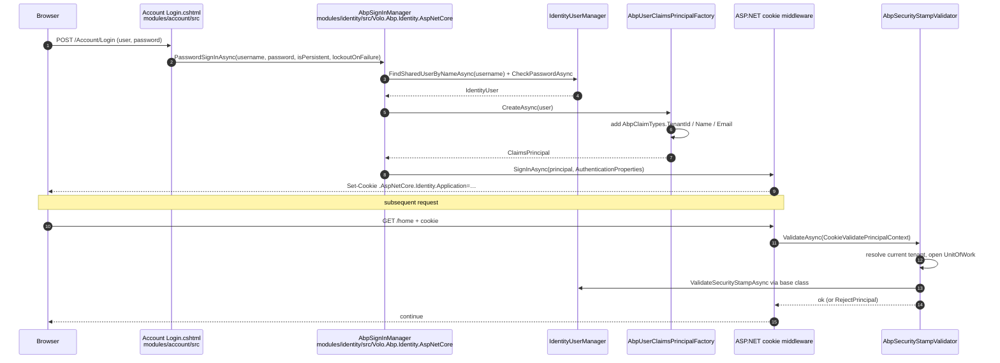
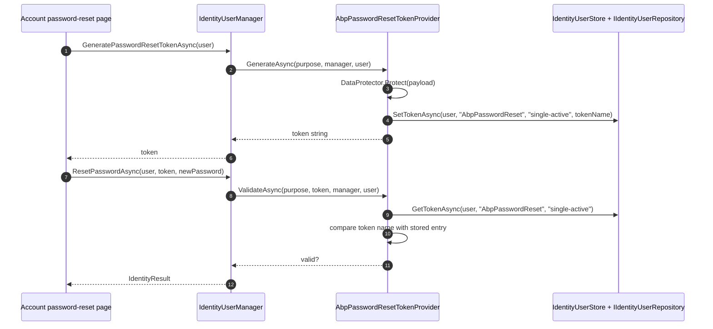

The **ABP Framework** Identity AspNetCore package is the bridge between the Domain layer's `IdentityUser`/`IdentityRole` aggregates and the ASP.NET Core authentication pipeline. It replaces `SignInManager<IdentityUser>` with `AbpSignInManager`, layers eight ABP-specific token providers on top of `Microsoft.AspNetCore.Identity`, and wires an enhanced `SecurityStampValidator` so the cookie revalidation runs inside a multi-tenant `IUnitOfWork`. All code lives under `modules/identity/src/Volo.Abp.Identity.AspNetCore/`.

## Module wire-up

`AbpIdentityAspNetCoreModule` (file `modules/identity/src/Volo.Abp.Identity.AspNetCore/Volo/Abp/Identity/AspNetCore/AbpIdentityAspNetCoreModule.cs`):

```csharp
[DependsOn(typeof(AbpIdentityDomainModule))]
public class AbpIdentityAspNetCoreModule : AbpModule
{
    public override void PreConfigureServices(ServiceConfigurationContext context)
    {
        PreConfigure<IdentityBuilder>(builder =>
        {
            builder
                .AddDefaultTokenProviders()
                .AddTokenProvider<LinkUserTokenProvider>(LinkUserTokenProviderConsts.LinkUserTokenProviderName)
                .AddTokenProvider<AbpPasswordResetTokenProvider>(AbpPasswordResetTokenProvider.ProviderName)
                .AddTokenProvider<AbpEmailConfirmationTokenProvider>(AbpEmailConfirmationTokenProvider.ProviderName)
                .AddTokenProvider<AbpChangeEmailTokenProvider>(AbpChangeEmailTokenProvider.ProviderName)
                .AddTokenProvider<AbpEmailTwoFactorTokenProvider>(TokenOptions.DefaultEmailProvider)
                .AddTokenProvider<AbpPhoneNumberTwoFactorTokenProvider>(TokenOptions.DefaultPhoneProvider)
                .AddSignInManager<AbpSignInManager>()
                .AddUserValidator<AbpIdentityUserValidator>();
        });
    }

    public override void ConfigureServices(ServiceConfigurationContext context)
    {
        Configure<IdentityOptions>(options =>
        {
            options.Tokens.PasswordResetTokenProvider     = AbpPasswordResetTokenProvider.ProviderName;
            options.Tokens.EmailConfirmationTokenProvider = AbpEmailConfirmationTokenProvider.ProviderName;
            options.Tokens.ChangeEmailTokenProvider       = AbpChangeEmailTokenProvider.ProviderName;
        });

        context.Services.AddScoped<AbpSecurityStampValidator>();
        context.Services.AddScoped(typeof(SecurityStampValidator<IdentityUser>),
            p => p.GetService(typeof(AbpSecurityStampValidator)));
        context.Services.AddScoped(typeof(ISecurityStampValidator),
            p => p.GetService(typeof(AbpSecurityStampValidator)));

        var options = context.Services.ExecutePreConfiguredActions(new AbpIdentityAspNetCoreOptions());

        if (options.ConfigureAuthentication)
        {
            context.Services
                .AddAuthentication(o =>
                {
                    o.DefaultScheme       = IdentityConstants.ApplicationScheme;
                    o.DefaultSignInScheme = IdentityConstants.ExternalScheme;
                })
                .AddIdentityCookies();
        }
    }
}
```

Three things deserve attention. First, all token provider registrations are placed inside `PreConfigureServices`, where `PreConfigure<IdentityBuilder>` queues a delegate that will run when `AbpIdentityDomainModule.AddAbpIdentity(...)` builds the `IdentityBuilder` instance. This sequencing is critical — the domain module is the one calling `services.AddIdentityCore<IdentityUser>().AddRoles<IdentityRole>()`, and the queued delegate extends that exact builder. Second, the security-stamp validator is registered three times so that any of `AbpSecurityStampValidator`, `SecurityStampValidator<IdentityUser>`, or `ISecurityStampValidator` resolve to the same instance. Third, `AddAuthentication + AddIdentityCookies` only fires when `AbpIdentityAspNetCoreOptions.ConfigureAuthentication == true` — letting hosts that want bearer-only flows or custom authentication schemes opt out cleanly.

## IdentityBuilder extensions

The domain module's `services.AddAbpIdentity(...)` (file `modules/identity/src/Volo.Abp.Identity.Domain/Microsoft/Extensions/DependencyInjection/AbpIdentityServiceCollectionExtensions.cs`) returns the `IdentityBuilder`. The AspNetCore module then layers extensions on top through its `PreConfigure<IdentityBuilder>` delegate. The final chain is:

- `.AddDefaultTokenProviders()` — the stock framework providers (`DataProtectorTokenProvider<IdentityUser>` etc.) needed by `UserManager.GenerateUserTokenAsync`.
- `.AddTokenProvider<LinkUserTokenProvider>(LinkUserTokenProviderConsts.LinkUserTokenProviderName)` — issues link-user tokens used when an authenticated user wants to switch into a linked target identity.
- `.AddTokenProvider<AbpPasswordResetTokenProvider>("AbpPasswordReset")` — single-active password-reset token (described below).
- `.AddTokenProvider<AbpEmailConfirmationTokenProvider>("AbpEmailConfirmation")` — single-active email-confirmation token.
- `.AddTokenProvider<AbpChangeEmailTokenProvider>("AbpChangeEmail")` — single-active change-email token.
- `.AddTokenProvider<AbpEmailTwoFactorTokenProvider>(TokenOptions.DefaultEmailProvider)` — replaces the stock email-based 2FA provider.
- `.AddTokenProvider<AbpPhoneNumberTwoFactorTokenProvider>(TokenOptions.DefaultPhoneProvider)` — replaces the stock SMS-based 2FA provider.
- `.AddSignInManager<AbpSignInManager>()` — replaces the framework `SignInManager<IdentityUser>` with the ABP subclass.
- `.AddUserValidator<AbpIdentityUserValidator>()` — replaces the user validator with an ABP-aware one (and a `PostConfigureServices` step explicitly removes the stock `UserValidator<IdentityUser>` from the service collection to prevent both running).

The `Configure<IdentityOptions>(...)` block in `ConfigureServices` then rewires `IdentityOptions.Tokens.PasswordResetTokenProvider` etc. to the ABP provider names — so a call to `UserManager.GeneratePasswordResetTokenAsync(user)` ends up driving `AbpPasswordResetTokenProvider`, not the default data protector.

## AbpIdentityAspNetCoreOptions

`AbpIdentityAspNetCoreOptions` (file `AbpIdentityAspNetCoreOptions.cs`):

```csharp
public class AbpIdentityAspNetCoreOptions
{
    /// <summary>
    /// Default: true.
    /// </summary>
    public bool ConfigureAuthentication { get; set; } = true;
}
```

A single switch. Setting `ConfigureAuthentication = false` from a host's `PreConfigureServices` prevents the module from calling `AddAuthentication().AddIdentityCookies()`, which is exactly what hosts running OpenIddict or pure JWT bearer flows want — they own the authentication setup themselves.

## AbpSignInManager

`AbpSignInManager` (file `AbpSignInManager.cs`) extends `SignInManager<IdentityUser>` and depends on `IdentityUserManager`, `IHttpContextAccessor`, `IUserClaimsPrincipalFactory<IdentityUser>`, `IOptions<IdentityOptions>`, `ILogger<SignInManager<IdentityUser>>`, `IAuthenticationSchemeProvider`, `IUserConfirmation<IdentityUser>`, `IOptions<AbpIdentityOptions>`, `ISettingProvider`, and `ICurrentTenant`. Its `PasswordSignInAsync` override resolves multi-tenant lookups via `IdentityUserManager.FindSharedUserByNameAsync`/`FindSharedUserByEmailAsync` so the same username can exist across tenants without colliding.

The class is the single integration point Account uses for sign-in — `modules/account/src/Volo.Abp.Account.Web/Pages/Account/Login.cshtml.cs` calls `SignInManager.PasswordSignInAsync` directly. Because `AddSignInManager<AbpSignInManager>()` rewires the DI binding, every Razor Page that resolves `SignInManager<IdentityUser>` actually receives `AbpSignInManager`.

## AbpSecurityStampValidator

`AbpSecurityStampValidator` (file `AbpSecurityStampValidator.cs`) wraps the cookie-revalidation pipeline inside an ABP `IUnitOfWork` and the current `ITenantConfigurationProvider` scope so EF Core / Mongo data filters see the right tenant id when the security stamp is being refreshed:

```csharp
public class AbpSecurityStampValidator : SecurityStampValidator<IdentityUser>
{
    [UnitOfWork]
    public async override Task ValidateAsync(CookieValidatePrincipalContext context)
    {
        TenantConfiguration tenant = null;
        try
        {
            tenant = await TenantConfigurationProvider.GetAsync(saveResolveResult: false);
        }
        catch (Exception e)
        {
            Logger.LogException(e);
        }

        using (CurrentTenant.Change(tenant?.Id, tenant?.Name))
        {
            await base.ValidateAsync(context);
        }
    }
}
```

The companion `AbpSecurityStampValidatorCallback` (file `AbpSecurityStampValidatorCallback.cs`) defines the `UpdatePrincipal` action that pushes refreshed claims back into the cookie, and `SecurityStampValidatorOptionsExtensions.UpdatePrincipal(...)` (file `SecurityStampValidatorOptionsExtensions.cs`) wires it onto `SecurityStampValidatorOptions`. `AbpRefreshingPrincipalOptions` (file `AbpRefreshingPrincipalOptions.cs`) holds the list of claim contributors to invoke on refresh — the `PostConfigureServices` block at the bottom of `AbpIdentityAspNetCoreModule` wires those options onto `SecurityStampValidatorOptions` so every cookie revalidation picks up the latest claims.

## Token providers

ABP ships three categories of token providers:

### Single-active data-protected tokens

`AbpSingleActiveTokenProvider` (file `AbpSingleActiveTokenProvider.cs`) is an abstract `DataProtectorTokenProvider<IdentityUser>` subclass that records the active token in the user's `Tokens` collection so any previously issued token is invalidated. Three concrete subclasses follow this pattern, each with its own `Options` class for expiration tuning:

| Provider                                                                                                                 | Provider name (`IdentityOptions.Tokens`)            | Options                                                              |
| ------------------------------------------------------------------------------------------------------------------------ | --------------------------------------------------- | -------------------------------------------------------------------- |
| `AbpPasswordResetTokenProvider.cs`                                                                                       | `AbpPasswordReset` (= `ProviderName`)               | `AbpPasswordResetTokenProviderOptions.cs`                            |
| `AbpEmailConfirmationTokenProvider.cs`                                                                                   | `AbpEmailConfirmation`                              | `AbpEmailConfirmationTokenProviderOptions.cs`                        |
| `AbpChangeEmailTokenProvider.cs`                                                                                         | `AbpChangeEmail`                                    | `AbpChangeEmailTokenProviderOptions.cs`                              |

For example `AbpPasswordResetTokenProvider`:

```csharp
public class AbpPasswordResetTokenProvider : AbpSingleActiveTokenProvider
{
    public const string ProviderName = "AbpPasswordReset";

    public AbpPasswordResetTokenProvider(
        IDataProtectionProvider dataProtectionProvider,
        IOptions<AbpPasswordResetTokenProviderOptions> options,
        ILogger<DataProtectorTokenProvider<IdentityUser>> logger,
        IIdentityUserRepository userRepository,
        ICancellationTokenProvider cancellationTokenProvider)
        : base(dataProtectionProvider, options, logger, userRepository, cancellationTokenProvider) { }
}
```

The base class persists the generated token name on the user via `IIdentityUserRepository` so the next `ValidateAsync` call can compare against the stored entry — invalidating any earlier token issued during the lifetime of the same user.

### Two-factor providers

`AbpTwoFactorTokenProvider` (file `AbpTwoFactorTokenProvider.cs`) is the base for the e-mail and phone variants, both of which inherit from it:

- `AbpEmailTwoFactorTokenProvider.cs` — overrides `TokenOptions.DefaultEmailProvider`.
- `AbpPhoneNumberTwoFactorTokenProvider.cs` — overrides `TokenOptions.DefaultPhoneProvider`.

Each has its own options record (`AbpEmailTwoFactorTokenProviderOptions.cs`, `AbpPhoneNumberTwoFactorTokenProviderOptions.cs`, and the shared `AbpTwoFactorTokenProviderOptions.cs`). The 2FA providers integrate with the email and SMS senders the host registers — the Account module's login flow asks the provider to generate a code, ships it through `IEmailSender`/`ISmsSender`, then asks `UserManager.VerifyTwoFactorTokenAsync` to validate the user-entered value.

### Link-user provider

`LinkUserTokenProvider.cs` is the simplest provider — a plain `DataProtectorTokenProvider<IdentityUser>` with a constant name `LinkUserTokenProviderConsts.LinkUserTokenProviderName`. It is used by the link-user flow: after `IdentityLinkUserManager` confirms a link exists, the source user's identity generates a token via this provider, the target user redeems it, and the sign-in manager swaps the cookie.

`IdentityUserManagerSingleActiveTokenExtensions` (file `IdentityUserManagerSingleActiveTokenExtensions.cs`) exposes the typed wrappers `GeneratePasswordResetTokenAsync(this IdentityUserManager mgr, IdentityUser user)`, `GenerateEmailConfirmationTokenAsync(...)`, and `GenerateChangeEmailTokenAsync(...)` so consumers don't need to remember the provider name strings.

## Sign-in / cookie-validation flow

The pipeline that runs every authenticated request involves three pieces of this module: `AbpSignInManager`, `AbpUserClaimsPrincipalFactory` (from the Domain module), and `AbpSecurityStampValidator`. The diagram below shows them with the surrounding Account / OpenIddict actors.



The validator is invoked at the cadence set by `SecurityStampValidatorOptions.ValidationInterval` (default 30 minutes). Because `AbpRefreshingPrincipalOptions` plugs the dynamic claim contributors into that validation step, dynamic role assignments and per-user claim grants take effect within the validation window without forcing the user to re-login.

## Token-generation flow



## AbpAspNetCoreServiceCollectionExtensions

`modules/identity/src/Volo.Abp.Identity.AspNetCore/Microsoft/AspNetCore/Extensions/DependencyInjection/AbpAspNetCoreServiceCollectionExtensions.cs` declares the developer-facing helper used by application templates:

```csharp
public static class AbpAspNetCoreServiceCollectionExtensions
{
    public static IServiceCollection AddAbpClaimsPrincipalFactory(this IServiceCollection services) { ... }
}
```

Combined with `AbpUserClaimsPrincipalFactory` (Domain module) and `IdentityDynamicClaimsPrincipalContributor` (Domain module), this is the surface a host uses if it wants to register additional claim contributors before sign-in.

## How the host composes it

A typical application module's `[DependsOn(...)]` includes both `AbpIdentityAspNetCoreModule` and `AbpAccountWebModule`. The Account module depends on this module for `AbpSignInManager` and the token providers; the host therefore gets both transitively. OpenIddict-based hosts add `AbpOpenIddictAspNetCoreModule` and turn `AbpIdentityAspNetCoreOptions.ConfigureAuthentication` off because OpenIddict configures the authentication schemes itself.

## AbpIdentityUserValidator

`AbpIdentityUserValidator` (file `modules/identity/src/Volo.Abp.Identity.Domain/Volo/Abp/Identity/AbpIdentityUserValidator.cs` — declared in the Domain assembly and registered from this module) replaces `UserValidator<IdentityUser>`. It honours ABP-specific rules such as `IdentityUserConsts.MaxUserNameLength` (from `modules/identity/src/Volo.Abp.Identity.Domain.Shared/Volo/Abp/Identity/IdentityUserConsts.cs`) and the *allowed characters* regex configured through `IdentityOptions.User.AllowedUserNameCharacters`. The module's `PostConfigureServices` removes the stock `UserValidator<IdentityUser>` registration so only the ABP one runs:

```csharp
context.Services.RemoveAll(x =>
    x.ServiceType == typeof(IUserValidator<IdentityUser>) &&
    x.ImplementationType == typeof(UserValidator<IdentityUser>));
```

## SignInResultExtensions

`SignInResultExtensions` (file `SignInResultExtensions.cs`) provides convenience checks like `result.IsLockedOut()`, `result.RequiresTwoFactor()`, and `result.IsNotAllowed()` that the Account module's login page uses to branch the post-login flow without sprinkling boilerplate.

## How a host turns authentication wiring off

For OpenIddict-driven hosts the typical pre-configuration is:

```csharp
public override void PreConfigureServices(ServiceConfigurationContext context)
{
    PreConfigure<AbpIdentityAspNetCoreOptions>(o =>
    {
        o.ConfigureAuthentication = false;
    });
}
```

The module then skips `AddAuthentication().AddIdentityCookies()` so OpenIddict's own `AddAuthentication().AddCookie(...).AddOAuth(...)` setup wins. Token providers, the sign-in manager, the security-stamp validator, and the user validator are still registered — only the cookie-scheme registration is suppressed.

## AbpRefreshingPrincipalOptions

`AbpRefreshingPrincipalOptions` (file `AbpRefreshingPrincipalOptions.cs`) configures which claim-types are refreshed on every security-stamp revalidation. The defaults include `AbpClaimTypes.TenantId`, `AbpClaimTypes.Email`, `AbpClaimTypes.EmailVerified`, `AbpClaimTypes.PhoneNumber`, `AbpClaimTypes.PhoneNumberVerified`, `AbpClaimTypes.Name`, `AbpClaimTypes.SurName`, and `AbpClaimTypes.Role`. The `PostConfigureServices` block of `AbpIdentityAspNetCoreModule` wires these into `SecurityStampValidatorOptions.OnRefreshingPrincipal` via the `UpdatePrincipal` extension method (`SecurityStampValidatorOptionsExtensions.cs`), so when the validator decides to refresh, the listed claims are repopulated from the database without invalidating the cookie itself.

A host that wants to add `Department` to the refresh list calls:

```csharp
Configure<AbpRefreshingPrincipalOptions>(o =>
{
    o.ReplaceClaimTypes.Add("Department");
});
```

The next security-stamp revalidation (default 30 minutes) picks up the change without any user action.

## Where to go next

For the claims-principal factory invoked by `AbpSignInManager`, see the [Domain page](/module-identity/domain). For the controllers that surface the user-management operations, see [HTTP API](/module-identity/http-api).
