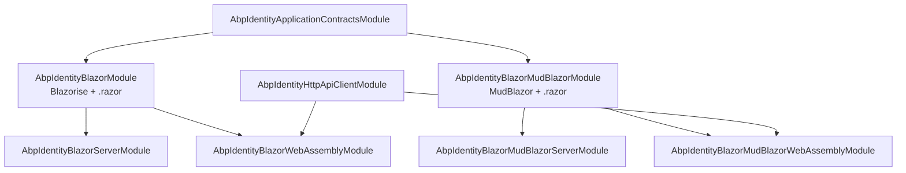
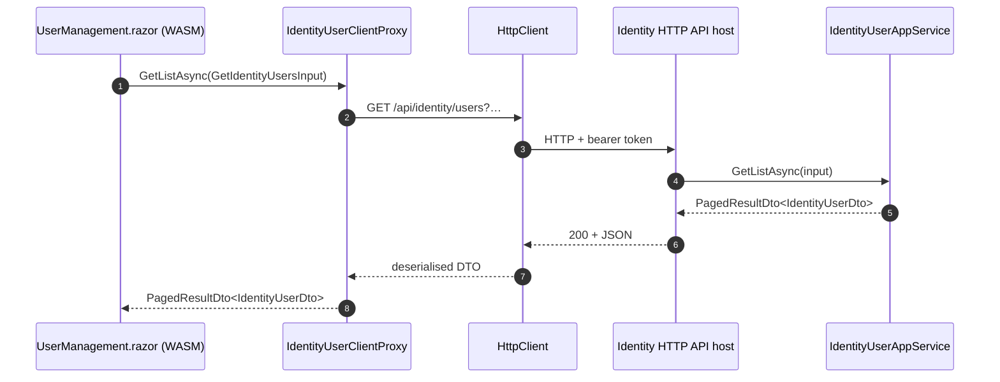

The **ABP Framework** Identity Blazor UI is the rich-client management surface. It ships six sibling packages that combine a *component-library* axis (Blazorise vs MudBlazor) with a *render-mode* axis (Blazor Server vs WebAssembly). All six produce the same two visible pages — *Identity Management → Users* and *Identity Management → Roles* — by depending on the application-services contracts and either the local Domain module (Server) or the HTTP API client (WebAssembly). All code lives under `modules/identity/src/` in the six folders prefixed `Volo.Abp.Identity.Blazor*`.

## The six packages

| Package directory                                                                                                          | Component library | Render mode      | Notable additional dependency                                                                                                  |
| -------------------------------------------------------------------------------------------------------------------------- | ----------------- | ---------------- | ------------------------------------------------------------------------------------------------------------------------------ |
| `modules/identity/src/Volo.Abp.Identity.Blazor/`                                                                            | Blazorise         | shared           | `AbpBlazoriseUIModule`                                                                                                         |
| `modules/identity/src/Volo.Abp.Identity.Blazor.Server/`                                                                    | Blazorise         | Server           | `AbpPermissionManagementBlazorServerModule`                                                                                    |
| `modules/identity/src/Volo.Abp.Identity.Blazor.WebAssembly/`                                                               | Blazorise         | WebAssembly      | `AbpIdentityHttpApiClientModule`, `AbpPermissionManagementBlazorWebAssemblyModule`                                              |
| `modules/identity/src/Volo.Abp.Identity.Blazor.MudBlazor/`                                                                  | MudBlazor         | shared           | `AbpMudBlazorUIModule`                                                                                                         |
| `modules/identity/src/Volo.Abp.Identity.Blazor.MudBlazor.Server/`                                                          | MudBlazor         | Server           | `AbpPermissionManagementBlazorMudBlazorServerModule`                                                                           |
| `modules/identity/src/Volo.Abp.Identity.Blazor.MudBlazor.WebAssembly/`                                                     | MudBlazor         | WebAssembly      | `AbpIdentityHttpApiClientModule`, `AbpPermissionManagementBlazorMudBlazorWebAssemblyModule`                                    |

`Volo.Abp.Identity.Blazor` and `Volo.Abp.Identity.Blazor.MudBlazor` are the **shared** packages — they contain the actual `*.razor` markup and code-behind. The four host packages (`*.Server`, `*.WebAssembly`) are deliberately tiny shims that compose the shared package with the matching Permission Management Blazor variant.

## Shared module: AbpIdentityBlazorModule

`modules/identity/src/Volo.Abp.Identity.Blazor/AbpIdentityBlazorModule.cs`:

```csharp
[DependsOn(
    typeof(AbpIdentityApplicationContractsModule),
    typeof(AbpMapperlyModule),
    typeof(AbpPermissionManagementBlazorModule),
    typeof(AbpBlazoriseUIModule)
    )]
public class AbpIdentityBlazorModule : AbpModule
{
    public override void ConfigureServices(ServiceConfigurationContext context)
    {
        context.Services.AddMapperlyObjectMapper<AbpIdentityBlazorModule>();

        Configure<AbpNavigationOptions>(options =>
        {
            options.MenuContributors.Add(new AbpIdentityWebMainMenuContributor());
        });

        Configure<AbpRouterOptions>(options =>
        {
            options.AdditionalAssemblies.Add(typeof(AbpIdentityBlazorModule).Assembly);
        });

        Configure<AbpLocalizationOptions>(options =>
        {
            options.Resources
                .Get<IdentityResource>()
                .AddBaseTypes(typeof(AbpUiResource));
        });
    }
}
```

Three things happen here. First, `AbpMapperlyObjectMapper<AbpIdentityBlazorModule>()` registers the assembly's partial Mapperly mappers (`AbpIdentityBlazorMappers.cs`) so `ObjectMapper.Map<IdentityUserDto, UserInfoViewModel>(...)` calls inside the pages compile against a real implementation. Second, `Configure<AbpRouterOptions>` adds the assembly to the Blazor router's `AdditionalAssemblies` — that is the magic step that makes `@page "/identity/users"` directives in the embedded `*.razor` files routable from the host. Third, the menu contributor is registered (same `AbpIdentityWebMainMenuContributor` class as Razor Pages, but the Blazor file lives at `modules/identity/src/Volo.Abp.Identity.Blazor/AbpIdentityWebMainMenuContributor.cs`).

The same module declares `PostConfigureServices` to map `IdentityRoleCreateDto`/`IdentityRoleUpdateDto` and `IdentityUserCreateDto`/`IdentityUserUpdateDto` into the object-extension UI system so extra properties added by the host materialise as form fields automatically.

### MudBlazor twin

`AbpIdentityBlazorMudBlazorModule` (file `modules/identity/src/Volo.Abp.Identity.Blazor.MudBlazor/AbpIdentityBlazorMudBlazorModule.cs`) is identical except for two substitutions — `AbpBlazoriseUIModule` is replaced by `AbpMudBlazorUIModule`, and `AbpPermissionManagementBlazorModule` is replaced by `AbpPermissionManagementBlazorMudBlazorModule`. The menu contributor, the resource registration, and the object-extension wiring are the same code repeated in the MudBlazor folder.

## Razor components

### UserManagement.razor

Both shared packages ship `Pages/Identity/UserManagement.razor` and `Pages/Identity/UserManagement.razor.cs`. The Blazorise version is at `modules/identity/src/Volo.Abp.Identity.Blazor/Pages/Identity/UserManagement.razor.cs` and the MudBlazor twin at `modules/identity/src/Volo.Abp.Identity.Blazor.MudBlazor/Pages/Identity/UserManagement.razor.cs`. The code-behind is a `partial class` that consumes `IIdentityUserAppService` and `IIdentityRoleAppService` through dependency injection, manages two `AssignedRoleViewModel[]` arrays for the *create* and *edit* modals, and exposes a `PermissionManagementModal` reference for the per-user permission editor (an `IdentityPermissions.Users.ManagePermissions` action). Excerpt:

```csharp
public partial class UserManagement
{
    [Parameter] public string? Culture { get; set; }

    protected const string PermissionProviderName = "U";
    protected const string DefaultSelectedTab     = "UserInformations";

    protected PermissionManagementModal PermissionManagementModal;
    protected IReadOnlyList<IdentityRoleDto> Roles;
    protected AssignedRoleViewModel[] NewUserRoles;
    protected AssignedRoleViewModel[] EditUserRoles;
    protected string ManagePermissionsPolicyName;
    protected bool HasManagePermissionsPermission { get; set; }
}
```

The base class for both variants is the framework component `AbpCrudPageBase<TAppService, TEntityDto, TKey, TGetListInput, TCreateInput, TUpdateInput>` from `framework/src/Volo.Abp.AspNetCore.Components.Web.Extensibility/`, so the component inherits paging, sorting, filter binding, modal management, and entity-actions support out of the box. The `.razor` markup file declares the actual `<Card>`, `<DataGrid>`, `<Modal>` (or `<MudCard>`, `<MudDataGrid>`, `<MudDialog>`) tags.

The MudBlazor variant adds a `?` to nullable references (the file is compiled with `Nullable` enabled), uses `MudBlazor` namespaces, and pulls its tag library from `Volo.Abp.MudBlazorUI`. The Blazorise variant uses `Blazorise`. Apart from these differences the UX is identical.

### RoleManagement.razor

`Pages/Identity/RoleManagement.razor(.cs)` in both shared packages drives the Roles tab. Excerpt from the Blazorise variant:

```csharp
public partial class RoleManagement
{
    [Parameter] public string? Culture { get; set; }

    protected const string PermissionProviderName = "R";
    protected PermissionManagementModal PermissionManagementModal;
    protected string ManagePermissionsPolicyName;
    protected bool HasManagePermissionsPermission { get; set; }

    protected PageToolbar Toolbar { get; } = new();
    protected List<TableColumn> RoleManagementTableColumns => TableColumns.Get<RoleManagement>();

    public RoleManagement()
    {
        ObjectMapperContext   = typeof(AbpIdentityBlazorModule);
        LocalizationResource  = typeof(IdentityResource);
        CreatePolicyName      = IdentityPermissions.Roles.Create;
        // … UpdatePolicyName, DeletePolicyName, etc.
    }
}
```

`CreatePolicyName` / `UpdatePolicyName` / `DeletePolicyName` are wired to the same `IdentityPermissions.Roles.*` constants used by the Razor Pages and the Application services — the framework's `AbpCrudPageBase` honours them by hiding action buttons when the user lacks the policy.

### Reusable cell components

Both shared packages ship `Pages/Identity/RoleNameComponent.razor(.cs)`:

```csharp
public partial class RoleNameComponent : ComponentBase
{
    [Parameter] public object Data { get; set; }
}
```

This component renders a role badge with an *IsDefault* / *IsPublic* / *IsStatic* indicator. It is plugged into the Users grid's *Roles* column through the framework's `TableColumns.Configure<UserManagement>(...)` extensibility system so the same row knows how to show the role name with its flags.

## Menu contribution

`AbpIdentityWebMainMenuContributor` from `modules/identity/src/Volo.Abp.Identity.Blazor/AbpIdentityWebMainMenuContributor.cs`:

```csharp
public class AbpIdentityWebMainMenuContributor : IMenuContributor
{
    public virtual Task ConfigureMenuAsync(MenuConfigurationContext context)
    {
        if (context.Menu.Name != StandardMenus.Main)
            return Task.CompletedTask;

        var administrationMenu = context.Menu.GetAdministration();
        var l = context.GetLocalizer<IdentityResource>();

        var identityMenuItem = new ApplicationMenuItem(IdentityMenuNames.GroupName, l["Menu:IdentityManagement"], icon: "far fa-id-card");
        administrationMenu.AddItem(identityMenuItem);

        identityMenuItem.AddItem(new ApplicationMenuItem(IdentityMenuNames.Roles, l["Roles"], url: "~/identity/roles").RequirePermissions(IdentityPermissions.Roles.Default));
        identityMenuItem.AddItem(new ApplicationMenuItem(IdentityMenuNames.Users, l["Users"], url: "~/identity/users").RequirePermissions(IdentityPermissions.Users.Default));

        return Task.CompletedTask;
    }
}
```

`IdentityMenuNames` (file `IdentityMenuNames.cs` in the same folder) defines the constants `GroupName = "AbpIdentity"`, `Roles`, and `Users` — the same constants used in the Razor Pages module, just duplicated so the Blazor assembly does not depend on the Razor Pages assembly.

## Host shim modules

Each variant ships two shims — one for Blazor Server, one for WebAssembly.

`AbpIdentityBlazorServerModule` (file `modules/identity/src/Volo.Abp.Identity.Blazor.Server/AbpIdentityBlazorServerModule.cs`):

```csharp
[DependsOn(
    typeof(AbpIdentityBlazorModule),
    typeof(AbpPermissionManagementBlazorServerModule)
)]
public class AbpIdentityBlazorServerModule : AbpModule { }
```

`AbpIdentityBlazorWebAssemblyModule` (file `modules/identity/src/Volo.Abp.Identity.Blazor.WebAssembly/AbpIdentityBlazorWebAssemblyModule.cs`):

```csharp
[DependsOn(
    typeof(AbpIdentityBlazorModule),
    typeof(AbpPermissionManagementBlazorWebAssemblyModule),
    typeof(AbpIdentityHttpApiClientModule)
)]
public class AbpIdentityBlazorWebAssemblyModule : AbpModule { }
```

The Server variant relies on the host already depending on `AbpIdentityApplicationModule` (and therefore the Domain + EF Core / Mongo persistence). The WebAssembly variant adds `AbpIdentityHttpApiClientModule` so the static jQuery- and C#-side HTTP client proxies route every `IIdentityUserAppService.GetListAsync(...)` call to `/api/identity/users` over HTTP.

The MudBlazor equivalents look identical with substituted dependencies — for example `AbpIdentityBlazorMudBlazorWebAssemblyModule` depends on `AbpIdentityBlazorMudBlazorModule`, `AbpPermissionManagementBlazorMudBlazorWebAssemblyModule`, and `AbpIdentityHttpApiClientModule`.



## How the variants differ in practice

- **Markup library** — Blazorise uses `<DataGrid>`, `<Modal>`, `<Card>`, `<Button Color="…">` tags from the `Blazorise.*` packages. MudBlazor uses `<MudDataGrid>`, `<MudDialog>`, `<MudCard>`, `<MudButton Color="Color.Primary">`. The component-tree shape, parameters, and event names are different so the two markup files are independent.
- **Theme integration** — Blazorise shells render through `AbpAspNetCoreComponentsWebThemingModule` (theme shared between Razor Pages and Blazorise), while MudBlazor shells render through `AbpAspNetCoreComponentsWebThemingMudBlazorModule`. That is why the Blazor module pulls `AbpRouterOptions` whereas the MudBlazor module pulls `AbpRouterOptions` from the MudBlazor router namespace (`Volo.Abp.AspNetCore.Components.Web.Theming.MudBlazor.Routing`).
- **Permission editor** — `PermissionManagementModal` comes from `Volo.Abp.PermissionManagement.Blazor.Components` (Blazorise) or `Volo.Abp.PermissionManagement.Blazor.MudBlazor.Components` (MudBlazor). Each variant depends on the matching Permission Management Blazor package.
- **Page-toolbar host** — the Blazorise variant uses `Volo.Abp.AspNetCore.Components.Web.Theming.PageToolbars.PageToolbar`; MudBlazor uses `Volo.Abp.AspNetCore.Components.Web.Theming.MudBlazor.PageToolbars.PageToolbar`. Both bind to the same `AbpPageToolbarOptions` service.
- **Render mode** — Server vs WebAssembly only changes *where* the component executes and *how* the application services are reached. On Server the component process calls `IIdentityUserAppService` in-process; on WebAssembly the implementation is `IdentityUserClientProxy` from `modules/identity/src/Volo.Abp.Identity.HttpApi.Client/ClientProxies/Volo/Abp/Identity/IdentityUserClientProxy.Generated.cs`, which performs an HTTP call to `/api/identity/users`.

## Request flow on WebAssembly



On Blazor Server, replace the `Proxy → Http → Api` hops with a direct in-process call from `UI → IdentityUserAppService`.

## Mapperly bindings

Each shared module file has a Mapperly companion. `AbpIdentityBlazorMappers.cs` and `AbpIdentityBlazorMudBlazorMappers.cs` declare partial `Mapper` classes such as `IdentityRoleDtoToAssignedRoleViewModelMapper` so the page-side view-models materialise without manual mapping code. The classes are registered through `AddMapperlyObjectMapper<AbpIdentityBlazorModule>()` and `AddMapperlyObjectMapper<AbpIdentityBlazorMudBlazorModule>()` respectively.

## Object extensions on the Blazor side

The `PostConfigureServices` blocks at the bottom of both shared modules (`AbpIdentityBlazorModule.cs` and `AbpIdentityBlazorMudBlazorModule.cs`) call `ModuleExtensionConfigurationHelper.ApplyEntityConfigurationToUi` for the `User` and `Role` entities with their create/update DTOs:

```csharp
public override void PostConfigureServices(ServiceConfigurationContext context)
{
    OneTimeRunner.Run(() =>
    {
        ModuleExtensionConfigurationHelper
            .ApplyEntityConfigurationToUi(
                IdentityModuleExtensionConsts.ModuleName,
                IdentityModuleExtensionConsts.EntityNames.Role,
                createFormTypes: new[] { typeof(IdentityRoleCreateDto) },
                editFormTypes:   new[] { typeof(IdentityRoleUpdateDto) });

        ModuleExtensionConfigurationHelper
            .ApplyEntityConfigurationToUi(
                IdentityModuleExtensionConsts.ModuleName,
                IdentityModuleExtensionConsts.EntityNames.User,
                createFormTypes: new[] { typeof(IdentityUserCreateDto) },
                editFormTypes:   new[] { typeof(IdentityUserUpdateDto) });
    });
}
```

This wiring means a host that registers a `Department` property via `ObjectExtensionManager.Instance.Modules().ConfigureIdentity(...).ConfigureUser(u => u.AddOrUpdateProperty<string>("Department"))` from `PreConfigureServices` sees the field automatically rendered as a Blazorise `<TextEdit>` or MudBlazor `<MudTextField>` in both modals — no markup edit required.

## Localization

Both shared modules `AddBaseTypes(typeof(AbpUiResource))` to `IdentityResource` so generic UI strings like *Save*, *Cancel*, *Are you sure?* resolve through the framework's shared dictionary. The Razor markup uses `@inject IStringLocalizer<IdentityResource> L` (or the MudBlazor equivalent) for module-specific strings such as `L["Users"]`, `L["RoleManagement"]`, `L["Menu:IdentityManagement"]`.

## Selecting a variant in the application template

ABP's `abp new` templates expose a `-u` switch (`-u blazor-server`, `-u blazor-webassembly`, with optional `--mud` for MudBlazor) that picks one of these four host packages. The shared package is always pulled in transitively; the host variant adds the matching Permission Management Blazor package and — for WebAssembly — the HTTP API client.

## Mapperly bindings on the Blazor side

`AbpIdentityBlazorMappers.cs` and `AbpIdentityBlazorMudBlazorMappers.cs` declare partial Mapperly classes such as `IdentityRoleDtoToAssignedRoleViewModelMapper`. These mappers are registered via `AddMapperlyObjectMapper<AbpIdentityBlazorModule>()` (or the MudBlazor twin) so the page-side `ObjectMapper.Map<IdentityRoleDto, AssignedRoleViewModel>(...)` calls compile against generated code rather than runtime reflection — a measurable cold-start improvement on WebAssembly.

## Permission-management modal integration

Both `UserManagement.razor.cs` and `RoleManagement.razor.cs` reserve a `PermissionManagementModal` reference. When the user clicks the *Permissions* action on a row, the page calls `PermissionManagementModal.OpenAsync(PermissionProviderName, entityId)`. Internally the modal lives in the Permission Management Blazor package — `Volo.Abp.PermissionManagement.Blazor.Components.PermissionManagementModal` for Blazorise, `Volo.Abp.PermissionManagement.Blazor.MudBlazor.Components.PermissionManagementModal` for MudBlazor. It calls the same `/api/permission-management/permissions` endpoint regardless of identity-side variant; the only difference is the modal's rendered UI.

## Authorization at the page level

Because the shared modules call `Configure<AbpRouterOptions>` and Blazor routes flow through the framework's `Authorize` policy filter, every `[Authorize(Policy = IdentityPermissions.Users.Default)]` attribute on the `UserManagement` component is honoured at render time. Users without the permission see the framework's default *Authorization failed* component instead of the page — exactly as on the Razor Pages side, just rendered with Blazor.

## Why the menu contributor is duplicated

Both `Volo.Abp.Identity.Web` (Razor Pages) and `Volo.Abp.Identity.Blazor` (Blazorise) ship a class named `AbpIdentityWebMainMenuContributor`. They are not the same file — each lives in its own assembly so neither pulls the other's transitive dependencies. The MudBlazor variant repeats the exercise again under `Volo.Abp.Identity.Blazor.MudBlazor`. Selecting the right module from `[DependsOn(...)]` picks exactly one contributor, so the *Administration → Identity Management* group appears exactly once.

## Where to go next

The contracts these pages call live on [Application](/module-identity/application). The HTTP routes used by the WebAssembly proxies live on [HTTP API](/module-identity/http-api). The Razor Pages alternative for MVC-style hosts is documented on [Web UI](/module-identity/web-ui).
