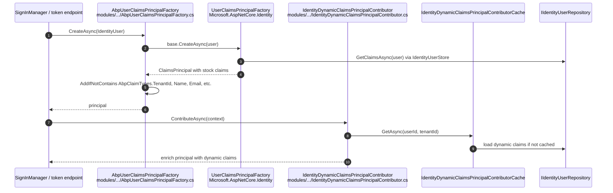

The **ABP Framework** Identity domain layer lives entirely under `modules/identity/src/Volo.Abp.Identity.Domain/`. This is the package every other Identity package depends on transitively: the application services consume `IdentityUserManager` and `IIdentityUserRepository`, the EF Core and Mongo packages implement those repositories, the Account module's `ProfileAppService` calls back into the manager, and OpenIddict relies on the same `IdentityUser` aggregate to materialise principals.

## Domain module wire-up

The entry point is `AbpIdentityDomainModule` in `modules/identity/src/Volo.Abp.Identity.Domain/Volo/Abp/Identity/AbpIdentityDomainModule.cs`. It depends on `AbpDddDomainModule`, `AbpIdentityDomainSharedModule`, `AbpUsersDomainModule`, and `AbpMapperlyModule`. Its `ConfigureServices` calls `context.Services.AddAbpIdentity(...)` — the extension method declared in `modules/identity/src/Volo.Abp.Identity.Domain/Microsoft/Extensions/DependencyInjection/AbpIdentityServiceCollectionExtensions.cs`. That single call registers:

```csharp
services.TryAddScoped<IdentityRoleManager>();
services.TryAddScoped(typeof(RoleManager<IdentityRole>),
    provider => provider.GetService(typeof(IdentityRoleManager)));

services.TryAddScoped<IdentityUserManager>();
services.TryAddScoped(typeof(UserManager<IdentityUser>),
    provider => provider.GetService(typeof(IdentityUserManager)));

services.TryAddScoped<IdentityUserStore>();
services.TryAddScoped(typeof(IUserStore<IdentityUser>),
    provider => provider.GetService(typeof(IdentityUserStore)));

services.TryAddScoped<IdentityRoleStore>();
services.TryAddScoped(typeof(IRoleStore<IdentityRole>),
    provider => provider.GetService(typeof(IdentityRoleStore)));

return services
    .AddIdentityCore<IdentityUser>(setupAction)
    .AddRoles<IdentityRole>()
    .AddClaimsPrincipalFactory<AbpUserClaimsPrincipalFactory>();
```

Because the registrations use `TryAdd`, anything you register before `AbpIdentityDomainModule.ConfigureServices` runs wins — that is how customisation works. The same module wires `IdentityOptions.ClaimsIdentity` to ABP claim types (`AbpClaimTypes.UserId`, `AbpClaimTypes.UserName`, `AbpClaimTypes.Role`, `AbpClaimTypes.Email`) so claims emitted by `UserManager<IdentityUser>.GetClaimsAsync` align with the rest of the framework, and adds distributed-event mappings (`IdentityUser ↔ UserEto`, `IdentityRole ↔ IdentityRoleEto`, `IdentityClaimType ↔ IdentityClaimTypeEto`, `OrganizationUnit ↔ OrganizationUnitEto`) so domain changes propagate via `IDistributedEventBus`.

## The eight aggregates

### IdentityUser

`modules/identity/src/Volo.Abp.Identity.Domain/Volo/Abp/Identity/IdentityUser.cs` declares the user aggregate root:

```csharp
public class IdentityUser : FullAuditedAggregateRoot<Guid>, IUser, IHasEntityVersion
{
    public virtual Guid? TenantId { get; protected set; }
    public virtual string UserName { get; protected internal set; }
    public virtual string NormalizedUserName { get; protected internal set; }
    public virtual string Name { get; set; }
    public virtual string Surname { get; set; }
    public virtual string Email { get; protected internal set; }
    public virtual string NormalizedEmail { get; protected internal set; }
    public virtual bool EmailConfirmed { get; protected internal set; }
    public virtual string PasswordHash { get; protected internal set; }
    public virtual string SecurityStamp { get; protected internal set; }
    public virtual bool IsExternal { get; set; }
    public virtual string PhoneNumber { get; protected internal set; }
    public virtual bool PhoneNumberConfirmed { get; protected internal set; }
    public virtual bool TwoFactorEnabled { get; protected internal set; }
    public virtual DateTimeOffset? LockoutEnd { get; protected internal set; }
    public virtual bool LockoutEnabled { get; protected internal set; }
    public virtual int AccessFailedCount { get; protected internal set; }
    public virtual bool Leaved { get; set; }
    public virtual bool ShouldChangePasswordOnNextLogin { get; protected internal set; }
    public virtual DateTimeOffset? LastPasswordChangeTime { get; protected internal set; }
    public virtual int EntityVersion { get; set; }
    public virtual ICollection<IdentityUserRole> Roles { get; protected set; }
    public virtual ICollection<IdentityUserClaim> Claims { get; protected set; }
    public virtual ICollection<IdentityUserLogin> Logins { get; protected set; }
    public virtual ICollection<IdentityUserToken> Tokens { get; protected set; }
    public virtual ICollection<IdentityUserOrganizationUnit> OrganizationUnits { get; protected set; }
    public virtual ICollection<IdentityUserPasswordHistory> PasswordHistories { get; protected set; }
    public virtual ICollection<IdentityUserPasskey> Passkeys { get; protected set; }
}
```

`FullAuditedAggregateRoot<Guid>` brings `CreationTime`, `CreatorId`, `LastModificationTime`, `LastModifierId`, `IsDeleted`, `DeleterId`, `DeletionTime`. The `protected internal set` accessors mean only the manager or store can mutate identity-critical fields — application code cannot accidentally bypass `UserManager.SetEmailAsync` and leave `NormalizedEmail` stale.

The `Leaved` flag and `LastPasswordChangeTime` are ABP-specific additions on top of stock `Microsoft.AspNetCore.Identity.IdentityUser`. `IsExternal` flags users provisioned through `IExternalLoginProvider` (file `IExternalLoginProvider.cs`) rather than the password flow.

### IdentityRole

`modules/identity/src/Volo.Abp.Identity.Domain/Volo/Abp/Identity/IdentityRole.cs`:

```csharp
public class IdentityRole : AggregateRoot<Guid>, IMultiTenant, IHasEntityVersion, IHasCreationTime
{
    public virtual Guid? TenantId { get; protected set; }
    public virtual string Name { get; protected internal set; }
    public virtual string NormalizedName { get; protected internal set; }
    public virtual ICollection<IdentityRoleClaim> Claims { get; protected set; }
    public virtual bool IsDefault { get; set; }
    public virtual bool IsStatic { get; set; }
    public virtual bool IsPublic { get; set; }
}
```

`IsDefault` roles are added to every new user automatically by `IdentityUserManager.AddDefaultRolesAsync`. `IsStatic` roles can not be deleted or renamed — the seed contributor sets this on the seeded `admin` role to prevent administrators locking themselves out of the system. Whenever a role is renamed, `IdentityRoleManager.UpdateAsync` publishes `IdentityRoleNameChangedEvent` (file `IdentityRoleNameChangedEvent.cs`) so subscribers can mirror the change.

### IdentityClaimType

`modules/identity/src/Volo.Abp.Identity.Domain/Volo/Abp/Identity/IdentityClaimType.cs` lets administrators register custom claim definitions (Name, Required, IsStatic, Regex, ValueType drawn from `IdentityClaimValueType` in `modules/identity/src/Volo.Abp.Identity.Domain.Shared/Volo/Abp/Identity/IdentityClaimValueType.cs`). The companion `IdentityClaimTypeManager` (same folder) enforces uniqueness on the normalised name.

### OrganizationUnit and OrganizationUnitRole

`OrganizationUnit` from `modules/identity/src/Volo.Abp.Identity.Domain/Volo/Abp/Identity/OrganizationUnit.cs` is a `FullAuditedAggregateRoot<Guid>` with a hierarchical `Code` such as `"00001.00042.00005"`, a nullable `ParentId`, a `DisplayName`, and a `Roles` collection of `OrganizationUnitRole` link entities (file `OrganizationUnitRole.cs`). The code length per level is 5 characters (defined in `modules/identity/src/Volo.Abp.Identity.Domain.Shared/Volo/Abp/Identity/OrganizationUnitConsts.cs`). All hierarchy maintenance — `MoveAsync`, `CreateAsync`, computing the next sibling code via `GetNextChildCodeAsync` — lives in `OrganizationUnitManager` (`OrganizationUnitManager.cs`).

### IdentitySession, IdentityLinkUser, IdentityUserDelegation, IdentitySecurityLog

These four aggregates implement orthogonal cross-cutting concerns:

- `IdentitySession` (`IdentitySession.cs`) is a `BasicAggregateRoot<Guid>` per active sign-in: `SessionId`, `Device`, `DeviceInfo`, `UserId`, `ClientId`, `IpAddresses`, `SignedIn`, `LastAccessed`. ABP populates it from `AbpSignInManager` (Account module side) so administrators can list and revoke sessions.
- `IdentityLinkUser` (`IdentityLinkUser.cs`) stores `(SourceUserId, SourceTenantId) ↔ (TargetUserId, TargetTenantId)` so the `LinkUserTokenProvider` can sign a token usable to switch from one identity into the other.
- `IdentityUserDelegation` (`IdentityUserDelegation.cs`) stores `(SourceUserId → TargetUserId, StartTime, EndTime)` so a user can delegate work to a colleague for a fixed window; `IdentityUserDelegationManager` (`IdentityUserDelegationManager.cs`) returns active delegations.
- `IdentitySecurityLog` (`IdentitySecurityLog.cs`) stores audit-grade security events written by `IdentitySecurityLogManager.SaveAsync`. It carries `ApplicationName`, `Identity`, `Action`, `UserId`, `UserName`, `TenantName`, `ClientId`, `CorrelationId`, `ClientIpAddress`, `BrowserInfo`.

```mermaid
erDiagram
    IdentityUser ||--o{ IdentityUserRole : has
    IdentityUser ||--o{ IdentityUserClaim : has
    IdentityUser ||--o{ IdentityUserLogin : has
    IdentityUser ||--o{ IdentityUserToken : has
    IdentityUser ||--o{ IdentityUserOrganizationUnit : has
    IdentityUser ||--o{ IdentityUserPasswordHistory : has
    IdentityUser ||--o{ IdentityUserPasskey : has
    IdentityUser ||--o{ IdentitySession : has
    IdentityRole ||--o{ IdentityRoleClaim : has
    IdentityRole ||--o{ IdentityUserRole : "is referenced by"
    OrganizationUnit ||--o{ OrganizationUnitRole : has
    OrganizationUnit ||--o{ IdentityUserOrganizationUnit : "membership"
    IdentityRole ||--o{ OrganizationUnitRole : "role of OU"
    IdentityUser ||--o{ IdentityLinkUser : "source"
    IdentityUser ||--o{ IdentityUserDelegation : "source"
    IdentityClaimType ||--o| IdentityUserClaim : "type definition"
```



## Repository contracts

Each aggregate has a repository interface, kept in the same folder so that EF Core and Mongo packages can implement them. The contracts are slim — they add only the queries that the managers and app services actually need beyond the framework's `IRepository<TEntity, TKey>`:

| Contract                                                                                                                       | Aggregate              | Notable members                                                                                                                                                                                  |
| ------------------------------------------------------------------------------------------------------------------------------ | ---------------------- | ------------------------------------------------------------------------------------------------------------------------------------------------------------------------------------------------ |
| `IIdentityUserRepository` (`IIdentityUserRepository.cs`)                                                                       | `IdentityUser`         | `FindByNormalizedUserNameAsync`, `GetRoleNamesAsync(Guid id)`, `GetListByIdsAsync(IEnumerable<Guid>)`, `FindByLoginAsync(provider, key)`, `FindByEmailAsync`, `GetCountAsync(filter)` |
| `IIdentityRoleRepository` (`IIdentityRoleRepository.cs`)                                                                       | `IdentityRole`         | `FindByNormalizedNameAsync`, `GetListWithUserCountAsync` returning `IdentityRoleWithUserCount`, `GetDefaultOnesAsync`, `GetListAsync(IEnumerable<Guid>)`                                          |
| `IOrganizationUnitRepository` (`IOrganizationUnitRepository.cs`)                                                               | `OrganizationUnit`     | `GetChildrenAsync(parentId)`, `GetAllChildrenWithParentCodeAsync(code, parentId)`, `GetMembersAsync(ou)`, `GetRolesAsync(ou)`                                                                     |
| `IIdentityClaimTypeRepository` (`IIDentityClaimTypeRepository.cs`)                                                             | `IdentityClaimType`    | `AnyAsync(name)`, `GetListAsync(sorting, maxResultCount, skipCount, filter)`                                                                                                                     |
| `IIdentitySessionRepository` (`IIdentitySessionRepository.cs`)                                                                 | `IdentitySession`      | `FindAsync(sessionId)`, `GetListAsync(filter, device, sorting, maxResultCount, skipCount)`, `DeleteAllAsync(userId, exceptSessionId)`                                                              |
| `IIdentitySecurityLogRepository` (`IIdentitySecurityLogRepository.cs`)                                                         | `IdentitySecurityLog`  | `GetListAsync(sorting, maxResultCount, skipCount, …)`, `GetCountAsync`                                                                                                                           |
| `IIdentityLinkUserRepository` (`IIdentityLinkUserRepository.cs`)                                                               | `IdentityLinkUser`     | `FindAsync(sourceLinkInfo, targetLinkInfo)`, `GetListAsync(sourceLinkInfo, includeIndirect)`                                                                                                      |
| `IIdentityUserDelegationRepository` (`IIdentityUserDelegationRepository.cs`)                                                   | `IdentityUserDelegation` | `GetActiveDelegationsAsync(userId)`, `GetActiveDelegationsCountAsync(sourceUserId, targetUserId, startTime, endTime)`                                                                          |

A custom persistence backend would implement these eight interfaces; EF Core and MongoDB ship the canonical implementations described in the [EF Core](/module-identity/efcore) and [MongoDB](/module-identity/mongodb) pages.

## Managers

Managers are `DomainService` subclasses that own the business rules.

### IdentityUserManager

`IdentityUserManager` (file `modules/identity/src/Volo.Abp.Identity.Domain/Volo/Abp/Identity/IdentityUserManager.cs`) inherits from `Microsoft.AspNetCore.Identity.UserManager<IdentityUser>` and implements `IDomainService`. It depends on `IIdentityRoleRepository`, `IIdentityUserRepository`, `IOrganizationUnitRepository`, `ISettingProvider`, `ICancellationTokenProvider`, `IDistributedEventBus`, `IIdentityLinkUserRepository`, `IDistributedCache<AbpDynamicClaimCacheItem>`, `IOptions<AbpMultiTenancyOptions>`, `ICurrentTenant`, and `IDataFilter`. It overrides the framework methods and adds many ABP-specific operations. The headline public surface includes:

- `CreateAsync(IdentityUser user, string password, bool validatePassword)`
- `GetByIdAsync(Guid id)`
- `SetRolesAsync(IdentityUser user, IEnumerable<string> roleNames)`
- `AddDefaultRolesAsync(IdentityUser user)` — assigns roles where `IsDefault == true`
- `IsInOrganizationUnitAsync(...)`, `AddToOrganizationUnitAsync(...)`, `RemoveFromOrganizationUnitAsync(...)`, `SetOrganizationUnitsAsync(...)`, `GetOrganizationUnitsAsync(...)`, `GetUsersInOrganizationUnitAsync(...)`
- `ShouldPeriodicallyChangePasswordAsync(IdentityUser user)` honouring `IdentitySettingNames.Password.ForceUsersToPeriodicallyChangePassword` from `modules/identity/src/Volo.Abp.Identity.Domain.Shared/Volo/Abp/Identity/Settings/`
- `FindSharedUserByEmailAsync` / `FindSharedUserByNameAsync` / `FindSharedUserByLoginAsync` / `FindSharedUserByPasskeyIdAsync` — multi-tenant aware lookups for the link-user flow
- `UpdateRoleAsync(Guid sourceRoleId, Guid? targetRoleId)` and `UpdateOrganizationAsync(...)` used when the source role/OU is renamed

The class also overrides `SetEmailAsync`, `SetUserNameAsync`, and `ChangePasswordAsync` to publish `IdentityUserEmailChangedEto`, `IdentityUserUserNameChangedEto`, and `IdentityUserPasswordChangedEto` distributed events declared in `modules/identity/src/Volo.Abp.Identity.Domain.Shared/Volo/Abp/Identity/`.

### IdentityRoleManager

`IdentityRoleManager` (file `IdentityRoleManager.cs`) inherits `RoleManager<IdentityRole>` and adds `UpdateAsync` semantics that invalidate the `AbpDynamicClaimCacheItem` cache so that subsequent token issuance sees the renamed role. It also coordinates with `OrganizationUnitManager` because deleting a role must remove `OrganizationUnitRole` links.

### OrganizationUnitManager

`OrganizationUnitManager` (file `OrganizationUnitManager.cs`) handles hierarchy invariants. Its `CreateAsync` calls `GetNextChildCodeAsync(parentId)` to allocate the next sibling, `ValidateParentTenantAsync` to refuse cross-tenant moves, then `ValidateOrganizationUnitAsync`. `MoveAsync` recomputes the `Code` for the moved OU and every descendant. `OrganizationUnitConsts.MaxDepth` from `modules/identity/src/Volo.Abp.Identity.Domain.Shared/Volo/Abp/Identity/OrganizationUnitConsts.cs` caps depth at 16 by default.

### IdentityClaimTypeManager and IdentityUserDelegationManager and IdentityLinkUserManager

`IdentityClaimTypeManager` (file `IdentityClaimTypeManager.cs`) enforces uniqueness on the normalised name and rejects deletion of `IsStatic` types. `IdentityUserDelegationManager` (file `IdentityUserDelegationManager.cs`) creates delegations after checking source and target both exist and the source != target. `IdentityLinkUserManager` (file `IdentityLinkUserManager.cs`) creates/lists link relations.

### Stores

Stores implement the `Microsoft.AspNetCore.Identity` `IUserStore`/`IRoleStore` family and translate them to repository calls.

`IdentityUserStore` (file `IdentityUserStore.cs`) implements thirteen `IUser…Store` interfaces — `IUserLoginStore`, `IUserRoleStore`, `IUserClaimStore`, `IUserPasswordStore`, `IUserSecurityStampStore`, `IUserEmailStore`, `IUserLockoutStore`, `IUserPhoneNumberStore`, `IUserTwoFactorStore`, `IUserAuthenticationTokenStore`, `IUserAuthenticatorKeyStore`, `IUserTwoFactorRecoveryCodeStore`, `IUserPasskeyStore` — and is registered as `ITransientDependency`. Each method delegates to `IIdentityUserRepository`. Because every store method is also exposed on `UserManager<IdentityUser>`, any consumer that calls `UserManager.FindByLoginAsync(...)` ultimately hits `EfCoreIdentityUserRepository.FindByLoginAsync(...)` or the Mongo equivalent.

`IdentityRoleStore` (file `IdentityRoleStore.cs`) implements `IRoleStore<IdentityRole>` and `IRoleClaimStore<IdentityRole>`.

### Security log

`IdentitySecurityLogManager` (file `IdentitySecurityLogManager.cs`) is the public API for recording security events:

```csharp
public class IdentitySecurityLogManager : ITransientDependency
{
    public async Task SaveAsync(IdentitySecurityLogContext context) { ... }
}
```

It delegates to `ISecurityLogManager` (framework contract from `framework/src/Volo.Abp.SecurityLog`) which writes through `IdentitySecurityLogStore` (file `IdentitySecurityLogStore.cs`), itself an `IIdentitySecurityLogStore` implementation that inserts an `IdentitySecurityLog` row.

## Claims pipeline

ABP layers two contributors on top of `Microsoft.AspNetCore.Identity`'s default claims factory:

1. **`AbpUserClaimsPrincipalFactory`** (file `AbpUserClaimsPrincipalFactory.cs`) inherits `UserClaimsPrincipalFactory<IdentityUser, IdentityRole>` and adds `AbpClaimTypes.TenantId`, `AbpClaimTypes.Name`, `AbpClaimTypes.SurName`, `AbpClaimTypes.PhoneNumber`, `AbpClaimTypes.PhoneNumberVerified`, `AbpClaimTypes.Email`, `AbpClaimTypes.EmailVerified` when missing. Because the domain module calls `.AddClaimsPrincipalFactory<AbpUserClaimsPrincipalFactory>()` in `AbpIdentityServiceCollectionExtensions`, every `SignInManager.SignInAsync` path goes through this class.
2. **`IdentityDynamicClaimsPrincipalContributor`** (file `IdentityDynamicClaimsPrincipalContributor.cs`) is registered through the framework `AbpClaimsPrincipalFactoryOptions`. It reads `IdentityDynamicClaimsPrincipalContributorCache` (which is itself backed by `IDistributedCache<AbpDynamicClaimCacheItem>`) to inject dynamic role-based or per-user claims at every refresh.



## Data seeding

`IdentityDataSeedContributor` (file `IdentityDataSeedContributor.cs`) is an `IDataSeedContributor` and `ITransientDependency`. It exposes three configurable keys: `AdminEmailPropertyName = "AdminEmail"` (default `admin@abp.io`), `AdminUserNamePropertyName = "AdminUserName"` (default `admin`), `AdminPasswordPropertyName = "AdminPassword"` (default `1q2w3E*`). The actual seeding logic lives in `IdentityDataSeeder` (file `IdentityDataSeeder.cs`), which creates an `admin` role marked `IsStatic = true, IsPublic = true` and an `admin` user with that role. A host typically calls `IDataSeeder.SeedAsync(new DataSeedContext().WithProperty("AdminPassword", "…"))` from a `DbMigrationService` at startup.

## Options

`AbpIdentityOptions` (file `AbpIdentityOptions.cs`) is a minimal record:

```csharp
public class AbpIdentityOptions
{
    public ExternalLoginProviderDictionary ExternalLoginProviders { get; }
}
```

Hosts call `Configure<AbpIdentityOptions>(o => o.ExternalLoginProviders.Add<MyProvider>("MyName"))` to register custom external login providers. `ExternalLoginProviderBase` and `ExternalLoginProviderWithPasswordBase` (files `ExternalLoginProviderBase.cs`, `ExternalLoginProviderWithPasswordBase.cs`) are convenience superclasses.

The dynamic-options manager `AbpIdentityOptionsManager` (file `AbpIdentityOptionsManager.cs`) lets administrators override `IdentityOptions.Password.RequiredLength` etc. via the setting system; it is registered through `services.AddAbpDynamicOptions<IdentityOptions, AbpIdentityOptionsManager>()` inside the domain module.

## Database properties

`AbpIdentityDbProperties` (file `AbpIdentityDbProperties.cs`) is the single source of truth for the table prefix and connection-string name:

```csharp
public static class AbpIdentityDbProperties
{
    public static string DbTablePrefix { get; set; } = AbpCommonDbProperties.DbTablePrefix; // "Abp"
    public static string DbSchema { get; set; } = AbpCommonDbProperties.DbSchema;            // null
    public const string ConnectionStringName = "AbpIdentity";
}
```

Both EF Core and MongoDB contexts honour this constant. Setting `AbpIdentityDbProperties.DbTablePrefix = "Acme"` in a host module's `PreConfigureServices` renames every Identity table from `AbpUsers` to `AcmeUsers`.

## Events

The domain module configures `AbpDistributedEntityEventOptions` so that `IdentityUser`, `IdentityRole`, `IdentityClaimType`, and `OrganizationUnit` get auto-published as distributed events on creation/update/delete. The ETO classes live in `modules/identity/src/Volo.Abp.Identity.Domain.Shared/` (e.g. `IdentityRoleEto.cs`, `OrganizationUnitEto.cs`) and the `UserEto` shared with the Account module lives in `modules/users/src/Volo.Abp.Users.Abstractions/Volo/Abp/Users/UserEto.cs`. The mappers from aggregates to ETOs are Mapperly-generated in `IdentityDomainMappers.cs`.

Additional handcrafted events:

- `IdentityRoleNameChangedEvent` (file `IdentityRoleNameChangedEvent.cs`) — published by `IdentityRoleManager.UpdateAsync` so subscribers can mirror the new role name.
- `UserEntityUpdatedOrDeletedEventHandler` (file `UserEntityUpdatedOrDeletedEventHandler.cs`) — invalidates `IdentityDynamicClaimsPrincipalContributorCache` so the next request fetches fresh claims.

## External login providers

`IExternalLoginProvider` (file `IExternalLoginProvider.cs`) and `IExternalLoginProviderWithPassword` (file `IExternalLoginProviderWithPassword.cs`) are the contracts a host implements to integrate with non-ABP identity sources. The abstract bases `ExternalLoginProviderBase.cs` and `ExternalLoginProviderWithPasswordBase.cs` supply the common boilerplate; subclasses override `TryAuthenticateAsync` and `CreateUserAsync`. The registry that the sign-in path consults is `ExternalLoginProviderDictionary` (file `ExternalLoginProviderDictionary.cs`), itself exposed through `AbpIdentityOptions.ExternalLoginProviders`.

A user provisioned by a provider has `IdentityUser.IsExternal = true`, set inside `ExternalLoginProviderBase.CreateUserAsync`. `IdentityUserManager.FindSharedUserByLoginAsync(loginProvider, providerKey)` joins the external-login table to surface the existing local mirror so subsequent sign-ins re-use the same `IdentityUser`.

## Error descriptions and exceptions

`AbpIdentityErrorDescriber` (file `AbpIdentityErrorDescriber.cs`) is an ABP-aware `IdentityErrorDescriber` subclass that returns localised messages from the `IdentityResource`. `AbpIdentityResultException` (file `AbpIdentityResultException.cs`) wraps a non-success `IdentityResult` as a regular ABP `BusinessException`, so callers that prefer exception-based flow control can call `result.CheckErrors()` (extension in `Microsoft/AspNetCore/Identity/AbpIdentityResultExtensions.cs`) and trust the framework's exception-translation filter to surface a JSON envelope. The same extensions are used by every app-service method that needs to throw on validation failures.

## Settings

`AbpIdentitySettingDefinitionProvider` (file `AbpIdentitySettingDefinitionProvider.cs`) registers settings such as `IdentitySettingNames.Password.RequiredLength`, `IdentitySettingNames.Lockout.AllowedForNewUsers`, and `IdentitySettingNames.Password.ForceUsersToPeriodicallyChangePassword` (the full list is in `modules/identity/src/Volo.Abp.Identity.Domain.Shared/Volo/Abp/Identity/Settings/IdentitySettingNames.cs`). The dynamic-options manager `AbpIdentityOptionsManager` reads these settings on every request and overlays them onto `IdentityOptions`, so administrators can change password rules through the Settings UI without rebuilding.

## Dynamic claim cache

`IdentityDynamicClaimsPrincipalContributorCache` (file `IdentityDynamicClaimsPrincipalContributorCache.cs`) is the in-memory caching layer between the contributor and the database. Its configuration record `IdentityDynamicClaimsPrincipalContributorCacheOptions` (file `IdentityDynamicClaimsPrincipalContributorCacheOptions.cs`) exposes the cache duration (default 30 minutes), which is honoured by the `IDistributedCache<AbpDynamicClaimCacheItem>` backing store. Whenever `IdentityUserManager.SetRolesAsync`, `IdentityRoleManager.UpdateAsync`, or `OrganizationUnitManager.AddRoleAsync` runs, the cache for the affected user is invalidated immediately so the next request sees fresh claims.

`UserEntityUpdatedOrDeletedEventHandler` (file `UserEntityUpdatedOrDeletedEventHandler.cs`) subscribes to the framework's `EntityUpdatedEventData<IdentityUser>` and `EntityDeletedEventData<IdentityUser>` events and calls `dynamicClaimsCache.RemoveAsync(userId, tenantId)` so the invalidation is automatic — application code does not need to remember to flush the cache after a manual update.

## Where the rest of the system attaches

The Application layer ([`module-identity/application.mdx`](/module-identity/application)) consumes `IdentityUserManager`, `IdentityRoleManager`, and `IOrganizationUnitRepository` directly; the AspNetCore layer ([`module-identity/aspnetcore.mdx`](/module-identity/aspnetcore)) wires `AbpSignInManager` and the token providers on top of `IdentityUserManager`; the EF Core layer ([`module-identity/efcore.mdx`](/module-identity/efcore)) and MongoDB layer ([`module-identity/mongodb.mdx`](/module-identity/mongodb)) implement every repository contract listed above.
