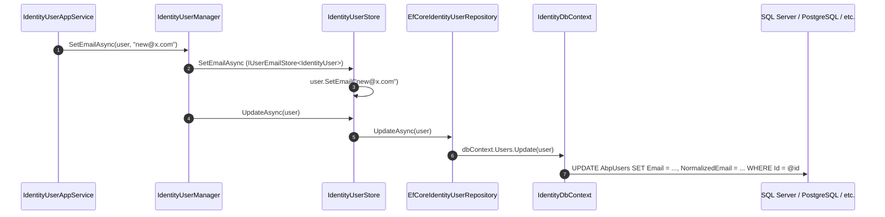

The **ABP Framework** Identity EF Core package wires the Identity domain aggregates onto Entity Framework Core. Every aggregate from `Volo.Abp.Identity.Domain` is mapped to a relational table by a single static method, every repository contract is implemented in this package, and a single `IIdentityDbContext` shape lets host applications subclass `IdentityDbContext` or compose it inside their own context. All code lives under `modules/identity/src/Volo.Abp.Identity.EntityFrameworkCore/`.

## Module wire-up

`AbpIdentityEntityFrameworkCoreModule` (file `modules/identity/src/Volo.Abp.Identity.EntityFrameworkCore/Volo/Abp/Identity/EntityFrameworkCore/AbpIdentityEntityFrameworkCoreModule.cs`):

```csharp
[DependsOn(
    typeof(AbpIdentityDomainModule),
    typeof(AbpUsersEntityFrameworkCoreModule))]
public class AbpIdentityEntityFrameworkCoreModule : AbpModule
{
    public override void ConfigureServices(ServiceConfigurationContext context)
    {
        context.Services.AddAbpDbContext<IdentityDbContext>(options =>
        {
            options.AddRepository<IdentityUser, EfCoreIdentityUserRepository>();
            options.AddRepository<IdentityRole, EfCoreIdentityRoleRepository>();
            options.AddRepository<IdentityClaimType, EfCoreIdentityClaimTypeRepository>();
            options.AddRepository<OrganizationUnit, EfCoreOrganizationUnitRepository>();
            options.AddRepository<IdentitySecurityLog, EfCoreIdentitySecurityLogRepository>();
            options.AddRepository<IdentityLinkUser, EfCoreIdentityLinkUserRepository>();
            options.AddRepository<IdentityUserDelegation, EfCoreIdentityUserDelegationRepository>();
            options.AddRepository<IdentitySession, EfCoreIdentitySessionRepository>();
        });
    }
}
```

`AddAbpDbContext` registers `IdentityDbContext` with the framework's `IDbContextProvider<TDbContext>`, and `AddRepository<TEntity, TRepository>` binds each aggregate to its EF Core repository. Because the eight repository contracts are declared in the Domain module and live under `IIdentityDbContext`, dependents can swap implementations without touching application code.

## The DbContext

`modules/identity/src/Volo.Abp.Identity.EntityFrameworkCore/Volo/Abp/Identity/EntityFrameworkCore/IIdentityDbContext.cs`:

```csharp
[ConnectionStringName(AbpIdentityDbProperties.ConnectionStringName)]
public interface IIdentityDbContext : IEfCoreDbContext
{
    DbSet<IdentityUser>            Users { get; }
    DbSet<IdentityRole>            Roles { get; }
    DbSet<IdentityClaimType>       ClaimTypes { get; }
    DbSet<OrganizationUnit>        OrganizationUnits { get; }
    DbSet<IdentitySecurityLog>     SecurityLogs { get; }
    DbSet<IdentityLinkUser>        LinkUsers { get; }
    DbSet<IdentityUserDelegation>  UserDelegations { get; }
    DbSet<IdentitySession>         Sessions { get; }
}
```

The `[ConnectionStringName("AbpIdentity")]` attribute (`AbpIdentityDbProperties.ConnectionStringName`) routes every read/write to whichever `ConnectionStrings:AbpIdentity` entry the host supplies. The framework's `ConnectionStringResolver` falls back to `ConnectionStrings:Default` when the named string is absent, so monolithic hosts work out of the box.

`IdentityDbContext` (file `IdentityDbContext.cs`) is the canonical implementation:

```csharp
[ConnectionStringName(AbpIdentityDbProperties.ConnectionStringName)]
public class IdentityDbContext : AbpDbContext<IdentityDbContext>, IIdentityDbContext
{
    public DbSet<IdentityUser>           Users { get; set; }
    public DbSet<IdentityRole>           Roles { get; set; }
    public DbSet<IdentityClaimType>      ClaimTypes { get; set; }
    public DbSet<OrganizationUnit>       OrganizationUnits { get; set; }
    public DbSet<IdentitySecurityLog>    SecurityLogs { get; set; }
    public DbSet<IdentityLinkUser>       LinkUsers { get; set; }
    public DbSet<IdentityUserDelegation> UserDelegations { get; set; }
    public DbSet<IdentitySession>        Sessions { get; set; }

    public IdentityDbContext(DbContextOptions<IdentityDbContext> options) : base(options) { }

    protected override void OnModelCreating(ModelBuilder builder)
    {
        base.OnModelCreating(builder);
        builder.ConfigureIdentity();
    }
}
```

A host that wants Identity tables co-located with its own context simply calls `builder.ConfigureIdentity()` from its own `OnModelCreating` — this is the integration point the ABP startup templates use.

## Entity configurations

`IdentityDbContextModelBuilderExtensions.ConfigureIdentity(this ModelBuilder builder)` (file `IdentityDbContextModelBuilderExtensions.cs`) is the single static method that maps every aggregate, child entity, and link table. It calls `ConfigureByConvention()` (which applies ABP base-class mappings for `IMultiTenant`, `ISoftDelete`, `ICreationAuditedObject`, etc.) and `ApplyObjectExtensionMappings()` so any extra property added through the object-extension system materialises as a column.

| Entity                              | Table name (`AbpIdentityDbProperties.DbTablePrefix`-prefixed) | Keys / Indexes                                                                                                                                | Notes                                                                       |
| ----------------------------------- | ------------------------------------------------------------- | --------------------------------------------------------------------------------------------------------------------------------------------- | --------------------------------------------------------------------------- |
| `IdentityUser`                      | `AbpUsers`                                                    | Indexes on `NormalizedUserName`, `NormalizedEmail`, `UserName`, `Email`                                                                       | `ConfigureAbpUser()` applies shared length constraints                       |
| `IdentityUserClaim`                 | `AbpUserClaims`                                               | Id non-generated; index on `UserId`                                                                                                           | `ClaimType` ≤ 256, `ClaimValue` ≤ 1024                                       |
| `IdentityUserRole`                  | `AbpUserRoles`                                                | Composite key `(UserId, RoleId)`; index `(RoleId, UserId)`                                                                                    | FKs to `IdentityRole` and `IdentityUser`                                     |
| `IdentityUserLogin`                 | `AbpUserLogins`                                               | Composite key `(UserId, LoginProvider)`; index `(LoginProvider, ProviderKey)`                                                                 | `LoginProvider` ≤ 64, `ProviderKey` ≤ 196                                    |
| `IdentityUserToken`                 | `AbpUserTokens`                                               | Composite key `(UserId, LoginProvider, Name)`                                                                                                 |                                                                             |
| `IdentityRole`                      | `AbpRoles`                                                    | Index on `NormalizedName`                                                                                                                     | `IsDefault`, `IsStatic`, `IsPublic` columns                                  |
| `IdentityRoleClaim`                 | `AbpRoleClaims`                                               | Id non-generated; index on `RoleId`                                                                                                           |                                                                             |
| `IdentityClaimType`                 | `AbpClaimTypes` (host DB only)                                | `Name` ≤ 256                                                                                                                                  | Mapped only when `builder.IsHostDatabase()` (no tenant rows)                  |
| `IdentityUserPasskey`               | `AbpUserPasskeys`                                              | Primary key `CredentialId` ≤ 1023; `OwnsOne(Data).ToJson()`                                                                                   | WebAuthn passkeys, stored alongside user                                     |
| `OrganizationUnit`                  | `AbpOrganizationUnits`                                        | Index on `Code`; FK self-reference to `ParentId`                                                                                              | `Code` ≤ `OrganizationUnitConsts.MaxCodeLength`                              |
| `OrganizationUnitRole`              | `AbpOrganizationUnitRoles`                                    | Composite key `(OrganizationUnitId, RoleId)`; index `(RoleId, OrganizationUnitId)`                                                            | FK to `IdentityRole`                                                         |
| `IdentityUserOrganizationUnit`      | `AbpUserOrganizationUnits`                                    | Composite key `(OrganizationUnitId, UserId)`; index `(UserId, OrganizationUnitId)`                                                            |                                                                             |
| `IdentityUserPasswordHistory`       | `AbpUserPasswordHistories`                                    | Composite key `(UserId, Password)`                                                                                                            | Used by the periodic password-change setting                                 |
| `IdentitySecurityLog`               | `AbpSecurityLogs`                                             | Indexes `(TenantId, ApplicationName)`, `(TenantId, Identity)`, `(TenantId, Action)`, `(TenantId, UserId)`                                     | Length limits from `IdentitySecurityLogConsts`                               |
| `IdentityLinkUser`                  | `AbpLinkUsers` (host DB only)                                  | Unique index `(SourceUserId, SourceTenantId, TargetUserId, TargetTenantId)`                                                                   | Cross-tenant linking is a host-level concern                                 |
| `IdentityUserDelegation`            | `AbpUserDelegations`                                          |                                                                                                                                               |                                                                             |
| `IdentitySession`                   | `AbpSessions`                                                 | Indexes on `SessionId`, `Device`, `(TenantId, UserId)`                                                                                        | `IdentitySessionConsts` length limits                                        |

Every entity ends with `b.ApplyObjectExtensionMappings();` so additional columns registered through `ObjectExtensionManager.Instance.AddOrUpdateProperty<IdentityUser, string>("Department")` become real columns. The whole method ends with `builder.TryConfigureObjectExtensions<IdentityDbContext>();` so extension entities registered against the context are also materialised.

## Repositories

The eight EF Core repositories sit next to the model builder. Each extends `EfCoreRepository<IIdentityDbContext, TAggregate, TKey>` so it inherits the ABP repository's `InsertAsync`, `UpdateAsync`, `DeleteAsync`, `FindAsync(id)`, and `GetQueryableAsync()` semantics — and implements the contract-specific query methods on top.

### EfCoreIdentityUserRepository

`modules/identity/src/Volo.Abp.Identity.EntityFrameworkCore/Volo/Abp/Identity/EntityFrameworkCore/EfCoreIdentityUserRepository.cs`:

```csharp
public class EfCoreIdentityUserRepository :
    EfCoreRepository<IIdentityDbContext, IdentityUser, Guid>,
    IIdentityUserRepository
{
    public virtual async Task<IdentityUser> FindByNormalizedUserNameAsync(
        string normalizedUserName, bool includeDetails = true, CancellationToken cancellationToken = default)
    {
        return await (await GetDbSetAsync())
            .IncludeDetails(includeDetails)
            .OrderBy(x => x.Id)
            .FirstOrDefaultAsync(u => u.NormalizedUserName == normalizedUserName,
                                 GetCancellationToken(cancellationToken));
    }

    public virtual async Task<List<string>> GetRoleNamesAsync(Guid id, CancellationToken cancellationToken = default)
    {
        var dbContext = await GetDbContextAsync();
        var query = from userRole in dbContext.Set<IdentityUserRole>()
                    join role in dbContext.Roles on userRole.RoleId equals role.Id
                    where userRole.UserId == id
                    select role.Name;

        var organizationUnitIds = dbContext.Set<IdentityUserOrganizationUnit>()
            .Where(q => q.UserId == id)
            .Select(q => q.OrganizationUnitId)
            .ToArray();

        var organizationRoleIds = await (
            from ouRole in dbContext.Set<OrganizationUnitRole>()
            join ou in dbContext.Set<OrganizationUnit>() on ouRole.OrganizationUnitId equals ou.Id
            where organizationUnitIds.Contains(ou.Id)
            select ouRole.RoleId
        ).Distinct().ToArrayAsync(GetCancellationToken(cancellationToken));
        ...
    }
}
```

Notice that `GetRoleNamesAsync` returns the union of *direct* role assignments and *roles assigned through OUs the user belongs to*. This is critical: any permission check that asks "is this user in role X" must see OU-derived roles too, which is why `IdentityUserManager.SetRolesAsync` and the claims-principal factory both go through this repository method.

`IncludeDetails(includeDetails)` is an extension from `modules/identity/src/Volo.Abp.Identity.EntityFrameworkCore/Volo/Abp/Identity/EntityFrameworkCore/IdentityEfCoreQueryableExtensions.cs` that calls `.Include(u => u.Roles).Include(u => u.Claims).Include(u => u.Logins).Include(u => u.Tokens).Include(u => u.OrganizationUnits)...` so a single round-trip loads everything the user store needs.

### EfCoreIdentityRoleRepository

`EfCoreIdentityRoleRepository.cs` mirrors the same pattern. Its `GetListWithUserCountAsync` issues a left-join from `Roles` to `UserRoles` and groups by role to produce `IdentityRoleWithUserCount` projections — used by the Web UI's Roles list to show the number of assigned users without a second query per row.

### EfCoreOrganizationUnitRepository

`EfCoreOrganizationUnitRepository.cs` exposes `GetChildrenAsync(Guid? parentId)`, `GetAllChildrenWithParentCodeAsync(string code, Guid? parentId)`, `GetMembersAsync(OrganizationUnit ou, ...)`, `GetUnaddedMembersAsync(OrganizationUnit ou, ...)`, and `GetRolesAsync(OrganizationUnit ou, ...)`. The hierarchy queries lean on the `Code` column's prefix order so `WHERE Code LIKE '00001.00042.%'` is enough to fetch a subtree.

### The remaining five repositories

| Class                                                                                                                       | Aggregate                  | Specialised queries                                                                                                                  |
| --------------------------------------------------------------------------------------------------------------------------- | -------------------------- | ------------------------------------------------------------------------------------------------------------------------------------ |
| `EfCoreIdentityClaimTypeRepository.cs`                                                                                       | `IdentityClaimType`        | `AnyAsync(string name)` enforcing name uniqueness                                                                                    |
| `EfCoreIdentitySecurityLogRepository.cs`                                                                                     | `IdentitySecurityLog`      | `GetListAsync(startTime, endTime, action, identity, ...)` with paged sorting over the indexed `(TenantId, *)` columns                |
| `EfCoreIdentityLinkUserRepository.cs`                                                                                        | `IdentityLinkUser`         | `FindAsync(IdentityLinkUserInfo source, IdentityLinkUserInfo target)`, `GetListAsync(source, includeIndirect)`                       |
| `EfCoreIdentityUserDelegationRepository.cs`                                                                                  | `IdentityUserDelegation`   | `GetActiveDelegationsAsync(userId, now)`                                                                                             |
| `EfCoreIdentitySessionRepository.cs`                                                                                         | `IdentitySession`          | `FindAsync(sessionId)`, `GetListAsync(filter, device, sorting, ...)`, `DeleteAllAsync(userId, exceptSessionId)`                       |

Each repository is registered through `options.AddRepository<TEntity, TRepository>()` in `AbpIdentityEntityFrameworkCoreModule`, which means the ABP framework also wires the corresponding non-specialised `IRepository<TEntity, TKey>` to the same instance — so generic code that asks for `IRepository<IdentityUser, Guid>` gets the EF Core repository for free.

## How aggregates land in EF tracking



## Migrations

The Identity module does not ship migrations itself — the host project owns the `Migrations/` folder against its own DbContext (which calls `builder.ConfigureIdentity()`). When `IdentityDbContextModelBuilderExtensions.ConfigureIdentity` changes between ABP versions, the host runs `dotnet ef migrations add` to capture the new column or index.

Connection-string resolution always honours `AbpIdentityDbProperties.ConnectionStringName = "AbpIdentity"`. Setting `AbpIdentityDbProperties.DbTablePrefix = "Acme"` from a host's `PreConfigureServices` renames every table from `AbpUsers` → `AcmeUsers`, `AbpRoles` → `AcmeRoles`, etc. — the prefix is read at model-building time.

## Querying outside the manager

Because the aggregates are plain entities, ad-hoc reporting queries can use `IRepository<IdentityUser, Guid>` directly:

```csharp
public class UserMetricsService : ITransientDependency
{
    private readonly IRepository<IdentityUser, Guid> _users;
    public UserMetricsService(IRepository<IdentityUser, Guid> users) => _users = users;

    public async Task<long> CountActiveAsync(Guid? tenantId)
    {
        var q = await _users.GetQueryableAsync();
        return await q.LongCountAsync(u => u.TenantId == tenantId && !u.IsDeleted);
    }
}
```

The default ABP data filters (`ISoftDelete`, `IMultiTenant`) apply automatically because every entity inherits the ABP base classes — the `IsDeleted` predicate above is redundant but explicit.

## Distributed events and EF Core

The Identity Domain module configures `AbpDistributedEntityEventOptions.AutoEventSelectors.Add<IdentityUser>()` and `Add<IdentityRole>()`. EF Core's `SaveChangesAsync` therefore enqueues a `UserEto` or `IdentityRoleEto` on the outbox channel for every committed change. When the host's distributed bus runs an outbox processor (`framework/src/Volo.Abp.EventBus/` `EventOutbox` infrastructure), those ETOs are forwarded across services. The mapping is performed by Mapperly classes in `modules/identity/src/Volo.Abp.Identity.Domain/Volo/Abp/Identity/IdentityDomainMappers.cs`.

## Sample: extending IdentityUser with a custom column

A host that wants a `Department` column on `AbpUsers` does not need a custom DbContext. From its own module:

```csharp
public class MyApplicationModule : AbpModule
{
    public override void PreConfigureServices(ServiceConfigurationContext context)
    {
        ObjectExtensionManager.Instance.Modules()
            .ConfigureIdentity(identity =>
            {
                identity.ConfigureUser(user =>
                {
                    user.AddOrUpdateProperty<string>("Department", property =>
                    {
                        property.Attributes.Add(new RequiredAttribute());
                    });
                });
            });
    }
}
```

Because `IdentityDbContextModelBuilderExtensions.ConfigureIdentity` calls `b.ApplyObjectExtensionMappings()` for every entity and `builder.TryConfigureObjectExtensions<IdentityDbContext>()` at the end, the EF Core model picks up the new column. Run `dotnet ef migrations add AddDepartment` against the host project and the migration generates an `ALTER TABLE AbpUsers ADD Department NVARCHAR(MAX) NOT NULL`.

The same property is then surfaced as an input on the create/edit user modals — both Razor Pages and Blazor — because the `Application.Contracts`, `Web`, and `Blazor` modules call `ApplyEntityConfigurationToApi`, `ApplyEntityConfigurationToUi`, and the equivalent Blazor wiring respectively.

## Schema migrations across ABP versions

When ABP upgrades the Identity model (e.g. adding the `IsExternal` column to `IdentityUser` in v8 or the `Passkeys` collection in v9), the host runs `dotnet ef migrations add UpgradeIdentity` to capture the diff. The generated migration only touches Identity tables because they share `AbpIdentityDbProperties.DbSchema` (default null) — no other module's tables are co-mingled. If the host wants Identity in a dedicated schema (e.g. `[Identity].AbpUsers`), it sets `AbpIdentityDbProperties.DbSchema = "Identity";` from `PreConfigureServices`; the model builder then emits the schema-qualified `ToTable(...)` calls.

## IIdentityDbContext vs IdentityDbContext

Repositories take a generic parameter of `IIdentityDbContext`, not the concrete `IdentityDbContext`. The reason is that a host can register a *different* implementation of `IIdentityDbContext` — for example, a composite DbContext that also owns tenant-management or audit-log tables — and the ABP `EfCoreRepository<IIdentityDbContext, IdentityUser, Guid>` resolves the registered implementation through `IDbContextProvider<IIdentityDbContext>`. The framework's `ReplaceDbContext<IIdentityDbContext, MyDbContext>()` helper is the canonical way to do this:

```csharp
context.Services.AddAbpDbContext<MyDbContext>(options =>
{
    options.ReplaceDbContext<IIdentityDbContext>();
});
```

After this call, every Identity repository uses `MyDbContext` (assuming it implements `IIdentityDbContext`) — without losing the ability of other modules to reach their own `IIdentityDbContext` consumers.

## IdentityEfCoreQueryableExtensions

`modules/identity/src/Volo.Abp.Identity.EntityFrameworkCore/Volo/Abp/Identity/EntityFrameworkCore/IdentityEfCoreQueryableExtensions.cs` ships a single extension method `IncludeDetails(this IQueryable<IdentityUser> q, bool includeDetails)` that, when `includeDetails == true`, calls `.Include(u => u.Roles).Include(u => u.Claims).Include(u => u.Logins).Include(u => u.Tokens).Include(u => u.OrganizationUnits).Include(u => u.PasswordHistories).Include(u => u.Passkeys)`. Every repository method that exposes an `includeDetails` parameter calls this helper, so the caller decides between a single round-trip with all collections eagerly loaded and a slimmer query that returns only the root entity.

## Repository contracts ↔ EF Core classes summary

| Contract from Domain                       | Implementation                                                                                                                                                                       |
| ------------------------------------------ | ------------------------------------------------------------------------------------------------------------------------------------------------------------------------------------ |
| `IIdentityUserRepository`                  | `modules/identity/src/Volo.Abp.Identity.EntityFrameworkCore/Volo/Abp/Identity/EntityFrameworkCore/EfCoreIdentityUserRepository.cs`                                                    |
| `IIdentityRoleRepository`                  | `EfCoreIdentityRoleRepository.cs`                                                                                                                                                    |
| `IIdentityClaimTypeRepository`             | `EfCoreIdentityClaimTypeRepository.cs`                                                                                                                                               |
| `IOrganizationUnitRepository`              | `EfCoreOrganizationUnitRepository.cs`                                                                                                                                                |
| `IIdentitySecurityLogRepository`           | `EfCoreIdentitySecurityLogRepository.cs`                                                                                                                                             |
| `IIdentityLinkUserRepository`              | `EfCoreIdentityLinkUserRepository.cs`                                                                                                                                                |
| `IIdentityUserDelegationRepository`        | `EfCoreIdentityUserDelegationRepository.cs`                                                                                                                                          |
| `IIdentitySessionRepository`               | `EfCoreIdentitySessionRepository.cs`                                                                                                                                                 |

## Performance notes

The default `EfCoreIdentityUserRepository.FindByNormalizedUserNameAsync` call uses `OrderBy(x => x.Id).FirstOrDefaultAsync(...)`. The explicit `OrderBy` is intentional: it makes the generated SQL deterministic across providers (otherwise SQL Server, PostgreSQL, and Oracle would pick implementation-defined orders), which matters when an integration test asserts a specific row. The index on `NormalizedUserName` (declared by `IdentityDbContextModelBuilderExtensions.ConfigureIdentity`) means the optimiser can resolve the predicate without scanning, so the `OrderBy` is essentially free.

## Where to go next

The Mongo counterpart of every repository here is documented in [MongoDB](/module-identity/mongodb). The application services that ultimately call these repositories live in [Application](/module-identity/application). The cross-cutting users sub-package whose `ConfigureAbpUser` extension is invoked by every `IdentityUser` configuration is documented under [Users sub-package](/module-identity/users-subpackage).
