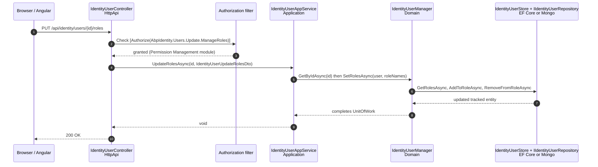
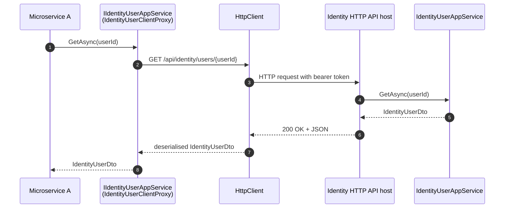

The **ABP Framework** Identity HTTP API turns the application services from `Volo.Abp.Identity.Application` into MVC controllers under `/api/identity/*`. The controllers live in `modules/identity/src/Volo.Abp.Identity.HttpApi/Volo/Abp/Identity/`; the same assembly is consumed by the client-side package `Volo.Abp.Identity.HttpApi.Client` to expose statically-typed proxies (`IdentityUserClientProxy`, `IdentityRoleClientProxy`, …) that any C# caller can resolve from DI and use as if they were the original application services.

## Module wire-up

`AbpIdentityHttpApiModule` (file `modules/identity/src/Volo.Abp.Identity.HttpApi/Volo/Abp/Identity/AbpIdentityHttpApiModule.cs`) depends on `AbpIdentityApplicationContractsModule` and `AbpAspNetCoreMvcModule`. It registers the controllers' assembly with the MVC application-part loader and adds `IdentityResource` as a base type of `AbpUiResource` so error messages localised in either resource resolve uniformly.

```csharp
[DependsOn(typeof(AbpIdentityApplicationContractsModule), typeof(AbpAspNetCoreMvcModule))]
public class AbpIdentityHttpApiModule : AbpModule
{
    public override void PreConfigureServices(ServiceConfigurationContext context)
    {
        PreConfigure<IMvcBuilder>(mvcBuilder =>
        {
            mvcBuilder.AddApplicationPartIfNotExists(typeof(AbpIdentityHttpApiModule).Assembly);
        });
    }

    public override void ConfigureServices(ServiceConfigurationContext context)
    {
        Configure<AbpLocalizationOptions>(options =>
        {
            options.Resources
                .Get<IdentityResource>()
                .AddBaseTypes(typeof(AbpUiResource));
        });
    }
}
```

## Controllers

Four controllers ship with the module. Each one inherits `AbpControllerBase`, is decorated with `[RemoteService(Name = "AbpIdentity")]` and `[Area("identity")]`, and implements the application-service interface directly so the routes match the contract one-for-one.

### IdentityUserController

`modules/identity/src/Volo.Abp.Identity.HttpApi/Volo/Abp/Identity/IdentityUserController.cs`:

```csharp
[RemoteService(Name = IdentityRemoteServiceConsts.RemoteServiceName)]
[Area(IdentityRemoteServiceConsts.ModuleName)]
[ControllerName("User")]
[Route("api/identity/users")]
public class IdentityUserController : AbpControllerBase, IIdentityUserAppService
{
    protected IIdentityUserAppService UserAppService { get; }

    public IdentityUserController(IIdentityUserAppService userAppService)
    {
        UserAppService = userAppService;
    }

    [HttpGet, Route("{id}")]
    public virtual Task<IdentityUserDto> GetAsync(Guid id)
        => UserAppService.GetAsync(id);

    [HttpGet]
    public virtual Task<PagedResultDto<IdentityUserDto>> GetListAsync(GetIdentityUsersInput input)
        => UserAppService.GetListAsync(input);

    [HttpPost]
    public virtual Task<IdentityUserDto> CreateAsync(IdentityUserCreateDto input)
        => UserAppService.CreateAsync(input);

    [HttpPut, Route("{id}")]
    public virtual Task<IdentityUserDto> UpdateAsync(Guid id, IdentityUserUpdateDto input)
        => UserAppService.UpdateAsync(id, input);

    [HttpDelete, Route("{id}")]
    public virtual Task DeleteAsync(Guid id)
        => UserAppService.DeleteAsync(id);

    [HttpGet, Route("{id}/roles")]
    public virtual Task<ListResultDto<IdentityRoleDto>> GetRolesAsync(Guid id)
        => UserAppService.GetRolesAsync(id);

    [HttpGet, Route("assignable-roles")]
    public Task<ListResultDto<IdentityRoleDto>> GetAssignableRolesAsync()
        => UserAppService.GetAssignableRolesAsync();

    [HttpPut, Route("{id}/roles")]
    public virtual Task UpdateRolesAsync(Guid id, IdentityUserUpdateRolesDto input)
        => UserAppService.UpdateRolesAsync(id, input);

    [HttpGet, Route("by-username/{userName}")]
    public virtual Task<IdentityUserDto> FindByUsernameAsync(string userName)
        => UserAppService.FindByUsernameAsync(userName);

    [HttpGet, Route("by-email/{email}")]
    public virtual Task<IdentityUserDto> FindByEmailAsync(string email)
        => UserAppService.FindByEmailAsync(email);
}
```

The controller is a thin pass-through: there is no business logic. Permission checks fire on the underlying `IdentityUserAppService` because of `[Authorize(IdentityPermissions.Users.Default)]` etc. on each method. Concurrent updates are protected by `IdentityUserDto.ConcurrencyStamp` round-tripped through the create/update DTOs.

### IdentityRoleController

`modules/identity/src/Volo.Abp.Identity.HttpApi/Volo/Abp/Identity/IdentityRoleController.cs` follows the same pattern at `[Route("api/identity/roles")]` with `[ControllerName("Role")]`. Operations: `GetAllListAsync` at `GET /all`, `GetListAsync` at `GET /`, `GetAsync` at `GET /{id}`, `CreateAsync` at `POST /`, `UpdateAsync` at `PUT /{id}`, `DeleteAsync` at `DELETE /{id}`.

### IdentityUserLookupController

`modules/identity/src/Volo.Abp.Identity.HttpApi/Volo/Abp/Identity/IdentityUserLookupController.cs`:

```csharp
[Route("api/identity/users/lookup")]
public class IdentityUserLookupController : AbpControllerBase, IIdentityUserLookupAppService
{
    [HttpGet, Route("{id}")]
    public virtual Task<UserData> FindByIdAsync(Guid id) { ... }

    [HttpGet, Route("by-username/{userName}")]
    public virtual Task<UserData> FindByUserNameAsync(string userName) { ... }

    [HttpGet, Route("search")]
    public Task<ListResultDto<UserData>> SearchAsync(UserLookupSearchInputDto input) { ... }

    [HttpGet, Route("count")]
    public Task<long> GetCountAsync(UserLookupCountInputDto input) { ... }
}
```

### IdentityUserIntegrationController

`modules/identity/src/Volo.Abp.Identity.HttpApi/Volo/Abp/Identity/Integration/IdentityUserIntegrationController.cs` exposes the integration-service surface at `/api/identity/integration/users`. It implements `IIdentityUserIntegrationService`, so the same four operations (`FindByIdAsync`, `FindByUserNameAsync`, `SearchAsync`, `GetCountAsync`) are available under both the legacy `/users/lookup` and modern `/integration/users` routes — new code is expected to use the integration prefix.

## Full route table

The complete public surface emitted by `AbpIdentityHttpApiModule`:

| Method | Route                                                  | Controller / Action                                    | Permission                          |
| ------ | ------------------------------------------------------ | ------------------------------------------------------ | ----------------------------------- |
| GET    | `/api/identity/users`                                  | `IdentityUserController.GetListAsync`                  | `AbpIdentity.Users`                 |
| GET    | `/api/identity/users/{id}`                             | `IdentityUserController.GetAsync`                      | `AbpIdentity.Users`                 |
| POST   | `/api/identity/users`                                  | `IdentityUserController.CreateAsync`                   | `AbpIdentity.Users.Create`          |
| PUT    | `/api/identity/users/{id}`                             | `IdentityUserController.UpdateAsync`                   | `AbpIdentity.Users.Update`          |
| DELETE | `/api/identity/users/{id}`                             | `IdentityUserController.DeleteAsync`                   | `AbpIdentity.Users.Delete`          |
| GET    | `/api/identity/users/{id}/roles`                       | `IdentityUserController.GetRolesAsync`                 | `AbpIdentity.Users`                 |
| GET    | `/api/identity/users/assignable-roles`                 | `IdentityUserController.GetAssignableRolesAsync`       | `AbpIdentity.Users`                 |
| PUT    | `/api/identity/users/{id}/roles`                       | `IdentityUserController.UpdateRolesAsync`              | `AbpIdentity.Users.Update.ManageRoles` |
| GET    | `/api/identity/users/by-username/{userName}`           | `IdentityUserController.FindByUsernameAsync`           | `AbpIdentity.Users`                 |
| GET    | `/api/identity/users/by-email/{email}`                 | `IdentityUserController.FindByEmailAsync`              | `AbpIdentity.Users`                 |
| GET    | `/api/identity/roles/all`                              | `IdentityRoleController.GetAllListAsync`               | `AbpIdentity.Roles`                 |
| GET    | `/api/identity/roles`                                  | `IdentityRoleController.GetListAsync`                  | `AbpIdentity.Roles`                 |
| GET    | `/api/identity/roles/{id}`                             | `IdentityRoleController.GetAsync`                      | `AbpIdentity.Roles`                 |
| POST   | `/api/identity/roles`                                  | `IdentityRoleController.CreateAsync`                   | `AbpIdentity.Roles.Create`          |
| PUT    | `/api/identity/roles/{id}`                             | `IdentityRoleController.UpdateAsync`                   | `AbpIdentity.Roles.Update`          |
| DELETE | `/api/identity/roles/{id}`                             | `IdentityRoleController.DeleteAsync`                   | `AbpIdentity.Roles.Delete`          |
| GET    | `/api/identity/users/lookup/{id}`                      | `IdentityUserLookupController.FindByIdAsync`           | `AbpIdentity.UserLookup` (client)   |
| GET    | `/api/identity/users/lookup/by-username/{userName}`    | `IdentityUserLookupController.FindByUserNameAsync`     | `AbpIdentity.UserLookup` (client)   |
| GET    | `/api/identity/users/lookup/search`                    | `IdentityUserLookupController.SearchAsync`             | `AbpIdentity.UserLookup` (client)   |
| GET    | `/api/identity/users/lookup/count`                     | `IdentityUserLookupController.GetCountAsync`           | `AbpIdentity.UserLookup` (client)   |
| GET    | `/api/identity/integration/users/{id}`                 | `IdentityUserIntegrationController.FindByIdAsync`      | service-to-service                  |
| GET    | `/api/identity/integration/users/by-username/{userName}` | `IdentityUserIntegrationController.FindByUserNameAsync` | service-to-service                  |
| GET    | `/api/identity/integration/users/search`               | `IdentityUserIntegrationController.SearchAsync`        | service-to-service                  |
| GET    | `/api/identity/integration/users/count`                | `IdentityUserIntegrationController.GetCountAsync`      | service-to-service                  |

ABP versions every API route automatically via `Asp.Versioning`. The default version mapping comes from `Volo.Abp.AspNetCore.Mvc` — every controller is tagged with the default API version unless the host overrides `AbpAspNetCoreMvcOptions`.

## Static HTTP client proxies

`AbpIdentityHttpApiClientModule` (file `modules/identity/src/Volo.Abp.Identity.HttpApi.Client/Volo/Abp/Identity/AbpIdentityHttpApiClientModule.cs`):

```csharp
[DependsOn(
    typeof(AbpIdentityApplicationContractsModule),
    typeof(AbpHttpClientModule))]
public class AbpIdentityHttpApiClientModule : AbpModule
{
    public override void ConfigureServices(ServiceConfigurationContext context)
    {
        context.Services.AddStaticHttpClientProxies(
            typeof(AbpIdentityApplicationContractsModule).Assembly,
            IdentityRemoteServiceConsts.RemoteServiceName
        );

        Configure<AbpVirtualFileSystemOptions>(options =>
        {
            options.FileSets.AddEmbedded<AbpIdentityHttpApiClientModule>();
        });
    }
}
```

The `AddStaticHttpClientProxies` call scans the contracts assembly for every interface (`IIdentityUserAppService`, `IIdentityRoleAppService`, `IIdentityUserLookupAppService`, `IIdentityUserIntegrationService`) and binds each to a pre-generated proxy. The generated implementations sit alongside the hand-written stubs:

| Generated proxy                                                                                                                                                                                  | Hand-written companion                                                                                                                                                            |
| ------------------------------------------------------------------------------------------------------------------------------------------------------------------------------------------------ | --------------------------------------------------------------------------------------------------------------------------------------------------------------------------------- |
| `ClientProxies/Volo/Abp/Identity/IdentityUserClientProxy.Generated.cs`                                                                                                                            | `ClientProxies/Volo/Abp/Identity/IdentityUserClientProxy.cs`                                                                                                                      |
| `ClientProxies/Volo/Abp/Identity/IdentityRoleClientProxy.Generated.cs`                                                                                                                            | `ClientProxies/Volo/Abp/Identity/IdentityRoleClientProxy.cs`                                                                                                                      |
| `ClientProxies/Volo/Abp/Identity/IdentityUserLookupClientProxy.Generated.cs`                                                                                                                      | `ClientProxies/Volo/Abp/Identity/IdentityUserLookupClientProxy.cs`                                                                                                                |
| `ClientProxies/Volo/Abp/Identity/Integration/IdentityUserIntegrationClientProxy.Generated.cs`                                                                                                     | `ClientProxies/Volo/Abp/Identity/Integration/IdentityUserIntegrationClientProxy.cs`                                                                                               |

The `.Generated.cs` files are produced by the ABP CLI (`abp generate-proxy -t csharp`) by walking the controllers' `[Route]`/`[HttpGet]` metadata, so they always match the controllers above exactly. A consumer in another microservice depends on `AbpIdentityHttpApiClientModule`, calls `IIdentityUserAppService` from constructor injection, and the call lands as an `HttpClient.SendAsync` to `/api/identity/users/...`.

The same package also registers `HttpClientExternalUserLookupServiceProvider` (file `modules/identity/src/Volo.Abp.Identity.HttpApi.Client/Volo/Abp/Identity/HttpClientExternalUserLookupServiceProvider.cs`) — a class that implements `IExternalUserLookupServiceProvider` by delegating to `IIdentityUserIntegrationService`. When a service depends on `AbpIdentityHttpApiClientModule` *without* depending on the identity domain assembly, this provider becomes the de-facto external lookup so that local `IUserLookupService<TUser>` queries fall back over HTTP to the identity owner service. `HttpClientUserRoleFinder` (file `HttpClientUserRoleFinder.cs`) plays the equivalent role for role lookups.

## End-to-end request flow



## Cross-module composition



## Object extension on the API surface

`AbpIdentityApplicationContractsModule.PostConfigureServices` calls `ModuleExtensionConfigurationHelper.ApplyEntityConfigurationToApi` so the JSON shape of `IdentityUserDto`/`IdentityRoleDto` automatically carries any object-extension properties registered against `User` / `Role`. The controllers do not need any change because the DTOs derive from `ExtensibleFullAuditedEntityDto<Guid>` / `ExtensibleEntityDto<Guid>` — the framework serialises the `ExtraProperties` dictionary into the JSON envelope alongside the strongly-typed fields.

## Response shapes and conventions

Every controller returns either a single DTO (`IdentityUserDto`, `IdentityRoleDto`, `UserData`), a `ListResultDto<T>`, a `PagedResultDto<T>`, or `void` (HTTP 204 for delete). The framework's MVC infrastructure honours the `Accept` header — by default JSON is returned, but a host can plug `Volo.Abp.AspNetCore.Mvc.NewtonsoftJson` to switch serializers.

Concurrency on user updates uses `IdentityUserDto.ConcurrencyStamp` round-tripped through `IdentityUserUpdateDto`. The application service reads the stamp, calls `UserManager.UpdateAsync(user)`, and `IdentityUserStore` re-reads `user.ConcurrencyStamp` before issuing the SQL `UPDATE … WHERE ConcurrencyStamp = @stamp` (or its Mongo equivalent). If the row was modified by another thread, the update affects 0 rows and `AbpDbConcurrencyException` bubbles up; the framework's `AbpExceptionFilter` translates it into a 409 Conflict response.

## Localisation

Every controller calls error-keyed messages through `IdentityResource` from `modules/identity/src/Volo.Abp.Identity.Domain.Shared/Volo/Abp/Identity/Localization/IdentityResource.cs`. The HTTP API module pulls `Localization.Resources.AbpUi.AbpUiResource` in as a base so generic UI keys resolve transparently. Localised error messages travel through the framework's exception-filter pipeline and are baked into the JSON error envelope.

## Versioning

Every controller is decorated with `[RemoteService(Name = "AbpIdentity")]` and `[Area("identity")]`. The combination lets `Asp.Versioning.Mvc` assign default versions and lets external API documentation generators (`abp generate-proxy -t openapi`) emit separate route prefixes for each version of the Identity service. A host that wants to pin a specific version overrides `AbpAspNetCoreMvcOptions.ConventionalControllers.Create(...)` from its own module.

## How the controllers compose with Account, OpenIddict, and Tenant Management

In a typical ABP application module, `AbpIdentityHttpApiModule` is paired with `AbpAccountHttpApiModule` and `AbpOpenIddictAspNetCoreModule`. The three together expose the user surface (`/api/identity/*` here), the profile and account surface (`/api/account/*` from the Account module), and the OAuth/OIDC endpoints (`/connect/*` from OpenIddict). Because all three controllers honour `[RemoteService(Name = "AbpIdentity")]` or their own equivalent, the dynamic JS proxy generator and the static C# client-proxy generator both partition the routes by remote-service name.

`AbpTenantManagementHttpApiModule` adds `/api/multi-tenancy/tenants` for the tenant CRUD, again separated by remote-service name. None of these modules collide because of the strict module/area separation enforced by `IdentityRemoteServiceConsts.ModuleName = "identity"` and the `[Area(...)]` attributes on every controller.

## Bundling between HttpApi and HttpApi.Client

The Identity module ships the HttpApi and HttpApi.Client packages as a matched pair: the controllers are decorated with `[Route("api/identity/...")]`, the `*.Generated.cs` proxies under `modules/identity/src/Volo.Abp.Identity.HttpApi.Client/ClientProxies/Volo/Abp/Identity/` post to the same paths, and both reference the contracts assembly so the DTO shapes are identical. When ABP releases a new version, both packages are regenerated together so the proxy and controller stay in lock-step.

## Disabling the dynamic JS proxy in MVC hosts

When the host installs the `Volo.Abp.Identity.Web` module on top of this one, the Web module calls `Configure<DynamicJavaScriptProxyOptions>(o => o.DisableModule(IdentityRemoteServiceConsts.ModuleName))`. The reason is that the Web package ships hand-tuned static jQuery proxies under `wwwroot/client-proxies/`, so the dynamic generator at `/Abp/ServiceProxyScript?modules=identity` would only add weight. Pure API hosts (no Web module) leave the dynamic generator enabled so non-Razor consumers can still discover the surface.

## Controller inheritance from the application service interface

A subtle but powerful pattern is that every controller `: AbpControllerBase, IIdentityUserAppService` (and the equivalents for Role / Lookup / Integration). Implementing the application-service interface forces the controller signature to match the contract one-to-one — `Task<IdentityUserDto> GetAsync(Guid id)` on both sides — so the static client proxies, the OpenAPI definitions, and the in-process callers all see the same shape. If a future ABP release adds a method to `IIdentityUserAppService`, the controller fails to compile until it's exposed, which keeps the HTTP surface and the application surface in sync.

## Where to go next

For the underlying application service used by every route on this page, see [Application services](/module-identity/application). For the persistence backing the operations, see [EF Core](/module-identity/efcore) and [MongoDB](/module-identity/mongodb).
