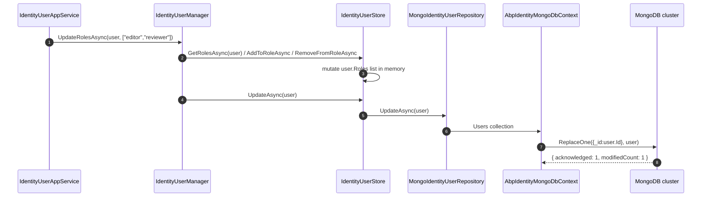

The **ABP Framework** Identity MongoDB package is the document-database counterpart of the EF Core package. It exposes the same eight aggregate roots through `IMongoCollection<T>` properties on `IAbpIdentityMongoDbContext`, implements every repository contract in `Volo.Abp.Identity.Domain` against the MongoDB driver, and binds them into the ABP repository system through `AbpIdentityMongoDbModule`. All code lives under `modules/identity/src/Volo.Abp.Identity.MongoDB/`.

## Module wire-up

`AbpIdentityMongoDbModule` (file `modules/identity/src/Volo.Abp.Identity.MongoDB/Volo/Abp/Identity/MongoDB/AbpIdentityMongoDbModule.cs`):

```csharp
[DependsOn(
    typeof(AbpIdentityDomainModule),
    typeof(AbpUsersMongoDbModule)
    )]
public class AbpIdentityMongoDbModule : AbpModule
{
    public override void ConfigureServices(ServiceConfigurationContext context)
    {
        context.Services.AddMongoDbContext<AbpIdentityMongoDbContext>(options =>
        {
            options.AddRepository<IdentityUser, MongoIdentityUserRepository>();
            options.AddRepository<IdentityRole, MongoIdentityRoleRepository>();
            options.AddRepository<IdentityClaimType, MongoIdentityClaimTypeRepository>();
            options.AddRepository<OrganizationUnit, MongoOrganizationUnitRepository>();
            options.AddRepository<IdentitySecurityLog, MongoIdentitySecurityLogRepository>();
            options.AddRepository<IdentityLinkUser, MongoIdentityLinkUserRepository>();
            options.AddRepository<IdentityUserDelegation, MongoIdentityUserDelegationRepository>();
            options.AddRepository<IdentitySession, MongoIdentitySessionRepository>();
        });
    }
}
```

`AddMongoDbContext` is the ABP equivalent of `AddAbpDbContext`: it registers `AbpIdentityMongoDbContext` with `IMongoDbContextProvider<AbpIdentityMongoDbContext>` and lets `AddRepository` bind each aggregate to its `MongoDbRepository<TDbContext, TEntity, TKey>` subclass.

## The Mongo context

`modules/identity/src/Volo.Abp.Identity.MongoDB/Volo/Abp/Identity/MongoDB/IAbpIdentityMongoDbContext.cs`:

```csharp
[ConnectionStringName(AbpIdentityDbProperties.ConnectionStringName)]
public interface IAbpIdentityMongoDbContext : IAbpMongoDbContext
{
    IMongoCollection<IdentityUser>            Users { get; }
    IMongoCollection<IdentityRole>            Roles { get; }
    IMongoCollection<IdentityClaimType>       ClaimTypes { get; }
    IMongoCollection<OrganizationUnit>        OrganizationUnits { get; }
    IMongoCollection<IdentitySecurityLog>     SecurityLogs { get; }
    IMongoCollection<IdentityLinkUser>        LinkUsers { get; }
    IMongoCollection<IdentityUserDelegation>  UserDelegations { get; }
    IMongoCollection<IdentitySession>         Sessions { get; }
}
```

`AbpIdentityMongoDbContext` (file `AbpIdentityMongoDbContext.cs`) is the implementation. Each `IMongoCollection<T>` is materialised lazily through the `Collection<T>()` helper from `AbpMongoDbContext`:

```csharp
[ConnectionStringName(AbpIdentityDbProperties.ConnectionStringName)]
public class AbpIdentityMongoDbContext : AbpMongoDbContext, IAbpIdentityMongoDbContext
{
    public IMongoCollection<IdentityUser>           Users             => Collection<IdentityUser>();
    public IMongoCollection<IdentityRole>           Roles             => Collection<IdentityRole>();
    public IMongoCollection<IdentityClaimType>      ClaimTypes        => Collection<IdentityClaimType>();
    public IMongoCollection<OrganizationUnit>       OrganizationUnits => Collection<OrganizationUnit>();
    public IMongoCollection<IdentitySecurityLog>    SecurityLogs      => Collection<IdentitySecurityLog>();
    public IMongoCollection<IdentityLinkUser>       LinkUsers         => Collection<IdentityLinkUser>();
    public IMongoCollection<IdentityUserDelegation> UserDelegations   => Collection<IdentityUserDelegation>();
    public IMongoCollection<IdentitySession>        Sessions          => Collection<IdentitySession>();

    protected override void CreateModel(IMongoModelBuilder modelBuilder)
    {
        base.CreateModel(modelBuilder);
        modelBuilder.ConfigureIdentity();
    }
}
```

The same `[ConnectionStringName("AbpIdentity")]` attribute means hosts can route Identity reads/writes to a dedicated MongoDB connection via the `ConnectionStrings:AbpIdentity` configuration key.

## Collection mappings

`AbpIdentityMongoDbContextExtensions.ConfigureIdentity(this IMongoModelBuilder builder)` (file `AbpIdentityMongoDbContextExtensions.cs`) names each collection:

```csharp
public static void ConfigureIdentity(this IMongoModelBuilder builder)
{
    builder.Entity<IdentityUser>(b           => b.CollectionName = AbpIdentityDbProperties.DbTablePrefix + "Users");
    builder.Entity<IdentityRole>(b           => b.CollectionName = AbpIdentityDbProperties.DbTablePrefix + "Roles");
    builder.Entity<IdentityClaimType>(b      => b.CollectionName = AbpIdentityDbProperties.DbTablePrefix + "ClaimTypes");
    builder.Entity<OrganizationUnit>(b       => b.CollectionName = AbpIdentityDbProperties.DbTablePrefix + "OrganizationUnits");
    builder.Entity<IdentitySecurityLog>(b    => b.CollectionName = AbpIdentityDbProperties.DbTablePrefix + "SecurityLogs");
    builder.Entity<IdentityLinkUser>(b       => b.CollectionName = AbpIdentityDbProperties.DbTablePrefix + "LinkUsers");
    builder.Entity<IdentityUserDelegation>(b => b.CollectionName = AbpIdentityDbProperties.DbTablePrefix + "UserDelegations");
    builder.Entity<IdentitySession>(b        => b.CollectionName = AbpIdentityDbProperties.DbTablePrefix + "Sessions");
}
```

Unlike EF Core there are no foreign-key declarations or composite-key configurations — MongoDB stores each aggregate as a single document with its children embedded inline.

| Collection name (`AbpIdentityDbProperties.DbTablePrefix`-prefixed) | Aggregate                    | Embedded sub-documents                                                                                                                |
| ------------------------------------------------------------------ | ---------------------------- | ------------------------------------------------------------------------------------------------------------------------------------- |
| `AbpUsers`                                                         | `IdentityUser`               | `Roles[]`, `Claims[]`, `Logins[]`, `Tokens[]`, `OrganizationUnits[]`, `PasswordHistories[]`, `Passkeys[]`                              |
| `AbpRoles`                                                         | `IdentityRole`               | `Claims[]`                                                                                                                            |
| `AbpClaimTypes`                                                    | `IdentityClaimType`          | none                                                                                                                                  |
| `AbpOrganizationUnits`                                             | `OrganizationUnit`           | `Roles[]` (OU↔Role links)                                                                                                              |
| `AbpSecurityLogs`                                                  | `IdentitySecurityLog`        | none                                                                                                                                  |
| `AbpLinkUsers`                                                     | `IdentityLinkUser`           | none                                                                                                                                  |
| `AbpUserDelegations`                                               | `IdentityUserDelegation`     | none                                                                                                                                  |
| `AbpSessions`                                                      | `IdentitySession`            | none                                                                                                                                  |

Because child collections are embedded inside the `IdentityUser` document, a single `Find` returns the entire aggregate without any join — the trade-off is the well-known 16 MB BSON document limit. A user with millions of claims would not fit; in practice the limit is reached only after pathological misuse.

## Repository implementations

The eight repositories all extend `MongoDbRepository<IAbpIdentityMongoDbContext, TAggregate, TKey>` and implement the same contracts as their EF Core counterparts. The signatures are identical so application services compile against either backend without change.

### MongoIdentityUserRepository

`modules/identity/src/Volo.Abp.Identity.MongoDB/Volo/Abp/Identity/MongoDB/MongoIdentityUserRepository.cs`:

```csharp
public class MongoIdentityUserRepository :
    MongoDbRepository<IAbpIdentityMongoDbContext, IdentityUser, Guid>,
    IIdentityUserRepository
{
    public virtual async Task<IdentityUser> FindByNormalizedUserNameAsync(
        string normalizedUserName, bool includeDetails = true, CancellationToken cancellationToken = default)
    {
        return await (await GetQueryableAsync(cancellationToken))
            .OrderBy(x => x.Id)
            .FirstOrDefaultAsync(
                u => u.NormalizedUserName == normalizedUserName,
                GetCancellationToken(cancellationToken)
            );
    }

    public virtual async Task<List<string>> GetRoleNamesAsync(Guid id, CancellationToken cancellationToken = default)
    { ... }
}
```

`GetRoleNamesAsync` issues three queries: load the user document, fetch the direct role names by `RoleId` from the `Roles` collection, then fetch the OU-driven roles by joining `OrganizationUnits` against `OrganizationUnitRole.RoleId` and looking those up too. The composition is exactly the same as in the EF Core repository, just expressed in `IMongoQueryable<T>` terms.

### MongoIdentityRoleRepository

`MongoIdentityRoleRepository.cs` ships `FindByNormalizedNameAsync`, `GetListAsync(sorting, maxResultCount, skipCount, filter, includeDetails)`, and `GetCountAsync(filter)`. The role-with-user-count projection uses a two-step pipeline: paginate the role collection, then for each role aggregate the `Roles[]` array length across the user collection.

### MongoOrganizationUnitRepository

`MongoOrganizationUnitRepository.cs` exposes `GetChildrenAsync(parentId, includeDetails)`, `GetAllChildrenWithParentCodeAsync(code, parentId)`, `GetMembersAsync(ou, sorting, maxResultCount, skipCount, filter)`, `GetUnaddedMembersAsync(...)`, and `GetRolesAsync(ou, ...)`. The hierarchy queries rely on the `Code` field's deterministic prefix order to scan a subtree with a single `BsonRegularExpression` filter such as `^00001\.00042\..*`.

### The remaining five Mongo repositories

| Class                                                                                                                                                    | Aggregate                  | Notable queries                                                                                                              |
| -------------------------------------------------------------------------------------------------------------------------------------------------------- | -------------------------- | ---------------------------------------------------------------------------------------------------------------------------- |
| `MongoIdentityClaimTypeRepository.cs`                                                                                                                    | `IdentityClaimType`        | `AnyAsync(string name)`                                                                                                       |
| `MongoIdentitySecurityLogRepository.cs`                                                                                                                  | `IdentitySecurityLog`      | `GetListAsync(startTime, endTime, action, identity, ...)` with paged `Sort + Skip + Limit`                                    |
| `MongoIdentityLinkUserRepository.cs`                                                                                                                     | `IdentityLinkUser`         | `FindAsync(IdentityLinkUserInfo source, IdentityLinkUserInfo target)`                                                         |
| `MongoIdentityUserDelegationRepository.cs`                                                                                                                | `IdentityUserDelegation`   | `GetActiveDelegationsAsync(userId, now)`                                                                                      |
| `MongoIdentitySessionRepository.cs`                                                                                                                      | `IdentitySession`          | `FindAsync(sessionId)`, `GetListAsync(filter, device, sorting, ...)`, `DeleteAllAsync(userId, exceptSessionId)`                |

Every Mongo repository is registered through `options.AddRepository<TEntity, TRepository>()` in the module class, just like the EF Core flavour. Consumers asking for `IRepository<IdentityUser, Guid>` or `IIdentityUserRepository` resolve to the same Mongo instance.

## Composing Mongo Identity with a host-owned context

A host that already owns its own `AbpMongoDbContext` can subclass `AbpIdentityMongoDbContext` and add its own collections, or wire two contexts side by side. When two contexts share a database, the framework's `IMongoDbContextProvider` ensures both go through the same `IMongoClient` so transactions and read concerns line up.

```csharp
public class AcmeMongoDbContext : AbpIdentityMongoDbContext
{
    public IMongoCollection<Product> Products => Collection<Product>();

    protected override void CreateModel(IMongoModelBuilder modelBuilder)
    {
        base.CreateModel(modelBuilder); // calls ConfigureIdentity()
        modelBuilder.Entity<Product>(b => b.CollectionName = "Products");
    }
}
```

## Connection string and collection prefix

`AbpIdentityDbProperties.ConnectionStringName = "AbpIdentity"` is honoured by `IAbpIdentityMongoDbContext`. `AbpIdentityDbProperties.DbTablePrefix` rewrites the collection names emitted by `ConfigureIdentity`; setting it to `"Acme"` from `PreConfigureServices` produces `AcmeUsers`, `AcmeRoles`, `AcmeOrganizationUnits`, etc. The change must happen before `AbpIdentityMongoDbModule.ConfigureServices` runs because collection names are bound at model-build time.

## Aggregate update flow

Because MongoDB stores each `IdentityUser` document with its child collections embedded, the manager → store → repository pipeline becomes one document read and one document write:



A single ReplaceOne update is enough because the user's `Roles` array is part of the same document. The EF Core variant would issue separate `INSERT INTO AbpUserRoles` / `DELETE FROM AbpUserRoles` statements for each link.

## Querying outside the manager

Just like the EF Core flavour, ad-hoc queries can use `IRepository<IdentityUser, Guid>` directly:

```csharp
public class UserMetricsService : ITransientDependency
{
    private readonly IRepository<IdentityUser, Guid> _users;
    public UserMetricsService(IRepository<IdentityUser, Guid> users) => _users = users;

    public async Task<long> CountWithLockoutAsync()
    {
        var q = await _users.GetQueryableAsync();
        return await q.LongCountAsync(u => u.AccessFailedCount > 0);
    }
}
```

## Indexes

Unlike EF Core, where `HasIndex` declarations in `IdentityDbContextModelBuilderExtensions` materialise as `CREATE INDEX` statements automatically, MongoDB indexes are not declared by `ConfigureIdentity`. ABP hosts that need indexes typically run them imperatively at startup, for instance against the `AbpUsers` collection:

```csharp
public class MyHostModule : AbpModule
{
    public override async Task OnApplicationInitializationAsync(ApplicationInitializationContext context)
    {
        var ctx = context.ServiceProvider.GetRequiredService<IAbpIdentityMongoDbContext>();
        await ctx.Users.Indexes.CreateManyAsync(new[]
        {
            new CreateIndexModel<IdentityUser>(
                Builders<IdentityUser>.IndexKeys.Ascending(u => u.NormalizedUserName),
                new CreateIndexOptions { Unique = true }),
            new CreateIndexModel<IdentityUser>(
                Builders<IdentityUser>.IndexKeys.Ascending(u => u.NormalizedEmail),
                new CreateIndexOptions { Unique = true })
        });
    }
}
```

The framework does not impose these — they are deliberately left to the host so a development environment can run without unique constraints if necessary.

## Object extensions

Object-extension columns added through `ObjectExtensionManager.Instance.AddOrUpdateProperty<IdentityUser, string>("Department")` are stored as BSON fields inside the `ExtraProperties` document. Because `IdentityUser` already implements `IHasExtraProperties` (inherited via `FullAuditedAggregateRoot<Guid>`), MongoDB serialises them transparently — no schema change is required and no migration is needed. The Application Contracts module's `ExtensibleEntityDto` carries the same map back to the client.

## Distributed events

The Mongo flavour shares the distributed-event configuration with the EF Core flavour because both pick up `AbpIdentityDomainModule.ConfigureServices`. On every `ReplaceOne`/`InsertOne` the corresponding `UserEto`, `IdentityRoleEto`, `IdentityClaimTypeEto`, or `OrganizationUnitEto` is enqueued through the framework's outbox infrastructure. Hosts that combine MongoDB persistence with a SQL-backed outbox should follow the `AbpEventBusOptions` outbox setup documented under the framework Events section.

## IAbpIdentityMongoDbContext vs concrete context

The eight Mongo repositories take a generic of `IAbpIdentityMongoDbContext`, not the concrete `AbpIdentityMongoDbContext`. The reason mirrors the EF Core flavour: hosts can replace the context through ABP's Mongo DI helpers (`ReplaceDbContext<IAbpIdentityMongoDbContext>()`) so a single composite Mongo context owns Identity, Tenant Management, Audit Logging, etc. — all sharing the same `IMongoClient` instance and connection pool.

## Why `[ConnectionStringName]` matters

Both `IAbpIdentityMongoDbContext` and `IIdentityDbContext` (the EF Core sibling) carry `[ConnectionStringName(AbpIdentityDbProperties.ConnectionStringName)]`. The framework's `MongoDbContextProvider` and `EfCoreDbContextProvider` look up the named connection string at runtime, falling back to `Default` when `AbpIdentity` is missing. Hosts that want Identity on a *dedicated* MongoDB cluster therefore simply add a `ConnectionStrings:AbpIdentity` entry to `appsettings.json` — no code change is needed.

## Composition with other Mongo modules

A host that depends on `AbpIdentityMongoDbModule` typically also depends on `AbpTenantManagementMongoDbModule`, `AbpAuditLoggingMongoDbModule`, and `AbpOpenIddictMongoDbModule`. Each registers its own `AbpMongoDbContext`, but the underlying `IMongoClient` is shared because all four resolve through the same `IMongoClientFactory`. When `AbpIdentityDbProperties.ConnectionStringName` matches the connection used by another module, both reach the same physical database — useful for monolithic deployments. When they differ, the framework opens additional `IMongoClient` instances on demand.

## Repository contracts ↔ Mongo classes summary

| Contract from Domain                       | Implementation                                                                                                                                       |
| ------------------------------------------ | ---------------------------------------------------------------------------------------------------------------------------------------------------- |
| `IIdentityUserRepository`                  | `modules/identity/src/Volo.Abp.Identity.MongoDB/Volo/Abp/Identity/MongoDB/MongoIdentityUserRepository.cs`                                             |
| `IIdentityRoleRepository`                  | `MongoIdentityRoleRepository.cs`                                                                                                                     |
| `IIdentityClaimTypeRepository`             | `MongoIdentityClaimTypeRepository.cs`                                                                                                                 |
| `IOrganizationUnitRepository`              | `MongoOrganizationUnitRepository.cs`                                                                                                                  |
| `IIdentitySecurityLogRepository`           | `MongoIdentitySecurityLogRepository.cs`                                                                                                               |
| `IIdentityLinkUserRepository`              | `MongoIdentityLinkUserRepository.cs`                                                                                                                  |
| `IIdentityUserDelegationRepository`        | `MongoIdentityUserDelegationRepository.cs`                                                                                                            |
| `IIdentitySessionRepository`               | `MongoIdentitySessionRepository.cs`                                                                                                                   |

## When to pick MongoDB over EF Core

The trade-offs are well known but worth stating in this module's context. **MongoDB** wins when a host expects very high write rates against `IdentitySession` or `IdentitySecurityLog`, when the aggregate's child collections (`Roles[]`, `Claims[]`, `Logins[]`, `Passkeys[]`) are read together far more often than they are joined to other tables, and when the host already runs MongoDB for other modules. **EF Core** wins when the host wants strong relational reporting (`GetListWithUserCountAsync` is a single JOIN there but two queries in Mongo), when the operations team prefers SQL backups and replication tooling, and when other modules in the same DbContext (e.g. Tenant Management) benefit from cross-aggregate transactional updates.

## Where to go next

The EF Core counterpart of every repository here is documented in [EF Core](/module-identity/efcore). The application services that consume the repositories are documented in [Application](/module-identity/application). The shared `Volo.Abp.Users.MongoDB` package — which contributes the `MongoUserRepositoryBase<TDbContext, TUser>` superclass — is documented in [Users sub-package](/module-identity/users-subpackage).
