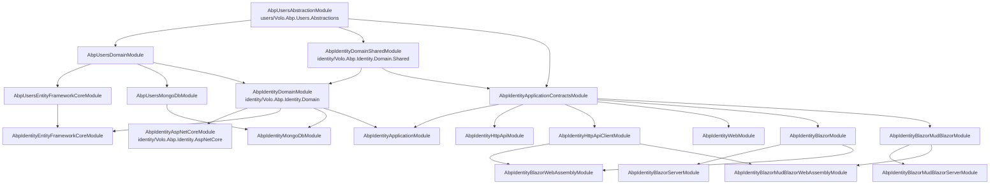
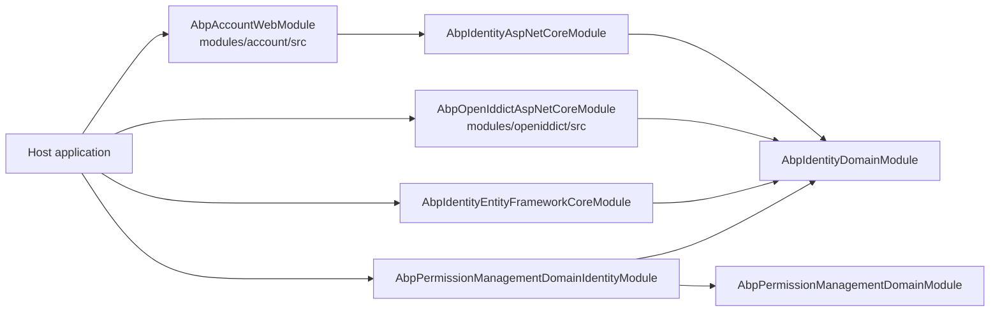
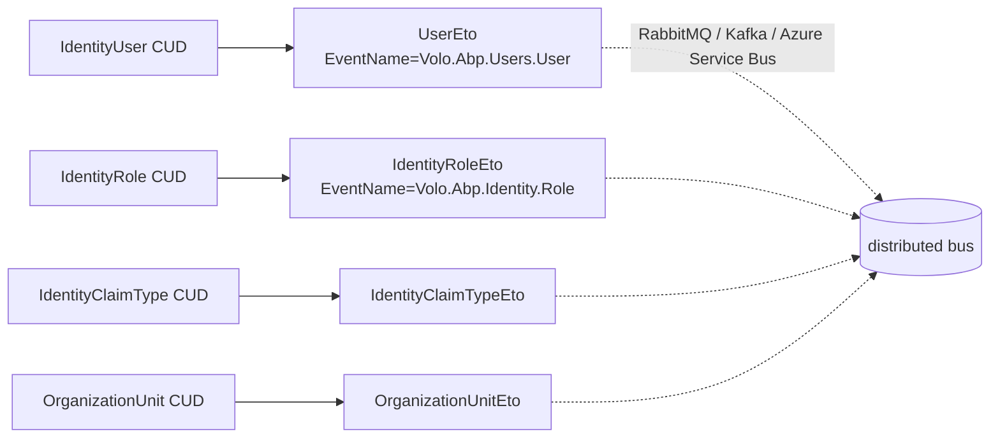

The **ABP Framework** ships a comprehensive *Identity* module that turns the abstract `Microsoft.AspNetCore.Identity` primitives — `UserManager<TUser>`, `RoleManager<TRole>`, `IdentityOptions`, the token providers — into a fully persistent, multi-tenant, claim-aware, organization-unit-aware identity subsystem. Every line of code lives under `modules/identity/src/` and `modules/users/src/`; this page is the map for the seventeen sibling packages that make it up and shows how they layer into a host that also pulls in Account, OpenIddict, and Permission Management.

## What this module owns

`Microsoft.AspNetCore.Identity` only defines abstractions (`IUserStore<TUser>`, `IRoleStore<TRole>`, `IUserClaimsPrincipalFactory<TUser>`, the token-provider contracts) and a single in-memory implementation good for samples. The ABP Identity module ships concrete aggregates — `IdentityUser` in `modules/identity/src/Volo.Abp.Identity.Domain/Volo/Abp/Identity/IdentityUser.cs`, `IdentityRole` in `IdentityRole.cs`, `OrganizationUnit`, `IdentityClaimType`, `IdentitySession`, `IdentityLinkUser`, `IdentityUserDelegation`, `IdentitySecurityLog` — and binds them to `IUserStore`/`IRoleStore` through `IdentityUserStore` and `IdentityRoleStore` (same folder). Above the stores sit `IdentityUserManager` and `IdentityRoleManager`, both registered in `modules/identity/src/Volo.Abp.Identity.Domain/Microsoft/Extensions/DependencyInjection/AbpIdentityServiceCollectionExtensions.cs` so the framework can resolve `UserManager<IdentityUser>` and `RoleManager<IdentityRole>` to the ABP subclasses.

<Info>
The module never owns *authentication flows*. Cookie sign-in, OAuth callbacks, JWT issuance, and the login UI live in the Account and OpenIddict modules. This module owns the **identity store** (users, roles, claims, OUs, sessions, security logs) plus the ASP.NET Core Identity integration (`AbpSignInManager`, token providers, security-stamp validator).
</Info>

## Package layout

`modules/identity/src/` contains seventeen sibling projects, plus a co-located helper project `modules/identity/src/Volo.Abp.PermissionManagement.Domain.Identity/` that adds identity-aware permission value providers. Together with the six packages under `modules/users/src/` they form the complete shipping unit. Each row of the table below maps one folder to one assembly and explains the layer it implements.

| Package directory                                                                                                          | Assembly                                          | Layer / purpose                                                                                                                                                                                              |
| -------------------------------------------------------------------------------------------------------------------------- | ------------------------------------------------- | ------------------------------------------------------------------------------------------------------------------------------------------------------------------------------------------------------------ |
| `modules/identity/src/Volo.Abp.Identity.Domain.Shared/`                                                                    | `Volo.Abp.Identity.Domain.Shared`                 | Constants (`IdentityUserConsts`, `IdentityRoleConsts`, `OrganizationUnitConsts`, `IdentitySessionConsts`, `IdentitySecurityLogConsts`), ETOs (`UserEto`-like `IdentityRoleEto`, `OrganizationUnitEto`), localization. |
| `modules/identity/src/Volo.Abp.Identity.Domain/`                                                                           | `Volo.Abp.Identity.Domain`                        | Aggregates, repositories, managers, claims-principal factory, data seed contributor, dynamic claims contributor.                                                                                             |
| `modules/identity/src/Volo.Abp.Identity.AspNetCore/`                                                                       | `Volo.Abp.Identity.AspNetCore`                    | `AbpSignInManager`, custom token providers (`AbpPasswordResetTokenProvider`, `AbpEmailConfirmationTokenProvider`, `LinkUserTokenProvider`, …), `AbpSecurityStampValidator`, `AbpIdentityAspNetCoreOptions`.   |
| `modules/identity/src/Volo.Abp.Identity.Application.Contracts/`                                                            | `Volo.Abp.Identity.Application.Contracts`        | `IIdentityUserAppService`, `IIdentityRoleAppService`, `IIdentityUserLookupAppService`, DTOs, `IdentityPermissions`, `IdentityPermissionDefinitionProvider`, `IIdentityUserIntegrationService`.                |
| `modules/identity/src/Volo.Abp.Identity.Application/`                                                                      | `Volo.Abp.Identity.Application`                   | `IdentityUserAppService`, `IdentityRoleAppService`, `IdentityUserLookupAppService` plus the Integration service implementation.                                                                              |
| `modules/identity/src/Volo.Abp.Identity.HttpApi/`                                                                          | `Volo.Abp.Identity.HttpApi`                       | `IdentityUserController`, `IdentityRoleController`, `IdentityUserLookupController`, `IdentityUserIntegrationController` under `Area("identity")`.                                                             |
| `modules/identity/src/Volo.Abp.Identity.HttpApi.Client/`                                                                   | `Volo.Abp.Identity.HttpApi.Client`                | Static client proxies (`IdentityUserClientProxy.Generated.cs`, `IdentityRoleClientProxy.Generated.cs`), `HttpClientExternalUserLookupServiceProvider`, `HttpClientUserRoleFinder`.                            |
| `modules/identity/src/Volo.Abp.Identity.EntityFrameworkCore/`                                                              | `Volo.Abp.Identity.EntityFrameworkCore`           | `IdentityDbContext`, `IIdentityDbContext`, eight `EfCore*Repository` classes, `IdentityDbContextModelBuilderExtensions.ConfigureIdentity`.                                                                    |
| `modules/identity/src/Volo.Abp.Identity.MongoDB/`                                                                          | `Volo.Abp.Identity.MongoDB`                       | `AbpIdentityMongoDbContext`, eight `Mongo*Repository` classes, `AbpIdentityMongoDbContextExtensions.ConfigureIdentity`.                                                                                       |
| `modules/identity/src/Volo.Abp.Identity.Web/`                                                                              | `Volo.Abp.Identity.Web`                           | Razor Pages for `/Identity/Users` and `/Identity/Roles`, `AbpIdentityWebMainMenuContributor`, page-toolbar buttons.                                                                                           |
| `modules/identity/src/Volo.Abp.Identity.Blazor/`                                                                           | `Volo.Abp.Identity.Blazor`                        | Blazorise-based `UserManagement.razor` and `RoleManagement.razor` plus `AbpIdentityWebMainMenuContributor` for Blazor.                                                                                        |
| `modules/identity/src/Volo.Abp.Identity.Blazor.Server/`                                                                    | `Volo.Abp.Identity.Blazor.Server`                 | Composition shim that adds `AbpPermissionManagementBlazorServerModule` on top of the Blazorise module.                                                                                                       |
| `modules/identity/src/Volo.Abp.Identity.Blazor.WebAssembly/`                                                                | `Volo.Abp.Identity.Blazor.WebAssembly`            | WASM variant that additionally depends on `AbpIdentityHttpApiClientModule` so the UI calls the HTTP API.                                                                                                     |
| `modules/identity/src/Volo.Abp.Identity.Blazor.MudBlazor/`                                                                 | `Volo.Abp.Identity.Blazor.MudBlazor`              | MudBlazor twin of the Blazorise package, with its own `UserManagement.razor` and `RoleManagement.razor` markup.                                                                                              |
| `modules/identity/src/Volo.Abp.Identity.Blazor.MudBlazor.Server/`                                                          | `Volo.Abp.Identity.Blazor.MudBlazor.Server`       | Server-host shim for the MudBlazor variant.                                                                                                                                                                  |
| `modules/identity/src/Volo.Abp.Identity.Blazor.MudBlazor.WebAssembly/`                                                     | `Volo.Abp.Identity.Blazor.MudBlazor.WebAssembly`  | WASM shim for the MudBlazor variant.                                                                                                                                                                         |
| `modules/identity/src/Volo.Abp.Identity.Installer/`                                                                        | `Volo.Abp.Identity.Installer`                     | `AbpIdentityInstallerModule` embedding installer assets for `abp add-module Volo.Abp.Identity`.                                                                                                              |
| `modules/identity/src/Volo.Abp.PermissionManagement.Domain.Identity/`                                                      | `Volo.Abp.PermissionManagement.Domain.Identity`   | Permission value providers that resolve "user" and "role" permission grants by talking to the Identity domain.                                                                                               |
| `modules/users/src/Volo.Abp.Users.Abstractions/`                                                                           | `Volo.Abp.Users.Abstractions`                     | `IUserData`, `UserData`, `IExternalUserLookupServiceProvider`, `UserEto`, `IRoleData` / `RoleData` — the cross-module user contract.                                                                          |
| `modules/users/src/Volo.Abp.Users.Domain.Shared/`                                                                          | `Volo.Abp.Users.Domain.Shared`                    | `AbpUserConsts` (length limits) and the corresponding module class.                                                                                                                                          |
| `modules/users/src/Volo.Abp.Users.Domain/`                                                                                 | `Volo.Abp.Users.Domain`                           | `IUser` aggregate contract, `IUserRepository<TUser>`, `IUserLookupService<TUser>`, `UserLookupService<TUser, TRepo>` base.                                                                                    |
| `modules/users/src/Volo.Abp.Users.EntityFrameworkCore/`                                                                    | `Volo.Abp.Users.EntityFrameworkCore`              | `EfCoreUserRepositoryBase<TDbContext, TUser>` and `AbpUsersDbContextModelCreatingExtensions.ConfigureAbpUser`.                                                                                                |
| `modules/users/src/Volo.Abp.Users.MongoDB/`                                                                                | `Volo.Abp.Users.MongoDB`                          | `MongoUserRepositoryBase<TDbContext, TUser>` for any aggregate that implements `IUser`.                                                                                                                      |
| `modules/users/src/Volo.Abp.Users.Installer/`                                                                              | `Volo.Abp.Users.Installer`                        | Installer-assets module mirroring the identity installer.                                                                                                                                                    |

Notice that this is one of the **largest** ABP modules. The reason for so many splits is the matrix of UI options (Razor Pages, Blazor Server, Blazor WebAssembly, MudBlazor Server, MudBlazor WebAssembly) multiplied by the matrix of persistence options (EF Core or MongoDB) multiplied by the deployment models (monolith vs. microservice through `HttpApi.Client`).

## Module dependency chain

The lowest tier is `AbpUsersAbstractionModule` (file `modules/users/src/Volo.Abp.Users.Abstractions/Volo/Abp/Users/AbpUsersAbstractionModule.cs`). Above it sits `AbpIdentityDomainSharedModule` (file `modules/identity/src/Volo.Abp.Identity.Domain.Shared/Volo/Abp/Identity/AbpIdentityDomainSharedModule.cs`). Then `AbpIdentityDomainModule` — declared in `modules/identity/src/Volo.Abp.Identity.Domain/Volo/Abp/Identity/AbpIdentityDomainModule.cs` — depends on `AbpDddDomainModule`, `AbpIdentityDomainSharedModule`, `AbpUsersDomainModule`, and `AbpMapperlyModule`. Persistence sits on top: `AbpIdentityEntityFrameworkCoreModule` (file `modules/identity/src/Volo.Abp.Identity.EntityFrameworkCore/Volo/Abp/Identity/EntityFrameworkCore/AbpIdentityEntityFrameworkCoreModule.cs`) depends on `AbpIdentityDomainModule` and `AbpUsersEntityFrameworkCoreModule`; `AbpIdentityMongoDbModule` does the equivalent against the MongoDB packages.

Above persistence sits the Application layer (`AbpIdentityApplicationModule` in `modules/identity/src/Volo.Abp.Identity.Application/Volo/Abp/Identity/AbpIdentityApplicationModule.cs`), then `AbpIdentityHttpApiModule`, then the UI flavour of choice. The ASP.NET Core integration layer `AbpIdentityAspNetCoreModule` (file `modules/identity/src/Volo.Abp.Identity.AspNetCore/Volo/Abp/Identity/AspNetCore/AbpIdentityAspNetCoreModule.cs`) depends only on the Domain module — it is wired into a host that also wants to drive `SignInManager<IdentityUser>` and the security-stamp pipeline.



The diagram is taken straight from the `[DependsOn(...)]` attributes in each module class — for example `AbpIdentityHttpApiClientModule` ([`modules/identity/src/Volo.Abp.Identity.HttpApi.Client/Volo/Abp/Identity/AbpIdentityHttpApiClientModule.cs`](#)) depends on `AbpIdentityApplicationContractsModule` and `AbpHttpClientModule`, and `AbpIdentityBlazorWebAssemblyModule` ([same path under `…Blazor.WebAssembly/`](#)) depends on `AbpIdentityBlazorModule`, the permission-management blazor wasm package, and `AbpIdentityHttpApiClientModule`.

## How the host composes Identity with Account, OpenIddict, and Permission Management

In a typical ABP application template (e.g. `aspnetcore/Volo.Abp.AspNetCore.Mvc.UI.Theme.LeptonXLite`), `AbpIdentityDomainModule` ends up being a common ancestor of three peer modules:

1. The **Account** module under `modules/account/src/` — it depends on `AbpIdentityAspNetCoreModule` because `Account.Web/Pages/Account/Login.cshtml.cs` calls `SignInManager<IdentityUser>` and `IdentityUserManager` directly. `ProfileAppService` (which IS in the open-source repo under `modules/account/src/Volo.Abp.Account.Application/Volo/Abp/Account/ProfileAppService.cs`) consumes `IdentityUserManager` from this module.
2. The **OpenIddict** module under `modules/openiddict/src/` — when the host issues tokens, `AbpUserClaimsPrincipalFactory` (in `modules/identity/src/Volo.Abp.Identity.Domain/Volo/Abp/Identity/AbpUserClaimsPrincipalFactory.cs`) is the factory invoked to materialise the `ClaimsPrincipal` that gets baked into the access token.
3. The **Permission Management** module under `modules/permission-management/src/` — `Volo.Abp.PermissionManagement.Domain.Identity` (file `modules/identity/src/Volo.Abp.PermissionManagement.Domain.Identity/Volo/Abp/PermissionManagement/Identity/UserPermissionValueProvider.cs` and `RolePermissionValueProvider.cs`) plugs identity-aware value providers into the permission system so that "is this user granted X?" resolves through `IdentityUserRepository` and `IdentityRoleRepository`.



This is the picture you see in any default ABP template's startup module: Identity is the foundation, Account speaks to it through `SignInManager`/`UserManager`, OpenIddict speaks to it through `AbpUserClaimsPrincipalFactory`, and Permission Management speaks to it through the value providers. None of the three pulls direct references to the others, which is exactly the point — the host is the only place where they meet.

## The administrative concepts shipped here

Even though most users think of this module as "users and roles", it actually ships eight aggregate roots. Their headline jobs are:

- **`IdentityUser`** (`modules/identity/src/Volo.Abp.Identity.Domain/Volo/Abp/Identity/IdentityUser.cs`) implements `IUser` and `IHasEntityVersion`. It carries `UserName`, `NormalizedUserName`, `Email`, `PasswordHash`, `SecurityStamp`, `TwoFactorEnabled`, `LockoutEnabled`, `AccessFailedCount`, `IsExternal`, `Leaved`, plus child collections for `Claims`, `Logins`, `Roles`, `Tokens`, `OrganizationUnits`, `PasswordHistories`, and `Passkeys`.
- **`IdentityRole`** (`IdentityRole.cs`) carries `Name`, `NormalizedName`, `IsDefault`, `IsStatic`, `IsPublic`, plus a `Claims` collection.
- **`IdentityClaimType`** (`IdentityClaimType.cs`) describes claim types that administrators can register — name, regex validation, value type, required/static flags.
- **`OrganizationUnit`** (`OrganizationUnit.cs`) is the hierarchical OU aggregate with `Code` like `"00001.00042.00005"`, `DisplayName`, and an `OrganizationUnitRole` link to roles.
- **`IdentitySession`** (`IdentitySession.cs`) records each active session: `SessionId`, `Device`, `DeviceInfo`, `ClientId`, `IpAddresses`, `SignedIn`, `LastAccessed`.
- **`IdentityLinkUser`** (`IdentityLinkUser.cs`) records "this user in tenant A is also this user in tenant B" relationships used by the link-user token provider.
- **`IdentityUserDelegation`** (`IdentityUserDelegation.cs`) records "user X delegates to user Y between StartTime and EndTime".
- **`IdentitySecurityLog`** (`IdentitySecurityLog.cs`) is the persistent security event store written by `IdentitySecurityLogManager`.

Each aggregate is mapped to a row in the EF Core model by `IdentityDbContextModelBuilderExtensions.ConfigureIdentity` (file `modules/identity/src/Volo.Abp.Identity.EntityFrameworkCore/Volo/Abp/Identity/EntityFrameworkCore/IdentityDbContextModelBuilderExtensions.cs`) and to a Mongo collection by `AbpIdentityMongoDbContextExtensions.ConfigureIdentity`.

## Connection string and table prefix

All persistence packages share one connection-string name and one table-prefix, defined in `modules/identity/src/Volo.Abp.Identity.Domain/Volo/Abp/Identity/AbpIdentityDbProperties.cs`:

```csharp
public static class AbpIdentityDbProperties
{
    public static string DbTablePrefix { get; set; } = AbpCommonDbProperties.DbTablePrefix; // "Abp"
    public static string DbSchema { get; set; } = AbpCommonDbProperties.DbSchema;            // null
    public const string ConnectionStringName = "AbpIdentity";
}
```

Both `IIdentityDbContext` and `IAbpIdentityMongoDbContext` are decorated with `[ConnectionStringName(AbpIdentityDbProperties.ConnectionStringName)]` so that hosts can route Identity reads/writes to a dedicated database simply by adding an `"AbpIdentity"` entry to `ConnectionStrings`.

## Composition stories for typical hosts

A few representative startup configurations make the package-picking decision concrete.

### A traditional ASP.NET Core MVC monolith with EF Core

```csharp
[DependsOn(
    typeof(AbpIdentityAspNetCoreModule),
    typeof(AbpIdentityEntityFrameworkCoreModule),
    typeof(AbpIdentityApplicationModule),
    typeof(AbpIdentityHttpApiModule),
    typeof(AbpIdentityWebModule),
    typeof(AbpAccountWebModule),
    typeof(AbpOpenIddictAspNetCoreModule),
    typeof(AbpPermissionManagementDomainIdentityModule),
    typeof(AbpPermissionManagementEntityFrameworkCoreModule)
)]
public class MyApplicationModule : AbpModule { }
```

This composition picks one persistence (EF Core), one UI (Razor Pages from `Volo.Abp.Identity.Web`), keeps cookie authentication, and adds OpenIddict for token issuance. The seven Identity packages pulled in transitively are: Domain.Shared, Domain, AspNetCore, Application.Contracts, Application, HttpApi, Web, plus the EF Core package and the permission-management bridge.

### A Blazor WebAssembly micro-frontend talking to a separate Identity service

```csharp
// Identity HTTP API host project
[DependsOn(
    typeof(AbpIdentityAspNetCoreModule),
    typeof(AbpIdentityEntityFrameworkCoreModule),
    typeof(AbpIdentityApplicationModule),
    typeof(AbpIdentityHttpApiModule)
)]
public class IdentityHttpApiHostModule : AbpModule { }

// Blazor WASM client
[DependsOn(
    typeof(AbpIdentityBlazorMudBlazorWebAssemblyModule),
    typeof(AbpIdentityHttpApiClientModule)
)]
public class MyBlazorWasmModule : AbpModule { }
```

The HTTP API host owns persistence; the Blazor WebAssembly client never references the domain assembly, so the `IIdentityUserAppService` it resolves is `IdentityUserClientProxy.Generated.cs`. Adding `AbpIdentityHttpApiClientModule` is redundant here because `AbpIdentityBlazorMudBlazorWebAssemblyModule` already depends on it transitively, but spelling it out makes the wiring obvious.

### A MongoDB-backed minimal API host

```csharp
[DependsOn(
    typeof(AbpIdentityMongoDbModule),
    typeof(AbpIdentityApplicationModule),
    typeof(AbpIdentityHttpApiModule)
)]
public class MyMinimalHostModule : AbpModule { }
```

No UI, no AspNetCore extras — perfect for a downstream microservice that exposes only the identity REST surface. `AbpIdentityAspNetCoreOptions.ConfigureAuthentication` is irrelevant here because `AbpIdentityAspNetCoreModule` is not even in the graph.

## ETOs flowing on the distributed event bus

Because `AbpIdentityDomainModule.ConfigureServices` registers four `EtoMappings` and two `AutoEventSelectors` on `AbpDistributedEntityEventOptions`, hosts wired with a real `IDistributedEventBus` provider see Identity domain changes propagate automatically:



The mapping logic itself lives in `IdentityDomainMappers.cs` (Mapperly) so the published ETOs always reflect the aggregate's current shape, including any object-extension properties added by the host.

## Installer modules

`AbpIdentityInstallerModule` (file `modules/identity/src/Volo.Abp.Identity.Installer/`) and `AbpUsersInstallerModule` (file `modules/users/src/Volo.Abp.Users.Installer/Volo/Abp/Users/AbpUsersInstallerModule.cs`) are tiny modules whose only job is to embed installer assets — README, installation scripts, and the metadata the ABP CLI's `abp add-module Volo.Abp.Identity` flow consumes when wiring the module into an existing solution. They depend on `AbpVirtualFileSystemModule` and have no runtime behaviour.

## Picking the right packages for your host

When `[DependsOn(...)]` is written for an application module, the question is simply which subset of Identity packages to pull in. The decision tree boils down to four axes:

1. **Persistence** — exactly one of `AbpIdentityEntityFrameworkCoreModule` or `AbpIdentityMongoDbModule`.
2. **UI** — at most one of `AbpIdentityWebModule` (Razor Pages), `AbpIdentityBlazorServerModule`, `AbpIdentityBlazorWebAssemblyModule`, `AbpIdentityBlazorMudBlazorServerModule`, `AbpIdentityBlazorMudBlazorWebAssemblyModule`.
3. **AspNetCore integration** — `AbpIdentityAspNetCoreModule` when the host signs users in via cookies; omit it when OpenIddict owns the authentication scheme.
4. **HTTP API surface** — `AbpIdentityHttpApiModule` to expose `/api/identity/*`; `AbpIdentityHttpApiClientModule` to consume those endpoints from another service. Both can be installed on the same host (server publishes, also calls itself), but the common case is one or the other.

The Application Contracts and Application modules are always required when either the HTTP API or any UI is in play.

## Where to go next

<CardGroup cols={2}>
  <Card title="Domain layer" icon="cube" href="/module-identity/domain">
    Aggregates, repositories, managers, claims-principal factory, data seeder.
  </Card>
  <Card title="Application layer" icon="layer-group" href="/module-identity/application">
    `IdentityUserAppService`, `IdentityRoleAppService`, lookups, DTOs.
  </Card>
  <Card title="HTTP API" icon="globe" href="/module-identity/http-api">
    Controllers, routes, and the static client proxies.
  </Card>
  <Card title="EF Core persistence" icon="database" href="/module-identity/efcore">
    `IdentityDbContext`, entity configurations, EF Core repositories.
  </Card>
  <Card title="MongoDB persistence" icon="leaf" href="/module-identity/mongodb">
    `AbpIdentityMongoDbContext` and the Mongo repositories.
  </Card>
  <Card title="ASP.NET Core integration" icon="lock" href="/module-identity/aspnetcore">
    `AbpSignInManager`, token providers, security-stamp pipeline.
  </Card>
  <Card title="Razor Pages UI" icon="file-code" href="/module-identity/web-ui">
    The `/Identity/Users` and `/Identity/Roles` Razor Pages.
  </Card>
  <Card title="Blazor UI variants" icon="bolt" href="/module-identity/blazor-ui">
    Blazorise and MudBlazor, Server and WebAssembly.
  </Card>
  <Card title="Users sub-package" icon="users" href="/module-identity/users-subpackage">
    `IUser`, `IUserData`, `IUserRepository<TUser>`, `IUserLookupService<TUser>`.
  </Card>
</CardGroup>
