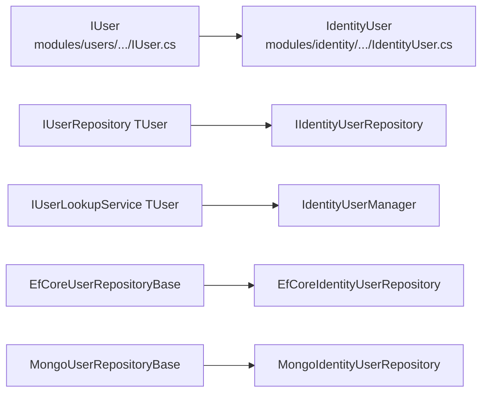

The **ABP Framework** *Users* sub-package is the cross-module surface that lets *any* aggregate behave like a user — not just `IdentityUser`. Six small projects under `modules/users/src/` define the contract (`IUser`, `IUserData`), the cross-module DTO and ETO classes (`UserData`, `UserEto`), the abstract `IUserRepository<TUser>` and `IUserLookupService<TUser>` services, EF Core and MongoDB base repository classes, and an installer module mirroring the Identity installer.

Every package the [Identity Overview](/module-identity/overview) lists depends on at least one of these — `AbpIdentityDomainModule` depends on `AbpUsersDomainModule`, `AbpIdentityEntityFrameworkCoreModule` depends on `AbpUsersEntityFrameworkCoreModule`, and so on. Without the Users sub-package the Identity module could not declare its user contract at all.

<Info>
The Users sub-package is *not* a user-management feature module. It does not ship aggregates, controllers, or UI. It is a vocabulary — `IUser`, `IUserData`, `IUserLookupService<TUser>` — that any module can adopt so the rest of the framework knows how to talk to that module's user aggregate. Identity is the canonical implementation; commercial modules such as ABP CMS Kit follow the same shape.
</Info>

## The six packages

| Package directory                                                                                       | Assembly                              | Purpose                                                                                                                                                              |
| ------------------------------------------------------------------------------------------------------- | ------------------------------------- | -------------------------------------------------------------------------------------------------------------------------------------------------------------------- |
| `modules/users/src/Volo.Abp.Users.Abstractions/`                                                        | `Volo.Abp.Users.Abstractions`         | `IUserData`, `UserData`, `IRoleData`, `RoleData`, `IExternalUserLookupServiceProvider`, `UserEto`, `UserPasswordChangeRequestedEto`, `InviteUserToTenantRequestedEto` |
| `modules/users/src/Volo.Abp.Users.Domain.Shared/`                                                       | `Volo.Abp.Users.Domain.Shared`        | `AbpUserConsts` length limits                                                                                                                                        |
| `modules/users/src/Volo.Abp.Users.Domain/`                                                              | `Volo.Abp.Users.Domain`               | `IUser`, `IUpdateUserData`, `IUserRepository<TUser>`, `IUserLookupService<TUser>`, abstract `UserLookupService<TUser, TUserRepository>`, `AbpUserExtensions`         |
| `modules/users/src/Volo.Abp.Users.EntityFrameworkCore/`                                                 | `Volo.Abp.Users.EntityFrameworkCore`  | `EfCoreUserRepositoryBase<TDbContext, TUser>`, `AbpUsersDbContextModelCreatingExtensions.ConfigureAbpUser`                                                            |
| `modules/users/src/Volo.Abp.Users.MongoDB/`                                                             | `Volo.Abp.Users.MongoDB`              | `MongoUserRepositoryBase<TDbContext, TUser>`                                                                                                                         |
| `modules/users/src/Volo.Abp.Users.Installer/`                                                           | `Volo.Abp.Users.Installer`            | `AbpUsersInstallerModule` embedding installer assets                                                                                                                  |

## Abstractions — `Volo.Abp.Users.Abstractions`

### IUserData and UserData

`modules/users/src/Volo.Abp.Users.Abstractions/Volo/Abp/Users/IUserData.cs`:

```csharp
public interface IUserData : IHasExtraProperties
{
    Guid Id { get; }
    Guid? TenantId { get; }
    string UserName { get; }
    string Name { get; }
    string Surname { get; }
    bool IsActive { get; }
    [CanBeNull] string Email { get; }
    bool EmailConfirmed { get; }
    [CanBeNull] string PhoneNumber { get; }
    bool PhoneNumberConfirmed { get; }
}
```

`UserData` (file `UserData.cs`) is the concrete record any module can return — it copies the contract verbatim, implements the `ExtraProperties` dictionary, and exposes constructors that accept either an existing `IUserData` (for cloning) or all individual fields. This is the type that travels across the wire when one ABP microservice asks another "who is user X?".

```csharp
public class UserData : IUserData
{
    public Guid Id { get; set; }
    public Guid? TenantId { get; set; }
    public string UserName { get; set; }
    public string Name { get; set; }
    public string Surname { get; set; }
    public bool IsActive { get; set; }
    public string Email { get; set; }
    public bool EmailConfirmed { get; set; }
    public string PhoneNumber { get; set; }
    public bool PhoneNumberConfirmed { get; set; }
    public ExtraPropertyDictionary ExtraProperties { get; }

    public UserData(Guid id, [NotNull] string userName, …, ExtraPropertyDictionary extraProperties = null) { … }
}
```

### IRoleData and RoleData

`IRoleData.cs` is the matching contract for role-shaped data:

```csharp
public interface IRoleData : IHasExtraProperties
{
    Guid Id { get; }
    Guid? TenantId { get; }
    string Name { get; }
    bool IsDefault { get; }
    bool IsStatic { get; }
    bool IsPublic { get; }
}
```

`RoleData.cs` is the concrete carrier (analogous to `UserData`). Together with `IUserData`/`UserData` it lets modules expose role and user information without taking a hard dependency on the Identity assembly.

### IExternalUserLookupServiceProvider

`IExternalUserLookupServiceProvider.cs` is the lookup contract any "owner" service can implement to answer queries asked by other services:

```csharp
public interface IExternalUserLookupServiceProvider
{
    Task<IUserData> FindByIdAsync(Guid id, CancellationToken cancellationToken = default);
    Task<IUserData> FindByUserNameAsync(string userName, CancellationToken cancellationToken = default);
    Task<List<IUserData>> SearchAsync(string sorting = null, string filter = null,
        int maxResultCount = int.MaxValue, int skipCount = 0, CancellationToken cancellationToken = default);
    Task<long> GetCountAsync(string filter = null, CancellationToken cancellationToken = default);
}
```

`HttpClientExternalUserLookupServiceProvider` in `modules/identity/src/Volo.Abp.Identity.HttpApi.Client/Volo/Abp/Identity/HttpClientExternalUserLookupServiceProvider.cs` is the canonical implementation — it delegates to `IIdentityUserIntegrationService` so a downstream microservice can route its `IUserLookupService<TUser>` queries to the upstream Identity host over HTTP.

### Cross-service ETOs

Three ETOs in this assembly cross module boundaries through `IDistributedEventBus`:

- `UserEto` (file `UserEto.cs`) — published whenever an `IdentityUser` is created/updated/deleted. Tagged `[EventName("Volo.Abp.Users.User")]`.
- `UserPasswordChangeRequestedEto` (file `UserPasswordChangeRequestedEto.cs`) — `[EventName("Volo.Abp.Users.UserPasswordChangeRequested")]`. Carries `TenantId`, `UserName`, `Password`.
- `InviteUserToTenantRequestedEto` (file `InviteUserToTenantRequestedEto.cs`) — `[EventName("Volo.Abp.Users.InviteUserToTenantRequested")]`. Used by SaaS scenarios to invite a known email into a specific tenant.

### Abstractions module

`AbpUsersAbstractionModule` (file `AbpUsersAbstractionModule.cs`):

```csharp
[DependsOn(
    typeof(AbpMultiTenancyModule),
    typeof(AbpEventBusModule)
    )]
public class AbpUsersAbstractionModule : AbpModule { }
```

The comment in the file notes "TODO: Consider to (somehow) move this to the framework to the same assembly of ICurrentUser!" — a reminder that `IUser` is conceptually a framework-level contract that lives in the Identity ecosystem for historical reasons.

## Domain.Shared — `Volo.Abp.Users.Domain.Shared`

The only meaningful file is `AbpUserConsts.cs`:

```csharp
public class AbpUserConsts
{
    public static int MaxUserNameLength    { get; set; } = 256;
    public static int MaxNameLength        { get; set; } = 64;
    public static int MaxSurnameLength     { get; set; } = 64;
    public static int MaxEmailLength       { get; set; } = 256;
    public static int MaxPhoneNumberLength { get; set; } = 16;
}
```

Every length limit is a `static` property so a host can override defaults from `PreConfigureServices`. For example setting `AbpUserConsts.MaxEmailLength = 320` in a host module raises the maximum email length to the full RFC-5321 limit; the EF Core model builder and Mongo serializer pick it up at model-build time.

## Domain — `Volo.Abp.Users.Domain`

### IUser

`IUser.cs` is the aggregate contract every "user-like" entity must satisfy:

```csharp
public interface IUser : IAggregateRoot<Guid>, IMultiTenant, IHasExtraProperties
{
    string UserName { get; }
    [CanBeNull] string Email { get; }
    [CanBeNull] string Name { get; }
    [CanBeNull] string Surname { get; }
    bool IsActive { get; }
    bool EmailConfirmed { get; }
    [CanBeNull] string PhoneNumber { get; }
    bool PhoneNumberConfirmed { get; }
}
```

`IdentityUser` from `modules/identity/src/Volo.Abp.Identity.Domain/Volo/Abp/Identity/IdentityUser.cs` implements this contract. Any custom module that ships its own user aggregate (e.g. a "Subscriber" aggregate inside a CMS module) can implement `IUser` and immediately gain access to the rest of the Users tooling.

### IUserRepository&lt;TUser&gt;

`IUserRepository.cs`:

```csharp
public interface IUserRepository<TUser> : IBasicRepository<TUser, Guid>
    where TUser : class, IUser, IAggregateRoot<Guid>
{
    Task<TUser> FindByUserNameAsync(string userName, CancellationToken cancellationToken = default);
    Task<List<TUser>> GetListAsync(IEnumerable<Guid> ids, CancellationToken cancellationToken = default);
    Task<List<TUser>> SearchAsync(string sorting = null, int maxResultCount = int.MaxValue,
        int skipCount = 0, string filter = null, CancellationToken cancellationToken = default);
    Task<long> GetCountAsync(string filter = null, CancellationToken cancellationToken = default);
}
```

### IUserLookupService&lt;TUser&gt; and UserLookupService

`IUserLookupService.cs`:

```csharp
public interface IUserLookupService<TUser>
    where TUser : class, IUser
{
    Task<TUser> FindByIdAsync(Guid id, CancellationToken cancellationToken = default);
    Task<TUser> FindByUserNameAsync(string userName, CancellationToken cancellationToken = default);
    Task<List<IUserData>> SearchAsync(string sorting = null, string filter = null,
        int maxResultCount = int.MaxValue, int skipCount = 0, CancellationToken cancellationToken = default);
    Task<long> GetCountAsync(string filter = null, CancellationToken cancellationToken = default);
}
```

`UserLookupService<TUser, TUserRepository>` (file `UserLookupService.cs`) is the abstract base implementation. It composes a local repository with an optional `IExternalUserLookupServiceProvider`:

```csharp
public abstract class UserLookupService<TUser, TUserRepository> : IUserLookupService<TUser>, ITransientDependency
    where TUser : class, IUser
    where TUserRepository : IUserRepository<TUser>
{
    protected bool SkipExternalLookupIfLocalUserExists { get; set; } = true;

    public IExternalUserLookupServiceProvider ExternalUserLookupServiceProvider { get; set; }
    public ILogger<UserLookupService<TUser, TUserRepository>> Logger { get; set; }

    public async Task<TUser> FindByIdAsync(Guid id, CancellationToken cancellationToken = default)
    {
        var localUser = await _userRepository.FindAsync(id, cancellationToken: cancellationToken);

        if (ExternalUserLookupServiceProvider == null)
            return localUser;

        if (SkipExternalLookupIfLocalUserExists && localUser != null)
            return localUser;

        IUserData externalUser;
        try
        {
            externalUser = await ExternalUserLookupServiceProvider.FindByIdAsync(id, cancellationToken);
            if (externalUser == null)
            {
                if (localUser != null)
                    await WithNewUowAsync(() => _userRepository.DeleteAsync(localUser, cancellationToken: cancellationToken));
                return null;
            }
        }
        catch (Exception ex) { Logger.LogException(ex); return localUser; }

        if (localUser == null)
        {
            await WithNewUowAsync(() => _userRepository.InsertAsync(CreateUser(externalUser), cancellationToken: cancellationToken));
            return await _userRepository.FindAsync(id, cancellationToken: cancellationToken);
        }

        if (localUser is IUpdateUserData && ((IUpdateUserData)localUser).Update(externalUser))
            await WithNewUowAsync(() => _userRepository.UpdateAsync(localUser, cancellationToken: cancellationToken));

        return await _userRepository.FindAsync(id, cancellationToken: cancellationToken);
    }
    // FindByUserNameAsync, SearchAsync, GetCountAsync follow the same pattern.

    protected abstract TUser CreateUser(IUserData externalUser);
}
```

The key idea is read-through caching against an external owner of truth. When a microservice owns its own user aggregate but trusts an upstream Identity host to be authoritative, it derives from `UserLookupService<TUser, TUserRepository>` and overrides `CreateUser(IUserData)` to materialise a local mirror. If the user is missing locally, the lookup fetches it from the external provider and inserts a copy. If the user is missing externally, the local copy is deleted. If the local copy implements `IUpdateUserData` (interface `IUpdateUserData.cs`: `bool Update(IUserData user)`), changes are pulled in.

```csharp
public interface IUpdateUserData
{
    bool Update([NotNull] IUserData user);
}
```

### Convenience extensions

`UserLookupServiceExtensions.cs`:

```csharp
public static class UserLookupServiceExtensions
{
    public static async Task<TUser> GetByIdAsync<TUser>(this IUserLookupService<TUser> svc, Guid id, …)
        where TUser : class, IUser
    {
        var user = await svc.FindByIdAsync(id, cancellationToken);
        if (user == null) throw new EntityNotFoundException(typeof(TUser), id);
        return user;
    }

    public static async Task<TUser> GetByUserNameAsync<TUser>(this IUserLookupService<TUser> svc, string userName, …)
        where TUser : class, IUser
    {
        var user = await svc.FindByUserNameAsync(userName, cancellationToken);
        if (user == null) throw new EntityNotFoundException(typeof(TUser), userName);
        return user;
    }
}
```

### AbpUserExtensions

`AbpUserExtensions.cs` provides `ToAbpUserData(this IUser user)`:

```csharp
public static class AbpUserExtensions
{
    public static IUserData ToAbpUserData(this IUser user)
        => new UserData(id: user.Id, userName: user.UserName, email: user.Email,
            name: user.Name, surname: user.Surname, isActive: user.IsActive,
            emailConfirmed: user.EmailConfirmed, phoneNumber: user.PhoneNumber,
            phoneNumberConfirmed: user.PhoneNumberConfirmed, tenantId: user.TenantId,
            extraProperties: user.ExtraProperties);
}
```

This is the one-liner anyone needs to flatten an aggregate into the cross-service DTO.

### Domain module

`AbpUsersDomainModule` (file `AbpUsersDomainModule.cs`):

```csharp
[DependsOn(
    typeof(AbpUsersDomainSharedModule),
    typeof(AbpUsersAbstractionModule),
    typeof(AbpDddDomainModule)
    )]
public class AbpUsersDomainModule : AbpModule { }
```

## EntityFrameworkCore — `Volo.Abp.Users.EntityFrameworkCore`

### EfCoreUserRepositoryBase&lt;TDbContext, TUser&gt;

`modules/users/src/Volo.Abp.Users.EntityFrameworkCore/Volo/Abp/Users/EntityFrameworkCore/EfCoreAbpUserRepositoryBase.cs`:

```csharp
public abstract class EfCoreUserRepositoryBase<TDbContext, TUser>
    : EfCoreRepository<TDbContext, TUser, Guid>, IUserRepository<TUser>
    where TDbContext : IEfCoreDbContext
    where TUser : class, IUser
{
    public async Task<TUser> FindByUserNameAsync(string userName, CancellationToken cancellationToken = default)
        => await (await GetDbSetAsync()).OrderBy(x => x.Id)
            .FirstOrDefaultAsync(u => u.UserName == userName, GetCancellationToken(cancellationToken));

    public virtual async Task<List<TUser>> GetListAsync(IEnumerable<Guid> ids, CancellationToken cancellationToken = default)
        => await (await GetDbSetAsync()).Where(u => ids.Contains(u.Id))
            .ToListAsync(GetCancellationToken(cancellationToken));

    public async Task<List<TUser>> SearchAsync(string sorting = null, int maxResultCount = int.MaxValue,
        int skipCount = 0, string filter = null, CancellationToken cancellationToken = default)
        => await (await GetDbSetAsync())
            .WhereIf(!filter.IsNullOrWhiteSpace(), u =>
                u.UserName.Contains(filter) ||
                (u.Email   != null && u.Email.Contains(filter))   ||
                (u.Name    != null && u.Name.Contains(filter))    ||
                (u.Surname != null && u.Surname.Contains(filter)))
            .OrderBy(sorting.IsNullOrEmpty() ? nameof(IUser.UserName) : sorting)
            .PageBy(skipCount, maxResultCount)
            .ToListAsync(GetCancellationToken(cancellationToken));
}
```

Any module that owns its own `TUser : IUser` aggregate inherits this class to get `IUserRepository<TUser>` for free.

### ConfigureAbpUser

`AbpUsersDbContextModelCreatingExtensions.cs`:

```csharp
public static class AbpUsersDbContextModelCreatingExtensions
{
    public static void ConfigureAbpUser<TUser>(this EntityTypeBuilder<TUser> b)
        where TUser : class, IUser
    {
        b.Property(u => u.TenantId).HasColumnName(nameof(IUser.TenantId));
        b.Property(u => u.UserName).IsRequired().HasMaxLength(AbpUserConsts.MaxUserNameLength).HasColumnName(nameof(IUser.UserName));
        b.Property(u => u.Email).IsRequired().HasMaxLength(AbpUserConsts.MaxEmailLength).HasColumnName(nameof(IUser.Email));
        b.Property(u => u.Name).HasMaxLength(AbpUserConsts.MaxNameLength).HasColumnName(nameof(IUser.Name));
        b.Property(u => u.Surname).HasMaxLength(AbpUserConsts.MaxSurnameLength).HasColumnName(nameof(IUser.Surname));
        b.Property(u => u.EmailConfirmed).HasDefaultValue(false).HasColumnName(nameof(IUser.EmailConfirmed));
        b.Property(u => u.PhoneNumber).HasMaxLength(AbpUserConsts.MaxPhoneNumberLength).HasColumnName(nameof(IUser.PhoneNumber));
        b.Property(u => u.PhoneNumberConfirmed).HasDefaultValue(false).HasColumnName(nameof(IUser.PhoneNumberConfirmed));
        b.Property(u => u.IsActive).HasColumnName(nameof(IUser.IsActive));
    }
}
```

`IdentityDbContextModelBuilderExtensions.ConfigureIdentity` (from the Identity EF Core package) calls this method inside its `builder.Entity<IdentityUser>(b => { … b.ConfigureAbpUser(); … })` block. Any custom user aggregate in another module reuses it the same way.

### Module

`AbpUsersEntityFrameworkCoreModule` (file `AbpUsersEntityFrameworkCoreModule.cs`):

```csharp
[DependsOn(typeof(AbpUsersDomainModule), typeof(AbpEntityFrameworkCoreModule))]
public class AbpUsersEntityFrameworkCoreModule : AbpModule { }
```

## MongoDB — `Volo.Abp.Users.MongoDB`

`MongoUserRepositoryBase<TDbContext, TUser>` in `modules/users/src/Volo.Abp.Users.MongoDB/Volo/Abp/Users/MongoDB/MongoUserRepositoryBase.cs` mirrors the EF Core base for MongoDB:

```csharp
public abstract class MongoUserRepositoryBase<TDbContext, TUser>
    : MongoDbRepository<TDbContext, TUser, Guid>, IUserRepository<TUser>
    where TDbContext : IAbpMongoDbContext
    where TUser : class, IUser
{
    public virtual async Task<TUser> FindByUserNameAsync(string userName, …)
        => await (await GetQueryableAsync(cancellationToken)).OrderBy(x => x.Id)
            .FirstOrDefaultAsync(u => u.UserName == userName, cancellationToken);

    public virtual async Task<List<TUser>> GetListAsync(IEnumerable<Guid> ids, …)
        => await (await GetQueryableAsync(cancellationToken)).Where(u => ids.Contains(u.Id)).ToListAsync(cancellationToken);

    public async Task<List<TUser>> SearchAsync(string sorting = null, int maxResultCount = int.MaxValue,
        int skipCount = 0, string filter = null, …)
        => await (await GetQueryableAsync(cancellationToken))
            .WhereIf(!filter.IsNullOrWhiteSpace(), u =>
                u.UserName.Contains(filter) ||
                (u.Email   != null && u.Email.Contains(filter))   ||
                (u.Name    != null && u.Name.Contains(filter))    ||
                (u.Surname != null && u.Surname.Contains(filter)))
            .OrderBy(sorting.IsNullOrEmpty() ? nameof(IUserData.UserName) : sorting)
            .PageBy(skipCount, maxResultCount)
            .ToListAsync(cancellationToken);
}
```

`AbpUsersMongoDbModule` (file `AbpUsersMongoDbModule.cs`):

```csharp
[DependsOn(typeof(AbpUsersDomainModule), typeof(AbpMongoDbModule))]
public class AbpUsersMongoDbModule : AbpModule { }
```

## Installer — `Volo.Abp.Users.Installer`

`AbpUsersInstallerModule` (file `modules/users/src/Volo.Abp.Users.Installer/Volo/Abp/Users/AbpUsersInstallerModule.cs`):

```csharp
[DependsOn(typeof(AbpVirtualFileSystemModule))]
public class AbpUsersInstallerModule : AbpModule
{
    public override void ConfigureServices(ServiceConfigurationContext context)
    {
        Configure<AbpVirtualFileSystemOptions>(options =>
        {
            options.FileSets.AddEmbedded<AbpUsersInstallerModule>();
        });
    }
}
```

The installer's only job is to embed the README and installer scripts for the ABP CLI's `abp add-module Volo.Abp.Users` flow.

## How the abstract types are reused

When the Identity module declares `IdentityUser : IUser, IHasEntityVersion`, the consequences cascade through the framework:



`IdentityUser` honours the `IUser` contract, so any code that depends only on the Users abstractions — for instance a CMS module's "post author" lookup — can resolve `IUserLookupService<IdentityUser>` and ask "give me the user with this id". The CMS module never references the Identity assembly.

## Practical reuse pattern

A module that needs its own user-like aggregate (say `CmsAuthor`) follows the same playbook the Identity module uses:

1. Make `CmsAuthor : IUser, FullAuditedAggregateRoot<Guid>` in its Domain assembly.
2. Define `ICmsAuthorRepository : IUserRepository<CmsAuthor>` in the same place.
3. Subclass `EfCoreUserRepositoryBase<MyDbContext, CmsAuthor>` (or the Mongo base) in the persistence assembly and add module-specific queries on top.
4. Apply `b.ConfigureAbpUser()` inside the EF Core configuration for `CmsAuthor`.
5. Optionally subclass `UserLookupService<CmsAuthor, ICmsAuthorRepository>` and override `CreateUser(IUserData)` to mirror users from an external authority.

That is exactly the recipe the Identity module follows in `modules/identity/src/Volo.Abp.Identity.EntityFrameworkCore/Volo/Abp/Identity/EntityFrameworkCore/EfCoreIdentityUserRepository.cs` and `IdentityUserRepositoryExternalUserLookupServiceProvider.cs` — the latter being the in-process lookup wiring that lets one identity host serve as the external authority for another.

## Where to go next

The aggregates that satisfy `IUser` and the repositories that implement `IUserRepository<TUser>` for `IdentityUser` are described in [Domain](/module-identity/domain). Their EF Core configuration (which calls `ConfigureAbpUser`) is in [EF Core](/module-identity/efcore). The Mongo equivalents are in [MongoDB](/module-identity/mongodb). The cross-service `IExternalUserLookupServiceProvider` implementation that talks to the HTTP API is in [HTTP API](/module-identity/http-api).
