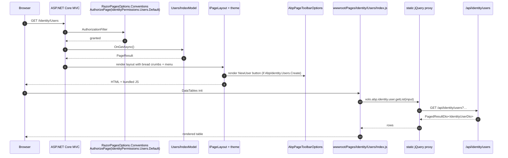

The **ABP Framework** Identity Web package is the MVC / Razor Pages flavour of the management UI. It ships two top-level pages — `/Identity/Users` and `/Identity/Roles` — together with their create and edit modals, a main-menu contributor that adds the *Administration → Identity Management* group, and page-toolbar buttons for the "New User" / "New Role" actions. All code lives under `modules/identity/src/Volo.Abp.Identity.Web/`.

## Module wire-up

`AbpIdentityWebModule` (file `modules/identity/src/Volo.Abp.Identity.Web/AbpIdentityWebModule.cs`):

```csharp
[DependsOn(typeof(AbpIdentityApplicationContractsModule))]
[DependsOn(typeof(AbpMapperlyModule))]
[DependsOn(typeof(AbpPermissionManagementWebModule))]
[DependsOn(typeof(AbpAspNetCoreMvcUiThemeSharedModule))]
public class AbpIdentityWebModule : AbpModule
{
    public override void PreConfigureServices(ServiceConfigurationContext context)
    {
        context.Services.PreConfigure<AbpMvcDataAnnotationsLocalizationOptions>(options =>
        {
            options.AddAssemblyResource(
                typeof(IdentityResource),
                typeof(AbpIdentityWebModule).Assembly,
                typeof(AbpIdentityApplicationContractsModule).Assembly);
        });

        PreConfigure<IMvcBuilder>(mvcBuilder =>
        {
            mvcBuilder.AddApplicationPartIfNotExists(typeof(AbpIdentityWebModule).Assembly);
        });
    }

    public override void ConfigureServices(ServiceConfigurationContext context)
    {
        Configure<AbpNavigationOptions>(options =>
        {
            options.MenuContributors.Add(new AbpIdentityWebMainMenuContributor());
        });

        Configure<AbpVirtualFileSystemOptions>(options =>
        {
            options.FileSets.AddEmbedded<AbpIdentityWebModule>();
        });

        context.Services.AddMapperlyObjectMapper<AbpIdentityWebModule>();

        Configure<RazorPagesOptions>(options =>
        {
            options.Conventions.AuthorizePage("/Identity/Users/Index",       IdentityPermissions.Users.Default);
            options.Conventions.AuthorizePage("/Identity/Users/CreateModal", IdentityPermissions.Users.Create);
            options.Conventions.AuthorizePage("/Identity/Users/EditModal",   IdentityPermissions.Users.Update);
            options.Conventions.AuthorizePage("/Identity/Roles/Index",       IdentityPermissions.Roles.Default);
            options.Conventions.AuthorizePage("/Identity/Roles/CreateModal", IdentityPermissions.Roles.Create);
            options.Conventions.AuthorizePage("/Identity/Roles/EditModal",   IdentityPermissions.Roles.Update);
        });

        Configure<AbpPageToolbarOptions>(options =>
        {
            options.Configure<Volo.Abp.Identity.Web.Pages.Identity.Users.IndexModel>(toolbar =>
            {
                toolbar.AddButton(
                    LocalizableString.Create<IdentityResource>("NewUser"),
                    icon: "plus",
                    name: "CreateUser",
                    requiredPolicyName: IdentityPermissions.Users.Create);
            });

            options.Configure<Volo.Abp.Identity.Web.Pages.Identity.Roles.IndexModel>(toolbar =>
            {
                toolbar.AddButton(
                    LocalizableString.Create<IdentityResource>("NewRole"),
                    icon: "plus",
                    name: "CreateRole",
                    requiredPolicyName: IdentityPermissions.Roles.Create);
            });
        });

        Configure<DynamicJavaScriptProxyOptions>(options =>
        {
            options.DisableModule(IdentityRemoteServiceConsts.ModuleName);
        });
    }
}
```

Three module-level decisions stand out:

1. **Authorization by convention** — every Razor Page is associated with an `IdentityPermissions.*` policy. The framework's authorization middleware short-circuits any request whose principal does not hold the policy without the page model even seeing it.
2. **Page-toolbar buttons** — `AbpPageToolbarOptions` is the framework-wide contract that lets modules contribute action buttons to any page model. The toolbar is rendered by the theme's `<abp-page-toolbar>` tag helper.
3. **Disabled dynamic JS proxy** — `DynamicJavaScriptProxyOptions.DisableModule(IdentityRemoteServiceConsts.ModuleName)` turns off the runtime `/Abp/ServiceProxyScript` generation for `identity` because this module ships static, pre-bundled jQuery clients instead (loaded via the bundle contributor below).

The `PostConfigureServices` block at the bottom of the file calls `ModuleExtensionConfigurationHelper.ApplyEntityConfigurationToUi` so any property added through the object-extension system materialises as an input on the `CreateModal` / `EditModal` page models — both for users (mapped to `Volo.Abp.Identity.Web.Pages.Identity.Users.CreateModalModel.UserInfoViewModel` / `EditModalModel.UserInfoViewModel`) and for roles (mapped to the `RoleInfoModel` view-models). This is what lets a host add a `Department` property to `IdentityUser` and have the modal pick it up automatically without any HTML edits.

## Page-model base class

`IdentityPageModel` (file `modules/identity/src/Volo.Abp.Identity.Web/Pages/Identity/IdentityPageModel.cs`) is the shared base for every Razor Page model in the module:

```csharp
public abstract class IdentityPageModel : AbpPageModel
{
    public IdentityPageModel()
    {
        LocalizationResourceType = typeof(IdentityResource);
        ObjectMapperContext     = typeof(AbpIdentityWebModule);
    }
}
```

Setting `LocalizationResourceType` makes `L["Users"]` and similar tag-helper calls resolve through `IdentityResource`, and setting `ObjectMapperContext` ensures `ObjectMapper.Map<TFrom, TTo>(...)` routes to the Mapperly mappers registered by `AddMapperlyObjectMapper<AbpIdentityWebModule>()`.

## Razor Pages

### `/Identity/Users`

The Users index sits at `Pages/Identity/Users/Index.cshtml` and `Pages/Identity/Users/Index.cshtml.cs`. The code-behind is intentionally tiny:

```csharp
public class IndexModel : IdentityPageModel
{
    public virtual Task<IActionResult> OnGetAsync()  => Task.FromResult<IActionResult>(Page());
    public virtual Task<IActionResult> OnPostAsync() => Task.FromResult<IActionResult>(Page());
}
```

The actual user grid is rendered client-side by jQuery DataTables using `Volo.Abp.Identity.UserController` proxies from `wwwroot/Pages/Identity/Users/Index.js` (embedded via `AddEmbedded<AbpIdentityWebModule>`). The CSHTML wires the breadcrumbs and menu-item highlight:

```cshtml
@page
@model IndexModel
@inject IHtmlLocalizer<IdentityResource> L
@inject IHtmlLocalizer<AbpUiNavigationResource> LUiNavigation
@inject IAuthorizationService Authorization
@inject IPageLayout PageLayout
@{
    PageLayout.Content.Title = L["Users"].Value;
    PageLayout.Content.BreadCrumb.Add(LUiNavigation["Menu:Administration"].Value);
    PageLayout.Content.BreadCrumb.Add(L["Menu:IdentityManagement"].Value);
    PageLayout.Content.MenuItemName = IdentityMenuNames.Users;
}
```

`Pages/Identity/Users/CreateModal.cshtml` and `EditModal.cshtml` are the create/edit modals. The `CreateModalModel` code-behind (`CreateModal.cshtml.cs`) injects `IIdentityUserAppService`, calls `GetAssignableRolesAsync()` on GET to preload the role checkbox grid, and uses `IdentityUserCreateDto` plus the inner view-models `UserInfoViewModel` and `AssignedRoleViewModel`:

```csharp
public class CreateModalModel : IdentityPageModel
{
    [BindProperty] public UserInfoViewModel UserInfo { get; set; }
    [BindProperty] public AssignedRoleViewModel[] Roles { get; set; }

    protected IIdentityUserAppService IdentityUserAppService { get; }

    public CreateModalModel(IIdentityUserAppService identityUserAppService)
    {
        IdentityUserAppService = identityUserAppService;
    }

    public virtual async Task<IActionResult> OnGetAsync()
    {
        UserInfo = new UserInfoViewModel();
        var roleDtoList = (await IdentityUserAppService.GetAssignableRolesAsync()).Items;
        Roles = ObjectMapper.Map<IReadOnlyList<IdentityRoleDto>, AssignedRoleViewModel[]>(roleDtoList);
        foreach (var role in Roles) { role.IsAssigned = role.IsDefault; }
        return Page();
    }
}
```

`EditModalModel` (file `EditModal.cshtml.cs`) follows the same shape but additionally loads the existing user via `IdentityUserAppService.GetAsync(id)` and seeds the `Roles[]` array from `GetRolesAsync(id)` so default-assigned roles are checked.

### `/Identity/Roles`

The Roles tree mirrors the Users tree:

- `Pages/Identity/Roles/Index.cshtml(.cs)` — list page.
- `Pages/Identity/Roles/CreateModal.cshtml(.cs)` — create modal, calling `IIdentityRoleAppService.CreateAsync(IdentityRoleCreateDto)`.
- `Pages/Identity/Roles/EditModal.cshtml(.cs)` — edit modal, calling `UpdateAsync`.

The view-models (`RoleInfoModel`) are nested inside the page model classes so they can be passed as `[BindProperty]` without bleeding into the contracts assembly.

### `_ViewImports.cshtml`

`Pages/Identity/_ViewImports.cshtml` imports the shared namespaces (`Volo.Abp.Identity`, `Volo.Abp.Identity.Web`, `Volo.Abp.Identity.Localization`) and tag-helper libraries so every CSHTML in this folder picks them up automatically.

## Menu contribution

`AbpIdentityWebMainMenuContributor` (file `modules/identity/src/Volo.Abp.Identity.Web/Navigation/AbpIdentityWebMainMenuContributor.cs`):

```csharp
public class AbpIdentityWebMainMenuContributor : IMenuContributor
{
    public virtual Task ConfigureMenuAsync(MenuConfigurationContext context)
    {
        if (context.Menu.Name != StandardMenus.Main)
            return Task.CompletedTask;

        var l = context.GetLocalizer<IdentityResource>();

        var identityMenuItem = new ApplicationMenuItem(IdentityMenuNames.GroupName, l["Menu:IdentityManagement"], icon: "fa fa-id-card-o");
        identityMenuItem.AddItem(new ApplicationMenuItem(IdentityMenuNames.Roles, l["Roles"], url: "~/Identity/Roles").RequirePermissions(IdentityPermissions.Roles.Default));
        identityMenuItem.AddItem(new ApplicationMenuItem(IdentityMenuNames.Users, l["Users"], url: "~/Identity/Users").RequirePermissions(IdentityPermissions.Users.Default));

        context.Menu.GetAdministration().AddItem(identityMenuItem);

        return Task.CompletedTask;
    }
}
```

`IdentityMenuNames` (file `Navigation/IdentityMenuNames.cs`):

```csharp
public class IdentityMenuNames
{
    public const string GroupName = "AbpIdentity";
    public const string Roles     = GroupName + ".Roles";
    public const string Users     = GroupName + ".Users";
}
```

`context.Menu.GetAdministration()` adds the *Identity Management* group as a child of the cross-module *Administration* menu — the same parent used by Tenant Management, Settings, Audit Logs, etc. The `.RequirePermissions(...)` calls hide a menu item when the current principal lacks the permission, so the menu never shows links the user cannot follow.

## Page toolbar contributions

`AbpPageToolbarOptions.Configure<TPageModel>(toolbar => ...)` is the framework contract; the Web module uses it to register the *New User* and *New Role* buttons against the `Users.IndexModel` and `Roles.IndexModel` types. The theme's `<abp-page-toolbar>` tag helper renders those buttons in the page header, hooking each button to a `data-busy-text` and click handler emitted by the page's `.js` file.

## Bundle contributors and embedded assets

`AbpVirtualFileSystemOptions.FileSets.AddEmbedded<AbpIdentityWebModule>()` embeds every `.cshtml`, `.js`, and `.css` under `wwwroot/` into the assembly. The theme's bundle contributors then merge these into a single `<script>` and `<style>` per page using the framework's bundling pipeline (`framework/src/Volo.Abp.AspNetCore.Mvc.UI.Bundling/`), so the Users page ends up with one HTTP request for its custom JavaScript.

The page-specific JS files live under `wwwroot/Pages/Identity/Users/Index.js`, `wwwroot/Pages/Identity/Roles/Index.js`, etc. (embedded — not surfaced to the source tree as separate files in the casts above). Each of them references the static jQuery proxies under `wwwroot/client-proxies/` that mirror `IdentityUserController` and `IdentityRoleController` endpoint-for-endpoint.

## Render flow



## Localisation, permissions, object extensions

Localisation flows through `IdentityResource` (file `modules/identity/src/Volo.Abp.Identity.Domain.Shared/Volo/Abp/Identity/Localization/IdentityResource.cs` and the JSON resource files alongside it). The module adds `AbpUiResource` as a base type so generic UI keys (`PagerInfo`, `SaveSuccess`, etc.) resolve through the framework's shared dictionary.

Permission policies attached via `RazorPagesOptions.Conventions` are evaluated against `IdentityPermissions.*` constants from the contracts assembly — the same constants used by the app-service `[Authorize(...)]` attributes documented in [Application](/module-identity/application). Object extensions registered through `ObjectExtensionManager.Instance.AddOrUpdateProperty<IdentityUser, string>("Department")` are rendered as inputs by the `CreateModal` / `EditModal` views thanks to the `ApplyEntityConfigurationToUi` calls in `PostConfigureServices`.

## Mapperly mappers

`AbpIdentityWebMappers.cs` declares the Mapperly partial classes used by the page models — `IdentityRoleDtoToAssignedRoleViewModelMapper`, `IdentityUserDtoToUserInfoViewModelMapper`, etc. The classes are auto-discovered by `AddMapperlyObjectMapper<AbpIdentityWebModule>()`, so the page-side `ObjectMapper.Map<IReadOnlyList<IdentityRoleDto>, AssignedRoleViewModel[]>(...)` call works without runtime reflection.

## Dynamic JavaScript proxy disable

```csharp
Configure<DynamicJavaScriptProxyOptions>(options =>
{
    options.DisableModule(IdentityRemoteServiceConsts.ModuleName);
});
```

This call shuts down the dynamic `/Abp/ServiceProxyScript?modules=identity` generation that the framework would otherwise serve. The reason is that the Web module ships *static* JS proxies under `wwwroot/client-proxies/` so consumers depend on a fixed contract, not on a runtime-generated one. The static files mirror `IdentityUserController`/`IdentityRoleController` endpoint-by-endpoint and expose them on the browser as `volo.abp.identity.user.getList(input)` etc.

## ABP page-toolbar buttons

`AbpPageToolbarOptions.Configure<TPageModel>(toolbar => toolbar.AddButton(...))` registers a button whose visibility is gated by `requiredPolicyName`. The framework's `<abp-page-toolbar>` tag helper iterates the registered buttons, evaluates the policy through `IAuthorizationService`, and renders only the buttons the current user is allowed to see. This is why a viewer with `AbpIdentity.Users.Default` but not `AbpIdentity.Users.Create` sees the Users grid but no *New User* button.

## Embedded virtual file system

`AbpVirtualFileSystemOptions.FileSets.AddEmbedded<AbpIdentityWebModule>()` exposes every embedded `.cshtml`, `.js`, `.css`, and `.json` resource under the assembly's namespace. The framework's view engine then resolves `Volo.Abp.Identity.Web.Pages.Identity.Users.Index` from the embedded resource without requiring the host to copy any files. This is why a freshly-templated ABP project does not have a `Pages/Identity/` folder — everything ships inside the NuGet package.

A host that wants to override a specific page (for example, replace the *Users* index with a custom layout) creates a `Pages/Identity/Users/Index.cshtml` in its own project. The framework's `AbpRazorFileProvider` resolves project files before embedded files, so the host's override wins.

## Module-level dependencies

`AbpIdentityWebModule` depends on `AbpIdentityApplicationContractsModule` (so DTOs and permission constants are available), `AbpMapperlyModule` (for the page-side mappers), `AbpPermissionManagementWebModule` (so the *Permissions* modal can be reused on the user / role edit pages), and `AbpAspNetCoreMvcUiThemeSharedModule` (so theme tag helpers like `<abp-page-toolbar>` and `<abp-modal>` are available). Notably it does *not* depend on the Domain or EF Core packages — the Web UI talks only to the application services and never to the domain or persistence layer directly.

## Blazor counterpart

A Blazor host depends on `AbpIdentityBlazorModule` (or one of the MudBlazor / Server / WebAssembly variants) instead of this module; the application services and DTOs stay identical and the URL paths (`/identity/users`, `/identity/roles`) follow the same convention. See [Blazor UI](/module-identity/blazor-ui) for that flavour.
