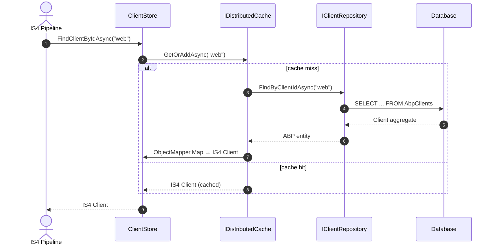

The IdentityServer **domain** project — `Volo.Abp.IdentityServer.Domain` — is the heart of the ABP Framework's IdentityServer4 integration. It owns the aggregate roots, their repository contracts, the adapter classes that satisfy IS4's store interfaces, and the cross-cutting services (`AbpCorsPolicyService`, `AbpProfileService`) that bridge IS4 to ABP's multi-tenancy and identity primitives. This page walks the layer file by file so you can locate the right extension point when you need one.

## Module bootstrap

`Volo.Abp.IdentityServer.AbpIdentityServerDomainModule` is the entry point. It depends on `AbpIdentityServerDomainSharedModule`, `AbpMapperlyModule`, `AbpIdentityDomainModule`, `AbpSecurityModule`, `AbpCachingModule`, `AbpValidationModule` and `AbpBackgroundWorkersModule`. Inside `ConfigureServices` it registers a Mapperly object mapper for the module, declares the four ETO mappings (`ApiResource → ApiResourceEto`, `Client → ClientEto`, `DeviceFlowCodes → DeviceFlowCodesEto`, `IdentityResource → IdentityResourceEto`) on `AbpDistributedEntityEventOptions`, then adds `AbpClaimTypes.TenantId` and `AbpClaimTypes.EditionId` to `AbpClaimsServiceOptions.RequestedClaims`.

The same `ConfigureServices` then calls the private `AddIdentityServer(IServiceCollection)` helper. That helper retrieves the pre-configured `AbpIdentityServerBuilderOptions` (defined in `AbpIdentityServerBuilderOptions.cs`), forwards them into `AddIdentityServer(services, builderOptions)`, and finally calls `identityServerBuilder.AddAbpIdentityServer(builderOptions)` to register the ABP-specific stores. The trailing `if (!services.IsAdded<IClientStore>())` blocks fall back to IS4's in-memory stores when no persistence provider is registered — exactly the path that an EF Core or Mongo module overrides.

## Client aggregate

`Volo.Abp.IdentityServer.Clients.Client` is a `FullAuditedAggregateRoot<Guid>`. It mirrors every property on IS4's runtime `IdentityServer4.Models.Client` and adds child collections. Notable property groups include lifetime fields (`AccessTokenLifetime`, `AuthorizationCodeLifetime`, `IdentityTokenLifetime`, `AbsoluteRefreshTokenLifetime`, `SlidingRefreshTokenLifetime`), front- and back-channel logout fields (`FrontChannelLogoutUri`, `BackChannelLogoutSessionRequired`), and behaviour switches (`Enabled`, `RequirePkce`, `RequireConsent`, `AllowRememberConsent`, `AlwaysIncludeUserClaimsInIdToken`, `AllowOfflineAccess`). The child entity types live in the same folder: `ClientSecret`, `ClientScope`, `ClientGrantType`, `ClientRedirectUri`, `ClientPostLogoutRedirectUri`, `ClientCorsOrigin`, `ClientClaim`, `ClientIdPRestriction` and `ClientProperty`.

The repository contract `IClientRepository : IBasicRepository<Client, Guid>` declares the operations that the IS4 store adapter and the management UI need:

```csharp
Task<Client> FindByClientIdAsync(string clientId, bool includeDetails = true, ...);
Task<List<Client>> GetListAsync(string sorting, int skipCount, int maxResultCount,
                                 string filter = null, bool includeDetails = false, ...);
Task<long> GetCountAsync(string filter = null, ...);
Task<List<string>> GetAllDistinctAllowedCorsOriginsAsync(...);
Task<bool> CheckClientIdExistAsync(string clientId, Guid? expectedId = null, ...);
```

`ClientFinder` (in the same namespace) is a stateless helper that bundles common lookup-by-id semantics so callers do not have to duplicate `OrderBy(ClientId).FirstOrDefaultAsync(...)`.

### Client IS4 adapter

`Volo.Abp.IdentityServer.Clients.ClientStore` implements `IdentityServer4.Stores.IClientStore`. It is constructor-injected with `IClientRepository`, `IObjectMapper<AbpIdentityServerDomainModule>`, `IDistributedCache<IdentityServer4.Models.Client>` and `IOptions<IdentityServerOptions>`. `FindClientByIdAsync` simply calls `GetCacheItemAsync(clientId)` which uses `Cache.GetOrAddAsync` with `Options.Caching.ClientStoreExpiration` as the absolute expiration and `considerUow: true` so reads within an active unit of work see uncommitted writes. The actual mapping from `Client` aggregate to IS4 `Client` runtime model is handled by Mapperly maps declared in `IdentityServerMapperlyMappers`.

## ApiResource aggregate

`Volo.Abp.IdentityServer.ApiResources.ApiResource` is a `FullAuditedAggregateRoot<Guid>` with child collections `ApiResourceSecret`, `ApiResourceClaim`, `ApiResourceScope` and `ApiResourceProperty`. The repository `IApiResourceRepository` exposes the lookups required by IS4 token issuance — `FindByNameAsync` for a single resource, the overload `FindByNameAsync(string[] apiResourceNames, ...)` for batch lookup, `GetListByScopesAsync(string[] scopeNames, ...)` for the `IResourceStore.FindApiResourcesByScopeNameAsync` call path, plus the paged `GetListAsync(sorting, skipCount, maxResultCount, filter, ...)` and `CheckNameExistAsync(name, expectedId)` used by the management UI.

## ApiScope aggregate

`Volo.Abp.IdentityServer.ApiScopes.ApiScope` carries `ApiScopeClaim` and `ApiScopeProperty` children. The repository `IApiScopeRepository` mirrors the ApiResource shape: single `FindByNameAsync(string scopeName, ...)`, batch `GetListByNameAsync(string[] scopeNames, ...)`, paged `GetListAsync(sorting, skipCount, maxResultCount, ...)`, `GetCountAsync` and `CheckNameExistAsync`. The split from `ApiResource` follows the IS4 v4 separation between scopes (what the client requests) and resources (what is included in the access token's audience).

## IdentityResource aggregate and data seeding

`Volo.Abp.IdentityServer.IdentityResources.IdentityResource` aggregates `IdentityResourceClaim` and `IdentityResourceProperty`. Its constructor `IdentityResource(Guid id, IdentityServer4.Models.IdentityResource source)` accepts the IS4 model so seeders can write the standard OpenID Connect scopes without hand-mapping each property.

`IIdentityResourceDataSeeder` exposes a single method `CreateStandardResourcesAsync` implemented by `IdentityResourceDataSeeder`. The implementation iterates `IdentityServer4.Models.IdentityResources.OpenId()`, `.Profile()`, `.Email()`, `.Address()`, `.Phone()` and a hand-crafted `IdentityResource("role", "Roles of the user", new[] {"role"})`. For each, `AddClaimTypeIfNotExistsAsync` first inserts missing `IdentityClaimType` entries through `IIdentityClaimTypeRepository`, then `AddIdentityResourceIfNotExistsAsync` calls `IdentityResourceRepository.CheckNameExistAsync(resource.Name)` and inserts a new `IdentityResource(GuidGenerator.Create(), resource)` when missing.

The repository contract is `IIdentityResourceRepository : IBasicRepository<IdentityResource, Guid>` with `GetListByScopeNameAsync(string[] scopeNames, ...)` for the IS4 store path, paged listing and `CheckNameExistAsync`.

## PersistedGrant aggregate

`Volo.Abp.IdentityServer.Grants.PersistedGrant` stores authorization codes, refresh tokens, reference tokens, user-consent and device-flow user-codes. The repository `IPersistentGrantRepository` declares operations matched 1:1 with the IS4 filter shape:

- `FindByKeyAsync(string key, ...)` — fetch by storage key.
- `GetListAsync(string subjectId, string sessionId, string clientId, string type, ...)` — composite filter used by IS4's `GetAllAsync(PersistedGrantFilter)`.
- `GetListBySubjectIdAsync(string key, ...)` and `GetListByExpirationAsync(DateTime maxExpirationDate, int maxResultCount, ...)` for the cleanup worker.
- `DeleteExpirationAsync(DateTime maxExpirationDate, ...)` — invoked by the `Volo.Abp.IdentityServer.Grants.TokenCleanupService` background worker.
- `DeleteAsync(string subjectId = null, string sessionId = null, string clientId = null, string type = null, ...)` — the destructive companion to `GetListAsync`.

### PersistedGrant IS4 adapter

`Volo.Abp.IdentityServer.Grants.PersistedGrantStore` implements `IdentityServer4.Stores.IPersistedGrantStore`. `StoreAsync` first calls `FindByKeyAsync(grant.Key)`. When the grant is new it maps IS4's `PersistedGrant` to the entity, calls `EntityHelper.TrySetId(entity, () => GuidGenerator.Create())` and inserts; when the grant already exists it maps onto the existing entity and updates. `GetAllAsync(PersistedGrantFilter filter)` delegates to `PersistentGrantRepository.GetListAsync(filter.SubjectId, filter.SessionId, filter.ClientId, filter.Type)` and maps the entire list to IS4 models. `RemoveAllAsync(PersistedGrantFilter filter)` calls the destructive `DeleteAsync` overload.

## Device flow aggregate

`Volo.Abp.IdentityServer.Devices.DeviceFlowCodes` is a `CreationAuditedAggregateRoot<Guid>` with `DeviceCode`, `UserCode`, `SubjectId`, `SessionId`, `ClientId`, `Description`, `Expiration` and a serialized `Data` string. The repository `IDeviceFlowCodesRepository` exposes `FindByUserCodeAsync`, `FindByDeviceCodeAsync`, the cleanup helpers `GetListByExpirationAsync` and `DeleteExpirationAsync`.

### Device flow IS4 adapter

`Volo.Abp.IdentityServer.Devices.DeviceFlowStore` implements `IdentityServer4.Stores.IDeviceFlowStore`. It takes `IDeviceFlowCodesRepository`, `IGuidGenerator` and `IdentityServer4.Stores.Serialization.IPersistentGrantSerializer`. `StoreDeviceAuthorizationAsync(string deviceCode, string userCode, DeviceCode data)` constructs a new aggregate via `new DeviceFlowCodes(GuidGenerator.Create())`, copies the IS4 `DeviceCode` data into properties, computes `Expiration = data.CreationTime.AddSeconds(data.Lifetime)` and persists the serialized payload using `PersistentGrantSerializer`. The find methods deserialize the payload back into a `DeviceCode`.

## The combined resource store

`Volo.Abp.IdentityServer.ResourceStore` is the largest adapter and implements `IdentityServer4.Stores.IResourceStore` on top of three repositories at once: `IIdentityResourceRepository`, `IApiResourceRepository`, `IApiScopeRepository`. It manages four parallel `IDistributedCache<>` instances — `IdentityResourceCache`, `ApiScopeCache`, `ApiResourceCache`, `ApiResourcesCache` — plus a top-level `ResourcesCache` for the combined `GetAllResourcesAsync` call.

Cache keys are prefixed via the constants `IdentityResourceCacheKeyPrefix`, `ApiScopeCacheKeyPrefix`, `ApiResourceNameCacheKeyPrefix` and `ApiResourceScopeNameCacheKeyPrefix`. The private helper `GetCacheItemsAsync(...)` fans out a single call to `IDistributedCache.GetManyAsync` then refills any cache misses through the repository delegate it receives. The `Options.Caching.ResourceStoreExpiration` from `IdentityServerOptions` controls TTL.

## CORS policy services

`Volo.Abp.IdentityServer.AbpCorsPolicyService` implements `IdentityServer4.Services.ICorsPolicyService`. It is constructor-injected with `IDistributedCache<AllowedCorsOriginsCacheItem>`, `IServiceScopeFactory` and `IOptions<IdentityServerOptions>`. `IsOriginAllowedAsync(string origin)` calls `Cache.GetOrAddAsync(AllowedCorsOriginsCacheItem.AllOrigins, CreateCacheItemAsync, Options.Caching.CorsExpiration)` and reports allowed/denied with a log warning on mismatch. `CreateCacheItemAsync` opens an isolated scope to resolve `IClientRepository` and calls `GetAllDistinctAllowedCorsOriginsAsync()`; the explicit scope works around [the early-DI access issue documented in this comment](https://github.com/aspnet/AspNetCore/issues/2377).

`Volo.Abp.IdentityServer.AbpWildcardSubdomainCorsPolicyService` overrides `IsOriginAllowedAsync` to accept wildcard subdomain matches. `Volo.Abp.IdentityServer.AllowedCorsOriginsCacheItemInvalidator` listens to `EntityChangedEventData<Client>` and clears the CORS cache whenever a client mutation occurs.

## Profile service

`Volo.Abp.IdentityServer.AspNetIdentity.AbpProfileService` derives from `IdentityServer4.AspNetIdentity.ProfileService<IdentityUser>` and is constructed with `IdentityUserManager`, `IUserClaimsPrincipalFactory<IdentityUser>` and `ICurrentTenant`. Both overrides (`GetProfileDataAsync(ProfileDataRequestContext)` and `IsActiveAsync(IsActiveContext)`) wrap the base call in `using (CurrentTenant.Change(context.Subject.FindTenantId()))` so that the ABP data-filter pipeline operates in the correct tenant for claim enrichment and active-account checks. The third override `IsUserActiveAsync(IdentityUser)` returns `user.IsActive`, mapping the IS4 contract directly to the ABP Identity flag. The companion `AbpUserClaimsFactory` adds tenant and email-confirmation claims to the principal.

`Volo.Abp.IdentityServer.AspNetIdentity.AbpResourceOwnerPasswordValidator` implements `IdentityServer4.Validation.IResourceOwnerPasswordValidator` so the password grant type honors ABP Identity lockout, two-factor and account-confirmation rules; the helper `SignInResultExtensions` converts `Microsoft.AspNetCore.Identity.SignInResult` outcomes into IS4 `GrantValidationResult` instances.

## Claims service plumbing

`Volo.Abp.IdentityServer.AbpClaimsService` overrides IS4's default `IClaimsService` to layer the `AbpClaimsServiceOptions.RequestedClaims` list into the principal before token issuance. The `AbpIdentityServerDomainModule` constructor seeds that list with `AbpClaimTypes.TenantId` and `AbpClaimTypes.EditionId`, but you can add more in your own module:

```csharp
Configure<AbpClaimsServiceOptions>(options =>
{
    options.RequestedClaims.Add(AbpClaimTypes.UserName);
});
```

## Cache invalidation

`Volo.Abp.IdentityServer.IdentityServerCacheItemInvalidator` is an `ILocalEventHandler<EntityChangedEventData<Client>>` (and similar handlers for `ApiResource`, `ApiScope`, `IdentityResource`). When an aggregate changes, the handler removes the corresponding distributed cache entries so the next `ClientStore` / `ResourceStore` request reloads from the database. The constants `ResourceStore.AllResourcesKey`, `ApiResourceNameCacheKeyPrefix`, `ApiResourceScopeNameCacheKeyPrefix` and `ApiScopeNameCacheKeyPrefix` are exactly the keys it busts.

## Background worker

`Volo.Abp.IdentityServer.Tokens.TokenCleanupBackgroundWorker` (registered automatically because `AbpBackgroundWorkersModule` is a dependency) periodically calls `IPersistentGrantRepository.DeleteExpirationAsync(DateTime.UtcNow, ...)` and `IDeviceFlowCodesRepository.DeleteExpirationAsync(DateTime.UtcNow, ...)` to evict expired grants and device codes. The interval is configurable via `AbpIdentityServerBuilderOptions`.

## Putting the pieces together



The same shape applies to identity resources, API resources, API scopes, persisted grants and device codes — read paths are cache-backed `Get-or-add`, writes go through the repository and are observed by the corresponding `*CacheItemInvalidator`.

## Where to extend

<AccordionGroup>
  <Accordion title="Add a custom client property" icon="plus">
    Subclass `Client`, add the property, override the EF Core entity configuration via `IdentityServerDbContextModelCreatingExtensions.ConfigureIdentityServer` extensions and adjust the `IdentityServerMapperlyMappers` so the property is forwarded to `IdentityServer4.Models.Client`. The store reads through `ObjectMapper.Map<Client, IdentityServer4.Models.Client>`.
  </Accordion>
  <Accordion title="Swap the CORS policy" icon="globe">
    Replace `AbpCorsPolicyService` with `AbpWildcardSubdomainCorsPolicyService` via `services.Replace(ServiceDescriptor.Singleton<ICorsPolicyService, AbpWildcardSubdomainCorsPolicyService>())` in your module's `ConfigureServices`.
  </Accordion>
  <Accordion title="Customize the profile service" icon="user">
    Subclass `AbpProfileService`, override `GetProfileDataAsync` to add bespoke claims, and replace the IS4 registration in `AddAbpIdentityServer`.
  </Accordion>
</AccordionGroup>

## Where each Domain folder lives

```
Volo.Abp.IdentityServer.Domain/
  Volo/Abp/IdentityServer/
    AbpClaimsService.cs
    AbpClaimsServiceOptions.cs
    AbpClientConfigurationValidator.cs
    AbpCorsPolicyService.cs
    AbpIdentityServerBuilderExtensions.cs
    AbpIdentityServerBuilderOptions.cs
    AbpIdentityServerDbProperties.cs
    AbpIdentityServerDomainModule.cs
    AbpIdentityServerServiceCollectionExtensions.cs
    AbpStrictRedirectUriValidator.cs
    AbpWildcardSubdomainCorsPolicyService.cs
    AllowedCorsOriginsCacheItem.cs
    AllowedCorsOriginsCacheItemInvalidator.cs
    AllowedSigningAlgorithmsConverter.cs
    IdentityServerBuilderExtensions.cs
    IdentityServerCacheItemInvalidator.cs
    IdentityServerMapperlyMappers.cs
    ResourceStore.cs
    Secret.cs
    UserClaim.cs
    ApiResources/    (ApiResource + child entities + repository)
    ApiScopes/       (ApiScope + child entities + repository)
    AspNetIdentity/  (AbpProfileService, AbpResourceOwnerPasswordValidator,
                      AbpUserClaimsFactory, SignInResultExtensions)
    Clients/         (Client + child entities + ClientStore + ClientFinder + repository)
    Devices/         (DeviceFlowCodes + DeviceFlowStore + repository)
    Grants/          (PersistedGrant + PersistedGrantStore + repository)
    IdentityResources/ (IdentityResource + IdentityResourceDataSeeder + repository)
    Jwt/             (Signing helpers, AllowedSigningAlgorithmsConverter)
    Tokens/          (Token cleanup background worker pieces)
    Temp/            (in-flight refactoring shims; treat as internal)
```

This skeleton matches the runtime structure of IS4 — each folder maps to one IdentityServer4 store interface — making it easy to find the ABP-specific override for any IS4 abstraction.

## Background workers

Two background workers are registered automatically because `AbpBackgroundWorkersModule` is a dependency:

- `Volo.Abp.IdentityServer.Tokens.TokenCleanupBackgroundWorker` runs `IPersistentGrantRepository.DeleteExpirationAsync(DateTime.UtcNow, ...)` and `IDeviceFlowCodesRepository.DeleteExpirationAsync(DateTime.UtcNow, ...)` periodically. Without it, expired refresh tokens, authorization codes and device codes would accumulate forever.
- `Volo.Abp.IdentityServer.Grants.TokenCleanupService` is the underlying domain service that the worker calls — you can invoke it directly from a test or a manual cleanup endpoint.

The cleanup interval is configured through `AbpIdentityServerBuilderOptions.TokenCleanupInterval` (TimeSpan, default 1 hour) and the batch size through `TokenCleanupBatchSize` (default 100).

## JWT signing pieces

`Volo.Abp.IdentityServer.Jwt` holds the JWT helpers used by `AbpClaimsService` and the IS4 token pipeline:

- `AllowedSigningAlgorithmsConverter` translates between the persisted string (`"RS256,RS384"`) on `Client.AllowedIdentityTokenSigningAlgorithms` and the `ICollection<string>` that IS4 expects.
- `Secret` is the value object representing a hashed client or API secret. The shared `Secret(string value, DateTime? expiration = null)` constructor delegates to `IdentityServer4.Models.HashExtensions.Sha256()` for consistency with IS4's secret store.

## Temp folder

`Volo.Abp.IdentityServer.Temp` is the holding pen for code that is being refactored out of the domain (the folder name predates the v6 OpenIddict migration plan). It currently contains compatibility shims for older host configurations. Treat it as internal; do not depend on types there.

## Distributed events from the domain

`AbpIdentityServerDomainModule.ConfigureServices` declares four ETO mappings on `AbpDistributedEntityEventOptions`:

```csharp
options.EtoMappings.Add<ApiResource,       ApiResourceEto>(typeof(AbpIdentityServerDomainModule));
options.EtoMappings.Add<Client,            ClientEto>(typeof(AbpIdentityServerDomainModule));
options.EtoMappings.Add<DeviceFlowCodes,   DeviceFlowCodesEto>(typeof(AbpIdentityServerDomainModule));
options.EtoMappings.Add<IdentityResource,  IdentityResourceEto>(typeof(AbpIdentityServerDomainModule));
```

`ApiResourceEto`, `ClientEto`, `DeviceFlowCodesEto` and `IdentityResourceEto` live in `Volo.Abp.IdentityServer.Domain.Shared` so other services can take a dependency on the lightweight transport types without dragging the full domain in. When any of these aggregates is created/updated/deleted, ABP's distributed entity event helper translates the local event into the matching ETO and publishes it through `IDistributedEventBus`. Microservices can therefore react to "the host added a new client" by subscribing to `IDistributedEventHandler<ClientEto>` instead of querying the IdentityServer database.

`ClientDeletedEventHandler` from the `Volo.Abp.PermissionManagement.Domain.IdentityServer` companion package is one such subscriber — it listens for `EntityDeletedEventData<Client>` and removes orphan permission grants whose `ProviderName == ClientPermissionValueProvider.ProviderName` and `ProviderKey == deletedClientId`.

## Mapperly-driven mapping

`Volo.Abp.IdentityServer.IdentityServerMapperlyMappers` is the partial class generated by Mapperly that contains every two-way mapping between the ABP aggregates and the IS4 runtime types. The relevant signatures include:

```csharp
partial Client                                  Map(IdentityServer4.Models.Client source);
partial IdentityServer4.Models.Client           Map(Client source);
partial ApiResource                             Map(IdentityServer4.Models.ApiResource source);
partial IdentityServer4.Models.ApiResource      Map(ApiResource source);
/* ... and so on for IdentityResource, ApiScope, PersistedGrant, DeviceCode */
```

The generated mappings are how `ClientStore.FindClientByIdAsync`, `ResourceStore.GetAllResourcesAsync`, `PersistedGrantStore.StoreAsync` and `DeviceFlowStore.StoreDeviceAuthorizationAsync` translate between the two type universes. Extending an aggregate with a new property does *not* automatically propagate to the IS4 runtime model — you must add a partial mapper override or rebuild the Mapperly source.

## Builder configuration

`AbpIdentityServerBuilderOptions` (declared in `Volo.Abp.IdentityServer.Domain`) is a pre-configurable options object:

```csharp
public class AbpIdentityServerBuilderOptions
{
    public bool   IsDynamicClaimsEnabled            { get; set; }
    public bool   AddDeveloperSigningCredential     { get; set; } = true;
    public bool   UpdateAbpClaimTypes               { get; set; } = true;
    public bool   AbpProfileServiceEnabled          { get; set; } = true;
    public bool   AbpClaimsServiceEnabled           { get; set; } = true;
    public bool   AbpUserClaimsFactoryEnabled       { get; set; } = true;
    public bool   AbpResourceOwnerPasswordValidatorEnabled { get; set; } = true;
    public bool   AbpCorsPolicyServiceEnabled       { get; set; } = true;
    public bool   AbpStrictRedirectUriValidatorEnabled    { get; set; } = true;
    /* ... */
}
```

Tweak it with `PreConfigure<AbpIdentityServerBuilderOptions>(o => o.AddDeveloperSigningCredential = false;)` from your host module. The `AddIdentityServer` helper in `AbpIdentityServerDomainModule` reads each flag once at startup to decide whether to install the corresponding ABP override or let IS4's default win.

## Extension method `AbpIdentityServerBuilderExtensions.AddAbpIdentityServer`

This extension (in `Volo.Abp.IdentityServer.AbpIdentityServerBuilderExtensions`) is the workhorse that flips the IS4 service registrations to the ABP variants. Schematically it does:

```csharp
public static IIdentityServerBuilder AddAbpIdentityServer(
    this IIdentityServerBuilder builder, AbpIdentityServerBuilderOptions options)
{
    if (options.AbpProfileServiceEnabled)             builder.Services.Replace<IProfileService,    AbpProfileService>();
    if (options.AbpClaimsServiceEnabled)              builder.Services.Replace<IClaimsService,     AbpClaimsService>();
    if (options.AbpResourceOwnerPasswordValidatorEnabled)
                                                       builder.Services.Replace<IResourceOwnerPasswordValidator, AbpResourceOwnerPasswordValidator>();
    if (options.AbpUserClaimsFactoryEnabled)          builder.Services.Replace<IUserClaimsPrincipalFactory<IdentityUser>, AbpUserClaimsFactory>();
    if (options.AbpCorsPolicyServiceEnabled)          builder.Services.Replace<ICorsPolicyService, AbpCorsPolicyService>();
    if (options.AbpStrictRedirectUriValidatorEnabled) builder.Services.Replace<IRedirectUriValidator, AbpStrictRedirectUriValidator>();

    return builder;
}
```

Each toggle gives you a clean override seam. Disable a flag if your host needs to keep the IS4 default — for example, set `AbpCorsPolicyServiceEnabled = false` if you wire your own `ICorsPolicyService`.

## Where to extend

<AccordionGroup>
  <Accordion title="Add a custom client property" icon="plus">
    Subclass `Client`, add the property, override the EF Core entity configuration via `IdentityServerDbContextModelCreatingExtensions.ConfigureIdentityServer` extensions and adjust the `IdentityServerMapperlyMappers` so the property is forwarded to `IdentityServer4.Models.Client`. The store reads through `ObjectMapper.Map<Client, IdentityServer4.Models.Client>`.
  </Accordion>
  <Accordion title="Swap the CORS policy" icon="globe">
    Replace `AbpCorsPolicyService` with `AbpWildcardSubdomainCorsPolicyService` via `services.Replace(ServiceDescriptor.Singleton<ICorsPolicyService, AbpWildcardSubdomainCorsPolicyService>())` in your module's `ConfigureServices`.
  </Accordion>
  <Accordion title="Customize the profile service" icon="user">
    Subclass `AbpProfileService`, override `GetProfileDataAsync` to add bespoke claims, and replace the IS4 registration in `AddAbpIdentityServer`.
  </Accordion>
  <Accordion title="Pre-warm the cache" icon="fire">
    Implement a background worker that calls `ClientStore.FindClientByIdAsync(clientId)` for each known client at startup so the first real request hits a warm `IDistributedCache<IdentityServer4.Models.Client>` entry.
  </Accordion>
  <Accordion title="Tighten redirect URI validation" icon="shield">
    Subclass `AbpStrictRedirectUriValidator` and override `IsRedirectUriValidAsync` to enforce additional rules (allow-list domains, mandatory HTTPS) before delegating to `base`.
  </Accordion>
</AccordionGroup>

Continue to [Persistence](/module-identityserver/persistence) for the EF Core and MongoDB sides of the same aggregates.
