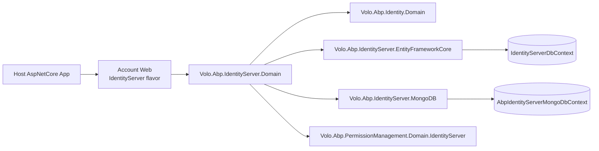

The **IdentityServer module** is the ABP Framework's historical OAuth 2.0 / OpenID Connect host. It wraps the [IdentityServer4](https://github.com/IdentityServer/IdentityServer4) library with ABP-native domain entities, repositories, caching, distributed events, and EF Core + MongoDB persistence so that clients, scopes and grants can be edited at runtime instead of being hard-coded into `Startup`. The packages live under `modules/identityserver/src` and are wired together by `AbpIdentityServerDomainModule` in `Volo.Abp.IdentityServer.Domain`.

<Warning>
**IdentityServer4 is end-of-life.** ABP has replaced this module with the [OpenIddict module](/module-openiddict/overview) in the default startup templates. The packages described on this page are still shipped, still receive maintenance fixes, and still power existing solutions, but new projects should adopt OpenIddict. `AbpIdentityServerDomainModule.AddIdentityServer` keeps the IS4 builder pipeline alive precisely so that older solutions continue to upgrade cleanly.
</Warning>

## Where the module sits in a solution

`AbpIdentityServerDomainModule` depends on `AbpIdentityDomainModule` (the ABP Identity user/role aggregate), `AbpCachingModule`, `AbpSecurityModule`, `AbpValidationModule`, `AbpBackgroundWorkersModule` and `AbpMapperlyModule`. The dependency on Identity is what enables `Volo.Abp.IdentityServer.AspNetIdentity.AbpProfileService` to surface ABP `IdentityUser` claims into IdentityServer profile and `IsActive` callbacks under the correct `ICurrentTenant`.



## Package map

The module is delivered as six NuGet packages, all under the `modules/identityserver/src` folder and the `Volo.Abp.IdentityServer.*` namespace family:

<CardGroup cols={2}>
  <Card title="Domain.Shared" icon="cube">
    `Volo.Abp.IdentityServer.Domain.Shared` — constants, localization resources, error codes and `AbpIdentityServerDbProperties` that names the connection string and DB prefix shared by EF and Mongo.
  </Card>
  <Card title="Domain" icon="layer-group">
    `Volo.Abp.IdentityServer.Domain` — aggregate roots (`Client`, `ApiResource`, `ApiScope`, `IdentityResource`, `PersistedGrant`, `DeviceFlowCodes`), repositories, IS4 store adapters and `AbpIdentityServerDomainModule`.
  </Card>
  <Card title="EntityFrameworkCore" icon="database">
    `Volo.Abp.IdentityServer.EntityFrameworkCore` — `IdentityServerDbContext`, EF repository implementations, and `IdentityServerDbContextModelCreatingExtensions` for schema configuration.
  </Card>
  <Card title="MongoDB" icon="leaf">
    `Volo.Abp.IdentityServer.MongoDB` — `AbpIdentityServerMongoDbContext`, `Mongo*Repository` implementations and `AbpIdentityServerMongoDbContextExtensions` for collection mapping.
  </Card>
  <Card title="Installer" icon="box">
    `Volo.Abp.IdentityServer.Installer` — embedded NuGet metadata used by the ABP CLI when adding the module to an existing solution.
  </Card>
  <Card title="PermissionMgmt.IdentityServer" icon="key">
    `Volo.Abp.PermissionManagement.Domain.IdentityServer` — `ClientPermissionManagementProvider` and `ClientResourcePermissionManagementProvider` that let you grant permissions to a `Client.ClientId`.
  </Card>
</CardGroup>

## What `AbpIdentityServerDomainModule` does at startup

`AbpIdentityServerDomainModule.ConfigureServices` wires three things and only three things, keeping the IS4 builder swappable:

1. **Object mapper.** `context.Services.AddMapperlyObjectMapper<AbpIdentityServerDomainModule>()` registers the Mapperly-generated maps declared in `IdentityServerMapperlyMappers` between the ABP entities and IS4's `IdentityServer4.Models.*` runtime models. This is what allows `ClientStore.FindClientByIdAsync` to map a persisted `Client` aggregate to an `IdentityServer4.Models.Client`.
2. **Distributed entity event ETOs.** Inside `Configure<AbpDistributedEntityEventOptions>` the module maps `ApiResource`, `Client`, `DeviceFlowCodes` and `IdentityResource` aggregates to `ApiResourceEto`, `ClientEto`, `DeviceFlowCodesEto` and `IdentityResourceEto` so that microservice consumers can react to changes without taking a direct dependency on the IS4 schema.
3. **Claim service requests.** `Configure<AbpClaimsServiceOptions>` adds `AbpClaimTypes.TenantId` and `AbpClaimTypes.EditionId` to `RequestedClaims` so that ABP's `AbpClaimsService` always issues tenant and edition information to access tokens.

After that, the private `AddIdentityServer(context.Services)` helper builds the actual IS4 pipeline by calling `services.ExecutePreConfiguredActions<AbpIdentityServerBuilderOptions>()`, then `AddIdentityServer(services, builderOptions)`, then `identityServerBuilder.AddAbpIdentityServer(builderOptions)`. Each branch ends with a defensive `services.IsAdded<TStore>` check that only registers the in-memory fallback when no other persistence module has already been loaded — the same pattern lets the EF Core or Mongo modules override silently.

## Aggregate roots provided by the module

<AccordionGroup>
  <Accordion title="Client" icon="address-card">
    Defined in `Volo.Abp.IdentityServer.Clients.Client`. A `FullAuditedAggregateRoot<Guid>` with every IS4 setting promoted to a property — `ClientId`, `ClientName`, `RequirePkce`, `AllowRememberConsent`, `IdentityTokenLifetime`, `AccessTokenLifetime`, child collections of `ClientSecret`, `ClientScope`, `ClientGrantType`, `ClientRedirectUri`, `ClientPostLogoutRedirectUri`, `ClientCorsOrigin`, `ClientClaim`, `ClientIdPRestriction` and `ClientProperty`.
  </Accordion>
  <Accordion title="ApiResource and ApiScope" icon="server">
    `Volo.Abp.IdentityServer.ApiResources.ApiResource` aggregates `ApiResourceSecret`, `ApiResourceClaim`, `ApiResourceScope` and `ApiResourceProperty`. `Volo.Abp.IdentityServer.ApiScopes.ApiScope` carries `ApiScopeClaim` and `ApiScopeProperty`. The two are separate aggregates because IS4 v4 split scopes out of resources.
  </Accordion>
  <Accordion title="IdentityResource" icon="id-badge">
    `Volo.Abp.IdentityServer.IdentityResources.IdentityResource` holds `IdentityResourceClaim` and `IdentityResourceProperty` and is seeded by `IdentityResourceDataSeeder.CreateStandardResourcesAsync` with `openid`, `profile`, `email`, `address`, `phone` and `role`.
  </Accordion>
  <Accordion title="PersistedGrant" icon="ticket">
    `Volo.Abp.IdentityServer.Grants.PersistedGrant` is the storage shape of authorization codes, refresh tokens, reference tokens and consents. The `IPersistentGrantRepository` exposes the `Key`, `Type`, `SubjectId`, `ClientId`, `SessionId` lookups used by IS4.
  </Accordion>
  <Accordion title="DeviceFlowCodes" icon="mobile">
    `Volo.Abp.IdentityServer.Devices.DeviceFlowCodes` stores OAuth 2.0 device authorization flow user codes and device codes. The repository contract is `IDeviceFlowCodesRepository`.
  </Accordion>
</AccordionGroup>

## IS4 store adapters

ABP plugs into IS4 by implementing the IS4 store interfaces in the domain module and registering them inside `AbpIdentityServerBuilderExtensions.AddAbpIdentityServer`. The adapters all live in `Volo.Abp.IdentityServer`:

- `Volo.Abp.IdentityServer.Clients.ClientStore` implements `IdentityServer4.Stores.IClientStore`. Its `FindClientByIdAsync` calls `IClientRepository.FindByClientIdAsync` and caches the IS4 `Client` model via `IDistributedCache<IdentityServer4.Models.Client>` using `IdentityServerOptions.Caching.ClientStoreExpiration`.
- `Volo.Abp.IdentityServer.ResourceStore` implements `IdentityServer4.Stores.IResourceStore` for identity resources, API scopes and API resources, each fronted by its own `IDistributedCache<>` keyed by `IdentityResourceCacheKeyPrefix`, `ApiScopeCacheKeyPrefix`, `ApiResourceNameCacheKeyPrefix` and `ApiResourceScopeNameCacheKeyPrefix`.
- `Volo.Abp.IdentityServer.Grants.PersistedGrantStore` implements `IdentityServer4.Stores.IPersistedGrantStore` and delegates to `IPersistentGrantRepository`, calling `EntityHelper.TrySetId` for new grants.
- `Volo.Abp.IdentityServer.Devices.DeviceFlowStore` implements `IdentityServer4.Stores.IDeviceFlowStore` for the device flow.
- `Volo.Abp.IdentityServer.AbpCorsPolicyService` implements `IdentityServer4.Services.ICorsPolicyService` by pulling all distinct CORS origins from `IClientRepository.GetAllDistinctAllowedCorsOriginsAsync` and caching them in an `AllowedCorsOriginsCacheItem`. `AbpWildcardSubdomainCorsPolicyService` is the alternate implementation that allows `*.subdomain.example` patterns.

## Cross-cutting services

`Volo.Abp.IdentityServer.AspNetIdentity.AbpProfileService` derives from `IdentityServer4.AspNetIdentity.ProfileService<IdentityUser>` and wraps both `GetProfileDataAsync` and `IsActiveAsync` in `using (CurrentTenant.Change(context.Subject.FindTenantId()))` so the right tenant filter is active when claims are gathered. Its sibling `AbpUserClaimsFactory` plugs ABP `IdentityUser` into the claims principal pipeline.

`AbpClaimsService` and `AbpClaimsServiceOptions` decide which claims are requested for tokens; `AbpClientConfigurationValidator` and `AbpStrictRedirectUriValidator` enforce client configuration rules; `IdentityServerCacheItemInvalidator` and `AllowedCorsOriginsCacheItemInvalidator` listen to ABP entity change events to invalidate the distributed caches when a `Client` or scope changes.

## Persistence story

Either EF Core or MongoDB can stand behind the domain. Both providers ship full repository implementations and a dedicated DbContext:

| Provider | DbContext | Repositories |
| --- | --- | --- |
| EF Core | `IdentityServerDbContext : AbpDbContext<IdentityServerDbContext>, IIdentityServerDbContext` | `ClientRepository`, `ApiResourceRepository`, `ApiScopeRepository`, `IdentityResourceRepository`, `PersistentGrantRepository`, `DeviceFlowCodesRepository` |
| MongoDB | `AbpIdentityServerMongoDbContext : AbpMongoDbContext, IAbpIdentityServerMongoDbContext` | `MongoClientRepository`, `MongoApiResourceRepository`, `MongoApiScopeRepository`, `MongoIdentityResourceRepository`, `MongoPersistentGrantRepository`, `MongoDeviceFlowCodesRepository` |

Both DbContexts are decorated with `[IgnoreMultiTenancy]` and `[ConnectionStringName(AbpIdentityServerDbProperties.ConnectionStringName)]` — IdentityServer data is host-side and lives under the `AbpIdentityServer` connection string. See [Persistence](/module-identityserver/persistence) for the schema and migration details.

## Data seeding

The IdentityServer flavor exposes `IIdentityResourceDataSeeder` with a single method `CreateStandardResourcesAsync`. The default `IdentityResourceDataSeeder` registers OpenID Connect standard resources by iterating `IdentityServer4.Models.IdentityResources.OpenId`, `.Profile`, `.Email`, `.Address`, `.Phone` and the custom `"role"` resource, inserting them through `IIdentityResourceRepository.InsertAsync` while also seeding any missing `IdentityClaimType` rows via `IIdentityClaimTypeRepository`. Clients, scopes and API resources are usually seeded by application-specific `IDataSeedContributor` implementations because they vary per deployment.

## Permission management on Clients

The companion package `Volo.Abp.PermissionManagement.Domain.IdentityServer` lets you treat an IS4 `Client` as a permission subject:

- `ClientPermissionManagementProvider` inherits from `PermissionManagementProvider` and overrides the `Name` getter to return `ClientPermissionValueProvider.ProviderName` (`"C"` in the framework). Every grant/revoke operation is wrapped in `using (CurrentTenant.Change(null))` so client grants are always stored host-side.
- `ClientResourcePermissionManagementProvider` is the resource-permission flavor — it short-circuits `IsAvailableAsync` to host-only and reuses the same `CurrentTenant.Change(null)` pattern.
- `ClientResourcePermissionProviderKeyLookupService` exposes the client list to the resource-permission UI search box.
- `ClientDeletedEventHandler` listens to `EntityDeletedEventData<Client>` and removes orphan permission grants for the disappearing `ClientId`.

These providers are wired into the framework's `IPermissionManagementProvider` chain by the module class `AbpPermissionManagementDomainIdentityServerModule`.

## When to keep this module

Keep this module if you have a production solution still authenticating against the IdentityServer4 endpoints and your migration window has not arrived. Plan to retire it as part of the OpenIddict migration — see [OpenIddict overview](/module-openiddict/overview) — because IdentityServer4 itself is no longer receiving security fixes from its original maintainers. The ABP-side wrappers in `Volo.Abp.IdentityServer.*` will continue to be patched only for security-relevant issues.

## Connection string and DB prefix

`Volo.Abp.IdentityServer.AbpIdentityServerDbProperties` is the constants holder shared by both persistence providers:

```csharp
public static class AbpIdentityServerDbProperties
{
    public static string DbTablePrefix     { get; set; } = "Abp";
    public static string DbSchema          { get; set; } = null;
    public const  string ConnectionStringName = "AbpIdentityServer";
}
```

Setting `DbTablePrefix = ""` on host startup is what produces an unprefixed `Clients`, `ApiResources`, `IdentityResources` schema — useful when migrating from a stock IdentityServer4 sample that uses no prefix. Note the static mutable properties: change them once during module pre-config, not at runtime.

## Localization and error codes

`Volo.Abp.IdentityServer.Domain.Shared/Volo/Abp/IdentityServer/Localization/AbpIdentityServerResource.cs` is the canonical localization resource type. Error codes are declared in `AbpIdentityServerErrorCodes` and surface through `BusinessException`s — for example `Volo.Abp.IdentityServer:DuplicateClientId` is thrown by `AbpClientConfigurationValidator` when a client is being created with an existing `ClientId`.

`AbpClientConfigurationValidator` (in `Volo.Abp.IdentityServer.Clients`) is registered automatically and runs before each `IClientRepository.InsertAsync` to guarantee that:

- The client identifier is unique through `IClientRepository.CheckClientIdExistAsync(clientId, expectedId)`.
- The grant types are coherent (`AuthorizationCode` implies `RedirectUris`, `ClientCredentials` implies `ClientSecrets`, etc.).
- Lifetimes are positive integers.

## Background workers

Because `AbpIdentityServerDomainModule` depends on `AbpBackgroundWorkersModule`, the host gets a free `TokenCleanupBackgroundWorker` (in `Volo.Abp.IdentityServer.Tokens`) that periodically calls `IPersistentGrantRepository.DeleteExpirationAsync(DateTime.UtcNow, ...)` and `IDeviceFlowCodesRepository.DeleteExpirationAsync(DateTime.UtcNow, ...)` so that `PersistedGrants` and `DeviceFlowCodes` stay bounded.

## When to keep this module

Keep this module if you have a production solution still authenticating against the IdentityServer4 endpoints and your migration window has not arrived. Plan to retire it as part of the OpenIddict migration — see [OpenIddict overview](/module-openiddict/overview) — because IdentityServer4 itself is no longer receiving security fixes from its original maintainers. The ABP-side wrappers in `Volo.Abp.IdentityServer.*` will continue to be patched only for security-relevant issues.

## Mapping from OpenIddict — quick reference

| IdentityServer concept | OpenIddict equivalent | Where covered |
| --- | --- | --- |
| `Client` | `OpenIddictApplication` | [OpenIddict Domain](/module-openiddict/domain) |
| `ApiResource` + `ApiScope` | `OpenIddictScope` | [OpenIddict Domain](/module-openiddict/domain) |
| `IdentityResource` | Static scopes registered by `AbpOpenIddictServerBuilder` | [OpenIddict Domain](/module-openiddict/domain) |
| `PersistedGrant` | `OpenIddictToken` + `OpenIddictAuthorization` | [OpenIddict Persistence](/module-openiddict/persistence) |
| `DeviceFlowCodes` | (Stored in `OpenIddictToken` with `Type = "device_code"`) | [OpenIddict Persistence](/module-openiddict/persistence) |

The split between `ApiResource` and `ApiScope` collapses in OpenIddict because the OAuth 2.1 Audience model handles resource binding through scope properties rather than separate entities. Migration tooling for existing IS4 data is documented in the ABP migration guides under `docs/en/guides/migration`.

<Tip>
The next two pages explore the same packages in depth: [Domain](/module-identityserver/domain) walks the aggregates, repositories, stores, profile service and CORS policy in detail. [Persistence](/module-identityserver/persistence) covers `IdentityServerDbContext`, the EF Core / Mongo repositories and the schema configuration extension method `ConfigureIdentityServer`.
</Tip>

## How the module participates in the IS4 builder pipeline

`AbpIdentityServerDomainModule.AddIdentityServer(IServiceCollection)` is the private static helper that performs the wiring. The pseudo-code shape is:

```csharp
private static void AddIdentityServer(IServiceCollection services)
{
    var configuration  = services.GetConfiguration();
    var builderOptions = services.ExecutePreConfiguredActions<AbpIdentityServerBuilderOptions>();

    var identityServerBuilder = AddIdentityServer(services, builderOptions);

    if (builderOptions.AddDeveloperSigningCredential)
        identityServerBuilder = identityServerBuilder.AddDeveloperSigningCredential();

    identityServerBuilder.AddAbpIdentityServer(builderOptions);

    services.ExecutePreConfiguredActions(identityServerBuilder);

    if (!services.IsAdded<IPersistedGrantService>())
        services.TryAddSingleton<IPersistedGrantStore, InMemoryPersistedGrantStore>();

    if (!services.IsAdded<IDeviceFlowStore>())
        services.TryAddSingleton<IDeviceFlowStore, InMemoryDeviceFlowStore>();

    if (!services.IsAdded<IClientStore>())
        identityServerBuilder.AddInMemoryClients(configuration.GetSection("IdentityServer:Clients"));

    if (!services.IsAdded<IResourceStore>())
    {
        identityServerBuilder.AddInMemoryApiResources(configuration.GetSection("IdentityServer:ApiResources"));
        identityServerBuilder.AddInMemoryIdentityResources(configuration.GetSection("IdentityServer:IdentityResources"));
    }
}
```

The `ExecutePreConfiguredActions<IIdentityServerBuilder>` call is what lets `AbpIdentityServerEntityFrameworkCoreModule.PreConfigureServices` (or its Mongo twin) call `builder.AddAbpStores()` to register the database-backed stores. Once those stores are present, the trailing `if (!services.IsAdded<IClientStore>())` blocks become no-ops, and the in-memory fallback is silently skipped. This pattern means a host can add or remove persistence providers as a one-line `[DependsOn]` change without rewriting startup code.

## Caching layout

Every read path through this module routes through `IDistributedCache<T>` to keep the IS4 token pipeline fast. The keys and types are:

| Cache `T` | Owner | TTL source |
| --- | --- | --- |
| `IdentityServer4.Models.Client` | `ClientStore` | `IdentityServerOptions.Caching.ClientStoreExpiration` |
| `IdentityServer4.Models.IdentityResource` | `ResourceStore` | `IdentityServerOptions.Caching.ResourceStoreExpiration` |
| `IdentityServer4.Models.ApiScope` | `ResourceStore` | `IdentityServerOptions.Caching.ResourceStoreExpiration` |
| `IdentityServer4.Models.ApiResource` | `ResourceStore` | `IdentityServerOptions.Caching.ResourceStoreExpiration` |
| `IEnumerable<IdentityServer4.Models.ApiResource>` | `ResourceStore` | `IdentityServerOptions.Caching.ResourceStoreExpiration` |
| `IdentityServer4.Models.Resources` | `ResourceStore` | `IdentityServerOptions.Caching.ResourceStoreExpiration` |
| `AllowedCorsOriginsCacheItem` | `AbpCorsPolicyService` | `IdentityServerOptions.Caching.CorsExpiration` |

`IdentityServerCacheItemInvalidator` and `AllowedCorsOriginsCacheItemInvalidator` listen for `EntityChangedEventData<Client>` (and matching aggregates) to remove the relevant entries — the cache is therefore eventually consistent within a single host process and consistent on the next read across replicas if you back `IDistributedCache` with Redis.

## Aggregate aggregate-root family (cheat sheet)

When debugging an IS4 endpoint, it helps to know which ABP aggregate maps to which IS4 store interface. The mapping is:

| IS4 store interface | ABP store adapter | ABP aggregate | Repository |
| --- | --- | --- | --- |
| `IClientStore` | `Volo.Abp.IdentityServer.Clients.ClientStore` | `Client` | `IClientRepository` |
| `IResourceStore` | `Volo.Abp.IdentityServer.ResourceStore` | `IdentityResource`, `ApiResource`, `ApiScope` | three repositories |
| `IPersistedGrantStore` | `Volo.Abp.IdentityServer.Grants.PersistedGrantStore` | `PersistedGrant` | `IPersistentGrantRepository` |
| `IDeviceFlowStore` | `Volo.Abp.IdentityServer.Devices.DeviceFlowStore` | `DeviceFlowCodes` | `IDeviceFlowCodesRepository` |
| `ICorsPolicyService` | `Volo.Abp.IdentityServer.AbpCorsPolicyService` | (reads `Client.AllowedCorsOrigins`) | `IClientRepository.GetAllDistinctAllowedCorsOriginsAsync` |
| `IProfileService` | `Volo.Abp.IdentityServer.AspNetIdentity.AbpProfileService` | (reads `Volo.Abp.Identity.IdentityUser`) | `IdentityUserManager` |
| `IResourceOwnerPasswordValidator` | `AbpResourceOwnerPasswordValidator` | (validates against `IdentityUser`) | `IdentityUserManager` |
| `IClaimsService` | `AbpClaimsService` | (composes claims from `AbpClaimsServiceOptions.RequestedClaims`) | n/a |

This is what makes the IS4 endpoint code unaware that any of the data is database-backed — the framework simply asks IS4 for the store contract, and gets back the ABP adapter.

## Sample host module

The companion package `Volo.Abp.PermissionManagement.Domain.IdentityServer` should be loaded alongside the persistence module so that the host-side permission tree exposes the per-client grant editor. Without it, the management UI shows only User and Role provider columns. The module's own `AbpPermissionManagementDomainIdentityServerModule` simply adds `ClientPermissionManagementProvider` and `ClientResourcePermissionManagementProvider` to `PermissionManagementOptions.ManagementProviders` and `ResourceManagementProviders` respectively.

A minimal host module that brings up IdentityServer on top of EF Core, plus the matching Account flavor, looks like the following snippet:

```csharp
[DependsOn(
    typeof(AbpIdentityServerDomainModule),
    typeof(AbpIdentityServerEntityFrameworkCoreModule),
    typeof(AbpIdentityServerHttpApiModule),                  // optional, not in this folder
    typeof(AbpAccountWebIdentityServerModule),               // account UI flavor
    typeof(AbpPermissionManagementDomainIdentityServerModule)
)]
public class MyAuthServerModule : AbpModule
{
    public override void PreConfigureServices(ServiceConfigurationContext context)
    {
        PreConfigure<AbpIdentityServerBuilderOptions>(o =>
        {
            o.AddDeveloperSigningCredential = false;
        });
    }
}
```

`AbpAccountWebIdentityServerModule` is the matching account-flow UI from the Account module — it implements the consent screen, the login/logout pages and the device-flow user-code screen on top of the IS4 endpoints registered by this module.

The `PreConfigure<AbpIdentityServerBuilderOptions>` call disables IS4's development signing credential so the host can plug in its own certificate via `services.AddSingleton<ISigningCredentialStore>(...)` or one of the IS4 helper extensions (`AddSigningCredential(X509Certificate2)`).

## At-a-glance file map

<AccordionGroup>
  <Accordion title="Domain.Shared" icon="cube">
    `AbpIdentityServerDbProperties`, `AbpIdentityServerErrorCodes`, `Localization/AbpIdentityServerResource`, child entity consts (`ClientConsts`, `ClientRedirectUriConsts`, `ClientGrantTypeConsts`, `IdentityResourceConsts`, `ApiResourceConsts`, `ApiScopeConsts`, `PersistedGrantConsts`, `DeviceFlowCodesConsts`).
  </Accordion>
  <Accordion title="Domain" icon="layer-group">
    Aggregate folders `ApiResources/`, `ApiScopes/`, `Clients/`, `Devices/`, `Grants/`, `IdentityResources/`. Cross-cutting types `AbpClaimsService`, `AbpCorsPolicyService`, `AbpWildcardSubdomainCorsPolicyService`, `AbpStrictRedirectUriValidator`, `AbpClientConfigurationValidator`. The Mapperly mappers `IdentityServerMapperlyMappers`. Tokens folder with `TokenCleanupService` and the background worker.
  </Accordion>
  <Accordion title="EntityFrameworkCore" icon="database">
    `IdentityServerDbContext`, `IIdentityServerDbContext`, `IdentityServerDbContextModelCreatingExtensions`, `AbpIdentityServerEfCoreQueryableExtensions` (the `IncludeDetails` chain), and one repository per aggregate.
  </Accordion>
  <Accordion title="MongoDB" icon="leaf">
    `AbpIdentityServerMongoDbContext`, `IAbpIdentityServerMongoDbContext`, `AbpIdentityServerMongoDbContextExtensions` (collection names), and one `Mongo*Repository` per aggregate.
  </Accordion>
  <Accordion title="Installer" icon="box">
    Just embedded NuGet metadata (`Resources/Volo.Abp.IdentityServer.Installer/abp.nupkg`) so the ABP CLI's `abp add-module Volo.Abp.IdentityServer` command can resolve the right version.
  </Accordion>
  <Accordion title="PermissionManagement.Domain.IdentityServer" icon="key">
    `ClientPermissionManagementProvider`, `ClientResourcePermissionManagementProvider`, `ClientResourcePermissionProviderKeyLookupService`, `ClientDeletedEventHandler`, `AbpPermissionManagementDomainIdentityServerModule`.
  </Accordion>
</AccordionGroup>
