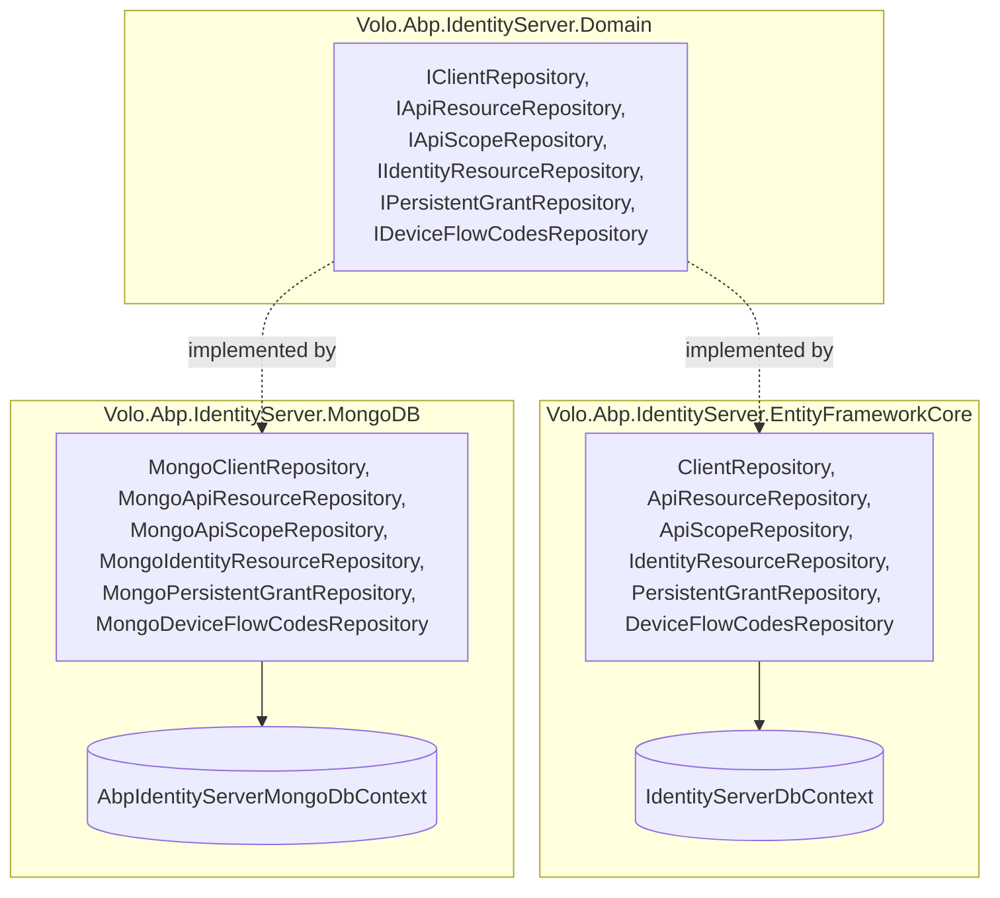
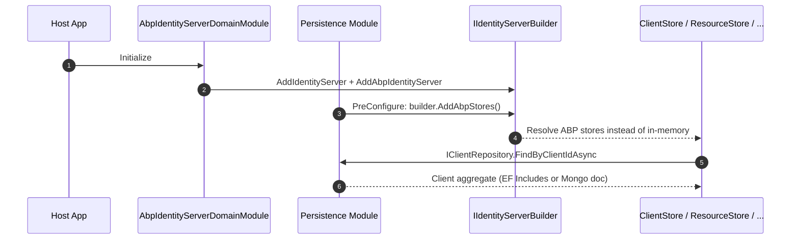

The ABP Framework ships two interchangeable persistence providers for the IdentityServer module. **Volo.Abp.IdentityServer.EntityFrameworkCore** maps the aggregates to a relational schema with `IdentityServerDbContext`, and **Volo.Abp.IdentityServer.MongoDB** maps the same aggregates to MongoDB collections with `AbpIdentityServerMongoDbContext`. Both providers register `AddAbpStores()` onto IS4's `IIdentityServerBuilder` during `PreConfigureServices`, replacing the in-memory fallback that `AbpIdentityServerDomainModule` installs by default.

## Provider parity at a glance



Pick one. Both attach to the same `Volo.Abp.IdentityServer.Domain` aggregates, so application code (and the IS4 store adapters covered in [Domain](/module-identityserver/domain)) is provider-agnostic.

## Entity Framework Core provider

`Volo.Abp.IdentityServer.EntityFrameworkCore.AbpIdentityServerEntityFrameworkCoreModule` depends on `AbpIdentityServerDomainModule` and `AbpEntityFrameworkCoreModule`. Its `PreConfigureServices` registers a pre-configuration action against `IIdentityServerBuilder` that calls `builder.AddAbpStores()`. That extension lives in `Volo.Abp.IdentityServer.IdentityServerBuilderExtensions` and registers `ClientStore`, `ResourceStore`, `PersistedGrantStore`, `DeviceFlowStore`, `AbpCorsPolicyService` and the ABP profile/claims services into IS4's pipeline. Because `AbpIdentityServerDomainModule.AddIdentityServer` guards its in-memory fallbacks with `services.IsAdded<TStore>()` checks, those in-memory stores simply never get registered when the EF provider is present.

### DbContext

`Volo.Abp.IdentityServer.EntityFrameworkCore.IdentityServerDbContext` extends `AbpDbContext<IdentityServerDbContext>` and implements `IIdentityServerDbContext`. Two attributes shape its behaviour:

```csharp
[IgnoreMultiTenancy]
[ConnectionStringName(AbpIdentityServerDbProperties.ConnectionStringName)]
public class IdentityServerDbContext : AbpDbContext<IdentityServerDbContext>, IIdentityServerDbContext
```

`[IgnoreMultiTenancy]` tells `AbpDbContext` not to apply the `IMultiTenant` filter — IdentityServer data is host-side. `[ConnectionStringName]` binds reads/writes to the `"AbpIdentityServer"` connection string declared by `AbpIdentityServerDbProperties.ConnectionStringName`.

The context exposes one `DbSet<>` per aggregate or child entity:

| Aggregate | DbSets |
| --- | --- |
| ApiResource | `ApiResources`, `ApiResourceSecrets`, `ApiResourceClaims`, `ApiResourceScopes`, `ApiResourceProperties` |
| ApiScope | `ApiScopes`, `ApiScopeClaims`, `ApiScopeProperties` |
| Client | `Clients`, `ClientCorsOrigins`, `ClientGrantTypes`, `ClientIdPRestrictions`, `ClientPostLogoutRedirectUris`, `ClientProperties`, `ClientRedirectUris`, `ClientScopes`, `ClientSecrets`, `ClientClaims` |
| IdentityResource | `IdentityResources`, `IdentityClaims`, `IdentityResourceProperties` |
| Devices / Grants | `DeviceFlowCodes`, `PersistedGrants` |

The override `OnModelCreating(ModelBuilder builder)` calls `base.OnModelCreating(builder)` then the extension `builder.ConfigureIdentityServer()` defined in `IdentityServerDbContextModelCreatingExtensions`. The model-creating extension is the single place where every table name, column length and child relationship is configured — see "Schema configuration" below.

### Repository registration

`ConfigureServices` adds the DbContext via `AddAbpDbContext<IdentityServerDbContext>` and registers default and named repositories:

```csharp
context.Services.AddAbpDbContext<IdentityServerDbContext>(options =>
{
    options.AddDefaultRepositories<IIdentityServerDbContext>();
    options.AddRepository<Client, ClientRepository>();
    options.AddRepository<ApiResource, ApiResourceRepository>();
    options.AddRepository<ApiScope, ApiScopeRepository>();
    options.AddRepository<IdentityResource, IdentityResourceRepository>();
    options.AddRepository<PersistedGrant, PersistentGrantRepository>();
    options.AddRepository<DeviceFlowCodes, DeviceFlowCodesRepository>();
});
```

The `AddDefaultRepositories<IIdentityServerDbContext>()` call registers `IRepository<T>` and `IRepository<T, Guid>` for every aggregate, while each `AddRepository<T, TImpl>()` line registers the specialized contract — `IClientRepository → ClientRepository` and so on — so that calling code can take the richer interface.

### Repository implementations

Each repository in `Volo.Abp.IdentityServer.EntityFrameworkCore` extends `EfCoreRepository<IIdentityServerDbContext, TEntity, Guid>`. `ClientRepository.FindByClientIdAsync` shows the pattern:

```csharp
return await (await GetDbSetAsync())
    .IncludeDetails(includeDetails)
    .OrderBy(x => x.ClientId)
    .FirstOrDefaultAsync(x => x.ClientId == clientId, GetCancellationToken(cancellationToken));
```

`IncludeDetails(includeDetails)` is an extension defined in `AbpIdentityServerEfCoreQueryableExtensions` that pulls in every child collection (`AllowedScopes`, `ClientSecrets`, `AllowedGrantTypes`, `AllowedCorsOrigins`, `RedirectUris`, `PostLogoutRedirectUris`, `IdentityProviderRestrictions`, `Claims`, `Properties`) with `ThenInclude` chains so the IS4 store adapter receives a fully-populated aggregate. The same extension is also defined for `ApiResource`, `ApiScope` and `IdentityResource`.

Listing queries use ABP's `WhereIf` / `PageBy` extensions and `System.Linq.Dynamic.Core` for runtime `OrderBy(sorting)` — for example `ClientRepository.GetListAsync` falls back to `nameof(Client.ClientName)` when no sort key is supplied.

`PersistentGrantRepository.GetListAsync(string subjectId, string sessionId, string clientId, string type, ...)` chains the filter parameters with `WhereIf` so that any combination can be passed by IS4's `PersistedGrantFilter`:

```csharp
return await (await GetDbSetAsync())
    .WhereIf(!subjectId.IsNullOrWhiteSpace(), x => x.SubjectId == subjectId)
    .WhereIf(!sessionId.IsNullOrWhiteSpace(), x => x.SessionId == sessionId)
    .WhereIf(!clientId.IsNullOrWhiteSpace(),  x => x.ClientId  == clientId)
    .WhereIf(!type.IsNullOrWhiteSpace(),      x => x.Type      == type)
    .ToListAsync(GetCancellationToken(cancellationToken));
```

`DeleteAsync` with the same parameter set runs `DeleteAsync` against the matching entities.

### Schema configuration

`Volo.Abp.IdentityServer.EntityFrameworkCore.IdentityServerDbContextModelCreatingExtensions.ConfigureIdentityServer(this ModelBuilder builder)` configures every table. The shape is consistent:

```csharp
builder.Entity<Client>(b =>
{
    b.ToTable(AbpIdentityServerDbProperties.DbTablePrefix + "Clients",
              AbpIdentityServerDbProperties.DbSchema);

    b.ConfigureByConvention();

    b.Property(x => x.ClientId).HasMaxLength(ClientConsts.ClientIdMaxLength).IsRequired();
    b.Property(x => x.ProtocolType).HasMaxLength(ClientConsts.ProtocolTypeMaxLength).IsRequired();
    /* ... */

    b.HasMany(x => x.AllowedScopes).WithOne().HasForeignKey(x => x.ClientId).IsRequired();
    b.HasMany(x => x.ClientSecrets).WithOne().HasForeignKey(x => x.ClientId).IsRequired();
    /* ... */

    b.HasIndex(x => x.ClientId);
    b.ApplyObjectExtensionMappings();
});
```

The early `if (builder.IsTenantOnlyDatabase()) return;` guard means a tenant-only DbContext skips registering IdentityServer tables entirely — only the host database carries IdentityServer data. The table prefix `Abp` (configurable via `AbpIdentityServerDbProperties.DbTablePrefix`) creates `AbpClients`, `AbpClientGrantTypes`, `AbpClientRedirectUris`, etc. Composite keys are configured on the child entities, e.g. `b.HasKey(x => new { x.ClientId, x.GrantType })` for `ClientGrantType`. The `b.ApplyObjectExtensionMappings()` call activates ABP's object-extending pipeline so consumers can add fields to existing tables.

A small dialect tweak — `IsDatabaseProvider(builder, EfCoreDatabaseProvider.MySql)` — shortens redirect URI length to 300 characters because MySQL's default index page size cannot accommodate the framework default. The same `IsDatabaseProvider` helper is used in similar guards for other long-text columns.

### Migrations

The EF Core module is wired through `Volo.Abp.IdentityServer.EntityFrameworkCore` so consumer hosts run a single `dotnet ef migrations add ...` against their own combined DbContext to materialize the IdentityServer tables. The `[IgnoreMultiTenancy]` attribute lets `IdentityServerDbContext` share a database with tenant-scoped contexts safely because the tables receive no `TenantId` filter — they're host-only.

## MongoDB provider

`Volo.Abp.IdentityServer.MongoDB.AbpIdentityServerMongoDbModule` mirrors the EF module's responsibilities:

```csharp
[DependsOn(typeof(AbpIdentityServerDomainModule), typeof(AbpMongoDbModule))]
public class AbpIdentityServerMongoDbModule : AbpModule
{
    public override void PreConfigureServices(ServiceConfigurationContext context)
    {
        context.Services.PreConfigure<IIdentityServerBuilder>(b => b.AddAbpStores());
    }
    public override void ConfigureServices(ServiceConfigurationContext context)
    {
        context.Services.AddMongoDbContext<AbpIdentityServerMongoDbContext>(options =>
        {
            options.AddRepository<ApiResource, MongoApiResourceRepository>();
            options.AddRepository<ApiScope, MongoApiScopeRepository>();
            options.AddRepository<IdentityResource, MongoIdentityResourceRepository>();
            options.AddRepository<Client, MongoClientRepository>();
            options.AddRepository<PersistedGrant, MongoPersistentGrantRepository>();
            options.AddRepository<DeviceFlowCodes, MongoDeviceFlowCodesRepository>();
        });
    }
}
```

### MongoDB context

`AbpIdentityServerMongoDbContext` extends `AbpMongoDbContext` and implements `IAbpIdentityServerMongoDbContext`. It uses the same attributes — `[IgnoreMultiTenancy]` and `[ConnectionStringName(AbpIdentityServerDbProperties.ConnectionStringName)]` — so the host-side connection string remains shared between providers. Each aggregate is exposed as a typed `IMongoCollection<>`:

```csharp
public IMongoCollection<ApiResource>       ApiResources       => Collection<ApiResource>();
public IMongoCollection<ApiScope>          ApiScopes          => Collection<ApiScope>();
public IMongoCollection<Client>            Clients            => Collection<Client>();
public IMongoCollection<IdentityResource>  IdentityResources  => Collection<IdentityResource>();
public IMongoCollection<PersistedGrant>    PersistedGrants    => Collection<PersistedGrant>();
public IMongoCollection<DeviceFlowCodes>   DeviceFlowCodes    => Collection<DeviceFlowCodes>();
```

The override `CreateModel(IMongoModelBuilder modelBuilder)` calls `base.CreateModel(modelBuilder)` then `modelBuilder.ConfigureIdentityServer()` from `AbpIdentityServerMongoDbContextExtensions`. That extension assigns collection names with the same `Abp` prefix: `b.CollectionName = AbpIdentityServerDbProperties.DbTablePrefix + "Clients"`, and similarly for `ApiResources`, `ApiScopes`, `IdentityResources`, `PersistedGrants` and `DeviceFlowCodes`.

### Mongo repositories

Each repository in `Volo.Abp.IdentityServer.MongoDB` extends `MongoDbRepository<IAbpIdentityServerMongoDbContext, TEntity, Guid>`. `MongoClientRepository.FindByClientIdAsync` keeps a parallel shape to the EF version:

```csharp
return await (await GetQueryableAsync(cancellationToken))
    .OrderBy(x => x.Id)
    .FirstOrDefaultAsync(x => x.ClientId == clientId, GetCancellationToken(cancellationToken));
```

Because MongoDB stores the aggregate as a single document, there is no `IncludeDetails` extension — child collections are part of the BSON document. The `includeDetails` parameter is therefore accepted on the interface but ignored in the Mongo implementation. Paged listing follows the same `WhereIf(!filter.IsNullOrWhiteSpace(), ...).OrderBy(sorting.IsNullOrWhiteSpace() ? ... : sorting).Skip(skipCount).Take(maxResultCount)` shape using `System.Linq.Dynamic.Core` for runtime sort expressions.

`MongoPersistentGrantRepository` translates the same `subjectId / sessionId / clientId / type` filter set into Mongo `WhereIf` predicates. `DeleteExpirationAsync(DateTime maxExpirationDate, ...)` calls `DeleteAsync(x => x.Expiration < maxExpirationDate)` so the periodic cleanup worker can purge stale grants and codes.

### Caveats for MongoDB

Because IS4's `IClientStore`, `IResourceStore`, `IPersistedGrantStore` and `IDeviceFlowStore` only need read operations on top of these repositories, the providers behave identically from IS4's perspective. A few practical differences worth recording:

<AccordionGroup>
  <Accordion title="No relational FKs" icon="link-slash">
    Mongo stores the aggregate as a self-contained document, so deleting a `Client` does not cascade through separate collections — the children are already gone. EF Core relies on `OnDelete(DeleteBehavior.Cascade)` declared via `HasForeignKey(x => x.ClientId).IsRequired()`.
  </Accordion>
  <Accordion title="Schema migrations" icon="database">
    Mongo has no migration concept — `ConfigureIdentityServer(IMongoModelBuilder)` simply names the collections. EF Core requires running `dotnet ef migrations add` whenever the model creating extension changes.
  </Accordion>
  <Accordion title="Indexes" icon="filter">
    EF Core declares `b.HasIndex(x => x.ClientId)` on the Clients table and similar indexes on `ApiResources.Name`, `ApiScopes.Name`, `PersistedGrants.Key`. The equivalents for Mongo should be created at deployment time via `IMongoCollection.Indexes.CreateOne` calls or an index-management script.
  </Accordion>
</AccordionGroup>

## End-to-end flow



The takeaway: persistence selection is a single module reference. Add `AbpIdentityServerEntityFrameworkCoreModule` to your host module's `[DependsOn]` list to pick EF Core, or `AbpIdentityServerMongoDbModule` to pick MongoDB. Everything above the repository contract — the IS4 stores, the CORS service, the profile service, the cache invalidators — stays the same.

## Repository surface reminder

Both providers ship identical implementations of these six contracts from the domain layer:

- `IClientRepository` — `FindByClientIdAsync`, `GetListAsync`, `GetCountAsync`, `GetAllDistinctAllowedCorsOriginsAsync`, `CheckClientIdExistAsync`.
- `IApiResourceRepository` — `FindByNameAsync` (single + batch), `GetListByScopesAsync`, `GetListAsync`, `GetCountAsync`, `CheckNameExistAsync`.
- `IApiScopeRepository` — `FindByNameAsync`, `GetListByNameAsync`, `GetListAsync`, `GetCountAsync`, `CheckNameExistAsync`.
- `IIdentityResourceRepository` — `GetListByScopeNameAsync`, `GetListAsync`, `GetCountAsync`, `FindByNameAsync`, `CheckNameExistAsync`.
- `IPersistentGrantRepository` — `FindByKeyAsync`, `GetListAsync(subjectId, sessionId, clientId, type, ...)`, `GetListByExpirationAsync`, `DeleteExpirationAsync`, `DeleteAsync(...)`.
- `IDeviceFlowCodesRepository` — `FindByUserCodeAsync`, `FindByDeviceCodeAsync`, `GetListByExpirationAsync`, `DeleteExpirationAsync`.

Each EF method uses `WhereIf`, `OrderBy(sorting)` (via `System.Linq.Dynamic.Core`), `PageBy(skipCount, maxResultCount)` and `IncludeDetails(includeDetails)`; each Mongo method uses `WhereIf`, `OrderBy(sorting)` and `Skip / Take` directly.

## Repository registration recap

Both providers follow the same registration pattern, which is worth highlighting because it is identical for every ABP module that ships EF Core + Mongo packages:

1. `[DependsOn(typeof(<DomainModule>), typeof(<EFOrMongoModule>))]` declares the upstream dependency.
2. `PreConfigureServices` mutates options that have to be set before the framework's `ConfigureServices` runs — in IdentityServer's case, calling `builder.AddAbpStores()` on the `IIdentityServerBuilder` to flip the IS4 store registrations.
3. `ConfigureServices` calls `AddAbpDbContext<TContext>(options => ...)` or `AddMongoDbContext<TContext>(options => ...)` and inside the lambda registers `AddDefaultRepositories<TInterface>()` plus one `AddRepository<TEntity, TImpl>()` per specialized repository.

Following this convention means switching providers is a one-line module swap in the host's `[DependsOn]` list, as long as the connection string and schema layout match.

## Querying tips

`Volo.Abp.IdentityServer.EntityFrameworkCore.AbpIdentityServerEfCoreQueryableExtensions` declares `IncludeDetails` overloads for `IQueryable<Client>`, `IQueryable<ApiResource>`, `IQueryable<ApiScope>` and `IQueryable<IdentityResource>`. The `Client` variant looks like:

```csharp
public static IQueryable<Client> IncludeDetails(this IQueryable<Client> queryable, bool include = true)
{
    if (!include) return queryable;
    return queryable
        .Include(x => x.AllowedScopes)
        .Include(x => x.AllowedGrantTypes)
        .Include(x => x.AllowedCorsOrigins)
        .Include(x => x.RedirectUris)
        .Include(x => x.PostLogoutRedirectUris)
        .Include(x => x.ClientSecrets)
        .Include(x => x.Claims)
        .Include(x => x.IdentityProviderRestrictions)
        .Include(x => x.Properties);
}
```

Calling `await ClientRepository.GetQueryableAsync()` from a custom query lets you compose your own LINQ over the IdentityServer schema while still benefiting from the same eager-loading chain.

## Mixing with other modules

Because both `IdentityServerDbContext` and `AbpIdentityServerMongoDbContext` are `[IgnoreMultiTenancy]` and share `AbpIdentityServerDbProperties.ConnectionStringName = "AbpIdentityServer"`, the IdentityServer schema can live in:

- The **same host database** as Identity, Permission Management, Setting Management and Audit Logging — share the connection string via `ConfigureAll<AbpDbContextOptions>(...)` or per-context.
- A **dedicated database**, by setting `"ConnectionStrings:AbpIdentityServer"` in `appsettings.json`. ABP's `IConnectionStringResolver` reads that key first and falls back to `Default`.

In microservice solutions you typically want the dedicated-database option so that the IdentityServer host scales independently. The same applies to MongoDB — set the connection string under `"ConnectionStrings:AbpIdentityServer"` for either provider.

## Replacing the persistence provider

To swap EF Core for MongoDB on a running solution:

1. Remove the `AbpIdentityServerEntityFrameworkCoreModule` dependency from your host module.
2. Add `AbpIdentityServerMongoDbModule` instead.
3. Update `appsettings.json` to point the `AbpIdentityServer` connection string at MongoDB.
4. Export the existing data via the EF context, transform `Client.AllowedScopes`, `Client.RedirectUris`, etc., into the embedded-document shape, and bulk-insert into the `AbpClients`, `AbpApiResources`, `AbpApiScopes`, `AbpIdentityResources`, `AbpPersistedGrants`, `AbpDeviceFlowCodes` collections.

The `Volo.Abp.IdentityServer.Installer` package's metadata is irrelevant to this swap — it only influences the ABP CLI when first adding the module.

## Health-check ideas

A production deployment should at minimum:

- Ping `IClientRepository.GetCountAsync()` from a startup probe so the host fails fast if the IdentityServer schema is missing.
- Monitor `PersistedGrant` table/collection size — runaway growth indicates the `TokenCleanupBackgroundWorker` is not running.
- Track `AbpCorsPolicyService` cache hit ratio via `IDistributedCache<AllowedCorsOriginsCacheItem>` — frequent misses can identify a stale cache invalidator.

<Tip>
For a deeper look at the aggregates, their child entities and the IS4 adapter classes, see [Domain](/module-identityserver/domain). For the overall package map and the OpenIddict successor, return to [Overview](/module-identityserver/overview).
</Tip>
