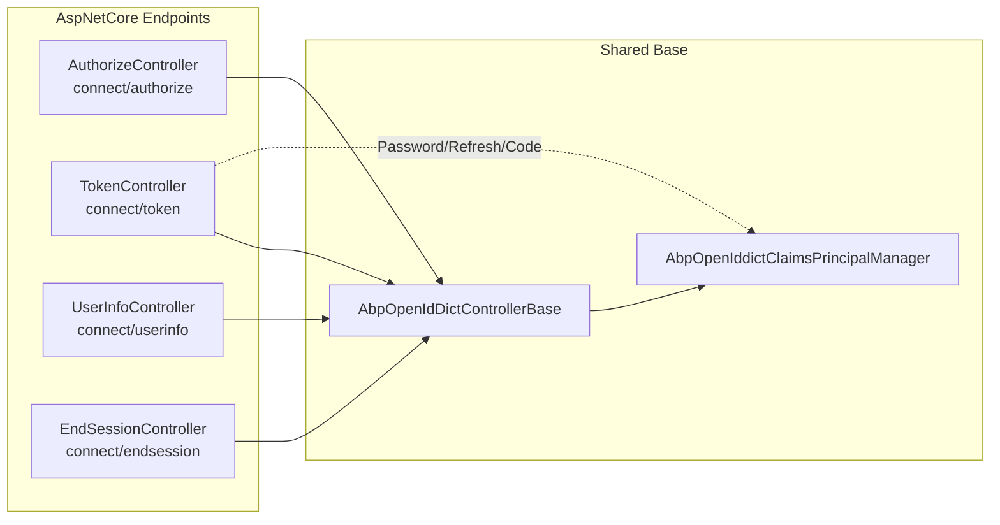
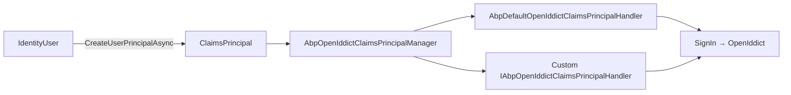
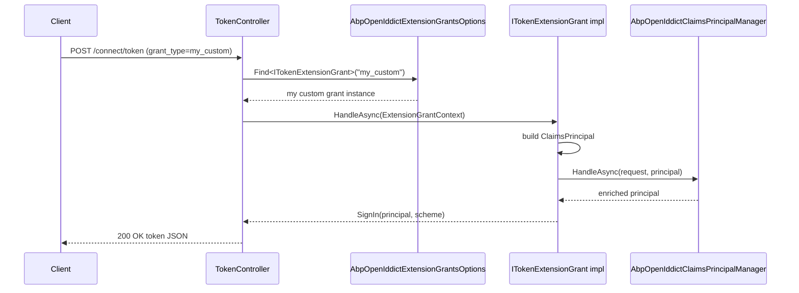

The **AspNetCore layer** of the ABP Framework's OpenIddict module turns the [OpenIddict server](https://documentation.openiddict.com/) into a fully-wired ASP.NET Core authorization server: HTTP endpoints, MVC controllers, view models, claims transformation, wildcard redirect handling, and pluggable custom grant types. All code in this page sits under `modules/openiddict/src/Volo.Abp.OpenIddict.AspNetCore/Volo/Abp/OpenIddict/` (with a couple of files in `Microsoft/AspNetCore/Builder/` and `Microsoft/Extensions/DependencyInjection/` to provide stable extension-method namespaces).

## Module Bootstrapping

`AbpOpenIddictAspNetCoreModule` lives in `Volo/Abp/OpenIddict/AbpOpenIddictAspNetCoreModule.cs` and is the only entry point host projects need. Its `[DependsOn]` set:

- `AbpAspNetCoreMvcUiThemeSharedModule` — to register the Razor view-engine path and gain the theme infrastructure used by the consent view.
- `AbpAspNetCoreMultiTenancyModule` — so tenant resolution runs before `TokenController` resolves `ITenantConfigurationProvider`.
- `AbpOpenIddictDomainModule` — domain layer described in the [Domain page](/module-openiddict/domain).

Inside `ConfigureServices` the module:

1. Calls `AddOpenIddictServer(context.Services)` (described below).
2. Configures `AbpOpenIddictClaimsPrincipalOptions` to add `AbpDefaultOpenIddictClaimsPrincipalHandler` to `ClaimsPrincipalHandlers`.
3. Extends `RazorViewEngineOptions.ViewLocationFormats` with `"/Volo/Abp/OpenIddict/Views/{1}/{0}.cshtml"` so the consent UI in `Volo/Abp/OpenIddict/Views/Authorize/` is discoverable when the package is consumed as a NuGet (the views live as embedded `*.cshtml` resources).

## AbpOpenIddictBuilder (the AddOpenIddictServer Call)

`AddOpenIddictServer` invokes `services.ExecutePreConfiguredActions<AbpOpenIddictAspNetCoreOptions>()` to snapshot the options into a local variable before configuring OpenIddict. The options class is `Volo/Abp/OpenIddict/AbpOpenIddictOptions.cs`:

```csharp
public class AbpOpenIddictAspNetCoreOptions
{
    public bool UpdateAbpClaimTypes { get; set; } = true;
    public bool AddDevelopmentEncryptionAndSigningCertificate { get; set; } = true;
    public bool AttachCultureInfo { get; set; } = true;
    public string SelectAccountPage { get; set; } = "~/Account/SelectAccount";
}
```

When `UpdateAbpClaimTypes` is true, the module rewrites the static `AbpClaimTypes` keys to OpenIddict's wire names:

| ABP claim alias            | OpenIddict claim                              |
| -------------------------- | --------------------------------------------- |
| `AbpClaimTypes.UserId`     | `OpenIddictConstants.Claims.Subject`          |
| `AbpClaimTypes.Role`       | `OpenIddictConstants.Claims.Role`             |
| `AbpClaimTypes.UserName`   | `OpenIddictConstants.Claims.PreferredUsername`|
| `AbpClaimTypes.Name`       | `OpenIddictConstants.Claims.GivenName`        |
| `AbpClaimTypes.SurName`    | `OpenIddictConstants.Claims.FamilyName`       |
| `AbpClaimTypes.PhoneNumber`| `OpenIddictConstants.Claims.PhoneNumber`      |
| `AbpClaimTypes.Email`      | `OpenIddictConstants.Claims.Email`            |
| `AbpClaimTypes.ClientId`   | `OpenIddictConstants.Claims.ClientId`         |

This guarantees that an authenticated `HttpContext.User` and a downstream API consumer see the same claim names regardless of whether authentication arrived via cookies or via a JWT bearer token.

### Endpoint URIs

Inside the `builder => { ... }` configuration of `services.AddOpenIddict().AddServer(...)`:

```csharp
builder
    .SetAuthorizationEndpointUris("connect/authorize", "connect/authorize/callback")
    .SetDeviceAuthorizationEndpointUris("device")
    .SetIntrospectionEndpointUris("connect/introspect")
    .SetEndSessionEndpointUris("connect/endsession")
    .SetPushedAuthorizationEndpointUris("connect/par")
    .SetRevocationEndpointUris("connect/revocat")
    .SetTokenEndpointUris("connect/token")
    .SetUserInfoEndpointUris("connect/userinfo")
    .SetEndUserVerificationEndpointUris("connect/verify");
```

The discovery document at `/.well-known/openid-configuration` is left to the OpenIddict defaults — the commented-out `.SetConfigurationEndpointUris()` line in the source is a hook for overriding it.

### Allowed Flows

Every standard flow is enabled by default:

```csharp
builder
    .AllowAuthorizationCodeFlow()
    .AllowHybridFlow()
    .AllowImplicitFlow()
    .AllowPasswordFlow()
    .AllowClientCredentialsFlow()
    .AllowRefreshTokenFlow()
    .AllowDeviceAuthorizationFlow()
    .AllowNoneFlow()
    .AllowTokenExchangeFlow();
```

To restrict flows (e.g., disable password grant in production), call `services.PreConfigure<OpenIddictServerBuilder>(b => b.AcceptAnonymousClients())` style overrides during host setup — `services.ExecutePreConfiguredActions(builder)` is run twice (once for the inner builder, once for the outer pre-configured actions on the `OpenIddictBuilder`), so any modification is composable.

### ASP.NET Core Integration

```csharp
builder.UseAspNetCore()
    .EnableAuthorizationEndpointPassthrough()
    .EnableTokenEndpointPassthrough()
    .EnableUserInfoEndpointPassthrough()
    .EnableEndSessionEndpointPassthrough()
    .EnableEndUserVerificationEndpointPassthrough()
    .EnableStatusCodePagesIntegration();
```

`EnableTokenEndpointPassthrough` is the line that makes the routing system hand `/connect/token` to MVC instead of letting OpenIddict produce the response itself — which is what allows the partial `TokenController` class to exist.

### Development Certificates

If `AbpOpenIddictAspNetCoreOptions.AddDevelopmentEncryptionAndSigningCertificate` is true the module calls `builder.AddDevelopmentEncryptionCertificate().AddDevelopmentSigningCertificate()`. For production deployments, the helper `OpenIddictServerBuilderExtensions.AddProductionEncryptionAndSigningCertificate` in `Microsoft/Extensions/DependencyInjection/OpenIddictServerBuilderExtensions.cs` loads a PKCS#12 file:

```csharp
var certificate = flag != null
    ? X509CertificateLoader.LoadPkcs12FromFile(fileName, passPhrase, flag.Value)
    : X509CertificateLoader.LoadPkcs12FromFile(fileName, passPhrase);
builder.AddSigningCertificate(certificate);
builder.AddEncryptionCertificate(certificate);
```

It throws a `FileNotFoundException` when the certificate path is wrong, which is intentional — the surrounding configuration usually reads the path from `IConfiguration` and a missing path is a deployment bug.

Note `builder.DisableAccessTokenEncryption()` near the end of the configuration: ABP issues unencrypted JWT access tokens by default so that downstream APIs can validate them with the standard JWT bearer middleware without holding the encryption key.

## Validation Middleware

`Microsoft/AspNetCore/Builder/ApplicationBuilderAbpOpenIddictMiddlewareExtension.cs` provides:

```csharp
public static IApplicationBuilder UseAbpOpenIddictValidation(this IApplicationBuilder app,
    string schema = OpenIddictValidationAspNetCoreDefaults.AuthenticationScheme)
{
    return app.Use(async (ctx, next) =>
    {
        if (ctx.User.Identity?.IsAuthenticated != true)
        {
            var result = await ctx.AuthenticateAsync(schema);
            if (result.Succeeded && result.Principal != null)
            {
                ctx.User = result.Principal;
            }
        }
        await next();
    });
}
```

Resource APIs add `app.UseAbpOpenIddictValidation()` to the request pipeline after `UseAuthentication()` to bridge OpenIddict validation results into `HttpContext.User` when the developer prefers not to rely on `[Authorize]` for every controller.

## Endpoint Controllers



### AbpOpenIdDictControllerBase

The shared base `Volo/Abp/OpenIddict/Controllers/AbpOpenIdDictControllerBase.cs` derives from `AbpController` and `LazyServiceProvider`-resolves the OpenIddict managers and Identity collaborators:

- `SignInManager<IdentityUser>` and `IdentityUserManager` from `Volo.Abp.Identity`.
- `IOpenIddictApplicationManager`, `IOpenIddictAuthorizationManager`, `IOpenIddictScopeManager`, `IOpenIddictTokenManager` — these resolve to the `Abp*Manager` overrides registered by the Domain layer.
- `AbpOpenIddictClaimsPrincipalManager` and `IAbpClaimsPrincipalFactory`.

`GetOpenIddictServerRequestAsync(HttpContext)` calls `HttpContext.GetOpenIddictServerRequest()` and throws with the localized message `TheOpenIDConnectRequestCannotBeRetrieved` if the request was not bound by OpenIddict's middleware. `GetResourcesAsync(ImmutableArray<string> scopes)` iterates `ScopeManager.ListResourcesAsync` to compute the `aud` claim. `PreSignInCheckAsync(IdentityUser user)` short-circuits on inactive, non-sign-in-able, or locked-out accounts.

### TokenController

`Volo/Abp/OpenIddict/Controllers/TokenController.cs` is decorated with `[Route("connect/token")]`, `[IgnoreAntiforgeryToken]` and `[ApiExplorerSettings(IgnoreApi = true)]` so it stays out of Swagger. The single `HandleAsync` action inspects the OpenIddict request and dispatches to a partial method per grant type:

```csharp
if (request.IsPasswordGrantType())          return await HandlePasswordAsync(request);
if (request.IsAuthorizationCodeGrantType()) return await HandleAuthorizationCodeAsync(request);
if (request.IsRefreshTokenGrantType())      return await HandleRefreshTokenAsync(request);
if (request.IsDeviceCodeGrantType())        return await HandleDeviceCodeAsync(request);
if (request.IsClientCredentialsGrantType()) return await HandleClientCredentialsAsync(request);
if (request.IsTokenExchangeGrantType())     return await HandleTokenExchangeGrantTypeAsync(request);

var extensionGrantsOptions = HttpContext.RequestServices
    .GetRequiredService<IOptions<AbpOpenIddictExtensionGrantsOptions>>();
var extensionTokenGrant = extensionGrantsOptions.Value.Find<ITokenExtensionGrant>(request.GrantType);
if (extensionTokenGrant != null)
{
    return await extensionTokenGrant.HandleAsync(new ExtensionGrantContext(HttpContext, request));
}
throw new AbpException(string.Format(L["TheSpecifiedGrantTypeIsNotImplemented"], request.GrantType));
```

The partial files implement the handlers:

| Partial file                                                                | Implements                                                                                                                                                                                  |
| --------------------------------------------------------------------------- | ------------------------------------------------------------------------------------------------------------------------------------------------------------------------------------------- |
| `Controllers/TokenController.Password.cs`                                   | `HandlePasswordAsync`, `SetSuccessResultAsync`, `IsTfaEnabledAsync`, `ReplaceEmailToUsernameOfInputIfNeeds`, `HandleTwoFactorLoginAsync`, `HandleShouldChangePasswordOnNextLoginAsync`, etc. |
| `Controllers/TokenController.AuthorizationCode.cs`                          | `HandleAuthorizationCodeAsync` — authenticates against the OpenIddict scheme, rebuilds the principal, calls `OpenIddictClaimsPrincipalManager.HandleAsync`.                                  |
| `Controllers/TokenController.RefreshToken.cs`                               | `HandleRefreshTokenAsync` — validates the prior principal then re-emits.                                                                                                                    |
| `Controllers/TokenController.DeviceCode.cs`                                 | `HandleDeviceCodeAsync` and the `/device` verification view binding.                                                                                                                        |
| `Controllers/TokenController.ClientCredentials.cs`                          | `HandleClientCredentialsAsync` — anonymous (no user) flow; relies on `RemoveClaimsFromClientCredentialsGrantType` event handler to clean user-bound claims.                                  |
| `Controllers/TokenController.TokenExchange.cs`                              | `HandleTokenExchangeGrantTypeAsync` — RFC 8693 act-as / on-behalf-of.                                                                                                                       |

#### Password Flow Detail

`HandlePasswordAsync` (in `Controllers/TokenController.Password.cs`) wraps the body in `using var scope = ServiceScopeFactory.CreateScope()` and `using (CurrentTenant.Change(tenant?.Id))` after resolving the tenant from `ITenantConfigurationProvider.GetAsync(saveResolveResult: false)`. Then:

1. `ReplaceEmailToUsernameOfInputIfNeeds(request)` — if the username looks like an email, swap it for the matched user's username.
2. Iterate `AbpIdentityOptions.Value.ExternalLoginProviders` and let any matching provider try `TryAuthenticateAsync` / `CreateUserAsync` / `UpdateUserAsync`.
3. `UserManager.FindByNameAsync(request.Username)` — if null, log to `IdentitySecurityLogManager` with `OpenIddictSecurityLogActionConsts.LoginInvalidUserName` and `Forbid` with `OpenIddictConstants.Errors.InvalidGrant`.
4. `SignInManager.CheckPasswordSignInAsync(user, request.Password, lockoutOnFailure: true)`.
5. On `IsLockedOut` → return `AbpOpenIddictErrors.AccountLocked`. On `IsNotAllowed` → branch into "should change password", "periodically change password", "confirm user", or `AbpOpenIddictErrors.AccountInactive`.
6. On success, call `IsTfaEnabledAsync(user)` and branch into `HandleTwoFactorLoginAsync` if needed.
7. Final success path calls `SetSuccessResultAsync(request, user)`.

`SetSuccessResultAsync`:

- Clears the dynamic-claims cache via `IdentityDynamicClaimsPrincipalContributorCache.ClearAsync(user.Id, user.TenantId)`.
- Builds the principal with `SignInManager.CreateUserPrincipalAsync(user)`.
- Sets the `AbpClaimTypes.RememberMe` claim when `request.GetParameter("RememberMe")` is `"True"`.
- `principal.SetScopes(request.GetScopes())` and `principal.SetResources(await GetResourcesAsync(request.GetScopes()))`.
- `await OpenIddictClaimsPrincipalManager.HandleAsync(request, principal)` — the chain through `AbpOpenIddictClaimsPrincipalHandlers`.
- Updates `user.SetLastSignInTime(DateTimeOffset.UtcNow)` and persists via `UserManager.UpdateAsync(user)`.
- Returns `SignIn(principal, OpenIddictServerAspNetCoreDefaults.AuthenticationScheme)` — OpenIddict's middleware then turns that into a token response.

#### Two-Factor Flow

`HandleTwoFactorLoginAsync` understands two parameter shapes from the client:

- `RecoveryCode` → `UserManager.RedeemTwoFactorRecoveryCodeAsync`.
- `TwoFactorProvider` + `TwoFactorCode` → `UserManager.VerifyTwoFactorTokenAsync`.

If neither is present it returns `Forbid` with `AbpErrorDescriptionConsts.RequiresTwoFactor`, carrying `userId` and a `twoFactorToken` generated via `UserManager.GenerateUserTokenAsync(user, TokenOptions.DefaultProvider, "RequiresTwoFactor")` in the `AuthenticationProperties.Parameters` bag — the SPA reads these to switch UI to the 2FA prompt.

### AuthorizeController

`Volo/Abp/OpenIddict/Controllers/AuthorizeController.cs` handles `connect/authorize`. The action is decorated `[IgnoreAntiforgeryToken]` and `[IgnoreAbpSecurityHeader]` (the latter from `Volo.Abp.AspNetCore.Security`) because OpenIddict's response is a redirect-and-the-CSP rules can clash.

Logic:

1. Authenticate the cookie principal via `HttpContext.AuthenticateAsync(IdentityConstants.ApplicationScheme)`.
2. If unauthenticated **or** `prompt=login` / `max_age=0` / stale issue date, set `TempData["IgnoreAuthenticationChallenge"] = true` and return `Challenge(...)` with `RedirectUri` set to the current path + query.
3. If `prompt=none` was sent and the user isn't logged in, return `Forbid` with `OpenIddictConstants.Errors.LoginRequired`.
4. Otherwise compute consent — the view model `Volo/Abp/OpenIddict/ViewModels/Authorize/AuthorizeViewModel.cs` is populated and the embedded view at `Volo/Abp/OpenIddict/Views/Authorize/` renders the consent page.

### UserInfoController & EndSessionController

`Volo/Abp/OpenIddict/Controllers/UserInfoController.cs` returns the standard OIDC userinfo response from `User.Claims` filtered by scope. `Volo/Abp/OpenIddict/Controllers/EndSessionController.cs` deletes the cookie principal and triggers OpenIddict's RP-Initiated logout, optionally redirecting to a validated `post_logout_redirect_uri`.

## Claim Pipeline



### IAbpOpenIddictClaimsPrincipalHandler

The interface in `Volo/Abp/OpenIddict/Claims/IAbpOpenIddictClaimsPrincipalHandler.cs` accepts an `AbpOpenIddictClaimsPrincipalHandlerContext` (`.../Claims/AbpOpenIddictClaimsPrincipalHandlerContext.cs`) that bundles `ScopeServiceProvider`, the `OpenIddictRequest`, and the mutable `ClaimsPrincipal`. Handlers are resolved per-request in a fresh DI scope by `AbpOpenIddictClaimsPrincipalManager.HandleAsync` in `Volo/Abp/OpenIddict/Claims/AbpOpenIddictClaimsPrincipalManager.cs`:

```csharp
using (var scope = ServiceScopeFactory.CreateScope())
{
    foreach (var providerType in Options.Value.ClaimsPrincipalHandlers)
    {
        var provider = (IAbpOpenIddictClaimsPrincipalHandler)scope.ServiceProvider.GetRequiredService(providerType);
        await provider.HandleAsync(new AbpOpenIddictClaimsPrincipalHandlerContext(scope.ServiceProvider, openIddictRequest, principal));
    }
}
```

### AbpDefaultOpenIddictClaimsPrincipalHandler

`Volo/Abp/OpenIddict/Claims/AbpDefaultOpenIddictClaimsPrincipalHandler.cs` decides the *destination* of each claim — access token, identity token, or neither — based on the requested scopes:

| Claim                                    | Always | If `profile` scope | If `email` scope | If `roles` scope |
| ---------------------------------------- | ------ | ------------------ | ---------------- | ---------------- |
| `AbpClaimTypes.TenantId`                 | both   | —                  | —                | —                |
| `AbpClaimTypes.SessionId`                | both   | —                  | —                | —                |
| `OpenIddictConstants.Claims.PreferredUsername` | access | both          | —                | —                |
| `JwtRegisteredClaimNames.UniqueName`     | access | both               | —                | —                |
| `OpenIddictConstants.Claims.Email`       | access | —                  | both             | —                |
| `OpenIddictConstants.Claims.Role`        | access | —                  | —                | both             |
| other claims                             | access | —                  | —                | —                |
| `IdentityOptions.ClaimsIdentity.SecurityStampClaimType` | never  | never  | never            | never            |

Solutions can add custom handlers by deriving from `IAbpOpenIddictClaimsPrincipalHandler`, registering the type with `[Dependency]` or `ITransientDependency`, and adding the type to `AbpOpenIddictClaimsPrincipalOptions.ClaimsPrincipalHandlers` from a `[DependsOn(typeof(AbpOpenIddictAspNetCoreModule))]` module. The options object is `Volo/Abp/OpenIddict/Claims/AbpOpenIddictClaimsPrincipalOptions.cs`.

### OpenIddictClaimsPrincipalContributor

`Volo/Abp/OpenIddict/OpenIddictClaimsPrincipalContributor.cs` participates in ABP's `IAbpClaimsPrincipalContributor` chain to inject `client_id` and tenant claims into principals built by `IAbpClaimsPrincipalFactory` for the introspection endpoint and validation pipeline.

## OpenIddictServerHandlers Integration

The module re-uses OpenIddict's event-handler API for cross-cutting concerns. Three handlers are unconditionally registered at the end of `AddOpenIddictServer`:

- `RemoveClaimsFromClientCredentialsGrantType` (`Volo/Abp/OpenIddict/RemoveClaimsFromClientCredentialsGrantType.cs`) — strips user-bound claims when the grant is `client_credentials`.
- `AttachScopes` (`Volo/Abp/OpenIddict/Scopes/AttachScopes.cs`) — runs at `OpenIddictServerEvents.HandleConfigurationRequestContext` order `OpenIddictServerHandlers.Discovery.AttachScopes.Descriptor.Order + 1`, unions the names returned by `IOpenIddictScopeRepository.GetListAsync()` into `context.Scopes` so they show up in `/.well-known/openid-configuration`.
- `AttachCultureInfo` (`Volo/Abp/OpenIddict/Globalization/AttachCultureInfo.cs`) — propagates the current culture into the token response.

### Wildcard Domain Handlers

When `AbpOpenIddictWildcardDomainOptions.EnableWildcardDomainSupport` is true the module **removes** five default OpenIddict handlers and replaces each with an ABP variant from `Volo/Abp/OpenIddict/WildcardDomains/`:

| Removed default                                                                      | Replaced with                                |
| ------------------------------------------------------------------------------------ | -------------------------------------------- |
| `OpenIddictServerHandlers.Authentication.ValidateClientRedirectUri.Descriptor`       | `AbpValidateClientRedirectUri.Descriptor`    |
| `OpenIddictServerHandlers.Authentication.ValidateRedirectUriParameter.Descriptor`    | `AbpValidateRedirectUriParameter.Descriptor` |
| `OpenIddictServerHandlers.Session.ValidateClientPostLogoutRedirectUri.Descriptor`    | `AbpValidateClientPostLogoutRedirectUri.Descriptor` |
| `OpenIddictServerHandlers.Session.ValidatePostLogoutRedirectUriParameter.Descriptor` | `AbpValidatePostLogoutRedirectUriParameter.Descriptor` |
| `OpenIddictServerHandlers.Session.ValidateAuthorizedParty.Descriptor`                | `AbpValidateAuthorizedParty.Descriptor`      |

Each replacement derives from `AbpOpenIddictWildcardDomainBase` (in the same folder) which consumes `WildcardDomainsFormat` (e.g., `https://*.tenant.example.com`) and rewrites the validation to a wildcard match.

## Extension Grants



### IExtensionGrant / ITokenExtensionGrant

The interfaces in `Volo/Abp/OpenIddict/ExtensionGrantTypes/IExtensionGrant.cs` and `.../ITokenExtensionGrant.cs`:

```csharp
public interface IExtensionGrant
{
    string Name { get; }
    Task<IActionResult> HandleAsync(ExtensionGrantContext context);
}

public interface ITokenExtensionGrant : IExtensionGrant { }
```

The marker `ITokenExtensionGrant` lets the token endpoint discriminate token-issuing grants from other extension hooks the module may add later.

### ExtensionGrantContext

`Volo/Abp/OpenIddict/ExtensionGrantTypes/ExtensionGrantContext.cs` is a small bag:

```csharp
public class ExtensionGrantContext
{
    public HttpContext HttpContext { get; }
    public OpenIddictRequest Request { get; }

    public ExtensionGrantContext(HttpContext httpContext, OpenIddictRequest request)
    {
        HttpContext = httpContext;
        Request = request;
    }
}
```

### AbpOpenIddictExtensionGrantsOptions

`Volo/Abp/OpenIddict/ExtensionGrantTypes/AbpOpenIddictExtensionGrantsOptions.cs` carries the dictionary:

```csharp
public class AbpOpenIddictExtensionGrantsOptions
{
    public Dictionary<string, IExtensionGrant> Grants { get; } = new();

    public TExtensionGrantType Find<TExtensionGrantType>(string name)
        where TExtensionGrantType : IExtensionGrant
    {
        return (TExtensionGrantType)Grants.FirstOrDefault(
            x => x.Key == name && x.Value is TExtensionGrantType).Value;
    }
}
```

A typical registration in a host module:

```csharp
Configure<AbpOpenIddictExtensionGrantsOptions>(options =>
{
    options.Grants.Add(LinkUserExtensionGrant.ExtensionGrantName, new LinkUserExtensionGrant());
});
```

The grant instance is captured as a singleton in the dictionary, so it should be stateless and resolve its dependencies from `context.HttpContext.RequestServices`.

## Errors & Security Logging

`Volo/Abp/OpenIddict/AbpOpenIddictErrors.cs` defines the ABP-specific OAuth error codes returned from the password flow: `AccountLocked`, `AccountInactive`, etc. These flow into the `OpenIddictServerAspNetCoreConstants.Properties.Error` slot of `AuthenticationProperties` and become the JSON `error` field in the OAuth response.

`Volo/Abp/OpenIddict/AbpErrorDescriptionConsts.cs` holds well-known description constants like `RequiresTwoFactor` and `RequiresConfirmUser` so clients can switch UI deterministically without parsing free-form strings.

All token-endpoint outcomes are written to `IdentitySecurityLogManager` (`Volo.Abp.Identity.IdentitySecurityLogManager`) tagged with `OpenIddictSecurityLogIdentityConsts.OpenIddict` and one of `OpenIddictSecurityLogActionConsts.*` — `LoginSucceeded`, `LoginInvalidUserName`, `LoginRequiresTwoFactor`, `LoginNotAllowed`. The constant classes live in `Volo.Abp.OpenIddict.Domain.Shared/Volo/Abp/OpenIddict/`.

## Continue Reading

<CardGroup cols={2}>
  <Card title="Domain Layer" href="/module-openiddict/domain" icon="cube">
    The managers, stores and aggregates the controllers and handlers call into.
  </Card>
  <Card title="Persistence" href="/module-openiddict/persistence" icon="database">
    EF Core and MongoDB repositories that ultimately persist the tokens produced here.
  </Card>
</CardGroup>
