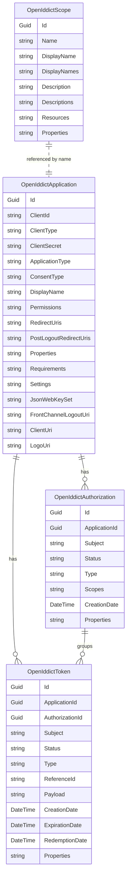
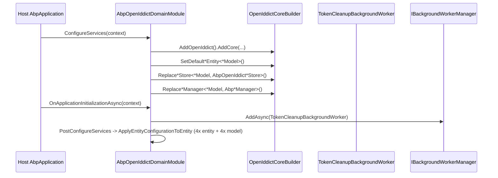

The ABP Framework **Domain layer** of the OpenIddict module owns the four aggregates that map directly onto OAuth 2.0 / OpenID Connect concepts and the manager + store stack that OpenIddict expects. Everything in this page lives under `modules/openiddict/src/Volo.Abp.OpenIddict.Domain/Volo/Abp/OpenIddict/`. The module class `AbpOpenIddictDomainModule` (file `AbpOpenIddictDomainModule.cs`) is the entry point: it depends on `AbpDddDomainModule`, `AbpIdentityDomainModule`, `AbpOpenIddictDomainSharedModule`, `AbpCachingModule`, `AbpDistributedLockingAbstractionsModule` and `AbpGuidsModule`, then calls `services.AddOpenIddict().AddCore(...)` to register the ABP overrides described below.

## Aggregate Map



## The Four Aggregates

### OpenIddictApplication

The client registration. Defined in `Volo/Abp/OpenIddict/Applications/OpenIddictApplication.cs`, it inherits `FullAuditedAggregateRoot<Guid>` (so `CreationTime`, `CreatorId`, `LastModificationTime`, `IsDeleted` are inherited from ABP's auditing base). Every text field is `virtual` to allow EF Core lazy proxies, and the JSON-serialized columns are read/written by the store layer rather than by callers.

Key columns documented in the source `<summary>` comments:

- `ApplicationType` — `web` or `native`; max length 50 (`OpenIddictApplicationConsts.ApplicationTypeMaxLength` in `Volo.Abp.OpenIddict.Domain.Shared/Volo/Abp/OpenIddict/Applications/OpenIddictApplicationConsts.cs`).
- `ClientId` — public identifier; max length 100 via `OpenIddictApplicationConsts.ClientIdMaxLength`.
- `ClientSecret` — hashed/encrypted by `AbpApplicationManager`.
- `ClientType` — `public` or `confidential`; max length 50.
- `ConsentType` — `implicit`, `explicit`, `external`, `systematic`; max length 50.
- `DisplayName` / `DisplayNames` — single and localized JSON map.
- `Permissions` — JSON array of grant-type / scope / endpoint permissions consumed by OpenIddict core.
- `RedirectUris`, `PostLogoutRedirectUris` — JSON arrays validated by the wildcard handlers when enabled.
- `Properties`, `Requirements`, `Settings` — JSON bags for extension data.
- `JsonWebKeySet` — for `private_key_jwt` client authentication.
- `FrontChannelLogoutUri`, `ClientUri`, `LogoUri` — display and OIDC RP-Initiated Logout metadata.

### OpenIddictAuthorization

A persisted user-consent grant tying a `Subject` (user id) to an `ApplicationId`. Defined in `Volo/Abp/OpenIddict/Authorizations/OpenIddictAuthorization.cs` as `AggregateRoot<Guid>` (no auditing). It holds:

- `ApplicationId : Guid?` — nullable when an authorization is created before the application is finalized.
- `Subject : string` — user identifier, max length 400 (`OpenIddictAuthorizationConsts.SubjectMaxLength` in the Domain.Shared file).
- `Status : string` — `valid`, `revoked`, `inactive`; max length 50.
- `Type : string` — `permanent` (consent) or `ad-hoc`; max length 50.
- `Scopes : string` — JSON array of granted scopes.
- `Properties : string` — JSON bag.
- `CreationDate : DateTime?` — UTC; `[DisableDateTimeNormalization]` keeps the value verbatim.

### OpenIddictScope

`Volo/Abp/OpenIddict/Scopes/OpenIddictScope.cs` — `FullAuditedAggregateRoot<Guid>`. Holds the master scope catalog used both at runtime by `AttachScopes` and at design time by Identity Server-style admin UIs:

- `Name` — unique scope identifier; max length 200 (`OpenIddictScopeConsts.NameMaxLength`).
- `DisplayName` / `DisplayNames` — single and localized JSON.
- `Description` / `Descriptions` — same.
- `Resources` — JSON array of audience identifiers; emitted by OpenIddict as the `aud` claim.
- `Properties` — JSON bag.

### OpenIddictToken

The persisted token. `Volo/Abp/OpenIddict/Tokens/OpenIddictToken.cs` inherits `AggregateRoot<Guid>` and tracks the full token lifecycle:

- `ApplicationId : Guid?` and `AuthorizationId : Guid?` — both nullable foreign keys.
- `Subject : string` — max length 400.
- `Status : string` — `valid`, `inactive`, `revoked`, `redeemed`; max length 50.
- `Type : string` — `access_token`, `refresh_token`, `authorization_code`, `id_token`, `device_code`, `user_code`; max length 150.
- `ReferenceId : string` — opaque pointer for reference tokens; hashed; max length 100.
- `Payload : string` — encrypted JWT body for reference tokens.
- `Properties : string` — JSON bag.
- `CreationDate`, `ExpirationDate`, `RedemptionDate` — UTC timestamps with `[DisableDateTimeNormalization]`.

The `Properties` JSON pattern across all four aggregates exists because OpenIddict expects a free-form `IReadOnlyDictionary<string, JsonElement>` on the in-memory model, and the ABP stores in `AbpOpenIddictStoreBase` (`Volo/Abp/OpenIddict/AbpOpenIddictStoreBase.cs`) serialize / deserialize it through `WriteStream` and `ReadStream` helpers.

## Manager Stack

The three customized managers extend OpenIddict's core managers with cache invalidation and distributed events. Each manager is registered in `AbpOpenIddictDomainModule.AddOpenIddictCore`:

```csharp
builder.ReplaceApplicationManager<OpenIddictApplicationModel, AbpApplicationManager>();
builder.ReplaceAuthorizationManager<OpenIddictAuthorizationModel, AbpAuthorizationManager>();
builder.ReplaceScopeManager<OpenIddictScopeModel, AbpScopeManager>();
builder.ReplaceTokenManager<OpenIddictTokenModel, AbpTokenManager>();
```

### AbpApplicationManager

`Volo/Abp/OpenIddict/Applications/AbpApplicationManager.cs` extends `OpenIddictApplicationManager<OpenIddictApplicationModel>` and adds:

- An `AbpOpenIddictIdentifierConverter` (`.../AbpOpenIddictIdentifierConverter.cs`) for `string ↔ Guid` mapping.
- `IDistributedEventBus` injection.
- Override of `UpdateAsync` that captures the previous `ClientId`, evicts the cache (`Cache.RemoveAsync`), then publishes `OpenIddictApplicationClientIdChangedEto` (from `Volo.Abp.OpenIddict.Domain.Shared/Volo/Abp/OpenIddict/Applications/OpenIddictApplicationClientIdChangedEto.cs`) when the client id actually changed — this is the trigger that lets the permission-management integration rewrite grants.
- Override of `PopulateAsync` (both directions) so that ABP's extension fields `FrontChannelLogoutUri`, `ClientUri`, `LogoUri` round-trip through `AbpApplicationDescriptor` (`.../Applications/AbpApplicationDescriptor.cs`). `FrontChannelLogoutUri` is validated to be an absolute URI that is not an implicit `file://`, throwing `ArgumentException` with resource string `ID0214` otherwise.
- A `GetFrontChannelLogoutUriAsync` convenience that delegates to `IAbpOpenIdApplicationStore`.

`IAbpApplicationManager` (interface in `.../Applications/IAbpApplicationManager.cs`) is registered both as itself and via a `TryAddScoped` factory that resolves it from the global `IOpenIddictApplicationManager` — visible at the end of `AbpOpenIddictDomainModule.AddOpenIddictCore`.

### AbpAuthorizationManager

`Volo/Abp/OpenIddict/Authorizations/AbpAuthorizationManager.cs` is much thinner: it injects `AbpOpenIddictIdentifierConverter` and overrides `UpdateAsync` only to invalidate the cache via `Cache.RemoveAsync(entity)` when `OpenIddictCoreOptions.DisableEntityCaching` is false.

### AbpScopeManager

`Volo/Abp/OpenIddict/Scopes/AbpScopeManager.cs` follows the identical pattern as `AbpAuthorizationManager`, but for `OpenIddictScopeModel`.

### AbpTokenManager

`Volo/Abp/OpenIddict/Tokens/AbpTokenManager.cs` — same shape, for `OpenIddictTokenModel`. The override:

```csharp
public override async ValueTask UpdateAsync(OpenIddictTokenModel token, CancellationToken cancellationToken = default)
{
    if (!Options.CurrentValue.DisableEntityCaching)
    {
        var entity = await Store.FindByIdAsync(IdentifierConverter.ToString(token.Id), cancellationToken);
        if (entity != null) await Cache.RemoveAsync(entity, cancellationToken);
    }
    await base.UpdateAsync(token, cancellationToken);
}
```

The repetitive cache-flush is necessary because `OpenIddictCoreOptions.DisableEntityCaching` defaults to `false` and tokens are read-heavy.

## Store Stack

Stores translate between OpenIddict's `OpenIddict*Model` runtime types and the ABP entities through ABP repositories. The base class `AbpOpenIddictStoreBase<TRepository>` at `Volo/Abp/OpenIddict/AbpOpenIddictStoreBase.cs` is generic over a repository contract and exposes:

- `Repository` — the underlying `IRepository<TEntity, Guid>` implementation.
- `UnitOfWorkManager` — for `UnitOfWorkManager.Begin(requiresNew: true, isTransactional: true, isolationLevel: ...)` blocks.
- `GuidGenerator` — ABP's sequential GUID provider.
- `IdentifierConverter` — `string ↔ Guid` via `AbpOpenIddictIdentifierConverter`.
- `ConcurrencyExceptionHandler : IOpenIddictDbConcurrencyExceptionHandler` — provider-specific concurrency mapping; see `IOpenIddictDbConcurrencyExceptionHandler.cs`.
- `StoreOptions : IOptions<AbpOpenIddictStoreOptions>` — supplies `DeleteIsolationLevel` (default `Serializable`) and `PruneIsolationLevel` (default `RepeatableRead`) from `Volo/Abp/OpenIddict/AbpOpenIddictStoreOptions.cs`.
- `WriteStream` / `ReadStream` helpers that wrap `Utf8JsonWriter` with `JavaScriptEncoder.UnsafeRelaxedJsonEscaping`.

### AbpOpenIddictApplicationStore

`Volo/Abp/OpenIddict/Applications/AbpOpenIddictApplicationStore.cs` implements `IAbpOpenIdApplicationStore` (the ABP-specific interface in `.../Applications/IAbpOpenIdApplicationStore.cs` which extends OpenIddict's `IOpenIddictApplicationStore<OpenIddictApplicationModel>`). It also depends on `IOpenIddictTokenRepository` so that `DeleteAsync` can cascade — within a new transactional UoW it calls `TokenRepository.DeleteManyByApplicationIdAsync(application.Id, ...)` first, then `Repository.DeleteAsync(application.Id, ...)`, completing the UoW only after both succeed. If `AbpDbConcurrencyException` is thrown the store delegates to `ConcurrencyExceptionHandler.HandleAsync(e)` and rethrows as `OpenIddictExceptions.ConcurrencyException`.

Other interesting members:

- `CreateAsync` — calls `Repository.InsertAsync(application.ToEntity(), autoSave: true, ...)` using the Mapperly-generated extension method `ToEntity()` (declared in `AbpOpenIddictDomainMappers.cs`).
- `FindByIdAsync` — converts the string identifier via `ConvertIdentifierFromString` and delegates to `Repository.FindAsync(id, cancellationToken)`.
- `CountAsync` — uses `Repository.GetCountAsync`.
- `CountAsync<TResult>(Func<IQueryable<...>, IQueryable<TResult>>)` — unsupported; throws `NotSupportedException`.

### AbpOpenIddictAuthorizationStore

`Volo/Abp/OpenIddict/Authorizations/AbpOpenIddictAuthorizationStore.cs` — the same shape over `IOpenIddictAuthorizationRepository`. `DeleteAsync` opens a new transactional UoW with `DeleteIsolationLevel`, deletes child tokens via `TokenRepository.DeleteManyByAuthorizationIdAsync`, then removes the authorization itself.

### AbpOpenIddictScopeStore

`Volo/Abp/OpenIddict/Scopes/AbpOpenIddictScopeStore.cs` — no cascade required because scopes do not own children.

### AbpOpenIddictTokenStore

`Volo/Abp/OpenIddict/Tokens/AbpOpenIddictTokenStore.cs` — the largest store, because `PruneAsync` (called by `TokenCleanupBackgroundWorker`) needs the `PruneIsolationLevel` and the revoke variants (`RevokeAsync`, `RevokeByAuthorizationIdAsync`, `RevokeByApplicationIdAsync`, `RevokeBySubjectAsync`) all forward to the repository.

The cache layer beside each store — `AbpOpenIddictApplicationCache`, `AbpOpenIddictAuthorizationCache`, `AbpOpenIddictScopeCache`, `AbpOpenIddictTokenCache` (each next to its store class) — derives from `AbpOpenIddictCacheBase` at `Volo/Abp/OpenIddict/AbpOpenIddictCacheBase.cs` and wraps `IDistributedCache<T>` so cache invalidation by manager overrides actually does something across nodes.

## Repository Contracts

The Domain layer ships four repository interfaces; concrete implementations live in the persistence packages.

### IOpenIddictApplicationRepository

From `Volo/Abp/OpenIddict/Applications/IOpenIddictApplicationRepository.cs`. Methods:

- `GetListAsync(string sorting, int skipCount, int maxResultCount, string filter, CancellationToken)`
- `GetCountAsync(string filter, CancellationToken)`
- `FindByClientIdAsync(string clientId, CancellationToken)`
- `FindByPostLogoutRedirectUriAsync(string address, CancellationToken)`
- `FindByRedirectUriAsync(string address, CancellationToken)`
- `ListAsync(int? count, int? offset, CancellationToken)`

### IOpenIddictAuthorizationRepository

`.../Authorizations/IOpenIddictAuthorizationRepository.cs` declares prune, find-by-subject/application/status and delete-many overloads.

### IOpenIddictScopeRepository

`.../Scopes/IOpenIddictScopeRepository.cs` — `FindByNameAsync(string)`, `FindByNamesAsync(string[])`, plus paged listing for admin UIs.

### IOpenIddictTokenRepository

`.../Tokens/IOpenIddictTokenRepository.cs` — the busiest:

- `DeleteManyByApplicationIdAsync` / `DeleteManyByAuthorizationIdAsync` / `DeleteManyByAuthorizationIdsAsync`
- `FindAsync(string subject, Guid? client, string status, string type, CancellationToken)`
- `FindByApplicationIdAsync`, `FindByAuthorizationIdAsync`, `FindByIdAsync`, `FindByReferenceIdAsync`, `FindBySubjectAsync`
- `ListAsync(int? count, int? offset, CancellationToken)`
- `PruneAsync(DateTime date, CancellationToken)` — used by the cleanup worker
- `RevokeAsync(string subject, Guid? applicationId, string status, string type, CancellationToken)`
- `RevokeByAuthorizationIdAsync`, `RevokeByApplicationIdAsync`, `RevokeBySubjectAsync`

## Identifier Conversion

OpenIddict-core works in `string`; ABP entities use `Guid`. The bridge is `AbpOpenIddictIdentifierConverter` at `Volo/Abp/OpenIddict/AbpOpenIddictIdentifierConverter.cs`:

```csharp
public class AbpOpenIddictIdentifierConverter
{
    public virtual string ToString(Guid id) => id.ToString("D");
    public virtual Guid FromString(string id) => Guid.Parse(id);
}
```

Stores call `ConvertIdentifierFromString` / `ConvertIdentifierToString` from `AbpOpenIddictStoreBase` rather than touching the converter directly, which makes it overridable for solutions that want, e.g., a stable hash representation.

## Data Seeding

`OpenIddictDataSeedContributorBase` in `Volo/Abp/OpenIddict/OpenIddictDataSeedContributorBase.cs` is the abstract base from which application templates derive their seeders. It takes:

- `IConfiguration` — typically the `OpenIddict:Applications:<Name>:...` section.
- `IOpenIddictApplicationRepository` — to check existence via `FindByClientIdAsync` before mutating.
- `IAbpApplicationManager` — the ABP manager interface for mutations.
- `IOpenIddictScopeRepository` and `IOpenIddictScopeManager` — for scope upserts.

Two key helpers:

- `CreateScopesAsync(OpenIddictScopeDescriptor scope)` — checks `OpenIddictApplicationRepository`... wait, **scope** repository — `if (await OpenIddictScopeRepository.FindByNameAsync(scope.Name) == null) await ScopeManager.CreateAsync(scope);`
- `CreateOrUpdateApplicationAsync(...)` — validates that confidential applications have a secret and public ones do not (throwing `AbpException("No client secret can be set for public applications.")` and `"The client secret is required for confidential applications."` respectively), constructs an `AbpApplicationDescriptor`, and delegates to the manager.

The descriptor parameters mirror the entity columns: `applicationType`, `name` (becomes `ClientId`), `type` (public/confidential), `consentType`, `displayName`, `secret`, `grantTypes`, `scopes`, `redirectUris`, `postLogoutRedirectUris`, `clientUri`, `logoUri`.

## Password & Identity Integration

While the password-grant *flow* lives in the AspNetCore layer (`TokenController.Password.cs`), the *configuration* of how passwords are validated comes from ABP Identity. The Domain layer's dependency `AbpIdentityDomainModule` makes `UserManager<IdentityUser>`, `SignInManager<IdentityUser>` and `IdentityOptions` available; the controller will call `IdentityOptions.SetAsync()` (an extension on the options manager) before `CheckPasswordSignInAsync`. There is **no** separate `AbpOpenIddictPasswordOptions` type in the module — instead the OpenIddict module relies entirely on `AbpIdentityOptions` (lockout, external login providers, password requirements) and `IdentityOptions` to determine acceptable password behavior. This is intentional: a single source of truth for password policy across cookie login and token-endpoint login.

## Constants Catalog

Field-length constants live in the Domain.Shared package and are reused both by entity validation and by the model-creating extensions in the persistence packages:

| Constant class                                                                     | Field                              | Default |
| ---------------------------------------------------------------------------------- | ---------------------------------- | ------- |
| `OpenIddictApplicationConsts` (`.../Applications/OpenIddictApplicationConsts.cs`)  | `ApplicationTypeMaxLength`         | 50      |
| same                                                                               | `ClientIdMaxLength`                | 100     |
| same                                                                               | `ConsentTypeMaxLength`             | 50      |
| same                                                                               | `ClientTypeMaxLength`              | 50      |
| `OpenIddictAuthorizationConsts` (`.../Authorizations/OpenIddictAuthorizationConsts.cs`) | `StatusMaxLength`              | 50      |
| same                                                                               | `SubjectMaxLength`                 | 400     |
| same                                                                               | `TypeMaxLength`                    | 50      |
| `OpenIddictScopeConsts` (`.../Scopes/OpenIddictScopeConsts.cs`)                    | `NameMaxLength`                    | 200     |
| `OpenIddictTokenConsts` (`.../Tokens/OpenIddictTokenConsts.cs`)                    | `ReferenceIdMaxLength`             | 100     |
| same                                                                               | `StatusMaxLength`                  | 50      |
| same                                                                               | `SubjectMaxLength`                 | 400     |
| same                                                                               | `TypeMaxLength`                    | 150    |

All are `public static int { get; set; }` so a host module can override them in the static constructor before `AbpOpenIddictDomainModule` runs `OnApplicationInitialization`.

`AbpOpenIddictDbProperties` in `Volo/Abp/OpenIddict/AbpOpenIddictDbProperties.cs` exposes `DbTablePrefix` (default `OpenIddict`), `DbSchema` (defaults to `AbpCommonDbProperties.DbSchema`), and the `ConnectionStringName` constant `"AbpOpenIddict"` — the latter is referenced by `[ConnectionStringName(AbpOpenIddictDbProperties.ConnectionStringName)]` on both `OpenIddictDbContext` and `OpenIddictMongoDbContext`.

## Module-Lifetime Flow



The `OneTimeRunner` (`Volo.Abp.Threading.OneTimeRunner`) guarantees that `PostConfigureServices` only applies its object-extension wiring once even if multiple test hosts are spun up in the same `AppDomain`. The extension wiring binds each ABP entity (`OpenIddictApplication`, ...) and its companion runtime model (`OpenIddictApplicationModel`, ...) to `OpenIddictModuleExtensionConsts.EntityNames.*` so `ObjectExtensionManager` can attach custom columns.

## Distributed Events

The Domain layer configures `AbpDistributedEntityEventOptions` in `AbpOpenIddictDomainModule.ConfigureServices`:

```csharp
options.EtoMappings.Add<OpenIddictApplication, OpenIddictApplicationEto>(typeof(AbpOpenIddictDomainModule));
options.AutoEventSelectors.Add<OpenIddictApplication>();
```

`OpenIddictApplicationEto` lives in `Volo.Abp.OpenIddict.Domain.Shared/Volo/Abp/OpenIddict/Applications/OpenIddictApplicationEto.cs`. Combined with `OpenIddictApplicationClientIdChangedEto` (manually published from `AbpApplicationManager.UpdateAsync`), this lets downstream modules — most notably the permission integration — react to client lifecycle changes without taking a hard reference on the Domain layer.

## Up Next

<CardGroup cols={2}>
  <Card title="AspNetCore Layer" href="/module-openiddict/aspnetcore" icon="globe">
    How `connect/authorize`, `connect/token`, claim handlers, and extension grants wire on top of the Domain managers.
  </Card>
  <Card title="Persistence" href="/module-openiddict/persistence" icon="database">
    Concrete EF Core and MongoDB repositories that satisfy `IOpenIddict*Repository`.
  </Card>
</CardGroup>
