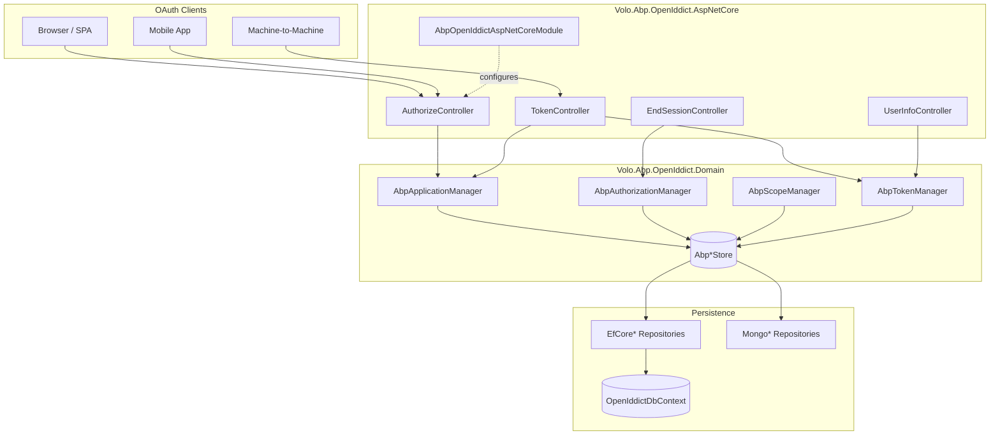
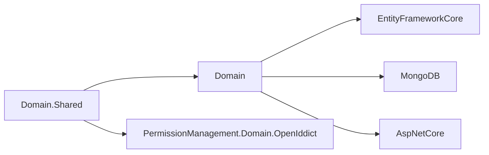
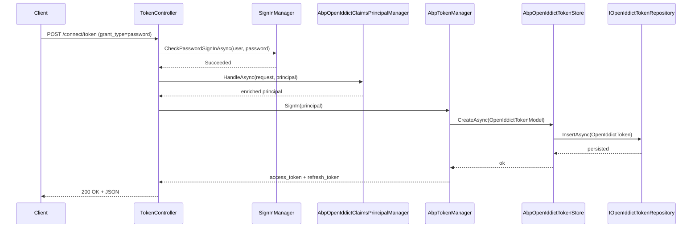

The **OpenIddict module** is the ABP Framework's first-party OAuth 2.0 and OpenID Connect server. It wraps the [OpenIddict](https://github.com/openiddict/openiddict-core) library in ABP-native abstractions — repositories, managers, stores, distributed events, multi-tenancy and permission management — so an ABP solution can issue access tokens, refresh tokens, ID tokens and authorization codes against `IdentityUser` from `Volo.Abp.Identity` without leaving the framework's idioms. The implementation lives entirely under `modules/openiddict/src/` and is split across six NuGet packages described below.

## Layered Package Map

The module follows ABP's standard layering. Each layer is a separate assembly with a module class (`AbpModule` descendant) that bootstraps the next.

<CardGroup cols={2}>
  <Card title="Volo.Abp.OpenIddict.Domain.Shared" icon="cube">
    Constants, ETOs, localization resources. Defined by `Volo/Abp/OpenIddict/AbpOpenIddictDomainSharedModule.cs`.
  </Card>
  <Card title="Volo.Abp.OpenIddict.Domain" icon="database">
    Entities, managers, stores, repository contracts. Bootstrapped by `Volo/Abp/OpenIddict/AbpOpenIddictDomainModule.cs`.
  </Card>
  <Card title="Volo.Abp.OpenIddict.EntityFrameworkCore" icon="server">
    EF Core `OpenIddictDbContext`, repositories, and `ConfigureOpenIddict()` model extension.
  </Card>
  <Card title="Volo.Abp.OpenIddict.MongoDB" icon="leaf">
    `OpenIddictMongoDbContext`, Mongo repositories. Bootstrapped by `Volo/Abp/OpenIddict/MongoDB/AbpOpenIddictMongoDbModule.cs`.
  </Card>
  <Card title="Volo.Abp.OpenIddict.AspNetCore" icon="globe">
    Authorization/token/userinfo/end-session controllers, claim handlers, wildcard domains.
  </Card>
  <Card title="Volo.Abp.PermissionManagement.Domain.OpenIddict" icon="key">
    Wires `ClientPermissionValueProvider` to OpenIddict applications.
  </Card>
</CardGroup>

The `Volo.Abp.OpenIddict.Installer` package under `modules/openiddict/src/Volo.Abp.OpenIddict.Installer/` ships the schematic templates consumed by the ABP CLI to scaffold a fresh solution.

## High-Level Architecture



The four aggregate roots — `OpenIddictApplication`, `OpenIddictAuthorization`, `OpenIddictScope`, `OpenIddictToken` — are defined in `modules/openiddict/src/Volo.Abp.OpenIddict.Domain/Volo/Abp/OpenIddict/Applications/OpenIddictApplication.cs`, `.../Authorizations/OpenIddictAuthorization.cs`, `.../Scopes/OpenIddictScope.cs` and `.../Tokens/OpenIddictToken.cs` respectively. The companion model types (`OpenIddictApplicationModel`, etc., found alongside each entity) are the runtime DTOs OpenIddict itself consumes; `AbpOpenIddictDomainMappers.cs` (`modules/openiddict/src/Volo.Abp.OpenIddict.Domain/Volo/Abp/OpenIddict/AbpOpenIddictDomainMappers.cs`) bridges entity ↔ model with a Mapperly-generated `IObjectMapper`.

## Package Dependency Graph



The dependency arrows are encoded as `[DependsOn(...)]` attributes — `AbpOpenIddictDomainModule` at `modules/openiddict/src/Volo.Abp.OpenIddict.Domain/Volo/Abp/OpenIddict/AbpOpenIddictDomainModule.cs` depends on `AbpDddDomainModule`, `AbpIdentityDomainModule`, `AbpOpenIddictDomainSharedModule`, `AbpDistributedLockingAbstractionsModule`, `AbpCachingModule`, and `AbpGuidsModule`, providing the foundation every other package extends.

## OAuth 2.0 / OIDC Endpoints

`AbpOpenIddictAspNetCoreModule.AddOpenIddictServer()` in `modules/openiddict/src/Volo.Abp.OpenIddict.AspNetCore/Volo/Abp/OpenIddict/AbpOpenIddictAspNetCoreModule.cs` registers the full surface area of the protocol:

| Endpoint URI                  | Purpose                                  | Controller                                                                                                                                              |
| ----------------------------- | ---------------------------------------- | ------------------------------------------------------------------------------------------------------------------------------------------------------- |
| `connect/authorize`           | Authorization-code & implicit flows      | `Volo/Abp/OpenIddict/Controllers/AuthorizeController.cs`                                                                                                |
| `connect/authorize/callback`  | Callback after consent                   | same `AuthorizeController`                                                                                                                              |
| `connect/token`               | All grant types                          | `Volo/Abp/OpenIddict/Controllers/TokenController.cs` (partial split: `.Password.cs`, `.AuthorizationCode.cs`, `.RefreshToken.cs`, `.ClientCredentials.cs`) |
| `connect/userinfo`            | OIDC userinfo                            | `Volo/Abp/OpenIddict/Controllers/UserInfoController.cs`                                                                                                 |
| `connect/endsession`          | RP-initiated logout                      | `Volo/Abp/OpenIddict/Controllers/EndSessionController.cs`                                                                                               |
| `connect/introspect`          | RFC 7662 token introspection             | OpenIddict server pipeline                                                                                                                              |
| `connect/revocat`             | RFC 7009 revocation                      | OpenIddict server pipeline                                                                                                                              |
| `device`                      | Device authorization                     | `Volo/Abp/OpenIddict/Controllers/TokenController.DeviceCode.cs`                                                                                         |
| `connect/par`                 | Pushed Authorization Request             | OpenIddict server pipeline                                                                                                                              |

These URIs are wired with `.SetAuthorizationEndpointUris("connect/authorize", "connect/authorize/callback")`, `.SetTokenEndpointUris("connect/token")` and friends inside the same `AbpOpenIddictAspNetCoreModule.AddOpenIddictServer` method.

## Supported Flows

The module enables every standard grant by default — see lines `.AllowAuthorizationCodeFlow().AllowHybridFlow().AllowImplicitFlow().AllowPasswordFlow().AllowClientCredentialsFlow().AllowRefreshTokenFlow().AllowDeviceAuthorizationFlow().AllowNoneFlow().AllowTokenExchangeFlow()` in `AbpOpenIddictAspNetCoreModule.cs`:

<AccordionGroup>
  <Accordion title="Authorization Code (with PKCE)">
    The recommended flow for SPAs and mobile apps. Handled by `TokenController.HandleAuthorizationCodeAsync` in `Volo/Abp/OpenIddict/Controllers/TokenController.AuthorizationCode.cs`.
  </Accordion>
  <Accordion title="Client Credentials">
    Machine-to-machine. Logic in `Volo/Abp/OpenIddict/Controllers/TokenController.ClientCredentials.cs`; the handler `RemoveClaimsFromClientCredentialsGrantType` (`Volo/Abp/OpenIddict/RemoveClaimsFromClientCredentialsGrantType.cs`) strips user-bound claims from the resulting token.
  </Accordion>
  <Accordion title="Resource Owner Password">
    Implemented in `Volo/Abp/OpenIddict/Controllers/TokenController.Password.cs` with full ABP Identity integration: lockout detection (`AbpOpenIddictErrors.AccountLocked`), 2FA via `HandleTwoFactorLoginAsync`, "should change password on next login" via `HandleShouldChangePasswordOnNextLoginAsync`, and external-login provider lookup against `AbpIdentityOptions.ExternalLoginProviders`.
  </Accordion>
  <Accordion title="Refresh Token">
    `Volo/Abp/OpenIddict/Controllers/TokenController.RefreshToken.cs` validates the prior principal and reissues claims via `AbpOpenIddictClaimsPrincipalManager`.
  </Accordion>
  <Accordion title="Device Code">
    `Volo/Abp/OpenIddict/Controllers/TokenController.DeviceCode.cs` plus the `/device` endpoint.
  </Accordion>
  <Accordion title="Token Exchange (RFC 8693)">
    `Volo/Abp/OpenIddict/Controllers/TokenController.TokenExchange.cs`.
  </Accordion>
  <Accordion title="Extension Grants">
    Custom grant types implementing `ITokenExtensionGrant` from `Volo/Abp/OpenIddict/ExtensionGrantTypes/ITokenExtensionGrant.cs` and registered via `AbpOpenIddictExtensionGrantsOptions.Grants`.
  </Accordion>
</AccordionGroup>

## Token Issuance Walk-Through

The following diagram traces a password-grant request from HTTP receipt to signed access token.



`AbpOpenIddictClaimsPrincipalManager` (in `modules/openiddict/src/Volo.Abp.OpenIddict.AspNetCore/Volo/Abp/OpenIddict/Claims/AbpOpenIddictClaimsPrincipalManager.cs`) iterates every registered `IAbpOpenIddictClaimsPrincipalHandler`. The default handler `AbpDefaultOpenIddictClaimsPrincipalHandler` lives in the same folder and attaches subject, scopes, resources and destinations to the outgoing principal.

## Comparison with the (deprecated) IdentityServer Module

ABP previously shipped a Duende IdentityServer4 module. The OpenIddict module replaced it for licensing and maintenance reasons — Duende IdentityServer moved to a paid license starting with v5, while OpenIddict remains Apache 2.0. The functional mapping:

| Concern                  | IdentityServer module                   | OpenIddict module                                                                                       |
| ------------------------ | --------------------------------------- | ------------------------------------------------------------------------------------------------------- |
| Client entity            | `Client`                                | `OpenIddictApplication` — `modules/openiddict/src/Volo.Abp.OpenIddict.Domain/Volo/Abp/OpenIddict/Applications/OpenIddictApplication.cs` |
| Scope entity             | `ApiScope` / `IdentityResource`         | `OpenIddictScope` — single unified type at `.../Scopes/OpenIddictScope.cs`                              |
| Persisted grants         | `PersistedGrant`                        | `OpenIddictToken` + `OpenIddictAuthorization` (split)                                                  |
| Manager API              | `IClientStore`, `IResourceStore`        | `IAbpApplicationManager` (`.../Applications/IAbpApplicationManager.cs`), `IOpenIddictScopeManager`     |
| Custom grants            | `IExtensionGrantValidator`              | `ITokenExtensionGrant` (`Volo/Abp/OpenIddict/ExtensionGrantTypes/ITokenExtensionGrant.cs`)              |
| Token cleanup            | `TokenCleanupService`                   | `TokenCleanupBackgroundWorker` (registered in `AbpOpenIddictDomainModule.OnApplicationInitializationAsync`) |
| DB tables                | `IdentityServer*`                       | `OpenIddict*` — controlled by `AbpOpenIddictDbProperties.DbTablePrefix` in `.../AbpOpenIddictDbProperties.cs` |
| Wildcard redirect URIs   | Manual regex                            | First-class via `AbpOpenIddictWildcardDomainOptions` and `AbpValidateClientRedirectUri` handler         |
| Multi-tenancy            | Tenant-scoped                           | Host-scoped (`[IgnoreMultiTenancy]` on `OpenIddictDbContext`)                                          |

The migration is mostly mechanical because both modules use the same `AbpClaimTypes` mapping — the OpenIddict module updates them inside `AbpOpenIddictAspNetCoreModule.AddOpenIddictServer` when `AbpOpenIddictAspNetCoreOptions.UpdateAbpClaimTypes` is `true` (the default).

## Configuration Surface

<CardGroup cols={2}>
  <Card title="AbpOpenIddictAspNetCoreOptions" icon="sliders">
    Toggles `UpdateAbpClaimTypes`, `AddDevelopmentEncryptionAndSigningCertificate`, `AttachCultureInfo`, and the `SelectAccountPage` URL. Source: `Volo/Abp/OpenIddict/AbpOpenIddictOptions.cs`.
  </Card>
  <Card title="AbpOpenIddictStoreOptions" icon="database">
    Sets `PruneIsolationLevel` (default `RepeatableRead`) and `DeleteIsolationLevel` (default `Serializable`). Source: `Volo/Abp/OpenIddict/AbpOpenIddictStoreOptions.cs`.
  </Card>
  <Card title="AbpOpenIddictWildcardDomainOptions" icon="globe">
    Enables `*.tenant.example.com` style redirect URIs. Source: `Volo/Abp/OpenIddict/WildcardDomains/AbpOpenIddictWildcardDomainOptions.cs`.
  </Card>
  <Card title="AbpOpenIddictExtensionGrantsOptions" icon="puzzle-piece">
    Dictionary of grant-name → `IExtensionGrant`. Source: `Volo/Abp/OpenIddict/ExtensionGrantTypes/AbpOpenIddictExtensionGrantsOptions.cs`.
  </Card>
</CardGroup>

## Default Scopes

Registered inline by `builder.RegisterScopes(new[] { ... })` inside `AbpOpenIddictAspNetCoreModule.AddOpenIddictServer`:

- `openid`
- `email`
- `profile`
- `phone`
- `roles`
- `address`
- `offline_access`

Custom scopes are advertised at runtime by the `AttachScopes` event handler in `Volo/Abp/OpenIddict/Scopes/AttachScopes.cs`, which queries `IOpenIddictScopeRepository.GetListAsync()` and unions the names into the discovery document at `OpenIddictServerEvents.HandleConfigurationRequestContext`.

## Seeding & Bootstrapping

ABP solutions inherit from `OpenIddictDataSeedContributorBase` (`modules/openiddict/src/Volo.Abp.OpenIddict.Domain/Volo/Abp/OpenIddict/OpenIddictDataSeedContributorBase.cs`) and call `CreateScopesAsync` / `CreateOrUpdateApplicationAsync` to register clients. The base type accepts an `AbpApplicationDescriptor` (defined alongside at `.../Applications/AbpApplicationDescriptor.cs`) and routes through `IAbpApplicationManager`. Public-vs-confidential client validation happens there: an exception is thrown when a public client has a secret or a confidential client lacks one.

The `TokenCleanupBackgroundWorker` is added inside `AbpOpenIddictDomainModule.OnApplicationInitializationAsync` when `TokenCleanupOptions.IsCleanupEnabled` is true, deleting expired tokens and authorizations on a schedule.

## Permission Management Integration

`Volo.Abp.PermissionManagement.Domain.OpenIddict` (see `Volo/Abp/PermissionManagement/OpenIddict/AbpPermissionManagementDomainOpenIddictModule.cs`) installs `ApplicationPermissionManagementProvider` so OAuth clients can be granted ABP permissions — for example, the "Books.Create" permission can be assigned to the `console-app` client. When a client's `ClientId` changes, `OpenIddictApplicationClientIdChangedHandler` (`.../OpenIddict/OpenIddictApplicationClientIdChangedHandler.cs`) listens to the `OpenIddictApplicationClientIdChangedEto` distributed event and rewrites all `PermissionGrant.ProviderKey` rows. When the application is deleted, `OpenIddictApplicationDeletedEventHandler` cascades the cleanup.

## Distributed Event Surface

The Domain layer publishes two distinct distributed events from `AbpApplicationManager` (`modules/openiddict/src/Volo.Abp.OpenIddict.Domain/Volo/Abp/OpenIddict/Applications/AbpApplicationManager.cs`):

- `EntityChangedEto<OpenIddictApplicationEto>` — auto-emitted because `AbpOpenIddictDomainModule.ConfigureServices` adds `options.AutoEventSelectors.Add<OpenIddictApplication>()` to `AbpDistributedEntityEventOptions`. The ETO mapping is registered with `options.EtoMappings.Add<OpenIddictApplication, OpenIddictApplicationEto>(typeof(AbpOpenIddictDomainModule))`.
- `OpenIddictApplicationClientIdChangedEto` — manually published from `AbpApplicationManager.UpdateAsync` when the `ClientId` actually changes. The ETO type lives at `modules/openiddict/src/Volo.Abp.OpenIddict.Domain.Shared/Volo/Abp/OpenIddict/Applications/OpenIddictApplicationClientIdChangedEto.cs` and carries `Id`, `OldClientId`, and `ClientId`.

Downstream modules — most notably `Volo.Abp.PermissionManagement.Domain.OpenIddict` — subscribe to these events to rewrite permission grants without taking a hard reference on the OpenIddict Domain assembly.

## Background Workers

`AbpOpenIddictDomainModule.OnApplicationInitializationAsync` (`modules/openiddict/src/Volo.Abp.OpenIddict.Domain/Volo/Abp/OpenIddict/AbpOpenIddictDomainModule.cs`) registers `TokenCleanupBackgroundWorker` against `IBackgroundWorkerManager` when `TokenCleanupOptions.IsCleanupEnabled` is true (the OpenIddict default). The worker calls `IOpenIddictTokenRepository.PruneAsync(DateTime, CancellationToken)` and the equivalent authorization prune on a recurring schedule, freeing rows whose `Status` is no longer `Valid`/`Inactive`, whose parent authorization has been revoked, or whose `ExpirationDate < UtcNow`.

## Multi-Tenancy Stance

OpenIddict registrations are **host-scoped** in this module. The `OpenIddictDbContext` defined at `modules/openiddict/src/Volo.Abp.OpenIddict.EntityFrameworkCore/Volo/Abp/OpenIddict/EntityFrameworkCore/OpenIddictDbContext.cs` is decorated with `[IgnoreMultiTenancy]`, the MongoDB counterpart `Volo/Abp/OpenIddict/MongoDB/OpenIddictMongoDbContext.cs` carries the same attribute, and the permission providers in `Volo.Abp.PermissionManagement.Domain.OpenIddict` wrap every call in `using (CurrentTenant.Change(null)) { ... }`. The rationale: a single `ClientId` such as `Acme_Web` should resolve identically regardless of which tenant a request lands in, because the `aud` and `iss` claims of an OAuth token must be globally meaningful. Tenant-aware behavior is encoded *inside* the issued claims (e.g., `AbpClaimTypes.TenantId`) rather than by partitioning the OpenIddict tables themselves.

Resource owners still log in inside their tenant context — `TokenController.HandlePasswordAsync` in `modules/openiddict/src/Volo.Abp.OpenIddict.AspNetCore/Volo/Abp/OpenIddict/Controllers/TokenController.Password.cs` calls `await TenantConfigurationProvider.GetAsync(saveResolveResult: false)` and wraps the rest of the body in `using (CurrentTenant.Change(tenant?.Id))`. The split is therefore: **clients/scopes/tokens = host**, **users/sessions = tenant-aware**.

## Localization

The module ships an English resource at `modules/openiddict/src/Volo.Abp.OpenIddict.Domain.Shared/Volo/Abp/OpenIddict/Localization/OpenIddict/en.json` registered through `AbpOpenIddictDomainSharedModule` (`.../AbpOpenIddictDomainSharedModule.cs`). The resource class is `AbpOpenIddictResource` (`.../Localization/AbpOpenIddictResource.cs`) and exception codes are mapped via:

```csharp
Configure<AbpExceptionLocalizationOptions>(options =>
{
    options.MapCodeNamespace("OpenIddict", typeof(AbpOpenIddictResource));
});
```

So an `AbpException("OpenIddict:0001")` thrown from controllers — for example the `TheOpenIDConnectRequestCannotBeRetrieved` message used by `AbpOpenIdDictControllerBase.GetOpenIddictServerRequestAsync` — is localized end-to-end without extra ceremony.

## Solution Wiring Checklist

A fresh ABP solution that wants to issue OAuth tokens depends on these modules in its host project:

<Steps>
  <Step title="Reference the AspNetCore module">
    Add `[DependsOn(typeof(AbpOpenIddictAspNetCoreModule))]` on the host module class. This transitively pulls in `AbpOpenIddictDomainModule` and `AbpOpenIddictDomainSharedModule`.
  </Step>
  <Step title="Pick a persistence module">
    Add `[DependsOn(typeof(AbpOpenIddictEntityFrameworkCoreModule))]` for EF Core, or `[DependsOn(typeof(AbpOpenIddictMongoDbModule))]` for MongoDB. Both expose the same `IOpenIddict*Repository` contracts.
  </Step>
  <Step title="Optionally wire permission management">
    Add `[DependsOn(typeof(AbpPermissionManagementDomainOpenIddictModule))]` to let admins assign ABP permissions to OAuth clients.
  </Step>
  <Step title="Seed initial scopes & applications">
    Derive a `*DataSeedContributor` from `OpenIddictDataSeedContributorBase` (`modules/openiddict/src/Volo.Abp.OpenIddict.Domain/Volo/Abp/OpenIddict/OpenIddictDataSeedContributorBase.cs`) and call `CreateScopesAsync` / `CreateOrUpdateApplicationAsync` from your `IDataSeedContributor.SeedAsync`.
  </Step>
  <Step title="Wire production signing">
    In production, override the default development certificate by calling `services.PreConfigure<OpenIddictServerBuilder>(b => b.AddProductionEncryptionAndSigningCertificate(path, password))` — defined in `modules/openiddict/src/Volo.Abp.OpenIddict.AspNetCore/Microsoft/Extensions/DependencyInjection/OpenIddictServerBuilderExtensions.cs`.
  </Step>
</Steps>

The AspNetCore module's pipeline expects `app.UseAuthentication()` to run before `app.UseAuthorization()`, and resource APIs that validate tokens locally add `app.UseAbpOpenIddictValidation()` from `modules/openiddict/src/Volo.Abp.OpenIddict.AspNetCore/Microsoft/AspNetCore/Builder/ApplicationBuilderAbpOpenIddictMiddlewareExtension.cs` so that an `OpenIddict.Validation.AspNetCore` success result is hoisted into `HttpContext.User`.

## Where to Read Next

<CardGroup cols={3}>
  <Card title="Domain Layer" href="/module-openiddict/domain" icon="cube">
    Entities, managers, stores, repository contracts, data seeding.
  </Card>
  <Card title="AspNetCore Layer" href="/module-openiddict/aspnetcore" icon="globe">
    Endpoints, claim handlers, event handlers, extension grants.
  </Card>
  <Card title="Persistence" href="/module-openiddict/persistence" icon="database">
    EF Core DbContext, MongoDB context, permission integration.
  </Card>
</CardGroup>
