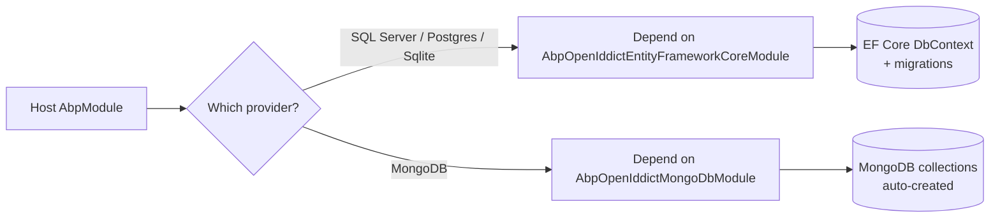
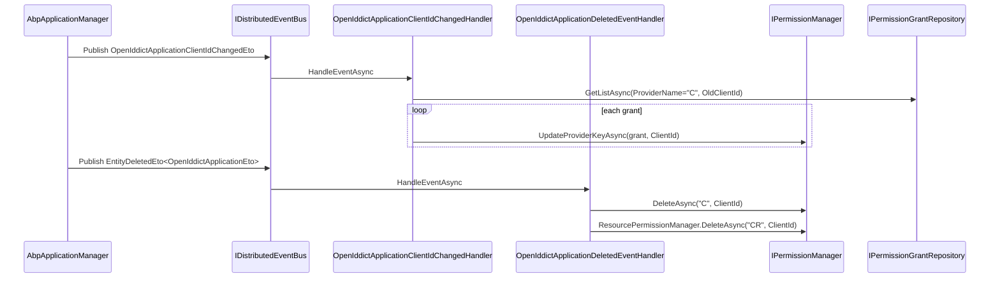

The **persistence packages** complete the OpenIddict module by providing concrete repositories, database contexts and model configurations for either **Entity Framework Core** or **MongoDB**, plus a dedicated `Volo.Abp.PermissionManagement.Domain.OpenIddict` package that turns OAuth clients into ABP permission-management subjects. This page in the ABP Framework wiki walks each of those packages file-by-file, all paths relative to `modules/openiddict/src/`.

## Provider Topology

```mermaid
flowchart TB
  subgraph Domain["Volo.Abp.OpenIddict.Domain (contracts)"]
    IRepoA[IOpenIddictApplicationRepository]
    IRepoAu[IOpenIddictAuthorizationRepository]
    IRepoS[IOpenIddictScopeRepository]
    IRepoT[IOpenIddictTokenRepository]
    IConc[IOpenIddictDbConcurrencyExceptionHandler]
  end

  subgraph EF["Volo.Abp.OpenIddict.EntityFrameworkCore"]
    EfCtx[(OpenIddictDbContext)]
    EfA[EfCoreOpenIddictApplicationRepository]
    EfAu[EfCoreOpenIddictAuthorizationRepository]
    EfS[EfCoreOpenIddictScopeRepository]
    EfT[EfCoreOpenIddictTokenRepository]
    EfC[EfCoreOpenIddictDbConcurrencyExceptionHandler]
  end

  subgraph Mongo["Volo.Abp.OpenIddict.MongoDB"]
    MoCtx[(OpenIddictMongoDbContext)]
    MoA[MongoOpenIddictApplicationRepository]
    MoAu[MongoOpenIddictAuthorizationRepository]
    MoS[MongoOpenIddictScopeRepository]
    MoT[MongoOpenIddictTokenRepository]
    MoC[MongoOpenIddictDbConcurrencyExceptionHandler]
  end

  subgraph Perm["Volo.Abp.PermissionManagement.Domain.OpenIddict"]
    AP[ApplicationPermissionManagementProvider]
    ARP[ApplicationResourcePermissionManagementProvider]
    KL[ApplicationResourcePermissionProviderKeyLookupService]
    Del[OpenIddictApplicationDeletedEventHandler]
    Chg[OpenIddictApplicationClientIdChangedHandler]
  end

  IRepoA --> EfA
  IRepoA --> MoA
  IRepoAu --> EfAu
  IRepoAu --> MoAu
  IRepoS --> EfS
  IRepoS --> MoS
  IRepoT --> EfT
  IRepoT --> MoT
  IConc --> EfC
  IConc --> MoC
  EfA --> EfCtx
  EfAu --> EfCtx
  EfS --> EfCtx
  EfT --> EfCtx
  MoA --> MoCtx
  MoAu --> MoCtx
  MoS --> MoCtx
  MoT --> MoCtx
  AP -.observes.-> IRepoA
  Del -.subscribes.-> IRepoA
  Chg -.subscribes.-> IRepoA
```



## Entity Framework Core Package

Everything in `modules/openiddict/src/Volo.Abp.OpenIddict.EntityFrameworkCore/Volo/Abp/OpenIddict/`.

### Module Class

`EntityFrameworkCore/AbpOpenIddictEntityFrameworkCoreModule.cs`:

```csharp
[DependsOn(typeof(AbpOpenIddictDomainModule), typeof(AbpEntityFrameworkCoreModule))]
public class AbpOpenIddictEntityFrameworkCoreModule : AbpModule
{
    public override void ConfigureServices(ServiceConfigurationContext context)
    {
        context.Services.AddAbpDbContext<OpenIddictDbContext>(options =>
        {
            options.AddDefaultRepositories<IOpenIddictDbContext>();
            options.AddRepository<OpenIddictApplication, EfCoreOpenIddictApplicationRepository>();
            options.AddRepository<OpenIddictAuthorization, EfCoreOpenIddictAuthorizationRepository>();
            options.AddRepository<OpenIddictScope, EfCoreOpenIddictScopeRepository>();
            options.AddRepository<OpenIddictToken, EfCoreOpenIddictTokenRepository>();
        });

        Configure<AbpEntityChangeOptions>(options =>
        {
            options.IgnoredNavigationEntitySelectors.Add(
                "DisableOpenIddictApplication",
                type => type == typeof(OpenIddictApplication));
        });
    }
}
```

The `IgnoredNavigationEntitySelectors` block is important: it stops EF Core's `AbpEntityChangeTracker` from emitting nested change events when other aggregates (e.g., audit log entities) reference `OpenIddictApplication` as a navigation property, avoiding noisy event traffic.

### OpenIddictDbContext

`EntityFrameworkCore/OpenIddictDbContext.cs`:

```csharp
[IgnoreMultiTenancy]
[ConnectionStringName(AbpOpenIddictDbProperties.ConnectionStringName)]
public class OpenIddictDbContext : AbpDbContext<OpenIddictDbContext>, IOpenIddictDbContext
{
    public DbSet<OpenIddictApplication> Applications { get; set; }
    public DbSet<OpenIddictAuthorization> Authorizations { get; set; }
    public DbSet<OpenIddictScope> Scopes { get; set; }
    public DbSet<OpenIddictToken> Tokens { get; set; }

    public OpenIddictDbContext(DbContextOptions<OpenIddictDbContext> options) : base(options) { }

    protected override void OnModelCreating(ModelBuilder builder)
    {
        base.OnModelCreating(builder);
        builder.ConfigureOpenIddict();
    }
}
```

`[IgnoreMultiTenancy]` ensures the four tables live in the **host** schema only — OAuth identifiers are host-scoped. `[ConnectionStringName("AbpOpenIddict")]` lets the host map a dedicated connection string section when the OpenIddict tables are split into their own database.

The companion interface `EntityFrameworkCore/IOpenIddictDbContext.cs` exposes only the four `DbSet<T>` properties, derives from `IEfCoreDbContext`, and carries the same `[IgnoreMultiTenancy]` + `[ConnectionStringName(...)]` decoration — used by repositories that need to be context-agnostic when injected via `IDbContextProvider<IOpenIddictDbContext>`.

### Model Creating Extensions

`EntityFrameworkCore/OpenIddictDbContextModelCreatingExtensions.cs` defines `ConfigureOpenIddict(this ModelBuilder)`. Three behaviors stand out:

1. **Tenant-only database opt-out** — the method returns early when `builder.IsTenantOnlyDatabase()` is true, so the OpenIddict tables never get created in a tenant-only database.
2. **Table naming** — each entity calls `b.ToTable(AbpOpenIddictDbProperties.DbTablePrefix + "Applications", AbpOpenIddictDbProperties.DbSchema)` (and "Authorizations", "Scopes", "Tokens" respectively), making the prefix and schema configurable from the static class `Volo.Abp.OpenIddict.AbpOpenIddictDbProperties`.
3. **Index strategy & constraints**:

| Entity                    | Indexes                                                                                                          | FKs                                          |
| ------------------------- | ---------------------------------------------------------------------------------------------------------------- | -------------------------------------------- |
| `OpenIddictApplication`   | `HasIndex(x => x.ClientId)`                                                                                      | —                                            |
| `OpenIddictAuthorization` | `HasIndex(x => new { x.ApplicationId, x.Status, x.Subject, x.Type })`                                            | `HasOne<OpenIddictApplication>().WithMany().HasForeignKey(x => x.ApplicationId).IsRequired(false)` |
| `OpenIddictScope`         | `HasIndex(x => x.Name)`                                                                                          | —                                            |
| `OpenIddictToken`         | `HasIndex(x => x.ReferenceId)` + `HasIndex(x => new { x.ApplicationId, x.Status, x.Subject, x.Type })`           | `HasOne<OpenIddictApplication>()` and `HasOne<OpenIddictAuthorization>()`, both nullable |

Property length constraints reuse the constants from `Volo.Abp.OpenIddict.Domain.Shared` — for example `b.Property(x => x.ClientId).HasMaxLength(OpenIddictApplicationConsts.ClientIdMaxLength)`. Every entity ends with `b.ApplyObjectExtensionMappings()` to wire the columns added through `ObjectExtensionManager`.

### EfCore Repositories

Each repository inherits `EfCoreRepository<IOpenIddictDbContext, TEntity, Guid>` from `Volo.Abp.Domain.Repositories.EntityFrameworkCore`. Highlights from `Applications/EfCoreOpenIddictApplicationRepository.cs`:

- `GetListAsync` uses `WhereIf(!filter.IsNullOrWhiteSpace(), x => x.ClientId.Contains(filter))` followed by `.OrderBy(sorting ?? "CreationTime desc").PageBy(skipCount, maxResultCount)` — `OrderBy` comes from `System.Linq.Dynamic.Core` to allow string-based sort expressions.
- `FindByPostLogoutRedirectUriAsync` and `FindByRedirectUriAsync` do a naive `Where(x => x.PostLogoutRedirectUris.Contains(address))`. Because those columns are JSON-serialized arrays, a substring match is the simplest and database-agnostic shape; the actual URI match happens in C# afterwards inside the manager.

`Tokens/EfCoreOpenIddictTokenRepository.cs` is the most interesting:

- `PruneAsync(DateTime date, CancellationToken)` performs a LINQ-join with `OpenIddictAuthorization` and calls `.ExecuteDeleteAsync(...)` — a single round-trip bulk delete using EF Core 7+ semantics. Conditions: created before `date`, status outside `Valid`/`Inactive`, **or** the parent authorization isn't `Valid`, **or** already expired.
- `RevokeAsync(string subject, Guid? applicationId, string status, string type, CancellationToken)` calls `ExecuteUpdateAsync` to set `Status = Revoked` in one statement.
- Likewise `RevokeByAuthorizationIdAsync`, `RevokeByApplicationIdAsync`, `RevokeBySubjectAsync` are bulk updates.

The bulk operations are what allow `TokenCleanupBackgroundWorker` to handle millions of tokens efficiently — without `ExecuteDeleteAsync` the prune would round-trip every row.

### Concurrency Handler

`EfCoreOpenIddictDbConcurrencyExceptionHandler.cs` implements `IOpenIddictDbConcurrencyExceptionHandler`:

```csharp
public virtual Task HandleAsync(AbpDbConcurrencyException exception)
{
    if (exception?.InnerException is DbUpdateConcurrencyException updateConcurrencyException)
    {
        foreach (var entry in updateConcurrencyException.Entries)
        {
            entry.State = EntityState.Unchanged;
        }
    }
    return Task.CompletedTask;
}
```

When concurrent edits hit the same row, the handler detaches the failed entries so the surrounding store can rethrow `OpenIddictExceptions.ConcurrencyException` (per `AbpOpenIddictApplicationStore.DeleteAsync`) without poisoning the change tracker. The handler is registered as `ITransientDependency`, so it is resolved per scope.

## MongoDB Package

Everything in `modules/openiddict/src/Volo.Abp.OpenIddict.MongoDB/Volo/Abp/OpenIddict/`.

### Module Class

`MongoDB/AbpOpenIddictMongoDbModule.cs`:

```csharp
[DependsOn(typeof(AbpOpenIddictDomainModule), typeof(AbpMongoDbModule))]
public class AbpOpenIddictMongoDbModule : AbpModule
{
    public override void ConfigureServices(ServiceConfigurationContext context)
    {
        context.Services.AddMongoDbContext<OpenIddictMongoDbContext>(options =>
        {
            options.AddDefaultRepositories<IOpenIddictMongoDbContext>();
            options.AddRepository<OpenIddictApplication, MongoOpenIddictApplicationRepository>();
            options.AddRepository<OpenIddictAuthorization, MongoOpenIddictAuthorizationRepository>();
            options.AddRepository<OpenIddictScope, MongoOpenIddictScopeRepository>();
            options.AddRepository<OpenIddictToken, MongoOpenIddictTokenRepository>();
        });
    }
}
```

### OpenIddictMongoDbContext

`MongoDB/OpenIddictMongoDbContext.cs`:

```csharp
[IgnoreMultiTenancy]
[ConnectionStringName(AbpOpenIddictDbProperties.ConnectionStringName)]
public class OpenIddictMongoDbContext : AbpMongoDbContext, IOpenIddictMongoDbContext
{
    public IMongoCollection<OpenIddictApplication> Applications => Collection<OpenIddictApplication>();
    public IMongoCollection<OpenIddictAuthorization> Authorizations => Collection<OpenIddictAuthorization>();
    public IMongoCollection<OpenIddictScope> Scopes => Collection<OpenIddictScope>();
    public IMongoCollection<OpenIddictToken> Tokens => Collection<OpenIddictToken>();

    protected override void CreateModel(IMongoModelBuilder modelBuilder)
    {
        base.CreateModel(modelBuilder);
        modelBuilder.ConfigureOpenIddict();
    }
}
```

The same `[IgnoreMultiTenancy]` + `[ConnectionStringName("AbpOpenIddict")]` constraints apply.

### Collection Mapping

`MongoDB/OpenIddictMongoDbContextExtensions.cs` is a one-screen file that sets each collection's `CollectionName` to `AbpOpenIddictDbProperties.DbTablePrefix + "Applications"` and so on. The collection list `Applications`, `Authorizations`, `Scopes`, `Tokens` matches the EF Core table names exactly so MongoDB and EF Core variants of the same data model stay aligned for backups and migration tooling.

### Mongo Repositories

Each Mongo repository inherits `MongoDbRepository<OpenIddictMongoDbContext, TEntity, Guid>`. The shapes mirror the EF Core counterparts but use `await GetQueryableAsync(cancellationToken)` (Mongo's LINQ provider) instead of `GetDbSetAsync`. From `Applications/MongoOpenIddictApplicationRepository.cs`:

```csharp
return await (await GetQueryableAsync(cancellationToken))
    .WhereIf(!filter.IsNullOrWhiteSpace(), x => x.ClientId.Contains(filter))
    .OrderBy(sorting ?? nameof(OpenIddictApplication.CreationTime) + " desc")
    .PageBy(skipCount, maxResultCount)
    .ToListAsync(GetCancellationToken(cancellationToken));
```

`Tokens/MongoOpenIddictTokenRepository.cs` differs from the EF version in **how prune works**: MongoDB has no equivalent of `ExecuteDeleteAsync`, so it queries the candidate `_id` values and issues `DeleteManyAsync(Builders<OpenIddictToken>.Filter.In(...))` directly via the driver.

`MongoOpenIddictDbConcurrencyExceptionHandler` in `Volo/Abp/OpenIddict/MongoOpenIddictDbConcurrencyExceptionHandler.cs` is essentially a no-op — MongoDB does not raise a structural concurrency exception the way EF Core does, so the handler simply returns `Task.CompletedTask`. It exists because `AbpOpenIddictStoreBase` consumes `IOpenIddictDbConcurrencyExceptionHandler` unconditionally, and DI must always satisfy that.

## Choosing a Provider



Host modules pick exactly one of the two persistence modules in their `[DependsOn(...)]` declaration. The Domain layer is provider-agnostic, so the same `AbpApplicationManager`, `AbpOpenIddictApplicationStore` and `IOpenIddictApplicationRepository` API works in both worlds — only the concrete repository class swaps.

## Permission Management Integration

`Volo.Abp.PermissionManagement.Domain.OpenIddict` lives under `modules/openiddict/src/Volo.Abp.PermissionManagement.Domain.OpenIddict/Volo/Abp/PermissionManagement/`.

### Module Class

`OpenIddict/AbpPermissionManagementDomainOpenIddictModule.cs`:

```csharp
[DependsOn(typeof(AbpOpenIddictDomainSharedModule), typeof(AbpPermissionManagementDomainModule))]
public class AbpPermissionManagementDomainOpenIddictModule : AbpModule
{
    public override void ConfigureServices(ServiceConfigurationContext context)
    {
        Configure<PermissionManagementOptions>(options =>
        {
            options.ManagementProviders.Add<ApplicationPermissionManagementProvider>();
            options.ProviderPolicies[ClientPermissionValueProvider.ProviderName] =
                "OpenIddictPro.Application.ManagePermissions";
        });

        context.Services.AddAbpOptions<PermissionManagementOptions>()
            .PostConfigure<IServiceProvider>((options, serviceProvider) =>
        {
            if (serviceProvider.GetService<IApplicationFinder>() == null) return;

            options.ResourceManagementProviders.Add<ApplicationResourcePermissionManagementProvider>();
            options.ResourcePermissionProviderKeyLookupServices.Add<ApplicationResourcePermissionProviderKeyLookupService>();
        });
    }
}
```

Note the `Domain.Shared` dependency — this module deliberately does **not** force the consumer onto a particular persistence provider for OpenIddict. It only needs the constants and ETOs from `Volo.Abp.OpenIddict.Domain.Shared` plus the abstract permission-management contracts from `AbpPermissionManagementDomainModule`.

The conditional `IApplicationFinder` check enables the resource-permission providers only when the optional `IApplicationFinder` (from `Volo.Abp.OpenIddict.Domain.Shared/Volo/Abp/OpenIddict/Applications/IApplicationFinder.cs`) is registered — typically by the ABP Pro "OpenIddict Pro" module.

### ApplicationPermissionManagementProvider

`OpenIddict/ApplicationPermissionManagementProvider.cs` derives from `PermissionManagementProvider`. Its `Name` is `ClientPermissionValueProvider.ProviderName` (the literal `"C"` in the permission infrastructure). Every override wraps the base call in `using (CurrentTenant.Change(null)) { ... }` because OAuth client permissions are host-scoped (clients are not multi-tenant entities):

```csharp
public override Task<PermissionValueProviderGrantInfo> CheckAsync(string name, string providerName, string providerKey)
{
    using (CurrentTenant.Change(null))
    {
        return base.CheckAsync(name, providerName, providerKey);
    }
}
```

`SetAsync`, `GrantAsync`, `RevokeAsync`, `CheckAsync(string[] names, ...)` all follow the same pattern.

### Resource Permission Providers

`OpenIddict/ApplicationResourcePermissionManagementProvider.cs` is the resource-level analog used by ABP Pro for fine-grained permissions on individual API resources. Its `IsAvailableAsync` returns `CurrentTenant.Id == null` — the provider deliberately switches itself off inside tenant context.

`OpenIddict/ApplicationResourcePermissionProviderKeyLookupService.cs` implements `IResourcePermissionProviderKeyLookupService`. Its `SearchAsync(string filter, int page, ...)` calls into `IApplicationFinder.SearchAsync` to enumerate OAuth clients and returns each `ClientId` as the lookup key (and display value). This is what populates the "pick a client" combobox in admin UIs when assigning resource permissions.

### Event Handlers



`OpenIddict/OpenIddictApplicationClientIdChangedHandler.cs` listens to `OpenIddictApplicationClientIdChangedEto` (published from `AbpApplicationManager.UpdateAsync` when the client id is mutated). It enumerates both `IPermissionGrantRepository.GetListAsync(ClientPermissionValueProvider.ProviderName, OldClientId)` and `IResourcePermissionGrantRepository.GetListAsync(ClientResourcePermissionValueProvider.ProviderName, OldClientId)`, and calls `UpdateProviderKeyAsync(grant, eventData.ClientId)` on each — so renaming a client transparently relocates every permission grant.

`OpenIddict/OpenIddictApplicationDeletedEventHandler.cs` subscribes to `EntityDeletedEto<OpenIddictApplicationEto>` (auto-emitted because `AbpOpenIddictDomainModule.ConfigureServices` adds `options.AutoEventSelectors.Add<OpenIddictApplication>()` to `AbpDistributedEntityEventOptions`). It calls both `PermissionManager.DeleteAsync("C", eventData.Entity.ClientId)` and `ResourcePermissionManager.DeleteAsync("CR", eventData.Entity.ClientId)` to cascade the deletion.

Both handlers are `ITransientDependency` and decorated with `[UnitOfWork]` (on the deletion handler) so writes happen inside the inbox transaction.

### Extension Helpers

Two static helper classes provide ergonomic permission APIs centered on OAuth clients:

`ClientPermissionManagerExtensions.cs`:

```csharp
public static Task<PermissionWithGrantedProviders> GetForClientAsync(this IPermissionManager pm, string clientId, string name)
    => pm.GetAsync(name, ClientPermissionValueProvider.ProviderName, clientId);

public static Task<List<PermissionWithGrantedProviders>> GetAllForClientAsync(this IPermissionManager pm, string clientId)
    => pm.GetAllAsync(ClientPermissionValueProvider.ProviderName, clientId);

public static Task SetForClientAsync(this IPermissionManager pm, string clientId, string name, bool isGranted)
    => pm.SetAsync(name, ClientPermissionValueProvider.ProviderName, clientId, isGranted);
```

`ClientResourcePermissionManagerExtensions.cs` does the same for the resource-permission API: `GetForClientAsync(resourceName, resourceKey, clientId, permissionName)`, `SetForClientAsync(...)`, `GetAllForClientAsync(...)`.

These extensions are how application code grants permissions to a client without remembering the magic provider-name strings `"C"` / `"CR"`.

## Connection String Layout

Every persistence package keys off the same constant `AbpOpenIddictDbProperties.ConnectionStringName = "AbpOpenIddict"` (defined in `modules/openiddict/src/Volo.Abp.OpenIddict.Domain/Volo/Abp/OpenIddict/AbpOpenIddictDbProperties.cs`). A typical `appsettings.json` either uses the default connection string:

```json
{
  "ConnectionStrings": {
    "Default": "Server=...;Database=Acme;User=...;Password=..."
  }
}
```

— in which case `OpenIddictDbContext` falls back to `Default` per `AbpConnectionStringResolver` — or maps an explicit:

```json
{
  "ConnectionStrings": {
    "Default": "Server=...;Database=Acme;User=...;Password=...",
    "AbpOpenIddict": "Server=...;Database=Acme_Identity;User=...;Password=..."
  }
}
```

to split tokens off into their own database, which is the recommended layout in production.

## Migration Notes

The EF Core variant ships migrations in the consumer's own DbContext migrations project — the package itself contains no `Migrations/` folder, because ABP Identity solutions generate a single composite `Migrations` set against their host `DbContext` that aggregates all module `DbSet`s. Use ABP CLI to scaffold:

```bash
abp add-module Volo.Abp.OpenIddict
```

That installer comes from the `Volo.Abp.OpenIddict.Installer` package under `modules/openiddict/src/Volo.Abp.OpenIddict.Installer/`. After install, run:

```bash
dotnet ef migrations add Added_OpenIddict_Module
dotnet ef database update
```

On MongoDB no migrations are needed; collections are created on first write because `AbpMongoDbContext` creates them lazily.

## Recap

<CardGroup cols={3}>
  <Card title="Overview" href="/module-openiddict/overview" icon="map">
    Architecture, package list, IdentityServer comparison.
  </Card>
  <Card title="Domain Layer" href="/module-openiddict/domain" icon="cube">
    The aggregates, managers, stores and seeding base class that this persistence layer plugs into.
  </Card>
  <Card title="AspNetCore Layer" href="/module-openiddict/aspnetcore" icon="globe">
    The OAuth/OIDC HTTP surface that uses these repositories to persist issued tokens.
  </Card>
</CardGroup>
