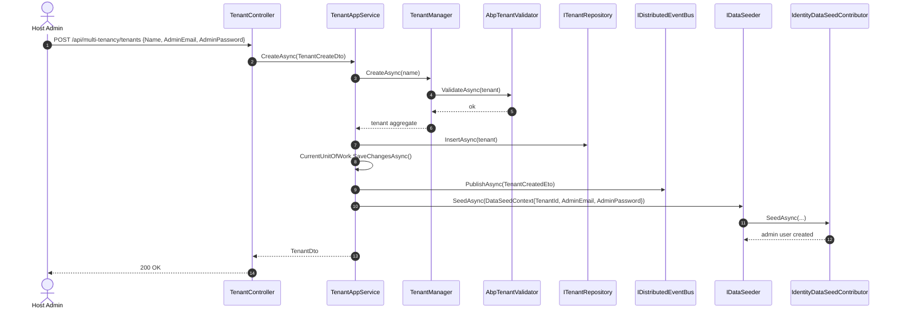
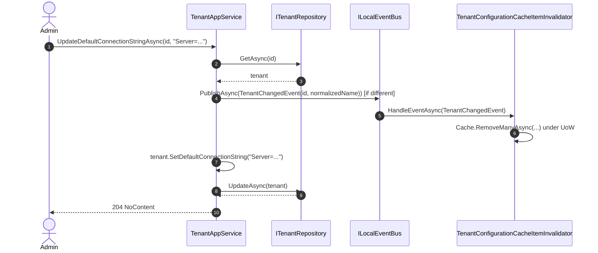

The Tenant Management **application** project wraps the domain aggregates with an `[Authorize]`-gated CRUD app service, exposes paged listing, drives connection-string mutation, publishes the `TenantCreatedEto` distributed event, and triggers per-tenant data seeding for the new tenant. This page walks `Volo.Abp.TenantManagement.Application` and the matching `Application.Contracts` side by side.

## Contracts

`Volo.Abp.TenantManagement.Application.Contracts` ships the public surface that remote clients (Razor pages, Blazor components, Angular front-end, microservices) consume:

```csharp
public interface ITenantAppService :
    ICrudAppService<TenantDto, Guid, GetTenantsInput, TenantCreateDto, TenantUpdateDto>
{
    Task<string> GetDefaultConnectionStringAsync(Guid id);
    Task         UpdateDefaultConnectionStringAsync(Guid id, string defaultConnectionString);
    Task         DeleteDefaultConnectionStringAsync(Guid id);
}
```

`ICrudAppService<TDto, TKey, TGetListInput, TCreateInput, TUpdateInput>` is the framework's standard CRUD contract — it gives you `GetAsync(Guid)`, `GetListAsync(GetTenantsInput)`, `CreateAsync(TenantCreateDto)`, `UpdateAsync(Guid, TenantUpdateDto)` and `DeleteAsync(Guid)` for free. The three connection-string methods are bespoke additions.

### DTOs

- `TenantDto : ExtensibleEntityDto<Guid>, IHasConcurrencyStamp` carries `Name` and `ConcurrencyStamp`. Extending it through ABP's object-extension system adds extra columns automatically.
- `GetTenantsInput : PagedAndSortedResultRequestDto` adds a `Filter` string for the search box.
- `TenantCreateOrUpdateDtoBase : ExtensibleObject` has the shared `Name` property annotated `[Required]` and `[DynamicStringLength(typeof(TenantConsts), nameof(TenantConsts.MaxNameLength))]` so the length tracks the domain constant.
- `TenantCreateDto : TenantCreateOrUpdateDtoBase` adds `AdminEmailAddress` (`[Required] [EmailAddress] [MaxLength(256)]`) and `AdminPassword` (`[Required] [MaxLength(128)] [DisableAuditing]`). The `[DisableAuditing]` annotation prevents the password from being captured in the audit log.
- `TenantUpdateDto : TenantCreateOrUpdateDtoBase, IHasConcurrencyStamp` adds `ConcurrencyStamp` so the update uses optimistic concurrency.

### Permissions

`TenantManagementPermissions` declares the six permission constants. `AbpTenantManagementPermissionDefinitionProvider` registers them with the framework's permission system:

```csharp
public override void Define(IPermissionDefinitionContext context)
{
    var tenantManagementGroup = context.AddGroup(TenantManagementPermissions.GroupName,
                                                  L("Permission:TenantManagement"));
    var tenantsPermission = tenantManagementGroup.AddPermission(
        TenantManagementPermissions.Tenants.Default,
        L("Permission:TenantManagement"),
        multiTenancySide: MultiTenancySides.Host);

    tenantsPermission.AddChild(TenantManagementPermissions.Tenants.Create, ..., MultiTenancySides.Host);
    tenantsPermission.AddChild(TenantManagementPermissions.Tenants.Update, ..., MultiTenancySides.Host);
    tenantsPermission.AddChild(TenantManagementPermissions.Tenants.Delete, ..., MultiTenancySides.Host);
    tenantsPermission.AddChild(TenantManagementPermissions.Tenants.ManageFeatures, ..., MultiTenancySides.Host);
    tenantsPermission.AddChild(TenantManagementPermissions.Tenants.ManageConnectionStrings, ..., MultiTenancySides.Host);
}
```

Every permission is `multiTenancySide: MultiTenancySides.Host`, so a tenant-side admin can never see these toggles in their permission tree — they're host-only by design.

### Remote service constants

`TenantManagementRemoteServiceConsts.RemoteServiceName = "AbpTenantManagement"` and `.ModuleName = "abpTenantManagement"` are the values bound to `[RemoteService(Name = ...)]` and `[Area]` on the controller — see [Web UI](/module-tenant-management/web).

## Application module

`Volo.Abp.TenantManagement.AbpTenantManagementApplicationModule` registers the Mapperly mappers (`AbpTenantManagementApplicationMapperlyMappers`) that translate `Tenant → TenantDto`, `TenantCreateDto → ExtensibleObject` (extra-properties path) and the page-input objects. `TenantManagementAppServiceBase : ApplicationService` is the shared base that locks `ObjectMapperContext` to `AbpTenantManagementApplicationModule` and `LocalizationResource` to `AbpTenantManagementResource` so subclasses do not need to repeat that boilerplate.

## `TenantAppService`

`TenantAppService : TenantManagementAppServiceBase, ITenantAppService` is decorated `[Authorize(TenantManagementPermissions.Tenants.Default)]` at the class level. The constructor injects:

```csharp
public TenantAppService(
    ITenantRepository tenantRepository,
    ITenantManager tenantManager,
    IDataSeeder dataSeeder,
    IDistributedEventBus distributedEventBus,
    ILocalEventBus localEventBus)
```

The unusual inclusion of `IDataSeeder` is the giveaway that this service does more than CRUD — it bootstraps tenant data. The unusual inclusion of `ILocalEventBus` is needed for `TenantChangedEvent` publishes during connection-string mutation.

### GetAsync / GetListAsync

```csharp
public virtual async Task<TenantDto> GetAsync(Guid id) =>
    ObjectMapper.Map<Tenant, TenantDto>(await TenantRepository.GetAsync(id));

public virtual async Task<PagedResultDto<TenantDto>> GetListAsync(GetTenantsInput input)
{
    if (input.Sorting.IsNullOrWhiteSpace()) input.Sorting = nameof(Tenant.Name);

    var count = await TenantRepository.GetCountAsync(input.Filter);
    var list  = await TenantRepository.GetListAsync(input.Sorting, input.MaxResultCount,
                                                     input.SkipCount, input.Filter);
    return new PagedResultDto<TenantDto>(count,
        ObjectMapper.Map<List<Tenant>, List<TenantDto>>(list));
}
```

Default sort is `nameof(Tenant.Name)`. The filter is passed straight to `ITenantRepository.GetCountAsync` and `GetListAsync` which apply `WhereIf(filter)` in both EF and Mongo implementations.

### CreateAsync — the data-seeding pivot

This is where the application layer earns its keep:

```csharp
[Authorize(TenantManagementPermissions.Tenants.Create)]
public virtual async Task<TenantDto> CreateAsync(TenantCreateDto input)
{
    var tenant = await TenantManager.CreateAsync(input.Name);
    input.MapExtraPropertiesTo(tenant);

    await TenantRepository.InsertAsync(tenant);
    await CurrentUnitOfWork.SaveChangesAsync();

    await DistributedEventBus.PublishAsync(new TenantCreatedEto
    {
        Id = tenant.Id,
        Name = tenant.Name,
        Properties =
        {
            { "AdminEmail",    input.AdminEmailAddress },
            { "AdminPassword", input.AdminPassword }
        }
    });

    using (CurrentTenant.Change(tenant.Id, tenant.Name))
    {
        await DataSeeder.SeedAsync(
            new DataSeedContext(tenant.Id)
                .WithProperty("AdminEmail",    input.AdminEmailAddress)
                .WithProperty("AdminPassword", input.AdminPassword));
    }

    return ObjectMapper.Map<Tenant, TenantDto>(tenant);
}
```

There are five distinct phases:

1. **Domain construction.** `TenantManager.CreateAsync(input.Name)` builds the aggregate, normalizes the name, and runs `AbpTenantValidator` to ensure uniqueness.
2. **Extra properties.** `input.MapExtraPropertiesTo(tenant)` copies any object-extension fields from the DTO to the entity.
3. **Persistence.** `TenantRepository.InsertAsync` followed by an explicit `CurrentUnitOfWork.SaveChangesAsync()` so the tenant row exists before the distributed event fires.
4. **Distributed event.** `TenantCreatedEto` carries the admin credentials in `Properties` so that microservice consumers (`EfCoreDatabaseMigrationEventHandlerBase`, `MongoDatabaseMigrationEventHandlerBase`) can both materialize per-tenant databases *and* seed the admin user.
5. **Local seed.** `using (CurrentTenant.Change(tenant.Id, tenant.Name))` switches the ambient tenant for the seeder call. `DataSeeder.SeedAsync(new DataSeedContext(tenant.Id).WithProperty(...))` runs every registered `IDataSeedContributor` against the new tenant — typically the Identity module's `IdentityDataSeedContributor` consumes those `AdminEmail` / `AdminPassword` properties to create the initial admin user.

The result is that a single `POST /api/multi-tenancy/tenants` produces a fully usable tenant with a primary admin and a freshly migrated database.

### UpdateAsync

```csharp
[Authorize(TenantManagementPermissions.Tenants.Update)]
public virtual async Task<TenantDto> UpdateAsync(Guid id, TenantUpdateDto input)
{
    var tenant = await TenantRepository.GetAsync(id);
    await TenantManager.ChangeNameAsync(tenant, input.Name);
    tenant.SetConcurrencyStampIfNotNull(input.ConcurrencyStamp);
    input.MapExtraPropertiesTo(tenant);
    await TenantRepository.UpdateAsync(tenant);
    return ObjectMapper.Map<Tenant, TenantDto>(tenant);
}
```

`ChangeNameAsync` publishes the local `TenantChangedEvent` for the cache invalidator before mutating the aggregate. `SetConcurrencyStampIfNotNull` is a framework helper that only writes when the client supplied a stamp — when omitted the update behaves like a server-authoritative overwrite.

### DeleteAsync

```csharp
[Authorize(TenantManagementPermissions.Tenants.Delete)]
public virtual async Task DeleteAsync(Guid id)
{
    var tenant = await TenantRepository.FindAsync(id);
    if (tenant == null) return;
    await TenantRepository.DeleteAsync(tenant);
}
```

`FindAsync` rather than `GetAsync` so a repeat-delete is idempotent and returns 204 instead of 404. The framework's `EntityChangedEventData<Tenant>` fires automatically when the entity is removed; `TenantConfigurationCacheItemInvalidator` ignores `EntityCreatedEventData<Tenant>` but processes deletions through the base `EntityChangedEventData<Tenant>` handler.

### Connection-string endpoints

The three connection-string methods are guarded by the dedicated permission:

```csharp
[Authorize(TenantManagementPermissions.Tenants.ManageConnectionStrings)]
public virtual async Task<string> GetDefaultConnectionStringAsync(Guid id)
{
    var tenant = await TenantRepository.GetAsync(id);
    return tenant?.FindDefaultConnectionString();
}

[Authorize(TenantManagementPermissions.Tenants.ManageConnectionStrings)]
public virtual async Task UpdateDefaultConnectionStringAsync(Guid id, string defaultConnectionString)
{
    var tenant = await TenantRepository.GetAsync(id);
    if (tenant.FindDefaultConnectionString() != defaultConnectionString)
    {
        await LocalEventBus.PublishAsync(new TenantChangedEvent(tenant.Id, tenant.NormalizedName));
    }
    tenant.SetDefaultConnectionString(defaultConnectionString);
    await TenantRepository.UpdateAsync(tenant);
}

[Authorize(TenantManagementPermissions.Tenants.ManageConnectionStrings)]
public virtual async Task DeleteDefaultConnectionStringAsync(Guid id)
{
    var tenant = await TenantRepository.GetAsync(id);
    tenant.RemoveDefaultConnectionString();
    await LocalEventBus.PublishAsync(new TenantChangedEvent(tenant.Id, tenant.NormalizedName));
    await TenantRepository.UpdateAsync(tenant);
}
```

The "only publish if different" check in `UpdateDefaultConnectionStringAsync` skips a noisy cache flush when the admin saves the form without changing anything. `DeleteDefaultConnectionStringAsync` always publishes because removing the override always changes the resolution path. Both call into `Tenant.SetDefaultConnectionString` / `RemoveDefaultConnectionString`, which delegate to the same `SetConnectionString(name, value)` / `RemoveConnectionString(name)` API with `name = Volo.Abp.Data.ConnectionStrings.DefaultConnectionStringName`.

<Note>
Although the published event is the local `TenantChangedEvent`, framework consumers also listen for the distributed `TenantConnectionStringUpdatedEto` (declared in `Volo.Abp.MultiTenancy.Abstractions`). Solutions that need a distributed signal should add a custom handler that translates `TenantChangedEvent` into the distributed ETO.
</Note>

## Settings

The Tenant Management module exposes no public settings of its own — there are no `ISettingDefinitionProvider` registrations. Tenant-specific configuration goes through the Setting Management module's per-tenant providers (see [Setting Mgmt](/psf/setting-management)). The Feature Management module is the integration partner — the `Tenant.Features` toggle group is rendered through `FeatureManagementModal` opened from the tenant list page.

## Sequence: end-to-end CreateAsync



## Where to extend

<AccordionGroup>
  <Accordion title="Add a custom field to the tenant form" icon="square-plus">
    Register an object extension via `ObjectExtensionManager.Instance.Modules().ConfigureTenantManagement(...)`. The DTOs are `ExtensibleObject`/`ExtensibleEntityDto<Guid>`, so the property flows through the entire stack including the Razor and Blazor forms.
  </Accordion>
  <Accordion title="React to tenant creation" icon="bell">
    Implement `IDistributedEventHandler<TenantCreatedEto>` in your own service. Use the `Properties` dictionary on the ETO to get the admin credentials.
  </Accordion>
  <Accordion title="Custom seeding" icon="seedling">
    Implement `IDataSeedContributor` and ABP automatically picks it up. `DataSeedContext.TenantId` and `WithProperty` make the per-tenant flow work transparently.
  </Accordion>
</AccordionGroup>

## Object-extension on the DTOs

`TenantDto : ExtensibleEntityDto<Guid>` and the create/update DTOs all derive from `ExtensibleObject` (with `false` passed to the base constructor on `TenantCreateOrUpdateDtoBase` to opt out of static-property registration). That means any property registered through `ObjectExtensionManager.Instance.Modules().ConfigureTenantManagement(...)` flows through:

1. Razor/Blazor form — rendered automatically by `AbpExtensibleDataGrid` and `AbpExtensibleForm`.
2. DTO `ExtraProperties` — populated by `input.MapExtraPropertiesTo(tenant)` in `CreateAsync` and `UpdateAsync`.
3. Aggregate entity — stored either as a real EF column (when registered with `MapEfCoreProperty`) or in the `ExtraProperties` dictionary serialized to a single column.
4. Database — emitted by `TenantManagementDbContextModelCreatingExtensions.ConfigureTenantManagement` when the property includes EF mapping metadata.

## Mapping

`Volo.Abp.TenantManagement.AbpTenantManagementApplicationMapperlyMappers` is the partial Mapperly class wired by `AbpTenantManagementApplicationModule`:

```csharp
partial TenantDto Map(Tenant source);
partial List<TenantDto> Map(List<Tenant> sources);
```

The single-entity overload is invoked from `GetAsync`, `CreateAsync` (return value), `UpdateAsync` (return value); the list overload from `GetListAsync`. Because `TenantDto.ConcurrencyStamp` maps from `Tenant.ConcurrencyStamp` (inherited via `FullAuditedAggregateRoot`), the round-trip preserves optimistic concurrency without manual code.

## Connection-string flow in detail

Updating the default connection string is unusual in that it is the only place the application service writes *directly* to the aggregate via mutation methods rather than going through `TenantManager`:



The publish happens *before* the mutation so that any handler reading the existing cache entry sees the prior connection string and can act on the change at the right boundary.

## HttpApi.Client proxy

`Volo.Abp.TenantManagement.HttpApi.Client.TenantClientProxy : ITenantAppService` is the generated dynamic C# proxy that microservices can `IServiceCollection`-register to call the host's tenant management API as if it were local. The proxy obeys the same `[Authorize]` attributes — calls with insufficient credentials raise the standard `AbpAuthorizationException` on the server side and surface as a 403 over the wire.

Continue to [Web UI](/module-tenant-management/web) for the Razor Pages and Blazor surface that drives `TenantAppService`.
