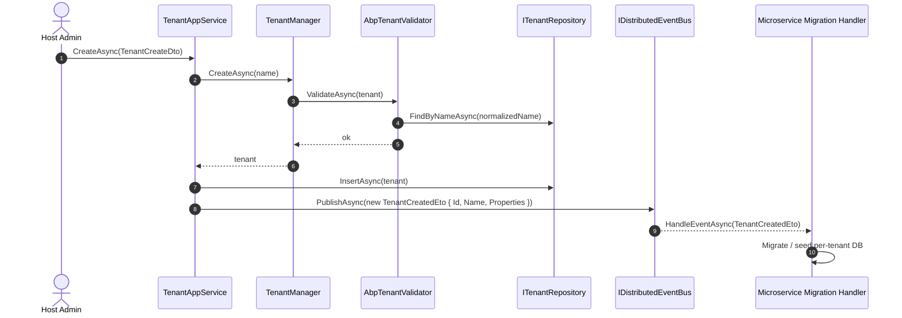

The `Volo.Abp.TenantManagement.Domain` project owns every aggregate, repository contract, domain service, validator, store override and distributed-event ETO that the ABP Framework Tenant Management module needs. This page maps each file to its responsibility so you can extend or replace any piece without surprising the rest.

## Module bootstrap

`Volo.Abp.TenantManagement.AbpTenantManagementDomainModule` depends on `AbpMultiTenancyModule`, `AbpTenantManagementDomainSharedModule`, `AbpDataModule`, `AbpDddDomainModule`, `AbpMapperlyModule` and `AbpCachingModule`. Its `ConfigureServices` registers two things:

```csharp
context.Services.AddMapperlyObjectMapper<AbpTenantManagementDomainModule>();

Configure<AbpDistributedEntityEventOptions>(options =>
{
    options.EtoMappings.Add<Tenant, TenantEto>(typeof(AbpTenantManagementDomainModule));
});
```

The first call wires the Mapperly-generated maps from `AbpTenantManagementDomainMapperlyMappers` so `TenantStore` and `TenantAppService` can `ObjectMapper.Map<Tenant, TenantConfiguration>` and `ObjectMapper.Map<List<Tenant>, List<TenantDto>>`. The second registers the entity-to-ETO mapping that the distributed event bus uses whenever `Tenant` rows mutate — `TenantEto` (defined in `Volo.Abp.TenantManagement.Domain.Shared/Volo/Abp/TenantManagement/TenantEto.cs`) carries `Id`, `Name` and `EntityVersion` only, deliberately omitting connection strings.

`PostConfigureServices` runs a `OneTimeRunner` block that calls `ModuleExtensionConfigurationHelper.ApplyEntityConfigurationToEntity` with `TenantManagementModuleExtensionConsts.ModuleName` and `EntityNames.Tenant`. This makes any extra-property declarations registered through `ObjectExtensionManager` become real EF / Mongo columns on the `Tenant` table.

## The `Tenant` aggregate

`Volo.Abp.TenantManagement.Tenant : FullAuditedAggregateRoot<Guid>, IHasEntityVersion` is intentionally narrow. The four properties are:

```csharp
public virtual string Name           { get; protected set; }
public virtual string NormalizedName { get; protected set; }
public virtual int    EntityVersion  { get; protected set; }
public virtual List<TenantConnectionString> ConnectionStrings { get; protected set; }
```

`IHasEntityVersion` means `EntityVersion` is incremented automatically on every mutation, which the cache invalidation flow uses to spot stale `TenantConfigurationCacheItem` entries.

The protected `internal` constructor takes `Guid id, string name, string normalizedName`, calls `SetName(name)` and `SetNormalizedName(normalizedName)` and initializes the empty connection-string list. The mutation API is connection-string focused:

```csharp
public virtual string FindDefaultConnectionString();
public virtual string FindConnectionString(string name);
public virtual void   SetDefaultConnectionString(string connectionString);
public virtual void   SetConnectionString(string name, string connectionString);
public virtual void   RemoveDefaultConnectionString();
public virtual void   RemoveConnectionString(string name);
```

The "default" overloads delegate to the named ones using `Data.ConnectionStrings.DefaultConnectionStringName` — the same constant that `IConnectionStringResolver` reads, ensuring the tenant's default connection string lines up with the framework convention.

`SetName(name)` and `SetNormalizedName(normalizedName)` are `protected internal virtual` so they can be invoked by `TenantManager.ChangeNameAsync` but not by application code. `SetName` enforces `TenantConsts.MaxNameLength` through `Check.NotNullOrWhiteSpace(name, nameof(name), TenantConsts.MaxNameLength)`.

## `TenantConnectionString`

`Volo.Abp.TenantManagement.TenantConnectionString : Entity` is a child entity, not a full aggregate root. Its identity is the composite `(TenantId, Name)`:

```csharp
public class TenantConnectionString : Entity
{
    public virtual Guid   TenantId { get; protected set; }
    public virtual string Name     { get; protected set; }
    public virtual string Value    { get; protected set; }

    public override object[] GetKeys() => new object[] { TenantId, Name };
}
```

The constructor checks `Name` against `TenantConnectionStringConsts.MaxNameLength` and `Value` against `TenantConnectionStringConsts.MaxValueLength`. `SetValue(string)` re-validates length on update. This is the row that backs the `ManageConnectionStrings` permission.

## Repository contract

`ITenantRepository : IBasicRepository<Tenant, Guid>` exposes the lookups used by `TenantStore`, `AbpTenantValidator` and `TenantAppService`:

```csharp
Task<Tenant>       FindByNameAsync(string normalizedName, bool includeDetails = true, ...);
Task<List<Tenant>> GetListAsync(string sorting = null, int maxResultCount = int.MaxValue,
                                int skipCount = 0, string filter = null,
                                bool includeDetails = false, ...);
Task<long>         GetCountAsync(string filter = null, ...);
```

The interface also keeps two `[Obsolete]` synchronous variants `FindByName(string normalizedName, bool includeDetails = true)` and `FindById(Guid id, bool includeDetails = true)` for compatibility with older callers — both flagged so the analyzers will steer you to the async overloads.

The EF Core implementation `EfCoreTenantRepository` extends `EfCoreRepository<ITenantManagementDbContext, Tenant, Guid>` and uses an `IncludeDetails(includeDetails)` extension (defined in `TenantManagementEfCoreQueryableExtensions`) to pull `ConnectionStrings` in. The Mongo implementation `MongoTenantRepository` ignores the parameter because the connection strings already live inside the same document.

## `TenantManager` — the domain service

`Volo.Abp.TenantManagement.ITenantManager : IDomainService` is deliberately tiny:

```csharp
public interface ITenantManager : IDomainService
{
    [NotNull] Task<Tenant> CreateAsync([NotNull] string name);
    Task ChangeNameAsync([NotNull] Tenant tenant, [NotNull] string name);
}
```

The default `TenantManager : DomainService, ITenantManager` injects `ITenantValidator`, `ITenantNormalizer` and `ILocalEventBus`. `CreateAsync`:

```csharp
public virtual async Task<Tenant> CreateAsync(string name)
{
    Check.NotNull(name, nameof(name));
    var tenant = new Tenant(GuidGenerator.Create(), name, TenantNormalizer.NormalizeName(name));
    await TenantValidator.ValidateAsync(tenant);
    return tenant;
}
```

`ChangeNameAsync` is interesting because it publishes a local `TenantChangedEvent(tenant.Id, tenant.NormalizedName)` **before** changing the name — that's the hook `TenantConfigurationCacheItemInvalidator` listens to so the cache eviction happens against the *old* normalized name. Only after the publish does the manager call `tenant.SetName(name)`, `tenant.SetNormalizedName(TenantNormalizer.NormalizeName(name))` and re-run `TenantValidator.ValidateAsync(tenant)`.

`ITenantNormalizer` (declared in the framework `Volo.Abp.MultiTenancy.Abstractions`) is the same normalizer used for case-insensitive lookups elsewhere — typically an `UpperInvariant` transform.

## `AbpTenantValidator`

`AbpTenantValidator : ITenantValidator, ITransientDependency` enforces the uniqueness invariant:

```csharp
public virtual async Task ValidateAsync(Tenant tenant)
{
    Check.NotNullOrWhiteSpace(tenant.Name, nameof(tenant.Name));
    Check.NotNullOrWhiteSpace(tenant.NormalizedName, nameof(tenant.NormalizedName));

    var owner = await TenantRepository.FindByNameAsync(tenant.NormalizedName);
    if (owner != null && owner.Id != tenant.Id)
    {
        throw new BusinessException("Volo.Abp.TenantManagement:DuplicateTenantName")
            .WithData("Name", tenant.NormalizedName);
    }
}
```

The exception code `Volo.Abp.TenantManagement:DuplicateTenantName` is localized through `AbpTenantManagementResource` so the admin UI shows a friendly message rather than a stack trace.

## `TenantStore` — replacing the framework's `NullTenantStore`

`TenantStore : ITenantStore, ITransientDependency` is the single biggest piece of public API in this layer. It satisfies the framework's `Volo.Abp.MultiTenancy.ITenantStore` interface that `ITenantConfigurationProvider` calls during tenant resolution. The class is constructor-injected with `ITenantRepository`, `IObjectMapper<AbpTenantManagementDomainModule>`, `ICurrentTenant` and `IDistributedCache<TenantConfigurationCacheItem>`.

```csharp
public virtual async Task<TenantConfiguration> FindAsync(string normalizedName) =>
    (await GetCacheItemAsync(null, normalizedName)).Value;

public virtual async Task<TenantConfiguration> FindAsync(Guid id) =>
    (await GetCacheItemAsync(id, null)).Value;

public virtual async Task<IReadOnlyList<TenantConfiguration>> GetListAsync(bool includeDetails = false) =>
    ObjectMapper.Map<List<Tenant>, List<TenantConfiguration>>(
        await TenantRepository.GetListAsync(includeDetails));
```

`GetCacheItemAsync(Guid? id, string normalizedName)` first probes the cache with `Cache.GetAsync(cacheKey, considerUow: true)`. On a miss it calls either `TenantRepository.FindAsync(id.Value)` or `TenantRepository.FindByNameAsync(normalizedName)` inside `using (CurrentTenant.Change(null))` so the tenant data filter does not hide the host-scoped row, then writes back via `SetCacheAsync(cacheKey, tenant)`. The cache uses `IDistributedCache<TenantConfigurationCacheItem>` — the key shape is computed by `TenantConfigurationCacheItem.CalculateCacheKey(id, normalizedName)`.

The two `[Obsolete]` synchronous methods `Find(string normalizedName)` and `Find(Guid id)` invoke a synchronous `GetCacheItem` helper for backwards compatibility.

## `TenantConfigurationCacheItem` and the invalidator

`TenantConfigurationCacheItem` wraps a `TenantConfiguration` and exposes the `CalculateCacheKey(Guid? id, string normalizedName)` static helper. The keys come in three shapes — `(id, null)`, `(null, normalizedName)`, `(id, normalizedName)` — because callers might know either side or both.

`TenantConfigurationCacheItemInvalidator` is registered with `[LocalEventHandlerOrder(-1)]` so it runs before any default-priority handler:

```csharp
public class TenantConfigurationCacheItemInvalidator :
    ILocalEventHandler<EntityChangedEventData<Tenant>>,
    ILocalEventHandler<TenantChangedEvent>,
    ITransientDependency
{
    public virtual async Task HandleEventAsync(EntityChangedEventData<Tenant> eventData)
    {
        if (eventData is EntityCreatedEventData<Tenant>) return;
        await ClearCacheAsync(eventData.Entity.Id, eventData.Entity.NormalizedName);
    }

    public virtual async Task HandleEventAsync(TenantChangedEvent eventData)
    {
        await ClearCacheAsync(eventData.Id, eventData.NormalizedName);
    }

    protected virtual async Task ClearCacheAsync(Guid? id, string normalizedName)
    {
        await Cache.RemoveManyAsync(new[]
        {
            TenantConfigurationCacheItem.CalculateCacheKey(id, null),
            TenantConfigurationCacheItem.CalculateCacheKey(null, normalizedName),
            TenantConfigurationCacheItem.CalculateCacheKey(id, normalizedName),
        }, considerUow: true);
    }
}
```

The `EntityCreatedEventData<Tenant>` short-circuit avoids invalidating a cache for a fresh row — no prior entries can exist. `considerUow: true` ensures the eviction is enlisted in the active unit-of-work so it commits with the rest of the transaction.

## Distributed ETOs published from the module

Although the ETO classes themselves live in the framework, this module is responsible for publishing them. `TenantAppService.CreateAsync` (covered in [Application](/module-tenant-management/application)) publishes:

```csharp
new TenantCreatedEto
{
    Id = tenant.Id,
    Name = tenant.Name,
    Properties =
    {
        { "AdminEmail",    input.AdminEmailAddress },
        { "AdminPassword", input.AdminPassword }
    }
}
```

`TenantCreatedEto`, `TenantConnectionStringUpdatedEto` and `CreateTenantEto` all live in `Volo.Abp.MultiTenancy.Abstractions`. The framework already declares `EfCoreDatabaseMigrationEventHandlerBase : IDistributedEventHandler<TenantCreatedEto>` and `MongoDatabaseMigrationEventHandlerBase : IDistributedEventHandler<TenantCreatedEto>` so any solution that depends on the persistence modules automatically picks up tenant-aware database migration and seeding.

For local in-process change notification the module also uses `TenantChangedEvent(Guid Id, string NormalizedName)` (declared in `Volo.Abp.MultiTenancy.Abstractions`) — published in `TenantManager.ChangeNameAsync` *before* the entity is mutated so consumers see a consistent "old" identity.

## `TenantManagementModuleExtensionConsts`

The constants in `Volo.Abp.ObjectExtending.TenantManagementModuleExtensionConsts` are the canonical names for object extension:

```csharp
public static class TenantManagementModuleExtensionConsts
{
    public const string ModuleName = "AbpTenantManagement";
    public static class EntityNames { public const string Tenant = "Tenant"; }
}
```

`TenantManagementModuleExtensionConfiguration` and `TenantManagementModuleExtensionConfigurationDictionaryExtensions` (also in `Domain.Shared`) provide the fluent API used by host applications to register extra properties:

```csharp
ObjectExtensionManager.Instance.Modules()
    .ConfigureTenantManagement(t => t.ConfigureTenant(tenant =>
    {
        tenant.AddOrUpdateProperty<string>("Notes");
    }));
```

The `PostConfigureServices` runner is what then maps those declarations onto the `Tenant` entity at startup.

## Sequence: creating a tenant



The `Mgr` step builds the aggregate but does *not* persist it; persistence happens at step 7 inside `TenantAppService.CreateAsync` together with the distributed event publish.

## Extending the layer

<AccordionGroup>
  <Accordion title="Add a domain rule" icon="shield-halved">
    Replace `ITenantValidator` via `services.Replace(ServiceDescriptor.Transient<ITenantValidator, MyTenantValidator>())`. Your implementation can call the original `AbpTenantValidator` first to keep the uniqueness check.
  </Accordion>
  <Accordion title="Override the cache key" icon="key">
    Subclass `TenantStore`, override `GetCacheItemAsync` and provide a wider key (for example to scope by tenant edition). Register the subclass through `services.Replace` so the framework's resolver picks it up.
  </Accordion>
  <Accordion title="Custom data on TenantEto" icon="paper-plane">
    Add properties via `ObjectExtensionManager` — they flow into `ExtraProperties` on both the entity and the ETO without requiring custom ETO classes.
  </Accordion>
</AccordionGroup>

## Persistence-friendly invariants

A few invariants in the aggregate make persistence simpler regardless of provider:

- `Tenant.Id : Guid` is generated by the framework's `IGuidGenerator`, not by the database. Both EF Core and MongoDB therefore store the Id as a client-supplied value and never need provider-specific ID generation strategies.
- `Tenant.ConnectionStrings` is a `List<TenantConnectionString>` rather than an `ICollection<>` — `TenantManagementDbContextModelCreatingExtensions.ConfigureTenantManagement` uses that to declare a cascade-delete relationship on the EF side and an embedded array on Mongo.
- `Tenant.EntityVersion` (from `IHasEntityVersion`) is mutated by the framework's `IConcurrencyStampGenerator` plumbing; the domain code does not need to touch it.

## Validation helpers

`Volo.Abp.TenantManagement.AbpTenantValidator` is registered as `[ITransientDependency]` so it gets a fresh repository per call. Replace it with `services.Replace(ServiceDescriptor.Transient<ITenantValidator, MyValidator>())` to add custom rules — for example a regex on tenant names or a reserved-word list.

A common pattern is to chain validators by accepting `ITenantValidator` as a constructor dependency, running your custom rules first, then awaiting `base.ValidateAsync(tenant)` on the original implementation.

## Module-extension surface

The `PostConfigureServices` runner mentioned in the bootstrap section is what enables the object-extension pipeline. The companion classes in `Volo.Abp.ObjectExtending`:

- `TenantManagementModuleExtensionConfiguration` — fluent root for `ConfigureTenantManagement`.
- `TenantManagementModuleExtensionConfigurationDictionaryExtensions` — dictionary-style accessor used internally.
- `TenantManagementModuleExtensionConsts` — `ModuleName = "AbpTenantManagement"`, `EntityNames.Tenant = "Tenant"`.

A host adds a column like this:

```csharp
ObjectExtensionManager.Instance
    .Modules()
    .ConfigureTenantManagement(t => t.ConfigureTenant(tenant =>
    {
        tenant.AddOrUpdateProperty<string>("Notes", p =>
        {
            p.Attributes.Add(new RequiredAttribute());
        });
    }));
```

The property automatically becomes:

- An EF Core column on the `AbpTenants` table.
- A field on the Mongo document.
- A form input on the create and edit Razor and Blazor modals.
- A serialized property on `TenantDto.ExtraProperties`, `TenantCreateDto.ExtraProperties` and `TenantUpdateDto.ExtraProperties`.

## Caching layer recap

| Cache `T` | Key | Owner | Invalidated by |
| --- | --- | --- | --- |
| `TenantConfigurationCacheItem` | `TenantConfigurationCacheItem.CalculateCacheKey(id, normalizedName)` | `TenantStore` | `TenantConfigurationCacheItemInvalidator` |

The single cache entry stores enough information to satisfy both `ITenantStore.FindAsync(Guid id)` and `FindAsync(string normalizedName)`. Three key shapes — `(id, null)`, `(null, name)`, `(id, name)` — exist because the invalidator clears all three when an entity changes, while reads populate whichever specific key was queried.

Continue to [Application](/module-tenant-management/application) for `TenantAppService` and the CRUD DTOs, or [Web UI](/module-tenant-management/web) for the Razor and Blazor pages.
