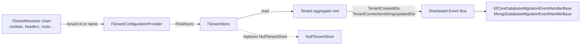
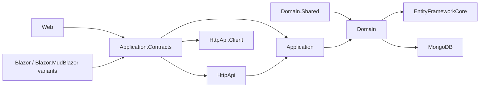
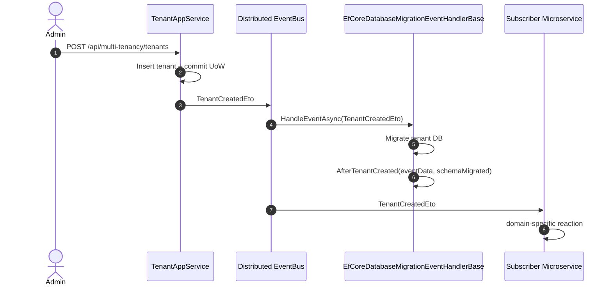

The **Tenant Management module** is the ABP Framework's batteries-included implementation of multi-tenancy administration. It supplies a persisted `Tenant` aggregate with per-tenant connection strings, replaces the framework's null `ITenantStore` with a cache-backed one, exposes a CRUD `TenantAppService`, publishes distributed `TenantCreatedEto` / `TenantConnectionStringUpdatedEto` events, and ships Razor Pages + Blazor admin UIs. Source lives under `modules/tenant-management/src`.

## How it fits the framework

ABP's core multi-tenancy contracts — `ICurrentTenant`, `ITenantConfigurationProvider`, `ITenantResolver`, `ITenantStore` — live in `Volo.Abp.MultiTenancy.Abstractions`. The framework ships a `NullTenantStore` as a fallback. **This module replaces that fallback** with `Volo.Abp.TenantManagement.TenantStore : ITenantStore, ITransientDependency` so that the tenant resolution pipeline can ask "give me the tenant with this Id or normalized name" and get back a real database-backed `TenantConfiguration`.



The store override is what enables the rest of an ABP solution to be tenant-aware without each module knowing about the tenant management database.

## Package map



The module ships the canonical sixteen-package layout that ABP applies to every administration feature. Notable additions versus the PSF modules are the dedicated `TenantManagementHttpApi.Client` package (a typed proxy) and the absence of a `.Domain.Identity` adapter — tenant management has no per-subject providers because tenants *are* the subject.

## Aggregate roots

`Volo.Abp.TenantManagement.Tenant` is a `FullAuditedAggregateRoot<Guid>` and implements `IHasEntityVersion`:

```csharp
public class Tenant : FullAuditedAggregateRoot<Guid>, IHasEntityVersion
{
    public virtual string Name           { get; protected set; }
    public virtual string NormalizedName { get; protected set; }
    public virtual int    EntityVersion  { get; protected set; }
    public virtual List<TenantConnectionString> ConnectionStrings { get; protected set; }
}
```

`TenantConnectionString` is a child `Entity` keyed by `(TenantId, Name)`. The aggregate exposes `FindDefaultConnectionString()`, `FindConnectionString(name)`, `SetConnectionString(name, value)`, `SetDefaultConnectionString(value)`, `RemoveConnectionString(name)` and `RemoveDefaultConnectionString()` — a complete connection-string vocabulary that the modular runtime uses through `Volo.Abp.Data.ConnectionStrings.DefaultConnectionStringName`.

The pair lives in `Volo.Abp.TenantManagement.Domain` together with `ITenantRepository`, `ITenantManager`, `TenantManager`, `TenantStore` and `AbpTenantValidator`. See [Domain](/module-tenant-management/domain) for the deeper walkthrough.

## TenantStore replacement

`TenantStore : ITenantStore, ITransientDependency` is the replacement for `NullTenantStore`. It is constructed with `ITenantRepository`, an `IObjectMapper<AbpTenantManagementDomainModule>`, `ICurrentTenant` and an `IDistributedCache<TenantConfigurationCacheItem>`:

```csharp
public virtual async Task<TenantConfiguration> FindAsync(string normalizedName)
{
    return (await GetCacheItemAsync(null, normalizedName)).Value;
}
```

`GetCacheItemAsync(id, normalizedName)` reads `Cache.GetAsync(cacheKey, considerUow: true)`; on a miss it loads through `TenantRepository.FindAsync(id)` or `FindByNameAsync(normalizedName)` under `using (CurrentTenant.Change(null))` and writes back via `SetCacheAsync`. The cache is busted by `TenantConfigurationCacheItemInvalidator`, an `ILocalEventHandler<EntityChangedEventData<Tenant>>` + `ILocalEventHandler<TenantChangedEvent>` that runs at `[LocalEventHandlerOrder(-1)]` so it precedes ordinary handlers and clears `(id, null)`, `(null, normalizedName)` and `(id, normalizedName)` cache keys.

## Distributed events

`AbpTenantManagementDomainModule.ConfigureServices` registers an ETO mapping:

```csharp
Configure<AbpDistributedEntityEventOptions>(options =>
{
    options.EtoMappings.Add<Tenant, TenantEto>(typeof(AbpTenantManagementDomainModule));
});
```

`TenantEto` is the shared transport type — declared in `Volo.Abp.TenantManagement.Domain.Shared/Volo/Abp/TenantManagement/TenantEto.cs`. It carries `Id`, `Name` and `EntityVersion`. Application-layer publishes augment this with framework-provided ETOs from `Volo.Abp.MultiTenancy.Abstractions`:

- `TenantCreatedEto` — published by `TenantAppService.CreateAsync` so that downstream services can run tenant-scoped data seeding. Consumed by `EfCoreDatabaseMigrationEventHandlerBase` and `MongoDatabaseMigrationEventHandlerBase` to materialize per-tenant databases.
- `TenantConnectionStringUpdatedEto` — published when an admin sets or clears a connection string, letting services with their own per-tenant DbContexts refresh their connection pools.

`TenantChangedEvent` is the *local* event used by `TenantManager.ChangeNameAsync` and `TenantConfigurationCacheItemInvalidator` to ensure the cache is busted before the database write commits.

## Options

`AbpTenantManagementDomainModule` has no public options class beyond the standard `AbpDistributedEntityEventOptions` and `ModuleExtensionConfigurationHelper.ApplyEntityConfigurationToEntity` call that wires the object-extending pipeline to the `Tenant` aggregate:

```csharp
public override void PostConfigureServices(ServiceConfigurationContext context)
{
    OneTimeRunner.Run(() =>
    {
        ModuleExtensionConfigurationHelper.ApplyEntityConfigurationToEntity(
            TenantManagementModuleExtensionConsts.ModuleName,
            TenantManagementModuleExtensionConsts.EntityNames.Tenant,
            typeof(Tenant));
    });
}
```

`TenantManagementModuleExtensionConsts.ModuleName = "AbpTenantManagement"` and `EntityNames.Tenant = "Tenant"` are the constants the host uses to declare extra properties on the tenant entity through `ObjectExtensionManager.Instance.Modules().ConfigureTenantManagement(...)`.

## Persistence

Both providers expose the same `ITenantRepository`. The EF Core version `Volo.Abp.TenantManagement.EntityFrameworkCore.TenantManagementDbContext` is decorated `[IgnoreMultiTenancy]` and `[ConnectionStringName(AbpTenantManagementDbProperties.ConnectionStringName)]`. It carries two `DbSet<>`s:

```csharp
public DbSet<Tenant>                  Tenants                 { get; set; }
public DbSet<TenantConnectionString>  TenantConnectionStrings { get; set; }
```

`OnModelCreating` calls `builder.ConfigureTenantManagement()` from `AbpTenantManagementDbContextModelCreatingExtensions`. `EfCoreTenantRepository : EfCoreRepository<ITenantManagementDbContext, Tenant, Guid>, ITenantRepository` implements the lookups, applying `WhereIf(!filter.IsNullOrWhiteSpace(), t => t.Name.Contains(filter) || t.NormalizedName.Contains(filter))` and `OrderBy(nameof(Tenant.Name))` defaults.

The MongoDB side, `AbpTenantManagementMongoDbModule` + `TenantManagementMongoDbContext` + `MongoTenantRepository`, mirrors the EF shape and stores each `Tenant` as a single document with embedded `ConnectionStrings`. See [Domain](/module-tenant-management/domain) for the schema and [Application](/module-tenant-management/application) for the app service that drives the writes.

## Public surface

| Layer | Type | Path |
| --- | --- | --- |
| Domain | `Tenant`, `TenantConnectionString` | `Volo.Abp.TenantManagement.Domain` |
| Domain | `ITenantRepository`, `ITenantManager`, `TenantManager`, `AbpTenantValidator`, `TenantStore` | `Volo.Abp.TenantManagement.Domain` |
| Contracts | `ITenantAppService : ICrudAppService<TenantDto, Guid, GetTenantsInput, TenantCreateDto, TenantUpdateDto>` | `Volo.Abp.TenantManagement.Application.Contracts` |
| Contracts | `TenantManagementPermissions`, `AbpTenantManagementPermissionDefinitionProvider` | `Volo.Abp.TenantManagement.Application.Contracts` |
| Application | `TenantAppService` | `Volo.Abp.TenantManagement.Application` |
| HTTP API | `TenantController` at `api/multi-tenancy/tenants` | `Volo.Abp.TenantManagement.HttpApi` |
| Web | `Tenants/Index.cshtml`, `CreateModal`, `EditModal`, `AbpTenantManagementWebMainMenuContributor` | `Volo.Abp.TenantManagement.Web` |
| Blazor | `TenantManagement.razor.cs`, `TenantManagementBlazorMenuContributor` | `Volo.Abp.TenantManagement.Blazor` and `.Blazor.MudBlazor` |

The four downstream pages explore each of those layers in depth: [Domain](/module-tenant-management/domain), [Application](/module-tenant-management/application), [Web UI](/module-tenant-management/web).

## Permissions

`Volo.Abp.TenantManagement.TenantManagementPermissions` defines:

```csharp
public static class TenantManagementPermissions
{
    public const string GroupName = "AbpTenantManagement";
    public static class Tenants
    {
        public const string Default                  = GroupName + ".Tenants";
        public const string Create                   = Default + ".Create";
        public const string Update                   = Default + ".Update";
        public const string Delete                   = Default + ".Delete";
        public const string ManageFeatures           = Default + ".ManageFeatures";
        public const string ManageConnectionStrings  = Default + ".ManageConnectionStrings";
    }
}
```

`AbpTenantManagementPermissionDefinitionProvider` is host-only — every permission is annotated `multiTenancySide: MultiTenancySides.Host` so it never appears on the tenant-side permission tree.

## Localization and constants

- `AbpTenantManagementResource` is the localization resource type, in `Volo.Abp.TenantManagement.Domain.Shared`.
- `TenantConsts.MaxNameLength` and `TenantConnectionStringConsts.MaxValueLength` are the validator-applied length limits.
- `TenantManagementRemoteServiceConsts.RemoteServiceName = "AbpTenantManagement"` and `.ModuleName = "abpTenantManagement"` are the values bound to `[Area]` and `[RemoteService(Name = ...)]` on the controller.

## Where this module sits in the framework hierarchy

`Volo.Abp.MultiTenancy.Abstractions` declares the contracts every tenant-aware piece of ABP code relies on: `ICurrentTenant`, `ITenantStore`, `ITenantResolver`, `ITenantConfigurationProvider`. `Volo.Abp.MultiTenancy` provides the in-process resolver chain (`HeaderTenantResolveContributor`, `QueryStringTenantResolveContributor`, `RouteTenantResolveContributor`, `CookieTenantResolveContributor`, `DomainTenantResolveContributor`) but ships `NullTenantStore` as the only `ITenantStore`. **This module is the missing piece**, replacing `NullTenantStore` with one backed by a real database while keeping the rest of the abstractions untouched.

The cooperation between framework and module is therefore:

1. The framework resolves the tenant identifier from the HTTP request through the contributor chain.
2. `ITenantConfigurationProvider` calls `ITenantStore.FindAsync(...)`.
3. `TenantStore` (from this module) reads the cached `TenantConfiguration` or loads it from `ITenantRepository`.
4. The framework sets `CurrentTenant.Change(tenantId, tenantName)` for the duration of the request.

## Domain-shared constants

`Volo.Abp.TenantManagement.AbpTenantManagementDbProperties` exposes the shared connection string and table-prefix constants:

```csharp
public static class AbpTenantManagementDbProperties
{
    public static string DbTablePrefix     { get; set; } = "Abp";
    public static string DbSchema          { get; set; } = null;
    public const  string ConnectionStringName = "AbpTenantManagement";
}
```

`TenantConsts.MaxNameLength = 64` and `TenantConnectionStringConsts.MaxNameLength` / `MaxValueLength` are the validation bounds enforced by `Tenant.SetName`, `TenantConnectionString` construction and the `[DynamicStringLength]` annotations on the DTOs. `TenantManagementModuleExtensionConsts.ModuleName = "AbpTenantManagement"` and `EntityNames.Tenant = "Tenant"` are the canonical names used by `ObjectExtensionManager` when an admin wants to add custom columns to the tenant grid.

## Quick start

A minimal solution adds tenant management by declaring the right module dependencies:

```csharp
[DependsOn(
    typeof(AbpTenantManagementDomainModule),
    typeof(AbpTenantManagementApplicationModule),
    typeof(AbpTenantManagementHttpApiModule),
    typeof(AbpTenantManagementEntityFrameworkCoreModule), // or .MongoDB
    typeof(AbpTenantManagementWebModule)                  // or .Blazor variants
)]
public class MyHostModule : AbpModule { }
```

That single declaration installs the `TenantStore` override, the controller at `api/multi-tenancy/tenants`, the Razor pages under `/TenantManagement/Tenants`, the menu item under Administration and the permission definitions on the host side. A microservice solution can omit the `.Web` package and lean on `Volo.Abp.TenantManagement.HttpApi.Client` for a typed proxy.

## Database migration handlers

`Volo.Abp.EntityFrameworkCore.Migrations.EfCoreDatabaseMigrationEventHandlerBase` and `Volo.Abp.MongoDB.Migrations.MongoDatabaseMigrationEventHandlerBase` are the framework-provided distributed handlers that consume `TenantCreatedEto`. When a host implements one of these bases — typically as part of a `DbMigrationService` — every new tenant automatically gets:

1. A per-tenant database materialized via `Database.MigrateAsync()` (EF) or its Mongo equivalent.
2. The schema applied through `MigrateSchemaAsync(eventData)` overrides.
3. The seed data injected by `IDataSeeder.SeedAsync(new DataSeedContext(eventData.Id).WithProperty("AdminEmail", ...))`.

The hand-off therefore looks like:



The same pattern applies to `TenantConnectionStringUpdatedEto` — handlers receive it whenever an admin updates the default connection string so per-tenant DbContexts can switch the resolved string without an app restart.

## File map at a glance

```
modules/tenant-management/src/
├── Volo.Abp.TenantManagement.Domain.Shared/
│   └── Volo/Abp/TenantManagement/
│       ├── AbpTenantManagementDomainSharedModule.cs
│       ├── TenantConsts.cs
│       ├── TenantConnectionStringConsts.cs
│       ├── TenantEto.cs
│       └── Localization/AbpTenantManagementResource.cs
├── Volo.Abp.TenantManagement.Domain/
│   └── Volo/Abp/TenantManagement/
│       ├── AbpTenantManagementDomainModule.cs
│       ├── AbpTenantManagementDbProperties.cs
│       ├── AbpTenantManagementDomainMapperlyMappers.cs
│       ├── AbpTenantValidator.cs
│       ├── ITenantManager.cs
│       ├── ITenantRepository.cs
│       ├── ITenantValidator.cs
│       ├── Tenant.cs
│       ├── TenantConfigurationCacheItemInvalidator.cs
│       ├── TenantConnectionString.cs
│       ├── TenantManager.cs
│       └── TenantStore.cs
├── Volo.Abp.TenantManagement.EntityFrameworkCore/
│   └── Volo/Abp/TenantManagement/EntityFrameworkCore/
│       ├── AbpTenantManagementDbContextModelCreatingExtensions.cs
│       ├── AbpTenantManagementEntityFrameworkCoreModule.cs
│       ├── EfCoreTenantRepository.cs
│       ├── ITenantManagementDbContext.cs
│       ├── TenantManagementDbContext.cs
│       └── TenantManagementEfCoreQueryableExtensions.cs
├── Volo.Abp.TenantManagement.MongoDB/...
├── Volo.Abp.TenantManagement.Application.Contracts/...
├── Volo.Abp.TenantManagement.Application/...
├── Volo.Abp.TenantManagement.HttpApi/...
├── Volo.Abp.TenantManagement.HttpApi.Client/...
├── Volo.Abp.TenantManagement.Web/...
├── Volo.Abp.TenantManagement.Blazor/...
└── Volo.Abp.TenantManagement.Blazor.MudBlazor/...
```

The deeper pages cited below describe each leaf in detail.

## Where to read next

<CardGroup cols={3}>
  <Card title="Domain" href="/module-tenant-management/domain" icon="layer-group">
    `Tenant` aggregate, `TenantConnectionString`, the repository contract, `TenantManager`, `AbpTenantValidator`, `TenantStore` cache shape and the distributed-event ETO mappings.
  </Card>
  <Card title="Application" href="/module-tenant-management/application" icon="cogs">
    `TenantAppService`, the CRUD DTOs, `TenantManagementPermissions` enforcement, connection-string sub-resource, and the data-seeder hand-off.
  </Card>
  <Card title="Web UI" href="/module-tenant-management/web" icon="window-maximize">
    `TenantController`, Razor `CreateModal` / `EditModal`, the Blazor `TenantManagement.razor` page, the menu contributors and the feature-management integration.
  </Card>
</CardGroup>
