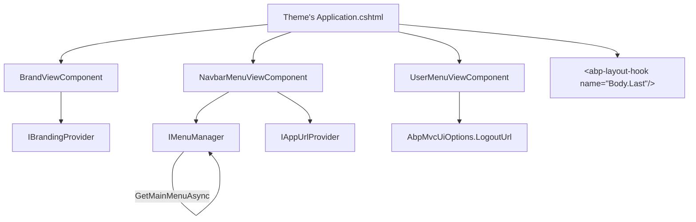
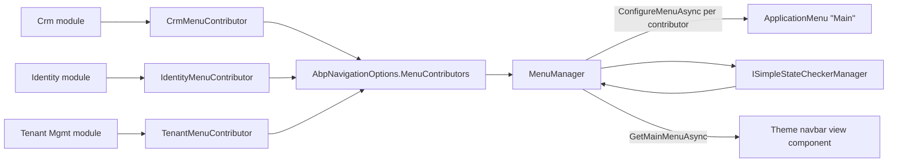

ABP Framework treats *navigation* and *menus* as a single composable model that every UI client — MVC, Blazor, Angular — can consume. The implementation lives in two packages:

- `Volo.Abp.UI` — UI-agnostic primitives such as `IBrandingProvider` and the named layout-hook slots (`LayoutHooks`).
- `Volo.Abp.UI.Navigation` — the menu and application-URL model: `IMenuManager`, `IMenuContributor`, `ApplicationMenu`, `ApplicationMenuItem`, `ApplicationMenuGroup`, `AbpNavigationOptions`, plus the cross-application URL provider `IAppUrlProvider` / `AppUrlProvider`.

This page walks both packages from the perspective of building a navigation pipeline for an ABP MVC application.

## Volo.Abp.UI

`AbpUiModule` (`framework/src/Volo.Abp.UI/Volo/Abp/Ui/AbpUiModule.cs`) is intentionally minimal:

```csharp
[DependsOn(typeof(AbpExceptionHandlingModule))]
public class AbpUiModule : AbpModule
{
    public override void ConfigureServices(ServiceConfigurationContext context)
    {
        Configure<AbpVirtualFileSystemOptions>(options =>
            options.FileSets.AddEmbedded<AbpUiModule>());

        Configure<AbpLocalizationOptions>(options =>
        {
            options.Resources
                .Add<AbpUiResource>("en")
                .AddBaseTypes(typeof(AbpExceptionHandlingResource))
                .AddVirtualJson("/Localization/Resources/AbpUi");
        });
    }
}
```

It registers the `AbpUiResource` localization resource and the embedded localization JSON. On top of that the package supplies:

### Branding

`IBrandingProvider` (`Volo/Abp/Ui/Branding/IBrandingProvider.cs`) describes an application's logo and name:

```csharp
public interface IBrandingProvider
{
    string AppName { get; }
    string? LogoUrl { get; }        // logo on white/light background
    string? LogoReverseUrl { get; } // logo on dark background
}
```

`DefaultBrandingProvider : IBrandingProvider, ITransientDependency` returns `"MyApplication"` and `null` for both logos. An application normally subclasses it and re-registers as a singleton.

### Layout hooks

The `LayoutHooks` static class (`Volo/Abp/Ui/LayoutHooks/LayoutHooks.cs`) is just a name-collection that every theme honours:

```csharp
public static class LayoutHooks
{
    public static class Head        { public const string First = "Header.First";       public const string Last = "Header.Last"; }
    public static class Body        { public const string First = "Body.First";         public const string Last = "Body.Last"; }
    public static class PageContent { public const string First = "PageContent.First";  public const string Last = "PageContent.Last"; }
}
```

`AbpLayoutHookOptions.Add(name, componentType, layout?)` (`AbpLayoutHookOptions.cs`) wires a `ViewComponent` into one of those slots. The Theme Shared package's `_Layout.cshtml` renders all the slots; the MVC UI Core package documents the `LayoutHookViewComponent` that does the actual invocation.

## Volo.Abp.UI.Navigation

`AbpUiNavigationModule` (`framework/src/Volo.Abp.UI.Navigation/Volo/Abp/Ui/Navigation/AbpUiNavigationModule.cs`) depends on `AbpUiModule`, `AbpAuthorizationModule`, `AbpFeaturesModule` and `AbpMultiTenancyModule` — the four cross-cutting modules a menu pipeline needs to gate items by permission, feature and tenant context:

```csharp
[DependsOn(typeof(AbpUiModule), typeof(AbpAuthorizationModule),
           typeof(AbpFeaturesModule), typeof(AbpMultiTenancyModule))]
public class AbpUiNavigationModule : AbpModule
{
    public override void ConfigureServices(ServiceConfigurationContext context)
    {
        Configure<AbpVirtualFileSystemOptions>(options =>
            options.FileSets.AddEmbedded<AbpUiNavigationModule>());

        Configure<AbpLocalizationOptions>(options =>
        {
            options.Resources
                .Add<AbpUiNavigationResource>("en")
                .AddVirtualJson("/Volo/Abp/Ui/Navigation/Localization/Resource");
        });

        Configure<AbpNavigationOptions>(options =>
        {
            options.MenuContributors.Add(new DefaultMenuContributor());
        });
    }
}
```

It registers the navigation localization resource and seeds `AbpNavigationOptions.MenuContributors` with the `DefaultMenuContributor` (which adds the *Administration* group to the Main menu — covered below).

## AbpNavigationOptions

```csharp
public class AbpNavigationOptions
{
    public List<IMenuContributor> MenuContributors { get; }
    public List<string> MainMenuNames { get; }

    public AbpNavigationOptions()
    {
        MenuContributors = new List<IMenuContributor>();
        MainMenuNames = new List<string> { StandardMenus.Main };
    }
}
```

Two collections. `MenuContributors` is the list of `IMenuContributor` instances invoked sequentially during `IMenuManager.GetAsync`. `MainMenuNames` lists the menu names that should be merged when callers ask for the "main" menu — by default just `StandardMenus.Main = "Main"`, but a hosting app can append more names (e.g. `"Marketing"`) so multiple submenus combine into one navbar.

`StandardMenus` (`StandardMenus.cs`):

```csharp
public static class StandardMenus
{
    public const string Main     = "Main";
    public const string User     = "User";
    public const string Shortcut = "Shortcut";
}
```

`DefaultMenuNames` (`DefaultMenuNames.cs`) houses well-known menu *item* names used across modules:

```csharp
public static class DefaultMenuNames
{
    public static class Application
    {
        public static class Main
        {
            public const string Administration = "Abp.Application.Main.Administration";
        }
    }
}
```

## The menu data model

### IHasMenuItems / IHasMenuGroups

```csharp
public interface IHasMenuItems  { ApplicationMenuItemList  Items  { get; } }
public interface IHasMenuGroups { ApplicationMenuGroupList Groups { get; } }
```

Both `ApplicationMenu` and `ApplicationMenuItem` implement `IHasMenuItems` — that is what makes the tree recursive. Only `ApplicationMenu` carries groups.

### ApplicationMenu

`ApplicationMenu` (`ApplicationMenu.cs`) is the root of a menu tree:

```csharp
public class ApplicationMenu : IHasMenuItems, IHasMenuGroups
{
    public string Name { get; }
    public string DisplayName { get; set; }
    public ApplicationMenuItemList  Items  { get; }
    public ApplicationMenuGroupList Groups { get; }
    public Dictionary<string, object> CustomData { get; } = new();

    public ApplicationMenu AddItem(ApplicationMenuItem menuItem)        { Items.Add(menuItem);  return this; }
    public ApplicationMenu AddGroup(ApplicationMenuGroup group)         { Groups.Add(group);    return this; }
    public ApplicationMenu WithCustomData(string key, object value)     { CustomData[key]=value;return this; }
}
```

`CustomData` is the standard escape hatch — every theme/module can attach arbitrary data without subclassing.

### ApplicationMenuItem

`ApplicationMenuItem` (`ApplicationMenuItem.cs`) is the workhorse:

```csharp
public class ApplicationMenuItem : IHasMenuItems, IHasSimpleStateCheckers<ApplicationMenuItem>
{
    public const int DefaultOrder = 1000;

    public string  Name { get; }
    public string  DisplayName { get; set; }
    public int     Order { get; set; }
    public string? Url { get; set; }
    public string? Icon { get; set; }
    public bool    IsLeaf => Items.IsNullOrEmpty();
    public string? Target { get; set; }
    public bool    IsDisabled { get; set; }
    public ApplicationMenuItemList Items { get; }

    [Obsolete("Use RequirePermissions extension method.")]
    public string? RequiredPermissionName { get; set; }

    public List<ISimpleStateChecker<ApplicationMenuItem>> StateCheckers { get; }
    public Dictionary<string, object> CustomData { get; } = new();
    public string? ElementId { get; set; }
    public string? CssClass { get; set; }
    public string? GroupName { get; set; }
}
```

Important details:

- `DefaultOrder = 1000` is the default render order. Lower → earlier.
- `IsLeaf` returns true when there are no nested items (purely a derived property).
- `Target` matches the HTML `<a target="…">` attribute; `_blank` for a new tab.
- `IsDisabled` lets a contributor "ghost" an item without removing it.
- `RequiredPermissionName` is the obsolete shortcut; the modern way is the `IHasSimpleStateCheckers<ApplicationMenuItem>` interface plus `RequirePermissions(policyName)` extension method (defined in `Volo.Abp.Authorization.Permissions`).
- `ElementId` is normalised by `NormalizeElementId(value)` (which replaces `.` with `_`) so a menu item with name `Foo.Bar` gets a DOM-safe id.

### ApplicationMenuGroup

```csharp
public class ApplicationMenuGroup
{
    public const int DefaultOrder = 1000;
    public string  Name { get; }
    public string  DisplayName { get; set; }
    public string? ElementId { get; set; }
    public int     Order { get; set; }
    public string? Icon { get; set; }
    public Dictionary<string, object> CustomData { get; } = new();
}
```

Groups are render-only buckets used by themes to insert headers between items. A menu item references a group through its `GroupName` property; `MenuManager.NormalizeMenuGroup` nulls the `GroupName` on items whose group is not actually defined, so an item belonging to a removed group does not disappear.

### Custom components on menu items

`ApplicationMenuExtensions.UseComponent(this ApplicationMenuItem, Type)` (in `ApplicationMenuExtensions.cs`) stores a component type under the `CustomDataComponentKey = "ApplicationMenu.CustomComponent"` slot:

```csharp
public static ApplicationMenuItem UseComponent<TComponent>(this ApplicationMenuItem item)
    => item.UseComponent(typeof(TComponent));

public static ApplicationMenuItem UseComponent(this ApplicationMenuItem item, Type componentType)
    => item.WithCustomData(CustomDataComponentKey, componentType);
```

A theme then calls `item.GetComponentTypeOrDefault()` and, if present, renders that view component in place of the standard menu link — used by `<abp-language-switch>` and `<abp-user-menu>` style items.

## Building a menu: IMenuContributor

```csharp
public interface IMenuContributor
{
    Task ConfigureMenuAsync(MenuConfigurationContext context);
}
```

A contributor is given a `MenuConfigurationContext` (`MenuConfigurationContext.cs`) that exposes the menu under construction plus helpers:

```csharp
public class MenuConfigurationContext : IMenuConfigurationContext
{
    public IServiceProvider ServiceProvider { get; }
    public IAuthorizationService AuthorizationService { get; }
    public IStringLocalizerFactory StringLocalizerFactory { get; }
    public ApplicationMenu Menu { get; }

    public Task<bool> IsGrantedAsync(string policyName);
    public IStringLocalizer? GetDefaultLocalizer();
    public IStringLocalizer GetLocalizer<T>();
    public IStringLocalizer GetLocalizer(Type resourceType);
}
```

The framework's own `DefaultMenuContributor` (`DefaultMenuContributor.cs`) demonstrates the canonical pattern — it pulls the localizer once, checks `context.Menu.Name == StandardMenus.Main` and adds the *Administration* item:

```csharp
protected virtual void Configure(MenuConfigurationContext context)
{
    var l = context.GetLocalizer<AbpUiNavigationResource>();

    if (context.Menu.Name == StandardMenus.Main)
    {
        context.Menu.AddItem(new ApplicationMenuItem(
            DefaultMenuNames.Application.Main.Administration,
            l["Menu:Administration"],
            icon: "fa fa-wrench"));
    }
}
```

A typical module-supplied contributor adds its own root item and child items:

```csharp
public class CrmMenuContributor : IMenuContributor
{
    public async Task ConfigureMenuAsync(MenuConfigurationContext context)
    {
        if (context.Menu.Name != StandardMenus.Main) return;

        var l = context.GetLocalizer<CrmResource>();

        var crm = new ApplicationMenuItem("Crm", l["Menu:Crm"], icon: "fa fa-handshake", order: 2000);
        if (await context.IsGrantedAsync(CrmPermissions.Customers.Default))
            crm.AddItem(new ApplicationMenuItem("Crm.Customers", l["Menu:Customers"], "/crm/customers"));
        if (await context.IsGrantedAsync(CrmPermissions.Leads.Default))
            crm.AddItem(new ApplicationMenuItem("Crm.Leads", l["Menu:Leads"], "/crm/leads"));

        context.Menu.AddItem(crm);
    }
}

// In the module's ConfigureServices:
Configure<AbpNavigationOptions>(options => options.MenuContributors.Add(new CrmMenuContributor()));
```

## IMenuManager — the runtime

```csharp
public interface IMenuManager
{
    Task<ApplicationMenu> GetAsync(string name);
    Task<ApplicationMenu> GetMainMenuAsync();
}
```

`MenuManager : IMenuManager, ITransientDependency` (`MenuManager.cs`) does five things:

1. Create a new `ApplicationMenu(name)`.
2. Create a DI scope and, *inside ambient `RequirePermissionsSimpleBatchStateChecker<ApplicationMenuItem>.Use(…)` and `RequireFeaturesSimpleBatchStateChecker<ApplicationMenuItem>.Use(…)` scopes*, build a `MenuConfigurationContext` and call every `IMenuContributor.ConfigureMenuAsync(context)`.
3. Run `CheckPermissionsAsync` — gather all menu items with state checkers, run them in a single batch through `ISimpleStateCheckerManager<ApplicationMenuItem>.IsEnabledAsync`, and remove the disabled items from the tree.
4. Apply `IMenuItemUrlProvider`s (`IMenuItemUrlProvider.cs`) — they walk the tree once and rewrite `Url` values (used by the culture-prefix helper below).
5. Normalize: `NormalizeMenu` removes empty leaf items and orders by `ApplicationMenuItem.Order` ascending; `NormalizeMenuGroup` re-anchors orphaned `GroupName`s.

`GetMainMenuAsync` simply iterates `AbpNavigationOptions.MainMenuNames`, builds each menu, and merges their items into the first one (`MergeMenus`).

```mermaid
sequenceDiagram
    participant Razor as Navbar ViewComponent
    participant Mgr as MenuManager
    participant Opts as AbpNavigationOptions
    participant Contrib as IMenuContributor list
    participant Auth as ISimpleStateCheckerManager&lt;ApplicationMenuItem&gt;
    participant Url as IMenuItemUrlProvider

    Razor->>Mgr: GetMainMenuAsync()
    Mgr->>Opts: MainMenuNames
    loop For each name in MainMenuNames
        Mgr->>Mgr: new ApplicationMenu(name)
        Mgr->>Contrib: ConfigureMenuAsync(context)
        Contrib-->>Mgr: items added
        Mgr->>Auth: IsEnabledAsync(items with StateCheckers)
        Auth-->>Mgr: enabled map
        Mgr->>Mgr: remove disabled items
        Mgr->>Url: HandleAsync(urlContext)
        Url-->>Mgr: items rewritten
        Mgr->>Mgr: Normalize, NormalizeGroup
    end
    Mgr-->>Razor: merged ApplicationMenu
```

## Menu item URL providers and culture prefixes

`IMenuItemUrlProvider` (`IMenuItemUrlProvider.cs`) is a plug-in that gets called *after* all contributors:

```csharp
public interface IMenuItemUrlProvider
{
    Task HandleAsync(MenuItemUrlProviderContext context);
}

public class MenuItemUrlProviderContext { public ApplicationMenu Menu { get; } /* + walkers */ }
```

The framework's `IMenuItemUrlProviderContext` is used by `MenuItemCulturePrefixHelper` / `IMenuItemCulturePrefixHelper` (`MenuItemCulturePrefixHelper.cs`) to insert the current culture into URLs of items that need localized routes. A multi-tenant CMS might add another provider to rewrite all URLs under a tenant subdomain.

## Querying and mutating an existing menu

`ApplicationMenuExtensions` (`ApplicationMenuExtensions.cs`) is the consumer-friendly surface for downstream contributors that need to *patch* a menu produced by an earlier contributor:

```csharp
public static ApplicationMenuItem  GetAdministration(this ApplicationMenu menu);
public static ApplicationMenuItem  GetMenuItem(this IHasMenuItems container, string name);
public static ApplicationMenuItem? GetMenuItemOrNull(this IHasMenuItems container, string name);
public static bool                 TryRemoveMenuItem(this IHasMenuItems container, string name);
public static IHasMenuItems        SetSubItemOrder(this IHasMenuItems container, string name, int order);
public static ApplicationMenuGroup GetMenuGroup(this IHasMenuGroups container, string name);
public static ApplicationMenuGroup? GetMenuGroupOrNull(this IHasMenuGroups container, string name);
public static bool                  TryRemoveMenuGroup(this IHasMenuGroups container, string name);
public static IHasMenuGroups        SetMenuGroupOrder(this IHasMenuGroups container, string name, int order);
```

`HasMenuItemsExtensions.FindMenuItem` (`HasMenuItemsExtensions.cs`) does a recursive depth-first search across the whole tree, which is what theme renderers use to highlight `PageLayout.Content.MenuItemName`.

The Identity, OpenIddict, Tenant Management modules all use these to attach their items under the *Administration* root:

```csharp
public async Task ConfigureMenuAsync(MenuConfigurationContext context)
{
    if (context.Menu.Name != StandardMenus.Main) return;
    var admin = context.Menu.GetAdministration();
    admin.AddItem(new ApplicationMenuItem("IdentityManagement.Users",
        l["Menu:Users"], "/IdentityManagement/Users"));
}
```

## Application URLs and cross-tier links

Once an application is split across multiple hosts (an API host, a public web host, an account host), menu items need to point at fully qualified URLs that are aware of the active tenant. That is what `Volo.Abp.UI.Navigation.Urls` is for.

### AppUrlOptions

```csharp
public class AppUrlOptions
{
    public ApplicationUrlDictionary Applications { get; } = new();
    public List<string> RedirectAllowedUrls { get; } = new();
}

public class ApplicationUrlInfo
{
    public string? RootUrl { get; set; }
    public IDictionary<string, string> Urls { get; } = new Dictionary<string, string>();
}
```

`ApplicationUrlDictionary` keys by application name (e.g. `"MVC"`, `"PublicWeb"`, `"Account"`). `RootUrl` is the application's base URL, optionally augmented by a per-feature `Urls` dictionary (`PasswordReset`, `EmailConfirmation`, …). `RedirectAllowedUrls` is the whitelist `AbpPageModel.NormalizeReturnUrlAsync` consults to reject open redirects.

### IAppUrlProvider / AppUrlProvider

```csharp
public interface IAppUrlProvider
{
    Task<string>  GetUrlAsync(string appName, string? urlName = null);
    Task<string?> GetUrlOrNullAsync(string appName, string? urlName = null);
    Task<bool>    IsRedirectAllowedUrlAsync(string url);
    Task<string?> NormalizeUrlAsync(string? url);
}
```

`AppUrlProvider` (`AppUrlProvider.cs`) resolves `GetUrlAsync` by looking up `AppUrlOptions.Applications[appName]`, concatenating `RootUrl` with a named URL when supplied, and finally routing through `IMultiTenantUrlProvider.GetUrlAsync` to inject the tenant placeholder (e.g. `{0}.acme.com`) into the final URL. `IsRedirectAllowedUrlAsync` normalises the whitelist entries via `MultiTenantUrlProvider` and then accepts the URL if it starts with any of them or is a sub-domain of one of them (`UrlHelpers.IsSubdomainOf`).

## Branding + navigation in a layout

A typical concrete theme layout brings together everything covered:



The MVC UI Core page covers `AbpMvcUiOptions.LoginUrl/LogoutUrl` and the layout hooks; this page is what feeds the navbar and the sidebar.

## A complete walkthrough

<Steps>
  <Step title="Depend on AbpUiNavigationModule">
    Either directly or transitively via `AbpAspNetCoreMvcUiModule`. That brings in `MenuManager`, `AbpNavigationOptions`, the `DefaultMenuContributor` and the navigation localization resource.
  </Step>
  <Step title="Register a menu contributor">
    `Configure<AbpNavigationOptions>(o => o.MenuContributors.Add(new MyContributor()))`. Inside `ConfigureMenuAsync`, gate items with `await context.IsGrantedAsync(policyName)` and pair them with `item.RequirePermissions(policyName)` if the item is to be rechecked at render time.
  </Step>
  <Step title="Mount cross-app URLs">
    Configure `AppUrlOptions.Applications` for every host in the deployment topology and add the safe-redirect URLs to `RedirectAllowedUrls`. The Account module and `AbpPageModel.NormalizeReturnUrlAsync` will consume them.
  </Step>
  <Step title="Implement IBrandingProvider">
    Return your application's name and two logo URLs (light + dark). Register as a singleton replacing `DefaultBrandingProvider`.
  </Step>
  <Step title="Render in the layout">
    Call `await IMenuManager.GetMainMenuAsync()` from your navbar view component, walk `Items` recursively, render each `ApplicationMenuItem` as a Bootstrap nav link, and use `PageLayout.Content.MenuItemName` to highlight the active branch via `IHasMenuItems.FindMenuItem`.
  </Step>
</Steps>

## How the modules collaborate



The same model is consumed by Blazor (which re-implements its own renderer of `ApplicationMenu`), by Angular (which serializes `ApplicationMenu` to JSON and ships it down to the SPA), and by the MAUI client. Authoring a single `IMenuContributor` in a feature module gives you menu entries in every supported front-end without further work.

## Where to read next

- The Theme Shared page covers the page toolbar and toolbar systems that complement the main menu.
- The Widgets page shows the orthogonal mechanism for embedding view-component dashboards.
- The MVC UI Core page documents `IPageLayout.Content.MenuItemName` and how the active sidebar branch is highlighted by mapping the page's name to the `ApplicationMenuItem.Name` of the contributor that produced it.
