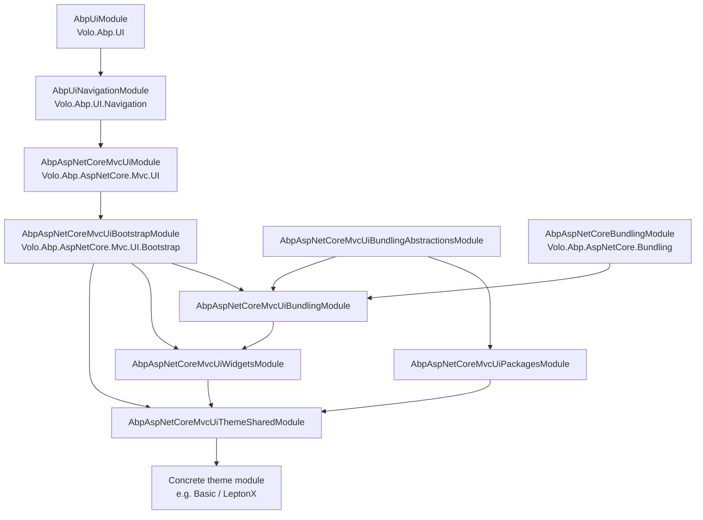
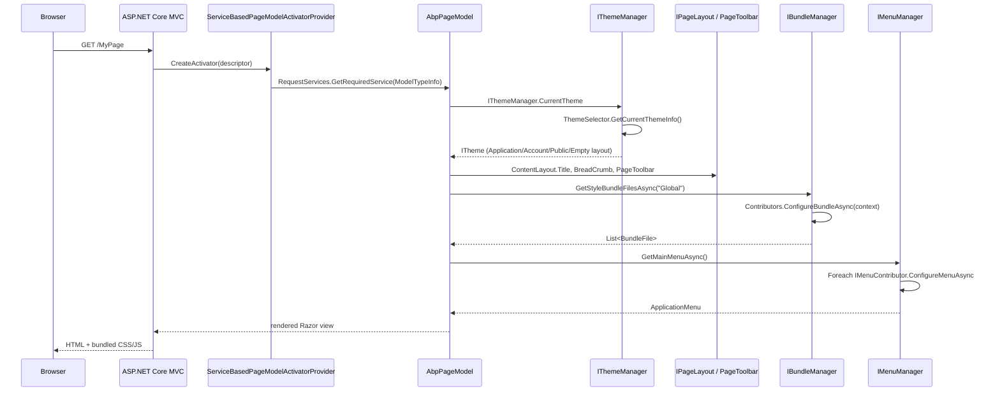
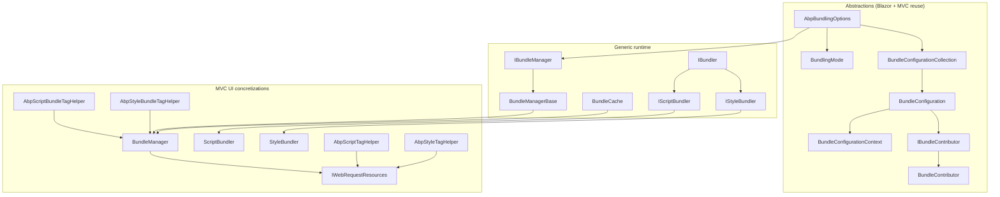

The ABP Framework MVC / Razor Pages UI is built as a stack of small, composable packages, each implemented as an `AbpModule` and chained together by `[DependsOn]` attributes. The root of that stack is `Volo.Abp.AspNetCore.Mvc.UI.AbpAspNetCoreMvcUiModule` (under `framework/src/Volo.Abp.AspNetCore.Mvc.UI/Volo/Abp/AspNetCore/Mvc/UI/AbpAspNetCoreMvcUiModule.cs`). It depends on `AbpAspNetCoreMvcModule` and `AbpUiNavigationModule`, registers its own embedded virtual files via `AbpVirtualFileSystemOptions.FileSets.AddEmbedded<AbpAspNetCoreMvcUiModule>()`, and adds the assembly as an `IMvcBuilder` application part. Every other UI module in this group transitively depends on it.

On top of that core there are five clearly separated layers, each in its own assembly: a Bootstrap layer (`AbpAspNetCoreMvcUiBootstrapModule`), a Theme.Shared layer (`AbpAspNetCoreMvcUiThemeSharedModule`), the bundling pipeline (`AbpAspNetCoreMvcUiBundlingAbstractionsModule` → `AbpAspNetCoreMvcUiBundlingModule` → `AbpAspNetCoreBundlingModule`), a widgets package (`AbpAspNetCoreMvcUiWidgetsModule`) and a navigation/menu layer (`AbpUiNavigationModule` plus `AbpUiModule`). Concrete themes such as the Basic theme in `modules/basic-theme/` add nothing but additional Razor pages, view components and a contributor that registers themselves via `AbpThemingOptions.Themes` (`framework/src/Volo.Abp.AspNetCore.Mvc.UI/Volo/Abp/AspNetCore/Mvc/UI/Theming/AbpThemingOptions.cs`).

## What lives in each package

The names below match the folders under `framework/src/`. Reading them top-to-bottom mirrors the dependency chain: every later package depends on the earlier ones, never the other way round.

<CardGroup cols={2}>
  <Card title="Volo.Abp.AspNetCore.Mvc.UI" icon="cube" href="/mvc-ui/volo-abp-aspnetcore-mvc-ui">
    Root MVC UI module — `AbpPageModel`, `IPageLayout`, `IThemeManager`, `AbpThemingOptions`, `IAbpTagHelperLocalizer` and the bridge from ASP.NET Core's Razor Pages infrastructure into the ABP DI container.
  </Card>
  <Card title="Volo.Abp.AspNetCore.Mvc.UI.Bootstrap" icon="bootstrap" href="/mvc-ui/bootstrap-theming">
    Eighty-plus Bootstrap 5 TagHelpers (`AbpAlertTagHelper`, `AbpButtonTagHelper`, `AbpCardTagHelper`, `AbpModalTagHelper`, `AbpInputTagHelper`, `AbpRowTagHelper`, `AbpColumnTagHelper`, `AbpTabsTagHelper`, …) plus the abstract base `AbpTagHelper<TTagHelper, TService>` they all derive from.
  </Card>
  <Card title="Volo.Abp.AspNetCore.Mvc.UI.Theme.Shared" icon="palette" href="/mvc-ui/theme-shared">
    Cross-theme primitives: layout hooks, page toolbars, brand/footer/sidebar/breadcrumb components, the `Global` style & script bundles, the JSON navigation provider and the error views consumed by every concrete theme.
  </Card>
  <Card title="Bundling pipeline" icon="boxes-packing" href="/mvc-ui/bundling">
    `AbpBundlingOptions`, `BundleConfiguration`, `IBundleContributor`, `BundleManager` plus `abp-script` / `abp-style` / `abp-script-bundle` / `abp-style-bundle` TagHelpers — the system that compiles asset definitions into served CSS/JS.
  </Card>
  <Card title="Widgets" icon="grid-2" href="/mvc-ui/widgets">
    `WidgetAttribute`, `WidgetDefinition`, `AbpWidgetOptions`, `IWidgetManager` and the auto-discovery hook in `AbpAspNetCoreMvcUiWidgetsModule.AutoAddWidgets` — view components elevated to first-class widgets with their own scripts, styles and authorization.
  </Card>
  <Card title="Navigation & menus" icon="bars" href="/mvc-ui/navigation-and-menus">
    `IMenuManager`, `MenuManager`, `IMenuContributor`, `ApplicationMenu`, `ApplicationMenuItem`, `ApplicationMenuGroup`, `AbpNavigationOptions`, plus `IBrandingProvider` and `LayoutHooks` from `Volo.Abp.UI`.
  </Card>
</CardGroup>

## Module dependency graph

The graph below mirrors the actual `[DependsOn]` chains found in the module classes (`AbpAspNetCoreMvcUiModule.cs`, `AbpAspNetCoreMvcUiBootstrapModule.cs`, `AbpAspNetCoreMvcUiThemeSharedModule.cs`, `AbpAspNetCoreMvcUiWidgetsModule.cs`, `AbpAspNetCoreMvcUiBundlingModule.cs`, `AbpUiNavigationModule.cs`). A concrete theme module like `AbpAspNetCoreMvcUiBasicThemeModule` from `modules/basic-theme/` sits one level above Theme.Shared and adds a Razor Pages layout plus an `ITheme` implementation.

## End-to-end request pipeline

A Razor Pages request flowing through an ABP MVC UI application touches every one of these layers in sequence. The pipeline below is composed from `ServiceBasedPageModelActivatorProvider.CreateActivator` (`framework/src/Volo.Abp.AspNetCore.Mvc.UI/Volo/Abp/AspNetCore/Mvc/UI/RazorPages/ServiceBasedPageModelActivatorProvider.cs`), `DefaultThemeManager.GetCurrentTheme` (`framework/src/Volo.Abp.AspNetCore.Mvc.UI/Volo/Abp/AspNetCore/Mvc/UI/Theming/DefaultThemeManager.cs`), `BundleManager.GetBundleFilesAsync` (`framework/src/Volo.Abp.AspNetCore.Mvc.UI.Bundling/Volo/Abp/AspNetCore/Mvc/UI/Bundling/BundleManager.cs`) and `PageToolbarManager.GetItemsAsync` (`framework/src/Volo.Abp.AspNetCore.Mvc.UI.Theme.Shared/PageToolbars/PageToolbarManager.cs`).

## How theming and bundling fit together

A theme in ABP is just a class that implements `ITheme` (`framework/src/Volo.Abp.AspNetCore.Mvc.UI/Volo/Abp/AspNetCore/Mvc/UI/Theming/ITheme.cs`) and is registered in `AbpThemingOptions.Themes`. Its only required method, `GetLayout(string name, bool fallbackToDefault)`, maps the four `StandardLayouts` constants — `Application`, `Account`, `Public`, `Empty` (`StandardLayouts.cs`) — to physical Razor layout paths.

The current theme is resolved per request by `DefaultThemeManager` which caches the resolved `ITheme` in `HttpContext.Items["__AbpCurrentTheme"]` so all subsequent calls during the same request share one instance (`DefaultThemeManager.GetCurrentTheme`). `DefaultThemeSelector` picks the theme either from `AbpThemingOptions.DefaultThemeName` or from the first registered theme (`framework/src/Volo.Abp.AspNetCore.Mvc.UI/Volo/Abp/AspNetCore/Mvc/UI/Theming/DefaultThemeSelector.cs`).

```mermaid
graph LR
    subgraph "AbpThemingOptions"
      Themes[Themes : ThemeDictionary]
      Default[DefaultThemeName]
    end
    Selector[DefaultThemeSelector] --> Themes
    Manager[DefaultThemeManager] --> Selector
    Razor["_Layout.cshtml (Razor)"] --> Manager
    Razor -->|GetLayout&#40;Application&#41;| ITheme
    Razor -->|abp-style-bundle name=&quot;Global&quot;| BundleMgr[BundleManager]
    BundleMgr --> BundleOpts[AbpBundlingOptions.StyleBundles]
    BundleOpts -->|Global| Contribs[SharedThemeGlobalStyleContributor + extra bundles]
    Contribs --> Files["/libs/abp/...js, css"]
```

Each theme's layout typically renders the shared `<abp-script-bundle>` and `<abp-style-bundle>` TagHelpers for the `Global` bundle whose default contributors are wired by `AbpAspNetCoreMvcUiThemeSharedModule.ConfigureServices` — adding `SharedThemeGlobalStyleContributor` and `SharedThemeGlobalScriptContributor` to `StandardBundles.Styles.Global` / `StandardBundles.Scripts.Global` (`framework/src/Volo.Abp.AspNetCore.Mvc.UI.Theme.Shared/AbpAspNetCoreMvcUiThemeSharedModule.cs`).

## Cross-cutting features by package

| Feature | Source file / symbol | Where it lives |
| --- | --- | --- |
| Razor page base | `AbpPageModel` | `Volo.Abp.AspNetCore.Mvc.UI/Volo/Abp/AspNetCore/Mvc/UI/RazorPages/AbpPageModel.cs` |
| Layout / breadcrumbs | `IPageLayout`, `PageLayout`, `BreadCrumb`, `ContentLayout` | `Volo.Abp.AspNetCore.Mvc.UI/Volo/Abp/AspNetCore/Mvc/UI/Layout/*.cs` |
| Theming options | `AbpThemingOptions`, `IThemeManager`, `ITheme` | `Volo.Abp.AspNetCore.Mvc.UI/Volo/Abp/AspNetCore/Mvc/UI/Theming/*.cs` |
| Alerts | `IAlertManager`, `AlertList`, `AlertType` | `Volo.Abp.AspNetCore.Mvc.UI/Volo/Abp/AspNetCore/Mvc/UI/Alerts/*.cs` |
| TagHelper base | `AbpTagHelper`, `AbpTagHelper<TTagHelper, TService>` | `Volo.Abp.AspNetCore.Mvc.UI.Bootstrap/TagHelpers/AbpTagHelper.cs` |
| TagHelper localizer | `IAbpTagHelperLocalizer`, `AbpTagHelperLocalizer` | `Volo.Abp.AspNetCore.Mvc.UI.Bootstrap/TagHelpers/*.cs` |
| Page toolbars | `AbpPageToolbarOptions`, `IPageToolbarManager`, `PageToolbarManager` | `Volo.Abp.AspNetCore.Mvc.UI.Theme.Shared/PageToolbars/*.cs` |
| Generic toolbars | `AbpToolbarOptions`, `IToolbarManager`, `StandardToolbars.Main` | `Volo.Abp.AspNetCore.Mvc.UI.Theme.Shared/Toolbars/*.cs` |
| Bundle config | `AbpBundlingOptions`, `BundleConfiguration`, `BundleConfigurationCollection` | `Volo.Abp.AspNetCore.Mvc.UI.Bundling.Abstractions/Volo/Abp/AspNetCore/Mvc/UI/Bundling/*.cs` |
| Bundle execution | `BundleManager`, `BundleManagerBase`, `IBundleManager` | `Volo.Abp.AspNetCore.Mvc.UI.Bundling/...` + `Volo.Abp.AspNetCore.Bundling/...` |
| Bundle TagHelpers | `AbpScriptTagHelper`, `AbpStyleTagHelper`, `AbpScriptBundleTagHelper`, `AbpStyleBundleTagHelper` | `Volo.Abp.AspNetCore.Mvc.UI.Bundling/Volo/Abp/AspNetCore/Mvc/UI/Bundling/TagHelpers/*.cs` |
| Widgets | `WidgetAttribute`, `WidgetDefinition`, `IWidgetManager` | `Volo.Abp.AspNetCore.Mvc.UI.Widgets/Volo/Abp/AspNetCore/Mvc/UI/Widgets/*.cs` |
| Menus | `IMenuManager`, `MenuManager`, `ApplicationMenu`, `IMenuContributor` | `Volo.Abp.UI.Navigation/Volo/Abp/Ui/Navigation/*.cs` |
| Branding | `IBrandingProvider`, `DefaultBrandingProvider` | `Volo.Abp.UI/Volo/Abp/Ui/Branding/*.cs` |
| Layout hooks | `LayoutHooks`, `AbpLayoutHookOptions`, `LayoutHookInfo` | `Volo.Abp.UI/Volo/Abp/Ui/LayoutHooks/*.cs` |
| Third-party packages | `JQueryScriptContributor`, `BootstrapScriptContributor`, `Select2ScriptContributor`, … | `Volo.Abp.AspNetCore.Mvc.UI.Packages/Volo/Abp/AspNetCore/Mvc/UI/Packages/**` |

## Navigation map

<Steps>
  <Step title="Start with the root module">
    `Volo.Abp.AspNetCore.Mvc.UI` is the only mandatory dependency. Even a barebones Razor Pages app derived from `AbpPageModel` already gets DI-based page activation (`ServiceBasedPageModelActivatorProvider`), an `IThemeManager` and an `IPageLayout` per request. The page dedicated to that module dissects every public type.
  </Step>
  <Step title="Add Bootstrap TagHelpers">
    `Volo.Abp.AspNetCore.Mvc.UI.Bootstrap` brings the entire `Volo.Abp.AspNetCore.Mvc.UI.Bootstrap.TagHelpers` namespace. The Bootstrap theming page enumerates every single TagHelper found in `framework/src/Volo.Abp.AspNetCore.Mvc.UI.Bootstrap/TagHelpers/**`.
  </Step>
  <Step title="Pull in Theme.Shared">
    `Volo.Abp.AspNetCore.Mvc.UI.Theme.Shared` wires the global bundles, error views, layout hooks, page toolbars, JSON-driven navigation, and the brand component used by every concrete theme — including the Basic theme under `modules/basic-theme/` and LeptonX.
  </Step>
  <Step title="Compose assets via bundling">
    The Bundling page explains how `AbpBundlingOptions`, `IBundleContributor`, `BundleManager` and the `abp-script` / `abp-style` TagHelpers work together with `IWebRequestResources`, the dynamic file provider, and `BundlingMode` (`None` / `Bundle` / `BundleAndMinify` / `Auto`).
  </Step>
  <Step title="Promote view components to widgets">
    The Widgets page covers `WidgetAttribute`, `WidgetDefinition`, `IWidgetManager`, the `AutoAddWidgets` registration and the script/style resources every widget can attach.
  </Step>
  <Step title="Wire up menus and branding">
    The Navigation & Menus page goes through `IMenuManager`, `IMenuContributor`, `ApplicationMenu`, `ApplicationMenuItem`, `ApplicationMenuGroup`, `StandardMenus`, `DefaultMenuNames`, `AppUrlOptions`, plus `IBrandingProvider` and `LayoutHooks` from `Volo.Abp.UI`.
  </Step>
</Steps>

## Cross-references to neighboring subsystems

The MVC UI stack does not stand alone — it interlocks with several of the other framework subsystems documented in this wiki.

- **MVC / API layer** — `AbpAspNetCoreMvcUiModule` depends on `AbpAspNetCoreMvcModule`. The HTTP/API pages describe how Razor Pages, controllers, dynamic API endpoints and `AbpExceptionFilter` interoperate.
- **Multi-tenancy** — A dedicated tenant switcher view component lives in `Volo.Abp.AspNetCore.Mvc.UI.MultiTenancy`. Page `tenancy/mvc-ui-multi-tenancy` covers it; here we only refer to it.
- **Localization** — `IAbpTagHelperLocalizer` calls into `AbpMvcDataAnnotationsLocalizationOptions.AssemblyResources` to pick the right `IStringLocalizer`. The localization pages document the resource definition mechanism.
- **Bundling abstractions** — Blazor reuses the same `IBundleContributor`/`AbpBundlingOptions` model from `Volo.Abp.AspNetCore.Mvc.UI.Bundling.Abstractions`; the Blazor page links back here.
- **Themes** — The Basic theme (`modules/basic-theme/`) and LeptonX live in the dedicated *Themes & Virtual File Explorer* group. Each concrete theme registers itself by calling `AbpThemingOptions.Themes.Add(new ThemeInfo(typeof(MyTheme)))` inside its module's `ConfigureServices`.

<Tip>
Most concrete UI applications never have to instantiate any of these classes directly. They consume them through Razor TagHelpers, `[Inject] IPageLayout` properties, or by registering an `IMenuContributor` / `IBundleContributor`. The deep-dive pages that follow show what each extension point looks like in source.
</Tip>

## Bundling at a glance

The bundling subsystem is the connective tissue between the MVC UI core and every concrete theme. It is split across three packages whose runtime relationship is illustrated below. The abstractions package (`Volo.Abp.AspNetCore.Mvc.UI.Bundling.Abstractions`) defines pure data types — `AbpBundlingOptions`, `BundleConfiguration`, `BundleConfigurationCollection`, `BundleFile`, `IBundleContributor`, `BundleContributor`, `BundleConfigurationContext` and `BundlingMode` — with no ASP.NET Core dependency, so the same model is reusable from Blazor (`Volo.Abp.AspNetCore.Components.WebAssembly.Theming.Bundling`) and MAUI Blazor (`Volo.Abp.AspNetCore.Components.MauiBlazor.Bundling`) without dragging in MVC.

The bundle execution lives in `Volo.Abp.AspNetCore.Bundling` (`IBundleManager`, `BundleManagerBase`, `BundleCache`, `IBundler`, `IScriptBundler`, `IStyleBundler`) and is MVC-agnostic too. The MVC-aware concretizations — `BundleManager`, `ScriptBundler`, `StyleBundler`, `<abp-script>`, `<abp-style>`, `<abp-script-bundle>`, `<abp-style-bundle>`, plus `IWebRequestResources` for deduplication — sit in `Volo.Abp.AspNetCore.Mvc.UI.Bundling` together with `AbpAspNetCoreMvcUiBundlingModule`, which is the module that finally wires the global static assets and the `WebRootFileProvider` extension.

## Widgets at a glance

`Volo.Abp.AspNetCore.Mvc.UI.Widgets` adds metadata to ordinary `ViewComponent` types so a page can render *just the right* per-widget scripts and styles. The relevant types are: `WidgetAttribute` (declares scripts, styles, required policies, refresh URL, `AutoInitialize`), `WidgetDefinition` (the lifted runtime object), `AbpWidgetOptions`/`WidgetDefinitionCollection` (the registry), `IWidgetManager` (authorization checks), `IPageWidgetManager` (per-request collected widgets stored in `HttpContext.Items["__AbpCurrentWidgets"]`), `AbpViewComponentHelper` (replaces `IViewComponentHelper` to register widgets at render time), and the two emitter view components `WidgetScriptsViewComponent` / `WidgetStylesViewComponent` which render `<abp-script-bundle>` / `<abp-style-bundle>` over the collected resources.

This package depends on both `AbpAspNetCoreMvcUiBootstrapModule` (for the `<abp-script>` / `<abp-style>` tag helpers) and `AbpAspNetCoreMvcUiBundlingModule` (for the actual asset pipeline), which is why it always sits *after* Bootstrap and Bundling in the dependency graph. The widgets page goes through each type in detail.

## Navigation at a glance

The navigation pipeline lives in `Volo.Abp.UI.Navigation` and is shared between every UI client. The top-level types are:

- **`IMenuManager` / `MenuManager`** — orchestrates a build pass: create `ApplicationMenu`, walk every `IMenuContributor`, prune by permissions through `ISimpleStateCheckerManager<ApplicationMenuItem>`, apply `IMenuItemUrlProvider`s, then normalize.
- **`ApplicationMenu` / `ApplicationMenuItem` / `ApplicationMenuGroup`** — the tree types. Items implement `IHasMenuItems` so the tree is recursive and `IHasSimpleStateCheckers<ApplicationMenuItem>` so they can be pruned in a single batch state-check pass. Both items and groups carry `DefaultOrder = 1000` as their default sort key.
- **`AbpNavigationOptions`** — the options surface with two collections: `MenuContributors` (the `IMenuContributor` list) and `MainMenuNames` (which menus merge for `GetMainMenuAsync`, default `[StandardMenus.Main]`).
- **`StandardMenus`** — the well-known constants `Main`, `User`, `Shortcut`.
- **`DefaultMenuNames.Application.Main.Administration = "Abp.Application.Main.Administration"`** — the standard root for cross-cutting admin items.
- **`AppUrlOptions` / `IAppUrlProvider` / `AppUrlProvider`** — cross-application URL resolution and safe-redirect whitelist enforcement, multi-tenant aware via `IMultiTenantUrlProvider`.

The branding side — `IBrandingProvider` and `DefaultBrandingProvider` — lives one level down in `Volo.Abp.UI` and is consumed by the brand view component of every concrete theme.

## Reading order for new contributors

If you are reading these pages because you are about to write a new theme, a new TagHelper, or a new menu/contributor, the recommended path is:

1. **Overview** (this page) — to grasp the module graph and where each concern lives.
2. **MVC UI Core** — to understand `AbpPageModel`, `IPageLayout`, `IThemeManager` and `IAbpTagHelperLocalizer`, which every theme and TagHelper interacts with.
3. **Bootstrap Theme** — to see how `AbpTagHelper<TTagHelper, TService>` separates the property bag from the rendering logic and how the eighty-plus `<abp-…>` elements are organised by feature.
4. **Theme Shared** — to learn the `Global` bundles, the page toolbars, the toolbars, the layout hooks and the error pipeline that every concrete theme inherits.
5. **Bundling** — to follow how `AbpBundlingOptions`, `IBundleContributor`, `BundleManager` and the `<abp-script-bundle>` / `<abp-style-bundle>` TagHelpers produce the served CSS/JS for any given request.
6. **Widgets** — to package a view component as a self-contained tile with policies, scripts and auto-init wrapper.
7. **Navigation** — to make those features appear in the navbar / sidebar of every supported UI client.

Each page links back to this overview for orientation; together they form a complete and source-faithful reference of the ABP Framework MVC / Razor Pages UI subsystem.
