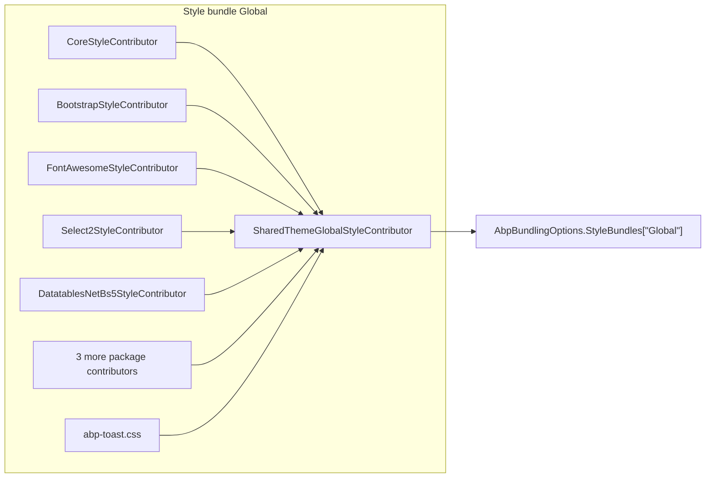
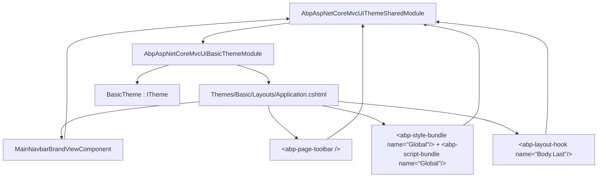

`Volo.Abp.AspNetCore.Mvc.UI.Theme.Shared` is the ABP Framework package that every concrete MVC theme — Basic, LeptonX, custom in-house themes — depends on. It provides the moving parts that have nothing to do with a particular visual identity: page toolbar plumbing, generic toolbar contributors, the `Global` style and script bundles, layout-hook integration, the `Error` controller, the page-search-box and application-path view components, plus the demo sample views shipped via the sister `Volo.Abp.AspNetCore.Mvc.UI.Theme.Shared.Demo` package. The whole code lives under `framework/src/Volo.Abp.AspNetCore.Mvc.UI.Theme.Shared/`.

## The module wiring

`AbpAspNetCoreMvcUiThemeSharedModule` (`framework/src/Volo.Abp.AspNetCore.Mvc.UI.Theme.Shared/AbpAspNetCoreMvcUiThemeSharedModule.cs`) is where most of the shared infrastructure is registered:

```csharp
[DependsOn(
    typeof(AbpAspNetCoreMvcUiBootstrapModule),
    typeof(AbpAspNetCoreMvcUiPackagesModule),
    typeof(AbpAspNetCoreMvcUiWidgetsModule),
    typeof(AbpFeaturesModule)
)]
public class AbpAspNetCoreMvcUiThemeSharedModule : AbpModule
{
    public override void PreConfigureServices(ServiceConfigurationContext context)
    {
        PreConfigure<IMvcBuilder>(mvcBuilder =>
        {
            mvcBuilder.AddApplicationPartIfNotExists(typeof(AbpAspNetCoreMvcUiThemeSharedModule).Assembly);
        });
    }

    public override void ConfigureServices(ServiceConfigurationContext context)
    {
        Configure<AbpVirtualFileSystemOptions>(options =>
        {
            options.FileSets.AddEmbedded<AbpAspNetCoreMvcUiThemeSharedModule>("Volo.Abp.AspNetCore.Mvc.UI.Theme.Shared");
        });

        Configure<AbpBundlingOptions>(options =>
        {
            options.StyleBundles
                .Add(StandardBundles.Styles.Global,
                    bundle => bundle.AddContributors(typeof(SharedThemeGlobalStyleContributor)));

            options.ScriptBundles
                .Add(StandardBundles.Scripts.Global,
                    bundle => bundle.AddContributors(typeof(SharedThemeGlobalScriptContributor)));
        });
    }
}
```

The two `[DependsOn]` neighbours we did not already cover are `AbpAspNetCoreMvcUiPackagesModule` (which we touch on under Bundling — it ships `JQueryScriptContributor`, `BootstrapScriptContributor`, `Select2ScriptContributor` and friends) and `AbpFeaturesModule` (so feature checks can drive `IPageToolbarContributor.ContributeAsync`).

The first thing this module does inside `ConfigureServices` is *guarantee* that two bundles exist: `StandardBundles.Styles.Global = "Global"` and `StandardBundles.Scripts.Global = "Global"` (file `Bundling/StandardBundles.cs`). The Razor layouts in every theme reference those bundles by name, so the whole shared-theme contract effectively boils down to: *whatever the theme draws, the `Global` bundles must already be there with the standard set of contributors*.

## The standard bundles

The two contributors registered above live in `Bundling/SharedThemeGlobalStyleContributor.cs` and `Bundling/SharedThemeGlobalScriptContributor.cs`. They are pure `[DependsOn]` graphs over the package contributors, plus a list of files relative to `/libs/abp/aspnetcore-mvc-ui-theme-shared/`.

`SharedThemeGlobalStyleContributor` depends on `CoreStyleContributor`, `BootstrapStyleContributor`, `FontAwesomeStyleContributor`, `Select2StyleContributor`, `MalihuCustomScrollbarPluginStyleBundleContributor`, `DatatablesNetBs5StyleContributor`, `BootstrapDatepickerStyleContributor`, `BootstrapDaterangepickerStyleContributor` and adds three local files: `/libs/abp/aspnetcore-mvc-ui-theme-shared/datatables/datatables-styles.css`, `.../date-range-picker/date-range-picker-styles.css`, `.../toast/abp-toast.css`.

`SharedThemeGlobalScriptContributor` depends on `JQueryScriptContributor`, `BootstrapScriptContributor`, `LodashScriptContributor`, `JQueryValidationUnobtrusiveScriptContributor`, `Select2ScriptContributor`, `DatatablesNetBs5ScriptContributor`, `Sweetalert2ScriptContributor`, `MalihuCustomScrollbarPluginScriptBundleContributor`, `LuxonScriptContributor`, `TimeagoScriptContributor`, `BootstrapDatepickerScriptContributor`, `BootstrapDaterangepickerScriptContributor`. It then adds eleven local files including `ui-extensions.js`, `jquery-extensions.js`, `widget-manager.js`, `dom-event-handlers.js`, `modal-manager.js`, `datatables-extensions.js`, `abp-sweetalert2.js`, `abp-toast.js`, `date-range-picker-extensions.js` and `authentication-state-listener.js`.



A theme's `_Layout.cshtml` only has to write `<abp-style-bundle name="Global" />` and `<abp-script-bundle name="Global" />` and it gets the entire chain rendered for free.

## Page toolbars

The page toolbar is the right-aligned button strip that sits next to the page title in most ABP UIs (the *New tenant*, *Export*, *Refresh* buttons you see across modules). It is built around four files in `PageToolbars/`.

### AbpPageToolbarOptions and PageToolbar

```csharp
public class AbpPageToolbarOptions
{
    public PageToolbarDictionary Toolbars { get; }

    public void Configure<TPage>(Action<PageToolbar> configureAction)
        => Configure(typeof(TPage).FullName!, configureAction);

    public void Configure(string pageName, Action<PageToolbar> configureAction)
    {
        var toolbar = Toolbars.GetOrAdd(pageName, () => new PageToolbar(pageName));
        configureAction(toolbar);
    }
}
```

A `PageToolbar` carries the page name and a list of contributors:

```csharp
public class PageToolbar
{
    public string PageName { get; }
    public PageToolbarContributorList Contributors { get; set; }

    public PageToolbar(string pageName)
    {
        PageName = Check.NotNullOrEmpty(pageName, nameof(pageName));
        Contributors = new PageToolbarContributorList();
    }
}
```

The pattern is *one toolbar per Razor PageModel type name*. The dictionary key is normally the page model's `FullName` (e.g. `Volo.Abp.IdentityServer.Web.Pages.IdentityServer.Clients.IndexModel`), but anything can be used.

### Contributors

`IPageToolbarContributor` is the extension hook:

```csharp
public interface IPageToolbarContributor
{
    Task ContributeAsync(PageToolbarContributionContext context);
}
```

`PageToolbarContributionContext` carries the page name, the request `IServiceProvider`, and an `Items` list of `PageToolbarItem` records:

```csharp
public class PageToolbarItem
{
    public Type ComponentType { get; }
    public object? Arguments { get; set; }
    public int Order { get; set; }
}
```

`SimplePageToolbarContributor` (in `PageToolbars/SimplePageToolbarContributor.cs`) is the simplest implementation — it adds a single `ViewComponent` *conditionally*, after checking `RequiredPolicyName` against `IAuthorizationService`:

```csharp
public async Task ContributeAsync(PageToolbarContributionContext context)
{
    if (await ShouldAddComponentAsync(context))
        context.Items.Add(new PageToolbarItem(ComponentType, Argument, Order));
}

protected virtual async Task<bool> ShouldAddComponentAsync(PageToolbarContributionContext context)
{
    if (RequiredPolicyName != null)
    {
        var auth = context.ServiceProvider.GetRequiredService<IAuthorizationService>();
        if (!(await auth.IsGrantedAsync(RequiredPolicyName)).Succeeded) return false;
    }
    return true;
}
```

The fluent extension `PageToolbarExtensions.AddComponent<TComponent>(toolbar, argument, order, requiredPolicyName)` wraps that boilerplate:

```csharp
Configure<AbpPageToolbarOptions>(options =>
{
    options.Configure<TenantsModel>(toolbar =>
    {
        toolbar.AddComponent<CreateTenantButtonViewComponent>(
            order: 1,
            requiredPolicyName: TenantManagementPermissions.Tenants.Create);
    });
});
```

### PageToolbarManager

`PageToolbarManager : IPageToolbarManager` (`PageToolbars/PageToolbarManager.cs`) is the runtime:

```csharp
public virtual async Task<PageToolbarItem[]> GetItemsAsync(string pageName)
{
    var toolbar = Options.Toolbars.GetOrDefault(pageName);
    if (toolbar == null || !toolbar.Contributors.Any()) return Array.Empty<PageToolbarItem>();

    using var scope = ServiceScopeFactory.CreateScope();
    var context = new PageToolbarContributionContext(pageName, scope.ServiceProvider);
    foreach (var contributor in toolbar.Contributors)
        await contributor.ContributeAsync(context);

    return context.Items.OrderBy(i => i.Order).ToArray();
}
```

The `<abp-page-toolbar>` view component (under `Pages/Shared/Components/AbpPageToolbar/`) calls this method and then renders each item with `@await Component.InvokeAsync(item.ComponentType, item.Arguments)`. The companion `Pages/Shared/Components/AbpPageToolbar/Button/Default.cshtml` is the standard pre-styled button used by `SimplePageToolbarContributor`.

```mermaid
sequenceDiagram
    participant Razor as &lt;abp-page-toolbar&gt;
    participant Mgr as PageToolbarManager
    participant Opts as AbpPageToolbarOptions
    participant Contrib as SimplePageToolbarContributor
    participant Auth as IAuthorizationService

    Razor->>Mgr: GetItemsAsync(pageName)
    Mgr->>Opts: Toolbars.GetOrDefault(pageName)
    Opts-->>Mgr: PageToolbar
    Mgr->>Contrib: ContributeAsync(ctx)
    Contrib->>Auth: IsGrantedAsync(policyName)
    Auth-->>Contrib: yes
    Contrib->>Mgr: ctx.Items.Add(PageToolbarItem)
    Mgr-->>Razor: ordered items
    Razor->>Razor: ViewComponent.InvokeAsync per item
```

## Generic toolbars

A second toolbar mechanism — older and more global than the per-page one — sits under `Toolbars/`. It targets *named* toolbars rather than per-page; `StandardToolbars.Main = "Main"` (in `StandardToolbars.cs`) is the only built-in constant. Themes render a `Main` toolbar in the navbar, and any module can contribute to it.

```csharp
public class AbpToolbarOptions
{
    public List<IToolbarContributor> Contributors { get; } = new();
}

public interface IToolbarContributor
{
    Task ConfigureToolbarAsync(IToolbarConfigurationContext context);
}
```

`ToolbarConfigurationContext` exposes `ITheme Theme`, `Toolbar Toolbar`, `IServiceProvider ServiceProvider`, an `IAuthorizationService` and an `IStringLocalizerFactory` (file `Toolbars/ToolbarConfigurationContext.cs`). Contributors call `context.Toolbar.Items.Add(new ToolbarItem(typeof(MyButtonViewComponent), order: 100, requiredPermissionName: …))`.

`ToolbarManager.GetAsync(name)` (`Toolbars/ToolbarManager.cs`) goes through the contributor list and then prunes items by permission + simple-state checking, exactly like `MenuManager` does for navigation items:

```csharp
foreach (var contributor in Options.Contributors)
    await contributor.ConfigureToolbarAsync(context);

await CheckPermissionsAsync(scope.ServiceProvider, toolbar);
```

The pruning step uses `ISimpleStateCheckerManager<ToolbarItem>` and the `RequirePermissionsSimpleBatchStateChecker<ToolbarItem>` / `RequireFeaturesSimpleBatchStateChecker<ToolbarItem>` ambient scopes — the same primitives that `MenuManager` uses (see Navigation & Menus page).

## Layout hooks

`Volo.Abp.UI.LayoutHooks` defines a fixed set of named slots; the Theme.Shared module makes sure they are actually rendered. The names are in `LayoutHooks.cs` (under `framework/src/Volo.Abp.UI/Volo/Abp/Ui/LayoutHooks/LayoutHooks.cs`):

```csharp
public static class LayoutHooks
{
    public static class Head { public const string First = "Header.First"; public const string Last = "Header.Last"; }
    public static class Body { public const string First = "Body.First";   public const string Last = "Body.Last";   }
    public static class PageContent { public const string First = "PageContent.First"; public const string Last = "PageContent.Last"; }
}
```

A module wires a view component into a slot via:

```csharp
Configure<AbpLayoutHookOptions>(options =>
{
    options.Add(LayoutHooks.Head.Last, typeof(MyAnalyticsScriptViewComponent));
});
```

`AbpLayoutHookOptions.Add` (in `AbpLayoutHookOptions.cs`) stores the type in a `Dictionary<string, List<LayoutHookInfo>>` keyed by slot name with an optional `layout` filter. The Theme.Shared `_Layout.cshtml` renders these by calling `<abp-layout-hook name="Body.First" />`, which is implemented by `LayoutHookViewComponent` (covered on the MVC UI Core page).

## The Error page

Every theme inherits the same error pipeline shipped here. `AbpApplicationBuilderErrorPageExtensions` (`AbpApplicationBuilderErrorPageExtensions.cs`) is the one-line extension applications call from `OnApplicationInitialization`:

```csharp
public static IApplicationBuilder UseErrorPage(this IApplicationBuilder app)
{
    return app
        .UseStatusCodePagesWithRedirects("~/Error?httpStatusCode={0}")
        .UseExceptionHandler("/Error");
}
```

`ErrorController` (in `Controllers/ErrorController.cs`) handles both routes. It depends on:

- `IExceptionToErrorInfoConverter` — turns the raw `Exception` into an `ErrorInfo` DTO using `AbpExceptionHandlingOptions`.
- `IHttpExceptionStatusCodeFinder` — maps an exception type to an HTTP status code (used to override the value coming from `httpStatusCode={0}`).
- `IStringLocalizer<AbpUiResource>` — provides localized error titles / descriptions out of `Volo.Abp.UI`'s localization resource.
- `AbpErrorPageOptions` (`AbpErrorPageOptions.cs`) — a `Dictionary<string, string>` named `ErrorViewUrls` that lets a hosting application *redirect* the standard error view to a custom URL for a given key, e.g. wiring a marketing page for a `404` flow.
- `IExceptionNotifier` — fires the `IExceptionSubscriber` chain so the same error appears in audit logs / monitoring.

The rendered view is `Views/Error/Default.cshtml` with the strongly-typed `AbpErrorViewModel` model.

## The view components shipped here

Three view components ship in `Pages/Shared/Components/`. Each one is a directory containing a `Default.cshtml`:

- **`AbpApplicationPath`** — emits a Razor partial that writes the application's root path to the page so client-side scripts (the `abp.appPath` global) know where the API is hosted. Useful when an app is hosted behind a path-based reverse proxy.
- **`AbpPageSearchBox`** — a generic typed-ahead search box used by various module index pages. Comes with its own `_ViewImports.cshtml`.
- **`AbpPageToolbar`** + nested `Button/Default.cshtml` — the renderer covered above.

These are intentionally generic: they are styled with the Bootstrap TagHelpers (`<abp-button>`, `<abp-input>`) so they look right whatever theme inherits them. The Theme.Shared.Demo project provides a much longer catalogue of `View Components` under `Views/Components/Themes/Shared/Demos/…` — *AlertsDemo*, *BadgesDemo*, *BordersDemo*, *BreadcrumbsDemo*, *ButtonGroupsDemo*, *ButtonsDemo*, *CardsDemo*, *CarouselDemo*, *CollapseDemo*, *DropdownsDemo*, *DynamicFormsDemo*, *FormElementsDemo*, *GridsDemo*, *ListGroupsDemo*, *ModalsDemo*, *NavbarsDemo*, *NavsDemo*, *PaginatorDemo*, *PopoversDemo*, *ProgressBarsDemo*, *TablesDemo*, *TabsDemo*, *TooltipsDemo*. They render previews of each Bootstrap TagHelper for documentation / theme QA, and are wired into the `AbpAspNetCoreMvcUiThemeSharedDemoModule`.

## Branding

The branding contract lives one package down, in `Volo.Abp.UI`, but Theme.Shared is the first consumer. `IBrandingProvider` (in `framework/src/Volo.Abp.UI/Volo/Abp/Ui/Branding/IBrandingProvider.cs`) is intentionally minimal:

```csharp
public interface IBrandingProvider
{
    string AppName { get; }
    string? LogoUrl { get; }        // light background
    string? LogoReverseUrl { get; } // dark background
}
```

`DefaultBrandingProvider : IBrandingProvider, ITransientDependency` returns `"MyApplication"` and `null` for the two logos. A real application replaces it:

```csharp
public class MyBrandingProvider : DefaultBrandingProvider
{
    public override string AppName => "Acme HR";
    public override string? LogoUrl => "/logos/acme.svg";
    public override string? LogoReverseUrl => "/logos/acme-dark.svg";
}
// ConfigureServices
context.Services.AddSingleton<IBrandingProvider, MyBrandingProvider>();
```

The concrete theme's brand view component — for the Basic theme that's `MainNavbarBrandViewComponent` under `modules/basic-theme/src/Volo.Abp.AspNetCore.Mvc.UI.Theme.Basic/Themes/Basic/Components/Brand/MainNavbarBrandViewComponent.cs` — injects `IBrandingProvider` and renders the navbar brand link.

## How a concrete theme consumes Theme.Shared



The concrete theme module (Basic, LeptonX) takes care of *style and HTML structure*. Everything that is functionally shared — toolbars, hooks, error page, branding, bundles — comes from Theme.Shared. That is why a single new theme can be plugged in by writing only a Razor layout, an `ITheme` implementation and one or two view components, without re-implementing any of the cross-cutting machinery.

## Where to read next

- The Bundling page details what happens after the layout writes `<abp-style-bundle name="Global"/>` — how `BundleManager` resolves the contributor list, executes contributors, optionally minifies and caches the result.
- The Widgets page explains `AbpAspNetCoreMvcUiWidgetsModule` which is a `[DependsOn]` of this package and powers `WidgetScriptsViewComponent` and `WidgetStylesViewComponent`.
- The Navigation & Menus page covers the `IMenuManager` that the Theme.Shared navbar view component consumes for sidebar rendering.
- The Basic theme deep-dive sits in the *Themes & Virtual File Explorer* group and shows how `BasicTheme : ITheme` and the actual `Application.cshtml` are wired.
