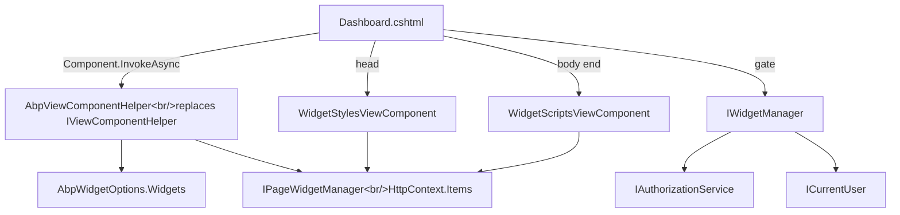

ABP Framework *widgets* are ordinary ASP.NET Core view components that have been promoted to first-class citizens of the MVC UI: they get a `WidgetAttribute` to declare scripts, styles, required policies and auto-init behaviour, they are auto-registered through DI scanning, they are filtered by authorization at render time, and the page-level `IPageWidgetManager` knows which widgets are present on the current request so the layout can bundle in the right CSS and JS automatically. All of this is implemented in `Volo.Abp.AspNetCore.Mvc.UI.Widgets` under `framework/src/Volo.Abp.AspNetCore.Mvc.UI.Widgets/`.

## Module wiring

`AbpAspNetCoreMvcUiWidgetsModule` (`framework/src/Volo.Abp.AspNetCore.Mvc.UI.Widgets/Volo/Abp/AspNetCore/Mvc/UI/Widgets/AbpAspNetCoreMvcUiWidgetsModule.cs`) depends on `AbpAspNetCoreMvcUiBootstrapModule` (for `<abp-script>` / `<abp-style>` tag helpers) and `AbpAspNetCoreMvcUiBundlingModule` (for the bundle pipeline that consumes widget resources):

```csharp
[DependsOn(
    typeof(AbpAspNetCoreMvcUiBootstrapModule),
    typeof(AbpAspNetCoreMvcUiBundlingModule)
)]
public class AbpAspNetCoreMvcUiWidgetsModule : AbpModule
{
    public override void PreConfigureServices(ServiceConfigurationContext context)
    {
        PreConfigure<IMvcBuilder>(mvcBuilder =>
        {
            mvcBuilder.AddApplicationPartIfNotExists(typeof(AbpAspNetCoreMvcUiWidgetsModule).Assembly);
        });

        AutoAddWidgets(context.Services);
    }

    public override void ConfigureServices(ServiceConfigurationContext context)
    {
        context.Services.AddTransient<DefaultViewComponentHelper>();
        Configure<AbpVirtualFileSystemOptions>(options =>
            options.FileSets.AddEmbedded<AbpAspNetCoreMvcUiWidgetsModule>());
    }

    private static void AutoAddWidgets(IServiceCollection services)
    {
        var widgetTypes = new List<Type>();
        services.OnRegistered(context =>
        {
            if (WidgetAttribute.IsWidget(context.ImplementationType))
                widgetTypes.Add(context.ImplementationType);
        });

        services.Configure<AbpWidgetOptions>(options =>
        {
            foreach (var widgetType in widgetTypes)
                options.Widgets.Add(new WidgetDefinition(widgetType));
        });
    }
}
```

Two things stand out. First, `services.AddTransient<DefaultViewComponentHelper>()` *re-registers* ASP.NET Core's built-in view component helper as a concrete type because `AbpViewComponentHelper` will inject it and delegate to it for non-widget view components. Second, `AutoAddWidgets` subscribes to `services.OnRegistered` — every time a service is added to the container, the callback checks `WidgetAttribute.IsWidget(implementationType)` and, if true, queues the type. The actual `AbpWidgetOptions.Widgets.Add(new WidgetDefinition(t))` calls are deferred to a `services.Configure<AbpWidgetOptions>` block so the collection is populated *after* every other module has registered its view components.

## WidgetAttribute

Every widget is just a `[Widget]`-attributed subclass of `ViewComponent`. The attribute (`WidgetAttribute.cs`) is the full declaration surface:

```csharp
[AttributeUsage(AttributeTargets.Class)]
public class WidgetAttribute : Attribute
{
    public string[]? StyleFiles { get; set; }
    public Type[]?   StyleTypes { get; set; }
    public string[]? ScriptFiles { get; set; }
    public Type[]?   ScriptTypes { get; set; }
    public string?   DisplayName { get; set; }
    public Type?     DisplayNameResource { get; set; }
    public string[]? RequiredPolicies { get; set; }
    public bool      RequiresAuthentication { get; set; }
    public string?   RefreshUrl { get; set; }
    public bool      AutoInitialize { get; set; }

    public static bool IsWidget(Type type)
        => type.IsSubclassOf(typeof(ViewComponent)) &&
           type.IsDefined(typeof(WidgetAttribute), true);

    public static WidgetAttribute Get(Type viewComponentType)
        => viewComponentType.GetCustomAttribute<WidgetAttribute>(true)
           ?? throw new AbpException($"Given type '{viewComponentType.AssemblyQualifiedName}' does not declare a {typeof(WidgetAttribute).AssemblyQualifiedName}");
}
```

A typical declaration:

```csharp
[Widget(
    StyleFiles  = new[] { "/scripts/dashboard/sales-summary.css" },
    ScriptTypes = new[] { typeof(SalesSummaryScriptContributor) },
    DisplayName = "DisplayName:SalesSummary",
    DisplayNameResource = typeof(DashboardResource),
    RequiredPolicies = new[] { DashboardPermissions.Widgets.SalesSummary },
    RefreshUrl = "/Dashboards/SalesSummary",
    AutoInitialize = true)]
public class SalesSummaryViewComponent : ViewComponent { … }
```

- `StyleFiles` / `ScriptFiles` are physical CSS/JS paths to be injected.
- `StyleTypes` / `ScriptTypes` are `IBundleContributor` types — the widget can therefore re-use the regular bundling abstractions (see the Bundling page) instead of listing flat files.
- `DisplayName` + `DisplayNameResource` produce an `ILocalizableString` (see `WidgetDefinition.GetDisplayName`).
- `RequiredPolicies` ties the widget to authorization policies; when set, those take precedence over `RequiresAuthentication`.
- `RefreshUrl` is what client-side `widget-manager.js` (shipped in the global script bundle) calls to refresh the widget's HTML in-place via AJAX.
- `AutoInitialize` toggles `data-widget-auto-init="true"` on the wrapper `<div>` so the client manager wires it up on page load.

## WidgetDefinition

Each widget type lifts its `[Widget]` attribute into a richer `WidgetDefinition` object (`WidgetDefinition.cs`). The constructor reads everything from `WidgetAttribute`:

```csharp
public WidgetDefinition(Type viewComponentType, ILocalizableString? displayName = null)
{
    ViewComponentType = Check.NotNull(viewComponentType, nameof(viewComponentType));
    WidgetAttribute   = WidgetAttribute.Get(viewComponentType);
    Name              = GetWidgetName(viewComponentType);
    DisplayName       = displayName ?? GetDisplayName(WidgetAttribute, Name);
    RequiredPolicies  = GetRequiredPolicies(WidgetAttribute);
    RequiresAuthentication = WidgetAttribute.RequiresAuthentication;
    Styles            = GetStyles(WidgetAttribute);
    Scripts           = GetScripts(WidgetAttribute);
    RefreshUrl        = WidgetAttribute.RefreshUrl;
    AutoInitialize    = WidgetAttribute.AutoInitialize;
}
```

The naming convention `GetWidgetName` first consults `[ViewComponent(Name = "…")]` and otherwise strips the `ViewComponent` suffix from the type name. So `SalesSummaryViewComponent` registers as `SalesSummary`.

A `WidgetDefinition` also offers a small fluent surface — `WithRequiredPolicies`, `WithRequiresAuthentication`, `WithStyles(params string[])`, `WithStyles(params Type[])`, `WithScripts(params string[])`, `WithScripts(params Type[])`, `WithRefreshUrl(string)` — so a module can imperatively register a widget without an attribute:

```csharp
Configure<AbpWidgetOptions>(options =>
{
    options.Widgets.Add<SalesSummaryViewComponent>()
        .WithRequiresAuthentication()
        .WithScripts("/scripts/dashboard/extra-init.js");
});
```

### Script / style normalisation

Resources are normalised into `WidgetResourceItem` records (`WidgetResourceItem.cs`):

```csharp
public class WidgetResourceItem
{
    public string? Src { get; }
    public Type?   Type { get; }
    public WidgetResourceItem(string src) { Src = Check.NotNullOrWhiteSpace(src, nameof(src)); }
    public WidgetResourceItem(Type type)  { Type = Check.NotNull(type, nameof(type)); }
}
```

Each item is *either* a `Src` path or a contributor `Type`. `WidgetDefinition.GetStyles` and `GetScripts` build the list from `StyleTypes` followed by `StyleFiles` (`ScriptTypes` then `ScriptFiles`). Files always come *after* contributors so vendor-provided types resolve first.

## AbpWidgetOptions and WidgetDefinitionCollection

`AbpWidgetOptions` (`AbpWidgetOptions.cs`) is just a wrapper around a `WidgetDefinitionCollection`:

```csharp
public class AbpWidgetOptions
{
    public WidgetDefinitionCollection Widgets { get; } = new();
}
```

`WidgetDefinitionCollection` (`WidgetDefinitionCollection.cs`) maintains two indexes — by widget name and by view-component type — so consumers can look up widgets either way:

```csharp
public void Add(WidgetDefinition widget)
{
    var existing = _widgetsByName.GetOrDefault(widget.Name);
    if (existing != null) _widgetsByType[existing.ViewComponentType] = widget;
    _widgetsByName[widget.Name] = widget;
    _widgetsByType[widget.ViewComponentType] = widget;
}

public WidgetDefinition? Find(string name) => _widgetsByName.GetOrDefault(name);
public WidgetDefinition? Find<TVC>()         => Find(typeof(TVC));
public WidgetDefinition? Find(Type vcType)   => _widgetsByType.GetOrDefault(vcType);
public IReadOnlyCollection<WidgetDefinition> GetAll() => _widgetsByName.Values.ToImmutableArray();
```

The two-index design makes it cheap for `AbpViewComponentHelper.InvokeAsync(string name)` and the equally-overloaded `InvokeAsync(Type componentType)` to find the right definition.

## IWidgetManager — authorization

`IWidgetManager : ITransientDependency` (`IWidgetManager.cs`) is the surface the *outside world* uses to ask whether a widget is allowed for the current user:

```csharp
public interface IWidgetManager : ITransientDependency
{
    Task<bool> IsGrantedAsync(Type widgetComponentType);
    Task<bool> IsGrantedAsync(string name);
}
```

`WidgetManager : IWidgetManager` (`WidgetManager.cs`) implements both by looking up the `WidgetDefinition` from `AbpWidgetOptions.Widgets.Find` and running:

```csharp
if (widget.RequiredPolicies.Any())
{
    foreach (var requiredPolicy in widget.RequiredPolicies)
        if (!(await AuthorizationService.AuthorizeAsync(requiredPolicy)).Succeeded)
            return false;
}
else if (widget.RequiresAuthentication && !CurrentUser.IsAuthenticated)
{
    return false;
}
return true;
```

Two facts to internalize: the *list* of policies is treated as a logical-AND (every single one must succeed), and `RequiresAuthentication` is *ignored* once any policy is set — policies imply authentication.

## IPageWidgetManager — per-request tracking

`IPageWidgetManager` and `PageWidgetManager` (`IPageWidgetManager.cs`, `PageWidgetManager.cs`) keep the set of *actually rendered* widgets for the current HTTP request:

```csharp
public class PageWidgetManager : IPageWidgetManager, IScopedDependency
{
    public const string HttpContextItemName = "__AbpCurrentWidgets";

    public bool TryAdd(WidgetDefinition widget) => GetWidgetList().AddIfNotContains(widget);

    private List<WidgetDefinition> GetWidgetList()
    {
        var httpContext = _httpContextAccessor.HttpContext
            ?? throw new AbpException(/* used outside HTTP context */);
        var widgets = httpContext.Items[HttpContextItemName] as List<WidgetDefinition>;
        if (widgets == null)
        {
            widgets = new List<WidgetDefinition>();
            httpContext.Items[HttpContextItemName] = widgets;
        }
        return widgets;
    }

    public IReadOnlyList<WidgetDefinition> GetAll() => GetWidgetList().ToImmutableArray();
}
```

`__AbpCurrentWidgets` is an `HttpContext.Items` key, so the list lives for exactly one request and disappears afterwards. Two view components consume it:

- `WidgetStylesViewComponent` (`Components/WidgetStyles/WidgetStylesViewComponent.cs`) calls `PageWidgetManager.GetAll()` and emits an `<abp-style-bundle>` containing one `<abp-style>` per `WidgetResourceItem`.
- `WidgetScriptsViewComponent` (`Components/WidgetScripts/WidgetScriptsViewComponent.cs`) does the same for scripts.

Their `.cshtml` views are literally:

```razor
@model WidgetResourcesViewModel
@if (Model.Widgets.Any())
{
    var items = Model.Widgets.SelectMany(w => w.Scripts).ToArray();
    if (items.Any())
    {
        <abp-script-bundle>
            @foreach (var item in items)
            {
                if (item.Src != null) { <abp-script src="@item.Src" /> }
                else                  { <abp-script type="@item.Type" /> }
            }
        </abp-script-bundle>
    }
}
```

A theme's `_Layout.cshtml` invokes `@await Component.InvokeAsync("WidgetStyles")` in `<head>` and `@await Component.InvokeAsync("WidgetScripts")` at the end of `<body>` — that's how widgets get *just* the assets they need, on every page, automatically.

## AbpViewComponentHelper — the actual hook

The piece that makes everything fit together is `AbpViewComponentHelper` (`AbpViewComponentHelper.cs`). It is registered with `[Dependency(ReplaceServices = true)]` to override ASP.NET Core's stock `IViewComponentHelper`:

```csharp
[Dependency(ReplaceServices = true)]
public class AbpViewComponentHelper : IViewComponentHelper, IViewContextAware, ITransientDependency
{
    public AbpViewComponentHelper(
        DefaultViewComponentHelper defaultViewComponentHelper,
        IOptions<AbpWidgetOptions> widgetOptions,
        IPageWidgetManager pageWidgetManager) { … }

    public virtual async Task<IHtmlContent> InvokeAsync(string name, object? arguments)
    {
        var widget = Options.Widgets.Find(name);
        if (widget == null)
            return await DefaultViewComponentHelper.InvokeAsync(name, arguments);
        return await InvokeWidgetAsync(arguments, widget);
    }

    public virtual async Task<IHtmlContent> InvokeAsync(Type componentType, object? arguments)
    {
        var widget = Options.Widgets.Find(componentType);
        if (widget == null)
            return await DefaultViewComponentHelper.InvokeAsync(componentType, arguments);
        return await InvokeWidgetAsync(arguments, widget);
    }

    protected virtual async Task<IHtmlContent> InvokeWidgetAsync(object? arguments, WidgetDefinition widget)
    {
        PageWidgetManager.TryAdd(widget);

        var wrapper = new StringBuilder(
            $"class=\"abp-widget-wrapper\" data-widget-name=\"{widget.Name}\"");
        if (widget.RefreshUrl != null)  wrapper.Append($" data-refresh-url=\"{widget.RefreshUrl}\"");
        if (widget.AutoInitialize)      wrapper.Append(" data-widget-auto-init=\"true\"");

        return new HtmlContentBuilder()
            .AppendHtml($"<div {wrapper}>")
            .AppendHtml(await DefaultViewComponentHelper.InvokeAsync(widget.ViewComponentType, arguments))
            .AppendHtml("</div>");
    }
}
```

Calling `@await Component.InvokeAsync("SalesSummary")` from a Razor view therefore:

1. Looks up `WidgetDefinition` for "SalesSummary" in `AbpWidgetOptions.Widgets`.
2. If it's *not* a widget (i.e. a plain view component), passes through to `DefaultViewComponentHelper`.
3. If it *is* a widget, registers it with `IPageWidgetManager.TryAdd` so the layout's `WidgetStyles` / `WidgetScripts` components later emit its resources.
4. Wraps the rendered HTML in a `<div class="abp-widget-wrapper" data-widget-name="…" [data-refresh-url="…"] [data-widget-auto-init="true"]>` so client-side `widget-manager.js` can find, refresh and auto-initialize the widget.

`WidgetDimensions` (a 2-int struct in `WidgetDimensions.cs`) is a small helper passed through `Arguments` when a widget needs to be told what size it should render at — useful when the same view component appears in different dashboard tiles.

## End-to-end flow

```mermaid
sequenceDiagram
    participant Layout as _Layout.cshtml
    participant Razor as @await Component.InvokeAsync(&quot;SalesSummary&quot;)
    participant Helper as AbpViewComponentHelper
    participant Options as AbpWidgetOptions
    participant Page as IPageWidgetManager
    participant VC as SalesSummaryViewComponent
    participant Default as DefaultViewComponentHelper
    participant Styles as WidgetStylesViewComponent
    participant Scripts as WidgetScriptsViewComponent
    participant Bundle as AbpStyleBundle / AbpScriptBundle

    Layout->>Razor: render
    Razor->>Helper: InvokeAsync(&quot;SalesSummary&quot;, args)
    Helper->>Options: Widgets.Find(&quot;SalesSummary&quot;)
    Options-->>Helper: WidgetDefinition
    Helper->>Page: TryAdd(widget)
    Helper->>Default: InvokeAsync(ViewComponentType, args)
    Default->>VC: Invoke()
    VC-->>Default: ViewResult
    Default-->>Helper: rendered HTML
    Helper-->>Razor: &lt;div class=&quot;abp-widget-wrapper&quot;…&gt;HTML&lt;/div&gt;
    Layout->>Styles: Invoke()
    Styles->>Page: GetAll()
    Page-->>Styles: list of widget definitions
    Styles->>Bundle: render &lt;abp-style-bundle&gt; with item URLs
    Layout->>Scripts: Invoke()
    Scripts->>Page: GetAll()
    Scripts->>Bundle: render &lt;abp-script-bundle&gt; with item URLs
    Bundle-->>Layout: &lt;link&gt;/&lt;script&gt; tags
```

## Authorization at render time

Because `AbpViewComponentHelper` registers the widget on every `InvokeAsync`, a Razor view that wants to *conditionally* render a widget should check `IWidgetManager.IsGrantedAsync` first:

```razor
@inject IWidgetManager WidgetManager

@if (await WidgetManager.IsGrantedAsync<SalesSummaryViewComponent>())
{
    @await Component.InvokeAsync<SalesSummaryViewComponent>()
}
```

That keeps the widget out of `IPageWidgetManager` (so its assets aren't pulled into the page) and out of the rendered HTML when the user is not authorized.

## How a custom dashboard composes widgets



## A complete example

```csharp
public class SalesSummaryScriptContributor : BundleContributor
{
    public override void ConfigureBundle(BundleConfigurationContext context)
    {
        context.Files.AddIfNotContains(
            x => x.FileName == "/scripts/dashboard/sales-summary.js",
            () => new BundleFile("/scripts/dashboard/sales-summary.js"));
    }
}

[Widget(
    StyleFiles  = new[] { "/scripts/dashboard/sales-summary.css" },
    ScriptTypes = new[] { typeof(SalesSummaryScriptContributor) },
    RequiredPolicies = new[] { "Dashboard.SalesSummary" },
    RefreshUrl = "/Dashboards/SalesSummary/Refresh",
    AutoInitialize = true,
    DisplayName = "DisplayName:SalesSummary",
    DisplayNameResource = typeof(DashboardResource))]
public class SalesSummaryViewComponent : ViewComponent
{
    public IViewComponentResult Invoke(WidgetDimensions? dimensions = null)
        => View(new SalesSummaryViewModel { /* … */ });
}
```

Then in `Pages/Dashboard.cshtml`:

```razor
@inject IWidgetManager Widgets

<div class="dashboard">
@if (await Widgets.IsGrantedAsync<SalesSummaryViewComponent>())
{
    @await Component.InvokeAsync<SalesSummaryViewComponent>(new { dimensions = new WidgetDimensions(6, 4) })
}
</div>
```

And in the layout (`Themes/Basic/Layouts/Application.cshtml` or similar):

```razor
<head>
    @await Component.InvokeAsync("WidgetStyles")
</head>
<body>
    @RenderBody()
    @await Component.InvokeAsync("WidgetScripts")
</body>
```

The widget renders inside `<div class="abp-widget-wrapper" data-widget-name="SalesSummary" data-refresh-url="/Dashboards/SalesSummary/Refresh" data-widget-auto-init="true">…</div>`. The dashboard page automatically gets `sales-summary.css` and `sales-summary.js` (via the contributor) bundled and emitted; no other page in the application pays the cost of those assets.

## Where to read next

- The Bundling page explains how `<abp-script-bundle>` and `<abp-style-bundle>` (used by `WidgetScripts` and `WidgetStyles`) actually generate the served files and respect `BundlingMode`.
- The Theme Shared page lists `widget-manager.js` among the files in `SharedThemeGlobalScriptContributor` — that's the client-side counterpart to `AutoInitialize` and `RefreshUrl`.
- The Navigation & Menus page covers the related, but orthogonal, problem of building application-level menus instead of per-page widgets.
