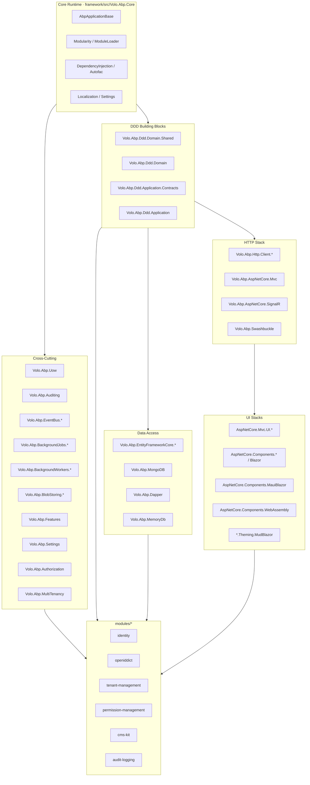
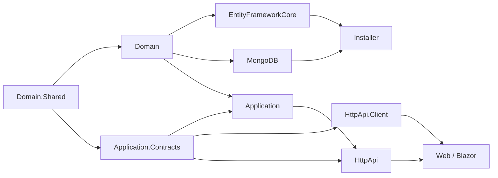
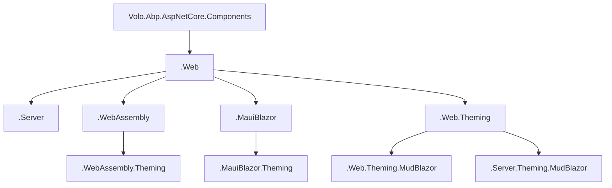
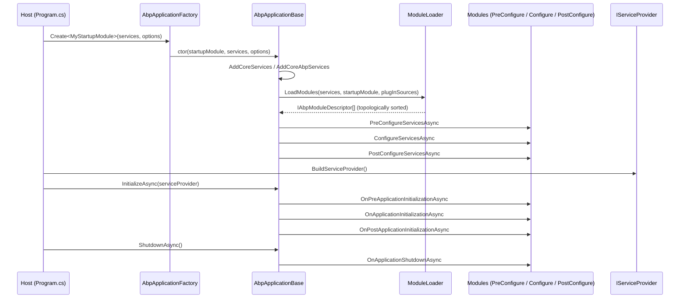

The ABP Framework is an opinionated, modular application framework for ASP.NET Core. This page maps the major subsystems that live inside the `abpframework/abp` repository, shows how they layer on top of `Volo.Abp.Core`, walks the standard package pyramid that every ABP module (whether shipped from `framework/src/`, `modules/`, or a user solution) follows, and traces the boot sequence implemented by `AbpApplicationBase` in `framework/src/Volo.Abp.Core/Volo/Abp/AbpApplicationBase.cs`. The intent is to give a single mental model that explains why the on-disk layout (`framework/`, `modules/`, `templates/`, `npm/`, `studio/`) is shaped the way it is.

## Subsystems at a glance

ABP is organised as a graph of independent NuGet packages that all start with the `Volo.Abp.*` prefix and share a common modular runtime. The runtime itself is tiny — `framework/src/Volo.Abp.Core/Volo.Abp.Core.csproj` — and every other capability (DDD, data, HTTP, UI, jobs, blobs, events) is layered on top via `[DependsOn]`.



Each cluster maps directly to a directory in the repository. The runtime lives under `framework/src/Volo.Abp.Core/Volo/Abp/`, the DDD blocks under `framework/src/Volo.Abp.Ddd.*/`, the cross-cutting families under their respective `Volo.Abp.*` folders, and the higher-level modules under `modules/<name>/src/`.

<Note>
ABP follows the package-per-concern rule: even something as small as `Volo.Abp.Json.Abstractions` is a separate project (`framework/src/Volo.Abp.Json.Abstractions/Volo.Abp.Json.Abstractions.csproj`) so consumers can take an abstraction without dragging in `Newtonsoft.Json` or `System.Text.Json` implementations.
</Note>

## The core runtime

The core runtime is the part of ABP every other package depends on, transitively. It is defined by a small set of types under `framework/src/Volo.Abp.Core/Volo/Abp/`:

| Symbol | File | Role |
| --- | --- | --- |
| `IAbpApplication` | `framework/src/Volo.Abp.Core/Volo/Abp/IAbpApplication.cs` | Public application contract |
| `AbpApplicationBase` | `framework/src/Volo.Abp.Core/Volo/Abp/AbpApplicationBase.cs` | Loads modules, configures DI, runs lifecycle |
| `AbpApplicationCreationOptions` | `framework/src/Volo.Abp.Core/Volo/Abp/AbpApplicationCreationOptions.cs` | Options passed to `AbpApplicationFactory.Create<TStartupModule>` |
| `AbpApplicationFactory` | `framework/src/Volo.Abp.Core/Volo/Abp/AbpApplicationFactory.cs` | Static entry point used by host code |
| `AbpModule` | `framework/src/Volo.Abp.Core/Volo/Abp/Modularity/AbpModule.cs` | Base class every module derives from |
| `DependsOnAttribute` | `framework/src/Volo.Abp.Core/Volo/Abp/Modularity/DependsOnAttribute.cs` | Declares module dependencies |
| `IModuleLoader` / `ModuleLoader` | `framework/src/Volo.Abp.Core/Volo/Abp/Modularity/ModuleLoader.cs` | Discovers and topologically sorts modules |
| `ServiceConfigurationContext` | `framework/src/Volo.Abp.Core/Volo/Abp/Modularity/ServiceConfigurationContext.cs` | Shared state during `ConfigureServices` |

The `Volo.Abp.Core` package depends only on `Microsoft.Extensions.*` and `JetBrains.Annotations`, so it can be referenced even from class libraries that never spin up a host. The `AbpApplicationBase` constructor in `framework/src/Volo.Abp.Core/Volo/Abp/AbpApplicationBase.cs` records the `StartupModuleType`, registers itself as `IAbpApplication`, `IApplicationInfoAccessor`, and `IModuleContainer`, then calls `LoadModules(services, options)` to build the descriptor graph before optionally invoking `ConfigureServices()`.

### Dependency injection conventions

The DI primitives are in `framework/src/Volo.Abp.Core/Volo/Abp/DependencyInjection/`. Three marker interfaces — `ITransientDependency`, `IScopedDependency`, `ISingletonDependency` — drive convention-based registration through `DefaultConventionalRegistrar.cs`. Classes can opt into multiple service contracts with `ExposeServicesAttribute.cs` or out of conventions with `DisableConventionalRegistrationAttribute.cs`. `AbpLazyServiceProvider.cs` underpins the `LazyServiceProvider` member on `ApplicationService` (see `framework/src/Volo.Abp.Ddd.Application/Volo/Abp/Application/Services/ApplicationService.cs`), letting framework base classes resolve dependencies on demand without bloating constructors.

```csharp
// framework/src/Volo.Abp.Core/Volo/Abp/Modularity/DependsOnAttribute.cs
[AttributeUsage(AttributeTargets.Class, AllowMultiple = true)]
public class DependsOnAttribute : Attribute, IDependedTypesProvider
{
    public Type[] DependedTypes { get; }

    public DependsOnAttribute(params Type[]? dependedTypes)
    {
        DependedTypes = dependedTypes ?? Type.EmptyTypes;
    }

    public virtual Type[] GetDependedTypes() => DependedTypes;
}
```

`Volo.Abp.Autofac` (`framework/src/Volo.Abp.Autofac/`) replaces the default `Microsoft.Extensions.DependencyInjection` container with Autofac so that dynamic proxies — used by the interception subsystem under `framework/src/Volo.Abp.Core/Volo/Abp/DynamicProxy/` — can wrap services for auditing, validation, authorisation, UoW, and global feature checks.

## DDD building blocks and the layered pyramid

ABP packages every business module as a five-layer pyramid that exactly mirrors what the runtime expects. The shapes are defined by the `Volo.Abp.Ddd.*` packages under `framework/src/`:

- `Volo.Abp.Ddd.Domain.Shared` — enums, constants, error codes, `ConcurrencyStampConsts`.
- `Volo.Abp.Ddd.Domain` — entities (`Entity.cs`, `AggregateRoot.cs`, `BasicAggregateRoot.cs` in `framework/src/Volo.Abp.Ddd.Domain/Volo/Abp/Domain/Entities/`), value objects, domain events, repository abstractions (`framework/src/Volo.Abp.Ddd.Domain/Volo/Abp/Domain/Repositories/IRepository.cs`).
- `Volo.Abp.Ddd.Application.Contracts` — DTOs and application service interfaces.
- `Volo.Abp.Ddd.Application` — `ApplicationService`, `CrudAppService`, `ReadOnlyAppService` from `framework/src/Volo.Abp.Ddd.Application/Volo/Abp/Application/Services/`.
- `Volo.Abp.Http.Client` / `Volo.Abp.AspNetCore.Mvc` — wire application services as HTTP endpoints and proxies.

Every shipped module under `modules/<name>/src/` repeats this shape. For example, the Identity module under `modules/identity/src/` has `Volo.Abp.Identity.Domain.Shared/`, `Volo.Abp.Identity.Domain/`, `Volo.Abp.Identity.Application.Contracts/`, `Volo.Abp.Identity.Application/`, `Volo.Abp.Identity.HttpApi/`, `Volo.Abp.Identity.HttpApi.Client/`, plus persistence projects (`Volo.Abp.Identity.EntityFrameworkCore/`, `Volo.Abp.Identity.MongoDB/`) and UI projects (`Volo.Abp.Identity.Web/`, `Volo.Abp.Identity.Blazor/`, `Volo.Abp.Identity.Blazor.MudBlazor/`).



The diagram above also describes the rule that the `templates/module/aspnet-core/src/` template scaffolds when you generate a new module: `MyCompanyName.MyProjectName.Domain.Shared`, `MyCompanyName.MyProjectName.Domain`, `MyCompanyName.MyProjectName.Application.Contracts`, `MyCompanyName.MyProjectName.Application`, `MyCompanyName.MyProjectName.HttpApi`, `MyCompanyName.MyProjectName.HttpApi.Client`, `MyCompanyName.MyProjectName.EntityFrameworkCore`, `MyCompanyName.MyProjectName.MongoDB`, `MyCompanyName.MyProjectName.Web`, `MyCompanyName.MyProjectName.Blazor`, and `MyCompanyName.MyProjectName.Installer`.

<Tip>
The `Installer` project (`Volo.Abp.<Module>.Installer`) exists to make a module installable as a single NuGet package that pulls in all sub-packages plus the migration assets. See `templates/module/aspnet-core/src/MyCompanyName.MyProjectName.Installer/`.
</Tip>

## Cross-cutting subsystems

ABP exposes most cross-cutting concerns as standalone modules so they can be turned on or replaced independently. Each one corresponds to a directory under `framework/src/`:

<CardGroup cols={2}>
  <Card title="Unit of Work" icon="arrows-rotate">
    `framework/src/Volo.Abp.Uow/Volo/Abp/Uow/` defines `IUnitOfWork`, `IUnitOfWorkManager`, and `AmbientUnitOfWork.cs`. Database calls are wrapped in a UoW scope so that `SaveChanges` and event publishing happen together.
  </Card>
  <Card title="Auditing" icon="clipboard-list">
    `framework/src/Volo.Abp.Auditing/` captures entity changes and method invocations. `IAuditingEnabled` on `ApplicationService` opts a service in.
  </Card>
  <Card title="Authorization" icon="lock">
    `framework/src/Volo.Abp.Authorization/Volo/Abp/Authorization/Permissions/` provides `PermissionChecker`, `PermissionDefinitionManager`, and the dynamic permission store contract `IDynamicPermissionDefinitionStore.cs`.
  </Card>
  <Card title="Multi-tenancy" icon="building">
    `framework/src/Volo.Abp.MultiTenancy/Volo/Abp/MultiTenancy/CurrentTenant.cs` exposes the ambient tenant via `ICurrentTenant`, resolved by `TenantResolver.cs` and switchable with `CurrentTenant.Change(Guid?)`.
  </Card>
  <Card title="Features & Settings" icon="sliders">
    `framework/src/Volo.Abp.Features/` and `framework/src/Volo.Abp.Settings/` expose `FeatureChecker`, `FeatureDefinitionManager`, `ISettingProvider`, `ISettingDefinitionManager` for runtime-tweakable behaviour.
  </Card>
  <Card title="Global Features" icon="globe">
    `framework/src/Volo.Abp.GlobalFeatures/Volo/Abp/GlobalFeatures/GlobalFeatureManager.cs` toggles compile-time-style feature flags via `GlobalFeatureInterceptor.cs`.
  </Card>
  <Card title="Event Bus" icon="bullhorn">
    `framework/src/Volo.Abp.EventBus/Volo/Abp/EventBus/` has `Local/` and `Distributed/` sub-trees. Transports live in sister packages: `Volo.Abp.EventBus.RabbitMQ`, `Volo.Abp.EventBus.Kafka`, `Volo.Abp.EventBus.Azure`, `Volo.Abp.EventBus.Dapr`, `Volo.Abp.EventBus.Rebus`.
  </Card>
  <Card title="Background Jobs & Workers" icon="bolt">
    `framework/src/Volo.Abp.BackgroundJobs/` runs durable jobs through `Volo.Abp.BackgroundJobs.HangFire`, `Volo.Abp.BackgroundJobs.Quartz`, `Volo.Abp.BackgroundJobs.RabbitMQ`, `Volo.Abp.BackgroundJobs.TickerQ`. `framework/src/Volo.Abp.BackgroundWorkers/` runs in-process recurring workers, also with HangFire/Quartz/TickerQ backends.
  </Card>
</CardGroup>

### Blob storing

`Volo.Abp.BlobStoring` is a uniform API over object storage. The abstraction lives in `framework/src/Volo.Abp.BlobStoring/Volo/Abp/BlobStoring/BlobContainer.cs` and `BlobProviderBase.cs`. Providers are split into individual packages so users only pull in what they need:

- `framework/src/Volo.Abp.BlobStoring.FileSystem/`
- `framework/src/Volo.Abp.BlobStoring.Aws/`
- `framework/src/Volo.Abp.BlobStoring.Azure/`
- `framework/src/Volo.Abp.BlobStoring.Google/`
- `framework/src/Volo.Abp.BlobStoring.Aliyun/`
- `framework/src/Volo.Abp.BlobStoring.Bunny/`
- `framework/src/Volo.Abp.BlobStoring.Minio/`
- `framework/src/Volo.Abp.BlobStoring.Memory/`

A database-backed provider ships from `modules/blob-storing-database/` for solutions that prefer to keep blobs alongside their domain data.

### Virtual file system

`framework/src/Volo.Abp.VirtualFileSystem/Volo/Abp/VirtualFileSystem/VirtualFileProvider.cs` lets modules embed Razor views, JS, CSS, and JSON resources into their assemblies and have them surface as `IFileProvider` to ASP.NET Core. The `Embedded/` and `Physical/` sub-folders provide concrete providers, and `DynamicFileProvider.cs` is used by features like UI bundling that need to materialise computed files at runtime.

## HTTP and UI stacks

ABP supports several front-ends sharing the same application services. The HTTP plumbing exposes those services as REST endpoints and produces typed C# proxies for cross-process callers:

- `framework/src/Volo.Abp.AspNetCore.Mvc/` — ASP.NET Core controllers, dynamic API controllers, model binding, error handling.
- `framework/src/Volo.Abp.AspNetCore.SignalR/` — SignalR integration.
- `framework/src/Volo.Abp.Http.Client/Volo/Abp/Http/Client/` — `DynamicProxying/`, `StaticProxying/`, and `Authentication/` for typed HTTP clients used by Blazor, MAUI, WPF, and microservices.
- `framework/src/Volo.Abp.Http.Client.IdentityModel/` and its `Web`, `WebAssembly`, `MauiBlazor` variants — token acquisition.
- `framework/src/Volo.Abp.Swashbuckle/` — Swagger / OpenAPI integration tuned for ABP conventions.

The `Volo.Abp.AspNetCore.*` family currently contains 44 packages, covering authentication adapters (`Volo.Abp.AspNetCore.Authentication.JwtBearer`, `.OAuth`, `.OpenIdConnect`), MVC (`Volo.Abp.AspNetCore.Mvc.UI`, `.UI.Bootstrap`, `.UI.Theme.Shared`, `.UI.Widgets`, `.UI.Bundling`), and the Blazor/MAUI matrix.

### Blazor and MAUI matrix

Blazor is layered across hosting models so every render mode shares the same theming and bundling stack:



Theming-specific bundling packages (`Volo.Abp.AspNetCore.Components.WebAssembly.Theming.Bundling`, `Volo.Abp.AspNetCore.Components.MauiBlazor.Theming.MudBlazor.Bundling`) keep the JS/CSS pipeline pluggable without bringing UI logic into the runtime.

## The boot sequence

The bootstrap flow is fixed: a host calls `AbpApplicationFactory.Create<TStartupModule>(services, options)`, which constructs either `AbpApplicationWithInternalServiceProvider` or `AbpApplicationWithExternalServiceProvider` (both inherit `AbpApplicationBase`). The base class then runs through the following phases:



Two things make this flow ABP-specific:

1. `ModuleLoader.LoadModules` in `framework/src/Volo.Abp.Core/Volo/Abp/Modularity/ModuleLoader.cs` walks `[DependsOn]` graphs starting from the startup module **plus** plug-in sources held in `AbpApplicationCreationOptions.PlugInSources`, builds `AbpModuleDescriptor` instances, then calls `SortByDependency(modules, startupModuleType)` so dependencies always configure first.
2. The lifecycle hooks (`IPreConfigureServices`, `IPostConfigureServices`, `IOnPreApplicationInitialization`, `IOnApplicationInitialization`, `IOnPostApplicationInitialization`, `IOnApplicationShutdown`) are all defined under `framework/src/Volo.Abp.Core/Volo/Abp/Modularity/` and implemented by `AbpModule.cs` as virtual no-ops, so modules only override what they need.

```csharp
// framework/src/Volo.Abp.Core/Volo/Abp/AbpApplicationBase.cs (excerpt)
internal AbpApplicationBase(
    [NotNull] Type startupModuleType,
    [NotNull] IServiceCollection services,
    Action<AbpApplicationCreationOptions>? optionsAction)
{
    StartupModuleType = startupModuleType;
    Services = services;

    var options = new AbpApplicationCreationOptions(services);
    optionsAction?.Invoke(options);

    services.AddSingleton<IAbpApplication>(this);
    services.AddSingleton<IApplicationInfoAccessor>(this);
    services.AddSingleton<IModuleContainer>(this);

    services.AddCoreServices();
    services.AddCoreAbpServices(this, options);

    Modules = LoadModules(services, options);

    if (!options.SkipConfigureServices)
    {
        ConfigureServices();
    }
}
```

<Warning>
`ServiceConfigurationContext` (`framework/src/Volo.Abp.Core/Volo/Abp/Modularity/ServiceConfigurationContext.cs`) is **only valid during `(Pre|Post)ConfigureServices`**. Accessing `module.ServiceConfigurationContext` outside those phases throws `AbpException`. This is enforced by the `null` guard in `AbpModule.cs`.
</Warning>

## Modules folder and the studio source-code packages

The `modules/` folder ships 18 reusable feature modules (`account`, `audit-logging`, `background-jobs`, `basic-theme`, `blob-storing-database`, `blogging`, `client-simulation`, `cms-kit`, `docs`, `feature-management`, `identity`, `identityserver`, `openiddict`, `permission-management`, `setting-management`, `tenant-management`, `users`, `virtual-file-explorer`). Each has its own `.abpsln` / `.abpmdl` / `.slnx` triplet (for example `modules/identity/Volo.Abp.Identity.slnx`) so it can be built independently or jointly via `build/build-all.ps1`.

`studio/source-codes/` contains the matching `*.SourceCode` packages used by ABP Studio to scaffold a "source-code referenced" copy of a module into a user solution. Examples include `studio/source-codes/Volo.Abp.Identity.SourceCode/`, `studio/source-codes/Volo.Abp.OpenIddict.SourceCode/`, and `studio/source-codes/Volo.CmsKit.SourceCode/`.

## CLI and tooling

The CLI lives in `framework/src/Volo.Abp.Cli/` (commands, options, and templates) plus `framework/src/Volo.Abp.Cli.Core/` (lower-level abstractions). Auxiliary tooling under `tools/` includes:

- `tools/nuget/nuget.exe` — used by the deploy scripts to pack/push.
- `tools/github-changelog-generator/` — generates release notes from milestones.
- `tools/localization-key-synchronizer/` — keeps localisation JSON keys aligned across cultures.

## Putting it together

```mermaid
flowchart LR
    P[Program.cs] -->|builder.Services.AddApplicationAsync<MyStartupModule>| F[AbpApplicationFactory]
    F --> AB[AbpApplicationBase]
    AB --> ML[ModuleLoader]
    ML --> G[Module graph]
    G --> CS[ConfigureServices on every module]
    CS --> SP[IServiceProvider]
    SP --> I[InitializeAsync]
    I --> RUN[Application running]
    RUN --> SD[ShutdownAsync]
```



Once you internalise this picture, the rest of the repository — the package families under `framework/src/`, the modules under `modules/`, the solution templates under `templates/`, and the npm packages under `npm/` — becomes a straightforward read: every directory is the on-disk manifestation of one of the subsystems above.
