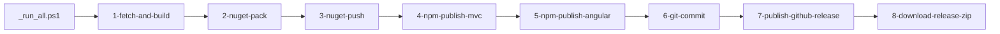
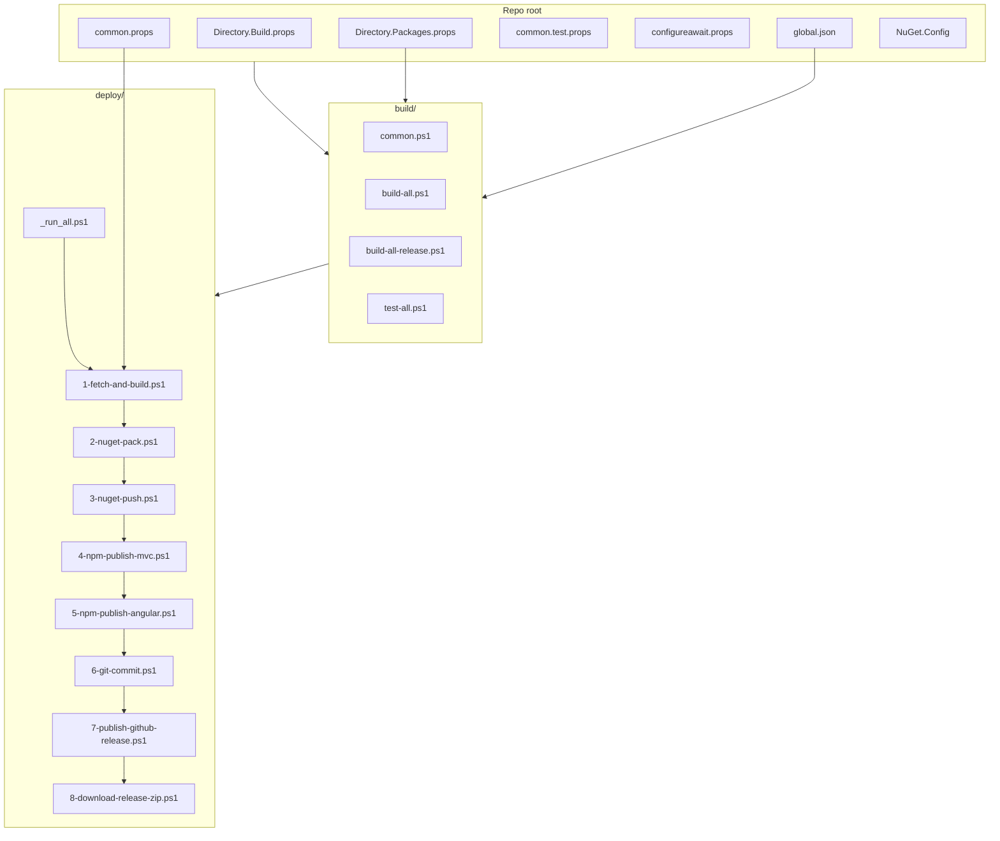

The ABP Framework is built with the .NET SDK plus a thin layer of PowerShell automation. This page documents the build pipeline end-to-end: the MSBuild props files that every project inherits, the SDK pin in `global.json`, the scripts under `build/` that compile and test every solution, the eight numbered scripts under `deploy/` that publish NuGet and npm packages and cut GitHub releases, the npm workspace that ships the Angular and MVC JavaScript packages, and the helper executables in `tools/`. Everything below is grounded in the actual files at the repository root.

## SDK pin and central package management

The repo pins the .NET SDK with `global.json` so every contributor and CI agent uses the same toolchain:

```json
// global.json
{
  "sdk": {
    "version": "10.0.100",
    "rollForward": "latestFeature"
  }
}
```

`rollForward: latestFeature` allows newer feature-band versions of SDK 10 (e.g. `10.0.10x`) but blocks accidental upgrades to SDK 11. Combined with the central package management declared in `Directory.Packages.props`, this gives reproducible restores across every machine.

```xml
<!-- Directory.Packages.props (excerpt) -->
<Project>
  <PropertyGroup>
    <ManagePackageVersionsCentrally>true</ManagePackageVersionsCentrally>
    <CentralPackageFloatingVersionsEnabled>true</CentralPackageFloatingVersionsEnabled>
  </PropertyGroup>
  <ItemGroup>
    <PackageVersion Include="Autofac" Version="9.1.0" />
    <PackageVersion Include="Microsoft.EntityFrameworkCore" Version="10.0.7" />
    <PackageVersion Include="OpenIddict.Server.AspNetCore" Version="7.5.0" />
    <PackageVersion Include="Serilog" Version="4.3.0" />
    <PackageVersion Include="xunit" Version="2.9.3" />
    <PackageVersion Include="ConfigureAwait.Fody" Version="3.3.2" />
    <PackageVersion Include="Fody" Version="6.9.3" />
    <!-- ...hundreds more... -->
  </ItemGroup>
</Project>
```

Because central package management is on, individual `.csproj` files in `framework/src/`, `modules/`, and `templates/` declare `<PackageReference Include="..." />` without a `Version=` attribute. To bump a dependency version you change exactly one line in `Directory.Packages.props`.

## Shared MSBuild props files

Every project at the root of the repo inherits a small stack of props files.

### `Directory.Build.props` — implicit per-directory props

`Directory.Build.props` runs automatically against every `.csproj` thanks to MSBuild's directory probing. It auto-detects test projects and injects coverlet:

```xml
<!-- Directory.Build.props -->
<Project>
  <PropertyGroup>
    <IsTestProject Condition="$(MSBuildProjectFullPath.Contains('test')) and ($(MSBuildProjectName.EndsWith('.Tests')) or $(MSBuildProjectName.EndsWith('.TestBase')))">true</IsTestProject>
  </PropertyGroup>

  <ItemGroup>
    <PackageReference Condition="'$(IsTestProject)' == 'true'" Include="coverlet.collector">
      <Version Condition="$(MSBuildProjectFullPath.Contains('templates'))">6.0.4</Version>
      <PrivateAssets>all</PrivateAssets>
      <IncludeAssets>runtime; build; native; contentfiles; analyzers</IncludeAssets>
    </PackageReference>
  </ItemGroup>
</Project>
```

The `MSBuildProjectFullPath.Contains('templates')` guard exists because template projects don't participate in central package management — they ship as standalone .csproj files customers will modify — so coverlet needs an explicit version there.

### `common.props` — versioning and NuGet metadata

`common.props` is `Import`-ed by individual `.csproj` files (typically with `<Import Project="..\..\common.props" />`). It carries the framework version, the `LeptonX` version, NuGet metadata, the SourceLink package reference, and rules for embedding `.abppkg` / `.abppkg.analyze.json` files into NuGet content folders:

```xml
<!-- common.props (excerpt) -->
<Project>
  <PropertyGroup>
    <LangVersion>latest</LangVersion>
    <Version>10.4.0-rc.2</Version>
    <LeptonXVersion>5.4.0-rc.2</LeptonXVersion>
    <NoWarn>$(NoWarn);CS1591;CS0436</NoWarn>
    <PackageIconUrl>https://abp.io/assets/abp_nupkg.png</PackageIconUrl>
    <PackageProjectUrl>https://abp.io/</PackageProjectUrl>
    <PackageLicenseExpression>LGPL-3.0-only</PackageLicenseExpression>
    <RepositoryUrl>https://github.com/abpframework/abp/</RepositoryUrl>
    <PackageReadmeFile>NuGet.md</PackageReadmeFile>
    <GenerateDocumentationFile>true</GenerateDocumentationFile>
    <AllowedOutputExtensionsInPackageBuildOutputFolder>$(AllowedOutputExtensionsInPackageBuildOutputFolder);.pdb</AllowedOutputExtensionsInPackageBuildOutputFolder>
  </PropertyGroup>
  <ItemGroup>
    <None Include="..\..\NuGet.md" Pack="true" PackagePath="\"/>
  </ItemGroup>
  <ItemGroup>
    <PackageReference Include="Microsoft.SourceLink.GitHub">
      <PrivateAssets>all</PrivateAssets>
      <IncludeAssets>runtime; build; native; contentfiles; analyzers</IncludeAssets>
    </PackageReference>
  </ItemGroup>
</Project>
```

Three things to note:

- `<Version>10.4.0-rc.2</Version>` — every package shares this version. The release pipeline rewrites this value in `deploy/1-fetch-and-build.ps1`.
- `<PackageReadmeFile>NuGet.md</PackageReadmeFile>` together with the `None Include="..\..\NuGet.md"` item embeds the same shared readme into every `.nupkg`.
- `.pdb` is appended to `AllowedOutputExtensionsInPackageBuildOutputFolder` so symbols ship inside the main package.

### `common.test.props` — minimal test-project options

`common.test.props` adds runtime-config generation and suppresses several auto-generated assembly attributes that would conflict with the centrally generated ones:

```xml
<!-- common.test.props -->
<Project>
  <PropertyGroup>
    <LangVersion>latest</LangVersion>
    <NoWarn>$(NoWarn);CS1591;CS0436</NoWarn>
    <GenerateRuntimeConfigurationFiles>true</GenerateRuntimeConfigurationFiles>
    <GenerateAssemblyConfigurationAttribute>false</GenerateAssemblyConfigurationAttribute>
    <GenerateAssemblyCompanyAttribute>false</GenerateAssemblyCompanyAttribute>
    <GenerateAssemblyProductAttribute>false</GenerateAssemblyProductAttribute>
  </PropertyGroup>
</Project>
```

### `configureawait.props` — Fody for Release builds

`configureawait.props` adds `ConfigureAwait.Fody` only in Release configuration so framework `await` calls don't capture the synchronisation context in shipped binaries:

```xml
<!-- configureawait.props -->
<Project>
  <ItemGroup Condition="'$(Configuration)' == 'Release'">
      <PackageReference Include="ConfigureAwait.Fody" PrivateAssets="All" />
      <PackageReference Include="Fody">
        <PrivateAssets>All</PrivateAssets>
        <IncludeAssets>runtime; build; native; contentfiles; analyzers</IncludeAssets>
      </PackageReference>
  </ItemGroup>
</Project>
```

### `NuGet.Config` — restore reproducibility

`NuGet.Config` whitelists just `nuget.org`. There are no internal feeds.

```xml
<!-- NuGet.Config -->
<?xml version="1.0" encoding="utf-8"?>
<configuration>
    <packageSources>
        <add key="nuget.org" value="https://api.nuget.org/v3/index.json" />
    </packageSources>
</configuration>
```

## Build scripts (`build/`)

Local builds use the four scripts under `build/`. They are shared with CI so the developer story matches what the pipeline runs.

### `build/common.ps1` — solution list

`build/common.ps1` enumerates the solution paths every script iterates over. There are two modes: the default "development" mode and the `-f` (full) mode used by release builds.

```powershell
# build/common.ps1 (excerpt)
$rootFolder = (Get-Item -Path "./" -Verbose).FullName

$solutionPaths = @(
        "../framework",
        "../modules/basic-theme",
        "../modules/users",
        "../modules/permission-management",
        "../modules/setting-management",
        "../modules/feature-management",
        "../modules/identity",
        "../modules/identityserver",
        "../modules/openiddict",
        "../modules/tenant-management",
        "../modules/audit-logging",
        "../modules/background-jobs",
        "../modules/account",
        "../modules/cms-kit",
        "../modules/blob-storing-database"
    )

if ($full -eq "-f")
{
    $solutionPaths += (
        "../modules/client-simulation",
        "../modules/virtual-file-explorer",
        "../modules/docs",
        "../modules/blogging",
        "../templates/module/aspnet-core",
        "../templates/app/aspnet-core",
        "../templates/console",
        "../templates/app-nolayers/aspnet-core",
        "../abp_io/AbpIoLocalization",
        "../source-code"
    )
    if ($env:OS -eq "Windows_NT") {
        $solutionPaths += "../templates/wpf"
    }
}
```

When you run a script without `-f`, you build only the framework plus the modules required by the layered template. With `-f`, you also build the docs, blogging, client-simulation, virtual-file-explorer modules, every template, the abp.io localisation project, the aggregated source-code solution, and (on Windows) the WPF template.

### `build/build-all.ps1` — debug builds

`build/build-all.ps1` iterates and `dotnet build`s each solution:

```powershell
# build/build-all.ps1
$full = $args[0]
. ".\common.ps1" $full

Write-Host $solutionPaths

foreach ($solutionPath in $solutionPaths) {
    $solutionAbsPath = (Join-Path $rootFolder $solutionPath)
    Set-Location $solutionAbsPath
    dotnet build
    if (-Not $?) {
        Write-Host ("Build failed for the solution: " + $solutionPath)
        Set-Location $rootFolder
        exit $LASTEXITCODE
    }
}

Set-Location $rootFolder
```

### `build/build-all-release.ps1` and `build/test-all.ps1`

`build/build-all-release.ps1` is the same loop but with `-c Release` semantics; it is what the release pipeline calls. `build/test-all.ps1` runs `dotnet test --no-build --no-restore --collect:"XPlat Code Coverage"` over every solution:

```powershell
# build/test-all.ps1
foreach ($solutionPath in $solutionPaths) {
    $solutionAbsPath = (Join-Path $rootFolder $solutionPath)
    Set-Location $solutionAbsPath
    dotnet test --no-build --no-restore --collect:"XPlat Code Coverage"
    if (-Not $?) {
        Write-Host ("Test failed for the solution: " + $solutionPath)
        Set-Location $rootFolder
        exit $LASTEXITCODE
    }
}
```

`codecov.yml` then accepts the resulting coverage with:

```yaml
# codecov.yml
codecov:
  branch: dev
  require_ci_to_pass: yes
  allow_coverage_offsets: true
  status:
    project:
      default:
        threshold: 1%
```

So PRs against `dev` are blocked only if coverage drops by more than 1 % and only if CI passes.

<Tip>
The fastest dev loop for a single package is `cd framework && dotnet build framework/Volo.Abp.slnx` — you don't need PowerShell unless you're verifying the full build matrix. The `build/*.ps1` scripts only exist because that matrix spans 10+ separate solutions.
</Tip>

## Release pipeline (`deploy/`)

`deploy/` contains the orchestration that takes a freshly-built repo to NuGet, npm, and GitHub. The eight scripts are numbered so they can be invoked manually in sequence or together via `deploy/_run_all.ps1`.



`deploy/_run_all.ps1` wires those together. It prompts for the branch name, the new version, and whether the release is an RC/Preview, then invokes each step in turn while transcribing output to `_run_all_log.txt`:

```powershell
# deploy/_run_all.ps1 (excerpt)
./1-fetch-and-build.ps1 $branch $newVersion
./2-nuget-pack.ps1
./3-nuget-push.ps1
./4-npm-publish-mvc.ps1
./5-npm-publish-angular.ps1
./6-git-commit.ps1
./7-publish-github-release.ps1 @publishGithubReleaseParams
./8-download-release-zip.ps1
```

### Step-by-step

<Steps>
  <Step title="1-fetch-and-build.ps1">
    Reads the current version from `common.props`, writes the new version back, switches to the requested branch, runs `git pull origin`, then `cd build` and `./build-all-release.ps1`.

    ```powershell
    # deploy/1-fetch-and-build.ps1 (excerpt)
    $commonPropsFilePath = resolve-path "../common.props"
    $commonPropsXmlCurrent = [xml](Get-Content $commonPropsFilePath )
    $currentVersion = $commonPropsXmlCurrent.Project.PropertyGroup.Version.Trim()

    if ($newVersion -ne $currentVersion){
        $commonPropsXmlCurrent.Project.PropertyGroup.Version = $newVersion
        $commonPropsXmlCurrent.Save( $commonPropsFilePath )
    }

    cd ..
    git switch $branch
    git pull origin
    cd build
    .\build-all-release.ps1
    cd ..\deploy
    ```
  </Step>
  <Step title="2-nuget-pack.ps1">
    Delegates to `nupkg/pack.ps1` which runs `dotnet pack` over every project.
    ```powershell
    # deploy/2-nuget-pack.ps1
    . ..\nupkg\common.ps1
    Write-Info "Creating NuGet packages"
    cd ..\nupkg
    powershell -File pack.ps1
    cd ..\deploy
    ```
  </Step>
  <Step title="3-nuget-push.ps1">
    Reads `nuget-api-key.txt` (or prompts) and calls `nupkg/push_packages.ps1 $nugetApiKey`. This is the only step that requires a secret.
  </Step>
  <Step title="4-npm-publish-mvc.ps1">
    Invokes `npm/publish-mvc.ps1`, which `npm publish`es every package under `npm/packs/*`.
  </Step>
  <Step title="5-npm-publish-angular.ps1">
    Invokes `npm/publish-ng.ps1`, which builds and publishes the Angular packages from `npm/ng-packs/packages/*` using the Lerna config in `npm/ng-packs/lerna.publish.json`.
  </Step>
  <Step title="6-git-commit.ps1">
    Stages the version bump and creates a release tag.
  </Step>
  <Step title="7-publish-github-release.ps1">
    Uses `deploy/new-github-release-function.psm1` to call the GitHub REST API and publish the release. Reads `$branchName` and `$isRcVersion` from `_run_all.ps1`.
  </Step>
  <Step title="8-download-release-zip.ps1">
    Pulls the GitHub-generated source-code zip for the new tag and stores it locally for archival.
  </Step>
</Steps>

The repository also keeps `deploy/plink.exe` so Windows release agents can run SSH commands without installing OpenSSH separately. `deploy/readme.md` documents the manual sequence for emergency partial releases.

<Warning>
The deploy scripts assume the working directory is `deploy/`. They all start with `. ..\nupkg\common.ps1` and they `cd` between `..\nupkg` and back. If you cherry-pick a script, set your shell to the right path first.
</Warning>

## `latest-versions.json` — compatibility matrix

`latest-versions.json` is consumed by the docs site and the ABP CLI to know which framework version is paired with which LeptonX theme version:

```json
// latest-versions.json (excerpt)
[
  {
    "version": "10.3.0",
    "releaseDate": "",
    "type": "stable",
    "message": "",
    "leptonx": {
      "version": "5.3.0"
    }
  },
  {
    "version": "10.2.1",
    "releaseDate": "",
    "type": "stable",
    "message": "",
    "leptonx": {
      "version": "5.2.1"
    }
  }
]
```

The file currently lists 30+ historical versions. Each entry can carry an optional `message` field for release notes the CLI surfaces during `abp update`.

## npm workspace

The repo contains two distinct JavaScript workspaces.

### `npm/packs/` — Bootstrap / MVC JS

`npm/lerna.json` declares the MVC-side workspace:

```json
// npm/lerna.json
{
  "version": "10.4.0-rc.2",
  "packages": [
    "packs/*"
  ],
  "npmClient": "yarn",
  "lerna": "3.18.4"
}
```

`npm/package.json` adds the maintenance scripts. These packs ship as `@abp/*` packages on npmjs.org:

```json
// npm/package.json (excerpt)
{
  "version": "2.3.0",
  "scripts": {
    "lerna": "lerna",
    "ncu": "ncu",
    "update-gulp": "node update-gulp.js",
    "replace-with-tilde": "node replace-with-tilde.js",
    "update": "node package-update-script.js"
  }
}
```

`npm/update-gulp.js`, `npm/replace-with-tilde.js`, `npm/package-update-script.js`, and `npm/publish-utils.js` are helper scripts for cross-package maintenance. `npm/verdaccio-containers/` holds Docker Compose files for spinning up a local registry to test publishes before pushing to npmjs.org.

### `npm/ng-packs/` — Angular

The Angular packages live in an Nx workspace under `npm/ng-packs/`:

- `npm/ng-packs/nx.json` — Nx workspace config.
- `npm/ng-packs/lerna.publish.json` and `npm/ng-packs/lerna.version.json` — Lerna configs for publish vs version bump.
- `npm/ng-packs/jest.config.ts`, `npm/ng-packs/jest.preset.js`, `npm/ng-packs/vitest.config.mts` — test runners.
- `npm/ng-packs/tsconfig.base.json`, `npm/ng-packs/tsconfig.prod.json` — shared TypeScript settings.
- `npm/ng-packs/migrations.json` — Angular schematic migrations.
- `npm/ng-packs/scripts/` and `npm/ng-packs/tools/` — workspace utilities.

The 15 published packages live under `npm/ng-packs/packages/`: `account/`, `account-core/`, `cms-kit/`, `components/`, `core/`, `feature-management/`, `generators/`, `identity/`, `oauth/`, `permission-management/`, `schematics/`, `setting-management/`, `tenant-management/`, `theme-basic/`, `theme-shared/`.

## Helper tools (`tools/`)

`tools/` contains small executables used by maintainers but not part of any `dotnet` workflow.

### `tools/nuget/`

Just `tools/nuget/nuget.exe` — the classic NuGet client. Most of the pipeline uses `dotnet pack` / `dotnet nuget push`, but a couple of legacy scripts still call `nuget.exe` directly.

### `tools/github-changelog-generator/`

| File | Role |
| --- | --- |
| `tools/github-changelog-generator/generator.exe` | Compiled CLI |
| `tools/github-changelog-generator/config.yaml` | Default options (repo, labels, sections) |
| `tools/github-changelog-generator/src/` | Source for the generator |
| `tools/github-changelog-generator/README.md` | Usage instructions |

The generator reads the GitHub milestones for a release and emits markdown grouped by label, which `deploy/7-publish-github-release.ps1` uses as the release body.

### `tools/localization-key-synchronizer/`

| File | Role |
| --- | --- |
| `tools/localization-key-synchronizer/LocalizationKeySynchronizer.exe` | Compiled CLI |
| `tools/localization-key-synchronizer/LocalizationKeySynchronizer.slnx` | Solution for the source |
| `tools/localization-key-synchronizer/src/` | Source |
| `tools/localization-key-synchronizer/README.md` | Usage instructions |

It walks a module's `Localization/*.json` files and reports keys that exist in `en.json` but are missing in other cultures, plus orphans, so translators can keep cultures aligned with the English base.

### `tools/smtp-prober-email-sender.exe`

A small probe that connects to an SMTP server and sends a single message, used by the deploy host to verify that release notification emails are deliverable.

## Putting it together



To summarise: `Directory.Build.props`, `Directory.Packages.props`, `common.props`, `common.test.props`, and `configureawait.props` define how each project compiles. `global.json` pins the SDK. `build/build-all.ps1` and `build/test-all.ps1` verify the matrix locally and in CI. `deploy/_run_all.ps1` orchestrates the eight numbered scripts that publish to NuGet and npm and cut the GitHub release. The npm workspace under `npm/` and its `lerna.json` handle JavaScript publishing, while `tools/` provides the small executables maintainers need around the edges.
