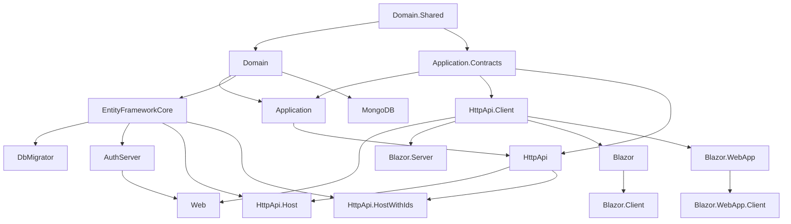
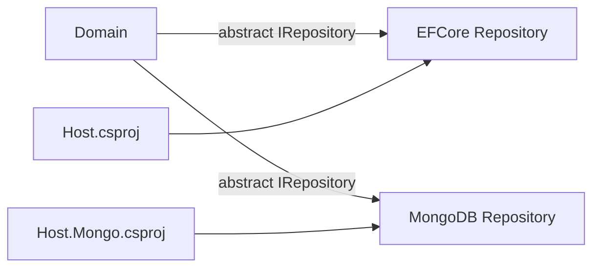

When you generate a new ABP Framework solution — either from the CLI or from ABP Studio — you do not get one project; you get a small constellation of projects, each owning one layer of the DDD pyramid plus the hosts that wire it up to a transport. This page is a tour of those project layouts based directly on the canonical templates checked into the `templates/` directory: `templates/app/aspnet-core/`, `templates/app-nolayers/aspnet-core/`, `templates/console/`, and `templates/module/aspnet-core/`. It also explains the three solution-manifest file formats (`.slnx`, `.abpsln`, `.abpmdl`) that ABP solutions use today.

## The canonical layered solution (`templates/app/aspnet-core/`)

The default template is the most opinionated. It scaffolds a full DDD layering plus AuthServer, MVC, Blazor (Server/WebApp/WebAssembly), tiered variants, and a console DB migrator. The slnx file at `templates/app/aspnet-core/MyCompanyName.MyProjectName.slnx` enumerates every project; the source projects live under `templates/app/aspnet-core/src/` and the test projects under `templates/app/aspnet-core/test/`.



The 22 projects scaffolded by this template are:

| Project (under `templates/app/aspnet-core/src/`) | Role |
| --- | --- |
| `MyCompanyName.MyProjectName.Domain.Shared/` | Enums, constants, error codes, language settings shared by every other project. No business logic. |
| `MyCompanyName.MyProjectName.Domain/` | Aggregates, value objects, domain services, repository interfaces, domain event handlers. References `Domain.Shared` and `Volo.Abp.Ddd.Domain`. |
| `MyCompanyName.MyProjectName.Application.Contracts/` | DTOs, application service **interfaces**, permission definitions, feature definitions. Safe to ship to clients. |
| `MyCompanyName.MyProjectName.Application/` | Application service **implementations** built on `ApplicationService` from `framework/src/Volo.Abp.Ddd.Application/Volo/Abp/Application/Services/ApplicationService.cs`. |
| `MyCompanyName.MyProjectName.EntityFrameworkCore/` | `DbContext`, EF Core repositories, model-builder configuration, migrations. |
| `MyCompanyName.MyProjectName.MongoDB/` | Optional MongoDB repositories implementing the same contracts as the EF project. |
| `MyCompanyName.MyProjectName.DbMigrator/` | Console host that applies pending migrations and seeds initial data via `IDataSeeder`. |
| `MyCompanyName.MyProjectName.HttpApi/` | Auto-generated controllers that expose application services as REST endpoints. |
| `MyCompanyName.MyProjectName.HttpApi.Client/` | Static C# proxies generated against `HttpApi`, packaged for downstream consumption. |
| `MyCompanyName.MyProjectName.HttpApi.Host/` | Stand-alone API gateway host. Tiered deployments expose this separately. |
| `MyCompanyName.MyProjectName.HttpApi.HostWithIds/` | Combined API + AuthServer host for single-host tiered installs. |
| `MyCompanyName.MyProjectName.AuthServer/` | OpenIddict-backed authorisation server. |
| `MyCompanyName.MyProjectName.Web/` | MVC / Razor Pages UI (the historical default). |
| `MyCompanyName.MyProjectName.Web.Host/` | Tiered MVC host that consumes the API over HTTP rather than referencing `Application` directly. |
| `MyCompanyName.MyProjectName.Blazor/` | Blazor WebAssembly client (legacy template). |
| `MyCompanyName.MyProjectName.Blazor.Client/` | InteractiveWebAssembly client assembly used by the unified Web App. |
| `MyCompanyName.MyProjectName.Blazor.Server/` | Blazor Server host. |
| `MyCompanyName.MyProjectName.Blazor.Server.Tiered/` | Tiered Blazor Server (separate AuthServer + HttpApi.Host). |
| `MyCompanyName.MyProjectName.Blazor.WebApp/` | Blazor Web App host (.NET 8+ unified server + client render modes). |
| `MyCompanyName.MyProjectName.Blazor.WebApp.Client/` | Web App client assembly. |
| `MyCompanyName.MyProjectName.Blazor.WebApp.Tiered/` | Tiered Web App host. |
| `MyCompanyName.MyProjectName.Blazor.WebApp.Tiered.Client/` | Tiered Web App client assembly. |

<Tip>
When the CLI generates a solution, it removes the host variants you didn't ask for. So a typical solution on disk has either MVC **or** one of the Blazor variants, not all of them at once. The fact that every variant is checked in here is exactly what allows `build/build-all.ps1` to verify the entire matrix in CI.
</Tip>

### Project references inside the layered template

`MyCompanyName.MyProjectName.Application.csproj` references `MyCompanyName.MyProjectName.Application.Contracts.csproj` and `MyCompanyName.MyProjectName.Domain.csproj` and `Volo.Abp.Ddd.Application` (from `framework/src/Volo.Abp.Ddd.Application/`). `MyCompanyName.MyProjectName.HttpApi.csproj` references `MyCompanyName.MyProjectName.Application.Contracts.csproj` plus `Volo.Abp.AspNetCore.Mvc` (from `framework/src/Volo.Abp.AspNetCore.Mvc/`). `MyCompanyName.MyProjectName.EntityFrameworkCore.csproj` references `MyCompanyName.MyProjectName.Domain.csproj` plus `Volo.Abp.EntityFrameworkCore`. The hosts (`HttpApi.Host`, `AuthServer`, `Web`, `Blazor.*`) reference whichever combination of `Application`, `HttpApi`, `EntityFrameworkCore`, and `HttpApi.Client` they need.

### Test projects

`templates/app/aspnet-core/test/` ships matching `*.Tests` and `TestBase` projects:

- `MyCompanyName.MyProjectName.Domain.Tests/`
- `MyCompanyName.MyProjectName.Application.Tests/`
- `MyCompanyName.MyProjectName.EntityFrameworkCore.Tests/`
- `MyCompanyName.MyProjectName.MongoDB.Tests/`
- `MyCompanyName.MyProjectName.HttpApi.Client.ConsoleTestApp/`
- `MyCompanyName.MyProjectName.TestBase/`

These projects are auto-flagged with `<IsTestProject>true</IsTestProject>` by the repo's `Directory.Build.props`, which then injects `coverlet.collector`.

## The no-layers solution (`templates/app-nolayers/aspnet-core/`)

For teams that don't want to start with a full DDD pyramid, ABP ships a "no-layers" template. The slnx (`templates/app-nolayers/aspnet-core/MyCompanyName.MyProjectName.slnx`) is much smaller because everything lives in a single project per host variant:

```xml
<!-- templates/app-nolayers/aspnet-core/MyCompanyName.MyProjectName.slnx -->
<Solution>
  <Project Path="MyCompanyName.MyProjectName.Blazor.Server.Mongo/MyCompanyName.MyProjectName.Blazor.Server.Mongo.csproj" />
  <Project Path="MyCompanyName.MyProjectName.Blazor.Server/MyCompanyName.MyProjectName.Blazor.Server.csproj" />
  <Project Path="MyCompanyName.MyProjectName.Blazor.WebAssembly/Client/MyCompanyName.MyProjectName.Blazor.WebAssembly.Client.csproj" />
  <Project Path="MyCompanyName.MyProjectName.Blazor.WebAssembly/Server.Mongo/MyCompanyName.MyProjectName.Blazor.WebAssembly.Server.Mongo.csproj" />
  <Project Path="MyCompanyName.MyProjectName.Blazor.WebAssembly/Server/MyCompanyName.MyProjectName.Blazor.WebAssembly.Server.csproj" />
  <Project Path="MyCompanyName.MyProjectName.Blazor.WebAssembly/Shared/MyCompanyName.MyProjectName.Blazor.WebAssembly.Shared.csproj" />
  <Project Path="MyCompanyName.MyProjectName.Host.Mongo/MyCompanyName.MyProjectName.Host.Mongo.csproj" />
  <Project Path="MyCompanyName.MyProjectName.Host/MyCompanyName.MyProjectName.Host.csproj" />
  <Project Path="MyCompanyName.MyProjectName.Mvc.Mongo/MyCompanyName.MyProjectName.Mvc.Mongo.csproj" />
  <Project Path="MyCompanyName.MyProjectName.Mvc/MyCompanyName.MyProjectName.Mvc.csproj" />
</Solution>
```

The projects sit directly inside `templates/app-nolayers/aspnet-core/`:

| Project | Role |
| --- | --- |
| `MyCompanyName.MyProjectName.Mvc/` | Single-project MVC app (EF Core). All layers in one assembly. |
| `MyCompanyName.MyProjectName.Mvc.Mongo/` | Same but uses MongoDB. |
| `MyCompanyName.MyProjectName.Host/` | Headless API host (EF Core). |
| `MyCompanyName.MyProjectName.Host.Mongo/` | Headless API host (MongoDB). |
| `MyCompanyName.MyProjectName.Blazor.Server/` | Blazor Server flat host (EF Core). |
| `MyCompanyName.MyProjectName.Blazor.Server.Mongo/` | Blazor Server flat host (MongoDB). |
| `MyCompanyName.MyProjectName.Blazor.WebAssembly/Client/` | WASM client. |
| `MyCompanyName.MyProjectName.Blazor.WebAssembly/Server/` | WASM server host (EF Core). |
| `MyCompanyName.MyProjectName.Blazor.WebAssembly/Server.Mongo/` | WASM server host (MongoDB). |
| `MyCompanyName.MyProjectName.Blazor.WebAssembly/Shared/` | Shared DTOs between client and server. |

There is also a helper script `templates/app-nolayers/aspnet-core/migrate-database.ps1` that runs EF migrations and seeds in one step (no separate `DbMigrator` project).

<Warning>
The no-layers template is suitable for small applications and prototypes. Once a system has multiple bounded contexts or needs distinct deployment artefacts (separate AuthServer, separate HttpApi.Host), promote it to the full layered template instead of stretching the flat layout.
</Warning>

## The console template (`templates/console/`)

The console template scaffolds a single console project that boots ABP via `Host.CreateApplicationBuilder` and `AbpApplicationFactory`. The slnx (`templates/console/MyCompanyName.MyProjectName.slnx`) references just one project.

```
templates/console/
├── MyCompanyName.MyProjectName.slnx
├── common.props
└── src/
    └── MyCompanyName.MyProjectName/
        ├── HelloWorldService.cs
        ├── MyCompanyName.MyProjectName.csproj
        ├── MyProjectNameHostedService.cs
        ├── MyProjectNameModule.cs
        ├── Program.cs
        ├── Properties/
        └── appsettings.json
```

The module declaration is intentionally minimal — it only depends on `AbpAutofacModule` so the application picks up Autofac-based DI and dynamic-proxy interception:

```csharp
// templates/console/src/MyCompanyName.MyProjectName/MyProjectNameModule.cs
using Volo.Abp;
using Volo.Abp.Autofac;
using Volo.Abp.Modularity;

namespace MyCompanyName.MyProjectName;

[DependsOn(
    typeof(AbpAutofacModule)
)]
public class MyProjectNameModule : AbpModule
{
    public override Task OnApplicationInitializationAsync(ApplicationInitializationContext context)
    {
        var logger = context.ServiceProvider.GetRequiredService<ILogger<MyProjectNameModule>>();
        var configuration = context.ServiceProvider.GetRequiredService<IConfiguration>();
        logger.LogInformation($"MySettingName => {configuration["MySettingName"]}");
        return Task.CompletedTask;
    }
}
```

`Program.cs` wires Serilog, calls `builder.ConfigureContainer(builder.Services.AddAutofacServiceProviderFactory())`, registers `MyProjectNameHostedService`, then defers to ABP for module bootstrapping. Use this template when you need a worker process, CLI tool, or scheduled job runner without a web host.

## The module template (`templates/module/aspnet-core/`)

The module template generates a re-distributable ABP module exactly like the ones under `modules/<name>/`. It has four sub-directories:

```
templates/module/aspnet-core/
├── MyCompanyName.MyProjectName.abpmdl    # ABP Studio module manifest
├── MyCompanyName.MyProjectName.abpsln    # ABP Studio solution manifest
├── MyCompanyName.MyProjectName.sln.DotSettings
├── MyCompanyName.MyProjectName.slnx
├── NuGet.Config
├── common.props
├── database/                              # EF migration project (consumer's responsibility)
├── docker-compose.yml
├── docker-compose.override.yml
├── docker-compose.migrations.yml
├── host/                                  # Sample hosts for the module's UI
├── src/                                   # The module itself (re-shippable layers)
└── test/                                  # Module-specific test projects
```

### `templates/module/aspnet-core/src/` — the redistributable layers

| Project | Notes |
| --- | --- |
| `MyCompanyName.MyProjectName.Domain.Shared/` | Constants / consts. |
| `MyCompanyName.MyProjectName.Domain/` | Aggregates + repositories. |
| `MyCompanyName.MyProjectName.Application.Contracts/` | DTO + service contracts. |
| `MyCompanyName.MyProjectName.Application/` | Service implementations. |
| `MyCompanyName.MyProjectName.HttpApi/` | Auto-API controllers. |
| `MyCompanyName.MyProjectName.HttpApi.Client/` | Static C# proxies. |
| `MyCompanyName.MyProjectName.EntityFrameworkCore/` | EF DbContext + migrations. |
| `MyCompanyName.MyProjectName.MongoDB/` | MongoDB repos. |
| `MyCompanyName.MyProjectName.Web/` | MVC UI. |
| `MyCompanyName.MyProjectName.Blazor/` | Shared Blazor UI. |
| `MyCompanyName.MyProjectName.Blazor.Server/` | Blazor Server variant. |
| `MyCompanyName.MyProjectName.Blazor.WebAssembly/` | Blazor WebAssembly variant. |
| `MyCompanyName.MyProjectName.Blazor.WebAssembly.Bundling/` | WebAssembly bundling project. |
| `MyCompanyName.MyProjectName.Installer/` | Aggregator NuGet — consumers add **one** package and inherit everything. |

### `templates/module/aspnet-core/host/` — sample hosts

These hosts run the module in isolation for local development and demos:

| Project | Role |
| --- | --- |
| `MyCompanyName.MyProjectName.AuthServer/` | OpenIddict-backed local AuthServer. |
| `MyCompanyName.MyProjectName.HttpApi.Host/` | API host that exposes the module's services. |
| `MyCompanyName.MyProjectName.Web.Host/` | MVC host. |
| `MyCompanyName.MyProjectName.Web.Unified/` | Single-host (MVC + API + AuthServer) variant. |
| `MyCompanyName.MyProjectName.Blazor.Host/` | Blazor WebAssembly host. |
| `MyCompanyName.MyProjectName.Blazor.Host.Client/` | WebAssembly client. |
| `MyCompanyName.MyProjectName.Blazor.Server.Host/` | Blazor Server host. |
| `MyCompanyName.MyProjectName.Host.Shared/` | Shared host helpers. |

### `templates/module/aspnet-core/test/` — module tests

| Project | Role |
| --- | --- |
| `MyCompanyName.MyProjectName.TestBase/` | Common test-base config. |
| `MyCompanyName.MyProjectName.Domain.Tests/` | Domain unit tests. |
| `MyCompanyName.MyProjectName.Application.Tests/` | Application service tests. |
| `MyCompanyName.MyProjectName.EntityFrameworkCore.Tests/` | EF integration tests. |
| `MyCompanyName.MyProjectName.MongoDB.Tests/` | MongoDB integration tests. |
| `MyCompanyName.MyProjectName.HttpApi.Client.ConsoleTestApp/` | Manual test client. |

## Solution-manifest file formats

ABP solutions today carry up to three manifest formats side-by-side:

<CardGroup cols={3}>
  <Card title=".slnx" icon="file-code">
    The new XML-based .NET solution format. Pure list of project paths in `<Project Path=... />` form. Loaded by `dotnet build`, Rider, Visual Studio 2022 17.10+, and CI. Example: `framework/Volo.Abp.slnx`.
  </Card>
  <Card title=".abpsln" icon="file-lines">
    JSON solution manifest understood by ABP Studio. Points to one or more `.abpmdl` files. Example: `framework/Volo.Abp.abpsln`.
  </Card>
  <Card title=".abpmdl" icon="folder-tree">
    JSON module manifest used by ABP Studio. Groups packages into folders (e.g. `src`, `test`) and references each `.abppkg` file. Example: `framework/Volo.Abp.abpmdl`.
  </Card>
</CardGroup>

### `.slnx`

`framework/Volo.Abp.slnx` is the .NET-native format. Excerpt:

```xml
<Solution>
  <Folder Name="/src/">
    <Project Path="src/Volo.Abp.AI.Abstractions/Volo.Abp.AI.Abstractions.csproj" />
    <Project Path="src/Volo.Abp.AI/Volo.Abp.AI.csproj" />
    <Project Path="src/Volo.Abp.AspNetCore.Mvc/Volo.Abp.AspNetCore.Mvc.csproj" />
    ...
  </Folder>
</Solution>
```

### `.abpsln`

`framework/Volo.Abp.abpsln` is ABP Studio's solution descriptor. It is just JSON:

```json
{
  "template": "empty",
  "modules": {
    "Volo.Abp": {
      "path": "Volo.Abp.abpmdl"
    }
  },
  "id": "9f9e3d5f-6a9a-4b00-ac5a-746c65981918"
}
```

A solution can reference multiple `.abpmdl` files; that's how ABP Studio shows the framework and several modules side-by-side. The `template` field selects the starting template (`empty`, `app`, `app-nolayers`, `module`, etc.).

### `.abpmdl`

`framework/Volo.Abp.abpmdl` groups packages into folders. Excerpt:

```json
{
  "folders": {
    "items": {
      "test": {},
      "src": {}
    }
  },
  "packages": {
    "Volo.Abp.AspNetCore": {
      "path": "src/Volo.Abp.AspNetCore/Volo.Abp.AspNetCore.abppkg",
      "folder": "src"
    },
    "Volo.Abp.AspNetCore.Tests": {
      "path": "test/Volo.Abp.AspNetCore.Tests/Volo.Abp.AspNetCore.Tests.abppkg",
      "folder": "test"
    },
    ...
  }
}
```

Each `*.abppkg` file lives next to the matching `.csproj`. They carry ABP-specific metadata that Studio uses to render module diagrams and lifecycle annotations. `common.props` in `templates/console/common.props` and `templates/app/aspnet-core/common.props` activates the central package versions and the version property for the generated solution.

## Database options and host variants

Most ABP templates can be flipped between EF Core and MongoDB at generation time. The mechanism is two parallel projects (e.g. `MyCompanyName.MyProjectName.EntityFrameworkCore` and `MyCompanyName.MyProjectName.MongoDB`) implementing the same repository contracts. The host then references whichever one matches the `-d` switch the CLI was invoked with. In `templates/app-nolayers/aspnet-core/` this becomes per-host pairs: `MyCompanyName.MyProjectName.Mvc/` vs `MyCompanyName.MyProjectName.Mvc.Mongo/`, `Host/` vs `Host.Mongo/`, `Blazor.Server/` vs `Blazor.Server.Mongo/`.



For Blazor specifically, the template offers three render-model variants because Blazor Server, Blazor WebAssembly, and Blazor Web App differ in hosting model. The `templates/app/aspnet-core/src/` directory therefore contains nine Blazor-related projects (the `Tiered` variants split AuthServer + API + UI). The `templates/module/aspnet-core/src/` directory contains four — the smaller set sufficient for module-internal UI.

## Choosing a layout

<Steps>
  <Step title="Layered app (default)">
    Use when you expect non-trivial business logic, multiple deployable hosts, microservice splits, or strict layering reviews. Start from `templates/app/aspnet-core/`.
  </Step>
  <Step title="No-layers app">
    Use for small CRUDs, MVPs, internal admin tools. Start from `templates/app-nolayers/aspnet-core/`. Promote to layered if you outgrow it.
  </Step>
  <Step title="Module">
    Use when you ship a reusable feature — for example a customer-built equivalent of `modules/cms-kit/`. Start from `templates/module/aspnet-core/`.
  </Step>
  <Step title="Console">
    Use for headless workers and CLI tools that still want DI, configuration, modules, settings, background workers. Start from `templates/console/`.
  </Step>
  <Step title="MAUI / WPF">
    Use for desktop and mobile front-ends that consume an existing API. Start from `templates/maui/src/MyCompanyName.MyProjectName/` or `templates/wpf/src/MyCompanyName.MyProjectName/` and have them reference `MyCompanyName.MyProjectName.HttpApi.Client/` for typed proxies.
  </Step>
</Steps>

Whichever layout you pick, the underlying contract is identical: every host references a `MyProjectNameModule : AbpModule` class that declares its dependencies with `[DependsOn]`, and `AbpApplicationBase` (from `framework/src/Volo.Abp.Core/Volo/Abp/AbpApplicationBase.cs`) discovers the graph and orchestrates the rest.
