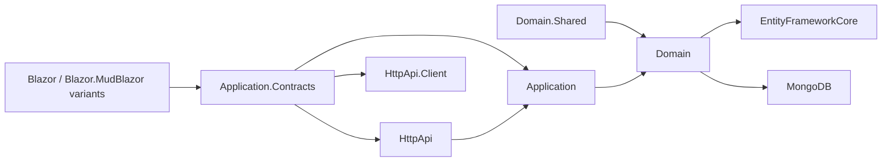
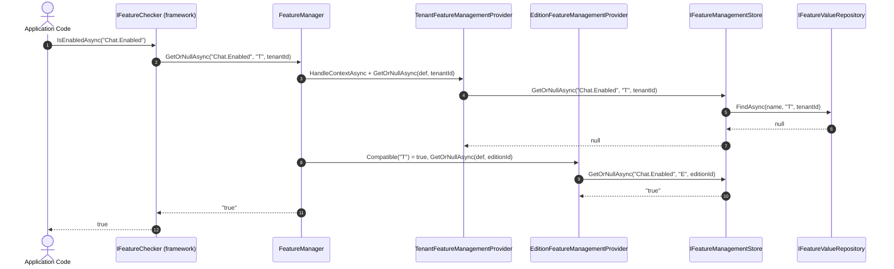

The **Feature Management module** is how ABP Framework turns compile-time `FeatureDefinition`s — defined in `Volo.Abp.Features` — into runtime, edition-scoped and tenant-scoped toggles that admins can flip from a UI. Like its siblings Permission and Setting Management, it overrides the framework's default in-memory store with a persisted one, exposes a chain of `IFeatureManagementProvider`s, and ships an admin app service plus Razor / Blazor management modals. Source lives under `modules/feature-management/src`.

## Module map



There is no `Web` package in this module — feature management is exposed only through Razor-rendered modals embedded in tenant or edition pages, plus the Blazor components.

## The `FeatureValue` entity

`Volo.Abp.FeatureManagement.FeatureValue : Entity<Guid>, IAggregateRoot<Guid>` is the storage row:

```csharp
public class FeatureValue : Entity<Guid>, IAggregateRoot<Guid>
{
    [NotNull]  public virtual string Name         { get; protected set; }
    [NotNull]  public virtual string Value        { get; internal set; }
    [NotNull]  public virtual string ProviderName { get; protected set; }
    [CanBeNull] public virtual string ProviderKey  { get; protected set; }
}
```

Note that `ProviderName` is `[NotNull]` here whereas the corresponding `Setting.ProviderName` is `[CanBeNull]` — every feature value is scoped to a specific provider (`Edition` or `Tenant`), there is no host-wide "global" provider.

The repository contract `IFeatureValueRepository : IBasicRepository<FeatureValue, Guid>` exposes the usual lookups plus a destructive helper:

```csharp
Task<FeatureValue>          FindAsync(string name, string providerName, string providerKey, ...);
Task<List<FeatureValue>>    FindAllAsync(string name, string providerName, string providerKey, ...);
Task<List<FeatureValue>>    GetListAsync(string providerName, string providerKey, ...);
Task                        DeleteAsync(string providerName, string providerKey, ...);
```

`FindAllAsync` differs from `FindAsync` in that it returns *every* feature value with the given name across all `ProviderKey`s — used by the management UI to show, for example, all editions that override a specific feature.

## `IFeatureManagementStore` — replacing the framework default

`Volo.Abp.FeatureManagement.IFeatureManagementStore` is the minimal contract:

```csharp
public interface IFeatureManagementStore
{
    Task<string> GetOrNullAsync(string name, string providerName, string providerKey);
    Task         SetAsync(string name, string value, string providerName, string providerKey);
    Task         DeleteAsync(string name, string providerName, string providerKey);
}
```

`FeatureManagementStore : IFeatureManagementStore, ITransientDependency` implements it on top of `IFeatureValueRepository` and a cache. Like its setting cousin, every public method is `[UnitOfWork]`:

```csharp
[UnitOfWork]
public virtual async Task<string> GetOrNullAsync(string name, string providerName, string providerKey)
{
    var cacheItem = await GetCacheItemAsync(name, providerName, providerKey);
    return cacheItem.Value;
}

[UnitOfWork]
public virtual async Task SetAsync(string name, string value, string providerName, string providerKey)
{
    var featureValue = await FeatureValueRepository.FindAsync(name, providerName, providerKey);
    if (featureValue == null)
    {
        featureValue = new FeatureValue(GuidGenerator.Create(), name, value, providerName, providerKey);
        await FeatureValueRepository.InsertAsync(featureValue, true);
    }
    else
    {
        featureValue.Value = value;
        await FeatureValueRepository.UpdateAsync(featureValue, true);
    }
}
```

`FeatureStore : IFeatureStore` is the bridge that satisfies the framework's `Volo.Abp.Features.IFeatureStore` contract by delegating to `IFeatureManagementStore.GetOrNullAsync`. The companion `FeatureValueCacheItemInvalidator` listens for `EntityChangedEventData<FeatureValue>` and busts the cache.

## Provider chain

`Volo.Abp.FeatureManagement.IFeatureManagementProvider` is wider than its setting and permission cousins because it has to deal with edition-tenant inheritance:

```csharp
public interface IFeatureManagementProvider
{
    string Name { get; }
    bool    Compatible(string providerName);
    Task<IAsyncDisposable> HandleContextAsync(string providerName, string providerKey);
    Task<string> GetOrNullAsync(FeatureDefinition feature, string providerKey);
    Task         SetAsync   (FeatureDefinition feature, string value, string providerKey);
    Task         ClearAsync (FeatureDefinition feature, string providerKey);
}
```

`Compatible(string providerName)` lets a provider claim that it can answer queries for *other* providers. `HandleContextAsync` lets a provider mutate ambient state for the duration of a check — for instance, to swap `ICurrentTenant`.

`FeatureManagementProvider` is the abstract base. Its `Compatible` returns `providerName == Name`, its `HandleContextAsync` returns `NullAsyncDisposable.Instance`, and its `GetOrNullAsync` / `SetAsync` / `ClearAsync` delegate to `Store` with `await NormalizeProviderKeyAsync(providerKey)`. Four concrete providers are registered by `AbpFeatureManagementDomainModule.ConfigureServices`:

```csharp
Configure<FeatureManagementOptions>(options =>
{
    options.Providers.Add<DefaultValueFeatureManagementProvider>();
    options.Providers.Add<ConfigurationFeatureManagementProvider>();
    options.Providers.Add<EditionFeatureManagementProvider>();
    options.Providers.Add<TenantFeatureManagementProvider>();
    options.ProviderPolicies[TenantFeatureValueProvider.ProviderName] = "AbpTenantManagement.Tenants.ManageFeatures";
});
```

<CardGroup cols={2}>
  <Card title="DefaultValueFeatureManagementProvider" icon="rotate-left">
    `Name => DefaultValueFeatureValueProvider.ProviderName`. Returns `feature.DefaultValue`. `SetAsync` / `ClearAsync` throw because the default is compile-time.
  </Card>
  <Card title="ConfigurationFeatureManagementProvider" icon="file-code">
    Reads from `IConfiguration` — useful for environment-specific overrides without a database write.
  </Card>
  <Card title="EditionFeatureManagementProvider" icon="layer-group">
    `Name => EditionFeatureValueProvider.ProviderName`. `Compatible` returns true for both `Tenant` and `Edition` providers — when answering a tenant query it walks `ITenantStore.FindAsync(tenantId)` to discover the tenant's `EditionId` and re-runs the lookup against the edition.
  </Card>
  <Card title="TenantFeatureManagementProvider" icon="building">
    `Name => TenantFeatureValueProvider.ProviderName`. `HandleContextAsync(providerName, providerKey)` calls `CurrentTenant.Change(Guid.Parse(providerKey))` so the right tenant scope is active for the call. `NormalizeProviderKeyAsync` falls back to `CurrentTenant.Id?.ToString()` when the key is null.
  </Card>
</CardGroup>

The `ProviderPolicies` mapping in `FeatureManagementOptions` requires the caller to hold `"AbpTenantManagement.Tenants.ManageFeatures"` to manage tenant features — a hint that the tenant-management module owns the UI entry point.

```csharp
public class FeatureManagementOptions
{
    public ITypeList<IFeatureManagementProvider> Providers { get; }
    public Dictionary<string, string>            ProviderPolicies { get; }
    public bool SaveStaticFeaturesToDatabase     { get; set; } = true;
    public bool IsDynamicFeatureStoreEnabled     { get; set; } = false;
}
```

The dynamic / static flags follow the same `IsDataMigrationEnvironment` short-circuit as the other PSF modules.

## `FeatureManager` — the public API

`Volo.Abp.FeatureManagement.FeatureManager : IFeatureManager, ISingletonDependency` is constructed with `IOptions<FeatureManagementOptions>`, `IServiceProvider`, `IFeatureDefinitionManager` and `IStringLocalizerFactory`. Providers are resolved lazily into a `List<IFeatureManagementProvider>` from `Options.Providers`. The manager walks the chain top-down:

- `GetOrNullAsync(string name, string providerName, string providerKey, bool fallback = true)` invokes `HandleContextAsync` on the matching provider, calls `GetOrNullAsync` on each compatible provider, and falls back through the chain when `fallback == true`.
- `SetAsync(string name, string value, string providerName, string providerKey, bool forceToSet = false)` finds the right provider, validates the value through `feature.ValueType.Validator` and writes via `IFeatureManagementProvider.SetAsync`. The `forceToSet` flag bypasses the "equals default" optimization that would otherwise call `ClearAsync` instead of `SetAsync`.

The extension classes `EditionFeatureManagerExtensions`, `TenantFeatureManagerExtensions`, `DefaultValueFeatureManagerExtensions` and `ConfigurationValueFeatureManagerExtensions` provide typed `GetForEditionAsync`, `GetForTenantAsync`, `SetForEditionAsync`, `SetForTenantAsync` shortcuts.

## Dynamic store

`StaticFeatureSaver : IStaticFeatureSaver` writes the in-memory `FeatureDefinition` graph to `FeatureDefinitionRecord` and `FeatureGroupDefinitionRecord` rows under a distributed lock so microservices can share a feature catalogue. `DynamicFeatureDefinitionStore` reads them back into `DynamicFeatureDefinitionStoreInMemoryCache`. `StaticFeatureDefinitionChangedEventHandler` invalidates the cache on the distributed event bus. `FeatureDynamicInitializer` runs from `AbpFeatureManagementDomainModule.OnApplicationInitializationAsync` to perform the initial save.

## Application layer

`Volo.Abp.FeatureManagement.FeatureAppService : FeatureManagementAppServiceBase, IFeatureAppService` is `[Authorize]` at the class level and exposes:

```csharp
Task<GetFeatureListResultDto> GetAsync(string providerName, string providerKey);
Task                          UpdateAsync(string providerName, string providerKey, UpdateFeaturesDto input);
Task                          DeleteAsync(string providerName, string providerKey);
```

`CheckProviderPolicy(providerName, providerKey)` is called at the top of every method and looks up the required policy in `FeatureManagementOptions.ProviderPolicies` — for example the `Tenant` provider key maps to `"AbpTenantManagement.Tenants.ManageFeatures"`.

`GetAsync` builds a `GetFeatureListResultDto { Groups: List<FeatureGroupDto> }`. For each group from `IFeatureDefinitionManager.GetGroupsAsync()`, it enumerates `group.GetFeaturesWithChildren()` and emits a `FeatureDto`:

```csharp
public class FeatureDto
{
    public string             Name        { get; set; }
    public string             DisplayName { get; set; }
    public string             Value       { get; set; }
    public FeatureProviderDto Provider    { get; set; }
    public string             Description { get; set; }
    public IStringValueType   ValueType   { get; set; }
    public int                Depth       { get; set; }
    public string             ParentName  { get; set; }
}
```

The skip logic — `if (providerName == TenantFeatureValueProvider.ProviderName && CurrentTenant.Id == null && providerKey == null && !featureDefinition.IsAvailableToHost) continue;` — is what prevents tenant-only features from appearing on the host page.

`UpdateAsync` walks `input.Features : UpdateFeatureDto[]` (each `{ Name, Value }`), validates against `feature.ValueType.Validator`, and forwards to `FeatureManager.SetAsync`. `DeleteAsync` calls `FeatureManager.DeleteAsync(providerName, providerKey)` to clear all feature values for the subject.

`FeaturePermissionDefinitionProvider` registers a single permission `FeatureManagementPermissions.ManageHostFeatures = "FeatureManagement.ManageHostFeatures"` for the host-side features page.

## HTTP API

`FeaturesController : AbpControllerBase, IFeatureAppService` is decorated:

```csharp
[RemoteService(Name = FeatureManagementRemoteServiceConsts.RemoteServiceName)]
[Area(FeatureManagementRemoteServiceConsts.ModuleName)]
[Route("api/feature-management/features")]
```

The three methods map to `[HttpGet]`, `[HttpPut]` and `[HttpDelete]` against the same route, each forwarding to `IFeatureAppService`.

## Persistence

`Volo.Abp.FeatureManagement.EntityFrameworkCore.FeatureManagementDbContext` declares `DbSet<FeatureValue>`, `DbSet<FeatureDefinitionRecord>` and `DbSet<FeatureGroupDefinitionRecord>`. `AbpFeatureManagementEntityFrameworkCoreModule.ConfigureServices` wires the repositories:

```csharp
context.Services.AddAbpDbContext<FeatureManagementDbContext>(options =>
{
    options.AddRepository<FeatureGroupDefinitionRecord, EfCoreFeatureGroupDefinitionRecordRepository>();
    options.AddRepository<FeatureDefinitionRecord, EfCoreFeatureDefinitionRecordRepository>();
    options.AddDefaultRepositories<IFeatureManagementDbContext>();
    options.AddRepository<FeatureValue, EfCoreFeatureValueRepository>();
});
```

`EfCoreFeatureValueRepository : EfCoreRepository<IFeatureManagementDbContext, FeatureValue, Guid>, IFeatureValueRepository` implements the contract — `FindAsync` runs the canonical `FirstOrDefaultAsync(s => s.Name == name && s.ProviderName == providerName && s.ProviderKey == providerKey)`.

The MongoDB provider mirrors the EF Core shape: `FeatureManagementMongoDbContext` exposes `IMongoCollection<FeatureValue>` and friends; `MongoFeatureValueRepository : MongoDbRepository<IFeatureManagementMongoDbContext, FeatureValue, Guid>, IFeatureValueRepository` implements the same operations.

## Blazor UI

There is no dedicated Razor-Pages management page — feature management lives inside the tenant-management UI (for tenants) and inside the edition-management UI (for editions). Both flavors share a modal:

`Volo.Abp.FeatureManagement.Blazor/Components/FeatureManagementModal.razor.cs` is the Blazorise modal:

- Public method `OpenAsync(string providerName, string providerKey)` — invoked from the tenant or edition list page.
- Inner state: `Groups : List<FeatureGroupDto>`, `SelectedGroup` and a `Dictionary<string, IStringValueType>` keyed by feature name.
- The modal renders one `FeatureSettingManagementComponent.razor` per group, which projects a `FeatureSettingViewModel` containing `Name`, `Value`, `OriginalValue` and the `ValueType.Validator`.

`Volo.Abp.FeatureManagement.Blazor.MudBlazor/Components/FeatureManagementModal.razor.cs` is the MudBlazor twin with the same logic and a MudBlazor-style chrome.

Both packages register their components through `AbpFeatureManagementComponentBase` and inject the proxy generated for `IFeatureAppService`.

## End-to-end flow



The chain walks **Tenant → Edition → Configuration → Default** until something non-null is returned, mirroring the precedence model documented in `Volo.Abp.Features` but with database-backed Tenant and Edition layers.

## Where to extend

<AccordionGroup>
  <Accordion title="Add a feature group to the admin modal" icon="window-restore">
    Implement `IFeatureDefinitionProvider` in your module; the modal automatically picks the new group up because `FeatureAppService.GetAsync` enumerates `IFeatureDefinitionManager.GetGroupsAsync()`.
  </Accordion>
  <Accordion title="Add a custom provider" icon="plug">
    Subclass `FeatureManagementProvider`, register it as `[ITransientDependency]` and add it to `FeatureManagementOptions.Providers`. Override `Compatible` and `HandleContextAsync` if your provider needs to swap ambient state.
  </Accordion>
  <Accordion title="Replace the store" icon="database">
    Replace `IFeatureManagementStore` via `services.Replace(ServiceDescriptor.Transient<IFeatureManagementStore, MyStore>())`. The cache invalidator only depends on the `FeatureValue` entity, so your replacement must keep writing those rows for the cache busts to work.
  </Accordion>
</AccordionGroup>

## HTTP API and remote constants

`FeatureManagementRemoteServiceConsts.RemoteServiceName = "AbpFeatureManagement"` and `.ModuleName = "abpFeatureManagement"` are the values bound to `[RemoteService(Name = ...)]` and `[Area]` on `FeaturesController`. `Volo.Abp.FeatureManagement.HttpApi.Client` ships a generated typed proxy for `IFeatureAppService` so microservices can read or write feature values across services.

`FeaturePermissionDefinitionProvider` declares a single permission `FeatureManagementPermissions.ManageHostFeatures` for the host-side editing entry point. The tenant-side feature management uses `AbpTenantManagement.Tenants.ManageFeatures` (from the Tenant Management module) instead — that mapping is wired through `FeatureManagementOptions.ProviderPolicies[TenantFeatureValueProvider.ProviderName]`.

## Persistence constants

`AbpFeatureManagementDbProperties.ConnectionStringName = "AbpFeatureManagement"` and `DbTablePrefix = "Abp"` follow the standard ABP naming convention. The EF Core context's table layout is:

| Table | Aggregate / record |
| --- | --- |
| `AbpFeatures` | `FeatureDefinitionRecord` |
| `AbpFeatureGroups` | `FeatureGroupDefinitionRecord` |
| `AbpFeatureValues` | `FeatureValue` |

`FeatureDefinitionRecord` and `FeatureGroupDefinitionRecord` are how the dynamic store mirrors the in-memory definition graph; `FeatureValue` is the editable per-edition / per-tenant value.

## Module bootstrap recap

A solution wires feature management with the standard module set:

```csharp
[DependsOn(
    typeof(AbpFeatureManagementDomainModule),
    typeof(AbpFeatureManagementApplicationModule),
    typeof(AbpFeatureManagementHttpApiModule),
    typeof(AbpFeatureManagementEntityFrameworkCoreModule), // or .MongoDB
    typeof(AbpFeatureManagementBlazorModule)               // or .MudBlazor variant
)]
public class MyHostModule : AbpModule { }
```

Because the Tenant Management module's UI hosts the `FeatureManagementModal`, you typically end up adding both module families together in a multi-tenant solution.

See also: [Permission Mgmt](/psf/permission-management) and [Setting Mgmt](/psf/setting-management) which share the same architectural pattern with grant- and value-oriented data respectively.
