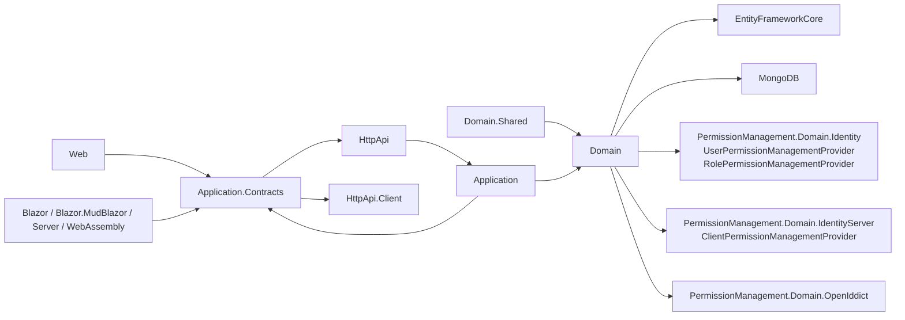
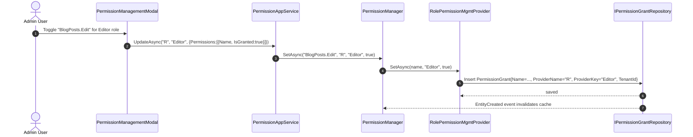

The **Permission Management module** is what turns ABP Framework's compile-time permission *definitions* into runtime *grants* that you can edit per role, per user, per client or per resource without redeploying. Its packages live under `modules/permission-management/src` and replace the framework default `IPermissionStore` (a no-op) with a fully persisted one. This page walks the module from the database row up to the Razor and Blazor management modals.

## Module map



The 16 packages are organized in three concentric rings — Domain at the core, Application + Application.Contracts in the middle, and HTTP / Web / Blazor variants on the outside. The two adapter packages (`PermissionManagement.Domain.Identity` and `PermissionManagement.Domain.IdentityServer`) supply the per-subject providers.

## The `PermissionGrant` entity

`Volo.Abp.PermissionManagement.PermissionGrant` is the storage row:

```csharp
public class PermissionGrant : Entity<Guid>, IMultiTenant
{
    public virtual Guid?  TenantId     { get; protected set; }
    public virtual string Name         { get; protected set; } // permission name
    public virtual string ProviderName { get; protected set; } // "U", "R", "C", ...
    public virtual string ProviderKey  { get; protected internal set; } // user id / role name / client id
}
```

A `(TenantId, Name, ProviderName, ProviderKey)` tuple uniquely identifies "this permission is granted to this subject in this tenant". `ResourcePermissionGrant` is the sibling entity used for resource-scoped permissions (`(ResourceName, ResourceKey, ProviderName, ProviderKey, Name)`).

The repository contract `IPermissionGrantRepository : IBasicRepository<PermissionGrant, Guid>` exposes the three lookups that the providers and store need:

```csharp
Task<PermissionGrant>       FindAsync(string name, string providerName, string providerKey, ...);
Task<List<PermissionGrant>> GetListAsync(string providerName, string providerKey, ...);
Task<List<PermissionGrant>> GetListAsync(string[] names, string providerName, string providerKey, ...);
```

`IResourcePermissionGrantRepository` mirrors the same shape but with a `ResourceName` axis.

## `PermissionStore` — replacing the framework default

`Volo.Abp.PermissionManagement.PermissionStore : IPermissionStore, ITransientDependency` overrides the default `IPermissionStore` registered by the framework's `AbpAuthorizationModule`. It is constructed with `IPermissionGrantRepository`, `IDistributedCache<PermissionGrantCacheItem>` and `IPermissionDefinitionManager`:

```csharp
public virtual async Task<bool> IsGrantedAsync(string name, string providerName, string providerKey)
{
    return (await GetCacheItemAsync(name, providerName, providerKey)).IsGranted;
}
```

`GetCacheItemAsync` constructs the cache key with `CalculateCacheKey(name, providerName, providerKey)` and falls back to `PermissionGrantRepository.GetListAsync(providerName, providerKey)` on a miss. The companion class `PermissionGrantCacheItemInvalidator` listens to `EntityChangedEventData<PermissionGrant>` and busts the relevant cache rows. `ResourcePermissionStore` is the equivalent for `IResourcePermissionStore`.

## The provider chain

`Volo.Abp.PermissionManagement.IPermissionManagementProvider` is the contract that lets multiple subject types share one `PermissionGrant` table:

```csharp
public interface IPermissionManagementProvider : ISingletonDependency
{
    string Name { get; }
    Task<PermissionValueProviderGrantInfo>          CheckAsync(string name, string providerName, string providerKey);
    Task<MultiplePermissionValueProviderGrantInfo>  CheckAsync(string[] names, string providerName, string providerKey);
    Task                                            SetAsync(string name, string providerKey, bool isGranted);
}
```

`PermissionManagementProvider` is the abstract base — it implements all three methods against `IPermissionGrantRepository` and exposes `protected GrantAsync` / `protected RevokeAsync` so subclasses can wrap them with tenant or context overrides:

```csharp
protected virtual async Task GrantAsync(string name, string providerKey)
{
    var permissionGrant = await PermissionGrantRepository.FindAsync(name, Name, providerKey);
    if (permissionGrant != null) { return; }
    permissionGrant = new PermissionGrant(GuidGenerator.Create(), name, Name, providerKey, CurrentTenant.Id);
    await PermissionGrantRepository.InsertAsync(permissionGrant, true);
}
```

The three concrete providers wired by the default solution are:

<CardGroup cols={3}>
  <Card title="UserPermissionManagementProvider" icon="user">
    In `Volo.Abp.PermissionManagement.Domain.Identity`. `Name => UserPermissionValueProvider.ProviderName` (`"U"`). Default base behavior — grants and revokes against the current tenant's user.
  </Card>
  <Card title="RolePermissionManagementProvider" icon="users">
    Also in `PermissionManagement.Domain.Identity`. `Name => RolePermissionValueProvider.ProviderName` (`"R"`). Overrides `CheckAsync(string[])` to expand a role grant to all granted permissions by joining with `IUserRoleFinder`.
  </Card>
  <Card title="ClientPermissionManagementProvider" icon="laptop-code">
    In `Volo.Abp.PermissionManagement.Domain.IdentityServer`. `Name => ClientPermissionValueProvider.ProviderName` (`"C"`). Wraps every call in `using (CurrentTenant.Change(null))` so client grants always live host-side.
  </Card>
</CardGroup>

Providers are added to the chain by registering their types in `PermissionManagementOptions.ManagementProviders`:

```csharp
public class PermissionManagementOptions
{
    public ITypeList<IPermissionManagementProvider>             ManagementProviders             { get; }
    public Dictionary<string, string>                           ProviderPolicies                { get; }
    public ITypeList<IResourcePermissionManagementProvider>     ResourceManagementProviders     { get; }
    public ITypeList<IResourcePermissionProviderKeyLookupService> ResourcePermissionProviderKeyLookupServices { get; }
    public bool SaveStaticPermissionsToDatabase { get; set; } = true;
    public bool IsDynamicPermissionStoreEnabled { get; set; }
}
```

`ProviderPolicies` maps a provider name to the policy required to *manage* it — for example, the default solution maps `"R"` to `IdentityPermissions.Roles.ManagePermissions`. The flags `SaveStaticPermissionsToDatabase` and `IsDynamicPermissionStoreEnabled` are flipped to `false` automatically when `context.Services.IsDataMigrationEnvironment()` returns true, preventing the bootstrap process from touching the database during EF migrations.

## `PermissionManager` — the public surface

`Volo.Abp.PermissionManagement.PermissionManager : IPermissionManager, ISingletonDependency` is the entry point for application code that wants to read or change grants. It is constructed with `IPermissionDefinitionManager`, `ISimpleStateCheckerManager<PermissionDefinition>`, `IPermissionGrantRepository`, the same `IDistributedCache<PermissionGrantCacheItem>` used by the store, and a `Lazy<List<IPermissionManagementProvider>>` resolved from `Options.ManagementProviders`. The key methods are:

- `GetAsync(string permissionName, string providerName, string providerKey)` returns a `PermissionWithGrantedProviders` that lists *every* provider currently granting the permission, not just the requested provider. This is what the management UI uses to show "Granted via Role".
- `GetAllAsync(string providerName, string providerKey)` walks every permission definition through `PermissionDefinitionManager.GetPermissionsAsync()` and asks each provider in the chain whether it grants that permission.
- `SetAsync(string permissionName, string providerName, string providerKey, bool isGranted)` invokes the matching provider's `SetAsync` and lets the entity-change event do the cache invalidation.

`ResourcePermissionManager` is the resource-scoped sibling.

## Static permission saver and dynamic stores

`Volo.Abp.PermissionManagement.PermissionDataSeedContributor` runs at host startup and seeds initial role grants by calling `PermissionManager.SetAsync`. `PermissionDataSeeder : IPermissionDataSeeder, ITransientDependency` lets templates create the admin grants idempotently.

`StaticPermissionSaver : IStaticPermissionSaver` persists the in-memory `IPermissionDefinitionContext` graph into `PermissionDefinitionRecord` / `PermissionGroupDefinitionRecord` rows so that microservices can discover permission definitions through `DynamicPermissionDefinitionStore` without sharing source code. The save is gated by `Options.SaveStaticPermissionsToDatabase` and by a distributed lock (`AbpDistributedLockNames.StaticPermissionsSaver`) acquired through `IAbpDistributedLock` to avoid concurrent writers across replicas.

`DynamicPermissionDefinitionStore` reads the same records back, cached by `DynamicPermissionDefinitionStoreInMemoryCache`. `StaticPermissionDefinitionChangedEventHandler` is a `IDistributedEventHandler<>` that listens for changes broadcast by the saver and refreshes the local cache.

## Application layer

`Volo.Abp.PermissionManagement.PermissionAppService : ApplicationService, IPermissionAppService` is the [Authorize] CRUD surface that the UIs and remote clients consume. The contract `IPermissionAppService` lists:

```csharp
Task<GetPermissionListResultDto>            GetAsync(string providerName, string providerKey);
Task<GetPermissionListResultDto>            GetByGroupAsync(string groupName, string providerName, string providerKey);
Task                                        UpdateAsync(string providerName, string providerKey, UpdatePermissionsDto input);
Task<GetResourceProviderListResultDto>      GetResourceProviderKeyLookupServicesAsync(string resourceName);
Task<SearchProviderKeyListResultDto>        SearchResourceProviderKeyAsync(string resourceName, string serviceName, string filter, int page);
Task<GetResourcePermissionDefinitionListResultDto> GetResourceDefinitionsAsync(string resourceName);
Task<GetResourcePermissionListResultDto>    GetResourceAsync(string resourceName, string resourceKey);
Task<GetResourcePermissionWithProviderListResultDto> GetResourceByProviderAsync(string resourceName, string resourceKey, string providerName, string providerKey);
Task                                        UpdateResourceAsync(string resourceName, string resourceKey, UpdateResourcePermissionsDto input);
Task                                        DeleteResourceAsync(string resourceName, string resourceKey, string providerName, string providerKey);
```

`PermissionAppService.GetInternalAsync(string groupName, string providerName, string providerKey)` is where the response is shaped. It enumerates `PermissionDefinitionManager.GetGroupsAsync()`, calls `ISimpleStateCheckerManager<PermissionDefinition>.IsEnabledAsync` for each permission (so features and global toggles can suppress entries), and uses `PermissionManager.GetAsync` to resolve the granted providers. The result fills `GetPermissionListResultDto.Groups : List<PermissionGroupDto>` where each `PermissionGroupDto` carries a `List<PermissionGrantInfoDto>` with the `IsGranted`, `AllowedProviders`, `GrantedProviders` and `IsEditable` flags.

`UpdateAsync(providerName, providerKey, UpdatePermissionsDto input)` walks `input.Permissions` (an array of `UpdatePermissionDto { Name, IsGranted }`) and forwards each to `PermissionManager.SetAsync`. The integration sibling `PermissionIntegrationService` in `Volo.Abp.PermissionManagement.Application/Integration` exposes the same surface to internal callers as `IPermissionIntegrationService`.

## HTTP API

`Volo.Abp.PermissionManagement.PermissionsController` is the controller. It is decorated:

```csharp
[RemoteService(Name = PermissionManagementRemoteServiceConsts.RemoteServiceName)]
[Area(PermissionManagementRemoteServiceConsts.ModuleName)]
[Route("api/permission-management/permissions")]
public class PermissionsController : AbpControllerBase, IPermissionAppService
```

Each method on `IPermissionAppService` is annotated with `[HttpGet]`, `[HttpPut]`, `[HttpDelete]` or a routed variant like `[HttpGet("by-group")]`. The controller is a thin pass-through to the injected `IPermissionAppService`, so the same surface is reachable from both server-side Razor pages and from a remote Blazor / Angular client.

`PermissionIntegrationController` provides the internal route under `/api/permission-management/permissions/integration/...` used by `IPermissionIntegrationService` consumers.

## EF Core and MongoDB persistence

The relational provider lives in `Volo.Abp.PermissionManagement.EntityFrameworkCore`. Its `PermissionManagementDbContext` is decorated with `[ConnectionStringName(AbpPermissionManagementDbProperties.ConnectionStringName)]` and exposes four `DbSet<>`s — `PermissionGroups`, `Permissions`, `PermissionGrants` and `ResourcePermissionGrants` — and calls `builder.ConfigurePermissionManagement()` in `OnModelCreating`. `EfCorePermissionGrantRepository : EfCoreRepository<IPermissionManagementDbContext, PermissionGrant, Guid>, IPermissionGrantRepository` implements the contract:

```csharp
public virtual async Task<PermissionGrant> FindAsync(string name, string providerName, string providerKey, ...)
{
    return await (await GetDbSetAsync())
        .OrderBy(x => x.Id)
        .FirstOrDefaultAsync(s =>
            s.Name == name && s.ProviderName == providerName && s.ProviderKey == providerKey,
            GetCancellationToken(cancellationToken));
}
```

`EfCorePermissionDefinitionRecordRepository`, `EfCorePermissionGroupDefinitionRecordRepository` and `EfCoreResourcePermissionGrantRepository` round out the relational side.

The MongoDB provider is symmetric: `PermissionManagementMongoDbContext` exposes `PermissionGroups`, `Permissions`, `PermissionGrants`, `ResourcePermissionGrants` as `IMongoCollection<>`s, and `MongoPermissionGrantRepository : MongoDbRepository<IPermissionManagementMongoDbContext, PermissionGrant, Guid>` implements the same contract using `GetQueryableAsync` and `FirstOrDefaultAsync`.

## Razor Pages UI

`Volo.Abp.PermissionManagement.Web` ships the management dialogs as Razor Pages under `Pages/AbpPermissionManagement`:

- `PermissionManagementModal.cshtml` + `PermissionManagementModal.cshtml.cs` — the per-subject modal. The page binds `ProviderName`, `ProviderKey` and `ProviderKeyDisplayName` via `[BindProperty(SupportsGet = true)]` and renders the grouped permission tree using `FlatTreeDepthFinder` from `Utils/`. `OnGetAsync` calls `IPermissionAppService.GetAsync`; `OnPostAsync` builds an `UpdatePermissionsDto` from the bound `Groups : List<PermissionGroupViewModel>` and calls `UpdateAsync`. The toggle hooks `SelectAllInThisTab` and `SelectAllInAllTabs` control the bulk-selection behaviour.
- `ResourcePermissionManagementModal.cshtml` is the resource-scoped variant.
- `AddResourcePermissionManagementModal.cshtml` is the "grant to a new subject" dialog.
- `UpdateResourcePermissionManagementModal.cshtml` is the edit dialog.

These pages are exposed as ABP modals (`abp-modal`) so other pages can open them via `abp.ModalManager` with the appropriate `providerName`/`providerKey`.

## Blazor UI

`Volo.Abp.PermissionManagement.Blazor/Components/PermissionManagementModal.razor` is the Blazorise component used by the default Blazor template; `Volo.Abp.PermissionManagement.Blazor.MudBlazor/Components/PermissionManagementModal.razor` is the MudBlazor twin. Both bind to the same `IPermissionAppService` proxy, so the data flow is identical to the Razor page. `ResourcePermissionManagementModal.razor` sits beside each.

The Server / WebAssembly companion packages (`Volo.Abp.PermissionManagement.Blazor.Server`, `Volo.Abp.PermissionManagement.Blazor.WebAssembly`, `.MudBlazor.Server`, `.MudBlazor.WebAssembly`) only register their respective component sets with the Blazor host — no logic.

## Putting the chain to work



After the call returns, the next `PermissionStore.IsGrantedAsync("BlogPosts.Edit", "R", "Editor")` from `RolePermissionValueProvider` finds a cache miss, hits `IPermissionGrantRepository.GetListAsync("R", "Editor")`, and reports `true`.

## Module options summary

<AccordionGroup>
  <Accordion title="AbpPermissionManagementOptions / PermissionManagementOptions" icon="gear">
    Lives in `Volo.Abp.PermissionManagement.PermissionManagementOptions`. The two `ITypeList<>` properties — `ManagementProviders` and `ResourceManagementProviders` — are how Identity, IdentityServer and OpenIddict adapter modules register their providers. The boolean flags toggle dynamic store behaviour during data migrations.
  </Accordion>
  <Accordion title="Localization and constants" icon="language">
    `AbpPermissionManagementDbProperties.ConnectionStringName` is `"AbpPermissionManagement"` and `DbTablePrefix` is `"Abp"` — the same convention every ABP module follows. `PermissionManagementRemoteServiceConsts.RemoteServiceName` is `"AbpPermissionManagement"` and `ModuleName` is `"abpPermissionManagement"` (used in `[Area]`).
  </Accordion>
</AccordionGroup>

## Static permission saver in depth

`Volo.Abp.PermissionManagement.StaticPermissionSaver : IStaticPermissionSaver, ITransientDependency` is the bridge between compile-time `IPermissionDefinitionProvider` registrations and the database. It runs from `AbpPermissionManagementDomainModule.OnApplicationInitializationAsync`:

```csharp
public override async Task OnApplicationInitializationAsync(ApplicationInitializationContext context)
{
    var policyHandler = context.ServiceProvider.GetRequiredService<ResiliencePipelineProvider<string>>();
    var initializer = context.ServiceProvider.GetRequiredService<PermissionDynamicInitializer>();
    await initializer.InitializeAsync(true, _cancellationTokenSource.Token);
}
```

`PermissionDynamicInitializer` orchestrates the run, wrapping `IStaticPermissionSaver.SaveAsync` in a Polly resilience pipeline and acquiring an `IAbpDistributedLock` keyed on a saver-specific identifier so only one host in a load-balanced cluster writes. The saver serializes each `PermissionGroupDefinition` and `PermissionDefinition` to `PermissionGroupDefinitionRecord` / `PermissionDefinitionRecord` rows via `PermissionDefinitionSerializer : IPermissionDefinitionSerializer` and upserts.

`StaticPermissionDefinitionChangedEventHandler : IDistributedEventHandler<...>` listens for change notifications from other services and refreshes `IDynamicPermissionDefinitionStoreInMemoryCache` so all replicas converge.

## Resource permissions

`Volo.Abp.PermissionManagement.ResourcePermissionGrant : Entity<Guid>, IMultiTenant` is the sibling row used for resource-scoped grants. A resource grant adds a `(ResourceName, ResourceKey)` pair on top of the usual `(Name, ProviderName, ProviderKey)` quadruple — for example "user U can edit *this specific* CMS article". Its repository `IResourcePermissionGrantRepository` follows the same shape as `IPermissionGrantRepository` plus the resource axis.

`ResourcePermissionManager : IResourcePermissionManager` parallels `PermissionManager` and walks `IResourcePermissionManagementProvider`s from `PermissionManagementOptions.ResourceManagementProviders`. The IdentityServer adapter `ClientResourcePermissionManagementProvider` plus `ClientResourcePermissionProviderKeyLookupService` are the host-only members of that chain. `ResourcePermissionStore : IResourcePermissionStore` is the framework-side hook that decides whether a resource permission is granted at runtime, mirroring `PermissionStore` for the plain permission case.

`ResourcePermissionGrantCacheItem` and `ResourcePermissionGrantCacheItemInvalidator` keep the resource-grant cache consistent — the invalidator listens for `EntityChangedEventData<ResourcePermissionGrant>`.

## OpenIddict adapter

`Volo.Abp.PermissionManagement.Domain.OpenIddict` (delivered alongside this module since the [OpenIddict module](/module-openiddict/overview) was promoted to the default) exposes the same shape as the IdentityServer adapter but keyed on `OpenIddictApplication.ClientId`. The provider classes are conceptually identical to `ClientPermissionManagementProvider`, with the storage path going through `IOpenIddictApplicationRepository` rather than `IClientRepository`.

## Integration service

`Volo.Abp.PermissionManagement.Integration.IPermissionIntegrationService` exposes the same operations as `IPermissionAppService` but is intended for in-process internal calls between services on the same host. Its implementation `PermissionIntegrationService` lives in `Volo.Abp.PermissionManagement.Application/Integration/` and is exposed through the `PermissionIntegrationController` at `api/permission-management/permissions/integration`.

The integration service is what microservice solutions use to ask the IdentityServer or OpenIddict host "what are the granted permissions for this client?" without going through the public-facing `PermissionAppService` endpoints.

## Permission finder helper

`Volo.Abp.PermissionManagement.PermissionFinder : ITransientDependency` is a service-locator helper that resolves permission definitions by name with `await PermissionDefinitionManager.GetOrNullAsync(name)` and chains through `PermissionProviderWithPermissions` to surface "who currently grants this permission across the entire provider list". The management modal uses it to populate the per-row "Granted by" badge column.

`PermissionGrantCacheItem` is the unit of caching used by `PermissionStore`; `PermissionWithGrantedProviders` and `MultiplePermissionWithGrantedProviders` are the read-model objects returned by `PermissionManager.GetAsync` / `GetAsync(string[])`.

## Module registration cheatsheet

To bring permission management online in a host module, the canonical dependencies are:

```csharp
[DependsOn(
    typeof(AbpPermissionManagementDomainModule),
    typeof(AbpPermissionManagementApplicationModule),
    typeof(AbpPermissionManagementHttpApiModule),
    typeof(AbpPermissionManagementEntityFrameworkCoreModule), // or .MongoDB
    typeof(AbpPermissionManagementWebModule),
    typeof(AbpPermissionManagementDomainIdentityModule),       // user + role providers
    typeof(AbpPermissionManagementDomainIdentityServerModule)  // client provider
)]
public class MyHostModule : AbpModule { }
```

Pure microservice projects can omit the `.Web` and `.Domain.IdentityServer` references and lean on the typed HTTP client from `Volo.Abp.PermissionManagement.HttpApi.Client` instead.

See also: [Setting Mgmt](/psf/setting-management) and [Feature Mgmt](/psf/feature-management) which follow exactly the same store / provider / app-service / persistence shape.
