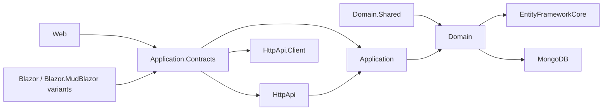
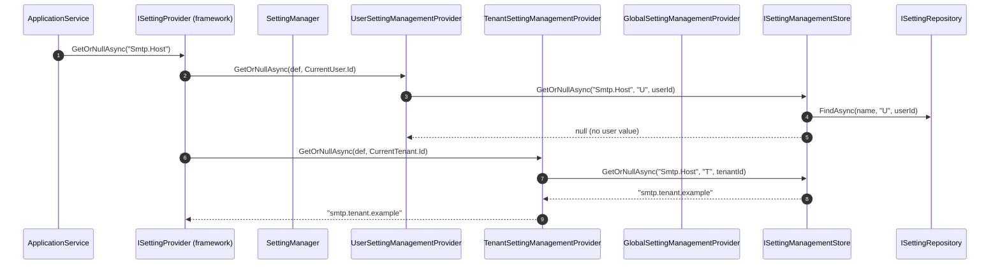

The **Setting Management module** is the runtime, per-tenant, per-user, per-global store for ABP Framework settings. The framework's `Volo.Abp.Settings` package defines `SettingDefinition` and `ISettingProvider` but ships only an in-memory fallback for `ISettingValueProvider`s. This module — `modules/setting-management/src` — supplies the persisted `Setting` aggregate, the `ISettingManagementStore` contract, the provider chain (`Default → Configuration → Global → Tenant → User`), an admin app service for the built-in email and time-zone groups, and Razor / Blazor pages that render contributor-driven groups.

## Module map



## The `Setting` aggregate

`Volo.Abp.SettingManagement.Setting : Entity<Guid>, IAggregateRoot<Guid>` is the storage row. The class is intentionally small:

```csharp
public class Setting : Entity<Guid>, IAggregateRoot<Guid>
{
    [NotNull]  public virtual string Name         { get; protected set; }
    [NotNull]  public virtual string Value        { get; internal set; }
    [CanBeNull] public virtual string ProviderName { get; protected set; }
    [CanBeNull] public virtual string ProviderKey  { get; protected set; }
}
```

`Value` has an `internal set` so that `SettingManagementStore.SetAsync` can update it without going through a domain method — the only legal mutation is "replace the string value". `ProviderName` and `ProviderKey` are `[CanBeNull]` because the `Global` provider scopes have `null` keys.

<Tip>
The original ABP design referred to this entity as `SettingValue` (and many docs still use that name). In the current source the class is named `Setting`. The repository contract `ISettingRepository` confirms this — `IBasicRepository<Setting, Guid>` rather than `IBasicRepository<SettingValue, Guid>`.
</Tip>

The repository interface `ISettingRepository : IBasicRepository<Setting, Guid>` exposes:

```csharp
Task<Setting>       FindAsync(string name, string providerName, string providerKey, ...);
Task<List<Setting>> GetListAsync(string providerName, string providerKey, ...);
Task<List<Setting>> GetListAsync(string[] names, string providerName, string providerKey, ...);
```

`ISettingDefinitionRecordRepository` is the second repository, used by the dynamic-definition store described later.

## `ISettingManagementStore` — replacing the framework default

`Volo.Abp.SettingManagement.ISettingManagementStore` is the contract that the framework's `Volo.Abp.Settings.ISettingStore` proxies to. It is implemented by `SettingManagementStore : ISettingManagementStore, ITransientDependency`:

```csharp
public interface ISettingManagementStore
{
    Task<string>        GetOrNullAsync(string name, string providerName, string providerKey);
    Task<List<SettingValue>> GetListAsync(string providerName, string providerKey);
    Task<List<SettingValue>> GetListAsync(string[] names, string providerName, string providerKey);
    Task                SetAsync(string name, string value, string providerName, string providerKey);
    Task                DeleteAsync(string name, string providerName, string providerKey);
}
```

`SettingManagementStore.GetOrNullAsync` is decorated with `[UnitOfWork]` and uses an `IDistributedCache<SettingCacheItem>`:

```csharp
public virtual async Task<string> GetOrNullAsync(string name, string providerName, string providerKey)
{
    return (await GetCacheItemAsync(name, providerName, providerKey)).Value;
}
```

`SetAsync` calls `SettingRepository.FindAsync(name, providerName, providerKey)` and either inserts a new `Setting(GuidGenerator.Create(), name, value, providerName, providerKey)` or mutates the existing entity's `Value` and calls `UpdateAsync`. Cache invalidation is handled by `SettingCacheItemInvalidator`, an `ILocalEventHandler<EntityChangedEventData<Setting>>` registered automatically through `[ITransientDependency]`.

`SettingStore : ISettingStore, ITransientDependency` is the bridge — it implements the framework's `Volo.Abp.Settings.ISettingStore` by delegating to `ISettingManagementStore.GetOrNullAsync`. This is the single hook that lets the framework's `ISettingProvider.GetOrNullAsync` resolve a value out of the database.

## Provider chain

`Volo.Abp.SettingManagement.ISettingManagementProvider` is the management-side contract:

```csharp
public interface ISettingManagementProvider
{
    string Name { get; }
    Task<string> GetOrNullAsync(SettingDefinition setting, string providerKey);
    Task         SetAsync(SettingDefinition setting, string value, string providerKey);
    Task         ClearAsync(SettingDefinition setting, string providerKey);
}
```

`SettingManagementProvider` is the abstract base — its `GetOrNullAsync`, `SetAsync` and `ClearAsync` simply forward to `SettingManagementStore` with `Name` as the provider name and the subclass-supplied `NormalizeProviderKey(providerKey)`:

```csharp
public virtual async Task<string> GetOrNullAsync(SettingDefinition setting, string providerKey)
{
    return await SettingManagementStore.GetOrNullAsync(setting.Name, Name, NormalizeProviderKey(providerKey));
}
```

The five concrete providers are registered in `AbpSettingManagementDomainModule.ConfigureServices`:

```csharp
Configure<SettingManagementOptions>(options =>
{
    options.Providers.Add<DefaultValueSettingManagementProvider>();
    options.Providers.Add<ConfigurationSettingManagementProvider>();
    options.Providers.Add<GlobalSettingManagementProvider>();
    options.Providers.Add<TenantSettingManagementProvider>();
    options.Providers.Add<UserSettingManagementProvider>();
});
```

<CardGroup cols={2}>
  <Card title="DefaultValueSettingManagementProvider" icon="rotate-left">
    `Name => DefaultValueSettingValueProvider.ProviderName`. `GetOrNullAsync` returns `setting.DefaultValue` from the definition — it never touches the store. `SetAsync` and `ClearAsync` throw `AbpException` because the default is compile-time.
  </Card>
  <Card title="ConfigurationSettingManagementProvider" icon="file-code">
    Reads from `IConfiguration` (typically `appsettings.json`). Writes are likewise unsupported.
  </Card>
  <Card title="GlobalSettingManagementProvider" icon="globe">
    `Name => GlobalSettingValueProvider.ProviderName`. `NormalizeProviderKey` returns `null` — globals have no key.
  </Card>
  <Card title="TenantSettingManagementProvider" icon="building">
    `Name => TenantSettingValueProvider.ProviderName`. `NormalizeProviderKey` returns `providerKey ?? CurrentTenant.Id?.ToString()` so a null key falls back to the current tenant.
  </Card>
  <Card title="UserSettingManagementProvider" icon="user">
    `Name => UserSettingValueProvider.ProviderName`. `NormalizeProviderKey` returns `providerKey ?? CurrentUser.Id?.ToString()` so a null key falls back to the current authenticated user.
  </Card>
</CardGroup>

## `SettingManager` — the public API

`Volo.Abp.SettingManagement.SettingManager : ISettingManager, ISingletonDependency` is the public surface for reading and writing settings outside the framework's `ISettingProvider` flow. Its constructor receives `IOptions<SettingManagementOptions>`, `IServiceProvider`, `ISettingDefinitionManager`, `ISettingEncryptionService` and `ISettingManagementStore`. Providers are resolved lazily:

```csharp
_lazyProviders = new Lazy<List<ISettingManagementProvider>>(
    () => Options.Providers
              .Select(c => serviceProvider.GetRequiredService(c) as ISettingManagementProvider)
              .ToList(), true);
```

The `GetOrNullAsync(string name, string providerName, string providerKey, bool fallback = true)` method walks the provider list starting at `providerName` and, when `fallback == true`, traverses the chain (User → Tenant → Global → Configuration → Default) until a non-null value is returned. The extension methods in `GlobalSettingManagerExtensions`, `TenantSettingManagerExtensions`, `UserSettingManagerExtensions`, `DefaultValueSettingManagerExtensions` and `ConfigurationValueSettingManagerExtensions` wrap typed access — `GetOrNullGlobalAsync(name)`, `GetOrNullForTenantAsync(name, tenantId, fallback)`, `GetOrNullForCurrentUserAsync(name)`, etc.

`ISettingEncryptionService` (registered by the framework) transparently encrypts/decrypts settings marked with `SettingDefinition.IsEncrypted = true`.

## Options

```csharp
public class SettingManagementOptions
{
    public ITypeList<ISettingManagementProvider> Providers { get; }
    public bool SaveStaticSettingsToDatabase { get; set; } = true;
    public bool IsDynamicSettingStoreEnabled { get; set; } = false;
}
```

`SaveStaticSettingsToDatabase` controls whether `StaticSettingSaver` persists the in-memory `SettingDefinition` graph during host startup. `IsDynamicSettingStoreEnabled` toggles `DynamicSettingDefinitionStore` lookups so microservices can resolve definitions registered by other services. Both flags are forced to `false` when `context.Services.IsDataMigrationEnvironment()` is true, mirroring the Permission Management module's behavior.

## Dynamic definitions

`StaticSettingSaver : IStaticSettingSaver` writes the in-memory `SettingDefinition` graph to `SettingDefinitionRecord` rows using a distributed lock to prevent concurrent writers across replicas. `DynamicSettingDefinitionStore` reads them back, with `DynamicSettingDefinitionStoreInMemoryCache` providing a tiny cache layer; `StaticSettingDefinitionChangedEventHandler` is a `IDistributedEventHandler<>` that refreshes the in-memory cache when other services publish definition changes.

`SettingDynamicInitializer` is the background routine invoked from `AbpSettingManagementDomainModule.OnApplicationInitializationAsync` to run the saver on host startup. It is fetched from the *root* service provider via `IRootServiceProvider` so it survives across scopes:

```csharp
public override async Task OnApplicationInitializationAsync(ApplicationInitializationContext context)
{
    var rootServiceProvider = context.ServiceProvider.GetRequiredService<IRootServiceProvider>();
    var initializer = rootServiceProvider.GetRequiredService<SettingDynamicInitializer>();
    await initializer.InitializeAsync(true, _cancellationTokenSource.Token);
}
```

## Application layer

`Volo.Abp.SettingManagement.Application` ships two domain-specific app services rather than a single CRUD app service for arbitrary settings — administrators tend to interact with grouped settings (email, time zone, ...) not with the raw key/value list.

`EmailSettingsAppService : SettingManagementAppServiceBase, IEmailSettingsAppService` is `[Authorize(SettingManagementPermissions.Emailing)]` and exposes `GetAsync()` / `UpdateAsync(UpdateEmailSettingsDto)` / `SendTestEmailAsync(SendTestEmailInput)`. The `GetAsync` body reads the SMTP settings through `SettingProvider.GetOrNullAsync(EmailSettingNames.Smtp.Host)` (the framework provider) but also overrides with `SettingManager.GetOrNullForTenantAsync(...)` when the current tenant is available so the host-fallback behavior matches what `UpdateAsync` writes:

```csharp
await SettingManager.SetForTenantOrGlobalAsync(
    CurrentTenant.Id, EmailSettingNames.Smtp.Host, input.SmtpHost);
```

The `SetForTenantOrGlobalAsync` extension comes from `GlobalSettingManagerExtensions` and picks the right provider based on `CurrentTenant.Id`.

`TimeZoneSettingsAppService : SettingManagementAppServiceBase, ITimeZoneSettingsAppService` is `[Authorize(SettingManagementPermissions.TimeZone)]`. It uses `ITimezoneProvider.GetIanaTimezones()` to populate a drop-down and writes to `TimingSettingNames.TimeZone` either via `SettingManager.SetGlobalAsync` (host) or the tenant-scoped extension (tenant).

`AllowChangingEmailSettingsFeatureSimpleStateChecker` is an `ISimpleStateChecker<EmailSettingsDto>` that hides the email-settings group when the `SettingManagement.AllowTenantsToChangeEmailSettings` feature is disabled.

Both app services share `SettingManagementAppServiceBase` which exposes `SettingProvider` (the framework's `ISettingProvider`) and `SettingManager` (the management-module manager). `UserDeletedEventHandler` listens to `EntityDeletedEventData<IdentityUser>` to purge user-scoped settings on deletion.

## Permissions and remote constants

`SettingManagementPermissions` declares the permission constants:

```csharp
public static class SettingManagementPermissions
{
    public const string GroupName = "SettingManagement";
    public const string Emailing  = GroupName + ".Emailing";
    public const string TimeZone  = GroupName + ".TimeZone";
}
```

`SettingManagementPermissionDefinitionProvider` registers them with localized display names. `SettingManagementRemoteServiceConsts.RemoteServiceName` / `.ModuleName` route the HTTP API under `api/setting-management/...`.

## Persistence

`Volo.Abp.SettingManagement.EntityFrameworkCore.SettingManagementDbContext` is `[IgnoreMultiTenancy]` and `[ConnectionStringName(AbpSettingManagementDbProperties.ConnectionStringName)]`. It carries two `DbSet<>`s:

```csharp
public DbSet<Setting>                  Settings                  { get; set; }
public DbSet<SettingDefinitionRecord> SettingDefinitionRecords { get; set; }
```

`OnModelCreating` calls `builder.ConfigureSettingManagement()` to set table names, max lengths and indexes. `EfCoreSettingRepository : EfCoreRepository<ISettingManagementDbContext, Setting, Guid>, ISettingRepository` implements the contract and uses `FirstOrDefaultAsync(s => s.Name == name && s.ProviderName == providerName && s.ProviderKey == providerKey)`.

The MongoDB side — `SettingManagementMongoDbContext`, `MongoSettingRepository`, `MongoSettingDefinitionRecordRepository`, `SettingManagementMongoDbContextExtensions` — mirrors the EF Core shape exactly.

`[IgnoreMultiTenancy]` on the DbContext is critical: setting rows are filtered by `ProviderKey == TenantId.ToString()` for the tenant provider rather than by the framework's `IMultiTenant.TenantId` column, so the data-filter system must stay out of the way.

## Web UI

`Volo.Abp.SettingManagement.Web/Pages/SettingManagement/Index.cshtml.cs` is the Razor Page entry point:

```csharp
[Authorize]
[RequiresFeature(SettingManagementFeatures.Enable)]
public class IndexModel : AbpPageModel
{
    protected SettingPageContributorManager SettingPageContributorManager { get; }
    ...
    public virtual async Task<IActionResult> OnGetAsync()
    {
        SettingPageCreationContext = await SettingPageContributorManager.ConfigureAsync();
        return Page();
    }
}
```

The page itself is just a tab strip and a `ViewComponent` host. The list of tabs is built by `SettingPageContributorManager` running every `ISettingPageContributor` registered in `SettingManagementPageOptions`. Two contributors ship out of the box: `EmailingPageContributor` registers an `EmailSettingGroupViewComponent` and `TimeZonePageContributor` registers `TimeZoneSettingGroupViewComponent`. Each `SettingPageGroup` carries an `Id`, a `DisplayName`, a `ComponentType` and an optional `Parameter`. `OnPostRenderViewAsync(string id)` re-renders a single tab via `ViewComponent(view.ComponentType, view.Parameter)`, used by the tab-switch AJAX call. `OnPostRefreshConfigurationAsync` publishes `CurrentApplicationConfigurationCacheResetEventData` on the local event bus so the browser-side `abp.configuration` cache reloads.

`SettingManagementMainMenuContributor` adds the menu item under the Administration menu, gated by `SettingManagementPermissions.Emailing` or `SettingManagementPermissions.TimeZone`.

## Blazor UI

The Blazorise variant `Volo.Abp.SettingManagement.Blazor/Pages/SettingManagement/SettingManagement.razor.cs` and its MudBlazor twin in `.Blazor.MudBlazor` mirror the Razor page. Each component receives a `SettingComponentCreationContext` built by `SettingManagementComponentOptions` from registered `ISettingComponentContributor` implementations — `EmailingPageContributor`, `TimeZonePageContributor`. The `EmailSettingGroupViewComponent.razor.cs` and `TimeZoneSettingGroupViewComponent.razor.cs` are the per-group editor components.

## End-to-end flow



The provider chain stops at the first non-null value; lower-precedence providers (Global → Configuration → Default) are queried only when higher precedence sources return null.

## Permission constants

`SettingManagementPermissions` declares two permissions plus the group:

```csharp
public static class SettingManagementPermissions
{
    public const string GroupName = "SettingManagement";
    public const string Emailing  = GroupName + ".Emailing";
    public const string TimeZone  = GroupName + ".TimeZone";
}
```

`SettingManagementPermissionDefinitionProvider` registers them with localized display names sourced from `AbpSettingManagementResource`. `SettingManagementRemoteServiceConsts.RemoteServiceName = "AbpSettingManagement"` and `.ModuleName = "abpSettingManagement"` are the values bound to `[Area]` and `[RemoteService(Name = ...)]` on the HTTP controllers.

## Remote service surface

The HTTP API split mirrors the domain-specific app services:

- `EmailSettingsController : AbpControllerBase, IEmailSettingsAppService` at `api/setting-management/emailing` exposes `GetAsync()`, `UpdateAsync(UpdateEmailSettingsDto)` and `SendTestEmailAsync(SendTestEmailInput)`.
- `TimeZoneSettingsController : AbpControllerBase, ITimeZoneSettingsAppService` at `api/setting-management/timing/timezone` exposes `GetAsync()`, `GetTimezonesAsync()` and `UpdateAsync(string timezone)`.

`Volo.Abp.SettingManagement.HttpApi.Client` ships generated typed proxies of those two app services for microservice scenarios where you want to read or write settings from another host.

## Setting cache

`Volo.Abp.SettingManagement.SettingCacheItem` is the cached payload (a tiny `{ string Value }` record). `SettingCacheItemInvalidator` listens for `EntityChangedEventData<Setting>` to remove the cache entry whose key is computed by `SettingManagementStore.CalculateCacheKey(name, providerName, providerKey)`. Together they keep the in-process and distributed caches consistent through every `SetAsync` / `DeleteAsync` write path.

`AbpSettingManagementDbProperties.ConnectionStringName = "AbpSettingManagement"` and `DbTablePrefix = "Abp"` apply the canonical naming convention to all setting tables and collections.

## Sample registration

Bringing the module online in a host requires the standard module-set:

```csharp
[DependsOn(
    typeof(AbpSettingManagementDomainModule),
    typeof(AbpSettingManagementApplicationModule),
    typeof(AbpSettingManagementHttpApiModule),
    typeof(AbpSettingManagementEntityFrameworkCoreModule), // or .MongoDB
    typeof(AbpSettingManagementWebModule)                  // or one of the Blazor variants
)]
public class MyHostModule : AbpModule { }
```

See [Permission Mgmt](/psf/permission-management) for the parallel module shape with grants instead of values, and [Feature Mgmt](/psf/feature-management) for the same pattern with edition / tenant-scoped feature toggles.
