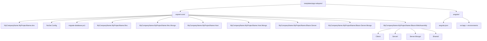

The `app-nolayers` template is the **single-project counterpart** to the layered solution in `templates/app/`. Instead of splitting code across `Domain`, `Application`, `HttpApi`, and `Web` projects, every variant under `templates/app-nolayers/aspnet-core/` collapses those concerns into one assembly. The ABP Framework still provides DI, modularity, virtual file system, multi-tenancy, and OpenIddict — only the **physical project boundaries** disappear.

This page covers both the ASP.NET Core variants and the Angular companion under `templates/app-nolayers/angular/`. The CLI invocation is `abp new MyCompany.MyProject -t app-nolayers --ui <mvc|blazor-server|blazor-wasm|angular>`.

## Workspace layout



Every leaf maps to a real folder under `templates/app-nolayers/`. The CLI keeps **only one** of the seven `MyCompanyName.MyProjectName.*` folders depending on `--ui` and `--database`; the others are deleted at generation time.

## ASP.NET Core variants

There are seven candidate projects under `templates/app-nolayers/aspnet-core/`:

| Folder | UI | Database | Notes |
| --- | --- | --- | --- |
| `MyCompanyName.MyProjectName.Mvc` | MVC / Razor Pages | EF Core | Default `--ui mvc` |
| `MyCompanyName.MyProjectName.Mvc.Mongo` | MVC / Razor Pages | MongoDB | `--ui mvc --database mongodb` |
| `MyCompanyName.MyProjectName.Host` | Razor host (no UI shell) | EF Core | API-first |
| `MyCompanyName.MyProjectName.Host.Mongo` | Razor host | MongoDB | API-first + Mongo |
| `MyCompanyName.MyProjectName.Blazor.Server` | Blazor Server | EF Core | `--ui blazor-server` |
| `MyCompanyName.MyProjectName.Blazor.Server.Mongo` | Blazor Server | MongoDB | `--ui blazor-server --database mongodb` |
| `MyCompanyName.MyProjectName.Blazor.WebAssembly` | Blazor WASM | EF Core / MongoDB | Holds `Client/`, `Server/`, `Server.Mongo/`, `Shared/` |

### `MyCompanyName.MyProjectName.Mvc`

Path: `templates/app-nolayers/aspnet-core/MyCompanyName.MyProjectName.Mvc/`

The canonical no-layers project. Its tree mirrors what you'd find spread across **five** projects in the layered template:

- `Data/` — `MyProjectNameDbContext.cs`, `MyProjectNameDbContextFactory.cs`, `MyProjectNameDbMigrationService.cs`, `MyProjectNameEFCoreDbSchemaMigrator.cs`, `MyProjectNameEfCoreEntityExtensionMappings.cs`.
- `Entities/` — domain entities authored by the user.
- `Localization/` — embedded JSON localization resources.
- `Menus/` — `MyProjectNameMenuContributor.cs`.
- `Migrations/` — EF Core migrations.
- `MyProjectNameModule.cs` — the **only** module class in the solution.
- `MyProjectNameBrandingProvider.cs`, `MyProjectNameGlobalFeatureConfigurator.cs`, `MyProjectNameModuleExtensionConfigurator.cs`.

The module class has the longest `[DependsOn]` list of any ABP template:

```csharp templates/app-nolayers/aspnet-core/MyCompanyName.MyProjectName.Mvc/MyProjectNameModule.cs
[DependsOn(
    typeof(AbpAspNetCoreMvcModule),
    typeof(AbpAutofacModule),
    typeof(AbpMapperlyModule),
    typeof(AbpAspNetCoreSerilogModule),
    typeof(AbpAuditLoggingEntityFrameworkCoreModule),
    typeof(AbpEntityFrameworkCoreSqlServerModule),
    typeof(AbpFeatureManagementEntityFrameworkCoreModule),
    typeof(AbpIdentityEntityFrameworkCoreModule),
    typeof(AbpIdentityWebModule),
    typeof(AbpOpenIddictEntityFrameworkCoreModule),
    typeof(AbpPermissionManagementEntityFrameworkCoreModule),
    typeof(AbpPermissionManagementHttpApiModule),
    typeof(AbpPermissionManagementApplicationModule),
    typeof(AbpSettingManagementEntityFrameworkCoreModule),
    typeof(AbpSettingManagementWebModule),
    typeof(AbpTenantManagementEntityFrameworkCoreModule),
    typeof(AbpTenantManagementWebModule),
    typeof(AbpAccountWebOpenIddictModule),
    typeof(AbpAspNetCoreMvcUiLeptonXLiteThemeModule)
)]
public class MyProjectNameModule : AbpModule
{
    // ...
}
```

Because there is no separate `Application`, `Domain`, or `Domain.Shared` project, **every** ABP module is referenced directly from the host's `[DependsOn]` attribute.

### `MyCompanyName.MyProjectName.Mvc.Mongo`

Path: `templates/app-nolayers/aspnet-core/MyCompanyName.MyProjectName.Mvc.Mongo/`

Identical structure with `*EntityFrameworkCore` swapped for `*MongoDb` in the `[DependsOn]` graph. The `Data/` folder contains `MyProjectNameMongoDbContext.cs` instead of an EF context.

### `MyCompanyName.MyProjectName.Host` / `Host.Mongo`

Path: `templates/app-nolayers/aspnet-core/MyCompanyName.MyProjectName.Host/`

A **Razor Pages host without the MVC UI shell** — meant for purely API-driven applications (typically with Angular). Includes `Controllers/`, `Data/`, `Entities/`, `Localization/`, `Migrations/`, `MyProjectNameModule.cs`, `MyProjectNameBrandingProvider.cs`. The `Host.Mongo` variant swaps EF Core for MongoDB.

### `MyCompanyName.MyProjectName.Blazor.Server` / `Blazor.Server.Mongo`

Path: `templates/app-nolayers/aspnet-core/MyCompanyName.MyProjectName.Blazor.Server/`

Single-project Blazor Server host with `Components/`, `Data/`, `Entities/`, `Localization/`, `Menus/`, `Migrations/`. The module class is `MyProjectNameModule.cs` (no separate `Module` file per layer) and includes `MyProjectNameComponentBase.cs` plus `MyProjectNameBrandingProvider.cs`.

### `MyCompanyName.MyProjectName.Blazor.WebAssembly`

Path: `templates/app-nolayers/aspnet-core/MyCompanyName.MyProjectName.Blazor.WebAssembly/`

This is the **one variant that keeps multiple projects**, because Blazor WebAssembly inherently needs a server to host the WASM payload and a client that runs in the browser:

- `Client/MyCompanyName.MyProjectName.Blazor.WebAssembly.Client.csproj` — WASM project with `Program.cs`, `Routes.razor`, `Pages/`, `_Imports.razor`, `MyProjectNameBlazorModule.cs`, `MyProjectNameComponentBase.cs`, `MyProjectNameBundleContributor.cs`, `MyProjectNameBrandingProvider.cs`.
- `Server/MyCompanyName.MyProjectName.Blazor.WebAssembly.Server.csproj` — ASP.NET Core host serving the WASM client, with `Components/`, `Controllers/`-equivalent under `Services/`, `Data/`, `Entities/`, `Migrations/`, `MyProjectNameHostModule.cs`, `ObjectMapping/`.
- `Server.Mongo/` — MongoDB swap of the server.
- `Shared/` — DTOs and contracts referenced by both client and server.

This is the closest the no-layers template gets to multi-project — it still avoids the full DDD split.

## Solution + tooling

### `MyCompanyName.MyProjectName.slnx`

Path: `templates/app-nolayers/aspnet-core/MyCompanyName.MyProjectName.slnx`

Lists every candidate project; the CLI prunes it after deciding which UI/database combo to keep.

### `migrate-database.ps1`

Path: `templates/app-nolayers/aspnet-core/migrate-database.ps1`

A PowerShell convenience that runs `dotnet ef database update` on the chosen project. Because each variant has its own `Migrations/` folder, this script tries `Mvc`, `Host`, `Blazor.Server`, and the WASM `Server` until one of them owns the migrations.

### `NuGet.Config`

Path: `templates/app-nolayers/aspnet-core/NuGet.Config`

Empty `<packageSources />` — identical to every other template `NuGet.Config`.

## Angular companion

The Angular SPA at `templates/app-nolayers/angular/` is **structurally identical** to the layered Angular workspace under `templates/app/angular/`. It has the same Angular 21 standalone-components layout:

- `templates/app-nolayers/angular/angular.json` — same `@angular/build:application` builder.
- `templates/app-nolayers/angular/package.json` — pins the same `@abp/ng.*` versions.
- `templates/app-nolayers/angular/src/main.ts` — bootstraps `AppComponent`.
- `templates/app-nolayers/angular/src/app/app.config.ts` — composes `provideAbpCore`, `provideThemeLeptonX`, etc.
- `templates/app-nolayers/angular/src/app/app.routes.ts` — same lazy-loaded ABP feature areas.

The **only meaningful difference** is in `src/environments/environment.ts`:

```ts templates/app-nolayers/angular/src/environments/environment.ts
const baseUrl = 'http://localhost:4200';

export const environment = {
  production: false,
  application: { baseUrl, name: 'MyProjectName', logoUrl: '' },
  oAuthConfig: {
    issuer: 'https://localhost:44300/',
    redirectUri: baseUrl,
    clientId: 'MyProjectName_App',
    responseType: 'code',
    scope: 'offline_access MyProjectName',
    requireHttps: true,
  },
  apis: {
    default: {
      url: 'https://localhost:44300',
      rootNamespace: 'MyCompanyName.MyProjectName',
    },
  },
} as Environment;
```

The port is **44300** instead of 44305 because the no-layers `Host` project listens on that port by default (the layered `HttpApi.HostWithIds` listens on 44305). Same `clientId`, same `rootNamespace` convention.

## When to choose no-layers

<AccordionGroup>
  <Accordion title="You ship fast and iterate aggressively">
    Internal tools, hackathon prototypes, and SaaS MVPs benefit from one project with one `Program.cs` and one `appsettings.json`. No copy-paste between `Domain` and `Application`.
  </Accordion>
  <Accordion title="Your team is small or new to DDD">
    The layered template enforces strict separation that requires team-wide discipline. The no-layers template lets a single developer touch entities, application services, controllers, and Razor pages in one project.
  </Accordion>
  <Accordion title="You are not yet sure your bounded contexts">
    Premature project splits can be expensive to undo. Start in `app-nolayers`, then refactor to layered if you grow into multiple bounded contexts.
  </Accordion>
  <Accordion title="You need a UI plus an API but nothing fancier">
    `Mvc`, `Blazor.Server`, and `Blazor.WebAssembly` variants each contain controllers, application services, and views in one place — perfect for product teams whose API is consumed only by their own UI.
  </Accordion>
</AccordionGroup>

## When to **avoid** no-layers

<Warning>
The no-layers template is **not** suitable when:

- You plan to publish reusable modules — use the [Module template](/templates/module-template) instead.
- You need a tiered deployment (separate AuthServer, API, and UI processes) — use the [layered template](/templates/app-template-aspnetcore).
- You expect multiple bounded contexts in the same solution — DDD layering pays off as the model grows.
</Warning>

## Module class differences vs layered

The single `MyProjectNameModule.cs` in `app-nolayers` absorbs the responsibilities of **eight** module classes from the layered template:

| Layered class | No-layers replacement |
| --- | --- |
| `MyProjectNameDomainSharedModule` | folded into `MyProjectNameModule` |
| `MyProjectNameDomainModule` | folded into `MyProjectNameModule` |
| `MyProjectNameApplicationContractsModule` | folded into `MyProjectNameModule` |
| `MyProjectNameApplicationModule` | folded into `MyProjectNameModule` |
| `MyProjectNameHttpApiModule` | folded into `MyProjectNameModule` |
| `MyProjectNameEntityFrameworkCoreModule` | folded into `MyProjectNameModule` |
| `MyProjectNameWebModule` | folded into `MyProjectNameModule` |
| `MyProjectNameHttpApiHostModule` | folded into `MyProjectNameModule` |

That's why the `[DependsOn]` list in `templates/app-nolayers/aspnet-core/MyCompanyName.MyProjectName.Mvc/MyProjectNameModule.cs` enumerates twenty-plus framework modules — every `Abp*Module` that previously lived in a per-layer file is consolidated.

## Migrating from no-layers to layered

ABP does not ship an automated migration. The recommended path:

1. Run `abp new MyCompany.MyProject -t app --connection-string ...` against an empty folder.
2. Copy entities from `templates/app-nolayers/aspnet-core/MyCompanyName.MyProjectName.Mvc/Entities/` into the new `MyCompanyName.MyProjectName.Domain/` project.
3. Move application services from the no-layers `MyProjectNameModule.cs` into the new `MyCompanyName.MyProjectName.Application/` project.
4. Re-add the `Migrations/` folder under `MyCompanyName.MyProjectName.EntityFrameworkCore/`.
5. Re-run `MyCompanyName.MyProjectName.DbMigrator` to seed identity data.

The Angular workspace can stay almost unchanged — update `environment.ts` to point at the new port from `MyCompanyName.MyProjectName.HttpApi.HostWithIds`.

## Where to look next

- For the layered solution this template intentionally simplifies, see [App (.NET)](/templates/app-template-aspnetcore).
- For the matching Angular workspace, see [App (Angular)](/templates/app-template-angular) — the Angular templates are structurally identical.
- For console workloads inside the same solution, see [Console](/templates/console-template).
