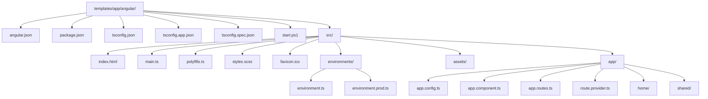

The Angular template is the front-end half of the ABP Framework layered solution. While `templates/app/aspnet-core/src/MyCompanyName.MyProjectName.HttpApi.HostWithIds/` exposes the API, `templates/app/angular/` ships an Angular 21 workspace that consumes it through the `@abp/ng.*` libraries (the **ng-packs**). This page walks through every file in that workspace.

You can serve the template directly with `pnpm install && ng serve` after pointing it at a running HTTP API host. The CLI does not modify the Angular tree apart from substituting `MyProjectName` and updating environment URLs.

## Workspace layout



Every leaf maps to a real file under `templates/app/angular/`. The tree is the modern Angular **standalone components** layout — there is no top-level `AppModule`; bootstrapping happens through `bootstrapApplication` in `src/main.ts`.

## `angular.json`

Path: `templates/app/angular/angular.json`

The workspace declares a single project named `MyProjectName` whose `sourceRoot` is `src` and whose `outputPath` is `dist/MyProjectName`. The builder is `@angular/build:application` (the new esbuild-based Angular builder).

```json templates/app/angular/angular.json
{
  "$schema": "./node_modules/@angular/cli/lib/config/schema.json",
  "cli": {
    "analytics": false,
    "schematicCollections": ["@angular-eslint/schematics"]
  },
  "version": 1,
  "newProjectRoot": "projects",
  "projects": {
    "MyProjectName": {
      "projectType": "application",
      "schematics": {
        "@schematics/angular:component": { "style": "scss" }
      },
      "root": "",
      "sourceRoot": "src",
      "prefix": "app",
      "architect": {
        "build": {
          "builder": "@angular/build:application",
          "options": { "..." : "..." }
        }
      }
    }
  }
}
```

### Styles bundle

The `styles` array under `architect.build.options` does the heavy lifting for the ABP Lepton-X theme. It injects FontAwesome, ngx-datatable, Bootstrap Icons, and ABP's own `abp-bundle.css`, plus their RTL counterparts. The notable entries:

- `node_modules/@fortawesome/fontawesome-free/css/all.min.css` — global icon font.
- `node_modules/@swimlane/ngx-datatable/themes/material.css` — datatable rows.
- `node_modules/@volo/ngx-lepton-x.lite/assets/css/ng-bundle.css` — Lepton-X core stylesheet.
- `node_modules/@volo/ngx-lepton-x.lite/assets/css/side-menu/layout-bundle.css` — default side-menu layout.
- `node_modules/@abp/ng.theme.lepton-x/assets/css/abp-bundle.css` — ABP-aware Lepton-X overrides.
- `src/styles.scss` — user-owned overrides.

Most of these are `"inject": false` and addressed by `bundleName` at runtime, so the Lepton-X layout switcher can swap themes on the fly without a rebuild.

## `package.json`

Path: `templates/app/angular/package.json`

Pins the **ng-packs** (`@abp/ng.*`) and the matching Angular version. The current template targets Angular 21:

```json templates/app/angular/package.json
{
  "name": "MyProjectName",
  "version": "0.0.0",
  "scripts": {
    "ng": "ng",
    "start": "ng serve --open",
    "build": "ng build",
    "build:prod": "ng build --configuration production",
    "watch": "ng build --watch --configuration development",
    "test": "ng test",
    "lint": "ng lint"
  },
  "dependencies": {
    "@abp/ng.account": "~10.4.0-rc.2",
    "@abp/ng.components": "~10.4.0-rc.2",
    "@abp/ng.core": "~10.4.0-rc.2",
    "@abp/ng.identity": "~10.4.0-rc.2",
    "@abp/ng.oauth": "~10.4.0-rc.2",
    "@abp/ng.setting-management": "~10.4.0-rc.2",
    "@abp/ng.tenant-management": "~10.4.0-rc.2",
    "@abp/ng.theme.lepton-x": "~5.4.0-rc.2",
    "@abp/ng.theme.shared": "~10.4.0-rc.2",
    "@angular/core": "~21.2.0",
    "@angular/router": "~21.2.0",
    "...": "..."
  }
}
```

The `@abp/ng.*` libraries come from the `ng-packs` monorepo (`npm/ng-packs/`). Their version is kept in lock-step with the .NET packages, so the template literally references `~10.4.0-rc.2` for every ABP library.

## Bootstrapping

### `src/main.ts`

Path: `templates/app/angular/src/main.ts`

```ts templates/app/angular/src/main.ts
import { provideZoneChangeDetection } from "@angular/core";
import { bootstrapApplication } from '@angular/platform-browser';
import { appConfig } from './app/app.config';
import { AppComponent } from './app/app.component';

bootstrapApplication(AppComponent, {
  ...appConfig,
  providers: [provideZoneChangeDetection(), ...appConfig.providers]
}).catch(err => console.error(err));
```

The entire bootstrap is standalone — there is **no `AppModule`**. The bootstrap call merges `appConfig.providers` with `provideZoneChangeDetection()` so the app uses Zone.js change detection by default.

### `src/app/app.config.ts`

Path: `templates/app/angular/src/app/app.config.ts`

This file is the **single source of truth** for application-wide providers. It composes every ABP library plus the Angular Router:

```ts templates/app/angular/src/app/app.config.ts
export const appConfig: ApplicationConfig = {
  providers: [
    provideRouter(appRoutes),
    APP_ROUTE_PROVIDER,
    provideAbpCore(withOptions({
      environment,
      registerLocaleFn: registerLocaleForEsBuild(),
    })),
    provideThemeLeptonX(),
    provideSideMenuLayout(),
    provideAbpOAuth(),
    provideSettingManagementConfig(),
    provideAccountConfig(),
    provideIdentityConfig(),
    provideTenantManagementConfig(),
    provideFeatureManagementConfig(),
    provideAnimations(),
    provideLogo(withEnvironmentOptions(environment)),
    provideAbpThemeShared(withValidationBluePrint({
      wrongPassword: 'Please choose 1q2w3E*',
    })),
  ],
};
```

The providers correspond one-to-one with the `@abp/ng.*` packages from `package.json` — every ABP feature (Identity, Tenant Management, Setting Management, Feature Management, Account, OAuth, Theme) requires its own `provide*Config()` call.

### `src/app/app.component.ts`

Path: `templates/app/angular/src/app/app.component.ts`

```ts templates/app/angular/src/app/app.component.ts
@Component({
  selector: 'app-root',
  template: `
    <abp-loader-bar />
    <abp-dynamic-layout />
    <abp-internet-status />
  `,
  imports: [LoaderBarComponent, DynamicLayoutComponent, InternetConnectionStatusComponent],
})
export class AppComponent {}
```

`AppComponent` is **trivial**. The real layout work is delegated to `<abp-dynamic-layout />` which looks up the current route's `layout` metadata (set by `route.provider.ts`) and renders the matching Lepton-X layout (application, account, empty).

## Routing

### `src/app/app.routes.ts`

Path: `templates/app/angular/src/app/app.routes.ts`

The routes lazy-load every ABP feature area:

```ts templates/app/angular/src/app/app.routes.ts
export const appRoutes: Routes = [
  { path: '', pathMatch: 'full',
    loadChildren: () => import('./home/home.routes').then(m => m.homeRoutes) },
  { path: 'account',
    loadChildren: () => import('@abp/ng.account').then(m => m.createRoutes()) },
  { path: 'identity',
    loadChildren: () => import('@abp/ng.identity').then(m => m.createRoutes()) },
  { path: 'tenant-management',
    loadChildren: () => import('@abp/ng.tenant-management').then(m => m.createRoutes()) },
  { path: 'setting-management',
    loadChildren: () => import('@abp/ng.setting-management').then(m => m.createRoutes()) },
];
```

Each library exports a `createRoutes()` factory so consumers can pass options if needed — the template uses defaults.

### `src/app/route.provider.ts`

Path: `templates/app/angular/src/app/route.provider.ts`

This file registers menu entries with ABP's `RoutesService`:

```ts templates/app/angular/src/app/route.provider.ts
export const APP_ROUTE_PROVIDER = [
  { provide: APP_INITIALIZER, useFactory: configureRoutes, deps: [RoutesService], multi: true },
];

function configureRoutes(routesService: RoutesService) {
  return () => {
    routesService.add([
      {
        path: '/',
        name: '::Menu:Home',
        iconClass: 'fas fa-home',
        order: 1,
        layout: eLayoutType.application,
      },
    ]);
  };
}
```

`RoutesService` is what `<abp-dynamic-layout />` reads to build the side menu. The `name: '::Menu:Home'` token is resolved by the localization pipeline configured in `provideAbpCore`.

## Feature areas

### `src/app/home/`

Path: `templates/app/angular/src/app/home/`

Contains the home page that ships with the template:

- `home.component.ts` — standalone component.
- `home.component.html` — splash markup.
- `home.component.scss` — local styles.
- `home.component.spec.ts` — Karma test.
- `home.routes.ts` — exports `homeRoutes` used by `app.routes.ts`.

### `src/app/shared/`

Path: `templates/app/angular/src/app/shared/`

Holds the legacy `SharedModule` (`shared.module.ts`). It is kept for compatibility with feature modules that pre-date the standalone-components migration; new code should prefer adding to a component's `imports` array.

## Environments

### `src/environments/environment.ts`

Path: `templates/app/angular/src/environments/environment.ts`

```ts templates/app/angular/src/environments/environment.ts
const baseUrl = 'http://localhost:4200';

export const environment = {
  production: false,
  application: { baseUrl, name: 'MyProjectName', logoUrl: '' },
  oAuthConfig: {
    issuer: 'https://localhost:44305/',
    redirectUri: baseUrl,
    clientId: 'MyProjectName_App',
    responseType: 'code',
    scope: 'offline_access MyProjectName',
    requireHttps: true,
  },
  apis: {
    default: {
      url: 'https://localhost:44305',
      rootNamespace: 'MyCompanyName.MyProjectName',
    },
  },
} as Environment;
```

Three critical fields:

- `oAuthConfig.issuer` — the URL of `MyCompanyName.MyProjectName.AuthServer` or `HttpApi.HostWithIds`.
- `oAuthConfig.clientId` — must match an `OpenIddictApplication` seeded by `MyCompanyName.MyProjectName.DbMigrator`.
- `apis.default.url` — the URL of `MyCompanyName.MyProjectName.HttpApi.Host` or `HttpApi.HostWithIds`.

### `src/environments/environment.prod.ts`

Path: `templates/app/angular/src/environments/environment.prod.ts`

The production override; differs only in `production: true` plus URLs that the deployment pipeline replaces.

<Warning>
The CLI rewrites `clientId`, `issuer`, and `apis.default.url` based on `--connection-string` and the chosen port at generation time. Keep the `_App` suffix on `clientId` — the DbMigrator seeds OpenIddict applications using that exact convention.
</Warning>

## Static assets

`templates/app/angular/src/assets/` ships the logo and Lepton-X imagery shared across all UI variants. `templates/app/angular/src/favicon.ico`, `index.html`, `styles.scss`, and `polyfills.ts` are the standard Angular CLI entry points.

`src/index.html` exposes `<app-root />` and applies the Lepton-X `lpx-theme` class. `src/styles.scss` is intentionally near-empty so users can add their own overrides without conflicting with the bundles configured in `angular.json`.

## TypeScript configurations

Three `tsconfig.*.json` files split compilation by target:

- `templates/app/angular/tsconfig.json` — root project references and compiler options.
- `templates/app/angular/tsconfig.app.json` — production build, excludes spec files.
- `templates/app/angular/tsconfig.spec.json` — Karma test build, includes spec files and Karma typings.

The shared `tsconfig.json` enables strict mode and points `paths` so deep imports under `@abp/ng.*` resolve to the published packages.

## Linting

`angular.json` registers `@angular-eslint/schematics` via `cli.schematicCollections`. Running `ng add @angular-eslint/schematics` is **not** necessary — the dev dependencies in `package.json` already pin `@angular-eslint/builder`, `@angular-eslint/eslint-plugin`, `@angular-eslint/eslint-plugin-template`, `@angular-eslint/schematics`, and `@angular-eslint/template-parser`.

## `start.ps1`

Path: `templates/app/angular/start.ps1`

A PowerShell convenience script that runs `npm install` followed by `npm start`. The CLI also drops a `Directory.Packages.props`-style file at this location is unnecessary for npm projects — version pinning happens in `package.json` and `package-lock.json`.

## Relationship to ng-packs

The Angular template is **not** self-contained; it consumes:

- `@abp/ng.core` — HTTP interceptors, localization, configuration, `RoutesService`, `DynamicLayoutComponent`.
- `@abp/ng.oauth` — OAuth2 / OpenID Connect integration via `angular-oauth2-oidc`.
- `@abp/ng.theme.shared` — Loader bar, validation pipeline, internet-status indicator.
- `@abp/ng.theme.lepton-x` — Lepton-X layouts and providers.
- `@abp/ng.account`, `@abp/ng.identity`, `@abp/ng.tenant-management`, `@abp/ng.setting-management`, `@abp/ng.feature-management` — feature areas wired by `app.routes.ts`.

Their sources live in `npm/ng-packs/` in the same repo. When the template's npm versions get bumped to a new RC, the corresponding `npm/ng-packs/package.json` version moves in lock step.

## How it pairs with the backend

The Angular workspace pairs with one of two backend hosts:

<Tabs>
  <Tab title="Non-tiered">
    `templates/app/aspnet-core/src/MyCompanyName.MyProjectName.HttpApi.HostWithIds/` runs on port `44305`. It hosts both `/connect/token` (OpenIddict) and `/api/...`. `environment.ts` points `issuer` and `apis.default.url` at the same URL.
  </Tab>
  <Tab title="Tiered">
    `templates/app/aspnet-core/src/MyCompanyName.MyProjectName.AuthServer/` is the OAuth issuer, while `templates/app/aspnet-core/src/MyCompanyName.MyProjectName.HttpApi.Host/` runs the API. `environment.ts` separates the two URLs into `oAuthConfig.issuer` and `apis.default.url`.
  </Tab>
</Tabs>

The `DbMigrator` seeds `MyProjectName_App` (or `MyProjectName_Swagger`) clients in the OpenIddict tables; the Angular `clientId` must match one of them.

## Where to look next

- For the backend that serves `apis.default.url`, see [App (.NET)](/templates/app-template-aspnetcore).
- For the simpler Angular SPA that pairs with single-project ASP.NET hosts, see [App No-Layers](/templates/app-nolayers).
- For module authoring whose Angular companion is built as a library, see [Module](/templates/module-template).
