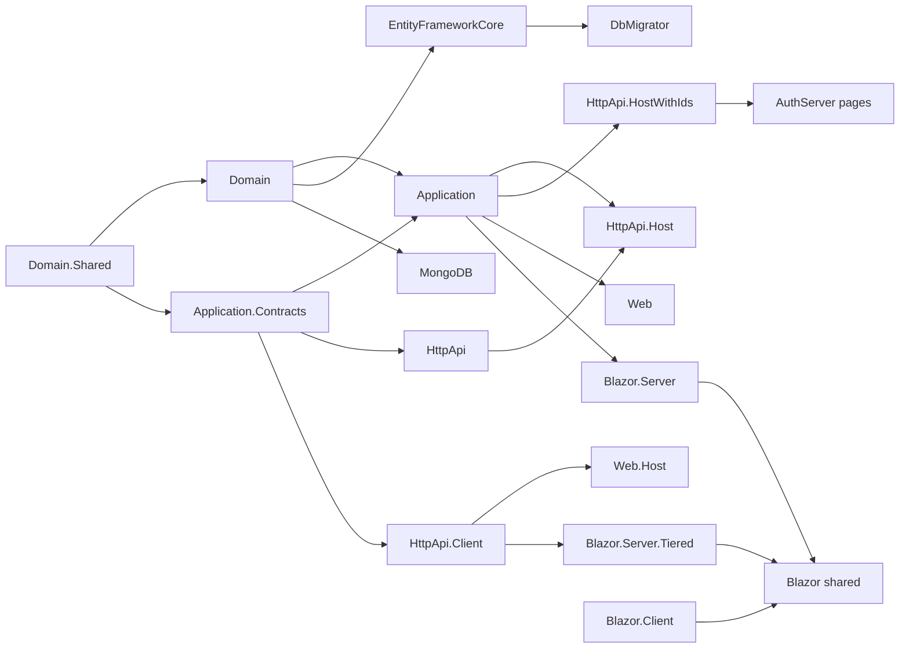

The layered ASP.NET Core template is the most opinionated solution the ABP Framework ships. It lives entirely inside `templates/app/aspnet-core/` and produces a Domain-Driven Design solution with one `MyCompanyName.MyProjectName.slnx` file, twenty-three projects under `src/`, and seven test projects under `test/`. This page enumerates every project, names its module class, and explains what the project depends on.

You can build the template as-is by opening `templates/app/aspnet-core/MyCompanyName.MyProjectName.slnx` in Rider, Visual Studio, or `dotnet`. The CLI hands the user a clone of this exact tree with `MyCompanyName.MyProjectName` rewritten to their chosen name.

## Solution layout

```mermaid
graph TD
    SLN[MyCompanyName.MyProjectName.slnx]
    SLN --> SRC[src/]
    SLN --> TEST[test/]

    SRC --> DS[Domain.Shared]
    SRC --> DOM[Domain]
    SRC --> AC[Application.Contracts]
    SRC --> APP[Application]
    SRC --> HA[HttpApi]
    SRC --> HAC[HttpApi.Client]
    SRC --> EFC[EntityFrameworkCore]
    SRC --> MNG[MongoDB]
    SRC --> DBM[DbMigrator]

    SRC --> AUTH[AuthServer]
    SRC --> HAH[HttpApi.Host]
    SRC --> HAHI[HttpApi.HostWithIds]
    SRC --> WEB[Web]
    SRC --> WEBH[Web.Host]

    SRC --> BZ[Blazor]
    SRC --> BZC[Blazor.Client]
    SRC --> BZS[Blazor.Server]
    SRC --> BZST[Blazor.Server.Tiered]
    SRC --> BWA[Blazor.WebApp]
    SRC --> BWAC[Blazor.WebApp.Client]
    SRC --> BWAT[Blazor.WebApp.Tiered]
    SRC --> BWATC[Blazor.WebApp.Tiered.Client]
```



The CLI keeps only the host projects matching the user's `--ui` and `--tiered` switches — the rest are deleted at generation time. The full source still sits in the repo so every branch is testable.

## Foundation layer

These projects are the bottom of the dependency graph and ship in **every** generated variant.

### `MyCompanyName.MyProjectName.Domain.Shared`

Path: `templates/app/aspnet-core/src/MyCompanyName.MyProjectName.Domain.Shared/`

Holds constants, enums, and localization keys shared across **all** other projects (including HTTP clients running on the browser). The module class `MyProjectNameDomainSharedModule.cs` declares dependencies on every framework `*.DomainShared` module — `AbpAuditLoggingDomainSharedModule`, `AbpIdentityDomainSharedModule`, `AbpOpenIddictDomainSharedModule`, `AbpPermissionManagementDomainSharedModule`, `AbpSettingManagementDomainSharedModule`, `AbpTenantManagementDomainSharedModule`, etc.

It also wires three concerns the rest of the solution depends on:

- `MyProjectNameGlobalFeatureConfigurator.cs` — toggles ABP global features.
- `MyProjectNameModuleExtensionConfigurator.cs` — extends entity properties.
- `Localization/` and `MultiTenancy/` — embedded JSON resources via `AbpVirtualFileSystemOptions.FileSets.AddEmbedded<MyProjectNameDomainSharedModule>()`.

### `MyCompanyName.MyProjectName.Domain`

Path: `templates/app/aspnet-core/src/MyCompanyName.MyProjectName.Domain/`

Contains entities, domain services, repositories interfaces, settings (`Settings/`), seed data (`Data/`), and OpenIddict bootstrap classes (`OpenIddict/`). The module class is `MyProjectNameDomainModule.cs` and the namespace constants live in `MyProjectNameConsts.cs`.

### `MyCompanyName.MyProjectName.Application.Contracts`

Path: `templates/app/aspnet-core/src/MyCompanyName.MyProjectName.Application.Contracts/`

DTOs and `IApplicationService` interfaces. The permissions definitions live under `Permissions/`. The module class `MyProjectNameApplicationContractsModule.cs` is what HTTP clients reference to consume the API. `MyProjectNameDtoExtensions.cs` adds extra properties to ABP module DTOs.

### `MyCompanyName.MyProjectName.Application`

Path: `templates/app/aspnet-core/src/MyCompanyName.MyProjectName.Application/`

Implements the application services. The module class is:

```csharp templates/app/aspnet-core/src/MyCompanyName.MyProjectName.Application/MyProjectNameApplicationModule.cs
[DependsOn(
    typeof(MyProjectNameDomainModule),
    typeof(AbpAccountApplicationModule),
    typeof(MyProjectNameApplicationContractsModule),
    typeof(AbpIdentityApplicationModule),
    typeof(AbpPermissionManagementApplicationModule),
    typeof(AbpTenantManagementApplicationModule),
    typeof(AbpFeatureManagementApplicationModule),
    typeof(AbpSettingManagementApplicationModule)
)]
public class MyProjectNameApplicationModule : AbpModule
{
    public override void ConfigureServices(ServiceConfigurationContext context)
    {
        context.Services.AddMapperlyObjectMapper<MyProjectNameApplicationModule>();
    }
}
```

The mapping registrations live in `MyProjectNameApplicationMappers.cs` and the sample service is `MyProjectNameAppService.cs`.

## HTTP layer

### `MyCompanyName.MyProjectName.HttpApi`

Path: `templates/app/aspnet-core/src/MyCompanyName.MyProjectName.HttpApi/`

Hosts `Controllers/` that wrap the application services for HTTP exposure. The module class is `MyProjectNameHttpApiModule.cs`. It depends on `MyProjectNameApplicationContractsModule` and the framework HTTP API modules of every dependency.

### `MyCompanyName.MyProjectName.HttpApi.Client`

Path: `templates/app/aspnet-core/src/MyCompanyName.MyProjectName.HttpApi.Client/`

A strongly typed C# client built on `Volo.Abp.Http.Client.DynamicProxying`. Console applications, MAUI clients, and tests reference this assembly to call the API without manually crafting HTTP requests. The module is `MyProjectNameHttpApiClientModule.cs`.

## Persistence layer

### `MyCompanyName.MyProjectName.EntityFrameworkCore`

Path: `templates/app/aspnet-core/src/MyCompanyName.MyProjectName.EntityFrameworkCore/`

`EntityFrameworkCore/` contains `MyProjectNameDbContext.cs` and entity configurations. `Migrations/` holds the initial EF Core migration. The module is `MyProjectNameEntityFrameworkCoreModule.cs`. The CLI deletes this project for MongoDB solutions.

### `MyCompanyName.MyProjectName.MongoDB`

Path: `templates/app/aspnet-core/src/MyCompanyName.MyProjectName.MongoDB/`

Counterpart to EF Core. `MongoDb/` holds `MyProjectNameMongoDbContext.cs` and `MongoDbModuleExtensionConfigurator.cs`. The module is `MyProjectNameMongoDbModule.cs`. The CLI deletes this for relational solutions.

### `MyCompanyName.MyProjectName.DbMigrator`

Path: `templates/app/aspnet-core/src/MyCompanyName.MyProjectName.DbMigrator/`

A console host that applies EF migrations and seeds the initial admin user, tenant, and OpenIddict applications. Its `Program.cs` wires `DbMigratorHostedService` and the module class `MyProjectNameDbMigratorModule.cs` depends on the persistence module so it can call `IDataSeeder`.

## Identity / OpenIddict host

### `MyCompanyName.MyProjectName.AuthServer`

Path: `templates/app/aspnet-core/src/MyCompanyName.MyProjectName.AuthServer/`

A separate OpenIddict authorization server, used in **tiered** deployments. It includes login pages under `Pages/`, branding via `MyProjectNameBrandingProvider.cs`, and a static resource pipeline (`package.json` and `abp.resourcemapping.js`). The module class `MyProjectNameAuthServerModule.cs` depends on `AbpAccountWebOpenIddictModule` and ABP Identity UI modules.

<Tip>
In non-tiered Blazor/MVC variants the AuthServer is folded into `MyProjectNameWebModule` or `MyProjectNameHttpApiHostModule` and this project is deleted.
</Tip>

## API host variants

### `MyCompanyName.MyProjectName.HttpApi.Host`

Path: `templates/app/aspnet-core/src/MyCompanyName.MyProjectName.HttpApi.Host/`

Stand-alone HTTP API host with **no embedded identity UI**. Used when an SPA (Angular, Blazor WASM) is the front end and the AuthServer is deployed separately. Module class: `MyProjectNameHttpApiHostModule.cs`.

### `MyCompanyName.MyProjectName.HttpApi.HostWithIds`

Path: `templates/app/aspnet-core/src/MyCompanyName.MyProjectName.HttpApi.HostWithIds/`

Variant of the API host that **also bundles the AuthServer pages and OpenIddict endpoints**. Used in non-tiered SPA scenarios where one process serves both `/connect/token` and `/api/...`. The module class is also `MyProjectNameHttpApiHostModule` (same name, different folder).

## MVC hosts

### `MyCompanyName.MyProjectName.Web`

Path: `templates/app/aspnet-core/src/MyCompanyName.MyProjectName.Web/`

Classic MVC + Razor Pages host. Contains `Pages/`, `Views/`, `Components/`, `Menus/`, plus the static asset pipeline (`package.json`, `abp.resourcemapping.js`, `wwwroot/`). The module class `MyProjectNameWebModule.cs` depends on `MyProjectNameHttpApiModule` and `MyProjectNameApplicationModule`, so this single process serves UI + API in non-tiered MVC mode.

### `MyCompanyName.MyProjectName.Web.Host`

Path: `templates/app/aspnet-core/src/MyCompanyName.MyProjectName.Web.Host/`

Tiered MVC host. Like `.Web` but talks to a **remote** API through `MyProjectNameHttpApiClientModule` rather than referencing the application services directly. The module class is `MyProjectNameWebModule.cs` again. Used when the user picks `--tiered` with `--ui mvc`.

## Blazor Server stack

### `MyCompanyName.MyProjectName.Blazor`

Path: `templates/app/aspnet-core/src/MyCompanyName.MyProjectName.Blazor/`

Contains the shared Blazor `App.razor`, `_Imports.razor`, and `Program.cs`. Module class `MyProjectNameBlazorModule.cs` registers Blazor-specific services. This project is the **shared component library** consumed by every other Blazor host variant.

### `MyCompanyName.MyProjectName.Blazor.Server`

Path: `templates/app/aspnet-core/src/MyCompanyName.MyProjectName.Blazor.Server/`

Classic Blazor Server host (`Microsoft.AspNetCore.Components.Server`). Used for **non-tiered Blazor Server** projects where the same process runs the SignalR circuit, the API, and the AuthServer.

### `MyCompanyName.MyProjectName.Blazor.Server.Tiered`

Path: `templates/app/aspnet-core/src/MyCompanyName.MyProjectName.Blazor.Server.Tiered/`

Tiered variant. Differs from `Blazor.Server` only in that it depends on the HTTP API client rather than the application services. Picked when the user runs `abp new ... --ui blazor-server --tiered`.

## Blazor WebAssembly (legacy)

### `MyCompanyName.MyProjectName.Blazor.Client`

Path: `templates/app/aspnet-core/src/MyCompanyName.MyProjectName.Blazor.Client/`

The standalone Blazor WebAssembly client. Contains `Program.cs`, `Routes.razor`, `MyProjectNameComponentBase.cs`, plus `MyProjectNameBundleContributor.cs` for the static asset bundle. Module class: `MyProjectNameBlazorClientModule.cs`. Used in the `--ui blazor` (WASM-only) flavor where the HTTP API host serves the WASM payload.

## Blazor WebApp (.NET 8+ hybrid)

The four `Blazor.WebApp*` projects implement the **Blazor WebApp** hosting model where the same component tree runs on the server (interactive SSR) and on the client (auto / WebAssembly).

### `MyCompanyName.MyProjectName.Blazor.WebApp`

Path: `templates/app/aspnet-core/src/MyCompanyName.MyProjectName.Blazor.WebApp/`

Server side of the non-tiered WebApp. Hosts `Components/` (Razor components that render server-side), an ASP.NET Core host (`Program.cs`), and `MyProjectNameBlazorModule.cs`. References the application services directly.

### `MyCompanyName.MyProjectName.Blazor.WebApp.Client`

Path: `templates/app/aspnet-core/src/MyCompanyName.MyProjectName.Blazor.WebApp.Client/`

Client side of the non-tiered WebApp — the same components, compiled for WebAssembly. Module class: `MyProjectNameBlazorClientModule.cs`. The WebApp server project loads this assembly to run components in `InteractiveAuto` or `InteractiveWebAssembly` render modes.

### `MyCompanyName.MyProjectName.Blazor.WebApp.Tiered`

Path: `templates/app/aspnet-core/src/MyCompanyName.MyProjectName.Blazor.WebApp.Tiered/`

Tiered variant of the WebApp server. Talks to a remote API + AuthServer rather than embedding them.

### `MyCompanyName.MyProjectName.Blazor.WebApp.Tiered.Client`

Path: `templates/app/aspnet-core/src/MyCompanyName.MyProjectName.Blazor.WebApp.Tiered.Client/`

WebAssembly client matching the tiered WebApp server.

<Note>
At generation time the CLI keeps **exactly one** of the four `Blazor.WebApp*` projects per Blazor.WebApp solution. The full matrix lives in the repo so that the CI can build every variant.
</Note>

## Module dependency cheat sheet



## Test projects

`templates/app/aspnet-core/test/` ships seven test projects so generated solutions begin with a working test pyramid:

| Path | Purpose |
| --- | --- |
| `MyCompanyName.MyProjectName.TestBase` | Shared `TestBase` and seed contributors |
| `MyCompanyName.MyProjectName.Domain.Tests` | Domain service & entity tests |
| `MyCompanyName.MyProjectName.Application.Tests` | Application service tests against EF in-memory + SQLite |
| `MyCompanyName.MyProjectName.EntityFrameworkCore.Tests` | Repository tests bound to SQLite |
| `MyCompanyName.MyProjectName.MongoDB.Tests` | Repository tests bound to MongoDB2Go |
| `MyCompanyName.MyProjectName.HttpApi.Client.ConsoleTestApp` | Console smoke test of the HTTP client |
| `MyCompanyName.MyProjectName.Web.Tests` | Razor/MVC integration tests |

## Shared MSBuild files

The two files at `templates/app/aspnet-core/common.props` and `templates/app/aspnet-core/NuGet.Config` apply to every project in the solution. `common.props` sets `<AbpProjectType>app</AbpProjectType>` (used by the ABP MSBuild tasks) and silences `CS1591`. The `NuGet.Config` ships with empty `<packageSources />` so consumer-side configuration wins.

```xml templates/app/aspnet-core/common.props
<Project>
  <PropertyGroup>
    <LangVersion>latest</LangVersion>
    <Version>1.0.0</Version>
    <NoWarn>$(NoWarn);CS1591</NoWarn>
    <AbpProjectType>app</AbpProjectType>
  </PropertyGroup>
  <Target Name="NoWarnOnRazorViewImportedTypeConflicts" BeforeTargets="RazorCoreCompile">
    <PropertyGroup>
      <NoWarn>$(NoWarn);0436</NoWarn>
    </PropertyGroup>
  </Target>
  <ItemGroup>
    <Content Remove="$(UserProfile)\.nuget\packages\*\*\contentFiles\any\*\*.abppkg*" />
  </ItemGroup>
</Project>
```

## Choosing a variant at `abp new` time

<AccordionGroup>
  <Accordion title="MVC + EF Core (default)">
    Kept projects: `Domain.Shared`, `Domain`, `Application.Contracts`, `Application`, `HttpApi`, `EntityFrameworkCore`, `DbMigrator`, `Web`. `MyCompanyName.MyProjectName.Web/Program.cs` is the only entry point.
  </Accordion>
  <Accordion title="MVC tiered + EF Core">
    Adds `HttpApi.HostWithIds` (or `HttpApi.Host` + `AuthServer`) and `Web.Host` while removing `Web`. `HttpApi.Client` becomes mandatory.
  </Accordion>
  <Accordion title="Blazor WebApp + EF Core">
    Keeps `Blazor.WebApp` (server) and `Blazor.WebApp.Client` (WASM). Drops `Web`, `Blazor.Server`, `Blazor.Client`.
  </Accordion>
  <Accordion title="Angular + EF Core">
    Drops every Blazor and MVC project, keeps `HttpApi.HostWithIds` for non-tiered or `HttpApi.Host` + `AuthServer` for tiered. The Angular workspace ships separately under `templates/app/angular/`.
  </Accordion>
  <Accordion title="MongoDB swap">
    Replaces `EntityFrameworkCore` with `MongoDB`. `DbMigrator` switches its module dependency from `*EntityFrameworkCoreModule` to `*MongoDbModule`.
  </Accordion>
</AccordionGroup>

## Where to look next

- For the Angular SPA that pairs with `HttpApi.HostWithIds`, see [App (Angular)](/templates/app-template-angular).
- For a much smaller starting point with no DDD layering, see [App No-Layers](/templates/app-nolayers).
- For module authoring whose project list mirrors this layered structure, see [Module](/templates/module-template).
