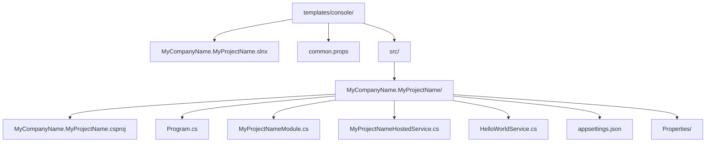
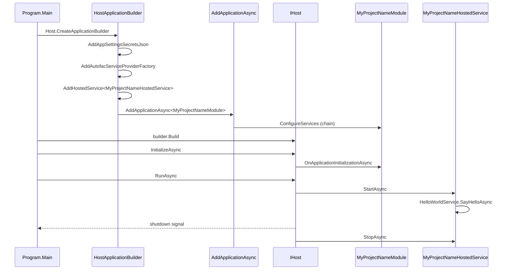

The console template is the smallest ABP Framework solution that still benefits from modularity. It ships exactly one project at `templates/console/src/MyCompanyName.MyProjectName/MyCompanyName.MyProjectName.csproj`, wires a `Microsoft.Extensions.Hosting` generic host, and runs a sample `IHostedService` against an injected service. The CLI invocation is `abp new MyCompany.MyProject -t console`.

This template is the recommended starting point for **batch workers**, **cron jobs**, **CLI utilities**, and **one-shot migration tools** that need ABP modularity (DI, configuration, virtual file system, options pattern) but not an HTTP surface.

## Solution layout



The entire template fits in five C# files plus `appsettings.json`. Every file is referenced by a real path below.

## `MyCompanyName.MyProjectName.slnx`

Path: `templates/console/MyCompanyName.MyProjectName.slnx`

A minimal solution file containing the single project under `src/`. It also references the test infrastructure in the consuming repository, but no test project is shipped — adding tests is left to the consumer.

## `common.props`

Path: `templates/console/common.props`

Sets the `<AbpProjectType>console</AbpProjectType>` MSBuild property. The ABP MSBuild tasks (from `Volo.Abp.Cli.Sdk`) use this value to decide which packaging conventions to apply when the project is published as an ABP module.

## The project file

Path: `templates/console/src/MyCompanyName.MyProjectName/MyCompanyName.MyProjectName.csproj`

```xml templates/console/src/MyCompanyName.MyProjectName/MyCompanyName.MyProjectName.csproj
<Project Sdk="Microsoft.NET.Sdk">

    <Import Project="..\..\common.props" />

    <PropertyGroup>
        <OutputType>Exe</OutputType>
        <TargetFramework>net10.0</TargetFramework>
        <Nullable>enable</Nullable>
    </PropertyGroup>

    <ItemGroup>
        <ProjectReference Include="..\..\..\..\framework\src\Volo.Abp.Autofac\Volo.Abp.Autofac.csproj" />
    </ItemGroup>

    <ItemGroup>
      <PackageReference Include="Microsoft.Extensions.Hosting" Version="10.0.7" />
      <PackageReference Include="Serilog.Extensions.Hosting" Version="9.0.0" />
      <PackageReference Include="Serilog.Extensions.Logging" Version="9.0.2" />
      <PackageReference Include="Serilog.Sinks.Async" Version="2.1.0" />
      <PackageReference Include="Serilog.Sinks.Console" Version="6.0.0" />
      <PackageReference Include="Serilog.Sinks.File" Version="7.0.0" />
    </ItemGroup>

    <ItemGroup>
        <Content Include="appsettings.json">
            <CopyToPublishDirectory>PreserveNewest</CopyToPublishDirectory>
            <CopyToOutputDirectory>Always</CopyToOutputDirectory>
        </Content>
        <Content Include="appsettings.secrets.json" Condition="Exists('appsettings.secrets.json')">
            <CopyToPublishDirectory>PreserveNewest</CopyToPublishDirectory>
            <CopyToOutputDirectory>Always</CopyToOutputDirectory>
        </Content>
    </ItemGroup>

</Project>
```

Key choices:

- `<OutputType>Exe</OutputType>` and `<TargetFramework>net10.0</TargetFramework>` — pure .NET 10 console.
- `<Nullable>enable</Nullable>` — opt-in to nullable reference types from the first build.
- The project references `Volo.Abp.Autofac` directly via a relative `ProjectReference` because the templates live inside the framework repo. The CLI rewrites this to a `PackageReference` at generation time.
- Six Serilog packages plus `Microsoft.Extensions.Hosting` — the bare minimum for an ABP console.
- `appsettings.secrets.json` is conditionally included so user secrets can be added without modifying the `.csproj`.

## `Program.cs`

Path: `templates/console/src/MyCompanyName.MyProjectName/Program.cs`

The entry point combines Serilog, Autofac, and ABP's hosting extension:

```csharp templates/console/src/MyCompanyName.MyProjectName/Program.cs
public class Program
{
    public async static Task<int> Main(string[] args)
    {
        Log.Logger = new LoggerConfiguration()
#if DEBUG
            .MinimumLevel.Debug()
#else
            .MinimumLevel.Information()
#endif
            .MinimumLevel.Override("Microsoft", LogEventLevel.Information)
            .Enrich.FromLogContext()
            .WriteTo.Async(c => c.File("Logs/logs.txt"))
            .WriteTo.Async(c => c.Console())
            .CreateLogger();

        try
        {
            Log.Information("Starting console host.");

            var builder = Host.CreateApplicationBuilder(args);

            builder.Configuration.AddAppSettingsSecretsJson();
            builder.Logging.ClearProviders().AddSerilog();

            builder.ConfigureContainer(builder.Services.AddAutofacServiceProviderFactory());

            builder.Services.AddHostedService<MyProjectNameHostedService>();

            await builder.Services.AddApplicationAsync<MyProjectNameModule>();

            var host = builder.Build();

            await host.InitializeAsync();

            await host.RunAsync();

            return 0;
        }
        catch (Exception ex)
        {
            if (ex is HostAbortedException)
            {
                throw;
            }

            Log.Fatal(ex, "Host terminated unexpectedly!");
            return 1;
        }
        finally
        {
            Log.CloseAndFlush();
        }
    }
}
```

Walking through it step by step:

1. **Serilog setup** runs before anything else so failures during the builder phase get logged to `Logs/logs.txt` and the console.
2. `Host.CreateApplicationBuilder(args)` produces the modern `HostApplicationBuilder` (not the legacy `HostBuilder`).
3. `builder.Configuration.AddAppSettingsSecretsJson()` is an ABP extension that registers `appsettings.secrets.json` as an optional configuration source. The extension lives in `framework/src/Volo.Abp.Core/`.
4. `builder.ConfigureContainer(builder.Services.AddAutofacServiceProviderFactory())` swaps the default DI container for Autofac, which is required by ABP's dynamic interception and property injection.
5. `builder.Services.AddHostedService<MyProjectNameHostedService>()` registers the sample hosted service.
6. `builder.Services.AddApplicationAsync<MyProjectNameModule>()` bootstraps the ABP module graph rooted at `MyProjectNameModule`. This is the call that wires the modularity primitives.
7. `host.InitializeAsync()` runs every module's `OnApplicationInitializationAsync` hook.
8. `host.RunAsync()` blocks until the host shuts down.

The `HostAbortedException` check is important: ABP's `dotnet ef migrations add` scaffolding triggers a controlled abort that should propagate.

## `MyProjectNameModule.cs`

Path: `templates/console/src/MyCompanyName.MyProjectName/MyProjectNameModule.cs`

The module class has a single dependency and a single override:

```csharp templates/console/src/MyCompanyName.MyProjectName/MyProjectNameModule.cs
[DependsOn(
    typeof(AbpAutofacModule)
)]
public class MyProjectNameModule : AbpModule
{
    public override Task OnApplicationInitializationAsync(ApplicationInitializationContext context)
    {
        var logger = context.ServiceProvider.GetRequiredService<ILogger<MyProjectNameModule>>();
        var configuration = context.ServiceProvider.GetRequiredService<IConfiguration>();
        logger.LogInformation($"MySettingName => {configuration["MySettingName"]}");

        var hostEnvironment = context.ServiceProvider.GetRequiredService<IHostEnvironment>();
        logger.LogInformation($"EnvironmentName => {hostEnvironment.EnvironmentName}");

        return Task.CompletedTask;
    }
}
```

The `[DependsOn(typeof(AbpAutofacModule))]` attribute is the **only** required dependency. Because `Program.cs` already calls `AddAutofacServiceProviderFactory()`, this dependency is what plugs Autofac's container into ABP's module loader.

The `OnApplicationInitializationAsync` override is a demonstration: it reads `MySettingName` from `appsettings.json` and logs the current environment, proving the configuration pipeline is alive.

## `MyProjectNameHostedService.cs`

Path: `templates/console/src/MyCompanyName.MyProjectName/MyProjectNameHostedService.cs`

The hosted service implements `IHostedService`:

```csharp templates/console/src/MyCompanyName.MyProjectName/MyProjectNameHostedService.cs
public class MyProjectNameHostedService : IHostedService
{
    private readonly HelloWorldService _helloWorldService;

    public MyProjectNameHostedService(HelloWorldService helloWorldService)
    {
        _helloWorldService = helloWorldService;
    }

    public async Task StartAsync(CancellationToken cancellationToken)
    {
        await _helloWorldService.SayHelloAsync();
    }

    public Task StopAsync(CancellationToken cancellationToken)
    {
        return Task.CompletedTask;
    }
}
```

It takes `HelloWorldService` via constructor injection. The service is resolved from ABP's container (which is also the generic host's container after the `AddApplication` call), so any `ITransientDependency`, `IScopedDependency`, or `ISingletonDependency` you register in your module is automatically reachable.

<Tip>
For long-running jobs, prefer `BackgroundService` (from `Microsoft.Extensions.Hosting`) over `IHostedService`. The template uses `IHostedService` because the sample workload completes immediately.
</Tip>

## `HelloWorldService.cs`

Path: `templates/console/src/MyCompanyName.MyProjectName/HelloWorldService.cs`

```csharp templates/console/src/MyCompanyName.MyProjectName/HelloWorldService.cs
public class HelloWorldService : ITransientDependency
{
    public ILogger<HelloWorldService> Logger { get; set; }

    public HelloWorldService()
    {
        Logger = NullLogger<HelloWorldService>.Instance;
    }

    public Task SayHelloAsync()
    {
        Logger.LogInformation("Hello World!");
        return Task.CompletedTask;
    }
}
```

Demonstrates **property injection** for the logger. The `NullLogger<>.Instance` default lets the class be instantiated without a real `ILoggerFactory` — Autofac then overwrites the property at resolution time. Property injection is one of the main reasons the template wires Autofac instead of using the default Microsoft container.

The `: ITransientDependency` marker interface registers the service as transient with the ABP convention-based registrar. No `services.AddTransient<HelloWorldService>()` line is needed.

## `appsettings.json`

Path: `templates/console/src/MyCompanyName.MyProjectName/appsettings.json`

```json templates/console/src/MyCompanyName.MyProjectName/appsettings.json
{
  "MySettingName": "MySettingValue"
}
```

Intentionally minimal so the template demonstrates the configuration pipeline without dictating a structure.

## Lifecycle in one picture



The diagram makes one subtle point explicit: `OnApplicationInitializationAsync` runs **before** `StartAsync`. Anything the hosted service relies on (cached settings, seeded data, opened connections) should be initialized in the module hook, not in the hosted service.

## Adding more dependencies

To wire a database, message broker, or HTTP client, add `[DependsOn]` entries to `MyProjectNameModule`:

```csharp templates/console/src/MyCompanyName.MyProjectName/MyProjectNameModule.cs
[DependsOn(
    typeof(AbpAutofacModule),
    typeof(AbpEntityFrameworkCoreSqlServerModule),     // for SQL Server
    typeof(AbpHttpClientModule),                        // for HTTP client proxies
    typeof(AbpBackgroundJobsHangfireModule)             // for background jobs
)]
```

The new modules will be discovered by ABP's module loader during `AddApplicationAsync` — no further wiring in `Program.cs` is required.

## Comparison with other templates

<Tabs>
  <Tab title="Console vs DbMigrator">
    The layered template's `MyCompanyName.MyProjectName.DbMigrator` (under `templates/app/aspnet-core/src/MyCompanyName.MyProjectName.DbMigrator/`) has the same shape: `Program.cs` + `DbMigratorHostedService` + a module class. The console template generalizes that pattern to non-migration workloads.
  </Tab>
  <Tab title="Console vs HTTP API host">
    `Program.cs` for the console uses `Host.CreateApplicationBuilder`. The HTTP API hosts use `WebApplication.CreateBuilder` and never register an `IHostedService`. Their entry points serve HTTP rather than running batch work.
  </Tab>
  <Tab title="Console vs MAUI">
    The MAUI template (`templates/maui/`) uses `MauiApp.CreateBuilder` and `AbpAutofacServiceProviderFactory` directly. The console template's `Host.CreateApplicationBuilder` is closer to the WPF template (`templates/wpf/`) which uses `AbpApplicationFactory` from `App.xaml.cs`.
  </Tab>
</Tabs>

## Where to look next

- For the layered application this console is often paired with, see [App (.NET)](/templates/app-template-aspnetcore).
- For a similar single-process host that drives a XAML UI, see [WPF](/templates/wpf-template) and [MAUI](/templates/maui-template).
- For the packaging script that wraps this template into `console-<version>.zip`, see the [Overview](/templates/overview#packaging-with-zip-templatesps1).
